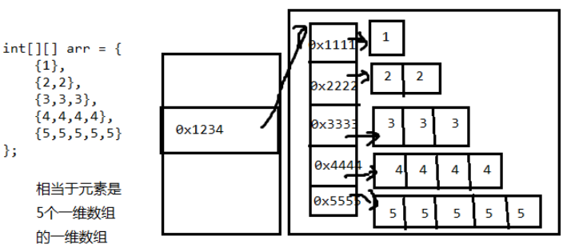
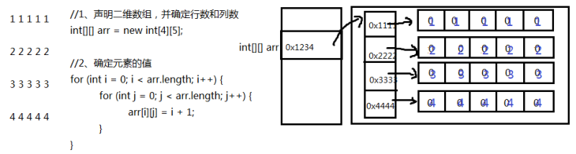

# 二维数组

## 二维数组的声明与初始化

##### 声明语法格式

```java
//推荐
元素的数据类型[][] 二维数组的名称;
//不推荐
元素的数据类型  二维数组名[][];
//不推荐
元素的数据类型[]  二维数组名[];

//声明一个二维数组
int[][] arr;
```

#### 静态初始化

程序员给定元素初始值，由系统决定数组长度

```java
//1.先声明，再静态初始化
元素的数据类型[][] 二维数组名;
二维数组名 = new 元素的数据类型[][]{
            {元素1，元素2，元素3 。。。}, 
            {第二行的值列表},
            ...
            {第n行的值列表}};
//2.声明并同时静态初始化
元素的数据类型[][] 二维数组名 = new 元素的数据类型[][]{
            {元素1，元素2，元素3 。。。}, 
            {第二行的值列表},
            ...
            {第n行的值列表}
        };
        
//3.声明并同时静态初始化的简化写法
元素的数据类型[][] 二维数组的名称 = {
            {元素1，元素2，元素3 。。。}, 
            {第二行的值列表},
            ...
            {第n行的值列表}
        };
```

#### 动态初始化（规则二维表）

程序员指定数组的长度，后期再赋值（系统会先给定元素默认初始值）

规则二维表：每一行的列数是相同的

```java
//（1）确定行数和列数
元素的数据类型[][] 二维数组名 = new 元素的数据类型[m][n];
    m:表示这个二维数组有多少个一维数组。或者说一共二维表有几行
    n:表示每一个一维数组的元素有多少个。或者说每一行共有一个单元格
//此时创建完数组，行数、列数确定，而且元素也都有默认值
//（2）再为元素赋新值
二维数组名[行下标][列下标] = 值;
```

##### 示例

```java
public static void main(String[] args) {
    //定义一个二维数组
    int[][] arr = new int[3][2];
    
    //定义了一个二维数组arr
    //这个二维数组有3个一维数组的元素
    //每一个一维数组有2个元素
    //输出二维数组名称
    System.out.println(arr); //地址值  [[I@175078b
    
    //输出二维数组的第一个元素一维数组的名称
    System.out.println(arr[0]); //地址值   [I@42552c
    System.out.println(arr[1]); //地址值   [I@e5bbd6
    System.out.println(arr[2]); //地址值   [I@8ee016
    
    //输出二维数组的元素
    System.out.println(arr[0][0]); //0
    System.out.println(arr[0][1]); //0
    
    //...
}
```

#### 动态初始化（不规则二维表）

不规则二维表：每一行的列数可能不一样

```java
//（1）先确定总行数
元素的数据类型[][] 二维数组名 = new 元素的数据类型[总行数][];
//此时只是确定了总行数，每一行里面现在是null
//（2）再确定每一行的列数，创建每一行的一维数组
二维数组名[行下标] = new 元素的数据类型[该行的总列数];
//此时已经new完的行的元素就有默认值了，没有new的行还是null
//(3)再为元素赋值
二维数组名[行下标][列下标] = 值;
```

##### 示例

```java
public static void main(String[] args) {
    int[][] arr = new int[3][]; //定义数组

    System.out.println(arr);    //[[I@175078b

    System.out.println(arr[1][0]);//NullPointerException
    System.out.println(arr[0]); //null
    System.out.println(arr[1]); //null
    System.out.println(arr[2]); //null

    //动态的为每一个一维数组分配空间
    arr[0] = new int[2];
    arr[1] = new int[3];
    arr[2] = new int[1];

    System.out.println(arr[0]); //[I@42552c
    System.out.println(arr[1]); //[I@e5bbd6
    System.out.println(arr[2]); //[I@8ee016

    System.out.println(arr[0][0]); //0
    System.out.println(arr[0][1]); //0
    //ArrayIndexOutOfBoundsException
    //System.out.println(arr[0][2]); //错误

    arr[1][0] = 100;
    arr[1][2] = 200;
}
```

##### 二维数组的遍历

```java
for(int i=0; i<二维数组名.length; i++){
    for(int j=0; j<二维数组名[i].length; j++){
        System.out.print(二维数组名[i][j]);
    }
    System.out.println();
}
```


## 二维数组的内存图分析

#### 示例1

```java
int[][] arr = {
            {1},
            {2,2},
            {3,3,3},
            {4,4,4,4},
            {5,5,5,5,5}
        };
```



#### 示例2

```
//1、声明二维数组，并确定行数和列数
int[][] arr = new int[4][5];

//2、确定元素的值
for (int i = 0; i < arr.length; i++) {
    for (int j = 0; j < arr.length; j++) {
        arr[i][j] = i + 1;
    }
}
```

