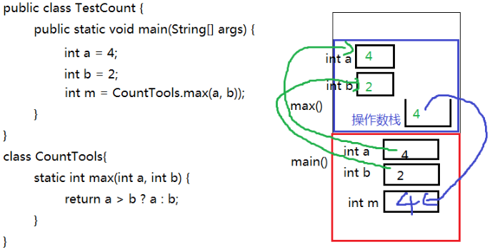
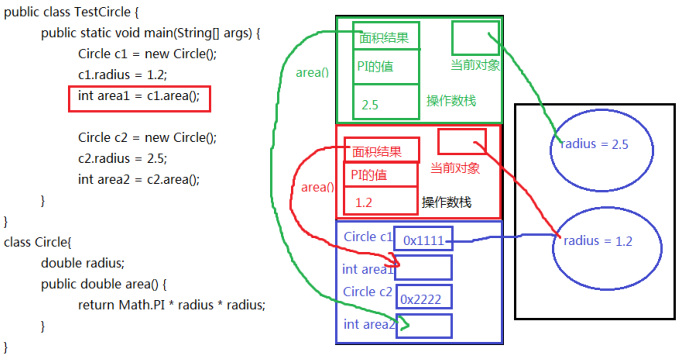

# 类的描述（方法,成员变量）

## 成员变量

#### 变量的分类  

根据定义位置不同分为：

-   局部变量：定义在方法体内或其他局部区域内的变量（之前所使用的都是main方法中定义的变量，为局部变量）。
-   成员变量：定义在类的成员位置，在方法体外，与方法（例如main方法）平行的位置。并且有修饰符修饰。


根据修饰的不同成员变量又分为：

-   类变量：或叫静态变量，有static修饰的成员变量。（上例中的country为类变量）

-   实例变量：没有static修饰的成员变量。

    

#### 成员变量的声明

##### 语法格式：

```java
class 类名{
    【修饰符】 数据类型  属性名;    //属性有默认值
    【修饰符】 数据类型  属性名 = 值; //属性有初始值
}
```

>   说明：常用修饰符有public、缺省、private、protected、final、static
>
>   数据类型可以是任意基本数据类型和引用数据类型。
>
>   属性名即变量名，符合标识符的命名规则和规范。

##### 举例：

```java
//定义一个中国人类
class Chinese{
    public static String country;
    public String name;
    char gender = '男';//显式赋值
    private int age;
}
```

#### 成员变量的访问

-   实例变量的访问：

    对象名.静态成员变量

-   类变量的访问：

    类名.静态成员变量

    对象名.静态成员变量（不推荐）

##### 示例：

```java
public class TestChinese {
    public static void main(String[] args) {
        //类名.静态成员变量
        System.out.println(Chinese.country);
        //错误，非静态成员变量必须通过对象.进行访问
//      System.out.println(Chinese.name);
        
        Chinese c1 = new Chinese();
        //对象名.非静态成员变量
        System.out.println(c1.name);
        //静态的成员变量也可以通过对象.进行访问
        //对象名.非静态成员变量
        System.out.println(c1.country);
        System.out.println(c1.gender);
    }
}
class Chinese{
    static String country;String name;
    char gender = '男';
}
```

#### 成员变量的特点

1.  成员变量有默认初始值


2.  类变量的值是所有对象共享的，而实例变量的值是每个对象独立的

```java
public class TestChinese {
    public static void main(String[] args) {
        Chinese c1 = new Chinese();
        Chinese c2 = new Chinese();
        
        c1.name = "张三";
        c2.name = "李四";
        c2.gender = '女';
        
//      c1.country = "中国";
        Chinese.country = "中国";//推荐
        
        System.out.println("c1.country = " + c1.country + ",c1.name = " + 
c1.name + ",c1.gender = " + c1.gender);
        System.out.println("c2.country = " + c2.country + ",c2.name = " + 
c2.name + ",c2.gender = " + c2.gender);
    }   
}
class Chinese{
    static String country;
    String name;
    char gender = '男';
}
```

#### 成员变量的内存分析

以下面为例

```java
class Test08FieldSave{
    public static void main(String[] args){
        Chinese c1 = new Chinese();
        Chinese c2 = new Chinese();
        c1.name = "张三";
        c2.name = "李四";System.out.println(c1.country+“--”+c1.name);
        System.out.println(c2.country+“--”+c2.name);
        System.out.println("-------------------------");
        //修改类变量值
        c1.country = "中华人民共和国";
        //修改实例变量
        c1.name="张三丰";
        System.out.println(c1.country+“--”+c1.name);
        System.out.println(c2.country+“--”+c2.name);
        System.out.println(Chinese.country);
    }
}
class Chinese{
    static String country = "中国";
    String name;
}
```


#### 成员变量与局部变量的区别


#### 成员变量的赋值

成员变量有默认值,上面已经说过

##### 显式赋值

```java
public class Student{
    public static final String COUNTRY = "中华人民共和国";
    private static String school = "尚硅谷";
    private String name;
    private char gender = '男';
}
```

#### 代码块

静态初始化块：在类初始化时由类加载器调用执行，每一个类的静态初始化只会执行一次，早于实例对象的创建。

实例初始化块：每次new实例对象时自动执行，每new一个对象，执行一次。

-   ##### 静态初始化块：为静态变量初始化

```java
【修饰符】 class 类名{
    static{
        静态初始化
    }
}
```

-   ##### 实例初始化块：为实例变量初始化

```java
【修饰符】 class 类名{
    {
        实例初始化块
    }
}
```

#### 构造器

使用构造器，在new对象时由对象的创建者决定为当前对象的实例变量赋什么值。

>   注意：构造器只为实例变量初始化，不为静态类变量初始化

为实例变量初始化，再new对象时由对象的创建者决定为当前对象的实例变量赋什么值。


## 方法

成员变量是用来存储对象的数据信息的，那么如何表示对象的行为功能呢？就要通过方法来实现

#### 方法的概念  

方法也叫函数，是一个独立功能的定义，是一个类中最基本的功能单元。

把一个功能封装为方法的目的是，可以实现代码重用，从而简少代码量。

#### 成员方法的分类  

根据修饰不同方法主要分为两类：

实例方法：没有static修饰的方法，必须通过实例对象来调用。

静态方法：有static修饰的方法，也叫类方法，主要特点是可以由类名来调用。

#### 方法的声明  

1.  方法声明的位置必须在类中方法外
2.  ##### 语法格式

```
【修饰符】 返回值类型 方法名(【参数列表：参数类型1 参数名1,参数类型2 参数名, ...... 】)
{
        方法体；
        【return 返回值;】
}
```

3.  格式说明：

-   -   修饰符： 修饰符后面详细讲，例如：public，static等都是修饰符
    -   返回值类型： 表示方法运行的结果的数据类型，与”return 返回值“搭配使用

-   -   -   无返回值：void
        -   有返回值：可以是任意基本数据类型和引用数据类型

-   -   方法名：给方法起一个名字，要符合标识符的命名规则，尽量见名知意，能准确代表该方法功能的名字
    -   参数列表：方法内部需要用到其他方法中的数据，需要通过参数传递的形式将数据传递过
    -   来，可以是基本数据类型、引用数据类型、也可以没有参数，什么都不写
    -   方法体：特定功能的代码
    -   return：结束方法，可以返回方法的运行结果

-   -   -   可以返回不同类型的数据，对应匹配的返回值类型。
        -   如果方法无返回值，可以省去return，并且返回值类型为void

##### 简单示例

```java
public class Person {
    
    public void hello(){
        System.out.println("hello world");
    }
}
```

#### 方法的调用

方法必须先声明后使用，不调用不执行，调用一次执行一次。

1.  实例方法的调用

对象名.实例方法(【实参列表】)

```java
public class TestCircle {
    public static void main(String[] args) {
        Circle c1 = new Circle();
        c1.radius = 1.2;
        System.out.println("c1的面积：" + c1.area());//非静态方法只能通过"对象."进行访问
//      System.out.println("c1的面积：" + Circle.area());
        
        Circle c2 = new Circle();
        c2.radius = 2.5;
        System.out.println("c2的面积：" + c2.area());
    }
}
class Circle{
    double radius;
    public double area() {
        return Math.PI * radius * radius;
    }
}
```

2.  类方法（静态方法）的调用

    类名.类方法(【实参列表】)

    对象名.类方法(【实参列表】) （不推荐）

    示例：

```java
public class TestCount {
    public static void main(String[] args) {
        System.out.println(CountTools.max(4, 1));
        
        //静态方法也可以通过“对象.”访问，就是麻烦点
        CountTools c = new CountTools();
        System.out.println(c.max(2, 5));
    }
}
class CountTools{
    static int max(int a, int b) {
        return a > b ? a : b;
    }
}
```

3.  形参与实参的概念理解

-   -   形参：在定义方法时方法名后面括号中声明的变量称为形式参数（简称形参）即形参出现在方法定义时。
    -   实参：调用方法时方法名后面括号中的使用的值/变量/表达式称为实际参数（简称实参）即实参出现在方法调用时。

4.  方法调用的注意事项

-   -   调用方法时，实参的个数、类型、顺序必须要与形参列表一一对应
    -   调用方法时，如果方法有返回值，可以用与返回值类型相同的变量接受或直接处理返回值结果，如果方法的返回值类型是void，不需要也不能接收和处理返回值结果。

#### 本类内的成员变量和方法访问

直接用，不需要加“对象名."和"类名."

**例外情况**：静态方法中不能直接访问本类的非静态的成员变量和成员方法

#### 方法调用内存分析

方法不调用不执行，调用一次执行一次，每次调用会在栈中有一个入栈动作，即给当前方法开辟一块独立的内存区域，用于存储当前方法的局部变量的值，当方法执行结束后，会释放该内存，称为出栈，如果方法有返回值，就会把结果返回调用处，如果没有返回值，就直接结束，回到调用处继续执行下一条指令。

**栈结构特点**：先进后出，后进先出。

##### 示例一：

```java
public class TestCount {
    public static void main(String[] args) {
        int a = 4;
        int b = 2;
        int m = CountTools.max(a, b));
    }
}
class CountTools{
    static int max(int a, int b) {
        return a > b ? a : b;
    }
}
```



##### 示例二：

```java
public class TestCircle {
    public static void main(String[] args) {
        Circle c1 = new Circle();
        c1.radius = 1.2;
        int area1 = c1.area();
        
        Circle c2 = new Circle();
        c2.radius = 2.5;
        int area2 = c2.area();
    }
}
class Circle{
    double radius;
    public double area() {
        return Math.PI * radius * radius;
    }
}
```



##### 示例三：

```java
public class Test {
    public static void main(String[] args) {
        int[] arr = {2,4,1,5,3};
        
        ArrayUtil.sort(arr);
        
        for (int i = 0; i < arr.length; i++) {
            System.out.println(arr[i]);
        }
    }
}
class ArrayUtil{
    public static void sort(int[] arr){
        for (int i = 1; i < arr.length; i++) {
            for (int j = 0; j < arr.length - i; j++) {
                if(arr[j] > arr[j+1]){
                    int temp = arr[j];
                    arr[j] = arr[j+1];
                    arr[j+1] = temp;
                }
            }
        }
    }
}
```


#### 方法参数的值传递机制

方法的参数传递机制：实参给形参赋值

-   方法的形参是基本数据类型时，形参值的改变不会影响实参；
-   方法的形参是引用数据类型时，形参地址值的改变不会影响实参，但是形参地址值里面的数据的改变会影响实参，例如，修改数组元素的值，或修改对象的属性值。

注意：String、Integer等特殊类型容易错


## 可变参数

在JDK1.5之后，如果我们定义一个方法时，此时某个形参的类型可以确定，但是形参的个数不确定，那

么我们可以使用可变参数。

格式： `【修饰符】 返回值类型 方法名(【非可变参数部分的形参列表,】参数类型... 形参名){  }` 

>   注意：
>
>   （1）一个方法最多只能有一个可变参数
>
>   （2）如果一个方法包含可变参数，那么可变参数必须是形参列表的最后一个

##### 示例： 求n个整数的和

```java
public class ChangeArgs {
    public static void main(String[] args) {
        int[] arr = { 1, 4, 62, 431, 2 };
        int sum1 = getSum1(arr);
        System.out.println(sum1);
        int sum2 = getSum2(arr);
        System.out.println(sum2);
        int sum3 = getSum2(1, 4, 62, 431, 2);
        System.out.println(sum3);
    }
    // 完成数组 所有元素的求和
    // 原始写法
    public static int getSum1(int[] arr) {
        int sum = 0;
        for (int i = 0; i < arr.length; i++) {
            sum += arr[i];
        }
        return sum;
    }
    // 可变参数写法
    public static int getSum2(int... arr) {
        int sum = 0;
        for (int i = 0; i < arr.length; i++) {
            sum += arr[i];
        }
        return sum;
    }
}
```


## 方法重载

方法重载：指在同一个类中，允许存在一个以上的同名方法，只要它们的参数列表不同即可，与修饰符和返回值类型无关。(**方法签名不同**)

参数列表不同：指的是参数个数不同，数据类型不同，数据类型顺序不同。


## 类的初始化

1.  类初始化的目的：为类中的静态变量进行赋值。
2.  实际上，类初始化的过程时在调用一个()方法，而这个方法是编译器自动生成的。编译器会将如下两部分的所有代码，按顺序合并到类初始化()方法体中。

-   -   静态类成员变量的显式赋值语句
    -   静态代码块中的语句

3.  整个类初始化只会进行一次，如果子类初始化时，发现父类没有初始化，那么会先初始化父类。

##### 示例

```java
public class Test{
    public static void main(String[] args){
        Son.test();
        System.out.println("-----------------------------");
        Son.test();
    }
}
class Father{
    private static int a = getNumber();
    static{
        System.out.println("Father(1)");
    }
    private static int b = getNumber();
    static{
        System.out.println("Father(2)");
    }public static int getNumber(){
        System.out.println("Father:getNumber()");
        return 1;
    }
}
class Son extends Father{
    private static int a = getNumber();
    static{
        System.out.println("Son(1)");
    }
    private static int b = getNumber();
    static{
        System.out.println("Son(2)");
    }
    
    public static int getNumber(){
        System.out.println("Son:getNumber()");
        return 1;
    }
    
    public static void test(){
        System.out.println("Son:test()");
    }   
}
```

运行结果: 

```java
Father:getNumber()
Father(1)
Father:getNumber()
Father(2)
Son:getNumber()
Son(1)
Son:getNumber()
Son(2)
Son:test()
-----------------------------
Son:test()
```


## 实例初始化

1.   实例初始化的目的：为类中非静态成员变量赋值
2.   实际上我们编写的代码在编译时，会自动处理代码，整理出一个()的类初始化方法，还会整理出一个或多个的(...)实例初始化方法。一个类有几个实例初始化方法，由这个类有几个构造器决定。

实例初始化方法的方法体，由四部分构成：

（1）super()或super(实参列表) 这里选择哪个，看原来构造器首行是哪句，没写，默认就是super()

（2）非静态实例变量的显示赋值语句

（3）非静态代码块

（4）对应构造器中的代码

特别说明：其中（2）和（3）是按顺序合并的，（1）一定在最前面（4）一定在最后面

3.  执行特点：

-   -   创建对象时，才会执行
    -   每new一个对象，都会完成该对象的实例初始化
    -   调用哪个构造器，就是执行它对应的实例初始化方法
    -   创建子类对象时，父类对应的实例初始化会被先执行，执行父类哪个实例初始化方法，看用super()还是super(实参列表)

##### 示例代码1：单个类

```java
public class Test{
    public static void main(String[] args){
        Father f1 = new Father();
        Father f2 = new Father("atguigu");
    }
}
class Father{
    private int a = getNumber();
    private String info;
    {
        System.out.println("Father(1)");
    }
    Father(){
        System.out.println("Father()无参构造");
    }
    Father(String info){
        this.info = info;
        System.out.println("Father(info)有参构造");
    }
    private int b = getNumber();
    {
        System.out.println("Father(2)");
    }
    
    public int getNumber(){
        System.out.println("Father:getNumber()");
        return 1;
    }
}
// 运行结果：
// Father:getNumber()
// Father(1)
// Father:getNumber()
// Father(2)
// Father()无参构造
// Father:getNumber()
// Father(1)
// Father:getNumber()
// Father(2)
// Father(info)有参构造
```


##### 示例代码2：父子类

```java
public class Test{
    public static void main(String[] args){
        Son s1 = new Son();
        System.out.println("-----------------------------");
        Son s2 = new Son("atguigu");
    }
}
class Father{
    private int a = getNumber();
    private String info;
    {
        System.out.println("Father(1)");
    }
    Father(){
        System.out.println("Father()无参构造");
    }
    Father(String info){
        this.info = info;
        System.out.println("Father(info)有参构造");
    }
    private int b = getNumber();
    {
        System.out.println("Father(2)");
    }
    
    public static int getNumber(){
        System.out.println("Father:getNumber()");
        return 1;
    }
}
class Son extends Father{
    private int a = getNumber();
    {
        System.out.println("Son(1)");
    }
    private int b = getNumber();
    {
        System.out.println("Son(2)");}
    public Son(){
        System.out.println("Son()：无参构造");
    }
    public Son(String info){
        super(info);
        System.out.println("Son(info)：有参构造");
    }
    public static int getNumber(){
        System.out.println("Son:getNumber()");
        return 1;
    }
}
运行结果：
Father:getNumber()
Father(1)
Father:getNumber()
Father(2)
Father()无参构造
Son:getNumber()
Son(1)
Son:getNumber()
Son(2)
Son()：无参构造
-----------------------------
Father:getNumber()
Father(1)
Father:getNumber()
Father(2)
Father(info)有参构造
Son:getNumber()
Son(1)
Son:getNumber()
Son(2)
Son(info)：有参构造
```

##### 示例代码3：父子类，方法有重写

```java
public class Test{
    public static void main(String[] args){
        Son s1 = new Son();
        System.out.println("-----------------------------");
        Son s2 = new Son("atguigu");
    }
}
class Father{
    private int a = getNumber();
    private String info;
    {
        System.out.println("Father(1)");
    }
    Father(){
        System.out.println("Father()无参构造");
    }
    Father(String info){this.info = info;
        System.out.println("Father(info)有参构造");
    }
    private int b = getNumber();
    {
        System.out.println("Father(2)");
    }
    
    public int getNumber(){
        System.out.println("Father:getNumber()");
        return 1;
    }
}
class Son extends Father{
    private int a = getNumber();
    {
        System.out.println("Son(1)");
    }
    private int b = getNumber();
    {
        System.out.println("Son(2)");
    }
    public Son(){
        System.out.println("Son()：无参构造");
    }
    public Son(String info){
        super(info);
        System.out.println("Son(info)：有参构造");
    }
    public int getNumber(){
        System.out.println("Son:getNumber()");
        return 1;
    }
}
运行结果：
Son:getNumber()  //子类重写getNumber()方法，那么创建子类的对象，就是调用子类的
getNumber()方法，因为当前对象this是子类的对象。
Father(1)
Son:getNumber()
Father(2)
Father()无参构造
Son:getNumber()
Son(1)
Son:getNumber()
Son(2)
Son()：无参构造
-----------------------------
Son:getNumber()
Father(1)
Son:getNumber()
Father(2)
Father(info)有参构造
Son:getNumber()
Son(1)
Son:getNumber()
Son(2)
Son(info)：有参构造
```


## 类初始化与实例初始化比较

-   类初始化肯定优先于实例初始化。
-   类初始化只做一次。
-   实例初始化是每次创建对象都要进行。

```java
public class Test{
    public static void main(String[] args){
        Son s1 = new Son();
        System.out.println("----------------------------");
        Son s2 = new Son();
    }
}
class Father{
    static{
        System.out.println("Father:static");
    }
    {
        System.out.println("Father:not_static");
    }
    Father(){
        System.out.println("Father()无参构造");
    }
}
class Son extends Father{
    static{
        System.out.println("Son:static");
    }
    {
        System.out.println("Son:not_static");
    }
    Son(){
        System.out.println("Son()无参构造");
    }
}
运行结果：
Father:static
Son:static
Father:not_static
Father()无参构造
Son:not_static
Son()无参构造
----------------------------
Father:not_static
Father()无参构造
Son:not_static
Son()无参构造
```