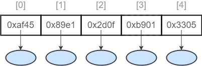
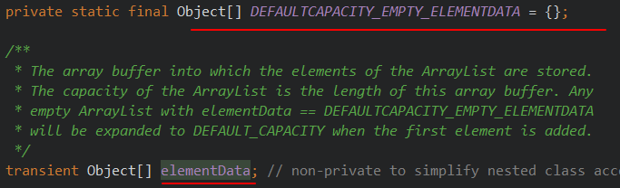
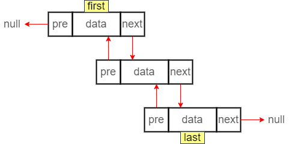

# List集合

## List接口介绍

java.util.List 接口继承自 Collection 接口，是单列集合的一个重要分支，习惯性地会将实现了List 接口的对象称为List集合。

List接口特点：
1. List集合所有的元素是以一种线性方式进行存储的，例如，存元素的顺序是11、22、33。那么集合中，元素的存储就是按照11、22、33的顺序完成的）
2. 它是一个元素存取有序的集合。即元素的存入顺序和取出顺序有保证。
3. 它是一个带有索引的集合，通过索引就可以精确的操作集合中的元素（与数组的索引是一个道理）。
4. 集合中**可以有重复的元素**，通过元素的equals方法，来比较是否为重复的元素。

List集合类中**元素有序、且可重复**。这里的有序是指集合存取有顺序，而非排序之后的有序。

>   List集合关心元素是否有序，而不关心是否重复


## List接口中常用方法

List作为Collection集合的子接口，不但继承了Collection接口中的全部方法，而且还增加了一些根据元素索引来操作集合的特有方法。

#### 添加元素

| 方法名                                                  | 方法说明                                             |
| ------------------------------------------------------- | ---------------------------------------------------- |
| void add(int index, E ele)                              | 添加一个元素到索引指定位置（后面的元素后移）         |
| boolean addAll(int index, Collection<? extends E> eles) | 添加一个Collection接口到索引指定位置（后面元素后移） |

#### 获取元素
| 方法名                                   | 方法说明                                  |
| ---------------------------------------- | ----------------------------------------- |
| E get(int index)                         | 获取指定索引的元素                        |
| List subList(int fromIndex, int toIndex) | 获取指定区间[fromIndex,toIndex)元素的List |

#### 获取元素的索引
| 方法名                                   | 方法说明                                  |
| ---------------------------------------- | ----------------------------------------- |
|int indexOf(Object obj)|获取第一次出现该元素的索引|
|int lastIndexOf(Object obj)|获取最后以此出现该元素的索引|

#### 删除和替换元素
| 方法名                                   | 方法说明                                  |
| ---------------------------------------- | ----------------------------------------- |
|E remove(int index)|删除指定**索引**的元素|
|E remove(Object obj)|删除指定**内容**的元素（第一次出现）|
|E set(int index, E ele)|替换指定位置上的索引|

说明：

若集合使用泛型存储Integer类型的元素，则有多种情况

##### 代码示例

```java
@Test
public void test2(){
    ArrayList<Integer> list = new ArrayList<>();
    list.add(1);
    list.add(2);
    list.add(9);
    list.remove(1);
    System.out.println("list.remove(1)"+list);
    //	list.remove(9);	
    list.remove(new Integer("9"));
    System.out.println("list.remove(9)"+list);
}
```

1.  若直接输入基本数据类型，则移除指定索引的元素
2.  若使用包装类输入，则移除指定内容的元素


## ArrayList实现类

ArrayList是List接口的典型实现类，底层使用长度可变的数组实现，常用方法都来自Collection和List接口。

ArrayList底层使用数组实现，因此其具有 **查询快，但是增加与删除慢** 的特点



>   Vector底层也使用数组，但是线程安全，效率低，不推荐使用。

### 源码分析：

#### 空参构造方法 new ArrayList<>();

```java
public ArrayList() {
    this.elementData = DEFAULTCAPACITY_EMPTY_ELEMENTDATA;
}
```

只做了赋值操作，其中Object[] elementData 为数组，DEFAULTCAPACITY_EMPTY_ELEMENTDATA 为空数组



#### int类型参数构造方法 new ArrayList<>();

```java
public ArrayList(int initialCapacity) {
    if (initialCapacity > 0) {
        this.elementData = new Object[initialCapacity];
    } else if (initialCapacity == 0) {
        this.elementData = EMPTY_ELEMENTDATA;
    } else {
        throw new IllegalArgumentException("Illegal Capacity: "+ initialCapacity);
    }
}
```

判断传入参数的值，大于0就用该值作为数组的初始容量。等于0回到空参构造器，小于0就抛出非法参数异常

#### 添加元素方法 public boolean add(E e)  （懒加载初始化）

```java
public boolean add(E e) {
    ensureCapacityInternal(size + 1);  // 检查数组是否需要扩容
    elementData[size++] = e;	// 新增元素实际操作
    return true;
}
```

size：当前ArrayList的元素个数（The size of the ArrayList (the number of elements it contains)）

1.  进入ensureCapacityInternal(size + 1)，也就是说把当前集合元素的个数+1传入该方法

    ```java
    private void ensureCapacityInternal(int minCapacity) {
        ensureExplicitCapacity(calculateCapacity(elementData, minCapacity));
    }
    ```

    1.  该方法先进入calculateCapacity(elementData, minCapacity)方法（字面意思计算容量）

        ```java
        private static int calculateCapacity(Object[] elementData, int minCapacity) {
            if (elementData == DEFAULTCAPACITY_EMPTY_ELEMENTDATA) {
                return Math.max(DEFAULT_CAPACITY, minCapacity);
            }
            return minCapacity;
        }
        ```

        此处的 DEFAULT_CAPACITY 是默认容量，为10。该方法返回数值较大的那个参数（与默认值比）。

    2.  进入ensureExplicitCapacity方法

        ```java
        private void ensureExplicitCapacity(int minCapacity) {
            modCount++;
        
            // overflow-conscious code
            if (minCapacity - elementData.length > 0)
                grow(minCapacity);	// 具体的扩容操作
        }
        ```

        首先，使修改数+1，其次，若集合元素个数 > 数组容量，则执行grow(minCapacity) 扩容操作

        1.  grow(minCapacity)  扩容操作

            ```java
            private void grow(int minCapacity) {
                // overflow-conscious code
                int oldCapacity = elementData.length;	// 使旧容量等于现在数组长度
                int newCapacity = oldCapacity + (oldCapacity >> 1);	// 使新容量为旧容量的1.5倍
                // 判断该两个溢出问题（MAX_ARRAY_SIZE的值为Integer.MAX_VALUE - 8）
                if (newCapacity - minCapacity < 0)
                    newCapacity = minCapacity;
                if (newCapacity - MAX_ARRAY_SIZE > 0)
                    newCapacity = hugeCapacity(minCapacity);
                // minCapacity is usually close to size, so this is a win:
                // 使用 数组工具类 Arrays.copyOf方法，将旧容量的数组元素拷贝到新容量的数组中，并返回
                elementData = Arrays.copyOf(elementData, newCapacity);
            }
            ```

2.  执行完成上述操作后，使 当前size 的元素为传入的值
3.  返回true

#### 移除元素方法 （索引） public E remove(int index)

```java
public E remove(int index) {
    rangeCheck(index);  //检查范围是否合法：index小于size即为合法索引

    modCount++;		// 修改次数 +1 
    E oldValue = elementData(index);	// 保留删除的元素，以便返回

    // 思想：使用后面的元素将该索引位置的元素覆盖，然后将最后的元素置为null，即实现了删除操作
    int numMoved = size - index - 1;	// 计算需要移动的元素个数
    if (numMoved > 0)
        System.arraycopy(elementData, index+1, elementData, index,numMoved); // 移动元素
    elementData[--size] = null; // 将最后的元素置为null

    return oldValue;
}
```

#### 移除元素方法 （索引） public E remove(int index)

```java
public boolean remove(Object o) {
    /*
    分两种情况，
    1. 若传入的值为null，则 “快速移除” null位置的值
    2. 若传入的值不为null，则 “快速移除” 与参数匹配的值
    */
    
    if (o == null) {
        // 参数为null，找null的位置 并执行 fastRemove()方法
        for (int index = 0; index < size; index++)
            if (elementData[index] == null) {
                fastRemove(index);
                return true;
            }
    } else {
        // 参数为null，找匹配参数的位置 并执行 fastRemove()方法
        for (int index = 0; index < size; index++)
            if (o.equals(elementData[index])) {
                fastRemove(index);
                return true;
            }
    }
    return false;
}
```

快速移除方法：private void fastRemove(int index)，跳过边界检查及返回值

```Java
/*
把后面的值移到前面即可。
*/
private void fastRemove(int index) {
    modCount++;
    int numMoved = size - index - 1;
    if (numMoved > 0)
        System.arraycopy(elementData, index+1, elementData, index,
                         numMoved);
    elementData[--size] = null; // clear to let GC do its work
}
```


## LinkedList实现类

LinkedList是List接口的另一个常用实现类。LinkedList底层存储数据使用链表结构(双向链表)，特点：**增删快，查询慢。**

##### 双向链表示意图



Node对象表示一个完整的元素节点：

```java
private static class Node<E> {
    E item;//数据元素
    Node<E> next;//下一个元素节点
    Node<E> prev;//上一个元素节点
    Node(Node<E> prev, E element, Node<E> next) {
        this.item = element;
        this.next = next;
        this.prev = prev;
    }
}
```

### LinkedList常用方法

#### LinkedList的构造方法：

1.  空参，构造一个空集合

    ```java
    public LinkedList() {
    }
    ```

2.  传入一个集合接口，调用空参，然后添加所有（addAll）

    ```java
    public LinkedList(Collection<? extends E> c) {
        this();
        addAll(c);
    }
    ```

#### LinkedList特有的方法（首、尾元素的操作）

| 方法名称 | 方法说明 |
| -------- | -------- |
|void addFirst(Object obj )|链表头添加元素|
|void addLast(Object obj )|链表尾添加元素|
|Object getFirst()|获取链表头元素|
|Object getLast()|获取链表尾元素|
|Object removeFirst()|移除链表头元素|
|Object removeLast ()|移除链表尾元素|

### 链表实现的数据结构

#### 基于链表实现的抽象数据结构-队列：先进先出（FIFO）

| 方法名称 | 方法说明 |
| -------- | -------- |
|boolean offer(Object obj) | 入队|
|Object peek() |出队|

#### 基于链表实现的抽象数据结构-栈：后进先出（LIFO）
| 方法名称 | 方法说明 |
| -------- | -------- |
|void push(E e) |压栈|
|E pop() |弹栈|

### 源码分析

#### 静态节点类 `private static class Node<E>`

```java
private static class Node<E> {
    E item;			// 具体数据
    Node<E> next;	// 指向后一个元素的指针
    Node<E> prev;	// 指向前一个元素的指针

    Node(Node<E> prev, E element, Node<E> next) {
        this.item = element;
        this.next = next;
        this.prev = prev;
    }
}
```

#### 添加元素到尾部：`void linkLast(E e)`

```java
/**
 * Links e as last element.(将元素添加到尾部)
 */
void linkLast(E e) {
    final Node<E> l = last;	// 将之前最新节点 临时存为变量 l
    final Node<E> newNode = new Node<>(l, e, null);	// new个节点，保存传入的数据，指定前驱节点为l（之前最新的节点），将后驱节点置空
    last = newNode;	// 更新最新节点：使最新节点为刚刚新建的节点
    if (l == null)	// 如果没有前驱节点，说明新建的节点为第一个，则将头节点 = 新建的节点
        first = newNode;
    else	// 若有前驱节点，则把前驱结点后一个节点指定为 newNode
        l.next = newNode;
    size++;		// 链表尺寸+1
    modCount++;	// 修改次数+1
}
```

说明：last，first为 节点元素 `Node<E>` 

#### 添加元素到头部：`void linkFirst(E e)`

```java
/**
 * Links e as first element.
 */
private void linkFirst(E e) {
    final Node<E> f = first;	// 将头节点存储为 f
    final Node<E> newNode = new Node<>(null, e, f);	// new个节点，保存传入的数据，将前驱结点指控，后驱节点为f（之前的头节点）
    first = newNode;	// 更新头节点：是头节点为刚刚新建的节点
    if (f == null)	// 没有头节点，说明新建的节点为第一个，则将头节点 = 新建的节点
        last = newNode;
    else	// 有头节点，则将新建的节点设为f（之前头节点）的前驱结点
        f.prev = newNode;
    size++;		// 链表尺寸+1
    modCount++;	// 修改次数+1
}
```
#### 添加元素到指定节点之前 `void linkBefore(E e, Node<E> succ)`

```java
void linkBefore(E e, Node<E> succ) {
    // assert succ != null; succ为指定节点

    final Node<E> pred = succ.prev;	// 保存succ的前驱为pred
    final Node<E> newNode = new Node<>(pred, e, succ);	//new一个节点，保存数据。将pred（succ的前驱）设为新节点的前驱，将succ设为新节点的后驱
    succ.prev = newNode;	//将succ的前驱指向新节点
    if (pred == null)	//若succ的前驱为null，则说明 succ为头节点。此时只需要让新节点成为头节点即可
        first = newNode;
    else	//非头节点的情况：将初始状态 succ的前驱节点的后驱指向新节点即可
        pred.next = newNode;
    size--;	// 链表尺寸-1
    modCount++;	// 修改次数+1
}
```

#### 删除头节点 `private E unlinkFirst(Node<E> f)`

```java
private E unlinkFirst(Node<E> f) {
    // assert f == first && f != null;
    final E element = f.item;	// 存储当前第一个元素，用于返回
    final Node<E> next = f.next;	//	存储头元素的下一个元素为next，作为将来的头元素
    f.item = null;	// 移除头元素的 信息
    f.next = null; // help GC 呼叫GC
    first = next;	// 给头元素赋值：之前的next元素
    if (next == null)	// 若next为空，则说明整个链表为空，直接使last（最后一个元素）也为空
        last = null;
    else	// 否则使 头元素的前驱结点置空
        next.prev = null;
    size--;	// 链表尺寸-1
    modCount++;	// 修改次数+1
    return element;
}
```

#### 删除尾节点 `private E unlinkLast(Node<E> l)`

```java
private E unlinkLast(Node<E> l) {
    // assert l == last && l != null;
    final E element = l.item;	// 取出最后一个元素的 数据，准备返回
    final Node<E> prev = l.prev;	// 获取最后一个元素前的前驱结点 prev
    l.item = null;	// 将最后一个元素的数据置空
    l.prev = null; // help GC 将最后一个元素的前驱节点置空
    last = prev;	// 让初始状态倒数第二个元素成为last
    if (prev == null)	// 若当前last为空，则说明只有一个节点，则把头节点也置空
        first = null;
    else	// 否则就把当下最后一个节点的后驱节点置空
        prev.next = null;
    size--;	// 链表尺寸-1
    modCount++;	// 修改次数+1
    return element;
}
```

#### 删除指定节点（索引）`public E remove(int index)`

```java
public E remove(int index) {
    checkElementIndex(index); 	// 校验索引合法性
    return unlink(node(index));	// 具体移除操作
}
```

查找索引：node(index)，返回指定非空节点的索引（Returns the (non-null) Node at the specified element index.）

```java
Node<E> node(int index) {
	// 如果索引比容量的一半小
    if (index < (size >> 1)) {
        Node<E> x = first;	// 从头往后找
        for (int i = 0; i < index; i++)
            x = x.next;
        return x;
    // 如果索引比容量的一半大
    } else {
        Node<E> x = last;	// 从后往前找
        for (int i = size - 1; i > index; i--)
            x = x.prev;
        return x;
    }
}
```

具体的移除操作：`E unlink(Node<E> x)`

```java
/**
 * Unlinks non-null node x.
 */
E unlink(Node<E> x) {
    // assert x != null;
    // 将索引的数据，前驱结点，后驱节点存起来
    final E element = x.item;
    final Node<E> next = x.next;
    final Node<E> prev = x.prev;

    // 如果前驱结点为空，则说明该节点为头节点，只要直接将first为该节点的后驱节点
    if (prev == null) {
        first = next;
    // 否则就该节点的前驱结点的next指向该节点的next，然后将该节点的前驱置空
    } else {
        prev.next = next;
        x.prev = null;
    }

    // 如果后驱结点为空，则说明该节点为尾节点，只要直接将last为该节点的前驱节点
    if (next == null) {
        last = prev;
    } else {
    // 否则就该节点的后驱节点的prev设为该节点的prev，然后将该节点的后驱置空
        next.prev = prev;
        x.next = null;
    }

    x.item = null;	// 将该节点的具体数据置空
   	size--;	// 链表尺寸-1
    modCount++;	// 修改次数+1
    return element;
}
```


### ListIterator（了解）

List 集合额外提供了一个 listIterator() 方法，该方法返回一个 ListIterator 对象， ListIterator 接口继承
了 Iterator 接口，提供了专门操作 List 的方法：

-   void add()：通过迭代器添加元素到对应集合
-   void set(Object obj)：通过迭代器替换正迭代的元素
-   void remove()：通过迭代器删除刚迭代的元素
-   boolean hasPrevious()：如果以逆向遍历列表，往前是否还有元素。
-   Object previous()：返回列表中的前一个元素。
-   int previousIndex()：返回列表中的前一个元素的索引
-   boolean hasNext()
-   Object next()
-   int nextIndex()

```java
public static void main(String[] args) {
    List<Student> c = new ArrayList<>();
    c.add(new Student(1,"张三"));
    c.add(new Student(2,"李四"));
    c.add(new Student(3,"王五"));
    c.add(new Student(4,"赵六"));
    c.add(new Student(5,"钱七"));
    
    //从指定位置往前遍历
    ListIterator<Student> listIterator = c.listIterator(c.size());
    while(listIterator.hasPrevious()){
        Student previous = listIterator.previous();
        System.out.println(previous);
    }
}
```

