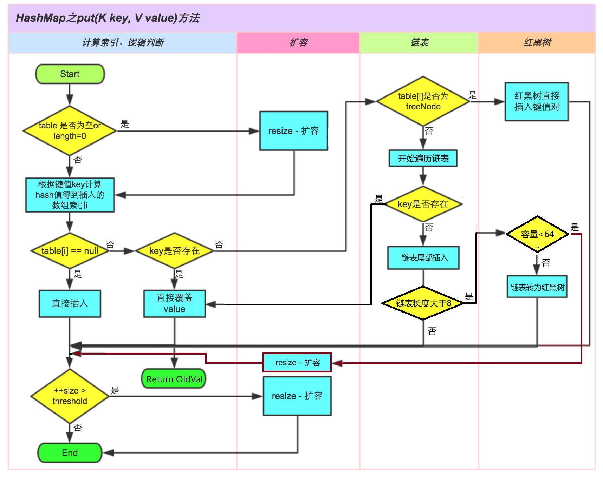

# HashMap 源码分析

注意：请参照JDK1.8的HashMap源码

HashMap几个关键点：

1.  几个HashMap的属性

2.  新建HashMap操作

3.  添加第一个节点操作
4.  添加后续节点操作
    -   覆盖
    -   添加到尾部
5.  数组转红黑树操作
6.  红黑树退化数组操作
7.  扩容操作

### HashMap流程图



## HashMap的几个变量与常量

### 变量

```java
/**
 * The load factor for the hash table.
 * 加载因子，
 * @serial
 */
final float loadFactor;

/**
     * The next size value at which to resize (capacity * load factor).
     * 扩容阈值，当数组长度达到扩容阈值时，即开始扩容操作。（加载因子 * 数组长度 = 扩容阈值）
     * @serial
     */
// (The javadoc description is true upon serialization.
// Additionally, if the table array has not been allocated, this
// field holds the initial array capacity, or zero signifying
// DEFAULT_INITIAL_CAPACITY.)
int threshold;

/**
     * The number of times this HashMap has been structurally modified
     * Structural modifications are those that change the number of mappings in
     * the HashMap or otherwise modify its internal structure (e.g.,
     * rehash).  This field is used to make iterators on Collection-views of
     * the HashMap fail-fast.  (See ConcurrentModificationException).
     * 修改次数，每进行对HashMap进行以此结构性修改时，修改次数+1；要求在迭代器迭代过程中，
     * 不能改变修改次数（即为不可进行结构性修改）。否则将抛出ConcurrentModificationException
     */
transient int modCount;

/**
     * The number of key-value mappings contained in this map.
     * 该Map中键值对的个数
     */
transient int size;

/**
     * The table, initialized on first use, and resized as
     * necessary. When allocated, length is always a power of two.
     * (We also tolerate length zero in some operations to allow
     * bootstrapping mechanics that are currently not needed.)
     * 是一个单向链表的数组。该变量时HashMap实际上存储数据的结构，底层实现了 Map.Entry<K,V> 接口，存放键值对。
     */
transient Node<K,V>[] table;

/**
     * Holds cached entrySet(). Note that AbstractMap fields are used
     * for keySet() and values().
     * 用于存放键值对的结构，在第一次调用 HashMap对象的entrySet()方法时进行初始化。
     */
transient Set<Map.Entry<K,V>> entrySet;
```

### 常量（默认值）

```java
/**
     * The default initial capacity - MUST be a power of two.
     * HashMap默认容量
     */
static final int DEFAULT_INITIAL_CAPACITY = 1 << 4; // aka 16

/**
     * The maximum capacity, used if a higher value is implicitly specified
     * by either of the constructors with arguments.
     * MUST be a power of two <= 1<<30.
     * HashMap最大容量
     */
static final int MAXIMUM_CAPACITY = 1 << 30;

/**
     * The load factor used when none specified in constructor.
     * 默认加载因子
     */
static final float DEFAULT_LOAD_FACTOR = 0.75f;

/**
     * The bin count threshold for using a tree rather than list for a
     * bin.  Bins are converted to trees when adding an element to a
     * bin with at least this many nodes. The value must be greater
     * than 2 and should be at least 8 to mesh with assumptions in
     * tree removal about conversion back to plain bins upon
     * shrinkage.
     * 数组转成红黑树的最小链表长度的阈值
     */
static final int TREEIFY_THRESHOLD = 8;

/**
     * The bin count threshold for untreeifying a (split) bin during a
     * resize operation. Should be less than TREEIFY_THRESHOLD, and at
     * most 6 to mesh with shrinkage detection under removal.
     * 红黑树转化位数组的最小红黑树节点个数的阈值
     */
static final int UNTREEIFY_THRESHOLD = 6;

/**
     * The smallest table capacity for which bins may be treeified.
     * (Otherwise the table is resized if too many nodes in a bin.)
     * Should be at least 4 * TREEIFY_THRESHOLD to avoid conflicts
     * between resizing and treeification thresholds.
     * 存储结构由链表转化为红黑树的最小键值对个数：单个链表在长度达到8个之后，该链表会转化为红黑树存储
     */
static final int MIN_TREEIFY_CAPACITY = 64;

```


## 存储数据的链表（红黑树）节点：Node

```java
/**
 * Basic hash bin node, used for most entries.  (See below for
 * TreeNode subclass, and in LinkedHashMap for its Entry subclass.)
 */
static class Node<K,V> implements Map.Entry<K,V> {
    final int hash;
    final K key;
    V value;
    Node<K,V> next;

    Node(int hash, K key, V value, Node<K,V> next) {
        this.hash = hash;
        this.key = key;
        this.value = value;
        this.next = next;
    }

    public final K getKey()        { return key; }
    public final V getValue()      { return value; }
    public final String toString() { return key + "=" + value; }

    public final int hashCode() {
        return Objects.hashCode(key) ^ Objects.hashCode(value);
    }

    public final V setValue(V newValue) {
        V oldValue = value;
        value = newValue;
        return oldValue;
    }

    public final boolean equals(Object o) {
        if (o == this)
            return true;
        if (o instanceof Map.Entry) {
            Map.Entry<?,?> e = (Map.Entry<?,?>)o;
            if (Objects.equals(key, e.getKey()) &&
                Objects.equals(value, e.getValue()))
                return true;
        }
        return false;
    }
}
```

这是一个内部类，实现了 Map.Entry接口，用于存储键值对。


## HashMap 源码（常用方法）

#### 无参构造器：public HashMap()

```java
/**
 * Constructs an empty <tt>HashMap</tt> with the default initial capacity
 * (16) and the default load factor (0.75).
 * 构造一个空的HashMap对象，使用默认容量与默认加载因子。
 *
 */
public HashMap() {
    this.loadFactor = DEFAULT_LOAD_FACTOR; // all other fields defaulted
}
```

说明：此方法只是给加载因子赋初始值（0.75），没有其他操作。

#### 带参构造器：public HashMap(int initialCapacity)

```java
/**
 * Constructs an empty <tt>HashMap</tt> with the specified initial
 * capacity and the default load factor (0.75).
 * 使用指定容量构造一个空的HashMap，使用默认加载因子0.75
 *
 * @param  initialCapacity the initial capacity.
 * @throws IllegalArgumentException if the initial capacity is negative.
 */
public HashMap(int initialCapacity) {
    this(initialCapacity, DEFAULT_LOAD_FACTOR);
}
```

进入`this(initialCapacity, DEFAULT_LOAD_FACTOR);`

```java
/**
 * Constructs an empty <tt>HashMap</tt> with the specified initial
 * capacity and load factor.
 * 使用指定的容量与加载因子初始化一个空的HashMap
 *
 * @param  initialCapacity the initial capacity
 * @param  loadFactor      the load factor
 * @throws IllegalArgumentException if the initial capacity is negative
 *         or the load factor is nonpositive
 */
public HashMap(int initialCapacity, float loadFactor) {
    if (initialCapacity < 0)	// 如果传入的容量小于0，则抛出异常
        throw new IllegalArgumentException("Illegal initial capacity: " +
                                           initialCapacity);
    if (initialCapacity > MAXIMUM_CAPACITY)	//若传入值大于最大容量
        initialCapacity = MAXIMUM_CAPACITY;
    if (loadFactor <= 0 || Float.isNaN(loadFactor))	// 加载因子校验：小于0或非Float类型，则抛出异常
        throw new IllegalArgumentException("Illegal load factor: " +
                                           loadFactor);
    // 初始化加载因子
    this.loadFactor = loadFactor;
    // 初始化扩容阈值，下面有说明
    this.threshold = tableSizeFor(initialCapacity);
}
```

`tableSizeFor(initialCapacity)`方法说明：该方法会返回一个2的n次方的值，该值的取值是大于传入值且范围内最小的值，比如传入值位13，返回16（2的4次方），传入50，返回64（2的6次方）

#### 添加方法：public V put(K key, V value)

```java
public V put(K key, V value) {
    return putVal(hash(key), key, value, false, true);
}
```

首先调用`hash(key)`方法，计算出key对应的哈希值

```java
static final int hash(Object key) {
    int h;
    return (key == null) ? 0 : (h = key.hashCode()) ^ (h >>> 16);
}
```

接下来调用`putVal(hash(key), key, value, false, true)`方法，该方法将元素放入HashMap中（代码有格式的修改）

```java
/**
 * Implements Map.put and related methods.
 * 
 * @param hash hash for key
 * @param key the key
 * @param value the value to put
 * @param onlyIfAbsent if true, don't change existing value
 * @param evict if false, the table is in creation mode.
 * @return previous value, or null if none
 */
final V putVal(int hash, K key, V value, boolean onlyIfAbsent, boolean evict) {
    Node<K,V>[] tab; 	// 保存当前 Node数组的临时变量
    Node<K,V> p; 	// 用于链表遍历的节点
    int n, i;	// n用于保存tab数组的长度；i用于指定tab数组的索引
    // 给刚刚定义的tab变量赋值，并且判断其是否为空（或长度位0），若为空，则调用resize()方法扩容；
    // resize()方法后面有详解
    if ((tab = table) == null || (n = tab.length) == 0)	
        n = (tab = resize()).length;
    // 计算节点放入的索引（通过与Hash算法），然后赋值给P，判断P是否为空。若为空，则新建一个节点，然后放在tab数组索引指向的位置
    if ((p = tab[i = (n - 1) & hash]) == null)
        tab[i] = newNode(hash, key, value, null);
    // 否则，就说明该索引位置有Node元素，接下来进行如下操作。
    else {
        Node<K,V> e; 
        K k;
        // 若哈希值相等，且内容或引用相等，则覆盖（其间给k赋值）
        if (p.hash == hash && ((k = p.key) == key || (key != null && key.equals(k))))
            e = p;
        // 若该节点属于 红黑树的节点类型，则添加到红黑树中
        else if (p instanceof TreeNode)
            e = ((TreeNode<K,V>)p).putTreeVal(this, tab, hash, key, value);
        // 否则执行如下操作
        else {
            // 在该索引所指的链表上往后找
            for (int binCount = 0; ; ++binCount) { // binCount为计数器，用于判断是否使链表转为红黑树
                // 如果找到最后为null了，则生成新的节点
                if ((e = p.next) == null) {
                    p.next = newNode(hash, key, value, null);
                    // 若节点数达到转树阈值，则执行转为红黑树的操作
                    if (binCount >= TREEIFY_THRESHOLD - 1) // -1 for 1st
                        treeifyBin(tab, hash);
                    break;
                }
                // 判断该节点是否与新的数据相等，若相等，则结束循环
                if (e.hash == hash &&
                    ((k = e.key) == key || (key != null && key.equals(k))))
                    break;
                p = e; // 往后找
            }
        }
        // 若e不为空，则说明没有到链表的末尾就找到了，则覆盖该值，并返回。
        if (e != null) { // existing mapping for key
            V oldValue = e.value;
            if (!onlyIfAbsent || oldValue == null)
                e.value = value;
            afterNodeAccess(e);
            return oldValue;
        }
    }
    // 增加修改次数
    ++modCount;
    // 如果元素个数大于阈值，则扩容
    if (++size > threshold)
        resize();
    afterNodeInsertion(evict);
    return null;
}
```

扩容操作：`final Node<K,V>[] resize()`

```java
/**
 * Initializes or doubles table size.  If null, allocates in
 * accord with initial capacity target held in field threshold.
 * Otherwise, because we are using power-of-two expansion, the
 * elements from each bin must either stay at same index, or move
 * with a power of two offset in the new table.
 * 初始化或增加表大小。 如果为空，则根据字段阈值中保持的初始容量目标进行分配。 
 * 否则，因为我们使用的是2的幂，所以每个bin中的元素必须保持相同的索引，或者在新表中以2的幂偏移。
 *
 * @return the table
 */
final Node<K,V>[] resize() {
    Node<K,V>[] oldTab = table;	// 将当前数组备份为oldTab，以便后续操作，防止对当前数据造成破坏
    int oldCap = (oldTab == null) ? 0 : oldTab.length;	// 保存当前数组长度到oldCap
    int oldThr = threshold;	// 保存当前扩容阈值到oldThr
    int newCap, newThr = 0;	// 初始化新数组长度与新数组的扩容阈值
    if (oldCap > 0) {
        // 判断原数组长度，若大于最大容量，则直接返回
        if (oldCap >= MAXIMUM_CAPACITY) {
            threshold = Integer.MAX_VALUE;
            return oldTab;
        }
        // 让新数组的长度为旧表的两倍，在此基础上判断：新数组长度是否大于最大容量且判断旧表容量是否大于默认初始值（16）。若两个条件都满足，则使新的扩容阈值为之前的2倍。
        else if ((newCap = oldCap << 1) < MAXIMUM_CAPACITY && oldCap >= DEFAULT_INITIAL_CAPACITY)
            newThr = oldThr << 1; // double threshold
    }
    else if (oldThr > 0) // initial capacity was placed in threshold
        newCap = oldThr;
    // oldCap <= 0的，无参构造器（或容量为0）情况下执行的操作
    else {               // zero initial threshold signifies using defaults
        newCap = DEFAULT_INITIAL_CAPACITY;	// 数组赋予默认容量（16）
        newThr = (int)(DEFAULT_LOAD_FACTOR * DEFAULT_INITIAL_CAPACITY); // 赋予默认阈值
    }
    if (newThr == 0) {
        float ft = (float)newCap * loadFactor;
        newThr = (newCap < MAXIMUM_CAPACITY && ft < (float)MAXIMUM_CAPACITY ?
                  (int)ft : Integer.MAX_VALUE);
    }
    threshold = newThr; // 扩容当前阈值
    @SuppressWarnings({"rawtypes","unchecked"})
    Node<K,V>[] newTab = (Node<K,V>[])new Node[newCap]; // 创建新数组，准备扩容
    table = newTab;
    if (oldTab != null) {//旧数组不为空，则重新分布原来的元素到新的数组中，性能消耗操作
        for (int j = 0; j < oldCap; ++j) {
            Node<K,V> e;
            if ((e = oldTab[j]) != null) {//e暂存每个位置的第一个节点（非空）
                oldTab[j] = null;//原位置置空
                if (e.next == null)//最后一个节点（只有一个节点）
                    newTab[e.hash & (newCap - 1)] = e;//重新计算这个节点的位置并存入
                else if (e instanceof TreeNode)//如果是树形节点，重新拆解树
                    ((TreeNode<K,V>)e).split(this, newTab, j, oldCap);
                else { // preserve order 原位置是个链表，重新计算每个元素位置并存入
                    Node<K,V> loHead = null, loTail = null;
                    Node<K,V> hiHead = null, hiTail = null;
                    Node<K,V> next;
                    do {
                        next = e.next;
                        if ((e.hash & oldCap) == 0) {
                            if (loTail == null)
                                loHead = e;
                            else
                                loTail.next = e;
                            loTail = e;
                        }
                        else {
                            if (hiTail == null)
                                hiHead = e;
                            else
                                hiTail.next = e;
                            hiTail = e;
                        }
                    } while ((e = next) != null);
                    if (loTail != null) {
                        loTail.next = null;
                        newTab[j] = loHead;
                    }
                    if (hiTail != null) {
                        hiTail.next = null;
                        newTab[j + oldCap] = hiHead;
                    }
                }
            }
        }
    }
    return newTab;
}
```

