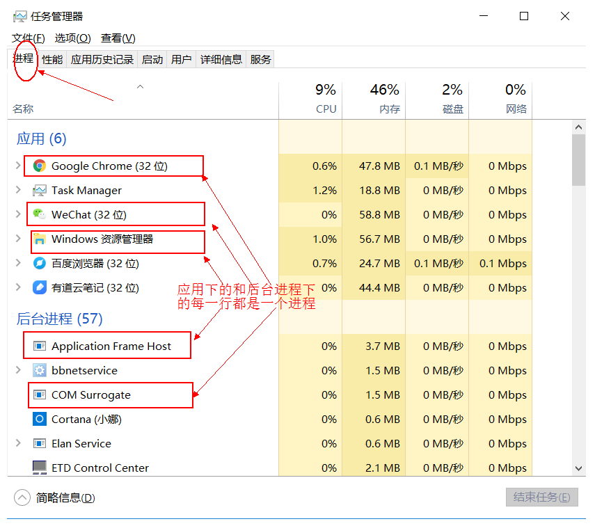

# 线程的相关概念

## 并发与并行

-   并行（parallel）：指多个事件任务在同一时刻发生（同时发生）。指在同一时刻，有多条指令在
    多个处理器上同时执行。单核CPU同一时刻只能处理一条指令，所以单核CPU做不到并行处理。
-   并发（concurrency）：指两个或多个事件在同一个微小的时间段内发生。指在同一个时刻只能有
    一条指令执行，但多个进程的指令被快速轮换执行，使得在宏观上具有多个进程同时执行的效果。
    程序并发执行可以在有限条件下，充分利用CPU资源，这是我们研究的重点。

在操作系统中，安装了多个程序，并发指的是在一段时间内宏观上有多个程序同时运行，这在单 CPU系统中，每一时刻只能有一个程序执行，即微观上这些程序是分时的交替运行，只不过是给人的感觉是同时运行，那是因为分时交替运行的时间是非常短的。

而在多个 CPU 系统中，则这些可以并发执行的程序便可以分配到多个处理器上（CPU），实现多任务并行执行，即利用每个处理器来处理一个可以并发执行的程序，这样多个程序便可以同时执行。目前电脑市场上说的多核 CPU，便是多核处理器，核越多，并行处理的程序越多，能大大的提高电脑运行的效率。

>   注意：单核处理器的计算机肯定是不能并行的处理多个任务的，只能是多个任务在单个CPU上并发运行。同理，线程也是一样的，从宏观角度上理解线程是并行运行的，但是从微观角度上分析却是串行运行的，即一个线程一个线程的去运行，当系统只有一个CPU时，线程会以某种顺序执行多个线程，我们把这种情况称之为线程调度。

-   单核CPU：只能并发
-   多核CPU：并行+并发

并行与并发举例：

-   并行：多项工作一起执行，之后再汇总，例如：泡方便面，电水壶烧水，一边撕调料倒入桶中
-   并发：同一时刻多个线程在访问同一个资源，多个线程对一个点，例如：春运抢票、电商秒杀...

## 线程与进程

-   程序：为了完成某个任务和功能，选择一种编程语言编写的一组指令的集合。
-   软件：1个或多个应用程序+相关的素材和资源文件等构成一个软件系统。
-   进程：进程是对一个程序运行过程（创建-运行-消亡）的描述，系统会为每个运行的程序建立一个进程，并为进程分配独立的系统资源（以一个进程为单元分配系统资源），比如内存空间等资源。
-   线程：线程是进程中的一个执行单元，负责完成执行当前程序的任务，一个进程中至少有一个线程。一个进程中是可以有多个线程的，这个应用程序也可以称之为多线程程序。多线程使得程序可以并发执行，充分利用CPU资源。

面试题：进程是操作系统调度和分配资源的最小单位，**线程是CPU调度的最小单位**。不同的进程之间是不共享内存的。进程之间的数据交换和通信的成本是很高。**不同的线程是共享同一个进程的内存的。**当然不同的线程也有自己独立的内存空间。对于方法区，堆中中的同一个对象的内存，线程之间是可以共享的，但是栈的局部变量永远是独立的。

### 举例说明

**我们可以再电脑底部任务栏，右键----->打开任务管理器,可以查看当前任务的进程**：

**一个应用程序的多次运行，就是多个进程**

**一个进程中包含多个线程**

### 多线程的优点与应用场景

主要优点：充分利用CUP空闲时间片，用尽可能短的时间完成用户的请求。也就是使程序的响应速度更快 。

应用场景：

-   多任务处理。多个用户请求服务器，服务端程序可以开启多个线程分别处理每个用户的请
    求，互不影响。
-   单个大任务处理。下载一个大文件，可以开启多个线程一起下载，减少整体下载时间。

## 线程调度

指CPU资源如何分配给不同的线程。常见的两种线程调度方式：

-   分时调度：所有线程轮流使用 CPU 的使用权，平均分配每个线程占用 CPU 的时间。
-   抢占式调度：优先让优先级高的线程使用 CPU，如果线程的优先级相同，那么会随机选择一个(线程随机性)，Java采用的是抢占式调度方式。

### 抢占式调度详解

大部分操作系统都支持多进程并发运行，现在的操作系统几乎都支持同时运行多个程序。比如：现在我们上课一边使用编辑器，一边使用录屏软件，同时还开着画图板，dos窗口等软件。此时，这些程序是在同时运行，”感觉这些软件好像在同一时刻运行着“。

实际上，CPU(中央处理器)使用抢占式调度模式在多个线程间进行着高速的切换。对于CPU的一个核而言，某个时刻，只能执行一个线程，而 CPU的在多个线程间切换速度相对我们的感觉要快，看上去就是在同一时刻运行。 其实，多线程程序并不能提高程序的运行速度，但能够提高程序运行效率，让CPU的使用率更高。

