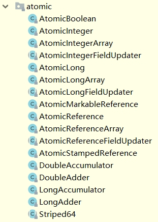

# CAS与原子操作

## 乐观锁与悲观锁的概念

锁可以从不同的角度分类。其中，乐观锁和悲观锁是一种分类方式。

**悲观锁：**

悲观锁就是我们常说的锁。对于悲观锁来说，它总是认为每次访问共享资源时会发生冲突，所以必须对每次数据操作加上锁，以保证临界区的程序同一时间只能有一个线程在执行。

**乐观锁：**

乐观锁又称为“无锁”，顾名思义，它是乐观派。乐观锁总是假设对共享资源的访问没有冲突，线程可以不停地执行，无需加锁也无需等待。而一旦多个线程发生冲突，乐观锁通常是使用一种称为CAS的技术来保证线程执行的安全性。

由于无锁操作中没有锁的存在，因此不可能出现死锁的情况，也就是说**乐观锁天生免疫死锁**。

乐观锁多用于“读多写少“的环境，避免频繁加锁影响性能；而悲观锁多用于”写多读少“的环境，避免频繁失败和重试影响性能。


## CAS的概念

CAS的全称是：比较并交换（Compare And Swap）。在CAS中，有这样三个值：

-   V：要更新的变量(var)
-   E：预期值(expected)(读取到的旧值)
-   N：新值(new)

比较并交换的过程如下：

判断V是否等于E，如果等于，将V的值设置为N；如果不等，说明已经有其它线程更新了V，则当前线程放弃更新，什么都不做。

#### 简单示例

如果有一个多个线程共享的变量`i`原本等于5，我现在在线程A中，想把它设置为新的值6;

1.  首先我们用i去与5对比，发现它等于5，说明没有被其它线程改过，那我就把它设置为新的值6，此次CAS成功，`i`的值被设置成了6；
2.  如果不等于5，说明`i`被其它线程改过了（比如现在`i`的值为2），那么我就什么也不做，此次CAS失败，`i`的值仍然为2。

>   在这个例子中，`i`就是V，5就是E，6就是N。

CAS是一种原子操作，它是一种系统原语，是一条CPU的原子指令，从CPU层面保证它的原子性

**当多个线程同时使用CAS操作一个变量时，只有一个会胜出，并成功更新，其余均会失败，但失败的线程并不会被挂起，仅是被告知失败，并且允许再次尝试，当然也允许失败的线程放弃操作。**


## Java实现CAS的原理 - Unsafe类

前面提到，CAS是一种原子操作。那么Java是怎样来使用CAS的呢？我们知道，在Java中，如果一个方法是native的，那Java就不负责具体实现它，而是交给底层的JVM使用c或者c++去实现。

在Java中，有一个`Unsafe`类，它在`sun.misc`包中。它里面是一些`native`方法，其中就有几个关于CAS的：

```java
// 获取Unsafe类对象的方式
Unsafe unsafe = Unsafe.getUnsafe();
// CAS方法
public native boolean compareAndSwapObject(Object o, long offset,Object expected, Object x);
public native boolean compareAndSwapInt(Object o, long offset,int expected,int x);
public native boolean compareAndSwapLong(Object o, long offset,long expected,long x);
```

一般来说，不会直接使用Unsafe对象的方法，一般包装在AtomicXXX类中


## 原子操作-AtomicInteger类

JDK提供了一些用于原子操作的类，在`java.util.concurrent.atomic`包下面。在JDK 11中，有如下17个类：



通过类名可知，改包下的原子操作类大概有如下几个功能

-   原子更新基本类型
-   原子更新数组
-   原子更新引用
-   原子更新字段（属性）

`AtomicInteger`类的`getAndAdd(int delta) `方法为例，查看其内部实现原子操作的原理

```java
// getAndAdd方法入口
AtomicInteger anInt = new AtomicInteger(12);
anInt.getAndAdd(2);
```

进入 `anInt.getAndAdd(2)` 

```java
public final int getAndAdd(int delta) {
    return unsafe.getAndAddInt(this, valueOffset, delta);
}
```

这里的unsafe是一个unsafe的对象，调用了unsafe的 getAndAddInt方法。

传入参数解析：

-   this：将当前对象传入该方法

-   valueOffset：这是unsafe类的一个属性的值，调用本地方法，传入AtomicInteger类的Field对象，value是AtomicInteger对象存放数据的属性

    ```java
    valueOffset = unsafe.objectFieldOffset (AtomicInteger.class.getDeclaredField("value"));
    ```

    >   用于获取某个字段相对Java对象的“起始地址”的偏移量。
    >
    >   一个java对象可以看成是一段内存，各个字段都得按照一定的顺序放在这段内存里，同时考虑到对齐要求，可能这些字段不是连续放置的，
    >
    >   用这个方法能准确地告诉你某个字段相对于对象的起始内存地址的字节偏移量，因为是相对偏移量，所以它其实跟某个具体对象又没什么太大关系，跟class的定义和虚拟机的内存模型的实现细节更相关。

-   delta：增量，外部AtomicInteger对象调用

继续进入 `unsafe.getAndAddInt(this, valueOffset, delta);` ，来到Unsafe类

```java
public final int getAndAddInt(Object atomicObj, long offset, int delta) {
    int var5;
    do {
        var5 = this.getIntVolatile(atomicObj, offset);
    } while(!this.compareAndSwapInt(atomicObj, offset, var5, var5 + delta));

    return var5;
}
```

>   getIntVolatile(atomicObj, offset)：使本地内存副本实时刷新，同步主存中atomicObj的值，并返回var1的value
>
>   compareAndSwapInt(atomicObj, offset, var5, var5 + delta)方法：读取传入对象o在内存中偏移量为offset位置的值与期望值var5作比较。相等就把x值赋值给offset位置的值。方法返回true。不相等，就取消赋值，方法返回false。

1.  由于CAS是“无锁”的基础，它允许更新失败。所以经常会与while循环搭配，在失败后不断去重试。

2.  这里声明了一个var5，也就是要返回的值。从`getAndAddInt`来看，它返回的应该是原来的值，而新的值的`v + delta`。

3.  这里使用的是**do-while循环**。它的目的是**保证循环体内的语句至少会被执行一遍**。这样才能保证return 的值`v`是我们期望的值。

可以看到，它是在不断尝试去用CAS更新。如果更新失败，就继续重试。那为什么要把获取“旧值”v的操作放到循环体内呢？其实这也很好理解。前面我们说了，CAS如果旧值V不等于预期值E，它就会更新失败。说明旧的值发生了变化。那我们当然需要返回的是被其他线程改变之后的旧值了，因此放在了do循环体内。


## CAS实现原子操作的三个问题

### 1、ABA问题

#### 问题概述

所谓ABA问题，就是在执行CAS的操作时，某个阶段一个值由原来的A，变成了B，又变回了A。这个时候使用CAS是检查不出变化的，但实际上却被更新了两次。如果变化中的值被其他线程使用，则会造成数据的脏读。

#### 解决方案

ABA问题的解决思路是在变量前面追加上**版本号或者时间戳**。从JDK 1.5开始，JDK的atomic包里提供了一个类 `AtomicStampedReference` 类来解决ABA问题。这个类的 `compareAndSet` 方法的作用是首先检查当前引用是否等于预期引用，并且检查当前标志是否等于预期标志，如果二者都相等，才使用CAS设置为新的值和标志。

```java
public boolean compareAndSet(V   expectedReference,
                             V   newReference,
                             int expectedStamp,
                             int newStamp) {
    Pair<V> current = pair;
    return
        expectedReference == current.reference &&
        expectedStamp == current.stamp &&
        ((newReference == current.reference &&
          newStamp == current.stamp) ||
         casPair(current, Pair.of(newReference, newStamp)));
}
```

### 循环时间长开销大

CAS多与自旋结合。如果自旋CAS长时间不成功，会占用大量的CPU资源。

解决思路是让JVM支持处理器提供的**pause指令**。

pause指令能让自旋失败时cpu睡眠一小段时间再继续自旋，从而使得读操作的频率低很多,为解决内存顺序冲突而导致的CPU流水线重排的代价也会小很多。

### 只能保证一个共享变量的原子操作

有两种解决方案：

1.  使用JDK 1.5开始就提供的 `AtomicReference` 类保证对象之间的原子性，把多个变量放到一个对象里面进行CAS操作；
2.  使用锁。锁内的临界区代码可以保证只有当前线程能操作。