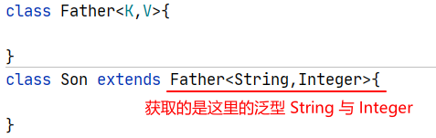

# Class类与反射

Class类与反射有着密切的联系，没有Class类，就使用不了反射。

## java.lang.Class类

Class类，简单说就是描述类的类，封装了加载到内存的类的信息的类。

万物皆对象，每个类编译后生成的字节码文件，即class文件，在类加载后JVM会为每个class文件创建一个对象，也就是Class类的一个对象。这个Class对象封装了类在方法区内的数据信息，并且向Java程序员提供了访问方法区内的类数据信息的接口。

**Java反射机制**是在运行状态中，对于任意一个类，都**能够知道这个类的所有属性和方法**；**对于任意一个对象，都能够调用它的任意一个方法和属性**；这种动态获取的信息以及动态调用对象的方法的功能称为Java语言的反射机制。

要想解剖一个类，必须先要获取到该类的Class对象。所以，**Class对象是反射的根源。**

#### 获取Class对象的四种方式

1. 类型名.class
要求编译期间已知类型，所有的Java类型都可通过此方式获取Class对象
2. 对象.getClass()
获取对象的运行时类型
3. Class.forName(类型全名称)
可以获取编译期间未知的类型
4. ClassLoader的类加载器对象.loadClass(类型全名称)

    可以用系统类加载对象或自定义加载器对象加载指定路径下的类型

##### 代码示例：获取Class对象的四种方式

```java
public class TestClass {
    @Test
    public void test05() throws ClassNotFoundException{
        Class c = TestClass.class;
        ClassLoader loader = c.getClassLoader();
        Class c2 = loader.loadClass("com.atguigu.test05.Employee");	// ClassLoader的方法
        Class c3 = Employee.class;	// 类名.class 
        System.out.println(c2 == c3);
    }
    @Test
    public void test03() throws ClassNotFoundException{
        Class c2 = String.class;
        Class c1 ="".getClass();	// getClass()方法
        Class c3 = Class.forName("java.lang.String");	// Class.forName()方法
        System.out.println(c1 == c2);
        System.out.println(c1 == c3);
    }
}
```


## 反射的应用

反射就是利用对应类的Class文件，来获取该类的各种运行时信息（每个类只有一个具体的Class文件）。

### 获取类型的详细信息

可以获取：包、修饰符、类型名、父类（包括泛型父类）、父接口（包括泛型父接口）、成员（属性、构造器、方法）、注解（类上的、方法上的、属性上的）

| Class对象的方法 | 方法说明 |
| --------------- | -------- |
|public String getName()| 获取该类的全类名|
|public Package getPackage()| 获取该类的包对象（包对象包含包的各种信息）|
|public Class<?>[] getInterfaces()| 获取该类的接口的Class数组|
|public native Class<? super T> getSuperclass() |获取该类父类的Class对象|
|public native int getModifiers()| 获取该类的权限修饰符，修饰符为常量值|
|public Constructor<?>[] getDeclaredConstructors() |获取该类直接声明的构造器数组（包含修饰符、构造器名称、构造器形参列表 、抛出异常列表等）|
|public Field[] getDeclaredFields()| 获取类直接定义的属性数组（可对属性进行各种操作）|
|public Method[] getDeclaredMethods()| 获取该类直接声明的方法数组（包含修饰符、返回值类型、方法名、形参列表 、异常列表等）|
|public Annotation[] getDeclaredAnnotations()| 获取该类的注解数组（可以对其进行操作）|

**获取修饰符 getModifiers() 解释**

* 0x是十六进制
* PUBLIC = 0x00000001; 1 = 1
* PRIVATE = 0x00000002; 2 = 10
* PROTECTED = 0x00000004; 4 = 100
* STATIC = 0x00000008; 8 = 1000
* FINAL = 0x00000010; 16 = 10000

设计的理念，就是用二进制的某一位是1，来代表一种修饰符，整个二进制中只有一位是1，其余都是0

​	mod = 17 0x00000011

​	if ((mod & PUBLIC) != 0) 说明修饰符中有public

​	if ((mod & FINAL) != 0) 说明修饰符中有final

>   关于Declared
>
>   -   有Declared只能访问本类中的所有属性、方法等（所有权限都可以）。
>
>   -   没有Declared可以访问本类的共有属性、方法等，也能访问从其它类继承来的公有方法。

**代码示例**

```java
// 类的信息
class A extends Thread implements I1, I2 {

    private String name = "Leo";

    private Integer id = 43215;

    private int age = 18;

    public A() {
        System.out.println("我是A的构造器");
    }

    public void test() {
        System.out.println("我是A类中的test()方法！~~");
    }

    @Override
    public void run() {
        super.run();
    }
}

interface I1 {
}

interface I2 {
}

// 反射获取各种信息
public static void main(String[] args) {
    // 先得到某个类型的Class对象A
    Class clazz = A.class;

    // public String getName() 获取该类的全类名
    String name = clazz.getName();
    System.out.println("name = " + name);

    // public Package getPackage() 获取该类的包对象（包对象包含包的各种信息）
    Package aPackage = clazz.getPackage();
    System.out.println("aPackage = " + aPackage);

    // public Class<?>[] getInterfaces() 获取该类的接口的Class数组
    Class[] interfaces = clazz.getInterfaces();
    for (int i = 0; i < interfaces.length; i++) {
        System.out.println("interfaces[i].getName() = " + interfaces[i].getName());
    }

    // public native Class<? super T> getSuperclass() 获取该类父类的Class对象
    Class superclass = clazz.getSuperclass();
    System.out.println("superclass.getName() = " + superclass.getName());

    //  public native int getModifiers() 获取该类的权限修饰符，修饰符为常量值
    int modifiers = clazz.getModifiers();
    System.out.println(Modifier.toString(modifiers));

    // public Constructor<?>[] getDeclaredConstructors() 获取该类直接声明的构造器数组（包含修饰符、构造器名称、构造器形参列表 、抛出异常列表等）
    Constructor[] declaredConstructors = clazz.getDeclaredConstructors();
    for (Constructor declaredConstructor : declaredConstructors) {
        System.out.println("declaredConstructor.getName() = " + declaredConstructor.getName());
    }

    // public Field[] getDeclaredFields() 获取类直接定义的属性数组（可对属性进行各种操作）
    Field[] declaredFields = clazz.getDeclaredFields();
    for (Field declaredField : declaredFields) {
        System.out.println("declaredField.getName() = " + declaredField.getName());
    }

    // public Method[] getDeclaredMethods() 获取该类直接声明的方法数组（包含修饰符、返回值类型、方法名、形参列表 、异常列表等）
    Method[] declaredMethods = clazz.getDeclaredMethods();
    for (Method declaredMethod : declaredMethods) {
        System.out.println("declaredMethod.getName() = " + declaredMethod.getName());
    }

    // public Annotation[] getDeclaredAnnotations() 获取该类的注解数组（可以对其进行操作）
    Annotation[] declaredAnnotations = clazz.getDeclaredAnnotations();
    for (Annotation declaredAnnotation : declaredAnnotations) {
        System.out.println("declaredAnnotation.annotationType().getName() = " + declaredAnnotation.annotationType().getName());
    }
}

```

### 下面演示所使用的类

```java
class Student {
	
	private String name;
	
	private int age;
	
	public Student() {
	}
	
	public Student(String name, int id) {
		this.name = name;
		this.age = age;
	}
	
	@Override
	public String toString() {
		return "Student{" +
				"name='" + name + '\'' +
				", age=" + age +
				'}';
	}
	
	public String getName() {
		return name;
	}
	
	public void setName(String name) {
		this.name = name;
	}
	
	public int getAge() {
		return age;
	}
	
	public void setAge(int age) {
		this.age = age;
	}
	
	public void testMethod(String str, int arg) {
		System.out.println("传入的字符串为：" + str + "\t传入的参数为：" + arg);
	}
	
	public static void testMethod2(String str, int arg) {
		System.out.println("静态方法：传入的字符串为：" + str + "\t传入的参数为：" + arg);
	}
}
```

### 利用反射创建对象

两种方式：

1.  直接通过Class对象来实例化（要求必须有无参构造）
2.  通过获取构造器对象来进行实例化

##### 直接通过Class对象来实例化的步骤

1.  获取该类型的Class对象 `Class.forName()`
2.  创建对象 `clazz.newInstance()`

```java
/**
 * 通过newInstance来新建对象
 */
@Test
public void test1() throws ClassNotFoundException, IllegalAccessException, InstantiationException {
    Class<?> aClass = Class.forName("reflecttest2.Student");
    // 通过Class的newInstance来新建对象（需要无参构造器）
    Student student = (Student) aClass.newInstance();
    // 给属性赋值
    student.setName("LeoNardo");
    student.setAge(17);
    System.out.println("student = " + student);
}
```

**通过反射获取对应构造器，然后通过构造器来创建对象的步骤**

1.  获取该类型的Class对象
2.  获取构造器对象 `getDeclaredConstructor(Class ...args)`
3.  创建对象 `newInstance(arg1,arg2...)`

>如果构造器的权限修饰符修饰的范围不可见，也可以调用setAccessible(true)

```java
/**
 * 通过反射获取构造器，用构造器来新建对象
 */
@Test
public void test2() throws Exception{
    Class<?> aClass = Class.forName("reflecttest2.Student");
    // 获取构造器，需要该类中有对应参数的构造器（注意，类型要一致，包装类无法自动拆包，这是由于获取构造器是根据全类名查找）
    Constructor<?> s = aClass.getDeclaredConstructor(String.class, int.class);
    // 通过构造器来新建对象
    Student student = (Student) s.newInstance("LeoNardo", 17);
    System.out.println(student);
}
```

### 利用反射操作属性

可以利用反射操作已存在对象的各种属性，步骤如下：

1.  获取该类型的Class对象 `Class clazz = Class.forName("全类名")`

2.  获取属性对象 `Field field = clazz.getDeclaredField("属性名（字段名）")`

3.  设置属性可访问 `field.setAccessible(true)`
4.  操作属性值：设置属性值 `field.set(目标对象,"属性值");`  获取属性值 `field.get(目标对象);`

>   如果操作静态变量，那么实例对象可以省略，用null表示

```java
@Test
public void test1() throws Exception{
    Class<?> aClass = Class.forName("reflecttest2.Student");

    // 获取属性的集合
    Field[] declaredFields = aClass.getDeclaredFields();
    for (Field declaredField : declaredFields) {
        System.out.println("declaredField.getName() = " + declaredField.getName());
    }

    Object o = aClass.newInstance();

    // 设置指定属性值
    Field field = aClass.getDeclaredField("name");
    // 设置为可修改
    field.setAccessible(true);
    // 通过反射给属性赋值 第一个参数为运行时对象，第二个参数为要赋的值
    field.set(o,"LeoNardo");

    // 获取 指定对象上的该属性的值
    Object value = field.get(o);
    // 输出查看
    System.out.println("name = " + value);
}
/*执行结果
declaredField.getName() = name
declaredField.getName() = age
name = LeoNardo
*/
```

### 通过反射调用方法

可以通过反射调用对象的任意方法

1.  获取该类型的Class对象` Class clazz = Class.forName("全类名");`
2.  获取方法对象 `Method method = clazz.getDeclaredMethod("方法名",参数的1Class,参数2的Class);`
3.  创建实例对象 `Object obj = clazz.newInstance(); `
4.  调用方法 `Object result =method.invoke(目标对象,"chai","123);`

>如果方法的权限修饰符修饰的范围不可见，也可以调用setAccessible(true)
>
>如果方法是静态方法，实例对象也可以省略，用null代替

```java
//调用任意类型的方法
@Test
public void test() throws Exception {
    Student student = new Student("LeoNardo", 123);

    Class<?> aClass = Class.forName("reflecttest2.Student");

    Method[] declaredMethods = aClass.getDeclaredMethods();
    for (Method declaredMethod : declaredMethods) {
        System.out.println("declaredMethod.getName() = " + declaredMethod.getName());
    }

    // 通过反射获取方法，第一个参数为方法名，第二个参数为变长数组，参数为对应方法的参数个数及类型）
    Method method = aClass.getDeclaredMethod("testMethod", String.class, int.class);
    // 通过反射调用方法，第一个参数为调用方法的目标类，后面的为目标方法的参数。
    method.invoke(student, "STRING,,", 4657);

    Method method2 = aClass.getDeclaredMethod("testMethod2", String.class, int.class);
    // 通过反射调用静态方法，第一个参数可为null
    method2.invoke(null, "Hello Static Method",312);
}
/*运行结果
declaredMethod.getName() = toString
declaredMethod.getName() = getName
declaredMethod.getName() = setName
declaredMethod.getName() = testMethod2
declaredMethod.getName() = testMethod
declaredMethod.getName() = getAge
declaredMethod.getName() = setAge
传入的字符串为：STRING,,	传入的参数为：4657
静态方法：传入的字符串为：Hello Static Method	传入的参数为：312
*/
```

### 获取泛型父类信息

可以获取子类继承父类时，可写的**类型实参**



步骤：

1.  获取子类的Class对象
2.  通过 `getGenericSuperclass()` 获取类型信息，并强转为 `ParameterizedType` 类型的对象
3.  获取实际参数类型的信息（实际上是一个数组，可能有多个类型实参）`getActualTypeArguments()`

代码示例：

```java
// 演示类
class Father<K,V>{
}
class Son extends Father<String,Integer>{
}

@Test
public void test() throws Exception{
    Class<?> aClass = Class.forName("reflecttest2.Son");
    // 通过获取父类的通用类型，强转为 被参数化的类型
    ParameterizedType genericSuperclass = (ParameterizedType) aClass.getGenericSuperclass();

    // 获取实际类型参数数组
    Type[] actualTypeArguments = genericSuperclass.getActualTypeArguments();

    // 遍历输出
    for (Type actualTypeArgument : actualTypeArguments) {
        System.out.println("actualTypeArgument.getTypeName() = " + actualTypeArgument.getTypeName());
    }
}
```

### 读取注解信息

要获取注解信息，可以通过类的对象获取，也可以通过方法获取，甚至可以通过属性获取注解，只要能标注注解的地方，都可以通过 `getDeclaredAnnotations()` 来获取注解。

使用步骤：

1.  获取该类的Class对象
2.  通过 `getDeclaredAnnotations()` 来获取注解

**代码示例**

```java
// 注解用例
@Retention(RetentionPolicy.RUNTIME) //说明这个注解可以保留到运行时
@Target({ElementType.TYPE, ElementType.METHOD,ElementType.FIELD}) //说明这个注解只能用在类型上面，包括类，接口，枚举等
@interface MyAnnotation{
	//配置参数，如果只有一个配置参数，并且名称是value，在赋值时可以省略value=
	String value();
}

// 标注注解的类
@MyAnnotation("标注在类上的注解")
class AnnotationTest{
	@MyAnnotation("标注在属性（Field）上的注解")
	private String name;
	
	@MyAnnotation("标注在方法上的注解")
	public void test(){
		System.out.println("我是一个test方法");
	}
}
```

获取注解信息

```java
@Test
public void test() throws Exception {
    Class<?> aClass = Class.forName("reflecttest2.AnnotationTest");

    // 获取类上的注解信息
    Annotation[] classAnnotations = aClass.getDeclaredAnnotations();
    for (Annotation annotation : classAnnotations) {
        System.out.println("类上的注解信息：" + annotation.toString());
    }

    // 获取方法上的注解信息
    Method method = aClass.getDeclaredMethod("test");
    Annotation[] methodAnnotions = method.getDeclaredAnnotations();
    for (Annotation annotion : methodAnnotions) {
        System.out.println("方法上的注解信息：" + annotion.toString());
    }

    // 获取属性上的注解信息
    Field field = aClass.getDeclaredField("name");
    Annotation[] fieldAnnotations = field.getDeclaredAnnotations();
    for (Annotation annotation : fieldAnnotations) {
        System.out.println("属性上的注解信息：" + annotation.toString());
    }
}
/*执行结果
类上的注解信息：@reflecttest2.MyAnnotation(value=标注在类上的注解)
方法上的注解信息：@reflecttest2.MyAnnotation(value=标注在方法上的注解)
属性上的注解信息：@reflecttest2.MyAnnotation(value=标注在属性（Field）上的注解)
*/
```

### 动态创建和操作任意类型的数组

在java.lang.reflect包下还提供了一个Array类，Array对象可以代表所有的数组。程序可以通过使用Array类来动态的创建数组，操作数组元素等。

Array类提供了如下几个方法：

-   public static Object newInstance(Class<?> componentType, int... dimensions)：创建一个具有指定的组件类型和维度的新数组。
-   public static void setXxx(Object array,int index,xxx value)：将array数组中[index]元素的值修改为value。此处的Xxx对应8种基本数据类型，如果该属性的类型是引用数据类型，则直接使用set(Object array,int index, Object value)方法。
-   public static xxx getXxx(Object array,int index,xxx value)：将array数组中[index]元素的值返回。此处的Xxx对应8种基本数据类型，如果该属性的类型是引用数据类型，则直接使用get(Object array,int index)方法。