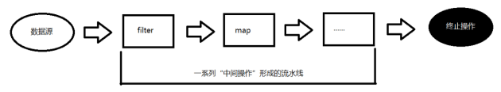

# Stream流

Stream API ( java.util.stream) 把真正的函数式编程风格引入到Java中。这是目前为止对Java类库最好的补充，因为Stream API可以极大提高Java程序员的生产力，让程序员写出高效率、干净、简洁的代码。

使用Stream API 对集合数据进行操作，就类似于使用 SQL 执行的数据库查询。也可以使用 Stream API 来并行执行操作。简言之，Stream API 提供了一种高效且易于使用的处理数据的方式。

**Stream是数据渠道，用于操作数据源（集合、数组等）所生成的元素序列。“集合讲的是数据，负责存储数据，Stream流讲的是计算，负责处理数据！”**

#### Stream流的特点

1.  Stream 自己不会存储元素。
2.  **Stream 不会改变源对象。每次处理都会返回一个持有结果的新Stream。**
3.  Stream 操作是延迟执行的。这意味着他们会等到需要结果的时候才执行。

#### Stream 的操作三个步骤

1.  创建 Stream 流：通过一个数据源（如：集合、数组），获取一个流
2.  中间操作：中间操作是个操作链，对数据源的数据进行n次处理，但是在终结操作前，并不会真正执行。
3.  终止操作：一旦执行终止操作，就执行中间操作链，最终产生结果并结束Stream。




## 创建Stream流

#### 通过集合

Java8 中的 Collection 接口被扩展，提供了两个获取流的方法：

- public default Stream stream() : 返回一个顺序流
- public default Stream parallelStream() : 返回一个并行流

```java
@Test
public void test1() {
    List<Integer> list = Arrays.asList(54, 45, 3254, 4, 563, 4, 5, 563, 132);
    // 创建一个顺序流
    Stream<Integer> stream = list.stream();
    // 创建一个并行流
    Stream<Integer> integerStream = list.parallelStream();
}
```

#### 通过数组

Java8 中的 Arrays 的静态方法 stream() 可以获取数组流：

- public static Stream stream(T[] array): 返回一个流

重载形式，能够处理对应基本类型的数组：

- public static IntStream stream(int[] array)：返回一个整型数据流
- public static LongStream stream(long[] array)：返回一个长整型数据流
- public static DoubleStream stream(double[] array)：返回一个浮点型数据流

```java
@Test
public void test2(){
    // 通过数组创建流
    int[] arr = {4,32,43,454,57,456,56,78,5,2,57,345,7,34,76};
    IntStream stream = Arrays.stream(arr);
}
```

#### 通过Stream.of()

可以调用Stream类静态方法 of(), 通过显示值创建一个流。它可以接收任意数量的参数。

- public static Stream of(T... values) : 返回一个顺序流

```java
@Test
public void test3(){
    Stream<Integer> stream = Stream.of(123, 2, 3421, 4, 35, 357, 345, 798, 34, 64);
}
```

#### 创建无限流

可以使用静态方法 Stream.iterate() 和 Stream.generate(), 创建无限流。

- public static Stream iterate(final T seed, final UnaryOperator f):返回一个迭代流

- public static Stream generate(Supplier s) ：返回一个无限流

```java
@Test
public void test4() {
    // 迭代流
    Stream<Integer> stream = Stream.iterate(10, e -> e + 1);
    stream.forEach(System.out::println);
}
```

结果：从10开始迭代，规则为后面的元素为前面元素+1 （e -> e+1）


```java
@Test
public void test5() {
    // 返回一个无限流
    Stream<Integer> stream = Stream.generate(() -> new Random().nextInt(200));
    stream.forEach(System.out::println);
}
```

结果：产生200内的随机int数


## 中间操作

多个中间操作可以连接起来形成一个流水线，除非流水线上触发终止操作，否则中间操作不会执行任何的处理！而在终止操作时一次性全部处理，称为“惰性求值”。

#### 中间操作API

| 方法名称 | 方法描述 |
| -------- | -------- |
|filter(Predicate p) |接收 Lambda ， 从流中过滤某些元素（留下满足筛选条件的元素）|
|distinct() |筛选，通过流所生成元素的equals() 去除重复元素|
|limit(long maxSize) |截断流，使其元素不超过给定数量|
|skip(long n) |跳过元素，返回一个扔掉了前 n 个元素的流。若流中元素不足 n 个，则返回一个空流。与 limit(n) 互补|
|peek(Consumer action) |接收Lambda，对流中的每个数据执行Lambda体操作|
|sorted() |产生一个新流，其中按自然顺序排序|
|sorted(Comparator com) |产生一个新流，其中按传入的比较器顺序排序|
|map(Function f) |接收一个函数作为参数，该函数会被应用到每个元素上，并将其映射成一个新的元素。|
|mapToDouble(ToDoubleFunction f) |接收一个函数作为参数，该函数会被应用到每个元素上，产生一个新的 DoubleStream。|
|mapToInt(ToIntFunction f) |接收一个函数作为参数，该函数会被应用到每个元素上，产生一个新的 IntStream。|
|mapToLong(ToLongFunction f) |接收一个函数作为参数，该函数会被应用到每个元素上，产生一个新的 LongStream。|
|flatMap(Function f) |接收一个函数作为参数，将流中的每个值都换成另一个流，然后把所有流连接成一个流|

**代码示例**

```java
// filter(Predicate p)
@Test
public void test1() {
    List<Integer> list = Arrays.asList(34, 54, 4, 56, 973, 4, 386, 3567, 23);
    // 留下大于20的元素
    list.stream().filter(e -> e > 20).forEach(System.out::println);
}

// distinct() 去除重复元素
@Test
public void test2() {
    List<Integer> list = Arrays.asList(34, 34, 34, 34, 34, 54, 4, 56, 973, 4, 386, 3567, 23);
    list.stream().distinct().forEach(System.out::println);
}

// limit(long maxSize) 保留前面maxSize之前的元素
@Test
public void test3() {
    List<Integer> list = Arrays.asList(34, 34, 34, 34, 34, 54, 4, 56, 973, 4, 386, 3567, 23);
    list.stream().limit(5).forEach(System.out::println);
}

// skip(long n) 跳过n个元素
@Test
public void test4() {
    List<Integer> list = Arrays.asList(34, 34, 34, 34, 34, 54, 4, 56, 973, 4, 386, 3567, 23);
    list.stream().skip(5).forEach(System.out::println);
}

// peek(Consumer action) 对流中的每个元素做操作
@Test
public void test5() {
    List<Integer> list = Arrays.asList(34, 34, 34, 34, 34, 54, 4, 56, 973, 4, 386, 3567, 23);
    list.stream().peek(e -> {
        System.out.print(e + " ");
    }).forEach(System.out::println);
}

// sorted() 对流做排序
@Test
public void test6() {
    List<Integer> list = Arrays.asList(34, 34, 34, 34, 34, 54, 4, 56, 973, 4, 386, 3567, 23);
    list.stream().sorted().forEach(System.out::println);
}

// map(Function f) 对流的每个元素做修改，然后放回流
@Test
public void test7() {
    List<Integer> list = Arrays.asList(34, 34, 34, 34, 34, 54, 4, 56, 973, 4, 386, 3567, 23);
    list.stream().map(e -> e * 2).forEach(System.out::println);
}

// flatMap(Function f) 将每个流中的元素转为流，然后合并
@Test
public void test22() {
    List<Integer> list = Arrays.asList(34, 54, 4, 56, 973, 4, 386, 3567, 23);
    List<Integer> list2 = Arrays.asList(234, 54664, 4523, 98, 65, 37, 8, 67467, 423, 879, 764);

    List<Integer> collect = Stream.of(list, list2).flatMap(e -> e.stream()).collect(Collectors.toList());
    System.out.println("collect = " + collect);
}
```


## 终结操作

终端操作会从流的流水线生成结果。其结果可以是任何不是流的值，例如：List、Integer，甚至是void。流进行了终止操作后，不能再次使用。

|方法|描述|
|-|-|
|boolean allMatch(Predicate p) |检查是否匹配所有元素|
|boolean anyMatch(Predicate p) |检查是否至少匹配一个元素|
|boolean noneMatch(Predicate p) |检查是否没有匹配所有元素|
|Optional findFirst()| 返回第一个元素|
|Optional findAny() |返回当前流中的任意元素|
|long count() |返回流中元素总数|
|Optional max(Comparator c) |返回流中最大值|
|Optional min(Comparator c) |返回流中最小值|
|void forEach(Consumer c) |迭代|
|T reduce(T iden, BinaryOperator b) |可以将流中元素反复结合起来，得到一个值。返回 T|
|U reduce(BinaryOperator b) |可以将流中元素反复结合起来，得到一个值。返回 Optional|
|R collect(Collector c) |将流转换为其他形式。接收一个 Collector接口的实现，用于给Stream中元素做汇总的方法|

Collector 接口中方法的实现决定了如何对流执行收集的操作(如收集到 List、Set、Map)。另外，Collectors 实用类提供了很多静态方法，可以方便地创建常见收集器实例。

**代码示例**

```java
// allMatch(Predicate p) 是否全部匹配
@Test
public void test1() {
    List<Integer> list = Arrays.asList(5, 342, 324, 46, 284, 48, 3, 45, 765, 31, 4, 234, 5674, 45645, 674, 5);
    System.out.println(list.stream().allMatch(e -> e < 50000));
}

// anyMatch(Perdicate p) 是否有匹配
@Test
public void test2() {
    List<Integer> list = Arrays.asList(5, 342, 324, 46, 284, 48, 3, 45, 765, 31, 4, 234, 5674, 45645, 674, 5);
    System.out.println(list.stream().anyMatch(e -> e > 40000));
}

// noneMatch(Predicate p) 是否全不匹配
@Test
public void test3() {
    List<Integer> list = Arrays.asList(5, 342, 324, 46, 284, 48, 3, 45, 765, 31, 4, 234, 5674, 45645, 674, 5);
    System.out.println(list.stream().noneMatch(e -> e < 0));
}

// Optional findFirst() 返回第一个元素
@Test
public void test4() {
    List<Integer> list = Arrays.asList(5, 342, 324, 46, 284, 48, 3, 45, 765, 31, 4, 234, 5674, 45645, 674, 5);
    System.out.println(list.stream().findFirst());
}

// Optional findAny() 随机返回一个元素
@Test
public void test5() {
    List<Integer> list = Arrays.asList(5, 342, 324, 46, 284, 48, 3, 45, 765, 31, 4, 234, 5674, 45645, 674, 5);
    System.out.println(list.parallelStream().findAny());
}

// count() 返回元素个数
@Test
public void test6() {
    List<Integer> list = Arrays.asList(5, 342, 324, 46, 284, 48, 3, 45, 765, 31, 4, 234, 5674, 45645, 674, 5);
    System.out.println(list.parallelStream().count());
}

// T reduce(T iden, BinaryOperator b) 规约，根据某种规则迭代地减少元素个数，返回最后一个元素
@Test
public void test7() {
    List<Integer> list = Arrays.asList(5, 342, 324, 46, 284, 48, 3, 45, 765, 31, 4, 234, 5674, 45645, 674, 5);
    // 这里是将两个元素加起来，从第一个加到到最后一个，然后返回
    System.out.println(list.stream().reduce((e1, e2) -> e1 + e2));
}

// collect(Collector c) 将流转化为其他形式
@Test
public void test8(){
    List<Integer> list = Arrays.asList(5, 342, 324, 46, 284, 48, 3, 45, 765, 31, 4, 234, 5674, 45645, 674, 5);
    Set<Integer> set = list.stream().collect(Collectors.toSet());
    System.out.println("set = " + set);
}
```

