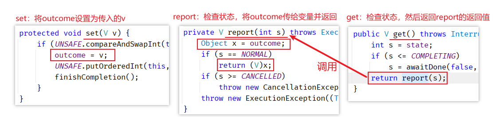

# JUC

## ReentrantLock 锁

ReentrantLock 是一个互斥的排他的可重入的公平/非公平锁。

### 快速上手

1、创建资源类，并提供两个打印方法以供测试

```java
private static class DataResource {

    // 创建lock 对象
    private ReentrantLock lock = new ReentrantLock();

    public void printA() {
        lock.lock();    //锁住
        try {
            System.out.println("A");
        }finally {
            lock.unlock();  // 无论如何都需要解锁，因此放在finally中
        }
    }

    public void printB() {
        lock.lock();
        try {
            System.out.println("B");
        } finally {
            lock.unlock();
        }
    }

}
```

2、创建两个线程，每个线程循环多次进行测试：如果未加锁，则会出现打印混乱的情况。这里加上了 ReentrantLock锁，因此先输出先抢到锁的线程

```java
public static void main(String[] args) throws InterruptedException {
    DataResource dataResource = new DataResource();
    
    new Thread(() -> {
        for (int i = 0; i < 100; i++) {
            dataResource.printA();
        }
    }).start();
    Thread.sleep(50);
    
    new Thread(() -> {
        for (int i = 0; i < 100; i++) {
            dataResource.printB();
        }
    }).start();
}
```

**构造方法**：public ReentrantLock(boolean fair)，可以设置公平或非公平竞争

**lock方法**：阻塞地获取锁。如果当前所被其他线程占有，则本线程直接阻塞等待竞争锁。

**trylock 方法**：尝试获取锁，不阻塞线程

>   ReentrantLock和synchronized区别：
>
>   1.  synchronized是独占锁，加锁和解锁的过程自动进行，易于操作，但不够灵活。ReentrantLock也是独占锁，加锁和解锁的过程需要手动进行，不易操作，但非常灵活。
>
>   2.  synchronized可重入，因为加锁和解锁自动进行，不必担心最后是否释放锁；ReentrantLock也可重入，但加锁和解锁需要手动进行，且次数需一样，否则其他线程无法获得锁。
>
>   3.  synchronized不可响应中断，一个线程获取不到锁就一直等着；ReentrantLock可以响应中断。

### Condition 线程间通信

Condition类可以控制ReentrantLock进行线程间通信。一个锁对应多个Condition。

```java
Condition c1 = reentrantLock.newCondition();
Condition c2 = reentrantLock.newCondition();
```

相关API：

| 方法签名                                | 方法说明                                     |
| --------------------------------------- | -------------------------------------------- |
| void await()                            | 阻塞当前线程并等待唤醒，等同于Object#wait()  |
| boolean await(long time, TimeUnit unit) | 超时等待，如果超时了，则不等了，继续往下执行 |
| void signal()                           | 随机唤醒一个Condition对象等待中的线程        |
| void signalAll()                        | 唤醒所有Condition对象等待中的线程            |

#### 多线程编程模板

- 基本模板：线程去操作资源类，符合低内聚、高耦合。

- 线程间通信：加锁{ while判断 -> 干活 -> 条件更变 -> 通知 }

    >   注意虚假唤醒：需要使用while判断代替if判断

- 两套模板：
    - synchronized：Object#{wait、notify/notifyAll}
    - ReentrantLock：Condition#{await、signal/signalAll}

需求：打印 01A23B45C67D...

##### synchronized模板

```java
public class Demo01 {

    public static void main(String[] args) {
        ShareData data = new ShareData();
        new Thread(() -> {
            for (int i = 0; i < 26; i++) {
                try {
                    data.numIncr();
                } catch (InterruptedException e) {
                    e.printStackTrace();
                }
            }
        }).start();
        new Thread(() -> {
            for (int i = 0; i < 13; i++) {
                try {
                    data.charIncr();
                } catch (InterruptedException e) {
                    e.printStackTrace();
                }
            }
        }).start();
    }

}


class ShareData {
    
    // 打印数字
    private Integer num = 0;

    // 答应字母
    private Character c = 'A';

    // 控制条件的变量
    private Integer numCondition = 0;

    public synchronized void numIncr() throws InterruptedException {
        // 判断
        while (numCondition == 2) {
            this.wait();
        }
        // 干活
        System.out.println(Thread.currentThread().getName() + ": " + num++);

        // 修改判断条件
        numCondition++;
        
        // 通知
        this.notifyAll();
    }

    public synchronized void charIncr() throws InterruptedException {
        while (numCondition != 2) {
            this.wait();
        }
        numCondition = 0;
        System.out.println(Thread.currentThread().getName() + ": " + (char) c++);

        this.notifyAll();
    }

}
```

##### ReentrantLock模板

```java
public class Demo03 {

    static class ResourceClass {

        private ReentrantLock reentrantLock = new ReentrantLock();

        Condition c1 = reentrantLock.newCondition();

        Condition c2 = reentrantLock.newCondition();

        private Integer flag = 0;

        private Integer num = 0;

        private Character ch = 'A';

        public void printChar() {
            reentrantLock.lock();
            // 判断
            try {
                while (flag == 2) {
                    c1.await();
                }
                // 干活
                System.out.println(Thread.currentThread().getName() + ": " + num++);

                // 条件更变：
                flag++;

                // 通知
                c2.signal();
            } catch (InterruptedException e) {
                e.printStackTrace();
            } finally {
                reentrantLock.unlock();
            }
        }

        public void printNum() {
            reentrantLock.lock();
            try {
                while (flag != 2) {
                    c2.await();
                }
                System.out.println(Thread.currentThread().getName() + ": " + (char) ch++);

                // 条件更变
                flag = 0;

                c1.signal();
            } catch (InterruptedException e) {
                e.printStackTrace();
            } finally {
                reentrantLock.unlock();
            }
        }

    }

    public static void main(String[] args) {
        ResourceClass resourceClass = new ResourceClass();
        new Thread(() -> {
            for (int i = 0; i < 26; i++) {
                resourceClass.printNum();
            }
        }).start();
        new Thread(() -> {
            for (int i = 0; i < 52; i++) {
                resourceClass.printChar();
            }
        }).start();
    }

}
```

### ReentrantReadWriteLock 读写锁

读写同一个资源的原则：

-   读读不互斥

-   读写互斥：若读与写可以并发，则会引起脏读
-   写写互斥：若读与读可以并发，则会引起幻读

代码示例：在读取的时候加上读取锁，在写入的时候加上写入锁

```java
class MyCache{
    private volatile Map<String, String> cache= new HashMap<>();
    // 加入读写锁
    ReentrantReadWriteLock rwl = new ReentrantReadWriteLock();

    public void put(String key, String value){
        // 加写锁
        rwl.writeLock().lock();
        try {
            System.out.println(Thread.currentThread().getName() + " 开始写入！");
            Thread.sleep(500);
            cache.put(key, value);
            System.out.println(Thread.currentThread().getName() + " 写入成功！");
        } catch (InterruptedException e) {
            e.printStackTrace();
        } finally {
            // 释放写锁
            rwl.writeLock().unlock();
        }
    }

    public void get(String key){
        // 加入读锁
        rwl.readLock().lock();
        try {
            System.out.println(Thread.currentThread().getName() + " 开始读出！");
            Thread.sleep(500);
            String value = cache.get(key);
            System.out.println(Thread.currentThread().getName() + " 读出成功！" + value);
        } catch (InterruptedException e) {
            e.printStackTrace();
        } finally {
            // 释放读锁
            rwl.readLock().unlock();
        }
    }
}
```


## 线程安全的容器

### COW 容器类

CopyOnWrite，写时复制

### 集合Synchronized化

### ConcurrentHashMap

目前表较完善的线程安全的Map类


## AQS 工具类

### CountDownLatch （倒计数器）闭锁

用法：闭锁对象维护一个计数器，在闭锁对象构造时时指定大小。可以调用闭锁对象的 `await()` 方法阻塞一个或多个线程，可以通过闭锁对象的 `countDown()` 使计数器减一。当闭锁的计数器减到0时，闭锁中断阻塞，调用闭锁阻塞的线程继续执行。

#### 常用方法：

| 方法签名                                          | 说明                                           |
| ------------------------------------------------- | ---------------------------------------------- |
| public CountDownLatch(int count)                  | 构造方法，传入计时器的初始值。                 |
| public void await()                               | 阻塞当前线程。                                 |
| public boolean await(long timeout, TimeUnit unit) | 超时等待时间，超时后，中断阻塞，继续执行线程。 |
| public void countDown()                           | 使计数器减一                                   |
| public long getCount()                            | 返回当前计数器的值                             |

#### 代码演示：

```java
public static void main(String[] args) throws InterruptedException {
    // 创建闭锁
    CountDownLatch latch = new CountDownLatch(10);

    // 建立子线程，使用latch阻塞。当latch计数器为0时继续往下执行
    new Thread(() -> {
        try {
            System.out.println("子线程开始");
            // 进入latch阻塞等待
            latch.await();
            System.out.println("子线程执行 await()后的代码");
        } catch (InterruptedException e) {
            e.printStackTrace();
        }
    }).start();

    // 依次循环减少latch的计数器值
    for (int i = 0; i < 10; i++) {
        TimeUnit.SECONDS.sleep(new Random().nextInt(3));
        // 使latch减一
        latch.countDown();
        System.out.println("第" + i + "位准备完成！当前latch计数器的值为：" + latch.getCount());
    }
}
```

### CyclicBarrier 循环栅栏

用法：CyclicBarrier对象在构造时指定阻塞的线程数。可以调用CyclicBarrier对象的 `await()` 方法阻塞线程（设置栅栏）。当被阻塞的线程数达到指定值时，释放阻塞（突破栅栏），当前线程继续执行。可以在代码的不同处设置栅栏。

#### 常用方法：

| 方法签名                                                  | 方法说明                                                     |
| --------------------------------------------------------- | ------------------------------------------------------------ |
| public CyclicBarrier(int parties)                         | 构造方法，用于指定阻塞线程数                                 |
| public CyclicBarrier(int parties, Runnable barrierAction) | 构造方法，用于指定线程数及突破栅栏时的动作<br />突破栅栏时的动作由最后一个达到栅栏阈值的线程执行 |
| public int await()                                        | 使当前线程进入阻塞，当线程数达到栅栏阈值时解除阻塞           |
| public int await(long timeout, TimeUnit unit)             | 超时阻塞，超时后自动突破栅栏                                 |
| public int getParties()                                   | 获取突破栅栏的线程数                                         |
| public int getNumberWaiting()                             | 获取当前正在栅栏处等待的线程数量                             |
| public boolean isBroken()                                 | 查看栅栏是否被打破。                                         |

#### 代码示例：

```java
public static void main(String[] args) {
    // 创建栅栏，设置突破栅栏的线程数及突破栅栏时执行内容
    CyclicBarrier cyclicBarrier = new CyclicBarrier(3, () -> {
        System.out.println(Thread.currentThread().getName() + "进入下一个阶段。");
    });
    for (int i = 0; i < 3; i++) {
        // 循环启动多个线程，在每个阶段设置栅栏（await()）。
        new Thread(() -> {
            try {
                System.out.println(Thread.currentThread().getName() + "开始任务1。。。");
                TimeUnit.SECONDS.sleep(new Random().nextInt(10));
                System.out.println(Thread.currentThread().getName() + "完成任务1");
                cyclicBarrier.await();

                System.out.println(Thread.currentThread().getName() + "开始任务2。。。");
                TimeUnit.SECONDS.sleep(new Random().nextInt(10));
                System.out.println(Thread.currentThread().getName() + "完成任务2");
                cyclicBarrier.await();

                System.out.println(Thread.currentThread().getName() + "开始任务3。。。");
                TimeUnit.SECONDS.sleep(new Random().nextInt(10));
                System.out.println(Thread.currentThread().getName() + "完成任务3");
                cyclicBarrier.await();

                System.out.println(Thread.currentThread().getName() + "开始任务4。。。");
                TimeUnit.SECONDS.sleep(new Random().nextInt(10));
                System.out.println(Thread.currentThread().getName() + "完成任务4");
                cyclicBarrier.await();
            } catch (InterruptedException | BrokenBarrierException e) {
                e.printStackTrace();
            }
        }).start();
    }
}
```

### Semaphore 信号量

用法：Semaphore对象在构造时可以指定信号量许可数，并通过其 `acquire()` 方法去抢占资源，每调用一次 `acquire()` 方法就会使许可数少一个。抢占到许可时，线程继续执行。没有抢占到许可时，线程阻塞在 `acquier()` 方法处。已抢占许可的线程可以通过Semaphore对象的 `release()` 方法释放许可。

| 方法签名                                               | 方法说明                                                 |
| ------------------------------------------------------ | -------------------------------------------------------- |
| public Semaphore(int permits)                          | 构造方法，设置信号量资源（非公平）                       |
| public Semaphore(int permits, boolean fair)            | 构造方法，设置信号量资源及是否公平竞争                   |
| public void acquire()                                  | 阻塞地竞争获取信号量许可                                 |
| public void acquire(int permits)                       | 阻塞地竞争获取信号量许可（获取多个）                     |
| public boolean tryAcquire()                            | 尝试获取信号量许可。如果存在则返回true，否则返回false    |
| public boolean tryAcquire(long timeout, TimeUnit unit) | 阻塞指定时间，竞争获取信号量许可。                       |
| public void release()                                  | 释放信号量许可                                           |
| public void release(int permits)                       | 释放信号量许可（释放多个，占有信号量许可必须 >= 释放的） |
| public int availablePermits()                          | 返回当前剩余的信号量许可数                               |
| isFair()                                               | 查看当前信号量是否公平                                   |

#### 代码示例：

```java
public static void main(String[] args) throws InterruptedException {
    // 创建信号量，设置信号量的许可数量
    Semaphore semaphore = new Semaphore(5);

    for (int i = 0; i < 10; i++) {
        // 循环创建多个线程，模拟获取信号量与释放信号量的操作
        new Thread(() -> {
            // System.out.println("创建线程：" + Thread.currentThread().getName());
            try {
                // 获取信号量许可
                semaphore.acquire();
                System.out.println(Thread.currentThread().getName() + "已获取信号量资源！执行业务代码中。。。");

                // 模拟执行代码耗时
                TimeUnit.SECONDS.sleep(5 + new Random().nextInt(10));

                // 释放信号量许可
                semaphore.release();
                System.out.println("业务代码执行完毕！" + Thread.currentThread().getName() + "已释放信号量资源！");
            } catch (InterruptedException e) {
                e.printStackTrace();
            }
        }).start();
    }
}
```


## Callable 接口

传统的实现多线程的方式有：继承Thread类，实现Run方法或实现Runnable接口，实现Run方法，并把该实现类扔到创建出的Thread类中。这两种创建线程的方式没有返回值，无法捕获线程抛出的异常（因此线程的异常只能内部消化，无法往外抛）

在JDK1.5提供了Callable接口，可以接收线程的返回值，及线程抛出的异常。

```java
@FunctionalInterface
public interface Callable<V> {
    /**
     * Computes a result, or throws an exception if unable to do so.
     *
     * @return computed result
     * @throws Exception if unable to compute a result
     */
    V call() throws Exception;
}
```

### Callable接口快速上手

1、实现Callable接口，编写多线程的代码。在实现Callable接口时需要指定返回值类型，即指定泛型。

```java
// 继承Callable接口，指定泛型
class MyThread implements Callable<Integer>{ 
    // 实现call方法
    @Override
    public Integer call() throws Exception {
        System.out.println("这是实现Callable创建的多线程。");
        return 123;
    }
}
```

2、创建线程，并接收返回值

```java
public static void main(String[] args) throws ExecutionException, InterruptedException {
    // 使用FutureTask来包装Callable接口的实现类
    FutureTask<Integer> futureTask = new FutureTask<>(new MyThread());

    // 依旧通过Thread来启动线程
    new Thread(futureTask).start();

    // 接收返回值，打印输出
    Integer result = futureTask.get();
    System.out.println("result = " + result);
}
```

>   注意：调用 `futureTask.get()` 时，若子线程未完成执行，则会阻塞调用方线程，直至子线程执行完毕，返回结果。
>
>   ```java
>   // 阻塞测试：在 call方法中睡3秒。
>   @Override
>   public Integer call() throws Exception {
>       System.out.println("这是实现Callable创建的多线程。");
>       TimeUnit.SECONDS.sleep(3);
>       return 123;
>   }
>   ```

### Future与FutureTask

Future与FutureTask的结构：

```java
// FutureTask实现了RunnableFuture接口
public class FutureTask<V> implements RunnableFuture<V> {}
// RunnableFuture继承了Runnable与Future接口，这就是FutureTask可以扔进Thread构造器的原因。
public interface RunnableFuture<V> extends Runnable, Future<V> {}
```


#### Future 接口

```java
public interface Future<V> {

    boolean cancel(boolean mayInterruptIfRunning);

    boolean isCancelled();

    boolean isDone();

    V get() throws InterruptedException, ExecutionException;

    V get(long timeout, TimeUnit unit)
        throws InterruptedException, ExecutionException, TimeoutException;
}
```

-   boolean cancel(boolean mayInterruptIfRunning)：尝试取消任务的执行。如果任务未执行，则会取消执行。如果任务已经开始执行，则根据传入的mayInterruptIfRunning来考虑是否需要中断：若任务可中断，则调用任务的interrupt方法尝试中断任务。若不可中断，那没办法了。
-   isCancelled()：检查任务是否已取消执行。
-   isDone()：检查任务是否已完成
-   get()：获取任务的执行结果。如果子线程任务没有执行完毕，则会阻塞等待。
-   get(long timeout, TimeUnit unit)：设置超时时间的获取结果。

#### FutureTask 接口

由于Future 只是⼀个接⼝，⽽它⾥⾯的 cancel ， get ， isDone 等⽅法要⾃⼰实现起来都是⾮常复杂的。所以JDK提供了⼀个 FutureTask 类来供我们使⽤。

在FutureTask中，有内置的等待赋值的Callable属性：

```java
/** The underlying callable; nulled out after running */
private Callable<V> callable;
```

一般用法是将Callable接口传入FutureTask构造器内，组合使用：

```java
// FutureTask构造器
public FutureTask(Callable<V> callable) {
    if (callable == null){
        throw new NullPointerException();
    }
    this.callable = callable;
    this.state = NEW;       // ensure visibility of callable
}
```

由于FutureTask间接继承了Runnable接口，因此多线程的实现也是在实现的 `run()` 方法中

```java
public void run() {
    if (state != NEW || !UNSAFE.compareAndSwapObject(this, runnerOffset, null, Thread.currentThread()))
        return;
    try {
        Callable<V> c = callable;
        if (c != null && state == NEW) {
            V result;
            boolean ran;
            try {
                // 此处调用了callable的call方法，获取计算的返回值（阻塞）。
                result = c.call();
                ran = true;
            } catch (Throwable ex) {
                result = null;
                ran = false;
                setException(ex);
            }
            // 如果已经调用，则将结果设置给FutureTask的属性，用于调用方获取结果(get())。
            if (ran) set(result);
        }
    } finally {
        // runner must be non-null until state is settled to
        // prevent concurrent calls to run()
        runner = null;
        // state must be re-read after nulling runner to prevent
        // leaked interrupts
        int s = state;
        if (s >= INTERRUPTING)
            handlePossibleCancellationInterrupt(s);
    }
}
```

FutureTask中用于存储返回值信息的属性：

```java
/** The result to return or exception to throw from get() */
private Object outcome; // non-volatile, protected by state reads/writes
```

返回流程：




## 阻塞队列 （BlockingQueue）

阻塞队列主要有两种情况，执行的线程会被阻塞：

1.  当队列满了继续添加元素
2.  当队列空了继续拿出元素

**阻塞队列主要用在生产者/消费者的场景**，下面这幅图展示了一个线程生产、一个线程消费的场景：


### 阻塞队列的结构

java.util.concurrent 包里的 BlockingQueue是一个接口，继承Queue接口，Queue接口继承 Collection。


BlockingQueue接口主要有以下7个实现类：

1. **ArrayBlockingQueue：由数组结构组成的有界阻塞队列。**
2. **LinkedBlockingQueue：由链表结构组成的有界（但大小默认值为integer.MAX_VALUE）阻塞队列。**
3. PriorityBlockingQueue：支持优先级排序的无界阻塞队列。
4. DelayQueue：使用优先级队列实现的延迟无界阻塞队列。
5. **SynchronousQueue：不存储元素的阻塞队列，也即单个元素的队列。**
6. LinkedTransferQueue：由链表组成的无界阻塞队列。
7. LinkedBlockingDeque：由链表组成的双向阻塞队列。

### 阻塞队列的方法分类

阻塞队列的入队出队方法可以分成以下4类：

|          | 抛出异常  | 特殊值   | 阻塞   | 超时                 |
| -------- | --------- | -------- | ------ | -------------------- |
| **插入** | add(e)    | offer(e) | put(e) | offer(e, time, unit) |
| **移除** | remove()  | poll()   | take() | poll(time, unit)     |
| **检查** | element() | peek()   | 不可用 | 不可用               |

**抛出异常**

-   add正常执行返回true，element（不删除）和remove返回阻塞队列中的第一个元素
-   当阻塞队列满时，再往队列里add插入元素会抛IllegalStateException:Queue full
-   当阻塞队列空时，再往队列里remove移除元素会抛NoSuchElementException
-   当阻塞队列空时，再调用element检查元素会抛出NoSuchElementException

**特定值**

-   插入方法，成功ture失败false
-   移除方法，成功返回出队列的元素，队列里没有就返回null
-   检查方法，成功返回队列中的元素，没有返回null

**一直阻塞**

-   如果试图的操作无法立即执行，该方法调用将会发生阻塞，直到能够执行。
-   当阻塞队列满时，再往队列里put元素，队列会一直阻塞生产者线程直到put数据or响应中断退出
-   当阻塞队列空时，再从队列里take元素，队列会一直阻塞消费者线程直到队列可用

**超时退出**

-   如果试图的操作无法立即执行，该方法调用将会发生阻塞，直到能够执行，但等待时间不会超过给定值。
-   返回一个特定值以告知该操作是否成功(典型的是 true / false)。

>   要实现阻塞，一般就用 `put(e)` 与 `take`


## ThreadPool 线程池

相比与自己创建多个线程，线程池的优势是可以通过参数配置来自动管理线程，用于约束线程的创建，销毁等操作。


-   Executor：线程池的顶级接口，只有一个 `execute(Runnable r);` 接口。

-   ExecutorService：对Executor接口的补充，增加了提交任务，终止任务，查看任务状态等方法。
-   AbstractExecutorService：进一步扩充
-   **ThreadPoolExecutor：具体的多线程线程池**
-   ScheduledExecutorService：计划执行任务的线程池接口
-   **ScheduledThreadPoolExecutor：具体的可计划执行多线程任务的线程池**

-   **Executors：线程池工具类**

### ThreadPoolExecutor 线程池

ThreadPoolExecutor 是具体执行管理与执行线程池的类，其构造方法如下：

```java
public ThreadPoolExecutor(int corePoolSize,
                          int maximumPoolSize,
                          long keepAliveTime,
                          TimeUnit unit,
                          BlockingQueue<Runnable> workQueue,
                          ThreadFactory threadFactory,
                          RejectedExecutionHandler handler) {
	// code...
}
```

#### 参数说明

- int corePoolSize：核心线程数
- int maximumPoolSize：最大线程数
- long keepAliveTime, TimeUnit unit：线程超时时间及时间单位。当线程数大于核心线程数时且超过线程超时时间时，则会销毁核心线程数以外的线程
- BlockQueue(Runnable) workQueue：线程队列，相当于线程依次执行的排队区
- ThreadFactory threadFactory：线程工厂，执行程序如果需要新的线程，用传入的线程工厂产生线程，一般使用默认的即可
- RejectedExecutionHandler handler：拒绝处理器（策略），表示当队列满了，并且工作线程大于或等于线程池的最大线程数（maximumPoolSize）时，如何来拒绝 请求执行的runnable的策略

#### 创建自定义线程池 new ThreadPoolExecutor

```java
private static class MyCallableThread implements Callable<Integer> {

    @Override
    public Integer call() throws Exception {
        System.out.println(Thread.currentThread().getName() + "执行了~ ");
        // 模拟执行耗时
        Thread.sleep( new Random().nextInt(5000));
        return 123;
    }

}

public static void main(String[] args) {
    ThreadPoolExecutor executor = new ThreadPoolExecutor(5, 10, 60, TimeUnit.SECONDS, new ArrayBlockingQueue<>(5));

    for (int i = 0; i < 10; i++) {
        FutureTask<Integer> futureTask = new FutureTask<>(new MyCallableThread());
        // 执行线程
        executor.submit(futureTask);
    }
    // 关闭线程池
    executor.shutdown();
}
```

#### 线程池底层工作原理


**文字说明**：

初始化线程池时，线程数为0

当有新任务提交时，会做出如下判断

1. 当前线程数是否小于或等于核心线程数，如果是，则创建新线程执行该任务
2. 如果线程数大于核心线程数，则会检查阻塞队列是否满了，如果未满，则会将任务添加到阻塞队列中
3. 如果阻塞队列已满，则会检查当前线程数是否小于最大线程数。如果小于，则新建线程并立刻执行该任务
4. 如果上述条件都不满足，则将任务提交给拒绝策略处理器进行处理。

当线程池中有任务空闲时，会进行如下操作：
1. 检查是空闲线程是否超时，如果未超时，则不做处理，如果超时了，则进行下面的检查
2. 检查线程数是否大于核心线程数，如果大于，则销毁线程，直至存活的线程数小于等于核心线程数

#### 拒绝策略

ThreadPoolExecutor自带的拒绝策略如下：

1. AbortPolicy(默认)：直接**抛出RejectedExecutionException异常**阻止系统正常运行
2. CallerRunsPolicy：“调用者运行”一种调节机制，该策略既不会抛弃任务，也不会抛出异常，而是**将某些任务回退到调用者**，从而降低新任务的流量。
3. DiscardOldestPolicy：**抛弃队列中等待最久的任务**，然后把当前任务加人队列中 尝试再次提交当前任务。
4. DiscardPolicy：**该策略默默地丢弃无法处理的任务**，不予任何处理也不抛出异常。 如果允许任务丢失，这是最好的一种策略。

采用不同拒绝策略：在自定义构造ThreadPoolExecutor时，可以采用不同拒绝策略

```java
ThreadPoolExecutor executor = new ThreadPoolExecutor(
    5, 10, 60, TimeUnit.SECONDS,
    new ArrayBlockingQueue<>(5),
    Executors.defaultThreadFactory(),
    new ThreadPoolExecutor.CallerRunsPolicy()	// 可以设置不同拒绝策略 
); 
```

自定义拒绝策略：实现 `RejectedExecutionHandler` 接口中的 `rejectedExecution` 方法

```java
class MyRejectPolicy implements RejectedExecutionHandler {

    /**
     * @param r        拒绝策略将要运行的代码
     * @param executor 拒绝策略的线程执行器
     */
    @Override
    public void rejectedExecution(Runnable r, ThreadPoolExecutor executor) {
        executor.execute(r);
    }

}
```

### Executor 线程池工具类

Executor封装了创建多种线程池的方法：

| 方法签名                                                     | 方法说明                               |
| ------------------------------------------------------------ | -------------------------------------- |
| ExecutorService newFixedThreadPool(int nThreads)             | 创建指定固定大小的线程池               |
| ExecutorService newFixedThreadPool(int nThreads, ThreadFactory threadFactory) | 创建指定大小的线程池，并指定线程池工厂 |
| ExecutorService newSingleThreadExecutor()                    | 创建只有一个线程的线程池               |
| ExecutorService newCachedThreadPool()                        | 创建缓存线程池，线程池连接数为2^32     |
| ScheduledExecutorService newSingleThreadScheduledExecutor()  | 创建单线程计划线程池                   |
| ScheduledExecutorService newScheduledThreadPool(int corePoolSize) | 创建计划线程池，可以指定线程池大小。   |

#### 代码演示

**普通线程池**：

```java
public static void main(String[] args) {
    // 创建固定大小的线程池
    // ExecutorService executorService = Executors.newFixedThreadPool(10);
    // ExecutorService executorService = Executors.newCachedThreadPool();
    ExecutorService executorService = Executors.newSingleThreadExecutor();
    // 循环开启15个线程
    for (int i = 0; i < 50; i++) {
        executorService.submit(() -> {
            // 输出线程池信息
            System.out.println(Thread.currentThread().getName());
            // 模拟代码执行时间
            try {
                TimeUnit.MILLISECONDS.sleep(new Random().nextInt(2000));
            } catch (InterruptedException e) {
                e.printStackTrace();
            }
        });
    }
    // 关闭线程池，否则会处于阻塞状态
    executorService.shutdown();
}
```

同一段代码，三种线程池的结果：

-   newFixedThreadPool：创建几个线程池，就循环地从线程池中获取线程
-   newCachedThreadPool：直接尽可能创建多的线程并执行
-   newSingleThreadExecutor：一个一个线程创建并执行

**计划线程池**：

```java
public static void main(String[] args) {

    // 创建计划线程池
    ScheduledExecutorService scheduledExecutorService = Executors.newScheduledThreadPool(10);
    System.out.println("开始执行计划代码");

    // 延迟执行一次
    scheduledExecutorService.schedule(() -> {
        // 输出线程池信息及时间信息
        System.out.println(Thread.currentThread().getName() + " -- " + new SimpleDateFormat("yyyy-MM-dd HH:mm:ss").format(new Date()));
    }, 5, TimeUnit.SECONDS);

    // 延迟并有频率地执行
    scheduledExecutorService.scheduleAtFixedRate(() -> {
        // 输出线程池信息
        System.out.println(Thread.currentThread().getName() + " -- " + new SimpleDateFormat("yyyy-MM-dd HH:mm:ss").format(new Date()));
    }, 3, 1, TimeUnit.SECONDS);
    
    // scheduledExecutorService.shutdown(); // 结束了之后就无法执行定时任务
}
```


## 相关原理

### JMM

Java Memory Model Java内存模型，

### volatile 关键字


### CAS

Compare And Swap 比较并交换

### AQS

AbstractQueuedSynchronizer 抽象的队列式的同步器

### 锁升级过程

