# 类加载子系统

## 概述

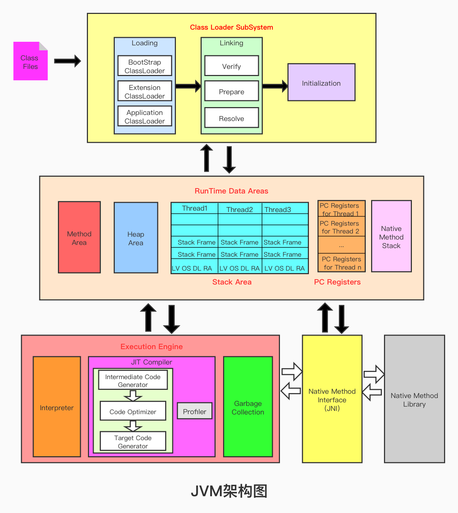


## 类加载子系统作用

1.  类加载子系统负责从文件系统或者网络中加载class文件，class文件在文件开头有特定的文件标识即16进制CA TE BA BE；

2.  加载后的Class类信息存放于一块成为方法区的内存空间。除了类信息之外，方法区还会存放运行时常量池信息，可能还包括字符串字面量和数字常量（这部分常量信息是Class文件中常量池部分的内存映射）

3.  ClassLoader只负责class文件的加载，至于它是否可以运行，则由Execution Engine决定

4.  如果调用构造器实例化对象，则其实例存放在堆区


来一张经典的JVM内存结构图：其中类**加载器的工作范围只限于下图的左半部分，不包含调用构造器实例化对象**

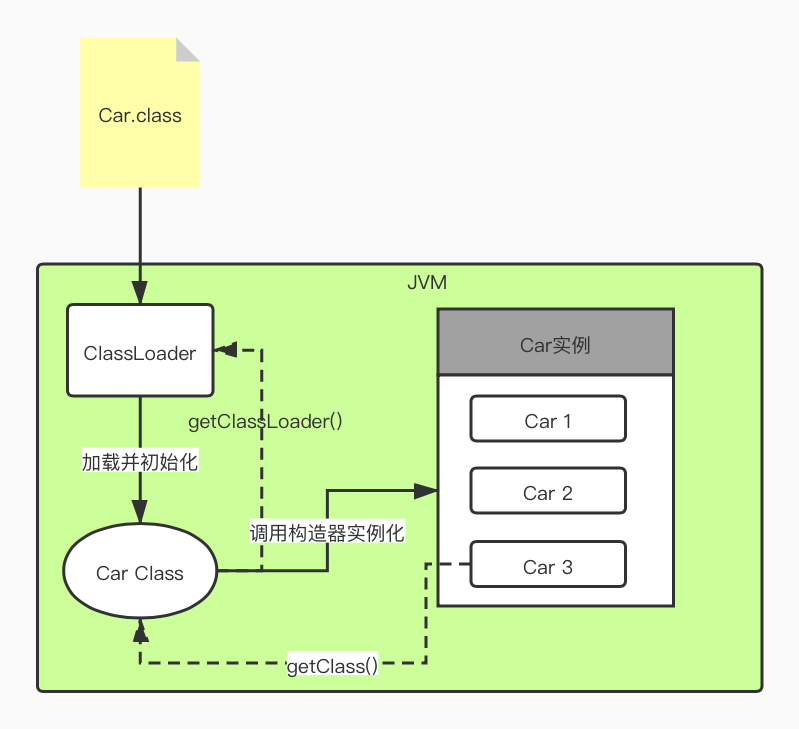

#### 类加载子系统功能细分

#### 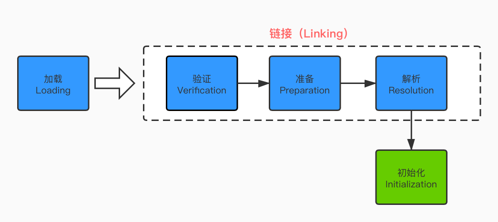

可以分为加载阶段，链接阶段与初始化阶段，其中链接阶段包括验证，准备与解析。

### 加载阶段（Load）

1.  通过一个类的全限定名获取定义此类的二进制字节流；
2.  将这个字节流所代表的的静态存储结构转化为方法区的运行时数据；
3.  在内存中生成一个代表这个类的java.lang.Class对象，作为方法区这个类的各种数据的访问入口

### 链接功能分为三块，即验证、准备、解析

#### 验证

1.  目的在于确保Class文件的字节流中包含信息符合当前虚拟机要求，保证被加载类的正确性，不会危害虚拟机自身安全。
2.  主要包括四种验证，文件格式验证，源数据验证，字节码验证，符号引用验证。

#### 准备

1.  为类变量分配内存并且**设置该类变量的默认初始值，即零值**；
2.  这里不包含用final修饰的sttic，因为final在编译的时候就会分配了，准备阶段会显式初始化；
3.  之类不会为实例变量分配初始化，类变量会分配在方法去中，而实例变量是会随着对象一起分配到java堆中。

#### 解析

1.  将常量池内的符号引用转换为直接引用的过程。
2.  事实上，解析操作往往会伴随着jvm在执行完初始化之后再执行
3.  符号引用就是一组符号来描述所引用的目标。符号应用的字面量形式明确定义在《java虚拟机规范》的class文件格式中。直接引用就是直接指向目标的指针、相对偏移量或一个间接定位到目标的句柄
4.  解析动作主要针对类或接口、字段、类方法、接口方法、方法类型等。对应常量池中的CONSTANT_Class_info/CONSTANT_Fieldref_info、CONSTANT_Methodref_info等。

### 初始化模块

这一步真正去执行类初始化的代码逻辑，包括**静态字段赋值的动作**，以及**执行类定义中的静态初始化块内的逻辑**，编译器在编译阶段就会把这部分逻辑整理好，**父类型的初始化逻辑优先于当前类型的逻辑**。

##### 初始化阶段就是执行类构造器方法clinit（）的过程

1.   clinit()即“class or interface initialization method”，注意他并不是指构造器init()
2.   此方法不需要定义，是javac编译器自动收集类中的所有类变量的赋值动作和静态代码块中的语句合并而来。 
3.   我们注意到如果没有静态变量c，那么字节码文件中就不会有clinit方法

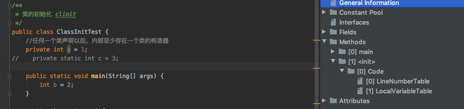

 

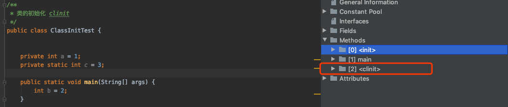

 

**构造器方法clinit()中指令按语句在源文件中出现的顺序执行**

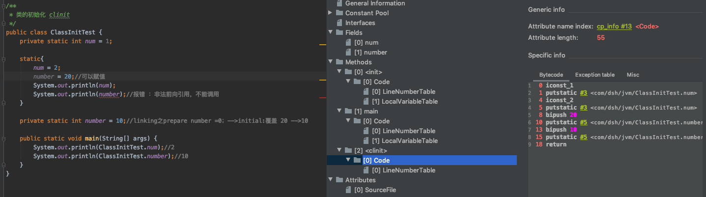

 

**虚拟机必须保证一个类的clinit()方法在多线程下被同步加锁**

即一个类只需被clinit一次，之后该类的内部信息就被存储在方法区。

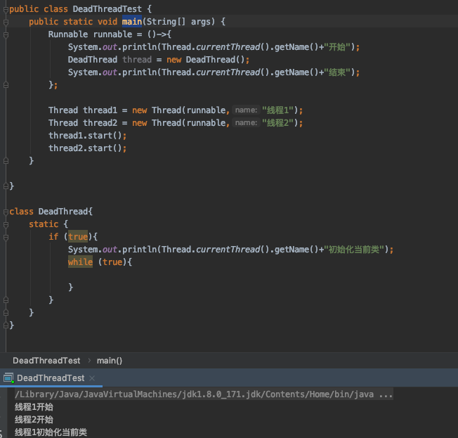

 可以看到线程2并不会重复执行初始化操作


## 类加载器分类

1.  JVM支持两种类型的加载器，分别为引导类加载器C/C++实现（BootStrap ClassLoader）和自定义类加载器由Java实现
2.  从概念上来讲，自定义类加载器一般指的是程序中由开发人员自定义的一类类加载器，但是java虚拟机规范却没有这么定义，而是将所有派生于抽象类ClassLoader的类加载器都划分为自定义类加载器。
3.  注意上图中的加载器划分关系为包含关系，并不是继承关系
4.  按照这样的加载器的类型划分，在程序中我们最常见的类加载器是：引导类加载器BootStrapClassLoader、自定义类加载器(Extension Class Loader、System Class Loader、User-Defined ClassLoader）

### 自定义类与核心类库的加载器

1.  对于用户自定义类来说：将使用系统类System Class Loader加载器中的AppClassLoader进行加载

2.  java核心类库都是使用引导类加载器BootStrapClassLoader加载的

#### 代码演示：

```java
/**
 * ClassLoader加载
 */
public class ClassLoaderTest {
    public static void main(String[] args) {
        //获取系统类加载器
        ClassLoader systemClassLoader = ClassLoader.getSystemClassLoader();
        System.out.println(systemClassLoader);//sun.misc.Launcher$AppClassLoader@18b4aac2
        //获取其上层  扩展类加载器
        ClassLoader extClassLoader = systemClassLoader.getParent();
        System.out.println(extClassLoader);//sun.misc.Launcher$ExtClassLoader@610455d6
        //获取其上层 获取不到引导类加载器
        ClassLoader bootStrapClassLoader = extClassLoader.getParent();
        System.out.println(bootStrapClassLoader);//null
        //对于用户自定义类来说：使用系统类加载器进行加载
        ClassLoader classLoader = ClassLoaderTest.class.getClassLoader();
        System.out.println(classLoader);//sun.misc.Launcher$AppClassLoader@18b4aac2
        //String 类使用引导类加载器进行加载的  -->java核心类库都是使用引导类加载器加载的
        ClassLoader classLoader1 = String.class.getClassLoader();
        System.out.println(classLoader1);//null获取不到间接证明了String 类使用引导类加载器进行加载的
    }
}
```

### 虚拟机自带的加载器

#### 启动类加载器（引导类加载器，BootStrap ClassLoader）

1.  这个类加载使用C/C++语言实现的，嵌套在JVM内部
2.  它用来加载java的核心库（JAVA_HOME/jre/lib/rt.jar/resources.jar或sun.boot.class.path路径下的内容），用于提供JVM自身需要的类
3.  并不继承自java.lang.ClassLoader,没有父加载器
4.  加载拓展类和应用程序类加载器，并指定为他们的父加载器，即ClassLoader
5.  出于安全考虑，BootStrap启动类加载器只加载包名为java、javax、sun等开头的类

#### 拓展类加载器（Extension ClassLoader）

1.  java语言编写 ，由sun.misc.Launcher$ExtClassLoader实现。
2.  派生于ClassLoader类
3.  从java.ext.dirs系统属性所指定的目录中加载类库，或从JDK的安装目录的jre/lib/ext子目录（扩展目录）下加载类库。如果用户创建的JAR放在此目录下，也会由拓展类加载器自动加载

#### 应用程序类加载器（系统类加载器，AppClassLoader）

1.  java语言编写， 由sun.misc.Launcher$AppClassLoader实现。
2.  派生于ClassLoader类
3.  它负责加载环境变量classpath或系统属性 java.class.path指定路径下的类库
4.  该类加载器是程序中默认的类加载器，一般来说，java应用的类都是由它来完成加载
5.  通过ClassLoader#getSystemClassLoader()方法可以获取到该类加载器

#### 代码演示

```java
/**
 * 虚拟机自带加载器
 */
public class ClassLoaderTest1 {
    public static void main(String[] args) {
        System.out.println("********启动类加载器*********");
        URL[] urls = sun.misc.Launcher.getBootstrapClassPath().getURLs();
        // 获取BootStrapClassLoader能够加载的api路径
        for (URL e : urls) {
            System.out.println(e.toExternalForm());
        }
        // 从上面的路径中随意选择一个类 看看他的类加载器是什么
        // Provider位于 /jdk1.8.0_171.jdk/Contents/Home/jre/lib/jsse.jar 下，引导类加载器加载它
        ClassLoader classLoader = Provider.class.getClassLoader();
        System.out.println(classLoader);// null
        System.out.println("********拓展类加载器********");
        String extDirs = System.getProperty("java.ext.dirs");
        for (String path : extDirs.split(";")) {
            System.out.println(path);
        }
        // 从上面的路径中随意选择一个类 看看他的类加载器是什么:拓展类加载器
        ClassLoader classLoader1 = CurveDB.class.getClassLoader();
        System.out.println(classLoader1);// sun.misc.Launcher$ExtClassLoader@4dc63996
    }
}
```

### 知识扩展：启动类加载器BootStrapClassLoader能够加载的api路径有

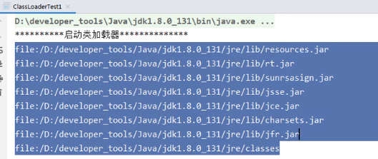

java.time.、java.util.、java.nio.、java.lang.、java.text.、java.sql.、java.math.*等等都在rt.jar包下

 

#  为什么要使用用户自定义类加载器

1.  隔离加载类
2.  修改类加载的方式
3.  拓展加载源
4.  防止源码泄漏

### 用户自定义类加载器实现步骤

1.  继承抽象类java.lang.ClassLoader（可以实现加密等中间操作）
2.  继承URLClassLoader类，可以避免自己写findClass()方法，更加简洁


# ClassLoader的常用方法及获取方法

ClassLoader类，它是一个抽象类，其后所有的类加载器都继承自ClassLoader（不包括启动类加载器）

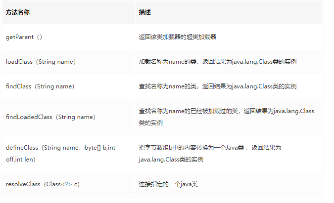

### ClassLoader继承关系


 

### 代码演示

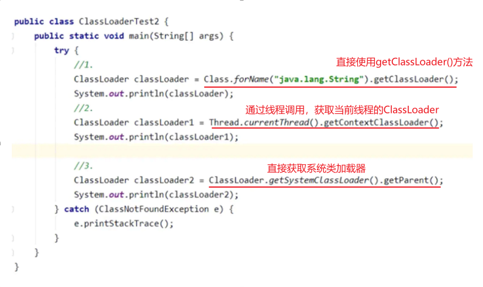


## 双亲委派机制

Java虚拟机对class文件采用的是按需加载的方式，也就是说当需要使用该类时才会将她的class文件加载到内存生成的class对象。而且加载某个类的class文件时，java虚拟机采用的是双亲委派模式，即把请求交由父类处理，它是一种任务委派模式

### 双亲委派机制工作原理

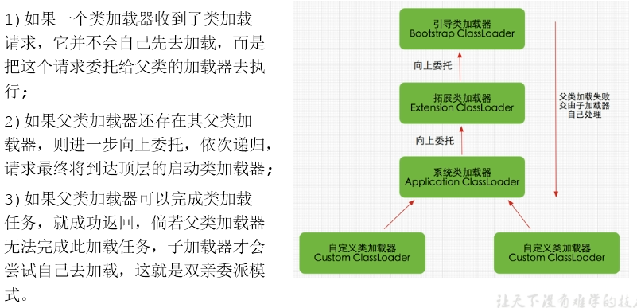

### 砂箱安全机制代码示例

如图，虽然我们自定义了一个java.lang包下的String尝试覆盖核心类库中的String，但是由于双亲委派机制，启动加载器会加载java核心类库的String类（BootStrap启动类加载器只加载包名为java、javax、sun等开头的类），而核心类库中的String并没有main方法

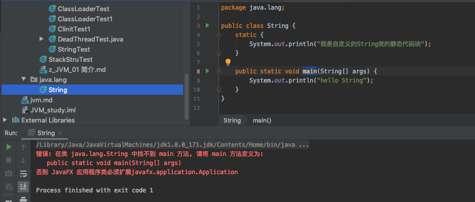

### 双亲委派机制的优势

1.  避免类的重复加载，如上
2.  保护程序安全，防止核心API被随意修改

启动类加载器可以抢在标准扩展类装载器之前去装载类，而标准扩展类装载器可以抢在类路径加载器之前去装载那个类，类路径装载 器又可以抢在自定义类加载器之前去加载它。所以Java虚拟机先从最可信的Java核心API查找类型，这是为了防止不可靠的类扮演被信任的类，试想一 下，网络上有个名叫java.lang.Integer的类，它是某个黑客为了想混进java.lang包所起的名字，实际上里面含有恶意代码，但是这种 伎俩在双亲模式加载体系结构下是行不通的，因为网络类加载器在加载它的时候，它首先调用双亲类加载器，这样一直向上委托，直到启动类加载器，而启动类加载 器在核心Java API里发现了这个名字的类，所以它就直接加载Java核心API的java.lang.Integer类，然后将这个类返回，所以自始自终网络上的 java.lang.Integer的类是不会被加载的。

1.  保证核心API包的访问权限

但是如果这个移动代码不是去试图替换一个被信任的类（就是前面说的那种情况），而是想在一个被信任的包中插入一个全新的类型，情况会怎样呢？比如一个名为 java.lang.Virus的类，经过双亲委托模式，最终类装载器试图从网络上下载这个类，因为网络类装载器的双亲们都没有这个类（当然没有了，因为 是病毒嘛）。假设成功下载了这个类，那你肯定会想，Virus和lang下的其他类痛在java.lang包下，暗示这个类是Java API的一部分，那么是不是也拥有修改Java.lang包中数据的权限呢？答案当然不是，因为要取得访问和修改java.lang包中的权 限，java.lang.Virus和java.lang下其他类必须是属于同一个运行时包的，什么是运行时包？运行时包是指由同一个类装载器装载的、属 于同一个包的、多个类型的集合。考虑一下，java.lang.Virus和java.lang其他类是同一个类装载器装载的吗？不是 的！java.lang.Virus是由网络类装载器装载的！

自定义类：java.lang.MeDsh（java.lang包需要访问权限，阻止我们用包名自定义类）

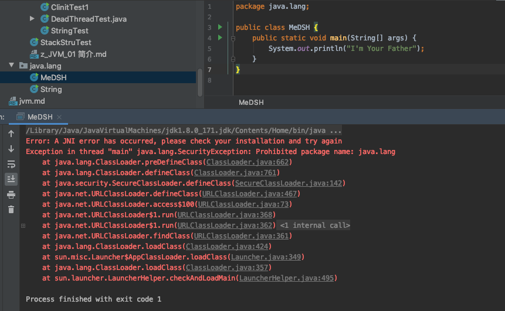

### 双亲委派机制在SPI中的应用

1.   某个应用程序由双亲委派机制找到引导类加载器，首先调用rt.jar包中的SPI核心，但由于SPI核心当中有各种各样的接口需要被实现（这里指具体的服务提供商），这里我们已JDBC.jar为例，jdbc.jar可以为我们提供具体的实现。
2.   那么这时我们需要反向委托，找到线程上下文类加载器去加载jdbc.jar
3.   线程上下文类加载器属于系统类加载器

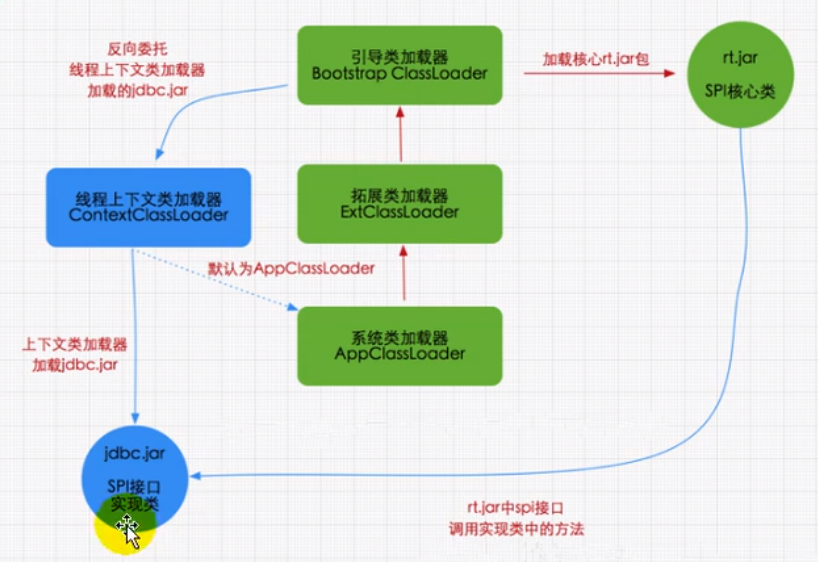

 

## JVM中表示两个class对象是否为同一个类

1.  在jvm中表示两个class对象是否为同一个类存在的两个必要条件

-   -   类的完整类名必须一致，包括包名
    -   即使类的完整类名一致，同时要求加载这个类的ClassLoader（指ClassLoader实例对象）必须相同；是引导类加载器、还是定义类加载器

1.  换句话说，在jvm中，即使这两个类对象（class对象）来源同一个Class文件，被同一个虚拟机所加载，但只要加载它们的ClassLoader实例对象不同，那么这两个类对象也是不相等的.
2.  对类加载器的引用，JVM必须知道一个类型是有启动类加载器加载的还是由用户类加载器加载的。如果一个类型由用户类加载器加载的，那么jvm会将这个类加载器的一个引用作为类型信息的一部分保存在方法区中。当解析一个类型到另一个类型的引用的时候，JVM需要保证两个类型的加载器是相同的。


## 类的主动使用和被动使用

java程序对类的使用方式分为：主动使用和被动使用，即是否调用了clinit()方法

主动使用在类加载系统中的第三阶段initialization即初始化阶段调用了clinit()方法，而被动使用不会去调用

主动使用，分为七种情况

1.  创建类的实例
2.  访问某各类或接口的静态变量，或者对静态变量赋值
3.  调用类的静态方法
4.  反射 比如Class.forName(com.dsh.jvm.xxx)
5.   初始化一个类的子类
6.  java虚拟机启动时被标明为启动类的类
7.  JDK 7 开始提供的动态语言支持：java.lang.invoke.MethodHandle实例的解析结果REF_getStatic、REF_putStatic、REF_invokeStatic句柄对应的类没有初始化，则初始化


除了以上七种情况，其他使用java类的方式都被看作是对类的被动使用，都不会导致类的初始化。