# 栈帧的内部结构

## 栈的组成

1.  **局部变量表**（Local Variables）
2.  **操作数栈**（Operand Stack）(或表达式栈)
3.  **动态链接**（Dynamic Linking）(或执行"运行时常量池"的方法引用)----深入理解Java多态特性必读！！
4.  方法返回地址（Return Adress）（或方法正常退出或者异常退出的定义）
5.  一些附加信息

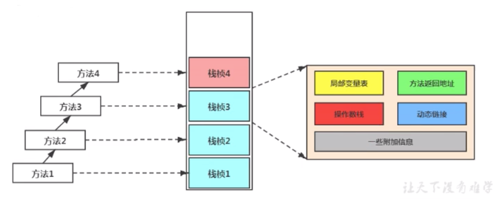

其中部分参考书目上，称方法返回地址、动态链接、附加信息为帧数据区 


## 局部变量表（Local Variables）

1.  局部变量表也被称之为局部变量数组或本地变量表
2.  **定义为一个数字数组，主要用于存储方法参数和定义在方法体内的局部变量**这些数据类型包括各类基本数据类型、对象引用（reference），以及returnAddress 类型
3.  由于局部变量表是建立在线程的栈上，是线程私有的数据，因此不存在数据安全问题
4.  **局部变量表所需的容量大小是在编译期确定下来的**,并保存在方法的Code属性的maximum local variables数据项中。在方法运行期间是不会改变局部变量表的大小的
5.  **方法嵌套调用的次数由栈的大小决定。一般来说，栈越大，方法嵌套调用次数越多**。对一个函数而言，他的参数和局部变量越多，使得局部变量表膨胀，它的栈帧就越大，以满足方法调用所需传递的信息增大的需求。进而函数调用就会占用更多的栈空间。
6.  **局部变量表中的变量只在当前方法调用中有效**。在方法执行时，虚拟机通过使用局部变量表完成参数值到参数变量列表的传递过程。**当方法调用结束后，随着方法栈帧的销毁，局部变量表也会随之销毁。**

### 查看帧的局部变量表

利用javap命令对字节码文件进行解析查看main()方法对应栈帧的局部变量表，如图：

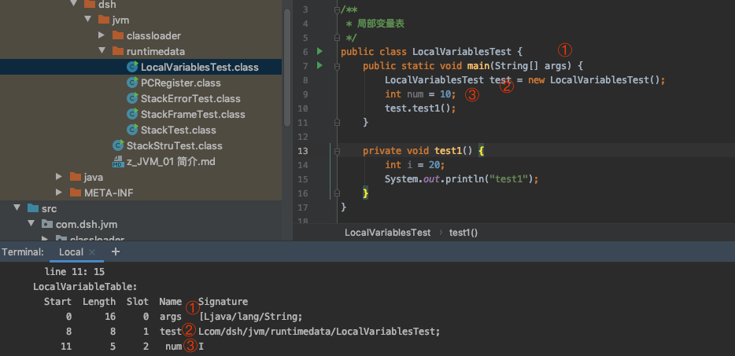

也可以在IDEA 上安装jclasslib byte viewcoder插件查看方法内部字节码信息剖析，以main()方法为例

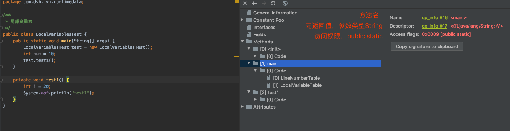

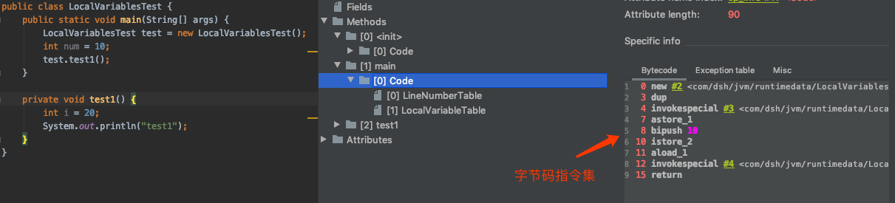

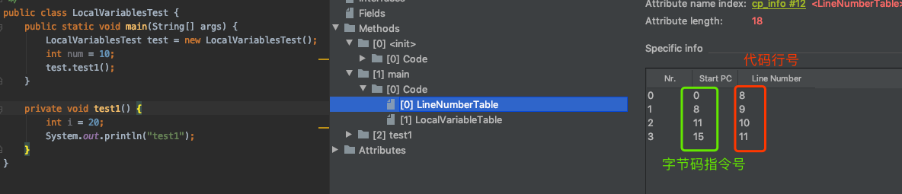

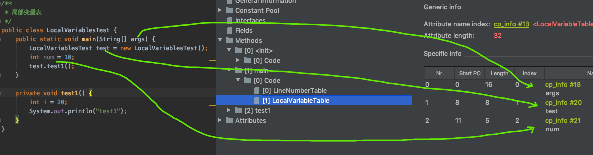

### 变量槽slot的理解与演示

1.  参数值的存放总是在局部变量数组的index0开始，到数组长度-1的索引结束
2.  **局部变量表，最基本的存储单元是Slot(变量槽)**
3.  局部变量表中存放编译期可知的各种基本数据类型（8种），引用类型（reference），returnAddress类型的变量。
4.  在局部变量表里，**32位以内的类型只占用一个slot（包括returnAddress类型），64位的类型（long和double）占用两个slot。byte、short、char、float在存储前被转换为int，boolean也被转换为int，0表示false，非0表示true；long和double则占据两个slot。**
5.  JVM会为局部变量表中的每一个slot都分配一个访问索引，通过这个索引即可成功访问到局部变量表中指定的局部变量值
6.  当一个实例方法被调用的时候，**它的方法参数和方法体内部定义的局部变量将会按照声明顺序被复制到局部变量表中的每一个slot上**
7.  **如果需要访问局部变量表中一个64bit的局部变量值时，只需要使用前一个索引即可**。（比如：访问long或者double类型变量）
8.  如果当前帧是由构造方法或者实例方法创建的（**意思是当前帧所对应的方法是构造器方法或者是普通的实例方法），那么该对象引用this将会存放在index为0的slot处**,其余的参数按照参数表顺序排列。
9.   静态方法中不能引用this，**是因为静态方法所对应的栈帧当中的局部变量表中不存在this**


#### 示例代码：

```java
public class LocalVariablesTest {
    private int count = 1;
    // 静态方法不能使用this
    public static void testStatic() {
        // 编译错误，因为this变量不存在与当前方法的局部变量表中！！！
        System.out.println(this.count);
    }
}
```

### slot的重复利用

栈帧中的局部变量表中的槽位是可以重复利用的，如果一个局部变量过了其作用域，那么在其作用域之后申明的新的局部变量就很有可能会复用过期局部变量的槽位，从而达到节省资源的目的。

```java
private void test2() {
    int a = 0;
    {
        int b = 0;
        b = a+1;
    }
    //变量c使用之前以及经销毁的变量b占据的slot位置
    int c = a+1;
}
```

上述代码对应的栈帧中局部变量表中一共有多少个slot，或者说局部变量表的长度是几？

答案是3：

变量b的作用域是

```java
{
     int b = 0;
     b = a+1;
}
```

this占0号、a单独占1个槽号、c重复使用了b的槽号

### 静态变量与局部变量的对比

变量的分类：

-   按照数据类型分：

○ 基本数据类型;

○ 引用数据类型；

-   按照在类中声明的位置分：

○ 成员变量：在使用前，都经历过默认初始化赋值

-   -   -   static修饰：类变量, 类加载链接的准备preparation阶段给类变量默认赋值——>初始化阶段initialization给类变量显式赋值即静态代码块赋值；
        -   不被static修饰：实例变量：随着对象的创建，会在堆空间分配实例变量空间，并进行默认赋值

○ 局部变量：在使用前，必须要进行显式赋值的！否则，编译不通过

### 补充说明

-   在栈帧中，与性能调优关系最为密切的部分就是局部变量表。在方法执行时，虚拟机使用局部变量表完成方法的传递

-   **局部变量表中的变量也是重要的垃圾回收根节点，只要被局部变量表中直接或间接引用的对象都不会被回收**

    

## 操作数栈（Operand Stack）

1.  栈 ：可以使用数组或者链表来实现

2.  每一个独立的栈帧中除了包含局部变量表以外，还包含一个后进先出的操作数栈，也可以成为表达式栈

3.  **操作数栈，在方法执行过程中，根据字节码指令，往栈中写入数据或提取数据，即入栈（push）或出栈（pop）**

    某些字节码指令将值压入操作数栈，其余的字节码指令将操作数取出栈，使用他们后再把结果压入栈。（如字节码指令bipush操作）比如：执行复制、交换、求和等操作

#### 代码举例

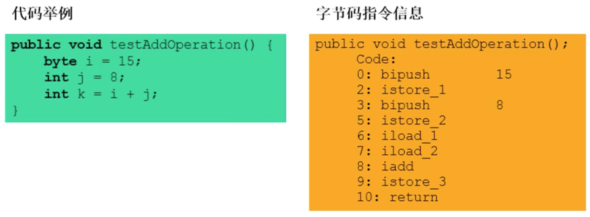

 

### 操作数栈特点

-   操作数栈，**主要用于保存计算过程的中间结果，同时作为计算过程中变量临时的存储空间。**
-   操作数栈就是jvm执行引擎的一个工作区，当一个方法开始执行的时候，一个新的栈帧也会随之被创建出来，这个方法的操作数栈是空的
-   每一个操作数栈都会拥有一个明确的栈深度用于存储数值，其所需的最大深度在编译器就定义好了，保存在方法的code属性中，为max_stack的值。
-   栈中的任何一个元素都是可以任意的java数据类型

-   -   32bit的类型占用一个栈单位深度
    -   64bit的类型占用两个栈深度单位

-   操作数栈**并非采用访问索引的方式来进行数据访问**的，而是只能通过标准的入栈push和出栈pop操作来完成一次数据访问
-   **如果被调用的方法带有返回值的话，其返回值将会被压入当前栈帧的操作数栈中****，**并更新PC寄存器中下一条需要执行的字节码指令。
-   操作数栈中的元素的数据类型必须与字节码指令的序列严格匹配，这由编译器在编译期间进行验证，同时在类加载过程中的类验证阶段的数据流分析阶段要再次验证。
-   另外，我们说Java虚拟机的**解释引擎是基于栈的执行引擎**,其中的栈指的就是操作数栈。

### 操作数栈代码追踪

结合上图结合下面的图来看一下一个方法（栈帧）的执行过程

①15入栈；②存储15，15进入局部变量表

**注意：局部变量表的0号位被构造器占用，这里的15从局部变量表1号开始**

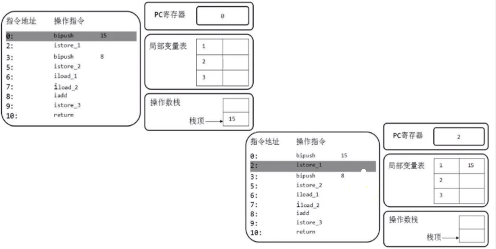

③压入8；④8出栈，存储8进入局部变量表；

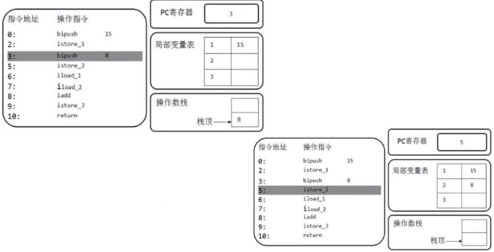

⑤从局部变量表中把索引为1和2的是数据取出来，放到操作数栈；⑥iadd相加操作

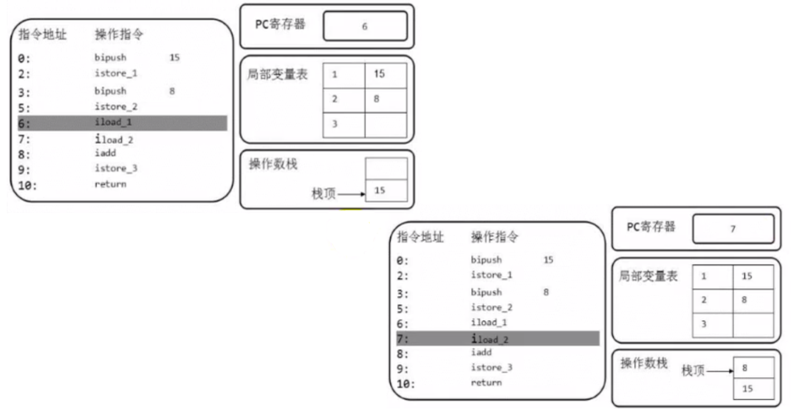

⑦iadd操作结果23出栈⑧将23存储在局部变量表索引为3的位置上istore_3

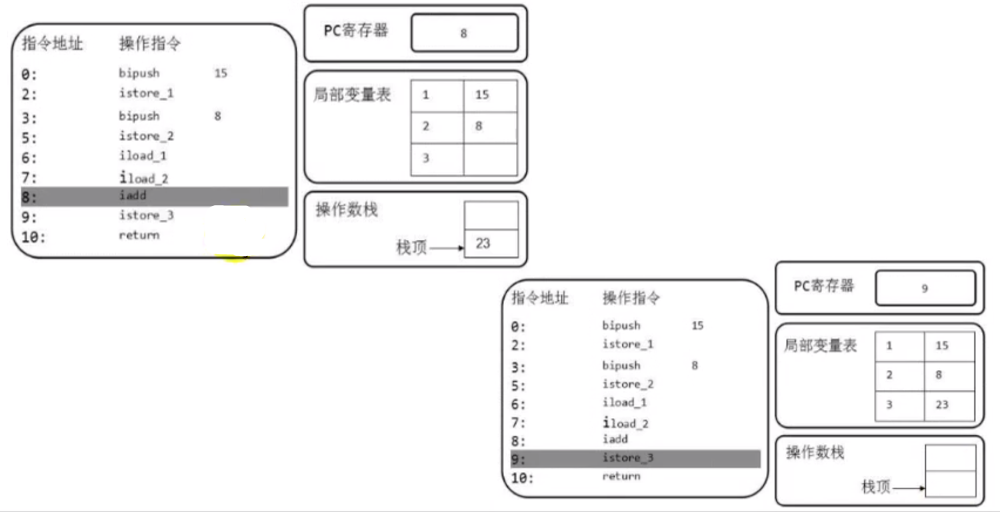

### 栈顶缓存技术ToS（Top-of-Stack Cashing）

-   基于栈式架构的虚拟机所使用的零地址指令（即不考虑地址，单纯入栈出栈）更加紧凑，但完成一项操作的时候必然需要使用更多的入栈和出栈指令，这同时也就意味着将需要更多的指令分派（instruction      dispatch）次数和内存读/写次数
-   由于操作数是存储在内存中的，因此频繁地执行内存读/写操作必然会影响执行速度。为了解决这个问题，HotSpot      JVM的设计者们提出了栈顶缓存技术，**将栈顶元素全部缓存在物理CPU的寄存器中，以此降低对内存的读/写次数，提升执行引擎的执行效率**


## 动态链接（Dynamic Linking）

1.  **运行时常量池位于方法区（注意： JDK1.7 及之后版本的 JVM 已经将运行时常量池从方法区中移了出来，在 Java 堆（Heap）中开辟了一块区域存放运行时常量池。）**字节码中的常量池结构如下：

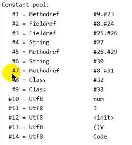

为什么需要常量池呢？

常量池的作用，就是为了提供一些符号和常量，便于指令的识别。下面提供一张测试类的运行时字节码文件格式

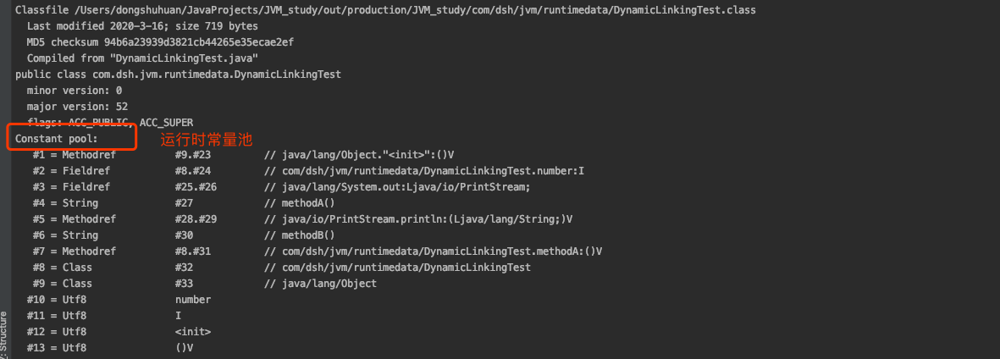


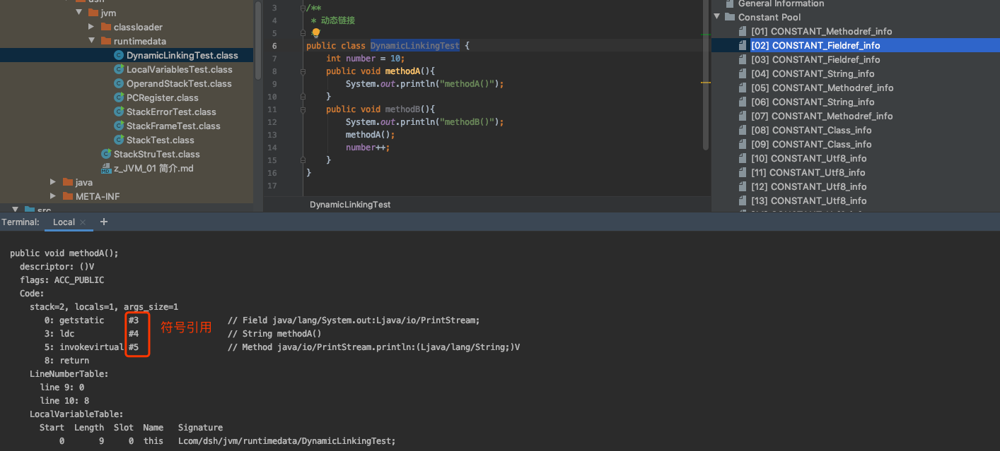

1.  每一个栈帧内部都包含一个指向运行时常量池Constant pool或该栈帧所属方法的引用。包含这个引用的目的就是为了支持当前方法的代码能够实现动态链接。比如invokedynamic指令
2.  在Java源文件被编译成字节码文件中时，所有的变量和方法引用都作为符号引用（symbolic Refenrence）保存在class字节码文件（javap反编译查看）的常量池里。比如：描述一个方法调用了另外的其他方法时，就是通过常量池中指向方法的符号引用来表示的，**那么动态链接的作用就是为了将这些符号引用（#）最终转换为调用方法的直接引用。**

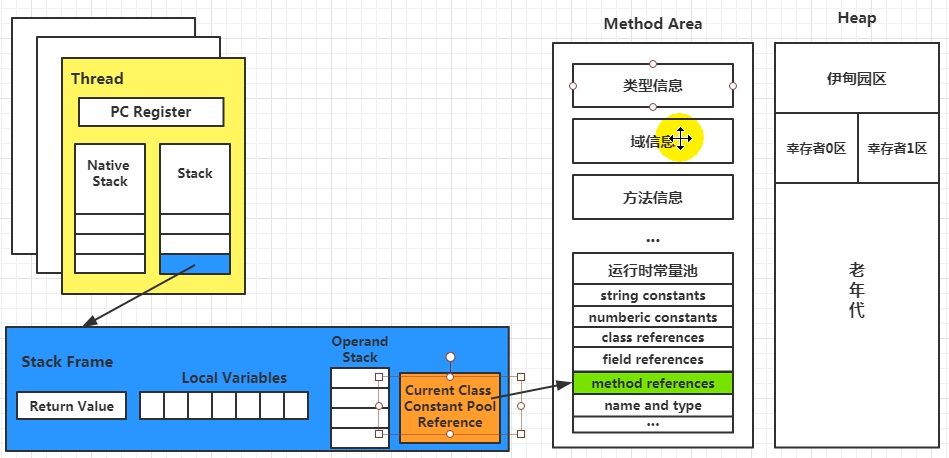

### 方法的调用

在JVM中，将符号引用转换为调用方法的直接引用与方法的绑定机制相关

-   **静态链接**

当一个 字节码文件被装载进JVM内部时，如果被调用的目标方法在编译期可知，且运行期保持不变时。这种情况下将调用方法的符号引用转换为直接引用的过程称之为静态链接。

-   **动态链接**

如果被调用的方法在编译期无法被确定下来，也就是说，只能够在程序运行期将调用方法的符号引用转换为直接引用，由于这种引用转换过程具备动态性，因此也就被称之为动态链接。

对应的方法的绑定机制为：早起绑定（Early Binding）和晚期绑定（Late Bingding）。绑定是一个字段、方法或者类在符号引用被替换为直接引用的过程，这仅仅发生一次。

-   **早期绑定**

早期绑定就是指被调用的目标方法如果在编译期可知，且运行期保持不变时，即可将这个方法与所属的类型进行绑定，这样一来，由于明确了被调用的目标方法究竟是哪一个，因此也就可以使用静态链接的方式将符号引用转换为直接引用。

-   **晚期绑定**

如果被调用的方法在编译期无法被确定下来，只能够在程序运行期根据实际的类型绑定相关的方法，这种绑定方式也就被称之为晚期绑定。

随着高级语言的横空出世，类似于java一样的基于面向对象的编程语言如今越来越多，尽管这类编程语言在语法风格上存在一定的差别，但是它们彼此之间始终保持着一个共性，那就是都支持封装，**集成和多态**等面向对象特性，既然这一类的编程语言具备多态特性，那么自然也就具备早期绑定和晚期绑定两种绑定方式。

Java中任何一个普通的方法其实都具备虚函数的特征，它们相当于C语言中的虚函数（C中则需要使用关键字virtual来显式定义）。**如果在Java程序中不希望某个方法拥有虚函数的特征时，则可以使用关键字final来标记这个方法。**


## 方法返回地址（Return Address）

-   存放调用该方法的方法的PC寄存器的值。
-   一个方法的结束，有两种方式：

-   -   正常执行完成
    -   出现未处理的异常，非正常退出

-   无论通过哪种方式退出，在**方法退出后都返回到该方法被调用的位置**。方法正常退出时，**调用者（方法的调用者可能也是一个方法）的pc计数器的值作为返回地址，即调用该方法的指令的下一条指令的地址。**而通过异常退出时，返回地址是要通过异常表来确定，栈帧中一般不会保存这部分信息。
-   **本质上，方法的退出就是当前栈帧出栈的过程。**此时，需要恢复上层方法的局部变量表、操作数栈、将返回值入调用者栈帧的操作数栈、设置PC寄存器值等，让调用者方法继续执行下去。
-   正常完成出口和异常完成出口的区别在于：**通过异常完成出口退出的不会给他的上层调用者产生任何的返回值。**

### 当一个方法开始执行后，只有两种方式可以退出这个方法

1.  执行引擎遇到任意一个方法返回的字节码指令（return），会有返回值传递给上层的方法调用者，简称正常完成出口；

-   -   一个方法在正常调用完成之后究竟需要使用哪一个返回指令还需要根据方法返回值的实际数据类型而定
    -   在字节码指令中，返回指令包含ireturn（当返回值是boolena、byte、char、short和int类型时使用）、lreturn、freturn、dreturn以及areturn(引用类型的)
    -   另外还有一个return指令供声明为void的方法、实例初始化方法、类和接口的初始化方法使用

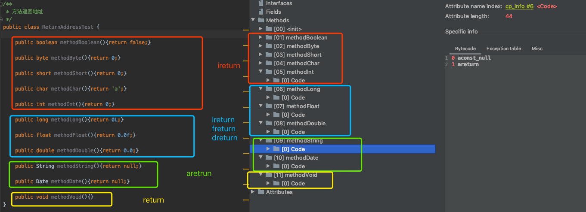

1.  在方法执行的过程中遇到了异常（Exception），并且这个异常没有在方法内进行处理，也就是只要在本方法的异常表中没有搜素到匹配的异常处理器，就会导致方法退出，简称**异常完成出口**

    方法执行过程中抛出异常时的异常处理，存储在一个异常处理表，方便在发生异常的时候找到处理异常的代码。

    我们写一个demo演示：

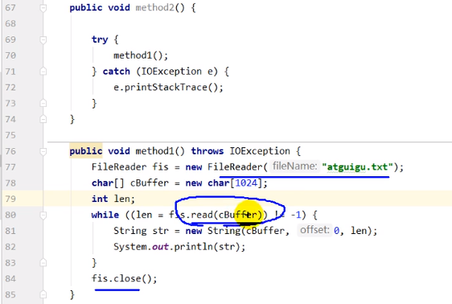

字节码当中的异常处理表：下表的行号不是上图的代码的行号，而是其对应字节码当中的行号

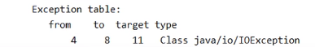

在字节码当中的4~11行是可能存在异常的代码，11代表字节码中能够处理该异常的位置是第11行也就是上图中的第72行


## 栈帧当中的一些附加信息

栈帧中还允许携带与java虚拟机实现相关的一些附加信息。例如，对程序调试提供支持的信息。（很多资料都忽略了附加信息）