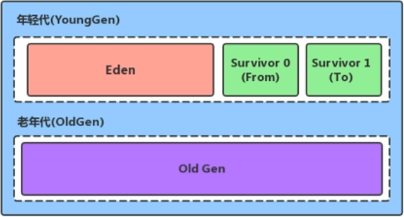
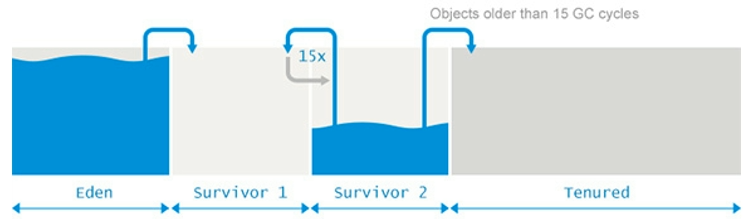
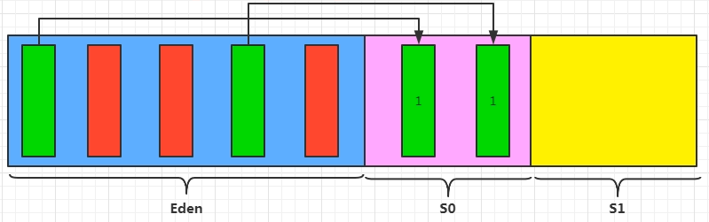
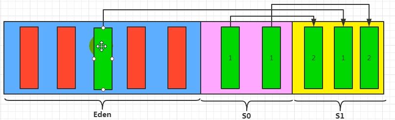
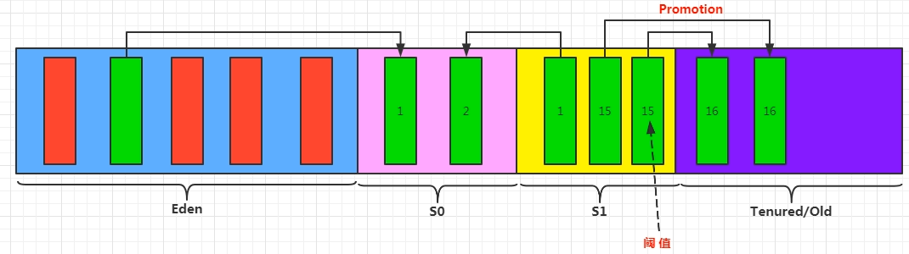
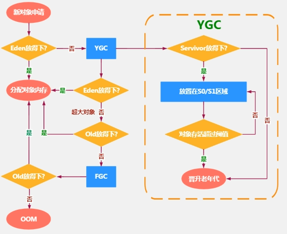
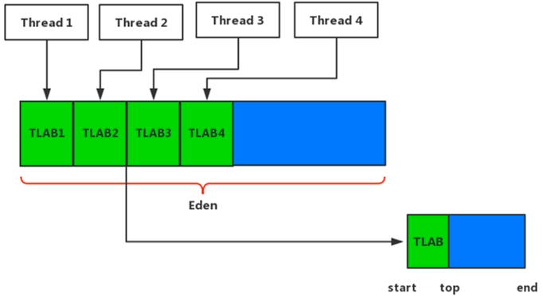
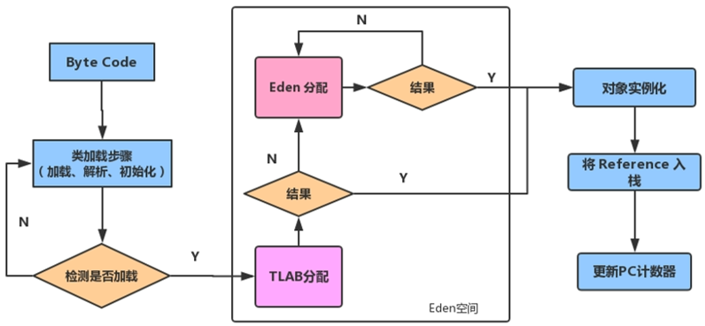
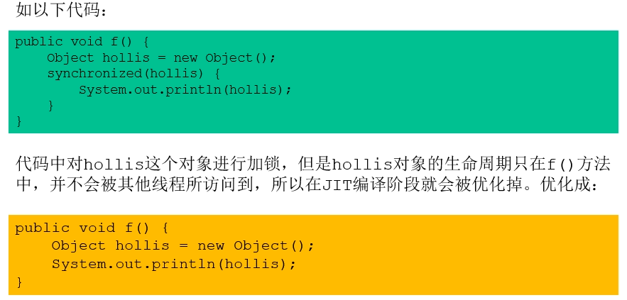
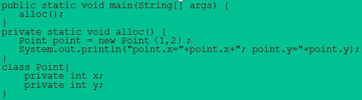

# 堆的细节

## 年轻代与老年代

-   存储在JVM中的Java对象可以被分为两类：
    -   生命周期较短的顺势对象，这类对象的创建和消亡都非常迅速
    -   生命周期非常长的对象，某些极端情况下可以与JVM的生命周期保持一致

-   Java堆区进一步细分可以分为年轻代（YoungGen）与老年代（OldGen）
-   其中年轻代可以分为Eden空间，Survivor0空间与Surviver1空间（又是也叫做from区、to区）

-   在HotSpot中，Eden空间和另外两个Survivor空间缺省所占的比例默认为8:1:1
-   几乎所有的Java对象都是在Eden区北new出来的
-   绝大部分Java对象的销毁都在新生代进行
    -   IBM公司的专门研究表明，新生代中80%的对象都是“朝生夕死”的

## 对象分配策略

对象分配过程需要考虑内存分配，在那里分配及GC堆内存分配的影响

### 标准流程

1、new的对象先放在Eden区，此区域有大小限制

2、当Eden区的空间满了之后，程序要新建对象，JVM的垃圾回收器将Eden区进行垃圾回收（YGC/Minor GC），将伊甸园区中不再被其他对象所引用的对象进行销毁。再加载新的对象放到Eden区然后将Eden区中剩余的对象移动到Survivor0区,并对该对象计数age=1（示意）

3、当Eden区再次满了之后，将Eden中有效对象放入Survivor1区并设置age=0，同时将Survivor0中有效对象放入Survivor1区，并使age++。循环此过程，直到Survivor*中对象的age达到老年代的阈值

-   其中S0与S1也可称为from区与to区，其中to区为空的区域，Eden区的对象优先放在to区

-   每次Eden满了之后都会判断新生代各对象是否还是有效对象，若是有效对象才会从from区放入to区。然后将from区域与to区域交换引用（交换称呼）

    >   to区每次gc后都为空。

4、当Survivor*区中的对象的age达到老年代阈值之后，则将该对象放入老年代（晋升，Promotion）

-   阈值默认为15次

-   可通过VM参数修改

**总结**：垃圾回收频繁发生在新生区，很少在老年区，几乎不再永久区进行。

### 流程图

## TLAB（Thread Local Allocated Buffer）

### 出现前提：

-   堆区是线程共享区域，任何线程都可以访问到堆区中的数据
-   由于对象实例的创建在JVM中非常频繁，因此在并发环境下从堆区划分内存空间是不安全的
-   为避免多个线程操作同一地址，需要使用加锁等机制，进而影响分配速度。

### TLAB概述

-   从内存模型而不是垃圾收集的角度，堆Eden区域继续划分，JVM为每个线程分配了一个私有缓存区域
-   多线程同时分配内存时，使用TLAB可以避免一系列非线程安全问题，同时还能提升内存分配的吞吐量，因此我们可以将这种内存分配的方式称为快速分配策略
-   OpenJDK衍生的JVM都提供了TLAB的设计

### TLAB说明

-   尽管不是所有对象实例都能在TLAB中成功分配内存，但JVM确实是将TLAB作为内存分配的首选
-   默认情况下TLAB空间的内存占用很小，只有Eden空间的1%
-   通过TLAB空间分配内存失败时，JVM会尝试使用加锁机制确保数据操作的原子性，从而直接在Eden区分配内存
-   TLAB默认情况下是开启的
-   TLAB创建过程

## 逃逸分析

如果一个对象在一个方法内被创建，但是在该方法外被调用，则称该对象逃逸。因此，如果该对象没有发生逃逸，则可以将该对象创建在栈上，避免堆空间中创建，可以减少GC的次数

判断是否逃逸方法：在方法内new的对象实体是否有可能在该方法外被调用

-   如果可能被调用，则发生了逃逸
-   如果在该方法内消亡了，则不会发生逃逸

### 使用逃逸分析，编译器可以堆代码做如下优化

1.  栈上分配

    将堆分配转化为栈分配。如果一个对象的子程序被分配，要使指向该对象的指针永远不会逃逸，对象可能是栈分配的候选，而不是堆分配。

2.  同步省略

    如果一个对象被发现只能从一个线程被访问到，那么对于这个对象的操作可以不考虑同步。

3.  分离对象或标量替换

    有的对象可能不需要作为一个连续的内存结构存在也可以被访问到，那么对象的部分（或全部）可以不存储在内存，而是存储在CPU寄存器中。

    **标量（Scalar）**指的一个无法被分解成更小的数据的数据。Java中原始数据类型就是标量。相对的，可以被分解的数据叫做**聚合量（Aggregate）**。Java中对象就是聚合量。

    在JIT阶段，经过逃逸分析，如果发现一个对象不会被外界访问，那么就可以进行JIT优化，将该对象（聚合量）拆解为若干个成员变量（标量）来代替，此过程成为标量替换

    

## MinorGC MajorGC FullGC触发机制

JVM在进行GVC时，并非每次都对上面三个内存（新生代、老年代；方法去）一起回收，大部分时候的回收都在新生代进行。

针对HotSpot VM的实现，它里面的GC按照回收区域又分为两大种类：

-   部分收集（Partial GC）：不是完整收集整个Java堆的垃圾收集
-   新生代收集（Minor GC/Young GC）：只是新生代（Eden、S0、S1）的垃圾收集
-   老年代收集（Majot GC/Old GC）：只是老年代的收集

    -   目前只有CMS GC会有单独收集老年代的行为
    -   注意：很多时候Major GC回合Full GC混淆使用，需要具体分辨是老年代回收还是整堆回收。
    -   混合收集（Mixed GC）：收集整个新生代以及老年代的垃圾收集。

-   整堆收集（Full GC）：收集整个Java堆和方法区的垃圾收集。（尽量避免）

### 年轻代GC（Minor GC）触发机制

-   当年轻代空间不足时，就会触发Minor GC，这里的年轻代是指Eden空间。Survivor满并不会出发Minor GC（每次Minor GC会清理年轻代的内存）
-   由于Java对象大多数具备朝生夕死的特性，所以Minor GC会非常频繁地执行，一般回收速度也比较快。
-   Minor GC 会引发STW，暂停其他用户的线程，等垃圾回收结束，用户线程才恢复运行。

### 老年代GC（Major GC/Full GC）触发机制

-   指发生在老年代的GC，对象从老年代小时是，我们说“Major GC”或“Full GC”发生了
-   出现了Major GC，经常会伴随至少一次的Minor GC（但不是绝对的，在Parallel Scavenge收集器的收集策略里就有直接进行Major GC的策略选择过程）

    -   说明：老年代空间不足时，会现场时出发Minor GC。此时如果空间还不足，则出发Major GC

-   Major GC的速度一般会比Minor GC慢10倍以上，STW的时间更长
-   如果Major GC之后，内存还是不足，则会出现OOM

### Full GC触发机制

触发Full GC 执行的情况有如下5种：

1.  调用System.gc()时，系统建议执行Full GC，但不是一定会执行
2.   老年代空间不足
3.  方法区空间不足
4.  对象通过Minor GC 进入老年代的平均大小大于老年代的可用内存
5.  由Eden区或Survivor区的from区向to区复制时，对象比to区的可用内存大，则把该对象存到老年代，且老年代的可用内存依然小于该对象的大小。

说明：Full GC 是开发或调优中需要尽量避免的，这样暂停时间会短一些。