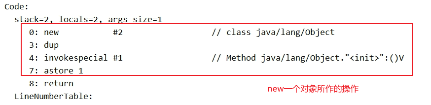
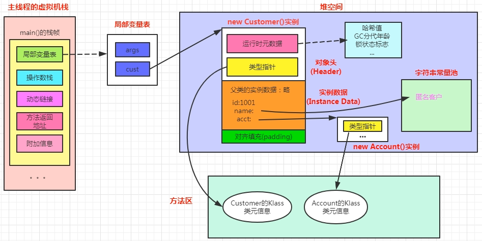
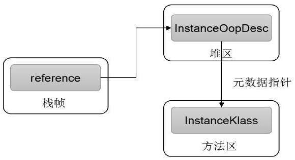
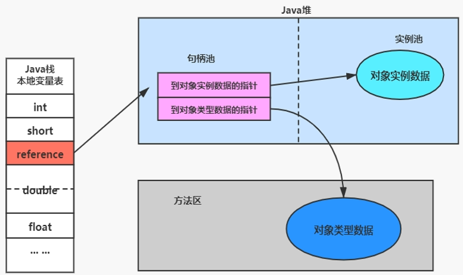
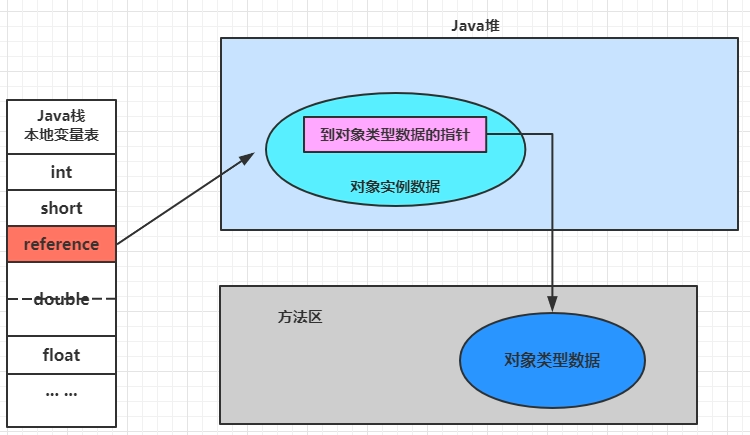

# 对象实例化及内存布局

## 对象的实例化

### 创建对象的方式

-   new(最常见的方式)

-   -   变形1: XXX的静态方法(单例模式)
    -   变形2:        XXXBuilder/XXXFactory的静态方法

-   Class的newInstance()方法: 反射的方式,只能调用空参的构造器,权限必须为public
-   Constructor的newInstance方法: 反射的方式,可以调用有参与空参的构造器,对权限没有要求
-   使用clone(): 不调用任何构造器,但是当前的类需要实现Cloneable接口,实现clone()
-   使用反序列化: 可以使数据从一个线程传递到另一个线程(包括本地与网络),获取本地或网络二进制流,在内存中还原.
-   使用第三方的库

### 创建对象的步骤

#### 从字节码的角度

#### 执行的6个步骤:

1.  判断对象对应的类是否加载,链接与初始化

-   -   说明: 虚拟机遇到一条new指令,首先检查这个指令的参数是否能在Metaspace的常量池中定位到一个类的符号引用,并检查这个符号引用代表的类是否已被加载,解析和初始化(即判断该类的元信息是否存在). 如果没有,在双亲委派机制模式下,使用当前类加载器以ClassLoader+包名+类名作为key查找对应的.class文件,如果没有找到文件,测抛出CLassNotFoundException异常,如果找到,则加载该类,并生成对应的Class类对象

2.  为对象分配内存

-   -   说明: 首先计算对象占用空间的大小,接着在堆中划分一块内存给新对象. 如果实例成员变量是引用变量, 进分配引用变量的空间即可(4个字节大小)
    -   分配策略:

-   -   -   如果内存规整,指针碰撞: 所有用过的内存放在一边,空闲的空间放在另一边,使用指针作为分界点的指示器. 如果有新的对象,则将新对象放到指针位置,同时指针后移. Serial与ParNew具有压缩整理算法,可使用指针碰撞.

-   -   -   如果内存不规整: 虚拟机需要维护一个列表,按照空闲列表(Free List)分配. 这是由于内存不规整,有可能是交错的,使用一个列表来记录可用内存块,进行再分配的时候从列表中找到一块足够大的空间来划分给对象实例,并更新列表上的内容. 标记清除算法CMS
        -   说明: 分配方式的选择是取决于Java堆是否规整,Java堆是否规整取决于采用的垃圾收集器是否带有压缩整理算法.

3.  处理并发安全问题

-   -   采用CAS失败重试,区域加锁保证更新的原子性
    -   Eden区对每个线程预留一块TLAB

4.  初始化分配到的空间

-   -   所有属性设置默认值,保证对象实例字段在不赋值时可以直接使用(属性默认初始化 0->int )

5.  设置对象的对象头

-   -   对象头记录了对象所属的类(类的元数据信息),对象的HashCode和对象的GC信息,锁信息等数据,具体实现取决于JVM

6.  执行init方法进行初始化

-   -   在Java程序的角度看,初始化才刚开始,以此进行显式初始化 -> 代码块中的初始化 -> 构造器中的初始化,并把堆内对象的首地址赋值给引用变量,完成对象的初始化

 

## 对象的内存布局

堆空间中的new的对象的结构

### 可以分为 3 个部分

#### 对象头(Header)

-   运行时元数据(Mark Word)

-   -   哈希值(HashCode),也可称为首地址之
    -   GC分代年龄: 年龄计数器,计算是否需要放入老年代
    -   锁状态的标志: 同步时是否为有锁,何种锁
    -   线程持有的锁
    -   偏向线程ID
    -   偏向时间戳

-   类型指针: 指向了方法区(Metaspace)中对象所属的具体类型(InstanceKlass
-   说明,如果创建的是一个数组,则需要记录数组的长度

#### 实例数据(Instance Data)

-   说明: 这是对象真正存储的有效信息,包括程序代码中定义的各种类型的字段(父类继承与本身的字段)
-   规则: 相同宽度的字段被分配在一起; 父类中定义的变量会出现在子类前; 如果CompactFields参数为true(默认为true),子类窄变量可能插入到父类变量空隙.

#### 对齐填充(Padding): 

不是必须的,也没有特殊含义,只是起到占位符的作用.

#### 图示

 

## 对象访问定位

JVM如何通过栈帧中的对象引用访问到其内部的实例对象?

### 具体方位你有两种方式:

#### 句柄访问

#### 直接指针(Hotspot使用)

