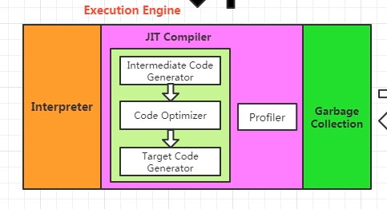
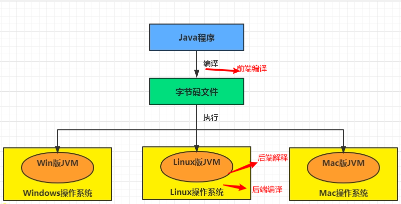
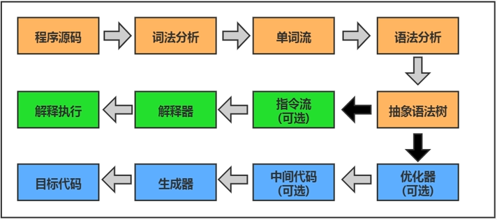
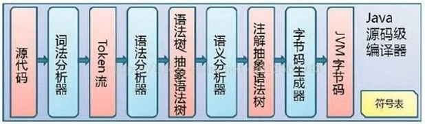
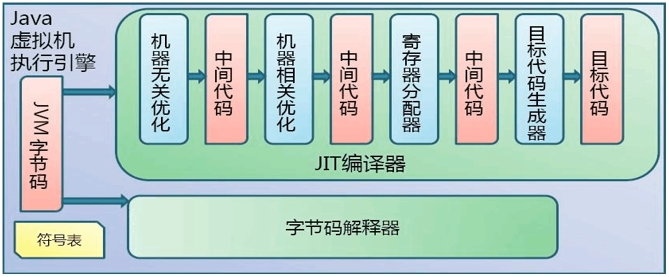
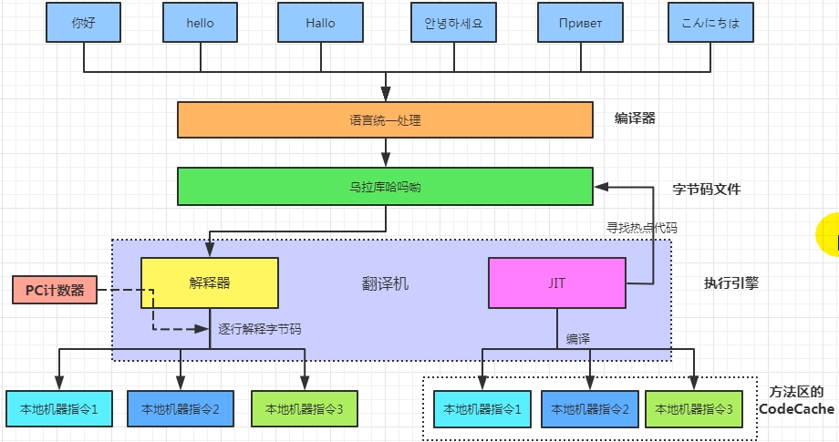
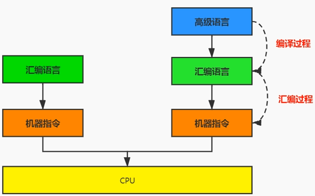
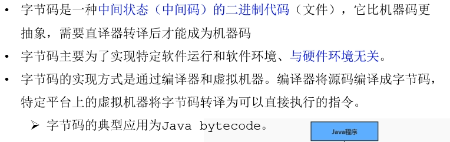

# 执行引擎概述

## 执行引擎所处位置

## 执行引擎概述

-   执行引擎是Java虚拟机的核心组件之一
-   虚拟机的执行引擎是由软件自行实现的,可以不受物理条件制约限制指令集.可以不被硬件制约,执行不被硬件支持的指令

JVM的主要任务是装载字节码到其内部,解释执行,而解释引擎的任务就是将字节码指令解释/编译为对应平台上的本地机器指令( 字节码 -> 机器指令 ),相当于翻译官

从外部观察,所有的Java虚拟机执行引擎都进行输入输出操作,输入字节码二进制流,输出执行结果. 处理过程是字节码解析执行的等效过程.

## Java代码编译执行的过程

 

多数程序代码转化为物理机的机器指令或虚拟机的指令之前,都需要经过上述图中的各个步骤. 

### 对于Java

-   橙色部分: 前端编译,由javac编译完成,形成线性字节码指令流.

 

-   蓝色部分: 程序代码到目标代码(机器指令)路线
-   绿色部分: 逐行解释,翻译执行

**解释器**： Java虚拟机根据预定义的规范对字节码采用逐行解释的方式执行,将每条字节码指令翻译为对应平台的本地机器指令

**JIT(Just In Time Compiler)：** 后端编译器,虚拟机将源代码直接编译成对应本地平台的机器指令,并缓存.

 

## 机器码、指令、汇编

#### 机器码 

采用二进制编码方式表示的指令,叫做机器指令码(机器语言); 可直接输入计算机,CPU直接读取运行.运行速度最快. 机器指令与CPU密切相关,不同种类的CPU对应机器指令也不同. 可读性太差.

#### 指令

由于机器码可读性太差,因此出现了指令.指令就是把机器码中特定排列的 0/1 抽象,简化成指令,可读性稍好; 不同硬件平台对应的机器码可能不同.

#### 指令集

是指令的一个集合,不同平台的指令集也各不相同.常见的由 x86指令集,ARM指令集等

#### 汇编语言

由于指令集可读性依然很差,因此基于指令集抽象,发明了汇编语言.

计算机只认机器指令码,因此汇编语言依旧需要翻译成机器指令码

#### 高级语言

如C,Java语言,更贴近人类的自然语言.但是仍旧需要翻译成机器语言.完成这个过程的程序就叫做解释程序或编译程序

 

 

#### Java的字节码

 