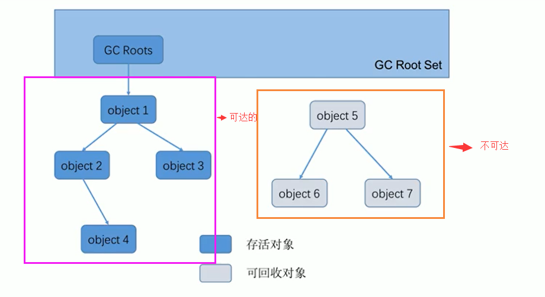
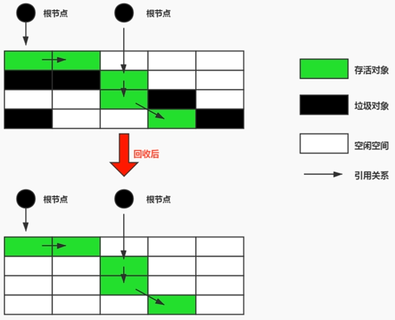
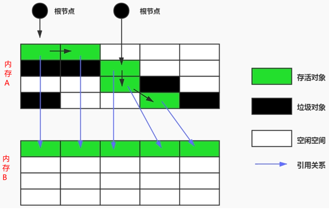
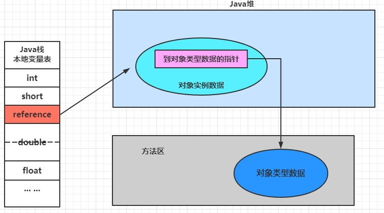
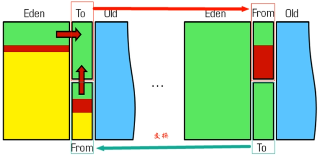
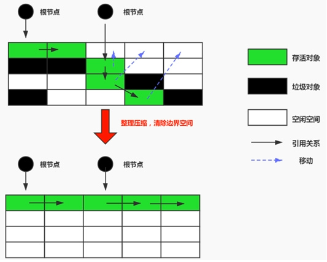
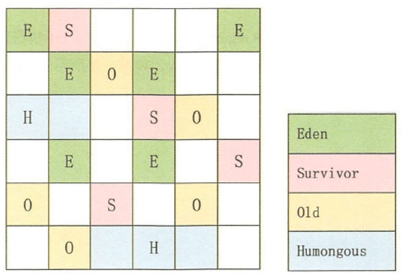

# 垃圾回收相关算法

垃圾清楚的主要目的是收集没用的对象，然后清楚之。因此，垃圾回收的两个阶段：

1.  标记阶段
2.  清楚阶段


## 标记阶段

#### 判断对象是否存活

-   堆里几乎存放了所有对象，在GC之前首先要区分出存活的对象与死亡的对象。只有被标记为死亡的对象，GC才会对其进行回收，释放空间。这个过程被称为垃圾标记阶段
-   JVM标记对象死亡的方法：当一个对象没有被任何其他存活的对象引用时，该对象就可以被判断为已经死亡。
-   判断对象是否存活有两种方式：**引用计数法** 与 可达性分析算法


### 引用计数算法

引用计数算法（Reference Counting）比较简单，对每个对象保存一个整型的引用计数器属性。用于记录对象被引用的情况。

对于一个对象A，只要有任何一个对象引用了A，则A的引用计数器就加1；当引用失效时，引用计数器就减1。只要对象A的引用计数器的值为0，即表示对象A不可能再被使用，可进行回收。

优点：实现简单，垃圾对象便于辨识；判定效率高，回收没有延迟性。

缺点：它需要单独的字段存储计数器，这样的做法增加了存储空间的开销。

>   每次赋值都需要更新计数器，伴随着加法和减法操作，这增加了时间开销。 引用计数器有一个严重的问题，即**无法处理循环引用**的情况。这是一条致命缺陷，导致在Java的垃圾回收器中没有使用这类算法。

#### 循环引用


##### 示例代码

```java
public class RefCountGC {
    // 这个成员属性的唯一作用就是占用一点内存
    private byte[] bigSize = new byte[5*1024*1024];
    // 引用
    Object reference = null;

    public static void main(String[] args) {
        RefCountGC obj1 = new RefCountGC();
        RefCountGC obj2 = new RefCountGC();
        obj1.reference = obj2;
        obj2.reference = obj1;
        obj1 = null;
        obj2 = null;
        // 显示的执行垃圾收集行为，判断obj1 和 obj2是否被回收？
        System.gc();
    }
}

/*执行结果：
[GC (System.gc()) [PSYoungGen: 15490K->808K(76288K)] 15490K->816K(251392K), 0.0061980 secs] [Times: user=0.00 sys=0.00, real=0.36 secs] 
[Full GC (System.gc()) [PSYoungGen: 808K->0K(76288K)] [ParOldGen: 8K->672K(175104K)] 816K->672K(251392K), [Metaspace: 3479K->3479K(1056768K)], 0.0045983 secs] [Times: user=0.00 sys=0.00, real=0.00 secs] 
Heap
 PSYoungGen      total 76288K, used 655K [0x000000076b500000, 0x0000000770a00000, 0x00000007c0000000)
  eden space 65536K, 1% used [0x000000076b500000,0x000000076b5a3ee8,0x000000076f500000)
  from space 10752K, 0% used [0x000000076f500000,0x000000076f500000,0x000000076ff80000)
  to   space 10752K, 0% used [0x000000076ff80000,0x000000076ff80000,0x0000000770a00000)
 ParOldGen       total 175104K, used 672K [0x00000006c1e00000, 0x00000006cc900000, 0x000000076b500000)
  object space 175104K, 0% used [0x00000006c1e00000,0x00000006c1ea8070,0x00000006cc900000)
 Metaspace       used 3486K, capacity 4496K, committed 4864K, reserved 1056768K
  class space    used 385K, capacity 388K, committed 512K, reserved 1048576K
*/
```

可见进行了GC行为，因此Java使用的不是引用计数算法

#### 小结

引用计数算法，是很多语言的资源回收选择，例如因人工智能而更加火热的Python，它更是同时支持引用计数和垃圾收集机制。

具体哪种最优是要看场景的，业界有大规模实践中仅保留引用计数机制，以提高吞吐量的尝试。

Java并没有选择引用计数，是因为其存在一个基本的难题，也就是很难处理循环引用关系。Python如何解决循环引用？

>   手动解除：很好理解，就是在合适的时机，解除引用关系。 使用弱引用weakref，weakref是Python提供的标准库，旨在解决循环引用。


### 可达性分析算法

可达性分析算法（GC Roots）：也可以称为 根搜索算法或追踪性垃圾收集

相对于引用计数算法而言，可达性分析算法不仅同样具备实现简单和执行高效等特点，更重要的是该算法可以有效地解决在引用计数算法中循环引用的问题，防止内存泄漏的发生。

相较于引用计数算法，这里的可达性分析就是Java、C#选择的。这种类型的垃圾收集通常也叫作追踪性垃圾收集（Tracing Garbage Collection）

#### 可达性分析算法的基本思路

-   可达性分析算法是以根对象集合（GCRoots）为起始点，**按照从上至下的方式搜索被根对象集合所连接的目标对象是否可达。**
-   使用可达性分析算法后，内存中的存活对象都会被根对象集合直接或间接连接着，**搜索所走过的路径称为引用链（Reference Chain）**
-   如果目标对象**没有任何引用链相连，则是不可达的，就意味着该对象己经死亡，可以标记为垃圾对象。**
-   在可达性分析算法中，只有能够被根对象集合直接或者间接连接的对象才是存活对象。



####  GC Roots具体元素

-   虚拟机栈中引用的对象
    -   比如：各个线程被调用的方法中使用到的参数、局部变量等。
-   本地方法栈内JNI（通常说的本地方法）引用的对象方法区中类静态属性引用的对象
    -   比如：Java类的引用类型静态变量
-   方法区中常量引用的对象
    -   比如：字符串常量池（string Table）里的引用
-   所有被同步锁synchronized持有的对象
-   Java虚拟机内部的引用。
    -   基本数据类型对应的Class对象，一些常驻的异常对象（如：Nu11PointerException、outofMemoryError），系统类加载器。
-   反映java虚拟机内部情况的JMXBean、JVMTI中注册的回调、本地代码缓存等。


小结：除了堆空间外的一些结构，比如 虚拟机栈、本地方法栈、方法区、字符串常量池 等地方对堆空间进行引用的，都可以作为GC Roots进行可达性分析

>   例外： 堆在进行可达性分析时，堆中非分析区域的对象也可以作为可达性分析的具体元素（根）

##### 小技巧

由于Root采用栈方式存放变量和指针，所以如果一个指针，它保存了堆内存里面的对象，但是自己又不存放在堆内存里面，那它就是一个Root。

#### 注意

如果要使用可达性分析算法来判断内存是否可回收，那么分析工作必须在一个能保障一致性的快照中进行。这点不满足的话分析结果的准确性就无法保证。

这点也是导致GC进行时必须“stop The World”的一个重要原因。

即使是号称（几乎）不会发生停顿的CMS收集器中，枚举根节点时也是必须要停顿的。


##  对象的finalization机制

Java语言提供了**对象终止（finalization）机制**来允许开发人员提供对象被销毁之前的自定义处理逻辑。

当垃圾回收器发现没有引用指向一个对象，即：**垃圾回收此对象之前，会先调用这个对象的finalize()方法。**（只调用一次）

**finalize() 方法允许在子类中被重写，用于在对象被回收时进行资源释放。**通常在这个方法中进行一些资源释放和清理的工作，比如关闭文件、套接字和数据库连接等。

### 不要主动调用某个对象的finalize（）！

应该交给垃圾回收机制调用。理由包括下面三点：

-   在finalize（）时可能会导致对象复活。
-   finalize（）方法的执行时间是没有保障的，它完全由Gc线程决定，极端情况下，若不发生GC，则finalize（）方法将没有执行机会。
    -   因为**优先级比较低**，即使主动调用该方法，也不会因此就直接进行回收
-   一个糟糕的finalize（）会严重影响Gc的性能。

Java采用的是基于垃圾回收器的自动内存管理机制，不需要手动调用finalize()方法

### 对象存在的三种可能的状态

如果从所有的根节点都无法访问到某个对象，说明对象己经不再使用了。一般来说，此对象需要被回收。但事实上，也并非是“非死不可”的，这时候它们暂时处于“缓刑”阶段。**一个无法触及的对象有可能在某一个条件下“复活”自己**，如果这样，那么对它的回收就是不合理的，为此，定义虚拟机中的对象可能的三种状态。如下：

-   **可触及的状态**：从根节点开始，可以到达这个对象。
-   **可复活的状态**：对象的所有引用都被释放，但是对象有可能在finalize（）中复活。
-   **不可触及的状态**：对象的finalize（）被调用，并且没有复活，那么就会进入不可触及状态。不可触及的对象不可能被复活，因为**finalize()只会被调用一次**。

以上3种状态中，是由于finalize（）方法的存在，进行的区分。只有在对象不可触及时才可以被回收。

### 具体过程分析

判定一个对象objA是否可回收，至少要经历两次标记过程：

-   如果对象objA到GC Roots没有引用链，则进行第一次标记。
-   进行筛选，判断此对象是否有必要执行finalize（）方法
    -   如果对象objA没有重写finalize（）方法，或者finalize（）方法已经被虚拟机调用过，则虚拟机视为“没有必要执行”，objA被判定为不可触及的。
    -   如果对象objA重写了finalize（）方法，且还未执行过，那么objA会被插入到F-Queue队列中，由一个虚拟机自动创建的、低优先级的Finalizer线程触发其finalize（）方法执行。
    -   **finalize（）方法是对象逃脱死亡的最后机会**，稍后GC会对F-Queue队列中的对象进行第二次标记。如果objA在finalize（）方法中与引用链上的任何一个对象建立了联系，那么在第二次标记时，objA会被移出“即将回收”集合。之后，对象会再次出现没有引用存在的情况。在这个情况下，finalize方法不会被再次调用，对象会直接变成不可触及的状态，也就是说，一个对象的finalize方法只会被调用一次。

##### 代码示例

```java
public class FinalizeEscapeGC {
    // 静态变量作为一个GC ROOT，可以在finalize方法中与置为null的对象建立联系（引用指向）
    public static FinalizeEscapeGC SAVE_HOOK = null;
    
    @Override
    protected void finalize() throws Throwable {
        System.out.println("finalize() 方法已执行！");
        FinalizeEscapeGC.SAVE_HOOK = this;
    }
    
    public static void main(String[] args) throws Throwable {
        SAVE_HOOK = new FinalizeEscapeGC();
        //对象第一次成功拯救自己
        SAVE_HOOK = null;
        System.gc();
        // 因为Finalizer方法优先级很低，暂停0.5秒，以等待它
        Thread.sleep(500);
        if (SAVE_HOOK != null) {
            SAVE_HOOK.isAlive();
        } else {
            System.out.println("no, i am dead :(");
        }
       
        // 下面这段代码与上面的完全相同，但是这次自救却失败了
        SAVE_HOOK = null;
        System.gc();
        // 因为Finalizer方法优先级很低，暂停0.5秒，以等待它
        Thread.sleep(500);
        if (SAVE_HOOK != null) {
            SAVE_HOOK.isAlive();
        } else {
            System.out.println("no, i am dead :(");
        }
    }
}
```

结果

```
-----------------第一次gc操作------------
调用当前类重写的finalize()方法
obj is still alive
-----------------第二次gc操作------------
obj is dead
```

在第一次GC的时候，执行finalize()方法，对象完成了自救

在第二次GC的时候，由于finalize()只被执行1次，因此对象无法自救，从而被回收掉了


## 清除阶段

当成功区分出内存中存活对象和死亡对象后，GC接下来的任务就是执行垃圾回收，释放掉无用对象所占用的内存空间，以便有足够的可用内存空间为新对象分配内存。目前JVM有3种比较常见的垃圾清除

-   标记一清除算法（Mark-Sweep）
-   复制算法（copying）
-   标记-压缩算法（Mark-Compact）

### 标记清除算法（Mark-Sweep）算法

标记-清除算法（Mark-Sweep）是一种非常基础和常见的垃圾收集算法，该算法被J.McCarthy等人在1960年提出并并应用于Lisp语言。

#### 执行过程

当内存的有效空间即将被耗尽时，会停止整个程序（Stop the world STW），然后进行标记与清理

1.  标记：Collector从引用根节点开始遍历，**标记所有被引用的对象**，一般是在Header中标记成可达对象
2.  清除：Collector对堆内存从头到尾进行线性遍历，清除未被标记成可达对象的对象。

##### 标记清除算法示意图



>   黑色对象为不可达对象，会被GC回收清理

#### 清除方式

标记清除算法的清除不是马上置空，二十把需要清楚的对象的地址保存在空闲列表中。第二次有对象需要加载时，判断垃圾的位置空间是否足够，若空间足够，就直接放（覆盖）

#### 标记清除算法的缺点

-   效率不算高
-   在进行GC的时候，需要停止整个应用程序（STW），导致用户体验差
-   这个方式i清理出来的空闲内存是不连续的，会产生内存碎片，需要维护一个空闲列表。

### 复制算法

出现背景：为了解决标记清除算法效率慢的问题，M.L.Minsky于1963年发表了著名的论文，“使用双存储区的Lisp语言垃圾收集器CA LISP Garbage Collector Algorithm Using Serial Secondary Storage）”。M.L.Minsky在该论文中描述的算法被人们称为复制（Copying）算法，它也被M.L.Minsky本人成功地引入到了Lisp语言的一个实现版本中。

#### 核心思想

将可用的内存分为两个部分，每次只使用其中一部分。在GC发生之前，将使用中内存的存活对象复制到未被使用的内存块中，然后清除之前使用的内存块的所有对象。循环往复。

##### 复制算法示意图



>   新生代的幸存区使用的就是复制算法

#### 复制算法的优缺点

**优点**

1.  没有标记与清除的过程，效率高
2.  解决了空间碎片的问题

**缺点**

1.  所需空间大，需要原来两倍的空间（空间换时间）

2.  对于G1这种分拆成为大量region的GC，复制而不是移动，意味着GC需要维护region之间对象引用关系，不管是内存占用或者时间开销也不小

    **region示意图**

    

注意：若内存中对象多，而垃圾对象少，则复制算法会将所有可用对象都复制一遍。浪费性能。因此，复制算法适用于存活对象少的场景（如新生代）。



### 标记-整理（压缩）算法

诞生背景：复制算法的高效性是建立在存活对象少、垃圾对象多的前提下的。这种情况在新生代经常发生，但是在老年代，更常见的情况是大部分对象都是存活对象。如果依然使用复制算法，由于存活对象较多，复制的成本也将很高。因此，基于老年代垃圾回收的特性，需要进行碎片整理，因此发展出了标记整理算法。

#### 执行过程

1.  根节点开始标记所有被引用对象（与第标记清除算法一致）

2.  将所有存活的对象整理（压缩）到内存的一边，按顺序排放。接着，清理边界外所有的空间。



#### 标清和标整的区别

标记-压缩算法的最终效果等同于标记-清除算法执行完成后，再进行一次内存碎片整理，因此，也可以把它称为标记-清除-压缩（Mark-Sweep-Compact）算法。

二者的本质差异在于标记-清除算法是一种非移动式的回收算法，标记-压缩是移动式的（需要修改引用该对象的地址）。是否移动回收后的存活对象是一项优缺点并存的风险决策。

标记的存活对象将会被整理，按照内存地址依次排列，而未被标记的内存会被清理掉。如此一来，当我们需要给新对象分配内存时，JVM只需要持有一个内存的起始地址即可，这比维护一个空闲列表显然少了许多开销。（不需要空闲列表了）

#### 标整的优缺点

**优点**

-   消除了标记-清除算法当中，内存区域分散的缺点，我们需要给新对象分配内存时，JVM只需要持有一个内存的起始地址即可。
-   消除了复制算法当中，内存减半的高额代价。

**缺点**

-   从效率上来说，标记-整理算法要低于复制算法。
-   移动对象的同时，如果对象被其他对象引用，则还需要调整引用的地址
-   移动过程中，需要全程暂停用户应用程序。即：STW


## 以上三种算法的小结

效率上来说，复制算法是当之无愧的老大，但是却浪费了太多内存。

而为了尽量兼顾上面提到的三个指标，标记-整理算法相对来说更平滑一些，但是效率上不尽如人意，它比复制算法多了一个标记的阶段，比标记-清除多了一个整理内存的阶段。

|              | 标记清除（Mark-Sweep） | 标记整理（Mark-Compact） | 复制（Copying）                       |
| ------------ | ---------------------- | ------------------------ | ------------------------------------- |
| **速率**     | 中等                   | 最慢                     | 最快                                  |
| **空间开销** | 少（但会堆积碎片）     | 少（不堆积碎片）         | 通常需要活对象的2倍空间（不堆积碎片） |
| **内存熵**   | 否                     | 是                       | 是                                    |

>   没有最好的算法，只有最适合的场景


## 分代收集算法

分代收集算法基于不同对象的生命周期不同，可以采用不同的收集方式。一般地，可以把Java堆分为新生代与老年代，根据不同的分代采取不同的收集算法（相当于取长补短）

在Java程序的运行过程中，会产生大量对象。有些对象是与业务信息挂钩的（比如Http请其中的Session对象、线程、Socket连接等），生命周期比较长。有些是生命周期比较短的（如字符串，变量等）。分代收集算法就是根据具体的情况选择合适的算法。

**目前几乎所有的GC都采用分代收集算法**

-   年轻代（Young Gen）

    年轻代特点：区域相对老年代较小，对象生命周期短、存活率低，回收频繁。这种情况复制算法的回收整理，速度是最快的。复制算法的效率只和当前存活对象大小有关，因此很适用于年轻代的回收。而复制算法内存利用率不高的问题，通过hotspot中的两个survivor的设计得到缓解。

-   老年代（Tenured Gen）

    老年代特点：区域较大，对象生命周期长、存活率高，回收不及年轻代频繁。

    这种情况存在大量存活率高的对象，复制算法明显变得不合适。一般是标记清除或者是标记整理算法搭配使用。

    -   Mark阶段的开销与**存活对象**的数量成正比。
    -   Sweep阶段的开销与所**管理区域的大小**成正相关。
    -   compact阶段的开销与**存活对象的数据**成正比。

>   HotSpot中的CMS收集器基于Mark-Sweep实现，对于对象的回收效率很高。对于碎片问题，CMS采用基于Mark-Compact算法的Serial old回收器作为补偿措施：当内存回收不佳（碎片导致的Concurrent Mode Failure时），将采用serial old执行FullGC以达到对老年代内存的整理。


## 其他算法

### 增量收集算法

#### 诞生背景

为解决上述算法所导致的STW（Stop the world）问题。

#### 核心思想

让垃圾收集线程和应用程序线程交替执行。每次，垃圾收集线程只收集一小片区域的内存空间，接着切换到应用程序线程。依次反复，直到垃圾收集完成。**增量收集算法通过对线程间冲突的妥善处理**，允许垃圾收集线程以分阶段的方式完成标记、清理或复制工作。

#### 缺点

切换用户线程与垃圾回收线程会导致上下文转换的小号，使垃圾回收的总体成本上升（时间、空间成本），导致系统吞吐量下降。


### 分区算法

一般来说，在相同条件下，堆空间越大，一次Gc时所需要的时间就越长，有关GC产生的停顿也越长。为了更好地控制GC产生的停顿时间，**将一块大的内存区域分割成多个小块，根据目标的停顿时间，每次合理地回收若干个小区间，而不是整个堆空间**，从而减少一次GC所产生的停顿。

分代算法将按照对象的生命周期长短划分成两个部分，分区算法将整个堆空间划分成连续的不同小区间。 **每一个小区间都独立使用，独立回收。**这种算法的好处是可以控制每次回收空间的数量与位置。

