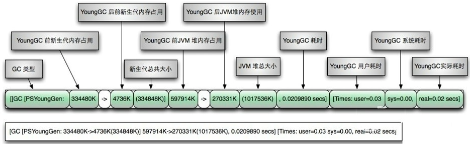
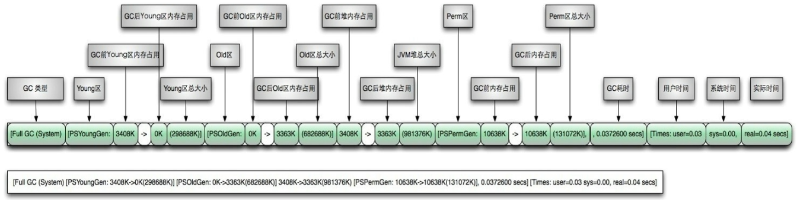
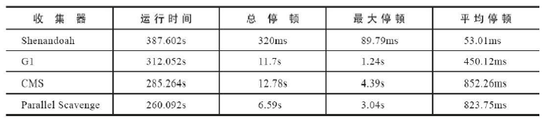
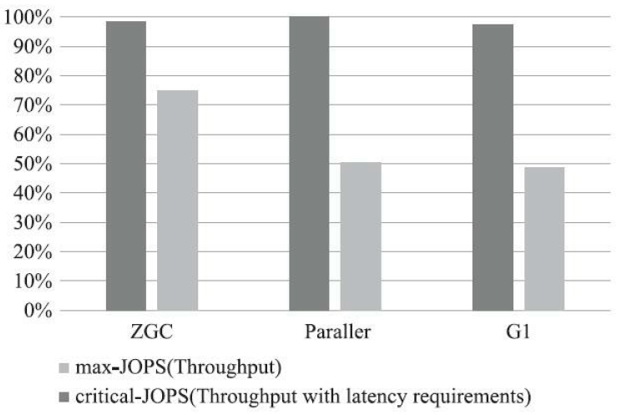
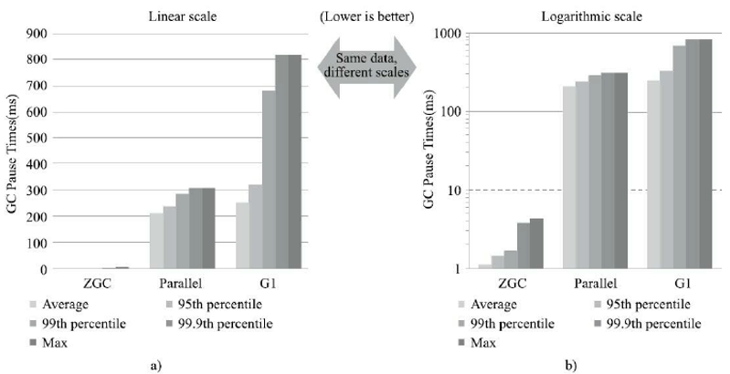

# GC日志分析

通过阅读Gc日志，我们可以了解Java虚拟机内存分配与回收策略。 内存分配与垃圾回收的参数列表

-   -XX:+PrintGC  输出GC日志。类似：-verbose:gc
-   -XX:+PrintGCDetails  输出Gc的详细日志
-   -XX:+PrintGCTimestamps   输出Gc的时间戳（以基准时间的形式）
-   -XX:+PrintGCDatestamps  输出Gc的时间戳（以日期的形式，如2013-05-04T21：53：59.234+0800）
-   -XX:+PrintHeapAtGC  在进行Gc的前后打印出堆的信息
-   -Xloggc:../logs/gc.1og  日志文件的输出路径


## 参数分析

#### 1、-verbose:gc 参数分析


```
[GC (Metadata GC Threshold)  2570K->696K(491008K), 0.0020281 secs]
[Full GC (Metadata GC Threshold)  696K->561K(491008K), 0.0065079 secs]
[GC (Allocation Failure)  129073K->30427K(491008K), 0.0866403 secs]

分析：
Metadata GC Threshold：元空间不足
Allocation Failure：堆空间内存分配失败
```

#### 2、 PrintGCDetails 参数分析


```
[GC (Metadata GC Threshold) [PSYoungGen: 2570K->696K(149504K)] 2570K->696K(491008K), 0.0011210 secs] [Times: user=0.00 sys=0.00, real=0.00 secs] 

[Full GC (Metadata GC Threshold) [PSYoungGen: 696K->0K(149504K)] [ParOldGen: 0K->561K(341504K)] 696K->561K(491008K), [Metaspace: 2695K->2695K(1056768K)], 0.0119130 secs] [Times: user=0.02 sys=0.00, real=0.01 secs] 

[GC (Allocation Failure) [PSYoungGen: 128512K->20978K(149504K)] 129073K->30427K(491008K), 0.0650458 secs] [Times: user=0.19 sys=0.00, real=0.07 secs] 

[Full GC (Ergonomics) [PSYoungGen: 12704K->0K(113664K)] [ParOldGen: 282827K->234995K(341504K)] 295531K->234995K(455168K), [Metaspace: 3758K->3758K(1056768K)], 4.3003995 secs] [Times: user=8.61 sys=0.05, real=4.30 secs] 

分析：
Metadata GC Threshold：元空间不足
Allocation Failure：堆空间内存分配失败
Ergonomics：老年代空间即将不足
```

#### 说明

-   [GC"和"[Fu11GC"说明了这次垃圾收集的停顿类型，如果有"Fu11"则说明GC发生了"stop The World"
-   使用Seria1收集器在新生代的名字是Default New Generation，因此显示的是"[DefNew"
-   使用ParNew收集器在新生代的名字会变成"[ParNew"，意思是"Parallel New Generation"
-   使用Paralle1 scavenge收集器在新生代的名字是”[PSYoungGen"
-   老年代的收集和新生代道理一样，名字也是收集器决定的
-   使用G1收集器的话，会显示为"garbage-first heap"

-   Allocation Failure表明本次引起GC的原因是因为在年轻代中没有足够的空间能够存储新的数据了。
-   [PSYoungGen：5986K->696K（8704K）]5986K->704K（9216K）中括号内：GC回收前年轻代大小，回收后大小，（年轻代总大小）括号外：GC回收前年轻代和老年代大小，回收后大小，（年轻代和老年代总大小）
-   user代表用户态回收耗时，sys内核态回收耗时，rea实际耗时。由于多核的原因，时间总和可能会超过rea1时间

### 分析日志 图解

规律：


新生代GC：



Full GC：




## 分析工具分析

日志分析工具使用前提：需要有GC日志文件，因此需要导出日志

导出日志的指令：

```cmd
-Xloggc:【path】	// 路径从当前工程下开始
```

注意：需要有对应目录，GC文件会自动生成 

常用的日志分析工具有：GCViewer、GCEasy、GCHisto、GCLogViewer、Hpjmeter、garbagecat等

推荐使用GC easy


##  垃圾回收器的新发展

GC仍然处于飞速发展之中，目前的默认选项G1GC在不断的进行改进，很多我们原来认为的缺点，例如串行的Fu11GC、Card Table扫描的低效等，都已经被大幅改进，例如，JDK10以后，Fu11GC已经是并行运行，在很多场景下，其表现还略优于ParallelGC的并行Ful1GC实现。

即使是SerialGC，虽然比较古老，但是简单的设计和实现未必就是过时的，它本身的开销，不管是GC相关数据结构的开销，还是线程的开销，都是非常小的，所以随着云计算的兴起，在serverless等新的应用场景下，Serial Gc找到了新的舞台。

比较不幸的是CMSGC，因为其算法的理论缺陷等原因，虽然现在还有非常大的用户群体，但在JDK9中已经被标记为废弃，并在JDK14版本中移除

Epsilon:A No-Op GarbageCollector（Epsilon垃圾回收器，"No-Op（无操作）"回收器）http://openidk.iava.net/iep s/318

ZGC:A Scalable Low-Latency Garbage Collector（Experimental）（ZGC：可伸缩的低延迟垃圾回收器，处于实验性阶段）

现在G1回收器已成为默认回收器好几年了。我们还看到了引入了两个新的收集器：ZGC（JDK11出现）和Shenandoah（Open JDK12），主打特点：低停顿时间

#### Shenandoash GC

Open JDK12的shenandoash GC：低停顿时间的GC（实验性）

Shenandoah，无疑是众多GC中最孤独的一个。是第一款不由oracle公司团队领导开发的Hotspot垃圾收集器。不可避免的受到官方的排挤。比如号称openJDK和OracleJDk没有区别的Oracle公司仍拒绝在oracleJDK12中支持Shenandoah。

Shenandoah垃圾回收器最初由RedHat进行的一项垃圾收集器研究项目Pauseless GC的实现，旨在**针对JVM上的内存回收实现低停顿的需求**。在2014年贡献给OpenJDK。

Red Hat研发Shenandoah团队对外宣称，Shenandoah垃圾回收器的暂停时间与堆大小无关，这意味着无论将堆设置为200MB还是200GB，99.9%的目标都可以把垃圾收集的停顿时间限制在十毫秒以内。不过实际使用性能将取决于实际工作堆的大小和工作负载。

**官方测试数据**



这是RedHat在2016年发表的论文数据，测试内容是使用Es对200GB的维基百科数据进行索引。从结果看：

-   停顿时间比其他几款收集器确实有了质的飞跃，但也未实现最大停顿时间控制在十毫秒以内的目标。
-   吞吐量方面出现了明显的下降，总运行时间是所有测试收集器里最长的。

总结

-   shenandoah Gc的弱项：高运行负担下的吞吐量下降。
-   shenandoah GC的强项：低延迟时间。

#### ZGC

zGC与shenandoah目标高度相似，在尽可能对吞吐量影响不大的前提下，实现在任意堆内存大小下都可以把垃圾收集的停颇时间限制在十毫秒以内的低延迟。

《深入理解Java虚拟机》一书中这样定义zGC：2GC收集器是一款基于Region内存布局的，（暂时）不设分代的，使用了读屏障、染色指针和内存多重映射等技术来实现**可并发的标记-压缩算法的，以低延迟为首要目标的一款垃圾收集器。**

ZGC的工作过程可以分为4个阶段：**并发标记 - 并发预备重分配 - 并发重分配 - 并发重映射** 等。

ZGC几乎在所有地方并发执行的，除了初始标记的是STw的。所以停顿时间几乎就耗费在初始标记上，这部分的实际时间是非常少的。

**测试数据**

吞吐量数据



延迟数据



在mac或Windows上使用ZGC

```
-XX:+UnlockExperimentalVMOptions-XX：+UseZGC
```