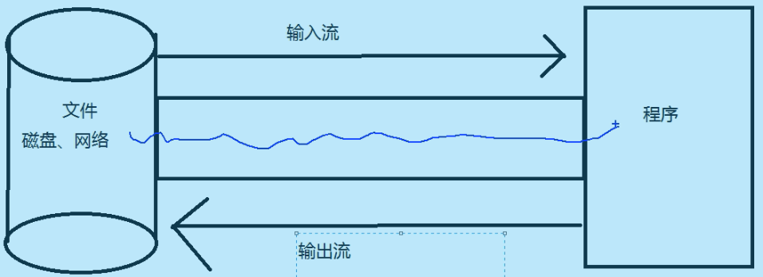
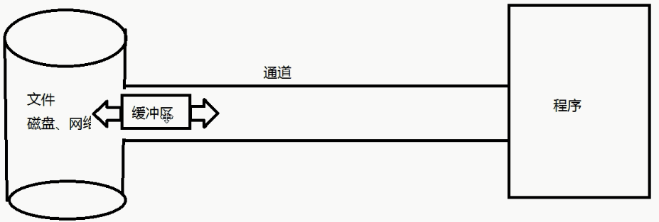

# NIO简介

Java NIO（New IO）是从Java 1.4版本开始引入的一个新的IO API，可以替代标准的Java IO API。NIO与原来的IO有同样的作用和目的，但是使用的方式完全不同，NIO支持面向缓冲区的、基于通道的IO操作。NIO将以更加高效的方式进行文件的读写操作。


## Java NIO与传统IO的主要区别

#### IO

阻塞IO(Blocking IO)

面向流(Stream Oriented)



>   以流的方式传输数据

#### NIO

面向缓冲区(Buffer Oriented)

非阻塞IO(NonBlocking IO)

选择器(Selectors)




用通道和缓冲区配合传输数据

通道就像是铁轨,航道

缓冲区就像是火车,货车(拉货的)

#### 使用通道的步骤为

1.  获取缓冲区（造车）：`ByteBuffer.allocate(capacity)`
2.  获取通道（造路）：`FIle[Socket]Channel.open(...,...)`
3.  缓冲区获取数据（装货）：`input.read(buf)`
4.  切换模式：`buf.flip()`
5.  缓冲区write数据到另一个通道（卸货）：`output.write(buf)`
6.  关闭通道

>   如果数据量大,需要循环（拉货一次拉不完多拉几次）

```java
while(input.read(buf)!= -1){
	output.write(buf);
}
```