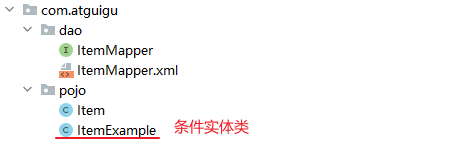
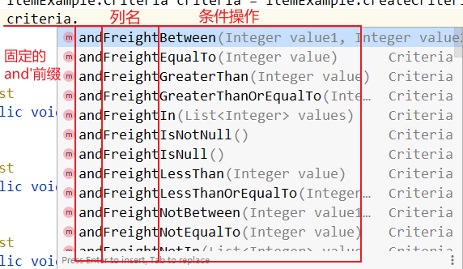

## MyBatis 逆向工程（MBG）

MyBatis逆向工程，简称MBG。是一个专门为MyBatis框架使用者定制的代码生成器。可以快速的根据表生成对应的映射文件，接口，以及Bean类对象。

mybatis的逆向工程，可以对单表生成的增，删，改，查代码的插件。

可以生成的基础代码有：

1、数据库表对应的javaBean对象

2、这些javaBean对象对应的Mapper接口

3、这些Mapper接口对应的配置文件

### 使用代码生成器：

1.  编写逆向工程配置文件（从文档中拷贝修改）

```xml
<?xml version="1.0" encoding="UTF-8"?>
<!DOCTYPE generatorConfiguration
        PUBLIC "-//mybatis.org//DTD MyBatis Generator Configuration 1.0//EN"
        "http://mybatis.org/dtd/mybatis-generator-config_1_0.dtd">

<generatorConfiguration>

    <!--
        targetRuntime 属性设置生成的Mybatis代码的版本
            MyBatis3Simple      简单版，只用CRUD功能
            MyBatis3            标准版
    -->
    <context id="DB2Tables" targetRuntime="MyBatis3">

        <!-- 去掉全部的注释 -->
        <commentGenerator>
            <property name="suppressAllComments" value="true" />
        </commentGenerator>

        <!-- 修改数据库的连接属性 -->
        <jdbcConnection driverClass="com.mysql.jdbc.Driver"
                        connectionURL="jdbc:mysql://localhost:3306/mbg"
                        userId="root"
                        password="root">
        </jdbcConnection>

        <javaTypeResolver >
            <property name="forceBigDecimals" value="false" />
        </javaTypeResolver>

        <!--
            javaModelGenerator标签配置JavaBean生成
                targetPackage 指定包名
                targetProject 生成代码放在哪个位置
        -->
        <javaModelGenerator targetPackage="com.atguigu.pojo" targetProject="./mbg/src">
            <property name="enableSubPackages" value="true" />
            <property name="trimStrings" value="true" />
        </javaModelGenerator>

        <!--
            sqlMapGenerator配置生成Mapper.xml配置文件
                targetPackage 指定包名
                targetProject 生成代码放在哪个位置
        -->
        <sqlMapGenerator targetPackage="com.atguigu.mapper"  targetProject="./mbg/src">
            <property name="enableSubPackages" value="true" />
        </sqlMapGenerator>

        <!--
            javaClientGenerator 配置生成Mapper接口
                targetPackage 指定包名
                targetProject 生成代码放在哪个位置
        -->
        <javaClientGenerator type="XMLMAPPER" targetPackage="com.atguigu.mapper"
                             targetProject="./mbg/src">
            <property name="enableSubPackages" value="true" />
        </javaClientGenerator>

        <!--
            一个table表示数据库里一个表
                tableName="t_user"          是表名
                domainObjectName="User"     是JavaBean对象类名
         -->
        <table tableName="t_user" domainObjectName="User" />
        <table tableName="t_book" domainObjectName="Book" />

    </context>
</generatorConfiguration>

```

2.  运行逆向工程代码（从文档中拷贝修改）

```java
package com.atguigu.mbg;

import org.mybatis.generator.api.MyBatisGenerator;
import org.mybatis.generator.config.Configuration;
import org.mybatis.generator.config.xml.ConfigurationParser;
import org.mybatis.generator.internal.DefaultShellCallback;

import java.io.File;
import java.util.ArrayList;
import java.util.List;

public class Runner {

    public static void main(String[] args) throws Exception{
        List<String> warnings = new ArrayList<String>();
        boolean overwrite = true;
        File configFile = new File("mbg/mbg.xml");
        ConfigurationParser cp = new ConfigurationParser(warnings);
        Configuration config = cp.parseConfiguration(configFile);
        DefaultShellCallback callback = new DefaultShellCallback(overwrite);
        MyBatisGenerator myBatisGenerator = new MyBatisGenerator(config, callback, warnings);
        myBatisGenerator.generate(null);
    }

}
```

代码生成：



### 条件实体类 XxxExample

作用：用于包装SQL语句，丰富查询的功能

语法：

```java
<pojoName>Example <pojoName>Example = new <pojoName>Example();
```

**常用API**

| 方法                                    | 功能说明                                    |
| --------------------------------------- | ------------------------------------------- |
| example.setOrderByClause(“字段名 ASC”); | 添加升序排列条件，DESC为降序                |
| example.setDistinct(boolean)            | 去除重复，boolean型，true为选择不重复的记录 |
| example.clear()                         | 清除查询条件                                |
| example.createCriteria()                | 创建条件查询器                              |
| example.or()                            | 合并条件                                    |

#### 内部类 Criteria

作用：用于包装增删改查的条件。

语法：

```java
<pojoName>Example.Criteria criteria = <pojoName>Example.createCriteria();
criteria.and<columnName><Ops>(args);
```

示例：查询价格在 12~3456之间的记录

```java
// 获取mapper代理类
ItemMapper mapper = sqlSession.getMapper(ItemMapper.class);
// 创建条件实体类
ItemExample itemExample = new ItemExample();
// 创建条件内部类
ItemExample.Criteria criteria = itemExample.createCriteria();
// 增加条件（可用链式编程）
criteria.andPriceBetween(12, 3456);
// 执行查询
mapper.selectByExample(itemExample).forEach(System.out::println);
```

**常用API**

| 方法                                       | 说明                                    |
| ------------------------------------------ | --------------------------------------- |
| criteria.andXxxIsNull                      | 添加字段xxx为null的条件                 |
| criteria.andXxxIsNotNull                   | 添加字段xxx不为null的条件               |
| criteria.andXxxEqualTo(value)              | 添加xxx字段等于value条件                |
| criteria.andXxxNotEqualTo(value)           | 添加xxx字段不等于value条件              |
| criteria.andXxxGreaterThan(value)          | 添加xxx字段大于value条件                |
| criteria.andXxxGreaterThanOrEqualTo(value) | 添加xxx字段大于等于value条件            |
| criteria.andXxxLessThan(value)             | 添加xxx字段小于value条件                |
| criteria.andXxxLessThanOrEqualTo(value)    | 添加xxx字段小于等于value条件            |
| criteria.andXxxIn(List<？>)                | 添加xxx字段值在List<？>条件             |
| criteria.andXxxNotIn(List<？>)             | 添加xxx字段值不在List<？>条件           |
| criteria.andXxxLike(“%”+value+”%”)         | 添加xxx字段值为value的模糊查询条件      |
| criteria.andXxxNotLike(“%”+value+”%”)      | 添加xxx字段值不为value的模糊查询条件    |
| criteria.andXxxBetween(value1,value2)      | 添加xxx字段值在value1和value2之间条件   |
| criteria.andXxxNotBetween(value1,value2)   | 添加xxx字段值不在value1和value2之间条件 |



补充：Mapper的XxxSelective方法：选择性地执行操作，若传入的pojo属性为null，则生成的SQL不添加此字段，**推荐使用**