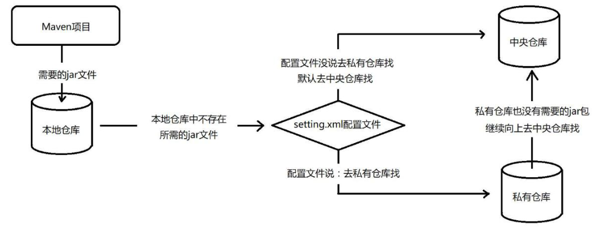
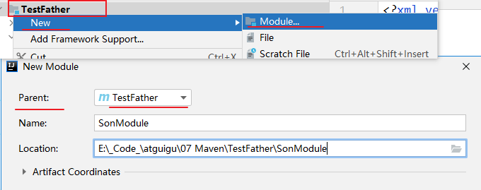

# Maven 基础

## Maven 简介

### Maven的作用

1.  添加第三方Jar包
2.  管理Jar包之间的依赖关系
3.  拆分管理项目
4.  自动化构建项目
5.  Maven插件提供的功能

### Maven目录结构

约定大于配置，指的是约定好一些东西，才可以运行。Maven中目录结构体现了约定的价值。

目录文件：

```
|--|pom.xml
|--|src
|--|--|main			main目录用于存放主程序。
|--|--|--|java		java目录用于存放源代码文件。
|--|--|--|resources	resources目录用于存放配置文件和资源文件。
|--|--|--|webapp	webapp目录用于存放web相关资源文件。
|--|--|test			test目录用于存放测试程序。
|--|--|--|java
|--|--|--|resources
```

>   注意：目录结构必须一字不差，否则Maven插件无法识别

### 常用命令

|命令|含义|作用|
|-|-|-|
|clean|清理|将项目下的 target 目录清空|
|compile|编译|将 src/main/java 代码编译成 class 文件|
|test|测试|将 src/test/java 代码编译成 class 文件,并执行测试方法|
|package|打包|将当前项目打成 Jar、war、pom 包|
|source:jar|对源码打包|将源码打成包|
|install|安装|将当前项目打成的包安装到本地仓库中|


## 坐标与依赖

### 坐标

通俗上的意义：可以通过坐标唯一定位一个资源的位置，这放在Maven中也同样适用。

使用如下三个向量在Maven的仓库中唯一的确定一个Maven工程。

-   groupId：公司或组织的域名倒序+当前项目名称
-   artifactId：当前项目的模块名称
-   version：当前模块的版本

```xml
<groupId>com.atguigu.maven</groupId>
<artifactId>Hello</artifactId>
<version>0.0.1-SNAPSHOT</version>
```

坐标是定义每个资源的唯一标识，一般放在pom文件的开篇部分。

```xml
<?xml version="1.0" encoding="UTF-8"?>
<project xmlns="http://maven.apache.org/POM/4.0.0"
         xmlns:xsi="http://www.w3.org/2001/XMLSchema-instance"
         xsi:schemaLocation="http://maven.apache.org/POM/4.0.0 http://maven.apache.org/xsd/maven-4.0.0.xsd">
    <modelVersion>4.0.0</modelVersion>

    <groupId>com.atguigu</groupId>
    <artifactId>ssm-maven</artifactId>
    <version>1.0-SNAPSHOT</version>

</project>
```

### 依赖管理

依赖的引入：使用 `<dependency>` 标签可以引入依赖，在依赖中，**通过坐标来定位**需要引入的资源的具体位置。

```xml
<dependencies>
    <dependency>
        <!-- 依赖的gav坐标 -->
        <groupId>junit</groupId>
        <artifactId>junit</artifactId>
        <version>4.9</version>
        <!-- 依赖的作用范围 -->
        <scope>test</scope>
    </dependency>
</dependencies>
```

#### Maven的依赖调节功能

| 功能     | 功能描述                                                     |
| :------- | :----------------------------------------------------------- |
| 依赖调节 | 决定当多个手动创建的版本同时出现时，哪个依赖版本将会被使用。 如果两个依赖版本在依赖树里的深度是一样的时候，第一个被声明的依赖将会被使用。 |
| 依赖管理 | 直接的指定手动创建的某个版本被使用。例如当一个工程 C 在自己的依赖管理模块包含工程 B，即 B 依赖于 A， 那么 A 即可指定在 B 被引用时所使用的版本。 |
| 依赖范围 | 包含在构建过程每个阶段的依赖。                               |
| 依赖排除 | 任何可传递的依赖都可以通过 "exclusion" 元素被排除在外。举例说明，A 依赖 B， B 依赖 C，因此 A 可以标记 C 为 "被排除的"。 |
| 依赖可选 | 任何可传递的依赖可以被标记为可选的，通过使用 "optional" 元素。例如：A 依赖 B， B 依赖 C。因此，B 可以标记 C 为可选的， 这样 A 就可以不再使用 C。 |

**依赖范围**

依赖范围可以在引入依赖时使用 `<scope></scope>` 标签指定。

| 范围              | 描述                                                         |
| :---------------- | :----------------------------------------------------------- |
| Compile：编译阶段 | 该范围表明相关依赖是只在项目的类路径下有效。默认取值。       |
| provide：供应阶段 | 该范围表明相关依赖是由运行时的 JDK 或者 网络服务器提供的。   |
| runtime：运行阶段 | 该范围表明相关依赖在编译阶段不是必须的，但是在执行阶段是必须的。 |
| test：测试阶段    | 该范围表明相关依赖只在测试编译阶段和执行阶段。               |
| System：系统阶段  | 该范围表                                                     |


## POM 文件

POM( Project Object Model，项目对象模型 ) 是 Maven 工程的基本工作单元，是一个XML文件，包含了项目的基本信息，用于描述项目如何构建，声明项目依赖等。

**POM的基本配置如下**

```xml
<project xmlns = "http://maven.apache.org/POM/4.0.0"
    xmlns:xsi = "http://www.w3.org/2001/XMLSchema-instance"
    xsi:schemaLocation = "http://maven.apache.org/POM/4.0.0
    http://maven.apache.org/xsd/maven-4.0.0.xsd">
 
    <!-- 模型版本（固定写死） -->
    <modelVersion>4.0.0</modelVersion>
    <!-- 公司或者组织的唯一标志，并且配置时生成的路径也是由此生成， 如com.companyname.project-group，maven会将该项目打成的jar包放本地路径：/com/companyname/project-group -->
    <groupId>com.companyname.project-group</groupId>
    <!-- 项目的唯一ID，一个groupId下面可能多个项目，就是靠artifactId来区分的 -->
    <artifactId>project</artifactId>
    <!-- 版本号 -->
    <version>1.0</version>
    
</project>
```

**常用二级节点**

| 节点                 | 描述                                                         |
| :------------------- | :----------------------------------------------------------- |
| project              | 工程的根标签。                                               |
| modelVersion         | 模型版本需要设置为 4.0。                                     |
| groupId              | 这是工程组的标识。它在一个组织或者项目中通常是唯一的。例如，一个银行组织 com.companyname.project-group 拥有所有的和银行相关的项目。 |
| artifactId           | 这是工程的标识。它通常是工程的名称。例如，消费者银行。groupId 和 artifactId 一起定义了 artifact 在仓库中的位置。 |
| version              | 这是工程的版本号。在 artifact 的仓库中，它用来区分不同的版本。 |
| packaging            | 指定打包方式，有pom、jar、war三种                            |
| build                | 构建项目所需信息。如插件、资源、源码目录等。                 |
| dependencies         | 管理依赖组                                                   |
| dependencyManagement | 虚引入，常用于规定之后引入的jar包版本号                      |
| properties           | 属性配置，可被占位符引用，通常用于管理版本号                 |
| modules              | 管理子模块，                                                 |


## Maven 生命周期

**运行任何一个阶段的时候，它前面的所有阶段都会被运行**。例如我们运行mvn install 的时候，代码会被编译，测试，打包。

Maven 有以下三个标准的生命周期：

-   **clean**：项目清理的处理
-   **default(或 build)**：项目部署的处理
-   **site**：项目站点文档创建的处理

如下是示意的default生命周期：

| 阶段          | 处理     | 描述                                                     |
| :------------ | :------- | :------------------------------------------------------- |
| 验证 validate | 验证项目 | 验证项目是否正确且所有必须信息是可用的                   |
| 编译 compile  | 执行编译 | 源代码编译在此阶段完成                                   |
| 测试 Test     | 测试     | 使用适当的单元测试框架（例如JUnit）运行测试。            |
| 包装 package  | 打包     | 创建JAR/WAR包如在 pom.xml 中定义提及的包                 |
| 检查 verify   | 检查     | 对集成测试的结果进行检查，以保证质量达标                 |
| 安装 install  | 安装     | 安装打包的项目到本地仓库，以供其他项目使用               |
| 部署 deploy   | 部署     | 拷贝最终的工程包到远程仓库中，以共享给其他开发人员和工程 |

### Clean 生命周期

当我们执行 mvn post-clean 命令时，Maven 调用 clean 生命周期，它包含以下阶段：

-   pre-clean：执行一些需要在clean之前完成的工作
-   clean：移除所有上一次构建生成的文件
-   post-clean：执行一些需要在clean之后立刻完成的工作

### Default (Build) 生命周期

这是 Maven 的主要生命周期，被用于构建应用，包括下面的 23 个阶段：

| 生命周期阶段                                | 描述                                                         |
| :------------------------------------------ | :----------------------------------------------------------- |
| validate（校验）                            | 校验项目是否正确并且所有必要的信息可以完成项目的构建过程。   |
| initialize（初始化）                        | 初始化构建状态，比如设置属性值。                             |
| generate-sources（生成源代码）              | 生成包含在编译阶段中的任何源代码。                           |
| process-sources（处理源代码）               | 处理源代码，比如说，过滤任意值。                             |
| generate-resources（生成资源文件）          | 生成将会包含在项目包中的资源文件。                           |
| process-resources （处理资源文件）          | 复制和处理资源到目标目录，为打包阶段最好准备。               |
| compile（编译）                             | 编译项目的源代码。                                           |
| process-classes（处理类文件）               | 处理编译生成的文件，比如说对Java class文件做字节码改善优化。 |
| generate-test-sources（生成测试源代码）     | 生成包含在编译阶段中的任何测试源代码。                       |
| process-test-sources（处理测试源代码）      | 处理测试源代码，比如说，过滤任意值。                         |
| generate-test-resources（生成测试资源文件） | 为测试创建资源文件。                                         |
| process-test-resources（处理测试资源文件）  | 复制和处理测试资源到目标目录。                               |
| test-compile（编译测试源码）                | 编译测试源代码到测试目标目录.                                |
| process-test-classes（处理测试类文件）      | 处理测试源码编译生成的文件。                                 |
| test（测试）                                | 使用合适的单元测试框架运行测试（Juint是其中之一）。          |
| prepare-package（准备打包）                 | 在实际打包之前，执行任何的必要的操作为打包做准备。           |
| package（打包）                             | 将编译后的代码打包成可分发格式的文件，比如JAR、WAR或者EAR文件。 |
| pre-integration-test（集成测试前）          | 在执行集成测试前进行必要的动作。比如说，搭建需要的环境。     |
| integration-test（集成测试）                | 处理和部署项目到可以运行集成测试环境中。                     |
| post-integration-test（集成测试后）         | 在执行集成测试完成后进行必要的动作。比如说，清理集成测试环境。 |
| verify （验证）                             | 运行任意的检查来验证项目包有效且达到质量标准。               |
| install（安装）                             | 安装项目包到本地仓库，这样项目包可以用作其他本地项目的依赖。 |
| deploy（部署）                              | 将最终的项目包复制到远程仓库中与其他开发者和项目共享。       |

### Site 生命周期

Maven Site 插件一般用来创建新的报告文档、部署站点等。

-   pre-site：执行一些需要在生成站点文档之前完成的工作
-   site：生成项目的站点文档
-   post-site： 执行一些需要在生成站点文档之后完成的工作，并且为部署做准备
-   site-deploy：将生成的站点文档部署到特定的服务器上


## 仓库

Maven 仓库是项目中依赖的第三方库，这个库所在的位置叫做仓库。在 Maven 中，任何一个依赖、插件或者项目构建的输出，都可以称之为构件。Maven 仓库能帮助我们管理构件（主要是JAR），它就是放置所有JAR文件（WAR，ZIP，POM等等）的地方。

Maven 仓库有三种类型：

-   本地（local）
-   中央（central）
-   远程（remote）

### 本地仓库

Maven 的本地仓库，在安装 Maven 后并不会创建，它是在第一次执行 maven 命令的时候才被创建。

运行 Maven 的时候，Maven 所需要的任何构件都是直接从本地仓库获取的。**如果本地仓库没有，它会首先尝试从远程仓库下载构件至本地仓库，然后再使用本地仓库的构件。**

### 中央仓库

Maven 中央仓库是由 Maven 社区提供的仓库，其中包含了大量常用的库。

中央仓库包含了绝大多数流行的开源Java构件，以及源码、作者信息、SCM、信息、许可证信息等。一般来说，简单的Java项目依赖的构件都可以在这里下载到。

中央仓库的关键概念：

-   这个仓库由 Maven 社区管理。
-   不需要配置。
-   需要通过网络才能访问。

### 远程仓库

如果 Maven 在中央仓库中也找不到依赖的文件，它会停止构建过程并输出错误信息到控制台。为避免这种情况，Maven 提供了远程仓库的概念，它是开发人员自己定制仓库，包含了所需要的代码库或者其他工程中用到的 jar 文件。

### Maven 依赖搜索顺序

当我们执行 Maven 构建命令时，Maven 开始按照以下顺序查找依赖的库：

1.  在本地仓库中搜索，如果找不到，执行步骤 2，如果找到了则执行其他操作。
2.  在中央仓库中搜索，如果找不到，并且有一个或多个远程仓库已经设置，则执行步骤 4，如果找到了则下载到本地仓库中以备将来引用。
3.  如果远程仓库没有被设置，Maven 将简单的停滞处理并抛出错误（无法找到依赖的文件）。
4.  在一个或多个远程仓库中搜索依赖的文件，如果找到则下载到本地仓库以备将来引用，否则 Maven 将停止处理并抛出错误（无法找到依赖的文件）。




## 父工程与聚合工程

### 父工程

由于非compile范围的依赖信息是不能在“依赖链”中传递的，所以有需要的工程只能单独配置。每个工程可以指定自己的父工程，从而使用父工程的Jar包管理。如果项目需要统一指定Jar包的版本，若到各个工程中手动修改无疑是非常不可取的。使用继承机制就可以将这样的依赖信息统一提取到父工程模块中进行统一管理。

父工程的作用：统一管理通用jar包的版本、依赖、作用范围等信息。注意：父工程的打包方式必须为POM

```xml
<!-- 打包方式为POM -->
<packaging>pom</packaging>
```

父工程的使用：在子类中通过 `<parent><parent/>` 与坐标，相对路径来指定父工程。

```xml
<parent>
	<!-- 父工程坐标 -->
	<groupId>...</groupId>
	<artifactId>...</artifactId>
	<version>...</version>
    <!-- 指定父工程的相对路径（从子工程的Pom文件出发） -->
	<relativePath>...</relativePath>
</parent>
```

>   如果子工程的 groupId 和 version 如果和父工程重复则可以删除。

**在父工程中管理依赖**

将Parent项目中的dependencies标签，用 `dependencyManagement` 标签括起来

```xml
<!-- 统一管理版本号 -->
<properties>
    <spring.version>5.2.5RELEASE</spring.version>
    <junit.version>4.12</junit.version>
</properties>
<!-- 统一管理jar包版本 -->
<dependencyManagement>      
    <dependencies>         
        <dependency>             
            <groupId>junit</groupId>             
            <artifactId>junit</artifactId>             
            <version>${junit.version}</version>             
            <scope>test</scope>         
        </dependency>      
    </dependencies>  
</dependencyManagement>  
```

-   dependencyManagement标签

    dependencyManagement里只是声明依赖，并不实现引入，因此，子项目需要显示声明依赖。如果不在子项目中声明依赖，是不会从父项目中继承下来的；子项目中声明该依赖项，并且没有指定具体版本，才会从父项目中继承该配置项，并且version和scope都读取自父pom；另外，如果子项目中指定了版本号，那么会使用子项目自己指定的jar版本。

-   dependencies标签：

    相对于dependencyManagement，所有声明在dependencies里的依赖都会自动引入，并默认被所有的子项目继承。

    dependencies即使在子项目中不写该依赖项，那么，子项目仍然会从父项目中继承该依赖项（全部继承）

### 聚合工程

将多个工程拆分为模块后，需要手动逐个安装到仓库后依赖才能够生效。修改源码后也需要逐个手动进行clean操作。而使用了聚合之后就可以批量进行Maven工程的安装、清理工作。一般来说只需要操作父工程，其子工程的各个步骤都会自动按照顺序执行。

**配置聚合工程**

在总的聚合工程（父工程）中使用modules/module标签组合，指定模块工程的相对路径即可

```xml
<modules>
    <!-- 指定pom的相对路径 -->
	<module>../A/pom.xml</module>
    <!-- 指定该目录下的模块名称也可以 -->
	<module>B</module>
	<module>C</module>
</modules>
```

### 组合使用（父工程+聚合工程）

实际开发中多用将父工程与聚合工程组合使用。一般会定义一个外层的parent父工程，在内部定义子工程（模块）。通知再父工程中聚合的子模块的相对路径，在子模块中指定父工程。

父工程：

```xml
<groupId>com.atguigu</groupId>
<artifactId>TestFather</artifactId>
<version>1.0-SNAPSHOT</version>模块
<!-- 依靠modules指定聚合的项目/模块 -->
<modules>
    <module>TestSon</module>
</modules>
<packaging>pom</packaging>
```

子工程：

```xml
<!-- 依靠parent指定父工程是哪个 -->
<parent>
    <artifactId>TestFather</artifactId>
    <groupId>com.atguigu</groupId>
    <version>1.0-SNAPSHOT</version>
    <relativePath>../pom.xml</relativePath>
</parent>
<modelVersion>4.0.0</modelVersion>

<packaging>jar</packaging>
<artifactId>TestSon</artifactId>
```

#### IDEA创建组合工程

在IDEA中组合使用直接通过点击父工程名称，然后新建模块，选定父工程即可




## Maven 插件

我们在输入 mvn 命令的时候 比如 **mvn clean**，clean 对应的就是 Clean 生命周期中的 clean 阶段。但是 clean 的具体操作是由 **maven-clean-plugin** 来实现的。

所以说 Maven 生命周期的每一个阶段的具体实现都是由 Maven 插件实现的。

Maven 实际上是一个依赖插件执行的框架，每个任务实际上是由插件完成。Maven 插件通常被用来：

-   创建 jar 文件
-   创建 war 文件
-   编译代码文件
-   代码单元测试
-   创建工程文档
-   创建工程报告

插件通常提供了一个目标的集合，并且可以使用下面的语法执行：

```
<code>mvn [plugin-name]:[goal-name]</code>
```

例如，一个 Java 工程可以使用 maven-compiler-plugin 的 compile-goal 编译，使用以下命令：

```
<code>mvn compiler:compile</code>
```

### 插件类型

Maven 提供了下面两种类型的插件：

| 类型              | 描述                                               |
| :---------------- | :------------------------------------------------- |
| Build plugins     | 在构建时执行，并在 pom.xml 的 元素中配置。         |
| Reporting plugins | 在网站生成过程中执行，并在 pom.xml 的 元素中配置。 |

下面是一些常用插件的列表：

| 插件     | 描述                                                |
| :------- | :-------------------------------------------------- |
| clean    | 构建之后清理目标文件。删除目标目录。                |
| compiler | 编译 Java 源文件。                                  |
| surefile | 运行 JUnit 单元测试。创建测试报告。                 |
| jar      | 从当前工程中构建 JAR 文件。                         |
| war      | 从当前工程中构建 WAR 文件。                         |
| javadoc  | 为工程生成 Javadoc。                                |
| antrun   | 从构建过程的任意一个阶段中运行一个 ant 任务的集合。 |