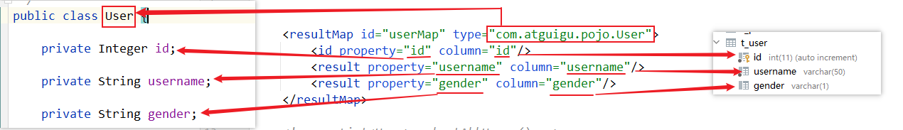
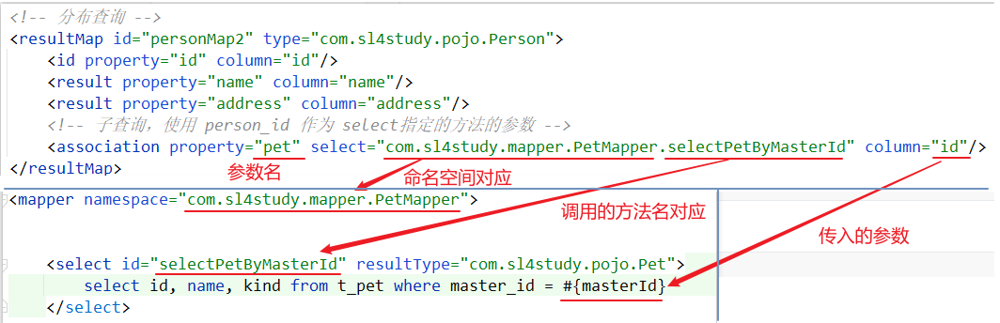
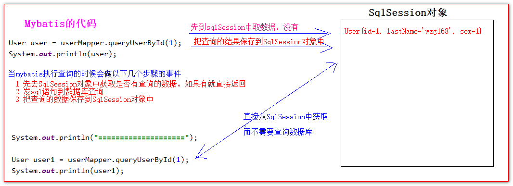
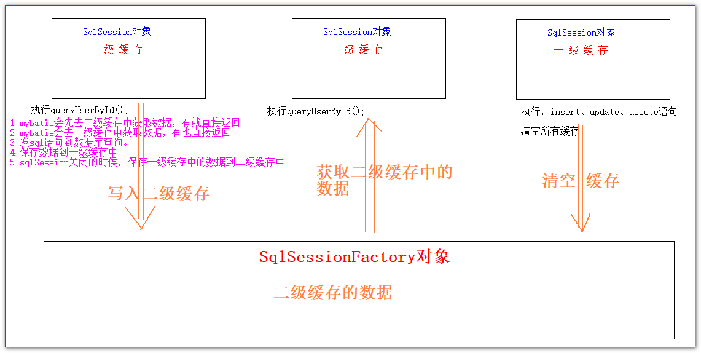
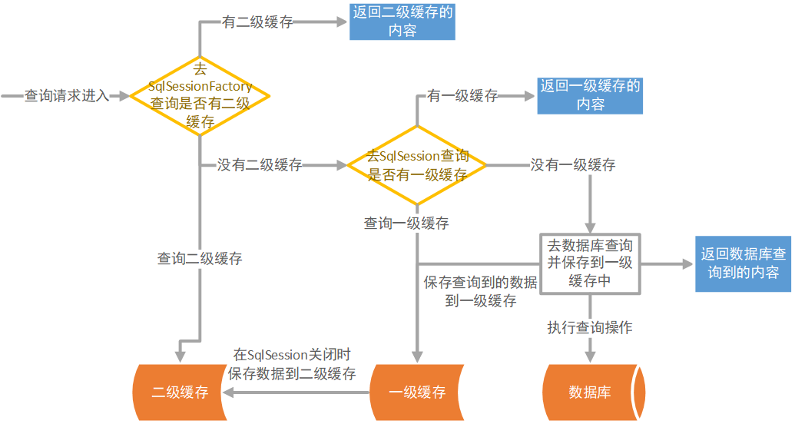

# MyBatis 基础

## MyBatis简介

MyBatis 是支持定制化 SQL、存储过程以及高级映射的优秀的持久层框架。

MyBatis 避免了几乎所有的 JDBC 代码和手动设置参数以及获取结果集。

MyBatis可以使用简单的XML或注解用于配置和原始映射，将接口和Java的POJO（Plain Old Java Objects，普通的Java对象）映射成数据库中的记录。

### Mybatis的历史

mybatis原是apache的一个开源项目iBatis, 2010年6月这个项目由apache software foundation 迁移到了google code，随着开发团队转投Google Code旗下，ibatis3.x正式更名为Mybatis ，代码于2013年11月迁移到Github。

iBATIS一词来源于“internet”和“abatis”的组合，是一个基于Java的持久层框架。iBATIS提供的持久层框架包括SQL Maps和Data Access Objects（DAO）

## HelloWorld

### MyBatis连接数据库的基本结构：

将Dao接口的方法映射到MyBatis的Mapper映射文件上，一个接口方法对应一个标签操作语句。Mapper映射文件可以由MyBatis全局配置文件管理，也可以由其他容器管理。

### MyBatis的依赖

```xml
<dependency>
    <groupId>org.mybatis</groupId>
    <artifactId>mybatis</artifactId>
    <version>x.x.x</version>
</dependency>
```

### 环境准备

先建立对应的数据库表与实体类

#### 1、数据库表

```sql
CREATE TABLE t_user
(
    id       INT PRIMARY KEY AUTO_INCREMENT,
    username VARCHAR(50) NOT NULL,
    gender   VARCHAR(1)
);
```

#### 2、实体类

```java
public class User {

    private Integer id;

    private String username;

    private String gender;

    // get、set方法
}
```

### 编写全局配置文件与Mapper映射文件

#### 1、全局配置文件

全局配置文件是配置MyBatis通用设置的选项，可以通过Mapper标签指定每个Mapper配置文件

```xml
<?xml version="1.0" encoding="UTF-8" ?>
<!DOCTYPE configuration
        PUBLIC "-//mybatis.org//DTD Config 3.0//EN"
        "http://mybatis.org/dtd/mybatis-3-config.dtd">
<configuration>

    <settings>
    	
    </settings>
    
    <environments default="development">
        <environment id="development">
            <transactionManager type="JDBC"/>
            <dataSource type="POOLED">
                <!-- 修改数据库的连接属性 -->
                <property name="driver" value="com.mysql.jdbc.Driver"/>
                <property name="url" value="jdbc:mysql://localhost:3306/mybatistest"/>
                <property name="username" value="root"/>
                <property name="password" value="root"/>
            </dataSource>
        </environment>
    </environments>
    <!-- mappers用于引入mapper.xml配置文件（sql语句的配置文件） -->
    <mappers>
        <!--        <mapper resource="UserMapper.xml"/>-->
        <!--        <package name="com.atguigu.mapper"/>-->
        <mapper class="com.atguigu.mapper.UserMapper"/>
    </mappers>
</configuration>
```

#### 2、映射文件

映射文件是配置每个Dao（Mapper）对应的具体执行的SQL语句的配置文件

```xml
<!DOCTYPE mapper PUBLIC
        "-//mybatis.org//DTD Mapper 3.0//EN"
        "http://mybatis.org/dtd/mybatis-3-mapper.dtd">
<mapper namespace="com.atguigu.mapper.UserMapper">

    <!--    List<User> selectAllUsers();-->
    <select id="selectAllUsers" resultType="com.atguigu.pojo.User">
        select * from t_user
    </select>

    <!--    User selectUserById(Integer id);-->
    <select id="selectUserById" resultType="com.atguigu.pojo.User">
        select * from t_user where id = #{id}
    </select>

    <!--    Integer updateUser(User user);-->
    <update id="updateUser" keyProperty="id" useGeneratedKeys="true">
        update t_user set `username` = #{username}, `gender`=#{gender} where id = #{id}
    </update>

    <!--    Integer deleteUserByUserId(Integer id);-->
    <delete id="deleteUserByUserId">
        delete from t_user where id = #{id}
    </delete>

    <!--    Integer insertUser(User user);-->
    <insert id="insertUser" useGeneratedKeys="true" keyProperty="id">
        insert into t_user (`username`,`gender`) values (#{username}, #{gender});
    </insert>

    <!--    Integer insertUserBatch(List<User> users);-->
    <insert id="insertUserBatch">
        insert into t_user (`username`,`gender`) values
        <foreach collection="users" item="user" separator=",">
            (#{user.username}, #{user.gender})
        </foreach>
    </insert>

</mapper>
```

### 编写数据库交互类Dao（Mapper）

```java
public interface UserMapper {
    List<User> selectAllUsers();
    User selectUserById(Integer id);
    Integer updateUser(User user);
    Integer deleteUserByUserId(Integer id);
    Integer insertUser(User user);
    Integer insertUserBatch(@Param("users") List<User> users);
}
```

### 测试类

每个基于 MyBatis 的应用都是以一个 SqlSessionFactory 的实例为核心的。SqlSessionFactory 的实例可以通过 SqlSessionFactoryBuilder 获得。通过读取主配置文件，可以根据主配置文件的内容创建SqlSessionFactory。 

```java
public class UserMapperTest {

    SqlSession sqlSession = null;

    UserMapper userMapper = null;

    @Before
    public void init() {
        ClassLoader classLoader = Test01.class.getClassLoader();
        InputStream resourceAsStream = classLoader.getResourceAsStream("mybatis-config.xml");
        sqlSession = new SqlSessionFactoryBuilder().build(resourceAsStream).openSession(true);
        userMapper = sqlSession.getMapper(UserMapper.class);
    }

    @After
    public void closeResources() {
        if (sqlSession != null) {
            sqlSession.close();
        }
    }

    @Test
    public void selectAllUsers() {
        userMapper.selectAllUsers().forEach(System.out::println);
    }

    @Test
    public void selectUserById() {
        System.out.println(userMapper.selectUserById(3));
    }

    @Test
    public void updateUser() {
        User user = new User(3, "leonardo", "男");
        Integer result = userMapper.updateUser(user);
        System.out.println("user = " + user);
        System.out.println("result = " + result);
    }

    @Test
    public void deleteUserByUserId() {
        Integer result = userMapper.deleteUserByUserId(5);
        System.out.println("result = " + result);
    }

    @Test
    public void test() {
        User xxt = new User(null, "xxt", "2");
        Integer result = userMapper.insertUser(xxt);
        System.out.println("result = " + result);
        System.out.println("xxt = " + xxt);
    }

    @Test
    public void insertUserBatch() {
        ArrayList<User> users = new ArrayList<>();
        users.add(new User(null, "leo", "1"));
        users.add(new User(null, "leona", "0"));
        users.add(new User(null, "leoro", "0"));
        users.add(new User(null, "doleo", "1"));
        users.add(new User(null, "waleo", "2"));
        users.add(new User(null, "tchleo", "1"));
        Integer integer = userMapper.insertUserBatch(users);
    }

}
```

### 作用域（Scope）和生命周期

#### SqlSessionFactoryBuilder

这个类可以被实例化、使用和丢弃，一旦创建了 SqlSessionFactory，就不再需要它了。 因此 SqlSessionFactoryBuilder 实例的最佳作用域是方法作用域（也就是局部方法变量）。 你可以重用 SqlSessionFactoryBuilder 来创建多个 SqlSessionFactory 实例，但最好还是不要一直保留着它，以保证所有的 XML 解析资源可以被释放给更重要的事情。

#### SqlSessionFactory

SqlSessionFactory 一旦被创建就应该在应用的运行期间一直存在，没有任何理由丢弃它或重新创建另一个实例。 使用 SqlSessionFactory 的最佳实践是在应用运行期间不要重复创建多次，多次重建 SqlSessionFactory 被视为一种代码“坏习惯”。因此 SqlSessionFactory 的最佳作用域是应用作用域。 有很多方法可以做到，最简单的就是使用单例模式或者静态单例模式。

#### SqlSession

每个线程都应该有它自己的 SqlSession 实例。SqlSession 的实例不是线程安全的，因此是不能被共享的，所以它的最佳的作用域是请求或方法作用域。 绝对不能将 SqlSession 实例的引用放在一个类的静态域，甚至一个类的实例变量也不行。 也绝不能将 SqlSession 实例的引用放在任何类型的托管作用域中，比如 Servlet 框架中的 HttpSession。 如果你现在正在使用一种 Web 框架，考虑将 SqlSession 放在一个和 HTTP 请求相似的作用域中。 换句话说，每次收到 HTTP 请求，就可以打开一个 SqlSession，返回一个响应后，就关闭它。 这个关闭操作很重要，为了确保每次都能执行关闭操作，你应该把这个关闭操作放到 finally 块中。 下面的示例就是一个确保 SqlSession 关闭的标准模式：

```java
try (SqlSession session = sqlSessionFactory.openSession()) {
    // 你的应用逻辑代码
}
```

在所有代码中都遵循这种使用模式，可以保证所有数据库资源都能被正确地关闭。

#### 映射器实例

映射器是一些绑定映射语句的接口。映射器接口的实例是从 SqlSession 中获得的。虽然从技术层面上来讲，任何映射器实例的最大作用域与请求它们的 SqlSession 相同。但方法作用域才是映射器实例的最合适的作用域。 也就是说，映射器实例应该在调用它们的方法中被获取，使用完毕之后即可丢弃。 映射器实例并不需要被显式地关闭。尽管在整个请求作用域保留映射器实例不会有什么问题，但是你很快会发现，在这个作用域上管理太多像 SqlSession 的资源会让你忙不过来。 因此，最好将映射器放在方法作用域内。就像下面的例子一样：

```java
try (SqlSession session = sqlSessionFactory.openSession()) {
    BlogMapper mapper = session.getMapper(BlogMapper.class);
    // 逻辑代码
}
```


## 全局配置文件

用于设置MyBatis的全局配置，其功能有：引入配置文件属性，管理数据库连接，环境管理，数据库厂商标识管理，映射文件管理等，在单独使用MyBatis时需要由他来管理数据库连接。不过，现在主配置文件默认情况下已经调整到比较优化的版本，使用其他容器框架统一管理。

>   注意：标签的顺序必须有序！

### 属性（properties标签）

一般用来引入外部配置文件，从而可以使用动态赋值

```xml
<properties resource="example/dbConfig.properties"></properties>

<!-- 动态赋值 -->
<dataSource type="POOLED">
  <property name="driver" value="${driver}"/>
  <property name="url" value="${url}"/>
  <property name="username" value="${username}"/>
  <property name="password" value="${password}"/>
</dataSource>
```

加载顺序：

-   首先读取在 properties 元素体内指定的属性。
-   然后根据 properties 元素中的 resource 属性读取类路径下属性文件，或根据 url 属性指定的路径读取属性文件，并覆盖之前读取过的同名属性。
-   最后读取作为方法参数传递的属性，并覆盖之前读取过的同名属性。

### 设置（settings标签）

设置标签可以改变MyBatis全局运行时的状态，一下标出几个比常用的属性

| 设置名                           | 描述                                                         | 有效值                                                       | 默认值                                                |
| :------------------------------- | :----------------------------------------------------------- | :----------------------------------------------------------- | :---------------------------------------------------- |
| **cacheEnabled**                 | 全局性地开启或关闭所有映射器配置文件中已配置的任何**缓存**。 | true \| false                                                | true                                                  |
| lazyLoadingEnabled               | **延迟加载**的全局开关。当开启时，所有关联对象都会延迟加载。 特定关联关系中可通过设置 `fetchType` 属性来覆盖该项的开关状态。 | true \| false                                                | false                                                 |
| aggressiveLazyLoading            | 开启时，任一方法的调用都会加载该对象的所有延迟加载属性。 否则，每个延迟加载属性会按需加载（参考 `lazyLoadTriggerMethods`)。 | true \| false                                                | false （在 3.4.1 及之前的版本中默认为 true）          |
| multipleResultSetsEnabled        | 是否允许单个语句返回多结果集（需要数据库驱动支持）。         | true \| false                                                | true                                                  |
| useColumnLabel                   | 使用列标签代替列名。实际表现依赖于数据库驱动，具体可参考数据库驱动的相关文档，或通过对比测试来观察。 | true \| false                                                | true                                                  |
| useGeneratedKeys                 | 允许 JDBC 支持自动生成主键，需要数据库驱动支持。如果设置为 true，将强制使用自动生成主键。尽管一些数据库驱动不支持此特性，但仍可正常工作（如 Derby）。 | true \| false                                                | False                                                 |
| autoMappingBehavior              | 指定 MyBatis 应如何自动映射列到字段或属性。 NONE 表示关闭自动映射；PARTIAL 只会自动映射没有定义嵌套结果映射的字段。 FULL 会自动映射任何复杂的结果集（无论是否嵌套）。 | NONE, PARTIAL, FULL                                          | PARTIAL                                               |
| autoMappingUnknownColumnBehavior | 指定发现自动映射目标未知列（或未知属性类型）的行为。`NONE`: 不做任何反应`WARNING`: 输出警告日志（`'org.apache.ibatis.session.AutoMappingUnknownColumnBehavior'` 的日志等级必须设置为 `WARN`）`FAILING`: 映射失败 (抛出 `SqlSessionException`) | NONE, WARNING, FAILING                                       | NONE                                                  |
| defaultExecutorType              | 配置默认的执行器。SIMPLE 就是普通的执行器；REUSE 执行器会重用预处理语句（PreparedStatement）； BATCH 执行器不仅重用语句还会执行批量更新。 | SIMPLE REUSE BATCH                                           | SIMPLE                                                |
| defaultStatementTimeout          | 设置超时时间，它决定数据库驱动等待数据库响应的秒数。         | 任意正整数                                                   | 未设置 (null)                                         |
| defaultFetchSize                 | 为驱动的结果集获取数量（fetchSize）设置一个建议值。此参数只可以在查询设置中被覆盖。 | 任意正整数                                                   | 未设置 (null)                                         |
| defaultResultSetType             | 指定语句默认的滚动策略。（新增于 3.5.2）                     | FORWARD_ONLY \| SCROLL_SENSITIVE \| SCROLL_INSENSITIVE \| DEFAULT（等同于未设置） | 未设置 (null)                                         |
| safeRowBoundsEnabled             | 是否允许在嵌套语句中使用分页（RowBounds）。如果允许使用则设置为 false。 | true \| false                                                | False                                                 |
| safeResultHandlerEnabled         | 是否允许在嵌套语句中使用结果处理器（ResultHandler）。如果允许使用则设置为 false。 | true \| false                                                | True                                                  |
| **mapUnderscoreToCamelCase**     | 是否开启驼峰命名自动映射，即从经典数据库列名 A_COLUMN 映射到经典 Java 属性名 aColumn。 | true \| false                                                | False                                                 |
| localCacheScope                  | MyBatis 利用本地缓存机制（Local Cache）防止循环引用和加速重复的嵌套查询。 默认值为 SESSION，会缓存一个会话中执行的所有查询。 若设置值为 STATEMENT，本地缓存将仅用于执行语句，对相同 SqlSession 的不同查询将不会进行缓存。 | SESSION \| STATEMENT                                         | SESSION                                               |
| jdbcTypeForNull                  | 当没有为参数指定特定的 JDBC 类型时，空值的默认 JDBC 类型。 某些数据库驱动需要指定列的 JDBC 类型，多数情况直接用一般类型即可，比如 NULL、VARCHAR 或 OTHER。 | JdbcType 常量，常用值：NULL、VARCHAR 或 OTHER。              | OTHER                                                 |
| lazyLoadTriggerMethods           | 指定对象的哪些方法触发一次延迟加载。                         | 用逗号分隔的方法列表。                                       | equals,clone,hashCode,toString                        |
| defaultScriptingLanguage         | 指定动态 SQL 生成使用的默认脚本语言。                        | 一个类型别名或全限定类名。                                   | org.apache.ibatis.scripting.xmltags.XMLLanguageDriver |
| defaultEnumTypeHandler           | 指定 Enum 使用的默认 `TypeHandler` 。（新增于 3.4.5）        | 一个类型别名或全限定类名。                                   | org.apache.ibatis.type.EnumTypeHandler                |
| callSettersOnNulls               | 指定当结果集中值为 null 的时候是否调用映射对象的 setter（map 对象时为 put）方法，这在依赖于 Map.keySet() 或 null 值进行初始化时比较有用。注意基本类型（int、boolean 等）是不能设置成 null 的。 | true \| false                                                | false                                                 |
| returnInstanceForEmptyRow        | 当返回行的所有列都是空时，MyBatis默认返回 `null`。 当开启这个设置时，MyBatis会返回一个空实例。 请注意，它也适用于嵌套的结果集（如集合或关联）。（新增于 3.4.2） | true \| false                                                | false                                                 |
| logPrefix                        | 指定 MyBatis 增加到日志名称的前缀。                          | 任何字符串                                                   | 未设置                                                |
| logImpl                          | 指定 MyBatis 所用日志的具体实现，未指定时将自动查找。        | SLF4J \| LOG4J \| LOG4J2 \| JDK_LOGGING \| COMMONS_LOGGING \| STDOUT_LOGGING \| NO_LOGGING | 未设置                                                |
| proxyFactory                     | 指定 Mybatis 创建可延迟加载对象所用到的代理工具。            | CGLIB \| JAVASSIST                                           | JAVASSIST （MyBatis 3.3 以上）                        |
| vfsImpl                          | 指定 VFS 的实现                                              | 自定义 VFS 的实现的类全限定名，以逗号分隔。                  | 未设置                                                |
| useActualParamName               | 允许使用方法签名中的名称作为语句参数名称。 为了使用该特性，你的项目必须采用 Java 8 编译，并且加上 `-parameters` 选项。（新增于 3.4.1） | true \| false                                                | true                                                  |
| configurationFactory             | 指定一个提供 `Configuration` 实例的类。 这个被返回的 Configuration 实例用来加载被反序列化对象的延迟加载属性值。 这个类必须包含一个签名为`static Configuration getConfiguration()` 的方法。（新增于 3.2.3） | 一个类型别名或完全限定类名。                                 | 未设置                                                |
| shrinkWhitespacesInSql           | 从SQL中删除多余的空格字符。请注意，这也会影响SQL中的文字字符串。 (新增于 3.5.5) | true \| false                                                | false                                                 |
| defaultSqlProviderType           | Specifies an sql provider class that holds provider method (Since 3.5.6). This class apply to the `type`(or `value`) attribute on sql provider annotation(e.g. `@SelectProvider`), when these attribute was omitted. | A type alias or fully qualified class name                   | Not set                                               |

**举例说明**

```xml
<settings>
    <setting name="cacheEnabled" value="true"/>
    <setting name="lazyLoadingEnabled" value="true"/>
    <setting name="multipleResultSetsEnabled" value="true"/>
    <setting name="useColumnLabel" value="true"/>
    <setting name="useGeneratedKeys" value="false"/>
    <setting name="autoMappingBehavior" value="PARTIAL"/>
    <setting name="autoMappingUnknownColumnBehavior" value="WARNING"/>
    <setting name="defaultExecutorType" value="SIMPLE"/>
    <setting name="defaultStatementTimeout" value="25"/>
    <setting name="defaultFetchSize" value="100"/>
    <setting name="safeRowBoundsEnabled" value="false"/>
    <setting name="mapUnderscoreToCamelCase" value="false"/>
    <setting name="localCacheScope" value="SESSION"/>
    <setting name="jdbcTypeForNull" value="OTHER"/>
    <setting name="lazyLoadTriggerMethods" value="equals,clone,hashCode,toString"/>
</settings>
```

### 插件（plugins）

MyBatis 允许你在映射语句执行过程中的某一点进行拦截调用。默认情况下，MyBatis 允许使用插件来拦截的方法调用包括：

-   Executor (update, query, flushStatements, commit, rollback, getTransaction, close, isClosed)
-   ParameterHandler (getParameterObject, setParameters)
-   ResultSetHandler (handleResultSets, handleOutputParameters)
-   StatementHandler (prepare, parameterize, batch, update, query)

这些类中方法的细节可以通过查看每个方法的签名来发现，或者直接查看 MyBatis 发行包中的源代码。 如果你想做的不仅仅是监控方法的调用，那么你最好相当了解要重写的方法的行为。 因为在试图修改或重写已有方法的行为时，很可能会破坏 MyBatis 的核心模块。 这些都是更底层的类和方法，所以使用插件的时候要特别当心。

通过 MyBatis 提供的强大机制，使用插件是非常简单的，只需实现 **Interceptor** 接口，并指定想要拦截的方法签名即可。

```java
// ExamplePlugin.java
@Intercepts({@Signature(
    type= Executor.class,
    method = "update",
    args = {MappedStatement.class,Object.class})})
public class ExamplePlugin implements Interceptor {
    
    private Properties properties = new Properties();
    
    public Object intercept(Invocation invocation) throws Throwable {
        
        // implement pre processing if need
        Object returnObject = invocation.proceed();
        
        // implement post processing if need
        return returnObject;
    }
    
    public void setProperties(Properties properties) {
        this.properties = properties;
    }
}
```

XML中开启插件

```xml
<!-- mybatis-config.xml -->
<plugins>
    <plugin interceptor="org.mybatis.example.ExamplePlugin">
        <property name="someProperty" value="100"/>
    </plugin>
</plugins>
```

上面的插件将会拦截在 Executor 实例中所有的 “update” 方法调用， 这里的 Executor 是负责执行底层映射语句的内部对象。

#### 提示：覆盖配置类

除了用插件来修改 MyBatis 核心行为以外，还可以通过完全覆盖配置类来达到目的。只需继承配置类后覆盖其中的某个方法，再把它传递到 SqlSessionFactoryBuilder.build(myConfig) 方法即可。

### 环境配置（environments标签）

环境配置用于根据不同的场景切换环境，如：开发时需要一个环境，用于连接本机数据库；测试时需要另一个环境，需要连接公司的数据库；进行部署时需要切换到部署环境，连接到服务器上的数据库。可以配置多个环境以供切换。

**每个数据库对应一个 SqlSessionFactory 实例**

为了指定创建哪种环境，只要将它作为可选的参数传递给 SqlSessionFactoryBuilder 即可。可以接受环境配置的两个方法签名是：

```java
SqlSessionFactory factory = new SqlSessionFactoryBuilder().build(reader, environment);
SqlSessionFactory factory = new SqlSessionFactoryBuilder().build(reader, environment, properties);
```

#### environments 标签

定义环境的各种属性，可以有多个environment子标签

```xml
<environments default="development">
    
    <environment id="development">
        <transactionManager type="JDBC">
            <property name="..." value="..."/>
        </transactionManager>
        <dataSource type="POOLED">
            <property name="driver" value="${driver}"/>
            <property name="url" value="${url}"/>
            <property name="username" value="${username}"/>
            <property name="password" value="${password}"/>
        </dataSource>
    </environment>
    
    <environment id="deploy">
        <transactionManager type="MANAGED">
            <property name="..." value="..."/>
        </transactionManager>
        <dataSource type="POOLED">
            <property name="driver" value="${driver}"/>
            <property name="url" value="${url}"/>
            <property name="username" value="${username}"/>
            <property name="password" value="${password}"/>
        </dataSource>
    </environment>
</environments>
```

**事务管理器（transactionManager）**

在 MyBatis 中有两种类型的事务管理器（也就是 type="[JDBC|MANAGED]"）：

-   JDBC – 这个配置直接使用了 JDBC 的提交和回滚设施，它依赖从数据源获得的连接来管理事务作用域。
-   MANAGED – 这个配置几乎没做什么。它从不提交或回滚一个连接，而是让容器来管理事务的整个生命周期（比如 JEE 应用服务器的上下文）。

默认为JDBC

>   如果你正在使用 Spring + MyBatis，则没有必要配置事务管理器，因为 Spring 模块会使用自带的管理器来覆盖前面的配置。

**数据源（dataSource）**

**UNPOOLED**– 这个数据源的实现会每次请求时打开和关闭连接。

-   `driver` – 这是 JDBC 驱动的 Java 类全限定名（并不是 JDBC 驱动中可能包含的数据源类）。
-   `url` – 这是数据库的 JDBC URL 地址。
-   `username` – 登录数据库的用户名。
-   `password` – 登录数据库的密码。
-   `defaultTransactionIsolationLevel` – 默认的连接事务隔离级别。
-   `defaultNetworkTimeout` – 等待数据库操作完成的默认网络超时时间（单位：毫秒）。查看 `java.sql.Connection#setNetworkTimeout()` 的 API 文档以获取更多信息。

**POOLED**– 这种数据源的实现利用“池”的概念将 JDBC 连接对象组织起来，避免了创建新的连接实例时所必需的初始化和认证时间。 

-   `poolMaximumActiveConnections` – 在任意时间可存在的活动（正在使用）连接数量，默认值：10
-   `poolMaximumIdleConnections` – 任意时间可能存在的空闲连接数。
-   `poolMaximumCheckoutTime` – 在被强制返回之前，池中连接被检出（checked out）时间，默认值：20000 毫秒（即 20 秒）
-   `poolTimeToWait` – 这是一个底层设置，如果获取连接花费了相当长的时间，连接池会打印状态日志并重新尝试获取一个连接（避免在误配置的情况下一直失败且不打印日志），默认值：20000 毫秒（即 20 秒）。
-   `poolMaximumLocalBadConnectionTolerance` – 这是一个关于坏连接容忍度的底层设置， 作用于每一个尝试从缓存池获取连接的线程。 如果这个线程获取到的是一个坏的连接，那么这个数据源允许这个线程尝试重新获取一个新的连接，但是这个重新尝试的次数不应该超过 `poolMaximumIdleConnections` 与 `poolMaximumLocalBadConnectionTolerance` 之和。 默认值：3（新增于 3.4.5）
-   `poolPingQuery` – 发送到数据库的侦测查询，用来检验连接是否正常工作并准备接受请求。默认是“NO PING QUERY SET”，这会导致多数数据库驱动出错时返回恰当的错误消息。
-   `poolPingEnabled` – 是否启用侦测查询。若开启，需要设置 `poolPingQuery` 属性为一个可执行的 SQL 语句（最好是一个速度非常快的 SQL 语句），默认值：false。
-   `poolPingConnectionsNotUsedFor` – 配置 poolPingQuery 的频率。可以被设置为和数据库连接超时时间一样，来避免不必要的侦测，默认值：0（即所有连接每一时刻都被侦测 — 当然仅当 poolPingEnabled 为 true 时适用）。

**JNDI** – 这个数据源实现是为了能在如 EJB 或应用服务器这类容器中使用，容器可以集中或在外部配置数据源，然后放置一个 JNDI 上下文的数据源引用。

-   `initial_context` – 这个属性用来在 InitialContext 中寻找上下文（即，initialContext.lookup(initial_context)）。这是个可选属性，如果忽略，那么将会直接从 InitialContext 中寻找 data_source 属性。
-   `data_source` – 这是引用数据源实例位置的上下文路径。提供了 initial_context 配置时会在其返回的上下文中进行查找，没有提供时则直接在 InitialContext 中查找。

### 数据库厂商标识（databaseIdProvider）

MyBatis 可以根据不同的数据库厂商执行不同的语句，这种多厂商的支持是基于映射语句中的 `databaseId` 属性。

配置文件：

```xml
<databaseIdProvider type="DB_VENDOR">
    <property name="SQL Server" value="sqlserver"/>
    <property name="DB2" value="db2"/>
    <property name="Oracle" value="oracle" />
</databaseIdProvider>
```

映射文件：

```xml
<!-- 标识为 oracle -->
<delete id="deleteUserByUserId" databaseId="oracle">
    delete from t_user where id = #{id}
</delete>

<!-- 标识为 mysql -->
<insert id="insertUser" databaseId="mysql">
    insert into t_user (`username`,`gender`) values (#{username}, #{gender});
</insert>
```

### 映射器（mappers）

用于指定书写SQL的映射文件的位置，有4种形式

```xml
<!-- 使用相对于类路径的资源引用 -->
<mappers>
  <mapper resource="org/mybatis/builder/AuthorMapper.xml"/>
  <mapper resource="org/mybatis/builder/BlogMapper.xml"/>
</mappers>

<!-- 使用完全限定资源定位符（URL） -->
<mappers>
  <mapper url="file:///var/mappers/AuthorMapper.xml"/>
  <mapper url="file:///var/mappers/BlogMapper.xml"/>
</mappers>

<!-- 使用映射器接口实现类的完全限定类名 -->
<mappers>
  <mapper class="org.mybatis.builder.AuthorMapper"/>
  <mapper class="org.mybatis.builder.BlogMapper"/>
</mappers>

<!-- 将包内的映射器接口实现全部注册为映射器 -->
<mappers>
  <package name="org.mybatis.builder"/>
</mappers>
```


## Mapper映射文件

Mapper映射文件用于具体SQL的书写，以及细粒化控制每个SQL执行的细节。

**顶级元素：**

-   `cache` – 该命名空间的缓存配置。
-   `cache-ref` – 引用其它命名空间的缓存配置。
-   `resultMap` – 描述数据库中的记录与Java中复杂对象的映射关系。
-   `sql` – 可被其它语句引用的可重用语句块。
-   `insert` – 映射插入语句。
-   `update` – 映射更新语句。
-   `delete` – 映射删除语句。
-   `select` – 映射查询语句。

### 几点说明

#### SQL语句取值说明

在映射文件中配置SQL语句，总会有取值的问题，如：

```xml
<select id="selectPerson" parameterType="int" resultType="hashmap">
    SELECT * FROM PERSON WHERE ID = #{id}
</select>
```

其中的 `#id` 为取出id的值。

**#{XXX}**

-   说明：使用占位符传值，无法取出引号内的内容。类似于 PreparedStatement
-   多用于查询条件

**${XXX}**

-   说明：直接输出到SQL语句，然后拼接字符串，可以取出引号内的内容。类似于 Statement 
-   多用于分表分库

#### 参数传递说明

**1、一个普通类型的数据**

可以在#{}书写任意内容,一个普通类型参数的时候，一般推荐写参数名，如：

```xml
<!-- public User queryUserById(Integer id)中， -->
<select id="queryUserById" resultType="com.atguigu.pojo.User">
    select `id`,`last_name` lastName,`sex` from t_user where id = #{id}
</select>
```

该例子中， #{id} 等价于  #{abcde}

**2、多个普通类型的数据**

当参数是多个普通类型的时候，无法通过形参名称取值。Mybatis默认提供两种方案去获取参数值：

1.  arg0，arg1，arg2 ... argn（兼容性差，有@Param注解就不可用）
2.  param0，param1，param2 ... paramn（可以兼容使用注解的场景）

```xml
<!-- List<User> queryUsersBySexOrName(String name,Integer sex) -->
<select id="queryUsersBySexOrName" resultType="com.atguigu.pojo.User">
    select `id`,`last_name` lastName,`sex` from t_user where last_name = #{param1} or sex = #{param2}
</select>
```

上述例子中，#{param1} 等价于 #{arg1}

**3、使用 `@Param` 注解**

@Param注解标注在方法上，可以对传入的普通类型的参数进行命名，从而在sql语句中可以根据该命名读取到占位符的内容。推荐对普通参数类型使用。如：

```java
List<User> selectUserByCondition(@Param("username") String username, @Param("gender") String gender);
```

在XML映射文件的SQL语句中可以通过 `#{对应名称}` 取出

```xml
<select id="selectUserByCondition" resultType="com.atguigu.pojo.User">
    select * from t_user where username = #{username} or gender = #{gender}
</select>
```

>   对于list集合的命名也适用。

**4、传入Pojo对象 或 传入Map对象**

当参数传入的是Pojo对象或Map对象时，可以通过 `#{XXX}` Pojo对象的属性或Map对象键值对的键直接取出对应的值，如下所示：

```java
// 传入Pojo对象
Integer insertUser(User user);
// 传入Map对象
Integer insertUser(Map map);
```

映射文件中直接取出

```xml
<!--传入Pojo User selectUserById(Integer id);-->
<select id="selectUserById" resultType="com.atguigu.pojo.User">
    select * from t_user where id = #{id}
</select>

<!--传入Map Integer updateUser(User user);-->
<update id="updateUser" keyProperty="id" useGeneratedKeys="true">
    update t_user set `username` = #{username}, `gender`=#{gender} where id = #{id}
</update>
```

测试代码

```java
// 传入Pojo测试
@Test
public void testInsertPojo() {
    User pojo = new User(null, "Lipo", "1");
    Integer result = userMapper.insertUserByPojo(pojo);
    System.out.println("result = " + result);
}

// 传入Map测试
@Test
public void testInsertMap() {
    HashMap<Object, Object> map = new HashMap<>();
    map.put("username", "Choing");
    map.put("gender", "0");
    Integer result = userMapper.insertUserByMap(map);
    System.out.println("result = " + result);
}
```

>   注意：传入多个Pojo/Map对象，需要使用 `@Param` 指定对象名，在xml文件中使用 `#{<对象名>.<属性>}` 访问

### SELECT 查询标签 

用于在数据库中查询的语句，由各种属性组成，其中 id 是必不可少的，id 标识了其与Dao接口方法中方法名的对应关系。

```xml
<select id="selectPerson" parameterType="int" resultType="hashmap">
    SELECT * FROM PERSON WHERE ID = #{id}
</select>
```

常用属性：

| 属性名称        | 描述                                                         |
| --------------- | ------------------------------------------------------------ |
| `id`            | 在命名空间中唯一的标识符，可以被用来引用这条语句。           |
| `parameterType` | 将会传入这条语句的参数的类全限定名或别名。这个属性是可选的，因为 MyBatis 可以通过类型处理器（TypeHandler）推断出具体传入语句的参数，默认值为未设置（unset）。 |
| `resultType`    | 期望从这条语句中返回结果的类全限定名或别名。 注意，如果返回的是集合，那应该设置为集合包含的类型，而不是集合本身的类型。 resultType 和 resultMap 之间只能同时使用一个。 |
| `resultMap`     | 对外部 resultMap 的命名引用。结果映射是 MyBatis 最强大的特性，如果你对其理解透彻，许多复杂的映射问题都能迎刃而解。 resultType 和 resultMap 之间只能同时使用一个。 |
| `flushCache`    | 将其设置为 true 后，只要语句被调用，都会导致本地缓存和二级缓存被清空，默认值：false。 |
| `useCache`      | 将其设置为 true 后，将会导致本条语句的结果被二级缓存缓存起来，默认值：对 select 元素为 true。 |
| `timeout`       | 这个设置是在抛出异常之前，驱动程序等待数据库返回请求结果的秒数。默认值为未设置（unset）（依赖数据库驱动）。 |
| `statementType` | 可选 STATEMENT，PREPARED 或 CALLABLE。这会让 MyBatis 分别使用 Statement，PreparedStatement 或 CallableStatement，默认值：PREPARED。 |
| `databaseId`    | 如果配置了数据库厂商标识（databaseIdProvider），MyBatis 会加载所有不带 databaseId 或匹配当前 databaseId 的语句；如果带和不带的语句都有，则不带的会被忽略。 |
| `resultOrdered` | 这个设置仅针对嵌套结果 select 语句：如果为 true，将会假设包含了嵌套结果集或是分组，当返回一个主结果行时，就不会产生对前面结果集的引用。 这就使得在获取嵌套结果集的时候不至于内存不够用。默认值：`false`。 |
| `resultSets`    | 这个设置仅适用于多结果集的情况。它将列出语句执行后返回的结果集并赋予每个结果集一个名称，多个名称之间以逗号分隔。 |

### INSERT、DELETE、UPDATE 增删改标签 

增删改标签用法与 Select标签差不多，都是在标签体内书写SQL语句，标签拥有自己的属性，如：

```xml
<insert id="insertAuthor" useGeneratedKeys="true" keyProperty="id">
    insert into Author (username,password,email) values (#{username},#{password},#{email})
</insert>

<update id="updateAuthor">
    update Author set username = #{username}, password = #{password}, email = #{email} where id = #{id}
</update>

<delete id="deleteAuthor">
    delete from Author where id = #{id}
</delete>
```

常用属性：

| 属性名称           | 描述                                                         |
| :----------------- | :----------------------------------------------------------- |
| `id`               | 在命名空间中唯一的标识符，可以被用来引用这条语句。           |
| `parameterType`    | 将会传入这条语句的参数的类全限定名或别名。这个属性是可选的，因为 MyBatis 可以通过类型处理器（TypeHandler）推断出具体传入语句的参数，默认值为未设置（unset）。 |
| `parameterMap`     | 用于引用外部 parameterMap 的属性，目前已被废弃。请使用行内参数映射和 parameterType 属性。 |
| `flushCache`       | 将其设置为 true 后，只要语句被调用，都会导致本地缓存和二级缓存被清空，默认值：（对 insert、update 和 delete 语句）true。 |
| `timeout`          | 这个设置是在抛出异常之前，驱动程序等待数据库返回请求结果的秒数。默认值为未设置（unset）（依赖数据库驱动）。 |
| `statementType`    | 可选 STATEMENT，PREPARED 或 CALLABLE。这会让 MyBatis 分别使用 Statement，PreparedStatement 或 CallableStatement，默认值：PREPARED。 |
| `useGeneratedKeys` | （仅适用于 insert 和 update）这会令 MyBatis 使用 JDBC 的 getGeneratedKeys 方法来取出由数据库内部生成的主键（比如：像 MySQL 和 SQL Server 这样的关系型数据库管理系统的自动递增字段），默认值：false。 |
| `keyProperty`      | （仅适用于 insert 和 update）指定能够唯一识别对象的属性，MyBatis 会使用 getGeneratedKeys 的返回值或 insert 语句的 selectKey 子元素设置它的值，默认值：未设置（`unset`）。如果生成列不止一个，可以用逗号分隔多个属性名称。 |
| `keyColumn`        | （仅适用于 insert 和 update）设置生成键值在表中的列名，在某些数据库（像 PostgreSQL）中，当主键列不是表中的第一列的时候，是必须设置的。如果生成列不止一个，可以用逗号分隔多个属性名称。 |
| `databaseId`       | 如果配置了数据库厂商标识（databaseIdProvider），MyBatis 会加载所有不带 databaseId 或匹配当前 databaseId 的语句；如果带和不带的语句都有，则不带的会被忽略。 |

### SQL 语句片段标签（未完成）

### ResultMap 结果集映射标签

resultMap标签一般用来用来将查询结果的字段映射到Pojo对象的属性名。

如，对于 select * from t_user 这一条SQL语句，对应关系如下图所示：

#### 一般用法



property属性：对应Java对象中的属性名。

column属性：对应数据库表中的字段名。

#### 子标签 association 一对一查询

association标签用于映射对象属性（一对一关系）

**举例说明：**

假设有一个对象Person，拥有pet对象属性

```java
// Person对象
public class Person {
    private Integer id;
    private String name;
    private String address;
    // 表示宠物对象的属性
    private Pet pet;
   
    // get/set 方法 ...
}

// Pet对象
public class Pet {
    private Integer id;
    private String name;
    private String kind;
    
    // get/set 方法 ...
}
```

**映射文件：**

```xml
<!-- 自定义实体类映射 -->
<resultMap type="com.sl4study.pojo.Person" id="personMap1">
    <id property="id" column="person_id"/>
    <result property="name" column="person_name"/>
    <result property="address" column="address"/>

    <!-- 映射对象属性 -->
    <association property="pet" javaType="com.sl4study.pojo.Pet">
        <id property="id" column="pet_id"/>
        <result property="name" column="pet_name"/>
        <result property="kind" column="kind"/>
    </association>

</resultMap>

<select id="selectPersonById1" resultMap="personMap1">
    select ps.id person_id,ps.name person_name, address, pt.id pet_id,pt.name pet_name,kind
    from t_person ps
    left join t_pet pt
    ON ps.id = pt.master_id
    where ps.id = #{id};
</select>
```

association内部的id 与 result标签与ResultMap中的标签，使用方法一致。

#### 子标签 collection 一对多查询

collection属性用于映射对象中的一对多关系，在Java对象中用另一个对象的集合属性表示。

**举例说明：**

现在有Clazz对象，表示一个班级，一个班级中有多个学生（一对多），用学生对象的List集合表示

```java
// 班级对象
public class Clazz {
    private Integer id;
    private String name;
    // 表示学生对象的集合属性
    private List<Student> studentList;
    
    // get/set ...
}

// 学生对象
public class Student {

    private Integer id;
    private String name;
   	// get/set...
}
```

**XML映射文件**

```xml
<!-- collection 测试 -->
<resultMap id="clazzMap" type="com.atguigu.pojo.Clazz">
    <id property="id" column="id"/>
    <result property="name" column="name"/>
    <!-- collection 一对多操作，映射集合关系 -->
    <collection property="studentList" ofType="com.atguigu.pojo.Student">
        <id property="id" column="s_id"/>
        <result property="name" column="s_name"/>
    </collection>
</resultMap>

<select id="selectClazzById" resultMap="clazzMap">
    select c.id,c.name,s.id s_id,s.name s_name
    from t_clazz c
             left join t_student s
                       on c.id = s.clazz_id
    where c.id = #{id};
</select>
```

collection属性说明：

-   property属性：对应集合对象在该对象内的名称
-   ofType属性：表示集合内每个元素的类型，需要全类名

#### association 与 collection 的分步查询

分布查询，即通过多次查询（这里是两次）来给 对象属性赋值。（以association 为例，collection同理）

```xml
<!-- 分步查询的resultMap -->
<resultMap id="personMap2" type="com.sl4study.pojo.Person">
    <id property="id" column="id"/>
    <result property="name" column="name"/>
    <result property="address" column="address"/>
    <!-- 子查询，使用 id 作为 select指定的方法的参数 -->
    <association property="pet" select="com.sl4study.mapper.PetMapper.selectPetByMasterId" column="id"/>
</resultMap>

<!-- 分步查询 -->
<select id="selectPersonById2" resultMap="personMap3">
    select id,name,address from t_person where id = #{id}
</select>


<!-- 第二步调用的查询语句，association标签的由select指定，column传参 -->
<mapper namespace="com.sl4study.mapper.PetMapper">
    <select id="selectPetByMasterId" resultType="com.sl4study.pojo.Pet">
        select id, name, kind from t_pet where master_id = #{masterId}
    </select>
</mapper>
```

-   select属性：多次查询调用的查询方法，由 命名空间+方法id组成。
-   column属性：本次查询的列名作为分布查询的参数，传入需要调用的查询方法。
    -   单个参数：直接将查询到的字段名传入即可。
    -   多个参数：格式为 `{key1=value1,key2=value2}` 传入
        -   key为参数的名称，可由 @Param 在接口方法上命名。
        -   value为查询到的字段的值。

**分步查询对应关系图**



如果调用的方法在自己的命名空间中，则select的命名空间部分可以省略。

**延迟加载（懒加载）**

在全局配置文件中的settings中开启懒加载与取消积极加载：

```xml
<!-- 打开延迟加载的开关 -->  
<setting name="lazyLoadingEnabled" value="true" />  
<!-- 将积极加载改为消极加载  按需加载 -->  
<setting name="aggressiveLazyLoading" value="false"/>  
```


## 动态SQL

动态标签是指，运用在 增删改查（insert,delete,update,select）标签体内，可以根据动态、属性及表达式来动态地生成sql语句的标签。使用动态标签可以使开发具有很大的灵活性。

>   动态标签基于OGNL 表达式

### if 标签

说明：if标签通过test属性，判断其包裹的sql语句是否可拼接。

```xml
<select id="findActiveBlogLike" resultType="Blog">
    SELECT * FROM BLOG WHERE state = ‘ACTIVE’
    <!-- 使用if标签判断 -->
    <if test="title != null">
        AND title like #{title}
    </if>
    <if test="author != null and author.name != null">
        AND author_name like #{author.name}
    </if>
</select>
```

#### if标签的局限性

以上面的代码为例，若传入的参数为例，若state属性也使用if标签控制，代码如下

```xml
<select id="findActiveBlogLike" resultType="Blog">
    SELECT * FROM BLOG WHERE
    <if test="state != null">
        state = #{state}
    </if>
    <if test="title != null">
        AND title like #{title}
    </if>
    <if test="author != null and author.name != null">
        AND author_name like #{author.name}
    </if>
</select>
```

如果没有匹配的条件，这条 SQL 会导致查询失败

```sql
SELECT * FROM BLOG WHERE
```

如果匹配的只是第二个条件，这条 SQL 会是这样:

```sql
SELECT * FROM BLOG WHERE AND title like ‘someTitle’
```

### choose (when, otherwise) 标签

说明：choose标签配合 when，otherwise标签可以作多路判断。

choose包裹 when与 otherwise标签，从上至下执行，当有一处when标签的test属性通过时，则拼接该when标签的内容，若所有when都不匹配时，则拼接otherwise标签中的内容。（otherwise标签可选）

```xml
<select id="findActiveBlogLike" resultType="Blog">
    SELECT * FROM BLOG WHERE state = ‘ACTIVE’
    <choose>
        <when test="title != null">
            AND title like #{title}
        </when>
        <when test="author != null and author.name != null">
            AND author_name like #{author.name}
        </when>
        <otherwise>
            AND featured = 1
        </otherwise>
    </choose>
</select>
```

#### 局限性：同if标签的局限性

### where、set、trim 标签

这三个标签可以很好地配合 `<if>` 标签使用，用于修正if语句中缺少或多出的部分

#### where 标签

说明：where语句，可以帮我们在多个动态语句中，有效的去掉前面的多余的 and 或 or 等多余的关键字。如果where标签体内没有内容，则会不加where标签

```xml
<select id="selectItemByCondition" resultType="com.sl4study.pojo.Item">
    select * from t_item
    <where>
        <if test="name != null">
            and name like concat('%',#{name},'%')
        </if>
        <if test="price != null">
            and price &lt; #{price}
        </if>
    </where>
</select>
```

>   最好将and写在前面！

#### set 标签

说明：可以去除inset插入语句中，if判断前后多余的逗号`,`

```xml
<insert id="insertUserNotNull">
    insert into t_item
    <set>
        <if test="name != null">
            name = #{name},
        </if>
        <if test="price != null">
            price = #{price},
        </if>
        <if test="freight != null">
            freight = #{freight},
        </if>
    </set>
</insert>
```

#### trim 标签

说明：trim 可以动态在包含的语句前面和后面添加给定的内容。也可以删除前面或者后面指定的内容。

```xml
<select id="queryUsersBySample" resultType="com.atguigu.pojo.User">
    select `id`,`last_name` lastName,`sex` from t_user
    <!--
        where标签可以去掉，它包含的sql语句前面的and或or关键字，
        同时会看有where里的内容是否存在，如果存在还要添加where关键字
     -->
    <trim suffixOverrides="and" prefix="where">
        <if test="lastName != null">
            last_name like concat('%',#{lastName},'%') and
        </if>
        <if test="sex == 0 || sex == 1">
            sex = #{sex}
        </if>
    </trim>

</select>
```

### foreach 标签

说明：foreach标签可以动态地对传入的集合进行遍历，灵活使用foreach的属性可以对遍历输出的内容进行自由地组合。

foreach的6个属性：

1.  collection：指定需要遍历的集合，默认可以使用list与collection，也可以通过@Param 指定
2.  item：集合中的每个元素
3.  separator：每次遍历加上的分隔符（最后一次遍历不加）
4.  index：数组的索引，map的key
5.  close：遍历前添加的内容
6.  open：遍历结束添加的内容

```xml
<select id="selectItemForPrice" resultType="com.sl4study.pojo.Item">
    select * from t_item where price in
    <foreach collection="priceList" item="price" open="(" close=")" separator=",">
        #{price}
    </foreach>
</select>
```

### sql 标签

这个元素可以用来定义可重用的 SQL 代码片段，以便在其它语句中使用。 参数可以静态地（在加载的时候）确定下来，并且可以在不同的 include 元素中定义不同的参数值（使用 `${}` ）。比如：

```xml
<sql id="userColumns"> ${alias}.id,${alias}.username,${alias}.password </sql>
```

这个 SQL 片段可以在其它语句中使用，使用 `<include>` 标签的 `refid` 引入。例如：

```xml
<select id="selectUsers" resultType="map">
    select
    <include refid="userColumns"><property name="alias" value="t1"/></include>,
    <include refid="userColumns"><property name="alias" value="t2"/></include>
    from some_table t1
    cross join some_table t2
</select>
```

也可以在 include 元素的 refid 属性或内部语句中使用属性值，例如：

```xml
<sql id="sometable">
    ${prefix}Table
</sql>

<sql id="someinclude">
    from
    <include refid="${include_target}"/>
</sql>

<select id="select" resultType="map">
    select
    field1, field2, field3
    <include refid="someinclude">
        <property name="prefix" value="Some"/>
        <property name="include_target" value="sometable"/>
    </include>
</select>
```


## MyBatis 缓存

缓存的目的是为了提高访问速度。

-   MyBatis共有两级缓存

    一级缓存：一级缓存是把数据保存到SqlSession对象中（同一个SqlSession对象，就可以使用一级缓存，SqlSession级别）

    二级缓存：二级缓存是把数据保存到SqlSessionFactory对象中（同一个SqlSessionFactory对象，可以使用二级缓存，NameSpace级别）

### 一级缓存

示意图



#### 一级缓存失效情况

1.  不在同一个SqlSession对象中

```java
public void queryOne(){
    SqlSession session = sqlSessionFactory.openSession();
    try {
        UserMapper userMapper = session.getMapper(UserMapper.class);

        User user = userMapper.queryUserById(1);
        System.out.println(user);

    } finally {
        session.close();
    }
}

//1.不在同一个SqlSession对象中
@Test
public void test1() {
    queryOne();
    queryOne();
}
```

2.  执行语句的参数不同。缓存中也不存在数据。

```java
@Test
public void test2() {

    SqlSession session = sqlSessionFactory.openSession();
    try {
        UserMapper userMapper = session.getMapper(UserMapper.class);

        // 语句1
        User user = userMapper.queryUserById(1);
        System.out.println(user);

        System.out.println("====================");

        // 语句2
        User user1 = userMapper.queryUserById(2);
        System.out.println(user1);

    } finally {
        session.close();
    }

}
```

3.  执行增，删，改，语句，会清空掉缓存

```java
@Test
public void test3() {

    SqlSession session = sqlSessionFactory.openSession();
    try {
        UserMapper userMapper = session.getMapper(UserMapper.class);

        User user = userMapper.queryUserById(1);
        System.out.println(user);

        System.out.println("====================");
        //只要执行了，insert，update，delete语句，就会把缓存清空
        userMapper.updateUser(new User(7, "77777777",0));
        session.commit();

        User user1 = userMapper.queryUserById(1);
        System.out.println(user1);

    } finally {
        session.close();
    }

}
```

4.  手动清空缓存数据

```java
public void test4() {

    SqlSession session = sqlSessionFactory.openSession();
    try {
        UserMapper userMapper = session.getMapper(UserMapper.class);

        User user = userMapper.queryUserById(1);
        System.out.println(user);

        System.out.println("====================");

        // 手动清空缓存
        session.clearCache();

        User user1 = userMapper.queryUserById(1);
        System.out.println(user1);

    } finally {
        session.close();
    }

}
```

###  二级缓存

示意图



#### 二级缓存的使用步骤

1.  到mybatis-config.xml配置文件中通过settings标签启动二级缓存（默认开启）

2.  到Mapper.xml配置文件中使用cache标签，表示使用二级缓存

    ```xml
    <cache/>
    ```

3.  被缓存的数据对象。一定要实现序列化接口。

>   `<cache-ref/>` 可以引用使用其他命名空间的缓存（一般情况下一个命名空间一个缓存），在执行清理的时候，会与被引用的命名空间的缓存一起被清理。

#### 自定义二级缓存

1.  自定义级缓存，需要实现一个mybatis中提供的Cache缓存接口（org.apache.ibatis.cache.impl.PerpetualCache是一级缓存默认实现类）

2.  实现Cache接口中的方法

3.  到 `<cache/>` 标签中，设置type属性，设置你自定义的缓存类

```java
public class MySecondCache implements Cache {

    private final String id;

    private Map<Object, Object> cache = new HashMap();

    public MySecondCache(String id) {
        this.id = id;
    }

    public String getId() {
        return this.id;
    }

    public int getSize() {
        return this.cache.size();
    }

    public void putObject(Object key, Object value) {
        System.out.println(" MySecondCache 二级缓存 保存数据 ");
        this.cache.put(key, value);
    }

    public Object getObject(Object key) {
        System.out.println(" MySecondCache 二级缓存 获取数据 ");
        return this.cache.get(key);
    }

    public Object removeObject(Object key) {
        System.out.println(" MySecondCache 二级缓存 删除数据 ");
        return this.cache.remove(key);
    }

    public void clear() {
        this.cache.clear();
    }

    public ReadWriteLock getReadWriteLock() {
        return null;
    }

    public boolean equals(Object o) {
        if (this.getId() == null) {
            throw new CacheException("Cache instances require an ID.");
        } else if (this == o) {
            return true;
        } else if (!(o instanceof Cache)) {
            return false;
        } else {
            Cache otherCache = (Cache) o;
            return this.getId().equals(otherCache.getId());
        }
    }

    public int hashCode() {
        if (this.getId() == null) {
            throw new CacheException("Cache instances require an ID.");
        } else {
            return this.getId().hashCode();
        }
    }
}
```

####  `useCache=false` 演示和说明

useCache属性是select标签中存在，作用是设置查询完之后是否将结果保存到二级缓存中。

useCahce值默认是true。表示使用二级缓存。

```xml
<!--
    public User queryUserById(Integer id);
        useCache="false" 查询结果不保存到二级缓存中
-->
<select id="queryUserById" resultType="com.atguigu.pojo.User" useCache="false">
    select `id`,`last_name` lastName,`sex` from t_user where id = #{id}
</select>
```

#### `flushCache=false` 演示和说明

flushCache属性存在于insert,delete,update标签中，作用是是执行insert,update,delete语句后是否清空缓存。

默认值是true。表示清空缓存，也可以设置为false，让执行insert,delete,update语句，执行完后，不清空缓存。

```xml
<!--    public int updateUser(User user);
            flushCache="false"不清空缓存
 -->
<update id="updateUser" parameterType="com.atguigu.pojo.User" flushCache="false">
    update
    t_user
    set
    `last_name` = #{lastName},
    `sex` = #{sex}
    where
    id = #{id}
</update>
```

### 缓存使用顺序

1.  去SqlSesionFactory中查询二级缓存，如果有，则直接返回。
2.  去SqlSession中查询一级缓存，如果有，则直接返回。
3.  去数据库查询，并将查询结果保存在SqlSession的一级缓存，然后返回。
4.  关闭SqlSession时，将一级缓存的数据保存到二级缓存中。



