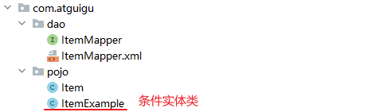
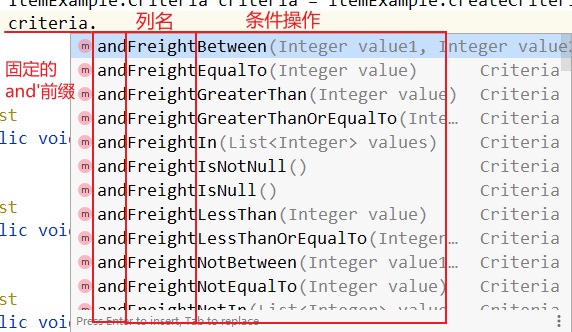
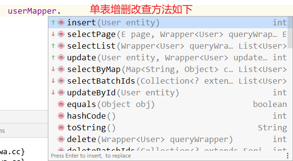
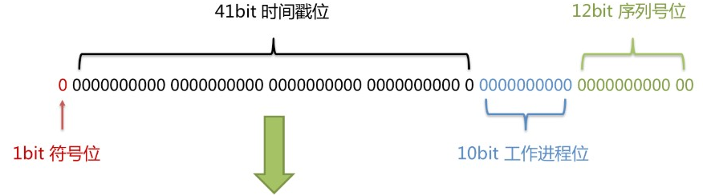

# MyBatis 插件

## MyBatis 逆向工程（MBG）

MyBatis逆向工程，简称MBG。是一个专门为MyBatis框架使用者定制的代码生成器。可以快速的根据表生成对应的映射文件，接口，以及Bean类对象。

mybatis的逆向工程，可以对单表生成的增，删，改，查代码的插件。

**逆向工程的包为：mybatis-generator-core-1.3.2.jar**

Maven 引入：

```xml
<!-- 数据库连接驱动 -->
<dependency>
    <groupId>mysql</groupId>
    <artifactId>mysql-connector-java</artifactId>
    <version>5.1.38</version>
</dependency>

<!-- mybatis -->
<dependency>
    <groupId>org.mybatis</groupId>
    <artifactId>mybatis</artifactId>
    <version>3.4.6</version>
</dependency>

<!-- mybatis-generator-core -->
<dependency>
    <groupId>org.mybatis.generator</groupId>
    <artifactId>mybatis-generator-core</artifactId>
    <version>1.3.7</version>
</dependency>
```

可以生成的基础代码有：

1、数据库表对应的javaBean对象

2、这些javaBean对象对应的Mapper接口

3、这些Mapper接口对应的配置文件

### 使用代码生成器：

1.  编写逆向工程配置文件（从文档中拷贝修改）

```xml
<?xml version="1.0" encoding="UTF-8"?>
<!DOCTYPE generatorConfiguration
        PUBLIC "-//mybatis.org//DTD MyBatis Generator Configuration 1.0//EN"
        "http://mybatis.org/dtd/mybatis-generator-config_1_0.dtd">

<generatorConfiguration>

    <!--
        targetRuntime 属性设置生成的Mybatis代码的版本
            MyBatis3Simple      简单版，只用CRUD功能
            MyBatis3            标准版，可以实现复杂的查询操作
    -->
    <context id="DB2Tables" targetRuntime="MyBatis3">

        <!-- 自动序列化 -->
        <plugin type="org.mybatis.generator.plugins.SerializablePlugin" />
        <plugin type="org.mybatis.generator.plugins.UnmergeableXmlMappersPlugin" />

        <!-- 向Pojo类中添加hashCode与Equals方法 -->
        <plugin type="org.mybatis.generator.plugins.EqualsHashCodePlugin">
            <property name="useEqualsHashCodeFromRoot" value="true"/>
        </plugin>

        <!-- 向Pojo类中添加toString方法 -->
        <plugin type="org.mybatis.generator.plugins.ToStringPlugin">
            <property name="useToStringFromRoot" value="true"/>
        </plugin>

        <!-- 去掉全部的注释 -->
        <commentGenerator>
            <property name="suppressAllComments" value="true"/>
        </commentGenerator>

        <!-- 修改数据库的连接属性 -->
        <jdbcConnection driverClass="com.mysql.jdbc.Driver"
                        connectionURL="jdbc:mysql://localhost:3306/数据库名"
                        userId="root"
                        password="root">
        </jdbcConnection>

        <javaTypeResolver >
            <property name="forceBigDecimals" value="false"/>
        </javaTypeResolver>

        <!--
            javaModelGenerator标签配置Pojo生成
                targetPackage 指定包名
                targetProject 生成代码放在哪个位置
        -->
        <javaModelGenerator targetProject="./模块名/src" targetPackage="com.包名">
            <!-- 是否允许子包 -->
            <property name="enableSubPackages" value="true" />
            <!-- 是否取出前后空格 -->
            <property name="trimStrings" value="true" />
            <!-- 是否对modal添加构造函数 -->
            <property name="constructorBased" value="true" />
        </javaModelGenerator>

        <!--
            sqlMapGenerator配置生成Mapper.xml配置文件
                targetPackage 指定包名
                targetProject 生成代码放在哪个位置
        -->
        <sqlMapGenerator targetProject="./模块名/src" targetPackage="com.包名">
            <property name="enableSubPackages" value="true" />
        </sqlMapGenerator>

        <!--
            javaClientGenerator 配置生成Mapper接口
                targetPackage 指定包名
                targetProject 生成代码放在哪个位置
        -->
        <javaClientGenerator type="XMLMAPPER" targetProject="./模块名/src" targetPackage="com.包名">
            <property name="enableSubPackages" value="true" />
        </javaClientGenerator>

        <!--
            一个table表示数据库里一个表
                tableName="t_user"          是表名
                domainObjectName="User"     是JavaBean对象类名
         -->
        <table tableName="数据库表名" domainObjectName="实体类" />
        <table tableName="t_book" domainObjectName="Book" />

    </context>
</generatorConfiguration>

```

2.  运行逆向工程代码

    Java代码形式：直接复制文档即可

    ```java
    package com.atguigu.mbg;
    
    import org.mybatis.generator.api.MyBatisGenerator;
    import org.mybatis.generator.config.Configuration;
    import org.mybatis.generator.config.xml.ConfigurationParser;
    import org.mybatis.generator.internal.DefaultShellCallback;
    
    import java.io.File;
    import java.util.ArrayList;
    import java.util.List;
    
    public class Runner {
    
        public static void main(String[] args) throws Exception{
            List<String> warnings = new ArrayList<String>();
            boolean overwrite = true;
            File configFile = new File("mbg/mbg.xml");
            ConfigurationParser cp = new ConfigurationParser(warnings);
            Configuration config = cp.parseConfiguration(configFile);
            DefaultShellCallback callback = new DefaultShellCallback(overwrite);
            MyBatisGenerator myBatisGenerator = new MyBatisGenerator(config, callback, warnings);
            myBatisGenerator.generate(null);
        }
    
    }
    ```

    Maven形式：使用Maven插件构建

    ```xml
    <build>
        <plugins>
            <plugin>
                <groupId>org.mybatis.generator</groupId>
                <artifactId>mybatis-generator-maven-plugin</artifactId>
                <version>1.4.0</version>
    
                <configuration>
                    <configurationFile>src/main/resources/generatorConfig.xml</configurationFile>
                    <verbose>true</verbose>
                    <overwrite>true</overwrite>
                </configuration>
    
                <dependencies>
                    <dependency>
                        <groupId>mysql</groupId>
                        <artifactId>mysql-connector-java</artifactId>
                        <version>5.1.38</version>
                    </dependency>
                </dependencies>
            </plugin>
        </plugins>
    </build>
    ```

    >   注意：Java代码形式与Maven插件形式加载mbg配置中的 targetProject 路径不同。
    >
    >   -   Java代码：`./` 前缀代表的是当前项目
    >   -   Maven插件形式：加前缀，直接相对于当前项目或工程；加前缀 `./` 表示当前pom所在的模块

代码生成：



### 条件实体类 XxxExample

作用：用于包装SQL语句，丰富查询的功能

语法：

```java
<pojoName>Example <pojoName>Example = new <pojoName>Example();
```

**常用API**

| 方法                                    | 功能说明                                    |
| --------------------------------------- | ------------------------------------------- |
| example.setOrderByClause(“字段名 ASC”); | 添加升序排列条件，DESC为降序                |
| example.setDistinct(boolean)            | 去除重复，boolean型，true为选择不重复的记录 |
| example.clear()                         | 清除查询条件                                |
| example.createCriteria()                | 创建条件查询器                              |
| example.or()                            | 合并条件                                    |

#### 内部类 Criteria

作用：用于包装增删改查的条件。

语法：

```java
<pojoName>Example.Criteria criteria = <pojoName>Example.createCriteria();
criteria.and<columnName><Ops>(args);
```

示例：查询价格在 12~3456之间的记录

```java
// 获取mapper代理类
ItemMapper mapper = sqlSession.getMapper(ItemMapper.class);
// 创建条件实体类
ItemExample itemExample = new ItemExample();
// 创建条件内部类
ItemExample.Criteria criteria = itemExample.createCriteria();
// 增加条件（可用链式编程）
criteria.andPriceBetween(12, 3456);
// 执行查询
mapper.selectByExample(itemExample).forEach(System.out::println);
```

**常用API**

| 方法                                       | 说明                                    |
| ------------------------------------------ | --------------------------------------- |
| criteria.andXxxIsNull                      | 添加字段xxx为null的条件                 |
| criteria.andXxxIsNotNull                   | 添加字段xxx不为null的条件               |
| criteria.andXxxEqualTo(value)              | 添加xxx字段等于value条件                |
| criteria.andXxxNotEqualTo(value)           | 添加xxx字段不等于value条件              |
| criteria.andXxxGreaterThan(value)          | 添加xxx字段大于value条件                |
| criteria.andXxxGreaterThanOrEqualTo(value) | 添加xxx字段大于等于value条件            |
| criteria.andXxxLessThan(value)             | 添加xxx字段小于value条件                |
| criteria.andXxxLessThanOrEqualTo(value)    | 添加xxx字段小于等于value条件            |
| criteria.andXxxIn(List<？>)                | 添加xxx字段值在List<？>条件             |
| criteria.andXxxNotIn(List<？>)             | 添加xxx字段值不在List<？>条件           |
| criteria.andXxxLike(“%”+value+”%”)         | 添加xxx字段值为value的模糊查询条件      |
| criteria.andXxxNotLike(“%”+value+”%”)      | 添加xxx字段值不为value的模糊查询条件    |
| criteria.andXxxBetween(value1,value2)      | 添加xxx字段值在value1和value2之间条件   |
| criteria.andXxxNotBetween(value1,value2)   | 添加xxx字段值不在value1和value2之间条件 |



补充：Mapper的XxxSelective方法：选择性地执行操作，若传入的pojo属性为null，则生成的SQL不添加此字段，**推荐使用**


## Mybatis-Plus

官网：[http://mp.baomidou.com](http://mp.baomidou.com/guide/)

参考教程：http://mp.baomidou.com/guide/

MyBatis-Plus（简称 MP）是一个 MyBatis 的增强工具，在 MyBatis 的基础上只做增强不做改变，为简化开发、提高效率而生。

### SpringBoot 整合MP

仅需导入MP依赖即可。

```xml
<dependency>
    <groupId>com.baomidou</groupId>
    <artifactId>mybatis-plus-boot-starter</artifactId>
    <version>3.4.1</version>
</dependency>
```

### MP单表增删改查操作

单表增删改查使用内置的通用Mapper实现，使用步骤如下：

1、使用让映射接口实现BaseMapper

```java
public interface XxxMapper extends BaseMapper<Xxx> {  }
```

>   XXX表示某个实体类，该接口是实体类的映射类。不用些奇特额外操作。

2、直接注入该类进行增删改查即可。

```java
@Autowired
UserMapper userMapper;
```



以UserMapper为例：

#### 1、插入操作

插入操作只有一种，传入Pojo类插入。

```java
userMapper.insert(new User(null, "leonardo", 12, "watch@wa.cc", null, null));
userMapper.insert(new User(null, "渣渣辉1", 33, "zzh@wa.cc", null, null));
userMapper.insert(new User(null, "渣渣辉2", 33, "zzh@wa.cc", null, null));
```

#### 2、删除操作

通过id 删除

```java
userMapper.deleteById("1");
```

通过id list 批量删除

```java
userMapper.deleteBatchIds(Arrays.asList(2, 3, 4));
```

条件参数,通过条件查出来然后删除

```java
QueryWrapper<User> wrapper = new QueryWrapper<>();
wrapper.eq("name", "leonardo");
userMapper.delete(wrapper);
```

通过Map条件符合的删除，每个map键值对用and连接符连接

```java
HashMap<String, Object> map = new HashMap<>();
map.put("name", "sunyifeng");
map.put("age", "37");
userMapper.deleteByMap(map);
```

#### 3、更新操作

通过id传入Pojo更新

```java
User user = new User(1338434972553428994l, null, 18, null, null, null);
userMapper.updateById(user);
```

通过条件传入Pojo更新

```java
UpdateWrapper<User> wrapper = new UpdateWrapper<>();
wrapper.eq("name", "leo");
User user = new User(null, "leonardo", 41, null, null, null);
userMapper.update(user, wrapper);
```

>   注意：不会更新null字段。

#### 4、查询操作

通过id查询 --> $Pojo

```java
User user = userMapper.selectById(1338434972553428994l);
System.out.println("user = " + user);
```

通过id 批量查询对象列表 --> List$Pojo

```java
List<User> users = userMapper.selectBatchIds(Arrays.asList(1338434972536651777l, 1338434972553428994l, 1338434972473737217l));
users.forEach(System.out::println);
```

Map 简单条件查询对象列表 --> List$Pojo

```java
HashMap<String, Object> map = new HashMap<>();
map.put("name", "sunyifeng");
map.put("age", "18");
List<User> users = userMapper.selectByMap(map);
users.forEach(System.out::println);
```

条件查询对象列表 --> List$Pojo

```java
QueryWrapper<User> wrapper = new QueryWrapper<>();
// 年龄大于
wrapper.gt("age", "20");
// 名称中有 n --> %n%
wrapper.like("name", "n");
List<User> users = userMapper.selectList(wrapper);
users.forEach(System.out::println);
```

条件查询数量 --> Integer

```java
QueryWrapper<User> wrapper = new QueryWrapper<>();
// 年龄大于
wrapper.gt("age", "20");
Integer count = userMapper.selectCount(wrapper);
System.out.println("数量为: " + count);
```

查询单条记录 --> $Pojo，查询到多条记录会报错 MyBatisSystemException 

```java
QueryWrapper<User> wrapper = new QueryWrapper<>();
wrapper.eq("age", "18");
wrapper.eq("email", "zb@wa.cc");
User user = userMapper.selectOne(wrapper);
System.out.println("user = " + user);
```

查询 List<Map>类型记录, 每一条记录会转为一个Map存储"字段-值"的键值对

```
QueryWrapper<User> wrapper = new QueryWrapper<>();
wrapper.eq("age", "18");
List<Map<String, Object>> mapList = userMapper.selectMaps(wrapper);
mapList.forEach(System.out::println);
```

自定义SQL 分页查询

```java
// 自定义接口方法
List<AdVo> selectAdVo(IPage<AdVo> page);

// service 实现类
@Override
public Page<AdVo> queryPage(Integer pageNum, Integer pageSize) {
    // 定义page页码及每页显示条数
    Page<AdVo> page = new Page<>(pageNum, pageSize);
    // 将page对象传入自定义的接口方法
    List<AdVo> list = baseMapper.selectAdVo(page);
    // 将查询到的数据封装到page对象的records中
    page.setRecords(list);
    return page;
}
```

小括号条件查询

```java
QueryWrapper<User> wrapper = new QueryWrapper<>();
wrapper.eq("age", "18").and(t -> ( t.eq("id",id) )); // 使用消费型接口即可用括号连接。
List<Map<String, Object>> mapList = userMapper.selectMaps(wrapper);
mapList.forEach(System.out::println);
```

### 条件包装 Wrapper


Wrapper ： 条件构造抽象类，最顶端父类  

-   AbstractWrapper ： 用于查询条件封装，生成 sql 的 where 条件
    -   QueryWrapper ： 查询条件封装
    -   UpdateWrapper ： Update 条件封装
-   AbstractLambdaWrapper ： 使用Lambda 语法
    -   LambdaQueryWrapper ：用于Lambda语法使用的查询Wrapper
    -   LambdaUpdateWrapper ： Lambda 更新封装Wrapper

方法字段速查表

| **查询方式**     | **说明**                          |
| ---------------- | --------------------------------- |
| **setSqlSelect** | 设置 SELECT 查询字段              |
| **where**        | WHERE 语句，拼接 + WHERE 条件     |
| **and**          | AND 语句，拼接 + AND 字段=值      |
| **andNew**       | AND 语句，拼接 + AND (字段=值)    |
| **or**           | OR 语句，拼接 + OR 字段=值        |
| **orNew**        | OR 语句，拼接 + OR (字段=值)      |
| **eq**           | 等于=                             |
| **allEq**        | 基于 map 内容等于=                |
| **ne**           | 不等于<>                          |
| **gt**           | 大于>                             |
| **ge**           | 大于等于>=                        |
| **lt**           | 小于<                             |
| **le**           | 小于等于<=                        |
| **like**         | 模糊查询 LIKE                     |
| **notLike**      | 模糊查询 NOT LIKE                 |
| **in**           | IN 查询                           |
| **notIn**        | NOT IN 查询                       |
| **isNull**       | NULL 值查询                       |
| **isNotNull**    | IS NOT NULL                       |
| **groupBy**      | 分组 GROUP BY                     |
| **having**       | HAVING 关键词                     |
| **orderBy**      | 排序 ORDER BY                     |
| **orderAsc**     | ASC 排序 ORDER BY                 |
| **orderDesc**    | DESC 排序 ORDER BY                |
| **exists**       | EXISTS 条件语句                   |
| **notExists**    | NOT EXISTS 条件语句               |
| **between**      | BETWEEN 条件语句                  |
| **notBetween**   | NOT BETWEEN 条件语句              |
| **addFilter**    | 自由拼接 SQL                      |
| **last**         | 拼接在最后，例如：last(“LIMIT 1”) |

### 查看MP日志

有两种选择：

1、使用SpringBoot 自带日志框架

```properties
logging.level.com.atguigu.mpdemo01.mapper=trace
```

2、使用Mybatis-Plus日志框架

```properties
#mybatis日志
mybatis-plus.configuration.log-impl=org.apache.ibatis.logging.stdout.StdOutImpl
```

### MP主键策略

MP主键策略有：

-   AUTO(0)：数据库ID自增，需要数据库支持且开启id自增。
-   NONE(1)：该类型为未设置主键类型(注解里等于跟随全局,全局里约等于 INPUT)
-   INPUT(2)：用户输入ID，该类型可以通过自己注册自动填充插件进行填充
-   ASSIGN_ID(3)：当id为空时，使用**雪花算法**填充id
-   ASSIGN_UUID(4)：分配UUID (主键类型为 string)

MyBatis-Plus默认的主键策略是：ASSIGN_ID （使用了雪花算法）

#### 分布式ID生成器之雪花算法

雪花算法是由Twitter公布的分布式主键生成算法，它能够保证不同表的主键的不重复性，以及相同表的主键的有序性。

核心思想：

-   长度共64bit（一个long型）。
-   首先是一个符号位，1bit标识，由于long基本类型在Java中是带符号的，最高位是符号位，正数是0，负数是1，id一般是正数，所以最高位是0。
-   41bit时间截(毫秒级)，存储的是时间截的差值（当前时间截 - 开始时间截)，结果约等于69.73年。
-   10bit作为机器的ID（5个bit是数据中心，5个bit的机器ID，可以部署在1024个节点）。
-   12bit作为毫秒内的流水号（意味着每个节点在每毫秒可以产生 4096 个 ID）。
-   代码中使用时一般使用10进制存储id，每个bit位可以保存0或者1，除去符号位还有63bit，生成id值最大也就是2的63次方，长度为19位。



优点：整体上按照时间自增排序，并且整个分布式系统内不会产生ID碰撞，并且效率较高。

#### 设置主键策略

有两个位置可以设置逐渐策略：

1、Pojo类中的字段上

```java
public class User {

	// 设置主键策略为数据库自增
    @TableId(type = IdType.AUTO)
    private Long id;

    private String name;

    // get/set...
}
```

2、全局配置文件中（SpringBoot配置文件）

```properties
#全局设置主键生成策略
mybatis-plus.global-config.db-config.id-type=auto
```

### MP分页插件

MyBatis-Plus 封装了PageHelper，可以同PageHelper一样使用物理分页，且返回分页的数据。使用步骤如下：

1、向IOC容器添加分页组件 `PaginationInterceptor` 

```java
// 分页插件的拦截器
@Bean
public PaginationInterceptor paginationInterceptor() {
    return new PaginationInterceptor();
}
```

2、使用分页插件

```java
@Test
public void testPage() {

    // 创建分页对象, 且指定页面数据大小
    Page<User> pageHelp = new Page<>(1, 3);
    // 分页查询 selectPage,可以包含条件QueryWrapper,返回类似PageInfo对象
    Page<User> page = userMapper.selectPage(pageHelp, null);
    // 从page对象中获取实际记录列表
    List<User> records = page.getRecords();
    // 输出查看实际记录
    records.forEach(System.out::println);
    // 输出查看分页信息
    System.out.println("page = " + page);
}
```

### MP乐观锁

乐观锁：用于更新条目时确保数据没有被其他会话修改。

乐观锁机制：每次获取用于更新的记录时，保存当前版本号 v1。在修改完成后（未提交），使修改的数据的版本号更新。使用update更新数据时，条件额外加上 version=v1；此时如果其他会话修改了这个数据，那更新就会失败。

乐观锁之 MyBatis官方介绍：

-   取出记录时，获取当前version
-   更新时，带上这个version
-   执行更新时， set version = newVersion where version = oldVersion
-   如果version不对，就更新失败

#### 使用步骤

1、IOC容器加入乐观锁组件 `OptimisticLockerInterceptor`

```java
@Bean
public OptimisticLockerInterceptor getOptimisticLockerInterceptor() {
   return new OptimisticLockerInterceptor();
}
```

2、在Pojo的版本控制属性上加上 `@Version` 注解。

```java
@Version
private Integer version;
```

### MP 逻辑删除

#### 物理删除和逻辑删除

-   物理删除：真实删除，将对应数据从数据库中删除，之后查询不到此条被删除的数据
-   逻辑删除：假删除，将对应数据中代表是否被删除字段的状态修改为“被删除状态”，之后在数据库中仍旧能看到此条数据记录

#### 逻辑删除的使用场景

-   可以进行数据恢复
-   有关联数据，不便删除

#### 使用步骤

1、添加逻辑删除字段

```sql
ALTER TABLE `user` ADD COLUMN `deleted` boolean DEFAULT false
```

2、在控制逻辑删除的Pojo属性上标注 `@TableLogic` 注解。

```java
@TableLogic	// 逻辑删除注解
private Integer deleted;
```

3、设置逻辑删除字段的默认值

```properties
# 标识删除的值为1
mybatis-plus.global-config.db-config.logic-delete-value=1
# 标识没有删除的值为0
mybatis-plus.global-config.db-config.logic-not-delete-value=0
```

### MyBatis-Plus 代码生成器

引入依赖

```xml
<!--mybatis-plus-->
<dependency>
    <groupId>com.baomidou</groupId>
    <artifactId>mybatis-plus-generator</artifactId>
</dependency>
<!-- velocity 模板引擎, Mybatis Plus 代码生成器需要 -->
<dependency>
    <groupId>org.apache.velocity</groupId>
    <artifactId>velocity-engine-core</artifactId>
</dependency>
```

执行代码生成

```java
@Test
public void genCode() {

    String prefix = "";	//用来拼接连接数据库的url地址数据库名称的、根据实际修改
    String moduleName = "edu";	//用来拼接包名，当前模块名
    // 1、创建代码生成器
    AutoGenerator mpg = new AutoGenerator();

    // 2、全局配置
    GlobalConfig gc = new GlobalConfig();
    String projectPath = System.getProperty("user.dir");//工作所在的项目路径，可以使用绝对路径
    gc.setOutputDir(projectPath + "/src/main/java");
    gc.setAuthor("Leonardo");
    gc.setOpen(false);	//生成后是否打开资源管理器
    // gc.setFileOverride(true); 	//重新生成时文件是否覆盖
    gc.setServiceName("%sService");	//默认Service接口会使用I开头，去掉首字母I
    gc.setIdType(IdType.ASSIGN_ID);	//主键策略 使用雪花算法
    gc.setDateType(DateType.ONLY_DATE);	//定义生成的实体类中日期类型使用java.util.Date
    gc.setSwagger2(true);	//开启Swagger2模式:自动生成swagger注解
    mpg.setGlobalConfig(gc);

    // 3、数据源配置
    DataSourceConfig dsc = new DataSourceConfig();
    dsc.setUrl("jdbc:mysql://192.168.72.132:3306/" + prefix + "guli_" + moduleName + "?serverTimezone=GMT%2B8");
    dsc.setDriverName("com.mysql.cj.jdbc.Driver");
    dsc.setUsername("root");
    dsc.setPassword("root");
    dsc.setDbType(DbType.MYSQL);//数据库类型
    mpg.setDataSource(dsc);

    // 4、包配置
    PackageConfig pc = new PackageConfig();
    pc.setParent("com.atguigu.guli.service");
    pc.setModuleName(moduleName); //模块名
    // 以下生成的包在 parent+moduleName 路径下
    pc.setController("controller");
    pc.setEntity("entity");
    pc.setService("service");
    pc.setMapper("mapper");
    mpg.setPackageInfo(pc);

    // 5、策略配置
    StrategyConfig strategy = new StrategyConfig();
    strategy.setNaming(NamingStrategy.underline_to_camel);	//数据库表映射到实体的命名策略
    strategy.setTablePrefix(moduleName + "_");	//设置表前缀不生成

    strategy.setColumnNaming(NamingStrategy.underline_to_camel);	//数据库表字段映射到实体的命名策略
    strategy.setEntityLombokModel(true);	//lombok 模型 @Accessors(chain = true) setter链式操作

    strategy.setLogicDeleteFieldName("is_deleted");	//逻辑删除字段名
    strategy.setEntityBooleanColumnRemoveIsPrefix(true);	//去掉布尔值的is_前缀

    //自动填充
    TableFill gmtCreate = new TableFill("gmt_create", FieldFill.INSERT);
    TableFill gmtModified = new TableFill("gmt_modified", FieldFill.INSERT_UPDATE);
    ArrayList<TableFill> tableFills = new ArrayList<>();
    tableFills.add(gmtCreate);
    tableFills.add(gmtModified);
    strategy.setTableFillList(tableFills);

    strategy.setRestControllerStyle(true); //restful api风格控制器
    strategy.setControllerMappingHyphenStyle(true); //url中驼峰转连字符
    // 设置BaseEntity，生成的entity会继承BaseEntity
    strategy.setSuperEntityClass("com.atguigu.guli.service.base.model.BaseEntity");
    // 填写BaseEntity中的公共字段
    strategy.setSuperEntityColumns("id", "gmt_create", "gmt_modified");
    mpg.setStrategy(strategy);

    // 6、执行
    mpg.execute();
}
```