# Spring 基础

## Spring 简介

1、Spring是一个开源框架

2、Spring为简化企业级开发而生，使用Spring开发可以将Bean对象，Dao组件对象，Service组件对象等交给Spring容器来管理，这样使得很多复杂的代码在Spring中开发却变得非常的优雅和简洁，有效的降低代码的耦合度，极大的方便项目的后期维护、升级和扩展。

3、Spring是一个**IOC**(DI)和**AOP**容器框架。

### Spring的优良特性

1.  **非侵入式**：基于Spring开发的应用中的对象可以不依赖于Spring的API

2.  **控制反转**：IOC——Inversion of Control，指的是将对象的创建权交给Spring去创建。使用Spring之前，对象的创建都是由我们自己在代码中new创建。而使用Spring之后。对象的创建都是由给了Spring框架。

3.  **依赖注入**：DI——Dependency Injection，是指依赖的对象不需要手动调用setXX方法去设置，而是通过配置赋值。

4.  **面向切面编程**：Aspect Oriented Programming——AOP

5.  **容器**：Spring是一个容器，因为它包含并且管理应用对象的生命周期

6.  **组件化**：Spring实现了使用简单的组件配置组合成一个复杂的应用。在 Spring 中可以使用XML和Java注解组合这些对象。

7.  **一站式**：在IOC和AOP的基础上可以整合各种企业应用的开源框架和优秀的第三方类库（实际上Spring 自身也提供了表述层的SpringMVC和持久层的Spring JDBC）。

### Spring的模块介绍

Spring框架的功能被有组织的分散到约20个模块中。这些模块分布在核心容器，数据访问/集成，Web，AOP（面向切面的编程），植入(Instrumentation)，消息传输和测试，如下面的图所示。


#### 核心容器

核心容器由以下模块组成，spring-core， spring-beans，spring-context，spring-context-support，和spring-expression （Spring表达式语言）。

spring-core和spring-beans模块提供了框架的基础功能，包括IOC和依赖注入功能。BeanFactory是一个成熟的工厂模式的实现。你不再需要编程去实现单例模式，允许你把依赖关系的配置和描述从程序逻辑中解耦。

上下文（spring-context）模块建立在由Core和Beans模块提供的坚实的基础上：它提供一个框架式的对象访问方式，类似于一个JNDI注册表。上下文模块从Beans模块继承其功能，并添加支持国际化（使用，例如，资源集合），事件传播，资源负载，并且透明创建上下文，例如，Servlet容器。Context模块还支持Java EE的功能，如EJB，JMX和基本的远程处理。ApplicationContext接口是Context模块的焦点。 spring-context-support支持整合普通第三方库到Spring应用程序上下文，特别是用于高速缓存（ehcache，JCache）和调度（CommonJ，Quartz）的支持。

spring-expression模块提供了强大的表达式语言去支持查询和操作运行时对象图。这是对JSP 2.1规范中规定的统一表达式语言（unified EL）的扩展。该语言支持设置和获取属性值，属性分配，方法调用，访问数组，集合和索引器的内容，逻辑和算术运算，变量命名以及从Spring的IoC容器中以名称检索对象。 它还支持列表投影和选择以及常见的列表聚合。

#### AOP和Instrumentation

spring-aop模块提供了一个符合AOP联盟（要求）的面向方面的编程实现，例如，允许您定义方法拦截器和切入点（pointcuts），以便干净地解耦应该被分离的功能实现。 使用源级元数据(source-level metadata)功能，您还可以以类似于.NET属性的方式将行为信息合并到代码中。

单独的spring-aspects模块，提供了与AspectJ的集成。

spring-instrument模块提供了类植入(instrumentation)支持和类加载器的实现,可以应用在特定的应用服务器中。该spring-instrument-tomcat 模块包含了支持Tomcat的植入代理。

#### Web

Web层由spring-web，spring-webmvc和spring-websocket 模块组成。

spring-web模块提供基本的面向Web的集成功能，例如多部分文件上传功能，以及初始化一个使用了Servlet侦听器和面向Web的应用程序上下文的IoC容器。它还包含一个HTTP客户端和Spring的远程支持的Web相关部分。

spring-webmvc模块（也称为Web-Servlet模块）包含用于Web应用程序的Spring的模型-视图-控制器(MVC)和REST Web Services实现。 Spring的MVC框架提供了领域模型代码和Web表单之间的清晰分离，并与Spring Framework的所有其他功能集成。

#### 数据访问/集成

数据访问/集成层由JDBC，ORM，OXM，JMS和事务模块组成。

spring-jdbc模块提供了一个JDBC –抽象层，消除了需要的繁琐的JDBC编码和数据库厂商特有的错误代码解析。

spring-tx模块支持用于实现特殊接口和所有POJO（普通Java对象）的类的编程和声明式事务管理。

spring-orm模块为流行的对象关系映射(object-relational mapping )API提供集成层，包括JPA和Hibernate。使用spring-orm模块，您可以将这些O / R映射框架与Spring提供的所有其他功能结合使用，例如前面提到的简单声明性事务管理功能。

spring-oxm模块提供了一个支持对象/ XML映射实现的抽象层，如JAXB，Castor，JiBX和XStream。

spring-jms模块(Java Messaging Service) 包含用于生产和消费消息的功能。自Spring Framework 4.1以来，它提供了与 spring-messaging模块的集成。

#### 测试

spring-test模块支持使用JUnit或TestNG对Spring组件进行单元测试和 集成测试。

它提供了Spring ApplicationContexts的一致加载和这些上下文的缓存。

它还提供可用于独立测试代码的模仿(mock)对象。


## IOC 容器

`org.springframework.context.ApplicationContext` 接口代表了Spring Ioc容器，它负责实例化、配置、组装之前的beans。容器通过读取配置元数据获取对象的实例化、配置和组装的描述信息。它配置的0元数据用xml、Java注解或Java代码表示。它允许你表示组成你应用的对象以及这些对象之间丰富的内部依赖关系。

### IOC 与 DI

`IOC（Inverse of Controller）` 控制反转，`DI（Dependecy Inject）` 依赖注入。

IoC又叫依赖注入（DI）。它描述了对象的定义和依赖的一个过程，也就是说，依赖的对象通过构造参数、工厂方法参数或者属性注入，当对象实例化后依赖的对象才被创建，当创建bean后容器注入这些依赖对象。这个过程基本上是反向的，因此命名为控制反转（IoC），它通过直接使用构造类来控制实例化，或者定义它们之间的依赖关系，或者类似于服务定位模式的一种机制。

在Spring中，由Spring IoC容器管理的对象叫做beans。 bean就是由Spring IoC容器实例化、组装和以其他方式管理的对象。此外bean只是你应用中许多对象中的一个。Beans以及他们之间的依赖关系是通过容器配置元数据反映出来。

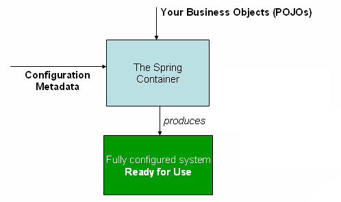

### 配置元数据

元数据表示应用程序的开发人员告诉Spring容器怎样去实例化、配置和装备你应用中的对象。

元数据的配置有三种形式：

-   基于XML配置：之前比较主流的配置方式

-   基于注解配置：在Spring2.5中有过介绍支持基于注解的配置元数据
-   基于Java配置：从Spring3.0开始，由Spring JavaConfig提供的许多功能已经成为Spring框架中的核心部分。这样你可以使用Java程序而不是XML文件定义外部应用程序中的bean类。使用这些新功能，可以查看 `@Configuration` 、`@Bean` 、 `@Import` 和 `@DependsOn` 这些注解

Spring配置由必须容器管理的一个或通常多个定义好的bean组成。基于XML配置的元数据中，这些bean通过标签定义在顶级标签内部。在Java配置中通常在使用`@Configuration`注解的类中使用`@Bean`注解方法。

**基于XML配置元数据代码示例：**

```xml
<?xml version="1.0" encoding="UTF-8"?>
<beans xmlns="http://www.springframework.org/schema/beans"
       xmlns:xsi="http://www.w3.org/2001/XMLSchema-instance"
       xsi:schemaLocation="http://www.springframework.org/schema/beans
                           http://www.springframework.org/schema/beans/spring-beans.xsd">
    <bean id="..." class="...">
        <!-- 在这里写 bean 的配置和相关引用 -->
    </bean>
    <bean id="..." class="...">
        <!-- 在这里写 bean 的配置和相关引用 -->
    </bean>
    <!-- 在这里配置更多的bean -->
</beans>
```

#### property赋值

使用bean的子标签 `<property>` 标签进行赋值

```xml
<bean id="p1" class="com.superNova.pojo.Person">
    <property name="id" value="1"/>
    <property name="name" value="zhangsan"/>
    <property name="cardId" value="10086"/>
    <property name="phone" value="1233334456"/>
</bean>
```

说明：

-   不写明的property属性则不进行赋值操作
-   name属性不能为空

#### 构造器赋值

使用bean的子标签 `<constructor-arg>` 标签进行赋值

```xml
<bean id="p4" class="com.superNova.pojo.Person">
    <!-- 使用name，指定形参 -->
    <constructor-arg name="id" value="4"/>
    <constructor-arg name="name" value="zhaoliu"/>
    <constructor-arg name="cardId" value="888"/>
    <constructor-arg name="phone" value="166666666"/>
</bean>
或
<bean id="p6" class="com.superNova.pojo.Person">
    <!-- 使用index 索引 -->
    <constructor-arg index="0" value="6"/>
    <constructor-arg index="1" value="qianqi"/>
    <constructor-arg index="2" value="112335"/>
    <constructor-arg index="3" value="12345678910"/>
</bean>
```

说明：

-   name属性表示构造器的形参，且要求与形参列表一一对应，缺一不可。
-   name属性可以省略，省略则使用索引赋值，从0开始

#### 给对象属性赋值

方法一：在 `<property>` 子标签中嵌套一个 bean标签

```xml
<bean id="p7" class="com.superNova.pojo.Person">
    <property name="id" value="6"/>
    <property name="name" value="laoba"/>
    <property name="phone" value="123332123"/>
    <property name="cardId" value="173"/>
    <property name="car">
        <!-- 嵌套Bean -->
        <bean class="com.superNova.pojo.Car">
            <property name="carName" value="QQ"/>
        </bean>
    </property>
</bean>
```

方法二：使用 `<property>` 子标签的 ref属性（reference）引用已声明的bean

```xml
<bean id="p7" class="com.superNova.pojo.Person">
    <property name="id" value="6"/>
    <property name="name" value="laoba"/>
    <property name="phone" value="123332123"/>
    <property name="cardId" value="173"/>
    <!-- 使用ref引用已声明的bean -->
    <property name="car" ref="myCar"/>
</bean>
```

#### 给对象的List类型属性赋值

使用 `<property>` 子标签内的子标签 `<list>` 即可

```xml
<bean id="p8" class="com.superNova.pojo.Person">
    <property name="id" value="6"/>
    <property name="name" value="list赋值"/>
    <property name="phone" value="123332123"/>
    <property name="cardId" value="173"/>
    <property name="label">
        <!-- List普通类型赋值 -->
        <list>
            <value>大神</value>
            <value>钢枪之王</value>
            <value>xiaocainiao</value>
        </list>
    </property>
</bean>

<bean id="p9" class="com.superNova.pojo.Person">
    <property name="id" value="6"/>
    <property name="name" value="list赋值"/>
    <property name="phone" value="123332123"/>
    <property name="cardId" value="173"/>
    <property name="pets">
        <!-- List对象类型赋值：套娃即可 -->
        <list>
            <bean class="com.superNova.pojo.Pet">
                <property name="petName" value="koko"/>
                <property name="petKind" value="dog"/>
            </bean>
            <bean class="com.superNova.pojo.Pet">
                <property name="petName" value="呸啾"/>
                <property name="petKind" value="mouse"/>
            </bean>
        </list>
    </property>
</bean>
```

#### 给对象的Map类型属性赋值

使用 `<property>` 子标签内的子标签 `<map>` 即可

```xml
<bean class="com.superNova.pojo.Person" id="p11">
    <property name="id" value="11"/>
    <property name="name" value="Map赋值"/>
    <property name="phone" value="222222"/>
    <property name="cardId" value="173"/>
    <property name="keys">
        <map>
            <entry key="key1" value="老家钥匙"/>
            <entry key="key2" value="出租屋钥匙"/>
            <entry key="key3" value="外滩屋子钥匙"/>
            <entry key="key4" value="海景房钥匙"/>
        </map>
    </property>
</bean>
```

#### 给对象的Properties类型属性赋值

使用 `<property>` 子标签内的子标签 `<props>` 即可

```xml
<bean class="com.superNova.pojo.Person" id="p12">
    <property name="id" value="12"/>
    <property name="name" value="Properties赋值"/>
    <property name="phone" value="22223322"/>
    <property name="cardId" value="1723"/>
    <property name="properties">
        <props>
            <prop key="username">root</prop>
            <prop key="password">root</prop>
            <prop key="url">jdbc:mysql://localhost:3306/test</prop>
        </props>
    </property>
</bean>
```

#### 给对象的Properties类型属性赋值

使用 `.` 来指定属性对象的属性即可，需要先有该对象

```xml
<!-- 级联属性赋值：得先有级联的对象实例 -->
<bean class="com.superNova.pojo.Person" id="p13">
    <property name="id" value="13"/>
    <property name="name" value="级联属性赋值"/>
    <property name="phone" value="12346456"/>
    <property name="cardId" value="2313"/>
    <property name="car">
        <!-- 得先创建Car对象 -->
        <bean class="com.superNova.pojo.Car"/>
    </property>
    <!-- 级联赋值，使用 "." -->
    <property name="car.carName" value="宾利"/>
</bean>
```

#### 使用Util命名空间

util名称空间可以定义一些公共的外部的集合。供容器去直接获取，或者是引用赋值。

xsi:schemaLocation 中指定util命名空间：

```xml
http://www.springframework.org/schema/util 
https://www.springframework.org/schema/util/spring-util.xsd
```

使用 `<util:XXX` 来指定util的具体类型

```xml
<!-- util命名空间，可以创建map等 -->
<util:list id="petList">

    <bean class="com.superNova.pojo.Pet">
        <property name="petName" value="小黑"/>
        <property name="petKind" value="cat"/>
    </bean>

    <bean class="com.superNova.pojo.Pet">
        <property name="petName" value="呸啾"/>
        <property name="petKind" value="仓鼠"/>
    </bean>
</util:list>

<!-- 调用 uitl 命名空间赋值 -->
<bean class="com.superNova.pojo.Person" id="p14">
    <property name="id" value="14"/>
    <property name="pets" ref="petList"/>
</bean>
```

#### 使用工厂创建Bean对象

##### 静态工厂：

可以通过调用工厂静态方法，可以直接获取对象：

```java
public static Person createPersonStatic() {
    return new Person(22, "静态工厂创建对象", 123331, "1122332211");
}
```

spring.xml 配置：需要制定类名与工厂的创建方法

```xml
<!-- 静态工厂创建对象 -->
<bean class="com.superNova.facotry.PersonFactory" id="p15" factory-method="createPersonStatic"/>
```

##### 实例工厂对象：

需要先实例化工厂，再调用工厂的创建方法：

```java
public Person createPersonInstance() {
    return new Person(33, "实例工厂创建对象", 1231231, "123123131");
}
```

spring.xml 配置：需要先注入工厂类，然后指定该工厂类与工厂的创建方法

```
<!-- 实例工厂创建对象 -->
<bean class="com.superNova.facotry.PersonFactory" id="instanceFactory"/>
<bean id="p16" factory-bean="instanceFactory" factory-method="createPersonInstance"/>
```

##### 实现FactoryBean接口的工厂：

FactoryBean是Spring提供的一个专门用于实现工厂的接口，需要实现以下两个接口：

-   getObject 方法用于实现工厂的创建方法
-   getObjectType 方法用于返回工厂创建的对象的类型

```java
public class CarFactoryBean implements FactoryBean<Car> {
    
    @Override
    public Car getObject() throws Exception {
        return new Car("96");
    }
    
    @Override
    public Class<?> getObjectType() {
        return Car.class;
    }
    
}
```

spring.xml 配置：只需要指定class即可

```xml
<!-- 继承FactoryBean创建工厂 -->
<bean id="p17" class="com.superNova.facotry.CarFactoryBean"/>
```

#### Bean的属性

##### parent属性abstract属性

parent属性用于指定该bean的超类bean，继承超类bean的属性，可以重写超类bean的属性。abstract方法则使该Bean只能用于继承，无法从ioc容器中拿出

```xml
<bean id="p18" abstract="false" class="com.superNova.pojo.Person">
    <property name="id" value="18"/>
    <property name="name" value="我是你父亲"/>
    <property name="cardId" value="1231243"/>
    <property name="phone" value="18888888888"/>
</bean>
<bean id="p19" parent="p18">
    <property name="id" value="19"/>
    <property name="name" value="我是你的儿"/>
</bean>
```

##### depends-on 属性

用于规定该bean初始化的前一个bean。正常情况下，bean的初始化顺序是在spring配置文件中书写的顺序，而depends-on可以更改初始化顺序。

```xml
<bean id="p20" class="com.superNova.pojo.Person" depends-on="p21">
    <property name="id" value="20"/>
</bean>
<bean id="p21" class="com.superNova.pojo.Person">
    <property name="id" value="21"/>
</bean>
<bean id="p22" class="com.superNova.pojo.Person" depends-on="p20">
    <property name="id" value="22"/>
</bean>
```

从ioc中直接获取p22的结果为，初始化顺序： p21 ==> p20 ==> p22

##### scope属性

scope属性用于指定该实例在ioc容器内的作用范围

singleton：单例模式，在spring应用启动的时候创建实例，在spring应用停止的时候销毁实例

prototype：原型模式（多实例），通过ioc容器获取的时候创建实例，然后就撒手不管（不由spring控制了）。每次获取就会创建一个实例。

```xml
<bean id="p23" class="com.superNova.pojo.Person" scope="prototype | singleton">
    <property name="id" value="23"/>
    <property name="name" value="Leo"/>
</bean>
```

##### autowire属性

autowire属性表示自动给子对象赋值

-   no 和 default 都分别表示，需要手动赋值子对象才有值

-   byName 表示按照属性的名做为id到Spring容器中去查找对象并赋值

    例如：private Car car；把car做为id到Spring中找，相当于 applicationContext.getBean("car")

    -   找到就直接赋值
    -   找不到就不赋值（或值为null）

-   byType 表示按照属性的类型到Spring容器中去查找对象，并赋值

    例如：private Car car；把Car做为 类型 到Spring中找，相当于 applicationContext.getBean(Car.class);

    -   找到一个就直接赋值
    -   找不到就不赋值（或值为null）
    -   找到多个就报错

-   constructor 表示按照构造器方法参数到Spring容器中查找并赋值

    例如：public Person(Car car)；先按构造器参数的类型到Spring容器中查找

    -   找到一个就直接赋值
    -   如果找到多个，接着按参数名做为id在Spring容器中继续查找并将赋值
    -   如果找不到，就不赋值

```xml
<bean id="car11" class="com.superNova.pojo.Car">
    <property name="carName" value="坦克车"/>
</bean>
<bean id="car" class="com.superNova.pojo.Car">
    <property name="carName" value="步兵战车"/>
</bean>

<bean id="p24" class="com.superNova.pojo.Person" autowire="byName">
    <property name="id" value="24"/>
    <property name="name" value="车的主人"/>
    <property name="cardId" value="1231243"/>
</bean>
```

### Bean的后置处理器 BeanPostProcessor

BeanPostProcessor是Bean的后置处理器。它可以在Bean对象初始化前后做一些工作。

BeanPostProcessor后置处理器使用步骤：

1.  编写一个类去实现接口BeanPostProcessor，并实现两个方法
2.  到Spring容器中去配置这个对象

**实现 BeanPostProcessor 接口**

```java
public class MyPostProsesser implements BeanPostProcessor {
    
    /**
     * 在Bean对象初始化之前调用
     * @param bean     传入的Bean对象，可判断类型
     * @param beanName 传入的bean的id或name
     */
    @Override
    public Object postProcessBeforeInitialization(Object bean, String beanName) throws BeansException {
        System.out.println("传入Bean的类型为：" + bean.getClass() + "\t 名称为：" + beanName);
        if (bean instanceof Person) {
            Person p = (Person) bean;
            p.setCar(new Car("路虎"));
            return p;
        }
        return bean;
    }
    
    /**
     * 在Bean对象初始化之后调用
     * @param bean     传入的Bean对象，可判断类型
     * @param beanName 传入的bean的id或name
     */
    @Override
    public Object postProcessAfterInitialization(Object bean, String beanName) throws BeansException {
        System.out.println("传入Bean的类型为：" + bean.getClass() + "\t 名称为：" + beanName);
        if (bean instanceof Person) {
            Person p = (Person) bean;
            p.setName("有钱人：" + p.getName());
            return p;
        }
        return bean;
    }
    
}
```

**配置这个对象**

```xml
<!-- 测试beanPostProcessor -->
<bean class="com.superNova.processer.MyPostProsesser"/>
<bean id="p26" class="com.superNova.pojo.Person">
    <property name="id" value="26"/>
    <property name="name" value="张三"/>
    <property name="cardId" value="1231243"/>
</bean>
```

### Bean完整的生命周期

对于单例的bean，生命周期有11个步骤： 

1.  instantiate bean对象实例化，bean对象实例化，是在加载配置文件的时候实例的。即，我们启动spring容器的时候，加载配置文件，此时就实例化bean了。 
2.  populate properties 封装属性 
3.  如果Bean实现BeanNameAware， 执行 setBeanName 
4.  如果Bean实现BeanFactoryAware 或者 ApplicationContextAware，设置工厂 setBeanFactory 或者上下文对象 setApplicationContext 
5.  如果存在类实现 BeanPostProcessor（后处理Bean） ，执行postProcessBeforeInitialization（此点常常用来增强bean） 
6.  如果Bean实现InitializingBean 执行 afterPropertiesSet 
7.  调用 `<bean init-method="init">` 指定初始化方法 init 
8.  如果存在类实现 BeanPostProcessor（后处理Bean） ，执行postProcessAfterInitialization（此点常常用来增强bean） 
9.  执行业务处理 
10.  如果Bean实现 DisposableBean 执行 destroy 
11.  调用 `<bean destroy-method="customerDestroy">` 指定销毁方法

### 使用Spring接管数据库连接池

可以使用Spring代替MyBatis的配置文件，来配置数据库的连接池。只需要将数据库的数据源在Spring.xml中配置即可。

**直接配置**

直接在Spring配置文件中写入数据库的配置信息

```xml
<bean id="dataSource" class="com.alibaba.druid.pool.DruidDataSource">
    <property name="username" value="root"/>
    <property name="password" value="root"/>
    <property name="url" value="jdbc:mysql://localhost:3306/test"/>
    <property name="driverClassName" value="com.mysql.jdbc.Driver"/>
</bean>
```

**占位符配置**

可以通过 `<context:property-placeholder>` 标签的 location 属性指定需要加载的 properties 文件，然后在spring配置文件中使用占位符 `${XXX}` 来读取配置文件中对应的key-value

Spring配置：

```xml
<!-- 指定配置文件位置 -->
<context:property-placeholder location="classpath:dbConfig.properties"/>

<!-- 使用占位符读取配置文件的信息 -->
<bean id="dataSource" class="com.alibaba.druid.pool.DruidDataSource">
    <property name="username" value="${db_username}"/>
    <property name="password" value="${db_password}"/>
    <property name="url" value="${db_url}"/>
    <property name="driverClassName" value="${db_driverClassName}"/>
    <property name="initialSize" value="${db_initialSize}"/>
    <property name="maxActive" value="${db_maxActive}"/>
    <property name="maxWait" value="${db_maxWait}"/>
</bean>
```

数据库的 proerties 文件

```properties
# 账号
db_username=root
# 密码
db_password=root
# 数据库Url，开启了批量操作，指定字符集，编码以及时区
db_url=jdbc:mysql://localhost:3306/test?rewriteBatchedStatements=true&amp;useUnicode=true&amp;characterEncoding=utf8&amp;serverTimezone=Asia/Shanghai
# 驱动类，mysql8之前
db_driverClassName=com.mysql.jdbc.Driver
# 驱动类，mysql8之后
#db.driverClass=com.mysql.cj.jdbc.Driver

# 初始连接数
db_initialSize=5
# 最大连接数
db_maxActive=10
# 最大等待时间(毫秒)
db_maxWait=3000
```

>   注意：数据库账号不可用username，这是由于spring加载的时候预加载了username，该值为当前计算机的用户名（如 Adminstrator ）。

### IOC 注解

**Spring中配置Bean的常用注解**

|注解|说明|
|-|-|
|@Controller         |         配置Controller组件。web层的组件|
|@Service                 |    配置Service组件。|
|@Repository       |          配置Dao|
|@Component          |      除Dao，Web，Service层的组件，就使用Component注解|
|@Scope              |        配置Bean对象的作用域。（单例和多例）|

以上注解中，除了@Scope注解，其余注解功能上完全一致，都是将该类添加到ioc容器中，相当于：

```xml
<bean id="类名" class="全类名"></bean>
```

其不同之处只有注解名称，旨在告诉开发人员这个类的作用，是一个Controller或是一个Service。

>   注意：在加入了SpringMVC之后，Controller就有了前端处理器的功能，不再是单纯加入到IOC容器中了。

说明：

-   如果没有指定名称，则使用**当前类名首字母小写**作为该bean的id
-   组件需要被扫描到才能生效

**代码示例**

Controller

```java
@Controller("bookController")
public class BookController {
    @Autowired
    BookService bookService;
}
```

Service

```java
@Service
public class BookService {
    @Autowired
    BookDao bookDao;
}
```

Dao

```java
@Component
public class BookDao {
    // 一些访问数据库的操作
}
```

### 配置包扫描

-   注解配置需要配合包扫描来使用，只有被扫描到的注解才能加入IOC容器中。

-   包扫描在Spring的配置文件中使用 `<context:component-scan>` 标签的 base-package 属性来指定包的位置。

代码示例：

```xml
<context:component-scan base-package="com"></context:component-scan>
```

这相当于扫描com包下的所有内容（包括子包）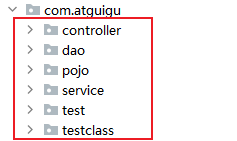

**过滤规则（排除或包含）**

-   `<context:exclude-filter>` 设置排除规则

    ```xml
    <!-- 测试排除过滤 -->
    <context:component-scan base-package="com">
        <!--
       context:exclude-filter 表示排除过滤
          - type表示排除过滤的规则
          - expression表示排除过滤的表达式
        -->
        <!-- 排除标有 @Controller 注解的类 -->
        <context:exclude-filter type="annotation" expression="org.springframework.stereotype.Controller"/>
    
        <!-- 排除A类 -->
        <context:exclude-filter type="assignable" expression="com.atguigu.testclass.A"/>
    </context:component-scan>
    ```

-   `<context:include-filter>` 设置包含规则（需要配合 `use-default-filters="false"` 属性，禁用过滤规则，默认为true）

    ```xml
    <!-- 禁用默认规则 -->
    <context:component-scan base-package="com" use-default-filters="false">
        <!-- 包含标注有 @Controller 注解的类 -->
        <context:include-filter type="annotation" expression="org.springframework.stereotype.Controller"/>
    
        <!-- 包含B 与 C 类  -->
        <context:include-filter type="assignable" expression="com.atguigu.testclass.B"/>
        <context:include-filter type="assignable" expression="com.atguigu.testclass.C"/>
    
    </context:component-scan>
    ```

    >   过滤规则：自动探测标注了 @Component、@Respository、@Service与@Controller  的类

**type属性 ==> expression属性参考**

| 类别       | 示例                      | 说明                                                         |
| ---------- | ------------------------- | ------------------------------------------------------------ |
|annotation |com.atguigu.XxxAnnotation |过滤所有标注了XxxAnnotation的类。这个规则根据目标组件是否标注了指定类型的注解进行过滤 |
|assignable |com.atguigu.BaseXxx       |过滤所有BaseXxx类的子类。这个规则根据目标组件是否是指定类型的子类的方式进行过滤。 |
|aspectj    |com.atguigu.*Service+     |所有类名是以Service结束的，或这样的类的子类。这个规则根据AspectJ表达式进行过滤。 |
|regex      |com\.atguigu\.anno\.*     |所有com.atguigu.anno包下的类。这个规则根据正则表达式匹配到的类名进行过滤。 |
|custom     |com.atguigu.XxxTypeFilter |使用XxxTypeFilter类通过编码的方式自定义过滤规则。该类必须实现org.springframework.core.type.filter.TypeFilter接口 |

### @Autowired 注解

自动装配: Spring自动为组件的属性赋值，该值的来源是Spring的IOC容器。

使用位置：方法、成员变量、构造器、

```java
public class TestClass {
    
    @Autowired
    TestDao testDao;
    
    
    @Autowired
    @Qualifier("testDao222")
    TestDao testDao2;
    
    @Test
    public void testAutowired() {
        System.out.println(testDao);
    }
    
}
```

**@Qualifier注解**：限定查找的名称。如果使用了该注解，则在类型匹配的情况下，只会查找匹配的元素，若找不到，则直接抛出异常。

**@Autowired原理**

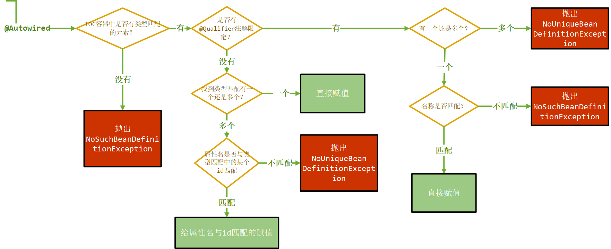

>   如果不希望找不到的情况下报错，则设置 @Autowired(required=“false”) ，spring在找不到的情况下不做任何操作（即null）。

**@Resource 与 @Autowired 的区别**

-   都可以实现自动装配
-   @Autowired: 最强大,是Spring自己的注解
-   @Resource: j2ee 是java的标准,但由于@Resource是Java标准,扩展性比@Autowired强


## AOP 面向切面编程

-   AOP：Aspect Oriented Programming，面向切面编程

-   OOP：Object Oriented Programming，面向对象编程


面向切面编程：基于OOP的基础之上的新的编程思想，指在程序运行期间，将某段代码动态地切入到指定方法的知道哪个位置进行运行的编程方式。

### 面向切面编程的方式

1.  jdk动态代理
2.  cglib动态代理
3.  Spring切面表达式

#### 1、jdk动态代理

-   优点：这种方式已经解决我们前面所有日记需要的问题。非常的灵活。而且可以方便的在后期进行维护和升级。
-   缺点：当然使用jdk动态代理，需要有接口。如果没有接口。就无法使用jdk动态代理。

```java
public class LogProxy {

    @Test
    public void test() {
        CalculatorImpl calculator = new CalculatorImpl();
        Calculator proxy = (Calculator) Proxy.newProxyInstance(
            calculator.getClass().getClassLoader(),
            calculator.getClass().getInterfaces(),
            new LogHandler(calculator)
        );
        int add = proxy.add(1, 2, 3, 4, 5);
        System.out.println("add = " + add);

    }

    public static Object createProxy(Object obj) {
        Object proxy = Proxy.newProxyInstance(
            obj.getClass().getClassLoader(),
            obj.getClass().getInterfaces(),
            new LogHandler(obj)
        );
        return proxy;
    }

    private static class LogHandler implements InvocationHandler {

        Object proxyObj = null;

        public LogHandler() {
        }

        public LogHandler(Object proxy) {
            this.proxyObj = proxy;
        }

        @Override
        public Object invoke(Object proxy, Method method, Object[] args) throws Throwable {

            // 运行之前打印日志
            LogUtils.logBeforeStart(method.getName(), args);
            try {
                int result = (int) method.invoke(proxyObj, args);

                // 返回之前打印日志
                LogUtils.logBeforeReturn(method.getName(), args);
                return result;
            } catch (Exception e) {
                e.printStackTrace();

                // 抛出异常之前打印日志
                LogUtils.logBeforeThrow(method.getName(), args);
                throw new RuntimeException();
            }
        }

    }

}
```

#### 2、cglib动态代理

cglib会根据给定的目标类，拷贝修改类的字节码对象。从而生成一个代理对象类。再创建出来实例。cglib代理所创建出来的代理对象是目标对象的子类。

-   优点：在没有接口的情况下，同样可以实现代理的效果。
-   缺点：同样需要自己编码实现代理全部过程。

#### 3、Spring 切面表达式（推荐）

Spring提供的面向切面编程的方式，即为AOP编程，切面表达式编程。

代理对象：

-   有接口：使用Jdk动态代理实现。
-   没有接口：使用Cglib生成子对象，代理实现。

### Spring AOP 术语

-   通知(Advice)：通知就是增强的代码。比如前置增强的代码、后置增强的代码、异常增强代码等。
-   切面类(Aspect)：切面就是包含有通知代码的类叫切面（也可称为切面类）。
-   横切关注点：可以添加增强代码的位置。比如前置位置，后置位置，异常位置。和返回值位置。
-   目标(Target)：被代理的对象。
-   代理(Proxy)：为了拦截目标对象方法，而被创建出来的那个对象，就叫做代理对象，用于嵌入横切关注点对应的通知方法（代码）
-   连接点(Joinpoint)：连接点指的是横切关注点和程序代码的连接，叫连接点。（可以进行增强的代码位置）
-   切入点(pointcut)：切入点指的是用户真正处理的连接点，叫切入点。（真正进行增强的代码位置）。在Spring中切入点通过org.springframework.aop.Pointcut 接口进行描述，它使用类和方法作为连接点的查询条件。

**示意图**

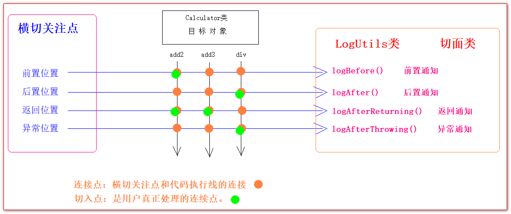

### AOP 的 HelloWorld

1.  将**切面类**与**目标类**加入IOC容器，由Spring接管（标注 `@component` 注解，并扫描之）

2.  在**切面类**上标注 `@Aspect` 注解，以表明该类为切面类

3.  在Spring配置文件中开启支持 AOP 编程注解：

    ```xml
    <aop:aspectj-autoproxy proxy-target-class="true"></aop:aspectj-autoproxy>
    ```

4.  在切面类中，标注通知方法，指定切入点表达式，返回值等。

    ```java
    @Component
    @Aspect
    public class LogUtil {
    
        @Before(value = "execution(public int com.atguigu.aop.target.CalculatorImpl.*(..))")
        public static <T> void logBefore(JoinPoint joinPoint) {
            System.out.println("前置通知：@Before --> logBefore");
        }
    
        @After(value = "execution(public int com.atguigu.aop.target.CalculatorImpl.*(..))")
        public static <T> void logAfter() {
            System.out.println("后置通知：@After --> logAfter");
        }
    
        @AfterReturning(value = "execution(public int com.atguigu.aop.target.CalculatorImpl.*(..))")
        public static <T> void logAfterReturn() {
            System.out.println("返回通知：@AfterReturning --> logAfterReturn");
        }
    
        @AfterThrowing(value = "execution(public int com.atguigu.aop.target.CalculatorImpl.*(..))")
        public static <T> void logAfterThrow() {
            System.out.println("异常通知：@AfterThrowing --> logAfterThrow");
        }
    
    }
    
    ```

### 通知方法与横切关注点

#### 前置通知 @Before

在目标方法之前调用，如下：

```java
@Before(value = "execution(public int com.atguigu.aop.target.CalculatorImpl.*(..))")
public static <T> void logBefore(JoinPoint joinPoint) {
    System.out.println("前置通知：@Before --> logBefore");
}
```

#### 后置通知 @After

在目标方法结束之后调用，如下：

```java
@After(value = "execution(public int com.atguigu.aop.target.CalculatorImpl.*(..))")
public static <T> void logAfter() {
    System.out.println("后置通知：@After --> logAfter");
}
```

#### 返回通知 @AfterReturning

在方法正常返回之后调用，可以使用 `returning = "result" + 返回值形参` 的方式获取方法返回值，如下：

```java
@AfterReturning(value = "execution(public int com.atguigu.aop.target.CalculatorImpl.*(..))", returning = "result")
public static <T> void logAfterReturn(Object result) {
    System.out.println("返回通知：@AfterReturning --> logAfterReturn");
    System.out.println("返回值为：" + result);
}
```

>   注意：returning属性值要与形参列表的参数名一致

#### 异常通知 @AfterThrowing

在目标方法抛出异常之后调用，可以使用 `throwing = "e" + 异常形参` 的方式获取方法异常对象，如下：

```java
@AfterThrowing(value = "execution(public int com.atguigu.aop.target.CalculatorImpl.*(..))", throwing = "e")
public static <T> void logAfterThrow(Exception e) {
    System.out.println("异常通知：@AfterThrowing --> logAfterThrow");
    System.out.println("异常为：" + e);
}
```

>   注意：throwing属性值要与形参列表的参数名一致

#### 环绕通知 @Around

抽取可重用的切入点表达式

-   环绕通知是所有通知类型中功能最为强大的，能够全面地控制连接点，甚至可以控制是否执行连接点。
-   对于环绕通知来说，连接点的参数类型必须传入 `ProceedingJoinPoint` 。它是 JoinPoint的子接口，允许控制何时执行，是否执行连接点。
-   在环绕通知中需要明确调用 `ProceedingJoinPoint` 的 `proceed()` 方法来执行被代理的方法。如果忘记这样做就会导致通知被执行了，但目标方法没有被执行。
-   注意：环绕通知的方法需要返回目标方法执行之后的结果，即调用 `joinPoint.proceed();` 的返回值，否则会出现空指针异常。

-   在环绕通知中。如果拦截异常。一定要往外抛。否则其他的异常通知是无法捕获到异常的。

代码示例：

```java
@Around(value = "execution(public int com.atguigu.pojo.Calculator.*(int,int))")
public static Object around(ProceedingJoinPoint proceedingJoinPoint) {
    Object result = null;

    try {
        try {
            System.out.println(" 环绕 前置 ");
            // 执行目标方法
            result = proceedingJoinPoint.proceed();
        } finally {
            System.out.println(" 环绕 后置 ");
        }

        System.out.println(" 环绕 返回 ");

        return result;
    } catch (Throwable throwable) {
        throwable.printStackTrace();
        System.out.println(" 环绕 异常 ");
        throw  new RuntimeException(throwable);
    }
}
```

>   注意：环绕方法之影响当前切面类的方法

#### 执行顺序

##### 单切面

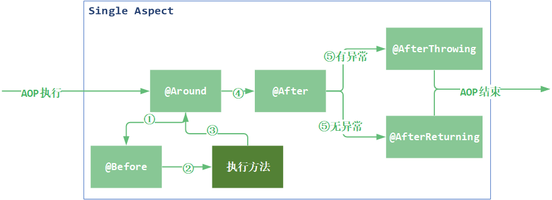

##### 多切面

流程图：

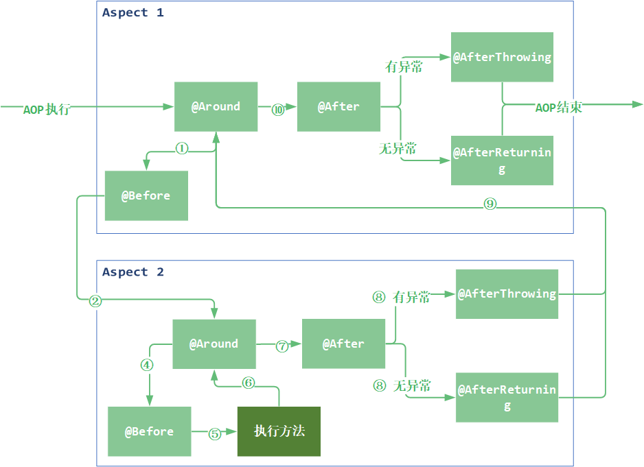

示意图：

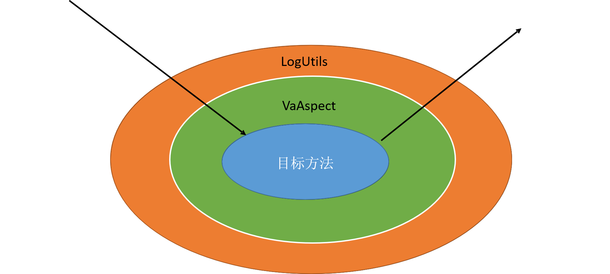

>   以上方法若没有环绕通知 @Around，则顺序为： @Before --> 目标方法 --> @After

**切面顺序**

默认情况下根据字母名称排序，可以使用 `@Order(1|2|3...)` 注解指定

### 切入点表达式

语法格式：

```bash
execution([权限修饰符] [返回值类型] [简单类名/全类名].[方法名]([参数列表]))
```

占位符： `*` 与 `..` 说明

| 表达式 | execution(*  com.atguigu.spring.ArithmeticCalculator.*(..))  |
| ------ | ------------------------------------------------------------ |
| 含义   | `*` 代表任意单个占位符，可以表示修饰符，返回值，单个包，单个方法名，单个参数<br/>`..` 匹配任意数量、任意类型的占位符，可以表示任意多个包，任意多个参数。 |

连接操作符： `&&` 、 `||` 、 `!` 

| 表达式 | execution  (* *.add(int,..)) **\|\|**  execution(* *.sub(int,..)) |
| ------ | ------------------------------------------------------------ |
| 含义   | 任意类中第一个参数为int类型的add方法或sub方法                |

>   若目标类、接口与该切面类在同一个包中可以省略包名。

模糊匹配：

| 表达式 | execution(* *(..))                         |
| ------ | ------------------------------------------ |
| 含义   | 表示任意返回值，任意方法全限定符，任意参数 |

| 表达式 | execution(* *.*(..))                          |
| ------ | --------------------------------------------- |
| 含义   | 表示任意返回值，任意包名+任意方法名，任意参数 |

精确匹配：

| 表达式 | execution(public boolean com.sl4study.service.UserService.addUser(User user)) |
| ------ | ------------------------------------------------------------ |
| 含义   | 访问权限必须是public <br/>返回值类型必须为boolean<br/>方法全限定名必须为com.sl4study.service.UserService.addUser<br/>参数必须为User类型 |

#### 复用切入点表达式 @Pointcut

使用@Pointcut可以服用切入点表达式，具体做法如下：

1.  定义切入点表达式：定义空方法，在该方法上标注 `@Pointcut` 注解，并写 切入点表达式。那么该方法的名称即为该切入点表达式的引用。
2.  引用：在通知方法的注解中引用：`方法全限定名 + ()` 即可

**代码示例**

```java
public class LogAbstract {
	// 定义好了切入点表达式
    @Pointcut(value = "execution(public int com.atguigu.aop.target.CalculatorImpl.add(..))")
    public void logAdd(){}
}

@Component
@Aspect
public class LogUtil {

    // 在通知方法注解中因引用即可
    @Before(value = "com.atguigu.aop.Utils.LogAbstract.logAdd()")
    public static <T> void logBefore(JoinPoint joinPoint) {
        System.out.println("前置通知：@Before --> logBefore");
    }
}
```

>   同一个类中，方法的包名类名可以省略

### JoinPoint参数 获取切入点信息

JoinPoint对象记录了当且切入点增强对象的信息，任何一个增强方法都可以通过将第一个入参声明为JoinPoint访问到连接点上下文的信息。

**相关API**

| 方法名                   | 说明                             |
| ------------------------ | -------------------------------- |
| Object[] getArgs()       | 获取连接点方法运行时的入参列表； |
| Signature getSignature() | 获取连接点的方法签名对象；       |
| Object getTarget()       | 获取连接点所在的目标对象；       |
| Object getThis()         | 获取代理对象本身；               |

**代码示例**

```java
@After(value = "com.atguigu.aop.Utils.LogAbstract.logAdd()")
public static <T> void logAfter(JoinPoint joinPoint) {
    System.out.println("后置通知：@After --> logAfter");
	// joinPoint 的方法
    // 获取参数
    Object[] args = joinPoint.getArgs();
    System.out.println("joinPoint.getTarget().getClass() = " + joinPoint.getTarget().getClass());
    System.out.println("joinPoint.getThis().getClass() = " + joinPoint.getThis().getClass());

    // signature 的方法
    Signature signature = joinPoint.getSignature();
    System.out.println("signature.getDeclaringType() = " + signature.getDeclaringType());
    System.out.println("signature.getDeclaringTypeName() = " + signature.getDeclaringTypeName());
}
```

>   环绕通知（@Around）使用 `ProceedingJoinPoint` 形参来获取信息。

### XML配置AOP

详见如下：

```xml
<?xml version="1.0" encoding="UTF-8"?>
<beans xmlns="http://www.springframework.org/schema/beans"
       xmlns:xsi="http://www.w3.org/2001/XMLSchema-instance" xmlns:aop="http://www.springframework.org/schema/aop"
       xmlns:context="http://www.springframework.org/schema/context"
       xsi:schemaLocation="http://www.springframework.org/schema/beans http://www.springframework.org/schema/beans/spring-beans.xsd http://www.springframework.org/schema/aop https://www.springframework.org/schema/aop/spring-aop.xsd http://www.springframework.org/schema/context https://www.springframework.org/schema/context/spring-context.xsd">

    <context:component-scan base-package="com.atguigu"/>
    
    <!-- 将切面类加入IOC容器 -->
    <bean id="logAspect" class="com.atguigu.aspect.LogUtil"/>

    <!-- aop:config标签：使用XML配置AOP -->
    <aop:config>
        <!-- aop:pointcut 抽取切面表达式
                id：唯一标识符
                expression：切入点表达式
         -->
        <aop:pointcut id="logPointcut" expression="execution(* com.atguigu.target.CalculatorImpl.*(..))"/>
        <!-- aop:aspect 配置一个切面类
                ref属性：引用存在IOC中的切面类的bean
                order属性：指定切面顺序
         -->
        <aop:aspect ref="logAspect" order="1">
            <!--
                aop:brfore|after|after-returning|after-throwing 为指定切入点
                    pointcut属性：写切入点表达式
                    pointcut-ref属性：引用已有的切入点表达式
                    returing|throwing属性：指定返回值|抛出异常 的参数名称
            -->
            <aop:before method="logBefore" pointcut="execution(* com.atguigu.target.CalculatorImpl.*(..))"/>
            <aop:after method="logAfter" pointcut="execution(* com.atguigu.target.CalculatorImpl.*(..))"/>
            <aop:after-returning method="logAfterReturn" returning="result" pointcut-ref="logPointcut"/>
            <aop:after-throwing method="logAfterThrow" throwing="e" pointcut-ref="logPointcut"/>
            <aop:around method="logAround" pointcut-ref="logPointcut"/>
        </aop:aspect>
    </aop:config>

</beans>
```


## Spring 声明式事务

### Spring 事务简介

事务分为声明式和编程式两种：

**1、声明式事务**

声明式事务是指通过注解的形式对事务的各种特性进行控制和管理。它将事务管理代码从业务方法中分离出来，以声明的方式来实现事务管理。事务管理代码的固定模式作为一种横切关注点，可以通过AOP方法模块化，进而借助Spring AOP框架实现声明式事务管理。Spring在不同的事务管理API之上定义了一个抽象层，通过配置的方式使其生效，从而让应用程序开发人员不必了解事务管理*API的底层实现细节**，就可以使用Spring的事务管理机制。

**2、编码式（编程式）事务**

通过编码的方式实现事务的声明。编程式事务管理需要将事务管理代码**嵌入到业务方法中**来控制事务的提交和回滚。在使用编程的方式管理事务时，必须在每个事务操作中包含额外的事务管理代码。相对于**核心业务**而言，事务管理的代码显然属于**非核心业务**，如果多个模块都使用同样模式的代码进行事务管理，显然会造成较大程度的**代码冗余**。

Spring既支持编程式事务管理，也支持声明式的事务管理。

#### Spring 事务管理器

Spring的核心事务管理接口是 `PlatformTransactionManager` 。它为事务管理封装了一组独立于技术的方法。无论使用Spring的哪种事务管理策略(编程式或声明式)，事务管理器都是必须的。

PlatformTransactionManager 接口：

```java
public interface PlatformTransactionManager extends TransactionManager {

	// 获取链接 与 开启事务（设置手动提交）的抽象方法
    TransactionStatus getTransaction(@Nullable TransactionDefinition definition) throws TransactionException;

    // 提交的抽象方法
    void commit(TransactionStatus status) throws TransactionException;

    // 回滚的抽象方法
    void rollback(TransactionStatus status) throws TransactionException;

}
```

**事务管理器的主要实现**

1.  **DataSourceTransactionManager**：在应用程序中只需要处理一个数据源，而且通过JDBC存取。

2.  JtaTransactionManager：在JavaEE应用服务器上用JTA(Java Transaction API)进行事务管理

3.  HibernateTransactionManager：用Hibernate框架存取数据库

>   事务管理器可以以普通的 bean 的形式声明在 Spring IOC 容器中。

**DataSourceTransactionManager 与 编程式事务的对应关系图**

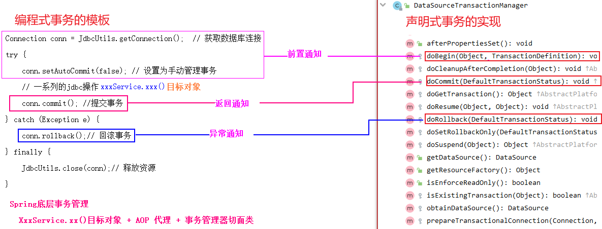

### @Transaction 注解配置事务

可以使用 `@Transaction` 注解开启事务，标注需要开启事务的方法或类（在类上，使用该类的所有方法都会开启事务），使用事务需要在配置文件中开启事务支持。`<tx:annotation-driven>`

环境准备：需要准备数据库连接配置。

#### 配置步骤

1、在IOC中加入事务管理器，一般使用 `DataSourceTransactionManager` ，Spring配置文件：

```xml
<!-- 配置事务管理器 -->
<bean id="tm" class="org.springframework.jdbc.datasource.DataSourceTransactionManager">
    <property name="dataSource" ref="dataSource"/>
</bean>
```

2、开启注解支持，Spring配置文件：

```xml
<!-- 设置开启事务注解驱动
        transaction-manager属性：指定事务管理器，引用上面配置的事务管理器的id即可。默认值为 transactionManager
-->
<tx:annotation-driven transaction-manager="tm"/>
```

3、在需要开启事务的方法上使用 `@Transaction` 注解

```java
@Service
public class AccountServiceImpl implements AccountService {
    
    @Autowired
    AccountDao accountDao;
    
    @Override
    
    // 在需要开启事务的方法上加上注解即可
    @Transactional
    public void transferAccount(Integer source, Integer target, BigDecimal amount) {
        // 减钱
        accountDao.subMoney(source, amount);
        
        // 模拟网络故障
        int a = 10 / 0;
        
        // 增钱
        accountDao.addMoney(target, amount);
    }
    
}
```

### @Transaction 属性

#### 1、isolution 事务隔离级别

可以设置事务隔离级别，有读未提交，读已提交，可重复读及序列化四个级别。一般用默认即可。

#### 2、rollback-for 与 no-rollback-for

默认情况下，tx 事务只捕获 RuntimeException 级别的异常。

-   使用 `no-rollback-for` 可以指定 RuntimeException 下的异常，哪些不被捕获。
-   使用 `rollback-for` 可以指定任意需要被捕获的异常。

#### 3、read-only 只读操作

在该事务没有增删改的情况下使用。Spring对只读操作有一定的优化。

#### 4、timeout 超时控制

可以使用 `timeout` 属性标注超时时间，若事务执行超时，则回滚，并抛出 `` 异常。

#### 5、propagation 事务传播属性

`propagation` 属性用于控制事务在调用另一个事务时的行为方式，当事务方法被另一个事务方法调用时，必须指定事务应该如何传播。例如: 方法可能继续在现有事务中运行，也可能开启一个新事务，并在自己的事务中运行。

事务的传播行为可以由传播属性指定。Spring定义了7种类传播行为(默认为REQUIRED)。

| 传播属性      | 描述                                                         |
| ------------- | ------------------------------------------------------------ |
| REQUIRED      | 如果有外层事务，则当前方法就在该事务内运行。                 |
| REQUIRED_NEW  | 为当前方法新建一个单独的事务，挂起外层事务                   |
| SUPPORTS      | 如果有外层事务在运行，当前方法就在这个事务内运行，否则它可以不运行在事务中。 |
| NOT_SUPPORTED | 当前方法不可运行在事务内，如果有外层事务，则将他挂起         |
| MANDATORY     | 必须运行在事物内部，如果没有正在外层事务，则抛出异常         |

常用的有 `REQUIRED` 与 `REQUIRED_NEW`

##### 外层事务与内层事务都是 REQUIRED

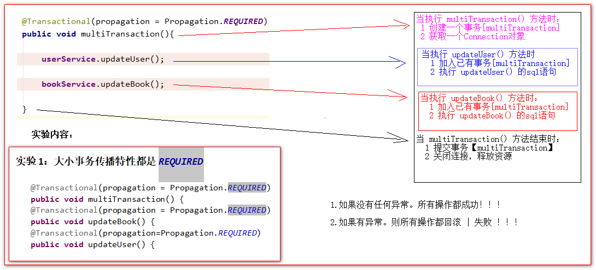

##### 外层事务与内层事务都是 REQUIRED_NEW

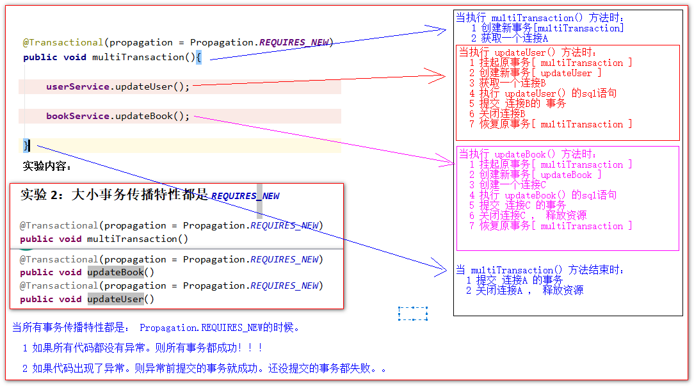

##### 外层事务是REQUIRED，内层事务有REQUIRED_NEW

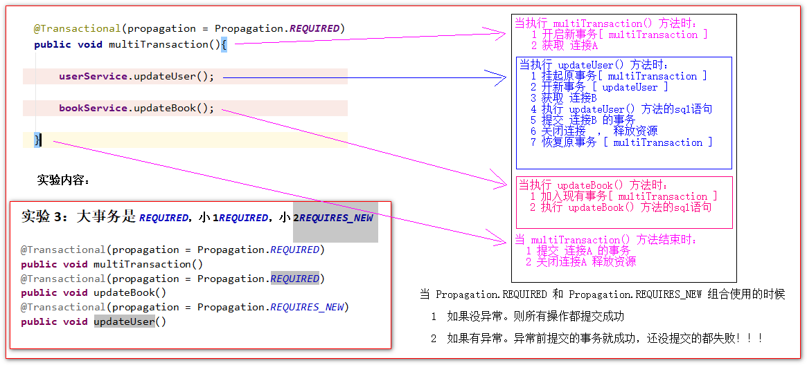

##### 总结：

REQUIRED是命运共同体；REQUIRED自己开一个新事务，建立新连接来搞。REQUIRED与外层事务同生共死，REQUIRED_NEW另起炉灶

### XML配置声明式事务

1、加入 事务管理器 到IOC容器

2、配置事务建议，精细化控制，具体到方法

3、配置AOP，配置切入点。然后将事务建议加入AOP即可。

```xml
<!-- 配置事务管理器（切面类） -->
<bean id="tm" class="org.springframework.jdbc.datasource.DataSourceTransactionManager">
    <property name="dataSource" ref="dataSource"/>
</bean>

<!--tx:advice：事务建议，用于配置事务切面类及相关属性。
        id：唯一标识
        transaction-manager：对指定事务管理器生效，默认值为 transactionManager
-->
<tx:advice id="myTx" transaction-manager="tm">
    <!-- 配置事务的属性，精细化控制，具体到方法 -->
    <tx:attributes>
        <!-- 精确匹配 -->
        <tx:method name="UpdateUser"/>
        <tx:method name="transferAccount" propagation="REQUIRED"/>

        <!-- 匹配以XXX开头的所有方法 -->
        <tx:method name="update*" propagation="REQUIRES_NEW"/>
        <tx:method name="delete*" propagation="REQUIRED"/>
        <tx:method name="insert" propagation="REQUIRES_NEW"/>

        <!-- 匹配剩下的所有元素 -->
        <tx:method name="*" read-only="true"/>

    </tx:attributes>
</tx:advice>

<!-- 配置切面类，指定事务建议 -->
<aop:config proxy-target-class="true">
    <aop:pointcut id="dataSourcePointcut" expression="execution(public * com..*Service*.*(..))"/>
    <!-- 指定事务建议（事务建议） -->
    <aop:advisor advice-ref="myTx" pointcut-ref="dataSourcePointcut"/>
</aop:config>
```

`tx:attributes` 属性的匹配优先规则：越精确，匹配优先级越高。


## SPEL 表达式

Spring Expression Language，Spring表达式语言，简称SpEL。支持运行时查询并可以操作对象图。

和JSP页面上的**EL**表达式、Struts2中用到的**OGNL**表达式一样，SpEL根据JavaBean风格的**getXxx()**、**setXxx()**方法定义的属性**访问对象图，**完全符合我们熟悉的操作习惯。

### 语法

SpEL使用 `#{ }` 作为定界符，所有在大框号中的字符都将被认为是SpEL表达式。

### 具体操作

#### 1、使用字面量

整数：`<property name="count" value="**#{5}**"/>`

小数：`<property name="frequency" value="**#{89.7}**"/>`

科学计数法：`<property name="capacity" value="**#{1e4}**"/>`

String类型的字面量可以使用单引号或者双引号作为字符串的定界符号

-   `<property name=“name” value="#{'Chuck'}"/>`
-   `<property name='name' value='#{"Chuck"}'/>`

Boolean：`<property name="enabled" value="**#{false}**"/>`

#### 2、引用其他bean（代替ref属性）

```xml
<bean id="dept"></bean>

<bean id=*"emp04"* class=*"com.atguigu.parent.bean.Employee"*>
    <property name="empId" value="1003"/>
    <property name="empName" value="Kate"/>
    <property name="age" value="21"/>
    <!-- 引用其他bean -->
    <property name="detp" value="#{dept}"/>
</bean>
```

#### 3、用其他bean的属性值作为自己某个属性的值

```xml
<bean id="car1" class="com.atguigu.pojo.Car">
    <!-- 被引用的属性值 -->
    <property name="carId" value="浙G12345"/>
    <property name="carName" value="路虎"/>
</bean>

<bean id="p1" class="com.atguigu.pojo.Person">
    <property name="id" value="#{12}"/>
    <!-- 引用其他bean 的属性值 -->
    <property name="name" value="#{car1.carId}"/>
</bean>
```

#### 4、调用非静态方法

调用非静态方法，可以传入参数（字符串用单双引号包裹）

语法格式：`对象.方法名称(参数)`

```java
public class Car {
    private String carId;
    private String carName;
    
    // Car类的非静态方法
    public String getCar(String car) {
        System.out.println("获取了" + car);
        return car;
    }
}
```

```xml
<bean id="p1" class="com.atguigu.pojo.Person">
    <property name="id" value="#{12}"/>
    <!-- 调用非静态方法 -->
    <property name="name" value="#{car1.getCar('路虎')}"/>
</bean>
```

#### 5、调用静态方法

语法格式：`T(方法全类名).静态方法(参数)`

```java
public class Car {
    private String carId;
    private String carName;

    // Car类的静态方法
    public static String getStaticCar(String car) {
        System.out.println("static 获取了" + car);
        return car;
    }
}
```

```xml
<bean id="p1" class="com.atguigu.pojo.Person">
    <property name="id" value="#{12}"/>
    <!-- 调用静态方法 -->
    <property name="name" value="#{T(com.atguigu.pojo.Car).getStaticCar('大众')}"/>
</bean>
```

#### 6、运算

可在spel表达式中进行运算，运算符如下

-   算术运算符：+、-、*、/、%、^

-   字符串连接：+

-   比较运算符：<、>、==、<=、>=、lt、gt、eq、le、ge

-   逻辑运算符：and, or, not, |

-   三目运算符：判断条件?判断结果为true时的取值:判断结果为false时的取值

-   正则表达式：matches


```xml
<bean id="p1" class="com.atguigu.pojo.Person">
    <property name="id" value="#{12}"/>
    <!-- 运算 -->
    <property name="salary" value="#{15*16}"/>
</bean>
```


## JdbcTemplate

Spring 提供了 JDBCTemplate 能快捷地操作数据库，JDBCTemplate 和 QueryRunner 类似。

使用前提：已经配置好了数据源。

**Spring配置：将JdbcTemplate加入IOC容器**

```xml
<!-- jdbcTemplate -->
<bean id="jdbcTemplate" class="org.springframework.jdbc.core.JdbcTemplate">
    <property name="dataSource"  ref="dataSource"/>
</bean>
```

##### 实验1更新操作：将id=5的记录的salary字段更新为1300.00

```java
@Test
public void test2() {
    String sql = "update employee set salary = ? where id = ?";
    /**
     * udpate()方法用于执行insert,delete,update的sql语句<br/>
     *  第一个参数是sql语句<br/>
     *  第二个参数是sql中占位符的参数值<br/>
     * 返回值是影响的行数
     */
    System.out.println(jdbcTemplate.update(sql, new BigDecimal("1300"), 5));

}
```

##### 实验2插入操作：批量插入

```java
public void test3() {
    String sql = "insert into employee(`name`,`salary`) values(?,?)";
    // 插入一条记录
    //        System.out.println(jdbcTemplate.update(sql, "天天爱国哥", new BigDecimal("100000")));

    List<Object[]> batchArgs = new ArrayList<>();
    batchArgs.add(new Object[]{"aaaa",new BigDecimal(10000)});
    batchArgs.add(new Object[]{"bbbb",new BigDecimal(20000)});
    batchArgs.add(new Object[]{"cccc",new BigDecimal(30000)});

    jdbcTemplate.batchUpdate(sql,batchArgs);
}
```

##### 实验3单个查询：查询id=5的数据库记录，封装为一个Java对象返回

```java
public void test4() {
    String sql = "select `id`,`name`,`salary` from employee where id = ?";
    /**
     * queryForObject()当查询回来的结果只有一行的时候，使用queryForObject();
     * 第一个参数是sql语句<br/>
     * 第二个参数是：RowMapper接口实现类，这个接口的实现类需要将查询回来的每一行记录转换为JavaBean对象 <br/>
     * 第三个参数是，sql语句占位符的参数值<br/>
     */
    Employee employee = jdbcTemplate.queryForObject(sql, new BeanPropertyRowMapper<Employee>(Employee.class), 5);

    System.out.println(employee);
}
```

##### 实验4条件查询：查询salary>4000的数据库记录，封装为List集合返回

```java
@Test
public void test5() {
    String sql = "select `id`,`name`,`salary` from employee where salary > ?";
    /**
     * JdbcTemplate工具类跟之前学习的DBUtils包中的QueryRunner相似<br/>
     * JdbcTemplate中
     *  update()用来执行inert,delete,update的sql语句<br/>
     *  queryForObject()查询一行数据<br/>
     *  query()查询多行数据<br/>
     *
     * QueryRunner中
     *  query()用来执行查询
     *         ResultSetHandler接口实现类决定查询回来的结果<br/>
     *              BeanHandler()查询一个对象<br/>
     *              BeanListHandler()查询多个对象<br/>
     *              ScalarHandler()查询一行一列的数据
     *  update()用来执行inert,delete,update的sql语句<br/>
     */
    /**
     * 当查询回来是多个JavaBean的时候，使用query()方法<br/>
     * 第一个参数是sql语句<br/>
     * 第二个参数是：RowMapper接口实现类，这个接口的实现类需要将查询回来的每一行记录转换为JavaBean对象 <br/>
     * 第三个参数是，sql语句占位符的参数值<br/>
     */
    List<Employee> query = jdbcTemplate.query(sql, new BeanPropertyRowMapper<Employee>(Employee.class), new BigDecimal("1400"));
    query.forEach(System.out::println);
}
```

##### 实验5特殊值查询：查询最大salary

```java
public void test6() {
    String sql = "select max(salary) from employee";
    /**
     * 第一个参数是sql语句，第二个参数是返回的数据类型
     */
    BigDecimal maxSalary = jdbcTemplate.queryForObject(sql, BigDecimal.class);

    System.out.println(maxSalary);
}
```

##### 实验6传入具名参数（map）：使用带有具名参数的SQL语句插入一条员工记录，并以Map形式传入参数值

```java
配置NamedParameterJdbcTemplate工具类：
 
<!--
    配置用于解析执行具名参数的sql语句的工具类
-->
<bean class="org.springframework.jdbc.core.namedparam.NamedParameterJdbcTemplate"
      id="namedParameterJdbcTemplate">
    <constructor-arg index="0" ref="dataSource" />
</bean>
```

测试的代码：

```java
//    实验7：使用带有具名参数的SQL语句插入一条员工记录，并以Map形式传入参数值
@Test
public void test7() {
    /**
* :name它是具名参数（命名参数）,它的语法格式是 ==>> :参数名 <br/>
* :xxx 同时也是占位符 <br/>
*/
    String sql = "insert into employee(`name`,`salary`) values(:name,:salary)";

    Map<String,Object> paramMap = new HashMap<>();
    /**
* map的key要和参数名一致
*/
    paramMap.put("name","0821，我爱你");
    paramMap.put("salary",new BigDecimal(10000));

    namedParameterJdbcTemplate.update(sql, paramMap);

}
```

##### 实验7传入具名参数（Pojo）：重复实验7，以SqlParameterSource形式传入参数值

```JAVA
@Test
public void test8() {
    /**
     * :name它是具名参数（命名参数）,它的语法格式是 ==>> :参数名 <br/>
     * :xxx 同时也是占位符 <br/>
     */
    String sql = "insert into employee(`name`,`salary`) values(:name,:salary)";

    Employee employee = new Employee(null,"国哥，我爱你，爱你，爱你",new BigDecimal(666666));

    namedParameterJdbcTemplate.update(sql, new BeanPropertySqlParameterSource(employee));

}
```

##### 实验8：创建Dao，自动装配JdbcTemplate对象

```JAVA
@Repository
public class EmployeeDao {

    @Autowired
    JdbcTemplate jdbcTemplate;

    public Employee queryEmployeeById(Integer id){
        String sql = "select `id`,`name`,`salary` from employee where id = ?";
        return jdbcTemplate.queryForObject(sql, new BeanPropertyRowMapper<Employee>(Employee.class), id);
    }

}
```

配置包扫描：

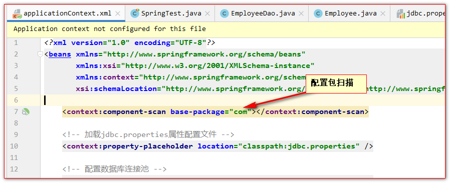

测试的代码：

```JAVA
@Autowired
EmployeeDao employeeDao;
//    实验9：创建Dao，自动装配 JdbcTemplate 对象
@Test
public void test9() {
    System.out.println(employeeDao.queryEmployeeById(1));
}
```

##### 实验9：通过继承JdbcDaoSupport创建JdbcTemplate的Dao

```JAVA
@Repository
public class EmployeeDao extends JdbcDaoSupport {

    //    @Autowired
    //    JdbcTemplate jdbcTemplate;

    @Autowired
    public void setJdbcTemplate2(JdbcTemplate jdbcTemplate){
        setJdbcTemplate(jdbcTemplate);
    }

    public Employee queryEmployeeById(Integer id){
        String sql = "select `id`,`name`,`salary` from employee where id = ?";
        return getJdbcTemplate().queryForObject(sql, new BeanPropertyRowMapper<Employee>(Employee.class), id);
    }

}
```
