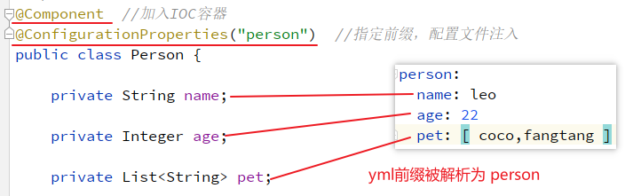
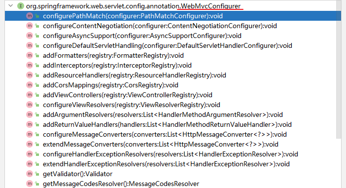

# SpringBoot

## SpringBoot 简介

SpringBoot 是对 Spring 的进一步封装，基于注解开发，舍弃了笨重的 XML,确实需要配置的使用 yml 或 properties 进行简要配置即可,即可完成 Spring 的自动配置。

每一个工程都可以打包成一个 jar 包，其中内置了 tomcat 或其它 servlet 容器，可以独立运行（无需部署 war 文件）,这是和微服务理念最为契合的一点。

每一个特定场景下的需求都封装成了一个 starter,只要导入这个 starter 就有了这个场景所需要的一切，其中包含针对这个场景的自动化配置、依赖信息。

可以通过 **starter** 引入各个特定功能所需的自动配置类和所需依赖；通过 **@EnableXXX** 注解启用某种功能；通过 **yml** 或 **properties** 文件进行配置。每一个 SpringBoot 程序都必须提供一个主启动类。


## SpringBoot 注解

大部分 SpringBoot 程序基于注解驱动，因此SpringBoot对注解功能进行了增强，新增了许多注解。

在此之前，可以引入**注释处理器**，用于增强注释的提示。

### @SpringBootApplication

SpringBoot的主启动类注解，表示这是SpringBoot程序的入口。

### @Configuration

标注在类上，表示该类为一个配置类（相当于Spring的XML配置）。其本身也是一个组件：

### @value：属性注入

基于 SpEL语法，可对指定属性进行注入。


>   支持SpEL语法："${XXX}"：取值；"#{XXX}"：计算/使用java语法

### @ConfigurationProperties：前缀注入

该注解通常搭配其 prefix 属性使用：`@ConfigurationProperties(prefix = "XXX")` ，用于将Springboot的配置文件按照前缀进行注入。前提：被Spring的IOC容器管理

常用用法有如下三种：

1.  在配置类中，需要配合 `@Bean` 注解，用于在加入IOC容器的组件进行前缀注入

    

2.  标注在组件的类上，为组件进行前缀注入，在使用时可以通过 @Autowired 注入配置文件中相应前缀的属性。

    

3.  被其他类导入也可以生效，常用于作为starter写法。

### @PropertySource 与 @ImportResource：配置导入

-   `@PropertySource`：加载指定的配置文件


-   `@ImportResource`：导入Spring的配置文件，让配置文件里面的内容生效；


### @Import：导入配置类

标注在spring组件上。给容器中通过无参构造器自动创建出导入类型的组件。可以给当前类导入其他配置类，将被导入的类注册到 IOC容器中。默认组件的名称为导入类的全类名。

被导入的类的条件有三个，选其中之一即可：

-   标注了 `@Configuration` 注解的类，且要被扫描到
-   ImportSelector 的实现类
-   ImportBeanDefinitionRegistrar 的实现类


>   注意：可以链式导入，但被导入的配置类链路上至少有一个标注了@Bean注解的方法。

### @EnableXXX：开启某项功能注解

可以通过 `@EnableXXX` 来开启某项功能，本质上是通过加载自动配置类中指定的组件名称，将指定组件加入到IOC容器中实现的。

### @Conditional：条件注解

必须是@Conditional指定的条件成立，才给容器中添加组件，配置配里面的所有内容才生效。可以标注在类与方法上。

|**@Conditional扩展注解**        | **作用（判断是否满足当前指定条件）**             |
|------------------------------- | ------------------------------------------------ |
|@ConditionalOnJava              | 系统的java版本是否符合要求                       |
|@ConditionalOnBean              | 容器中存在指定Bean；                             |
|@ConditionalOnMissingBean       | 容器中不存在指定Bean；                           |
|@ConditionalOnExpression        | 满足SpEL表达式指定                               |
|@ConditionalOnClass             | 系统中有指定的类                                 |
|@ConditionalOnMissingClass      | 系统中没有指定的类                               |
|@ConditionalOnSingleCandidate   | 容器中只有一个指定的Bean，或者这个Bean是首选Bean |
|@ConditionalOnProperty          | 系统中指定的属性是否有指定的值                   |
|@ConditionalOnResource          | 类路径下是否存在指定资源文件                     |
|@ConditionalOnWebApplication    | 当前是web环境                                    |
|@ConditionalOnNotWebApplication | 当前不是web环境                                  |
|@ConditionalOnJndi              | JNDI存在指定项                                   |


## SpringBoot 日志

SpingBoot在其核心Starter中自动继承了日志功能 `spring-boot-starter` ==> `spring-boot-starter-logging`。

日志的使用步骤：

1.  如果需要Debug，则先修改配置文件

    ```properties
    logging.level.com.atguigu=trace
    
    # 下面是额外配置
    # 指定日志文件。不指定路径在当前项目下生成springboot.log日志，
    logging.file=G:/springboot.log
    # 在当前磁盘的根路径下创建spring文件夹和里面的log文件夹；使用 spring.log 作为默认文件
    logging.path=/spring/log
    # 在控制台输出的日志的格式
    logging.pattern.console=%d{yyyy-MM-dd} [%thread] %-5level %logger{50} - %msg%n
    # 指定文件中日志输出的格式
    logging.pattern.file=%d{yyyy-MM-dd} === [%thread] === %-5level === %logger{50} ==== %msg%n
    ```

2.  创建日志记录器

    ```java
    //记录器
    Logger logger = LoggerFactory.getLogger(<主启动类字节码>);
    ```

3.  记录日志

    ```java
    @Test
    public void contextLoads() {
        //由低到高   trace<debug<info<warn<error
        //可以调整输出的日志级别；日志就只会在这个级别以以后的高级别生效
        logger.trace("这是trace日志...");
        logger.debug("这是debug日志...");
        //SpringBoot默认给我们使用的是info级别的，没有指定级别的就用SpringBoot默认规定的级别；root级别
        logger.info("这是info日志...");
        logger.warn("这是warn日志...");
        logger.error("这是error日志...");
    }
    ```

日志模板说明：
|符号|说明|
|-|-|
|%d|表示日期时间|
|%thread|表示线程名|
|%-5level|级别从左显示5个字符宽度|
|%logger{50}|表示logger名字最长50个字符，否则按照句点分割|
|%msg|日志消息|
|%n|是换行符|


## SpringBoot 配置

SpringBoot 有两种配置文件：即.properties 配置文件和.yml 配置文件,这两种配置文件都是用来修改 SpringBoot 的配置项。总体来说 SpringBoot 配置文件需要注意以下几点:

1.  文件保存位置是main/resources目录

2.  文件名是application.properties和application.yml

3.  如果这两种配置文件都存在，不同配置项在properties文件和yml文件都起作用,相同配置项以properties配置文件为准（2.4.0之前），但说实话，这么干挺无聊的。

4.  建议使用yml结尾的配置文件（层次清晰）

properties 配置文件直接使用连点配置即可

### yaml/yml配置

YAML 是专门用来写配置文件的语言，非常简洁、强大，性能要优于 xml 格式的配置文件，其设计目标是:方便人类读写,以数据为中心。它采用的是空格、换行等格式排版进行配置。

>   yml 最终还是会解析成 properties文件进行读取。

参考：https://en.wikipedia.org/wiki/YAML

#### 基本语法：


>   注意：
>
>   1.  大小写[属性和值]敏感
>   2.  使用空格缩进表示层级关系
>   3.  缩进时不允许使用Tab键，只允许使用空格。
>   4.  k: v表示一对键值对，v和:[冒号]必须有空格
>   5.  缩进的空格数目不重要，只要相同层级的元素左侧对齐即可
>   6.  #表示注释，从这个字符一直到行尾，都会被解析器忽略。

### YML 值类型

**字面量**：单个、不可再分的值，如：数字、字符串、布尔值（以0开头会被解析为 8进制）

```yml
port: 8082
context-path: /springboot
```

**对象、Map**：属性和值、key与value的本质就是键值对及键值对的集合。

```yml
# 常规写法
student:
  name: zhangsan
  age: 12
  gender: true
  
#行内写法（类似json）
student: { name: zhangsan,age: 12,gender: true }
```

**数组[List、Set]**：一组连词线 `-` 开头的行，构成一个数组

```yml
# 常规写法
animals:
  - cat
  - dog
  - fish
  
# 行内写法：
animals: [ cat,dog,fish ]

# 对象数组
student:
  - name: tom
    age: 18
    addr: beijing
  - name: lucy
    age: 17
    addr: tianjin
```

### profile 环境

SpringBoot的配置文件可以指定不同的环境，在yml与properties中分别由两套实现

#### properties实现

不同的开发环境使用 `application-<XXX>.properties` 的形式来标注，其中 `XXX` 为具体的开发环境。在 `application.properties` 中使用 `spring.profiles.active` 属性指定即可。

application.properties 中：

```
spring.profiles.active=[dev | prod | test]
```


#### yml实现

在同一个yml文件中单独空出一行，使用三个”短横刚“ `---` 来实现环境的分割，每个环境需要使用 `spring.config.activate.on-profile` 属性来指定自己的环境。示例如下：

```yaml
spring:
  profiles:
    active: test

---
spring:
  config:
    activate:
      on-profile: dev
server:
  port: 8081

---
spring:
  config:
    activate:
      on-profile: prod
server:
  port: 8082
---
spring:
  config:
    activate:
      on-profile: test
server:
  port: 8083
```

>   这里也可以切换 `application-XXX.properties` 的环境。

### 引入其他配置文件：

使用 `spring.profiles.include` 属性指定配置文件的缩写即可。

>   缩写举例：`application-dev.properties | application-dev.yml` 的缩写是 `dev`


## SpringBoot 扩展功能

### SpringBoot 整合 MyBatis

步骤如下：

1.  引入Maven依赖（额外的依赖）

    ```xml
    <!-- springboot与mybatis整合的starter -->
    <dependency>
        <groupId>org.mybatis.spring.boot</groupId>
        <artifactId>mybatis-spring-boot-starter</artifactId>
        <version>2.1.4</version>
    </dependency>
    <!-- springboot提供的jdbc的starter -->
    <dependency>
        <groupId>org.springframework.boot</groupId>
        <artifactId>spring-boot-starter-jdbc</artifactId>
    </dependency>
    <!-- 数据库连接驱动 -->
    <dependency>
        <groupId>mysql</groupId>
        <artifactId>mysql-connector-java</artifactId>
        <scope>runtime</scope>
    </dependency>
    ```

2.  编写Springboot配置文件（有关Mybatis部分）

    ```yaml
    spring:
      datasource:
      	# 配置数据库信息
        url: jdbc:mysql://192.168.72.132:3306/test?serverTimezone=Asia/Shanghai
        driver-class-name: com.mysql.cj.jdbc.Driver
        username: root
        password: root
    
    mybatis:
      # 配置映射文件扫描
      mapper-locations: classpath:Mapper/*.xml
    ```

3.  编写Mybatis接口及映射文件

    Mybatis接口

    ```java
    public interface BookDao {   
        List<Book> selectAllBooks();
    }
    ```

    Mapper映射文件（目录在resources下的Mapper中）

    ```xml
    <!DOCTYPE mapper
            PUBLIC "-//mybatis.org//DTD Mapper 3.0//EN"
            "http://mybatis.org/dtd/mybatis-3-mapper.dtd">
    
    <mapper namespace="com.atguigu.demo01.dao.BookDao">
    
        <resultMap type="com.atguigu.demo01.pojo.Book" id="bookMap">
            <id property="bookId" column="b_id"/>
            <result property="bookName" column="b_name"/>
            <result property="author" column="author"/>
            <result property="price" column="price"/>
        </resultMap>
    
        <select id="selectAllBooks" resultMap="bookMap">
            SELECT * FROM t_book
        </select>
    
    </mapper>
    ```

4.  将mybatis 接口加入IOC容器

    有两种方式：

    -   在配置类上加上注解扫描 @MapperScan

        ```java
        @SpringBootApplication
        @MapperScan(value = "com.atguigu.demo01.dao")
        public class Demo01SpringbootMybatisApplication {
        
            public static void main(String[] args) {
                SpringApplication.run(Demo01SpringbootMybatisApplication.class, args);
            }
        
        }
        ```

        >   主启动类也是配置类。

    -   在Mybatis接口上加上 @Mapper注解

        ```java
        @Mapper
        public interface BookDao {
           List<Book> selectAllBooks();
        }
        ```

### Spring 整合 Druid 连接池

在整合了Mybatis的基础上来整合Druid连接池。

有两种整合方式：

1.  引入SpringBoot 与 Duird整合的starter `druid-spring-boot-starter`。
2.  引入Druid基本的连接依赖 `druid` 。

#### 1、整合 Druid 的 Starter

步骤如下：

1.  引入  `druid-spring-boot-starter`

    ```xml
    <dependency>
        <groupId>com.alibaba</groupId>
        <artifactId>druid-spring-boot-starter</artifactId>
        <version>1.1.22</version>
    </dependency>
    ```

2.  SpringBoot配置文件指定Druid数据库连接池，并配置即可

    ```yaml
    spring:
      datasource:
        url: jdbc:mysql://192.168.72.132:3306/test?serverTimezone=Asia/Shanghai
        driver-class-name: com.mysql.cj.jdbc.Driver
        username: root
        password: root
        # 指定Druid数据库连接池
        type: com.alibaba.druid.pool.DruidDataSource
        # 配置Druid连接信息
        druid:
          max-active: 200
          max-wait: 5000
          initial-size: 50
    ```

#### 2、整合原生Druid连接池

步骤如下：

1.  引入 `druid` 原生依赖

    ```xml
    <dependency>
        <groupId>com.alibaba</groupId>
        <artifactId>druid</artifactId>
        <version>1.2.3</version>
    </dependency>
    ```

2.  SpringBoot配置文件指定使用Druid数据库及配置前缀注入内容，此处的前缀为 `spring.datasource`

    ```yaml
    spring:
      datasource:
        url: jdbc:mysql://192.168.72.132:3306/test?serverTimezone=Asia/Shanghai
        driver-class-name: com.mysql.cj.jdbc.Driver
        username: root
        password: root
        # 指定使用Druid连接池
        type: com.alibaba.druid.pool.DruidDataSource
        # Druid原生连接池的配置，需要使用配置类使用@ConfigurationProperties前缀注入
        maxWait: 5000
        maxActive: 200
        initialSize: 50
    ```

3.  编写配置类，将 `DruidDataSource` 加入IOC容器，并通过前缀属性注入（spring.datasource）配置其属性。

    ```java
    // 配置类的注解
    @Configuration
    public class DatasourceConfig {
    
        // 加入IOC容器
        @Bean
        // 前缀属性注入
        @ConfigurationProperties(prefix = "spring.datasource")
        public DruidDataSource druidDataSource() {
            return new DruidDataSource();
        }
    }
    ```

4.  测试及测试结果

    ```java
    @SpringBootTest
    class Demo01SpringbootMybatisApplicationTests {
        
        @Autowired
        BookDao bookDao;
        @Autowired
        DataSource dataSource;
    
        @Test
        void contextLoads() {
            List<Book> books = bookDao.selectAllBooks();
            books.forEach(System.out::println);
            System.out.println("dataSource: " + dataSource.getClass());
            if (dataSource instanceof DruidDataSource) {
                System.out.println("期望的最大线程数为[200]，实际的为[" + ((DruidDataSource) dataSource).getMaxActive() + "]");
            }
        }
    }
    
    /* 测试结果：
    Book{bookId=1, bookName='三体', author='大刘', price=39.90}
    Book{bookId=2, bookName='Java入门到精通', author='清华大学', price=59.90}
    Book{bookId=3, bookName='SpringBoot开发者的巅峰', author='小马哥', price=49.90}
    dataSource: class com.alibaba.druid.pool.DruidDataSource
    期望的最大线程数为[200]，实际的为[200]
    */
    ```

#### Druid 连接池网页监控

1.  在配置类中进行如下配置：

    ```java
    //1、配置一个管理后台的Servlet
    @Bean
    public ServletRegistrationBean statViewServlet() {
        ServletRegistrationBean bean = new ServletRegistrationBean(new StatViewServlet(),"/druid/*");
        Map<String, String> initParams = new HashMap<>();
        initParams.put("loginUsername", "admin");
        initParams.put("loginPassword", "123456");
        initParams.put("allow", "");// 默认就是允许所有访问
        initParams.put("deny", "192.168.15.21");
        bean.setInitParameters(initParams);
        return bean;
    }
    
    //2、配置一个web监控的filter
    @Bean
    public FilterRegistrationBean webStatFilter() {
        FilterRegistrationBean bean = new FilterRegistrationBean();
        bean.setFilter(new WebStatFilter());
        Map<String, String> initParams = new HashMap<>();
        initParams.put("exclusions", "*.js,*.css,/druid/*");
        bean.setInitParameters(initParams);
        bean.setUrlPatterns(Arrays.asList("/*"));
        return bean;
    }
    ```

2.  访问当前项目工程路径下的 `/druid/` 即可

    

### 拓展SpringMVC功能

在SpringBoot中，通过配置类（@Configuration）实现 `WebMvcConfigurer` 接口，即可拓展SpringMVC的功能。

```java
@Configuration
public class SpringMvcConfig implements WebMvcConfigurer {
	// 选择实现接口中的方法（该接口中的方法全都是默认实现）
}
```

`WebMvcConfigurer` 中可实现的方法：




>   注意：要求这个配置是为 WebMvcConfigurerAdapter 类型,且不能加 @EnableWebMvc 注解

#### 例1：SpringBoot 中实现中实现 mvc:mvc:view-controller 功能

实现 `addViewControllers` 方法即可。

```java
@Configuration
public class SpringMvcConfig implements WebMvcConfigurer {
    @Override
    public void addViewControllers(ViewControllerRegistry registry) {
        // 类似于返回视图 return "success";
        registry.addViewController("/testViewController").setViewName("/success");
        // 类似于返回 return "redirect:/XXX";
        registry.addRedirectViewController("/testRedirectController", "/success.html");
    }
}
```

#### 例2：实现拦截器功能

同SpringMVC一样，有两步：

1.  自定义拦截器，需要实现 `HandlerInterceptor` 接口

    ```java
    public class TestInterceptor implements HandlerInterceptor {
    
        @Override
        public boolean preHandle(HttpServletRequest request, HttpServletResponse response, Object handler) throws Exception {
            System.out.println("经过【preHandle】方法，资源路径为：" + request.getRequestURI());
            return true;
        }
    
        @Override
        public void postHandle(HttpServletRequest request, HttpServletResponse response, Object handler, ModelAndView modelAndView) throws Exception {
            System.out.println("经过【postHandle】方法，资源路径为：" + request.getRequestURI());
        }
    
        @Override
        public void afterCompletion(HttpServletRequest request, HttpServletResponse response, Object handler, Exception ex) throws Exception {
            System.out.println("经过【afterCompletion】方法，资源路径为：" + request.getRequestURI());
        }
    
    }
    ```

2.  在配置类中实现 `addInterceptors` 方法配置拦截器，及拦截路径等。

    ```java
    @Configuration
    public class SpringMvcConfig implements WebMvcConfigurer {
        @Override
        public void addInterceptors(InterceptorRegistry registry) {
            // 加入自定义拦截器
            registry.addInterceptor(new TestInterceptor())
                // 添加拦截路径
                .addPathPatterns("/testInterceptor")
                // 添加拦截路径数组
                .addPathPatterns(Arrays.asList("/testInterceptor2","/testInterceptor3"));
    
        }
    }
    ```

#### 配置三大组件：Filter、Listener、Servlet

简单的两个步骤：

1.  Filter或Servlet只需要在相应类上加上 `@Filter/@Servlet` 注解，并指定拦截的路径即可。而Listener只需要加上 `@Listener`  即可。注意都需要实现相应接口或继承相应类。
2.  在SpringBoot的配置类上标注 `@ServletComponentScan` 注解，并指定扫描的包即可。

### SpringBoot 整合 Redis

通过引入 Redis的starter可以整合Redis，使用的是 RedisTemplate来控制Redis，可以自动管理Redis连接池。

整合步骤如下：

1.  引入SpringBoot整合Redis 的Starter

    ```xml
    <dependency>
        <groupId>org.springframework.boot</groupId>
        <artifactId>spring-boot-starter-data-redis</artifactId>
    </dependency>
    ```

2.  在SpringBoot配置文件中配置Redis连接信息

    ```properties
    spring.redis.host='192.168.72.132'
    spring.redis.port=6379
    # spring.redis.password=root # 配置密码（如果有）
    ```

3.  注入RedisTemplate模板，使用即可（详细使用参考Redis笔记）

    ```java
    @SpringBootTest
    class Demo03SpringbootRedisApplicationTests {
       
       @Autowired
       RedisTemplate redisTemplate;
       
       @Autowired
       StringRedisTemplate stringRedisTemplate;
       
       @Test
       void contextLoads() {
          Set keys = stringRedisTemplate.keys("*");
          System.out.println(keys);
       }
       
    }
    ```

#### 全面接管SpringMVC

在配置类上配置 `@EnableWebMvc` 即可。

注意！！使用该注解会使SpringMVC 的自动配置失效

原因如下：


### SpringBoot 定时任务

SpringBoot的定时任务使用简单方便，使用步骤如下：

1.  引入依赖

    ```xml
    <dependency>
        <groupId>org.springframework.boot</groupId>
        <artifactId>spring-boot-starter-web</artifactId>
    </dependency>
    <dependency>
        <groupId>org.springframework</groupId>
        <artifactId>spring-context-support</artifactId>
    </dependency>
    ```

2.  在配置类上标注 `@EnableScheduling`

3.   在组件的方法上标注 `@Scheduled` 注解，并使用相应表达式来控制调度

    ```java
    @Component
    public class TestJob {
    
        @Scheduled(fixedDelay = 5000)
        public void test01(){
            System.out.println("定时任务被调用，现在的时间为："+new SimpleDateFormat("HH:mm:ss").format(new Date()));
        }
    }
    ```

`@Scheduled`参数说明：


-   cron：石英表达式。
-   fixedDelay：上次执行完后再次执行的间隔
-   fixedRate：上次执行后到再次执行的间隔
-   initialDelay：初始的延迟执行时间。
-   zone：根据时区信息来执行，留空即可。

### SpringBoot 整合整合 jpa

JPA简介：JPA是Java Persistence API的简称，描述对象－关系表的映射关系，并将运行期的实体对象持久化到数据库中。JPA的总体思想和现有Hibernate、TopLink、JDO等ORM框架大体一致。总的来说，JPA包括以下3方面的技术：

-   ORM映射元数据：JPA支持XML和JDK5.0注解两种元数据的形式，元数据描述对象和表之间的映射关系，框架据此将实体对象持久化到数据库表中；

-   API：用来操作实体对象，执行CRUD操作，框架在后台替代我们完成所有的事情，开发者从繁琐的JDBC和SQL代码中解脱出来。

-   查询语言：这是持久化操作中很重要的一个方面，通过面向对象而非面向数据库的查询语言查询数据，避免程序的SQL语句紧密耦合。

SpringBoot整合JPA步骤如下：

1.  引入JPA的Starter依赖

    ```xml
    <!-- springBoot JPA的起步依赖 -->
    <dependency>
        <groupId>org.springframework.boot</groupId>
        <artifactId>spring-boot-starter-data-jpa</artifactId>
    </dependency>
    <!-- MySQL连接驱动 -->
    <dependency>
        <groupId>mysql</groupId>
        <artifactId>mysql-connector-java</artifactId>
    </dependency>
    ```

2.  在SpringBoot配置文件中配置JPA连接数据库的配置

    ```yaml
    logging:
      level:
        com.atguigu: debug # 配置日志
        
    spring:
      datasource:
        username: root
        password: root
        url: jdbc:mysql://192.168.72.132:3306/test
        driver-class-name: com.mysql.cj.jdbc.Driver
        
    jpa:
      database: mysql
      show-sql: true
      generate-ddl: true
      hibernate:
        ddl-auto: update
        naming_strategy: org.hibernate.cfg.ImprovedNamingStrategy
        
    server:
      port: 18081
    ```

3.  定义映射实体类 （Pojo）

    ```java
    @Entity //标注该类为实体类，可以作Jpa映射
    @Table(name = "t_book") //映射到数据库具体表的名称
    public class Book {
    
    
        @Id //标注该属性为主键
        @GeneratedValue(strategy = GenerationType.IDENTITY) //标注该属性可自增，并指定自增策略
        @Column(name = "b_id")  //标注该属性在数据表对应的字段
        private Integer bookId;
    
        @Column(name = "b_name")
        private String bookName;
    
        @Column(name = "author")
        private String author;
    
        @Column(name = "price")
        private BigDecimal price;
    
        // get/set方法。。。
    }
    ```

4.  定义一个接口（Dao），继承 `JpaRepository` 

    ```java
    public interface BookDao extends JpaRepository<Book,Integer> { }
    ```

5.  使用JPA操作数据库：注入映射接口，直接执行单表操作即可。

    ```java
    @SpringBootTest
    class Demo05SpringbootJpaApplicationTests {
    
        @Autowired
        BookDao bookDao;
    
        @Test
        void contextLoads() {
            List<Book> all = bookDao.findAll();
            all.forEach(System.out::println);
        }
    
    }
    ```


## 自定义Starter

自定义starter步骤如下（以数据库为例）：

1.  定义数据库属性组件，可从配置文件读取

    ```java
    @Component
    @ConfigurationProperties(prefix = "spring.jdbc.datasource")
    public class DatasourceProperties {
    
        private String driverClassName;
    
        private String url;
    
        private String username;
    
        private String password;
    
        //get/set...
    }
    ```

2.  定义数据库配置类，激活数据库属性类。

    ```java
    @Configuration
    //@EnableConfigurationProperties(DatasourceProperties.class)
    @Import(DatasourceProperties.class)
    public class DatasourceConfig {
    
        @Autowired
        DatasourceProperties datasourceProperties;
    
        @Bean
        @ConditionalOnProperty(name = "spring.jdbc.datasource.type", havingValue = "druid")
        public DruidDataSource getDruidDataSource() {
            DruidDataSource dataSource = new DruidDataSource();
            dataSource.setUsername(datasourceProperties.getUsername());
            dataSource.setPassword(datasourceProperties.getPassword());
            dataSource.setUrl(datasourceProperties.getUrl());
            dataSource.setDriverClassName(datasourceProperties.getDriverClassName());
            return dataSource;
        }
    
        @Bean
        @ConditionalOnProperty(name = "spring.jdbc.datasource.type", havingValue = "hikari")
        public HikariDataSource getHikariDataSource() {
            HikariDataSource dataSource = new HikariDataSource();
            dataSource.setUsername(datasourceProperties.getUsername());
            dataSource.setPassword(datasourceProperties.getPassword());
            dataSource.setJdbcUrl(datasourceProperties.getUrl());
            dataSource.setDriverClassName(datasourceProperties.getDriverClassName());
            return dataSource;
        }
    
    }
    ```

3.  在 `resources/META-INF` 目录下创建 `spring.factories` 文件，写入自动配置信息

    ```properties
    org.springframework.boot.autoconfigure.EnableAutoConfiguration=com.atguigu.databases.config.DatasourceConfig
    ```

4.  安装该 starter，跳过test

使用自定义的starter步骤如下：

1.  引入自定义starter的依赖

    ```xml
    <dependency>
        <groupId>com.atguigu</groupId>
        <artifactId>mystarter-databases</artifactId>
        <version>0.0.1-SNAPSHOT</version>
    </dependency>
    ```

2.  编写springboot配置文件

    ```properties
    spring.jdbc.datasource.type=hikari
    spring.jdbc.datasource.driverClassName=com.mysql.cj.jdbc.Driver
    spring.jdbc.datasource.url=jdbc:mysql://192.168.72.132:3306/test?serverTimeZone=Asia/Shanghai
    spring.jdbc.datasource.username=root
    spring.jdbc.datasource.password=root
    ```

3.  测试自定义的starter

    ```java
    @SpringBootTest
    class Demo08SpringbootTestmystarterApplicationTests {
    
        @Autowired
        DataSource dataSource;
    
        @Autowired
        DatasourceProperties datasourceProperties;
    
        @Test
        void contextLoads() throws SQLException {
            System.out.println(datasourceProperties);
            System.out.println(dataSource.getClass());
            System.out.println(dataSource.getConnection());
        }
    
    }
    ```

说明：

1.  根据自动配置原理可知，在SpringBoot程序启动的时候，会从每一个 `META-INF` 目录下读取 `spring.factories` 文件，根据 `org.springframework.boot.autoconfigure.EnableAutoConfiguration` 来进行自动载入配置，因此需要将 `DatasourceConfig` 类加入到 `spring.factories` 中。

2.  在其他SpringBoot程序启动时，会给标注了 `@Component` 与 `@ConfigurationProperties` 的类自动加入IOC容器并赋值，赋值是根据前缀赋值的，因此可以在当前 SpringBoot的配置文件中配置。因此自定义的starter中的 `DatasourceProperties` 需要标注上述两个注解。
3.  当其他模块使用自定义starter时，一般情况下不会扫描到外部依赖的组件。因此需要使 `@Autowired` 注解生效，就得自行导入 数据库属性组件，使用`@EnableConfigurationProperties()` 或 `@Import()` 皆可。


## Thymeleaf 模板

### Thymeleaf 简介

Thymeleaf 官网：https://www.thymeleaf.org/

以前开发 web 项目时，只需将静态的 ".html” 页面后缀名修改为“.jsp”，然后在文件中加入 jsp 页面标识即可做 jsp 开发，然而 Spring Boot 项目采用打 jar 包的方式，默认使用的是内置的 Tomcat 服务器，所以默认是不支持 jsp 的，但可以使用其它的模板引擎。市面上主流的 Java 模板引擎有：JSP、Velocity、Freemarker、Thymeleaf 等。Spring Boot 官方推荐使用 “Thymeleaf”模板引擎

模板引擎原理图如下，模板引擎的作用都是将模板(页面)和数据进行整合然后输出显示，区别在于不同的模板使用不同的语法，如 JSP 的 JSTL 表达式，以及 JSP 自己的表达式和语法，同理 Thymeleaf 也有自己的语法。


### Thymeleaf 渲染规则

具体的 thymeleaf 配置类为 `org.springframework.boot.autoconfigure.thymeleaf.ThymeleafProperties`。

其中部分配置规则：

```java
@ConfigurationProperties(prefix = "spring.thymeleaf")
public class ThymeleafProperties {

    private static final Charset DEFAULT_ENCODING = StandardCharsets.UTF_8;

    public static final String DEFAULT_PREFIX = "classpath:/templates/";

    public static final String DEFAULT_SUFFIX = ".html";

    // 其他配置规则。。。源码中有详解
}
```

可以发现通过 `@ConfigurationProperties` 前缀注入了配置文件中的值，因此可以通过SpringBoot的配置文件来直接配置Thymeleaf的属性

此外，前缀后缀属性分别指定了 thymeleaf 的渲染位置：

-   前缀：DEFAULT_PREFIX = "classpath:/templates/";
-   后缀：DEFAULT_SUFFIX = ".html";

对应 resources 目录下的templates目录：

因此，返回Model的跳转Handler可以访问thymeleaf默认规定的、放在templates中的资源

```java
@Controller
public class TestController {

    @RequestMapping("/success")
    public String success() {
        return "thymeleafSuccess";
    }

}
```

>   SpringBoot 静态渲染规则：
>
>   可以在如下的四个位置，直接通过 **工程路径+uri** 即可访问资源：
>
>   ```java
>   { "classpath:/META-INF/resources/",  "classpath:/resources/", "classpath:/static/", "classpath:/public/" };
>   ```
>
>   具体在该类中指定：org.springframework.boot.autoconfigure.web.WebProperties.Resources
>
>   可以在SpringBoot 配置文件中通过 `spring.web.resources.static-locations` 属性覆盖修改。

### Thymeleaf 常用渲染语法

#### 1、th:text 标签体填充

基本语法：在html的标签中添加 `th:text` 属性，并使用`${ xxx }`来获取值（默认是请求域）

```html
<!-- 常规用法 -->
欢迎您：<span th:text="${user.name}">请登录</span>
```

字符串拼接：使用单引号`‘ ’`拼接 `${ xxx }` 或 双竖线语法`||`

```html
<!-- 字符串拼接：下面两种方式等价 -->
<span th:text="'欢迎您，' + ${user.name}"></span><br>
<!-- 简写方式：使用‘|’围起来 -->
<span th:text="|欢迎您，${user.name}|"></span>
```

智能数字计算：计算符号写在 `${ xxx }` 外面，可使用加减乘除与比较，三元运算

```html
<!-- 运算：运算符放在${}外 -->
10年后，我<span th:text="${user.age} + 10"></span>岁<br>
<!-- 比较：gt (>), lt (<), ge (>=), le (<=), not (!), eq (==), neq/ne (!=) -->
比较结果：<span th:text="${user.age} < ${user.friend.age}"></span><br>
<!-- 三元运算 -->
三元：<span th:text="${user.age}%2 == 0 ? '帅' : '不帅'"></span><br>
<!-- 默认值：注意`?:`之间没有空格 -->
默认值：<span th:text="${user.name} ?: '硅谷刘德华'"></span>
```

#### 2、th:object 解包

`th:object` 标签用于配合 `*{}` 使用，可以定义一个标签体内的解包操作，用于省去 `Xxx.` 前缀。

```html
<h2>
    <p th:text="${user.name}">Jack</p>
    <p th:text="${user.age}">21</p>
    <p th:text="${user.friend.name}">Rose</p>
</h2>
<!-- 等价于 -->
<h2 th:object="${user}">
    <p th:text="*{name}">Jack</p>
    <p th:text="*{age}">21</p>
    <p th:text="*{friend.name}">Rose</p>
</h2>
```

`*{}`可以取出 `th:object` 指定的元素

#### 3、th:each 循环遍历

`th:each` 可以遍历集合元素，可以为`Iterable`、`Enumeration`、`Iterator`、`Map`、`Array`，一般用法：

```html
<table>
    <tr th:each="user: ${users}">
        <td th:text="${user.name}"></td>
        <td th:text="${user.age}"></td>
    </tr>
</table>
```

可以通过第`二个元素 state` 来获取迭代状态，如索引，单双数等：

```html
<table>
    <tr th:each="user,state: ${users}">
        <td th:text="${stat.index + 1}"></td>
        <td th:text="${user.name}"></td>
        <td th:text="${user.age}"></td>
    </tr>
</table>
```

stat对象包含以下属性：

- index，从0开始的角标
- count，元素的个数，从1开始
- size，总元素个数
- current，当前遍历到的元素
- even/odd，返回是否为奇偶，boolean值
- first/last，返回是否为第一或最后，boolean值

#### 4、th:if 分支判断

如果 `th:if` 属性判断为true则渲染到页面，否则不渲染

认定为True的情况如下：

- 表达式值为true
- 表达式值为非0数值或者字符串
- 表达式值为字符串，但不是`"false"`,`"no"`,`"off"`
- 表达式不是布尔、数字、字符中的任何一种

>   其它情况包括null都被认定为false 

#### 5、th:switch 分支选择

这里要使用两个指令：`th:switch` 和 `th:case`，类似Java的switch case语句

```html
<div th:switch="${user.role}">
    <p th:case="'admin'">用户是管理员</p>
    <p th:case="'manager'">用户是经理</p>
    <p th:case="*">用户是别的玩意</p>
</div>
```

需要注意的是，一旦有一个th:case成立，其它的则不再判断。`th:case="*"`表示默认，放最后。

#### 6、th:href 动态链接

动态链接主要通过 `@` 来实现，有三种实现方式：

```html
<!-- 直接拼接字符串 -->
<a th:href="@{'http://api.gmall.com/pms/brand?pageNum=' + ${pageNum}}">点我带你飞</a><br>
<!-- 使用（）的形式定义参数 -->
<a th:href="@{http://api.gmall.com/pms/brand/{id}(id=${id})}">点我带你飞</a><br>
<!-- 使用（,,）的形式解析多个参数 -->
<a th:href="@{http://api.gmall.com/pms/brand(pageNum=${pageNum}, pageSize=${pageSize})}">起飞吧</a>
```

>   `th:src`和`th:href`用法一致。 

#### 7、th:action、th:value 表单

```html
<form th:action="@{/login}">
    <input type="hidden" th:value="${url}" name="redirect_url">
    用户名：<input type="text" name="username"><br />
    密码：<input type="password" name="password"><br />
    <input type="submit" value="登录"/>
</form>
```

-   th:action	表单提交路径
-   th:value	给表单元素绑定value值

#### 8、Thymeleaf 内置对象与内置方法

##### 内置对象

1. **ctx** ：上下文对象。
2. **vars** ：上下文变量。
3. **locale**：上下文的语言环境。
4. **request**：（仅在web上下文）的 HttpServletRequest 对象。
5. **response**：（仅在web上下文）的 HttpServletResponse 对象。
6. **session**：（仅在web上下文）的 HttpSession 对象。
7. **servletContext**：（仅在web上下文）的 ServletContext 对象

这里以常用的Session举例，用户登录成功后，会把用户信息放在Session中，Thymeleaf通过内置对象将值从session中获取。

```java
// java 代码将用户名放在session中
session.setAttribute("userinfo",username);
// Thymeleaf通过内置对象直接获取
th:text="${session.userinfo}"
```

##### 内置工具类

Thymeleaf中提供了一些内置工具类，并且在这些对象中提供了一些方法，方便我们来调用。获取这些对象，需要使用`#对象名`来引用。

**常用的内置方法：**

1. **strings**：字符串格式化方法，常用的Java方法它都有。比如：equals，equalsIgnoreCase，length，trim，toUpperCase，toLowerCase，indexOf，substring，replace，startsWith，endsWith，contains，containsIgnoreCase等

2. **numbers**：数值格式化方法，常用的方法有：formatDecimal等

3. **bools**：布尔方法，常用的方法有：isTrue，isFalse等

4. **arrays**：数组方法，常用的方法有：toArray，length，isEmpty，contains，containsAll等

5. **lists**，**sets**：集合方法，常用的方法有：toList，size，isEmpty，contains，containsAll，sort等

6. **maps**：对象方法，常用的方法有：size，isEmpty，containsKey，containsValue等

7. **dates**：日期方法，常用的方法有：format，year，month，hour，createNow等

用法：见名知意，类似于Java中的方法，但第一个参数通常是请求域中的对象

代码示例：在页面中处理客户端传入的时间及数字

```html
<h1 th:text="${#dates.format(today, 'yyyy-MM-dd')}"></h1>
<!-- 参数1是请求域中对象，参数2是指小数点前保留1位，参数3小数点后保留2位 -->
<h1 th:text="${#numbers.formatDecimal(user.age, 1, 2)}"></h1>
```

#### 6、js内联 th:inline

js内敛的作用：将thymeleaf 的内容交给js处理，在 `<script>`标签中使用 `th:inline=“javascript” `来委托实现

```html
<script th:inline="javascript">
    // 使用两层中括号实现+${}获取模板的值 [[${xxx}]]
    const user = [[${user}]];
    const users = [[${users}]];
    const age = [[${user.age}]];
    console.log(user);
    console.log(users);
    console.log(age)
</script>
```

#### 7、页面引用

使用 `th:fragment` 定义一个通用的html片段，使用 `th:insert`、`th:replace`、`th:include`来引入定义好的html片段

```html
<!-- 定义一个通用的fragment -->
<footer th:fragment="copy">
    <script type="text/javascript" th:src="@{/plugins/jquery/jquery-3.0.2.js}"></script>
</footer>

<!--templatename::selector：”::”前面是模板文件名，后面是选择器
	- selector：只写选择器，这里指fragment名称，则加载本页面对应的fragment
	- templatename：只写模板文件名，则加载整个页面
-->
<div th:insert="::copy"></div>
<div th:replace="::copy"></div>
<div th:include="::copy"></div>
```

解析后：

```html
<footer>
    <script type="text/javascript" src="/plugins/jquery/jquery-3.0.2.js"></script>
</footer>

<div>
    <footer>
        <script type="text/javascript" src="/plugins/jquery/jquery-3.0.2.js"></script>
    </footer>
</div>
<footer>
    <script type="text/javascript" src="/plugins/jquery/jquery-3.0.2.js"></script>
</footer>
<div>
    <script type="text/javascript" src="/plugins/jquery/jquery-3.0.2.js"></script>
</div>
```

#### 8、标签局部变量 th:with

可以在标签上定义局部变量，可以在局部变量所在标签体内使用，并覆盖页面变量。

```html
<div th:with="${aa=20}">
    <!-- 标签体内可以使用aa的值为20 -->
</div>
```

