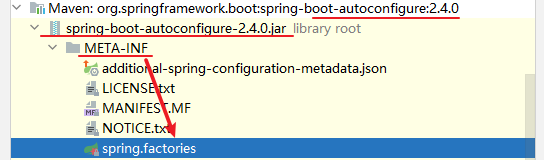
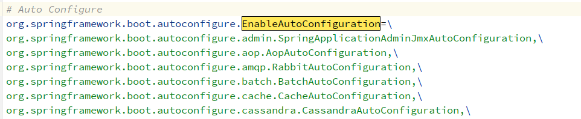

# SpringBoot 源码

记录一下源码配置。

## SpringBoot 自动配置

从 `@SpringBootApplication` 注解出发：

```java
@Target(ElementType.TYPE)
@Retention(RetentionPolicy.RUNTIME)
@Documented
@Inherited
@SpringBootConfiguration
@EnableAutoConfiguration
@ComponentScan(excludeFilters = { @Filter(type = FilterType.CUSTOM, classes = TypeExcludeFilter.class),
      @Filter(type = FilterType.CUSTOM, classes = AutoConfigurationExcludeFilter.class) })
public @interface SpringBootApplication {
    // code
}
```

Springboot的注解主要有以下三个：

-   @SpringBootConfiguration：Spring Boot的配置类。标注在某个类上，表示这是一个Spring Boot的配置类。

-   @EnableAutoConfiguration：自动配置注解，比较重要。下面展开讲

-   @ComponentScan：这里排除一些指定的类

进入 `@EnableAutoConfiguration` 中

```java
@AutoConfigurationPackage
@Import(AutoConfigurationImportSelector.class)
public @interface EnableAutoConfiguration {
```

可以发现有：

-   `@AutoConfigurationPackage`：配置包扫描，给容器中导入一个组件；导入的组件由AutoConfigurationPackages.Registrar.class；将主配置类（@SpringBootApplication标注的类）的所在包及下面所有子包里面的所有组件扫描到Spring容器；

-   `@Import(AutoConfigurationImportSelector.class)`：导入自动配置的配置类，下面展开讲。

进入 `AutoConfigurationImportSelector` 自动配置类：

进入 `selectImports` 方法，见名知意，选择导入的类。

```java
@Override
public String[] selectImports(AnnotationMetadata annotationMetadata) {
    if (!isEnabled(annotationMetadata)) {
        return NO_IMPORTS;
    }
    // 获取自动配置的信息键值对，进入他！
    AutoConfigurationEntry autoConfigurationEntry = getAutoConfigurationEntry(annotationMetadata);
    return StringUtils.toStringArray(autoConfigurationEntry.getConfigurations());
}
```

进入 `getAutoConfigurationEntry` 方法

```java
protected AutoConfigurationEntry getAutoConfigurationEntry(AnnotationMetadata annotationMetadata) {
    if (!isEnabled(annotationMetadata)) {
        return EMPTY_ENTRY;
    }
    AnnotationAttributes attributes = getAttributes(annotationMetadata);
    // 获取候选配置信息，进入他！
    List<String> configurations = getCandidateConfigurations(annotationMetadata, attributes);
    // 去重
    configurations = removeDuplicates(configurations);
    // 排除指定不需要的
    Set<String> exclusions = getExclusions(annotationMetadata, attributes);
    checkExcludedClasses(configurations, exclusions);
    configurations.removeAll(exclusions);
    configurations = getConfigurationClassFilter().filter(configurations);
    // 触发自动配置导入事件，让监听器去触发该事件
    fireAutoConfigurationImportEvents(configurations, exclusions);
    return new AutoConfigurationEntry(configurations, exclusions);
}
```

进入 `getCandidateConfigurations` 方法

```java
protected List<String> getCandidateConfigurations(AnnotationMetadata metadata, AnnotationAttributes attributes) {
    List<String> configurations = SpringFactoriesLoader.loadFactoryNames(getSpringFactoriesLoaderFactoryClass(), getBeanClassLoader());
    Assert.notEmpty(configurations, "No auto configuration classes found in META-INF/spring.factories. If you "
                    + "are using a custom packaging, make sure that file is correct.");
    return configurations;
}
```

从这里可以看到，自动配置的文件应该在 `META-INF/spring.factories` 中，也可以选择进入 `loadFactoryNames` 方法。

```java
public static List<String> loadFactoryNames(Class<?> factoryType, @Nullable ClassLoader classLoader) {
    ClassLoader classLoaderToUse = classLoader;
    if (classLoaderToUse == null) {
        classLoaderToUse = SpringFactoriesLoader.class.getClassLoader();
    }
    String factoryTypeName = factoryType.getName();
    // loadSpringFactories为具体的解析方法
    return loadSpringFactories(classLoaderToUse).getOrDefault(factoryTypeName, Collections.emptyList());
}
```

进入 `loadSpringFactories` 方法，具体的解析方法：

```java
private static Map<String, List<String>> loadSpringFactories(ClassLoader classLoader) {
    Map<String, List<String>> result = cache.get(classLoader);
    if (result != null) {
        return result;
    }

    result = new HashMap<>();
    try {
        // FACTORIES_RESOURCE_LOCATION 即为配置文件的位置
        // public static final String FACTORIES_RESOURCE_LOCATION = "META-INF/spring.factories";
        Enumeration<URL> urls = classLoader.getResources(FACTORIES_RESOURCE_LOCATION);
        while (urls.hasMoreElements()) {
            URL url = urls.nextElement();
            UrlResource resource = new UrlResource(url);
            Properties properties = PropertiesLoaderUtils.loadProperties(resource);
            for (Map.Entry<?, ?> entry : properties.entrySet()) {
                String factoryTypeName = ((String) entry.getKey()).trim();
                String[] factoryImplementationNames =
                    StringUtils.commaDelimitedListToStringArray((String) entry.getValue());
                for (String factoryImplementationName : factoryImplementationNames) {
                    result.computeIfAbsent(factoryTypeName, key -> new ArrayList<>())
                        .add(factoryImplementationName.trim());
                }
            }
        }

        // Replace all lists with unmodifiable lists containing unique elements
        result.replaceAll((factoryType, implementations) -> implementations.stream().distinct()
                          .collect(Collectors.collectingAndThen(Collectors.toList(), Collections::unmodifiableList)));
        cache.put(classLoader, result);
    }
    catch (IOException ex) {
        throw new IllegalArgumentException("Unable to load factories from location [" +
                                           FACTORIES_RESOURCE_LOCATION + "]", ex);
    }
    return result;
}
```

配置文件位置为：






## @Conditional 注解


## @ConfigurationProperties 注解


