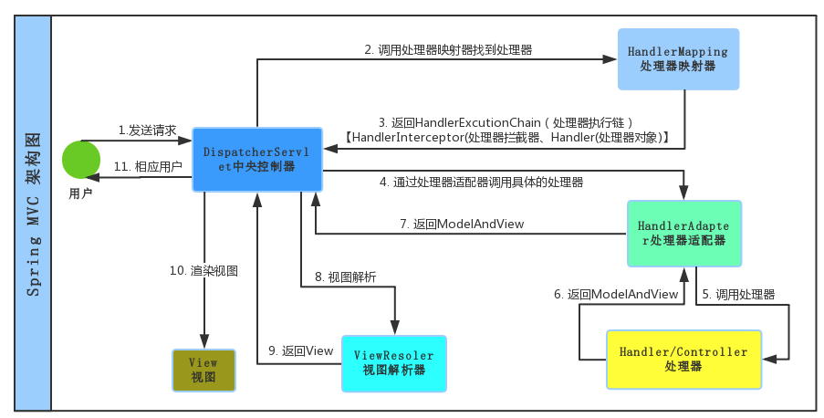
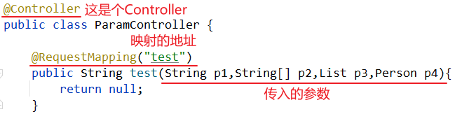
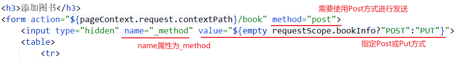
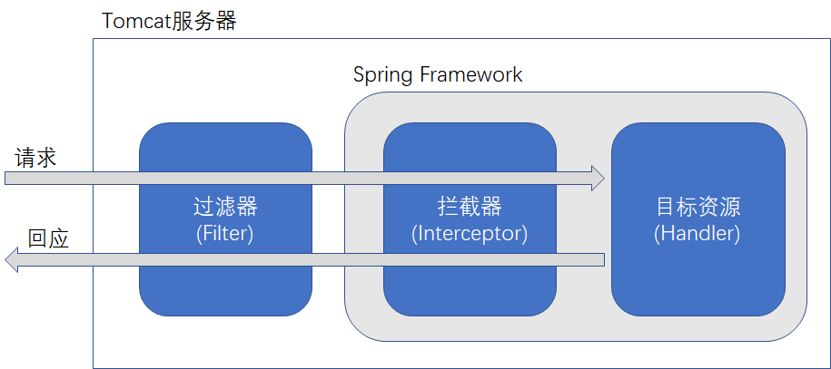

# SpringMVC 基础

## SpringMVC的简介

**Spring MVC**框架是一个开源的Java平台，为开发强大的基于JavaWeb应用程序提供全面的基础架构支持，并且使用起来非常简单容易。

**Spring web MVC**框架提供了MVC(模型 - 视图 - 控制器)架构，用于开发灵活和松散耦合的Web应用程序的组件。 **MVC**模式使应用程序的不同组件(输入逻辑，业务逻辑和UI逻辑)合理有效的分离，同时又有效的将各组件组合一起完成功能。

-   模型**(Model)**：封装了应用程序数据，通常它们将由POJO类组成。
-   视图**(View)**：负责渲染模型数据，一般来说它负责生成客户端浏览器可以解释HTML输出。
-   控制器**(Controller)**：负责处理用户请求并构建适当的模型，并将其传递给视图进行渲染。

#### DispatcherServlet：前端控制器

DispatcherServlet是SpringMVC的核心。主要用于接收SpringMVC程序中所有客户端发送过来的请求。然后再根据请求的路径（请求地址）再分发给不同的Controller控制器中的业务方法。将Controller中方法返回的结果，以及数据交给视图去渲染执行输出。

DispatcherServlet 请求为驱动 , 围绕一个中心Servlet分派请求及提供其他功能，DispatcherServlet是一个实际的Servlet (它继承自HttpServlet 基类)。

#### Handler：处理器

Handler 是继DispatcherServlet前端控制器的后端控制器，在DispatcherServlet的控制下Handler对具体的用户请求进行处理，由于Handler涉及到具体的用户业务请求，所以一般情况需要程序员根据业务需求开发Handler。打败话说就是每个@Controller。

#### View：视图

一般情况下需要通过页面标签或页面模版技术将模型数据通过页面展示给用户，需要由程序员根据业务需求开发具体的页面。我们最常用的视图就是jsp，html，thymeleaf等。

#### HandlerMapping：处理器映射器

HandlerMapping负责根据用户请求url找到Handler即处理器，springmvc提供了不同的映射器实现不同的映射方式，如配置文件方式，实现接口方式，注解方式等。
这玩意就是个map，放了一堆数据，key是url，value是你对应的处理器。一个请求来了，调用一下mao.get(url)就知道哪个类的哪个方法处理这个请求了。当然实际上会将这个url多对应的拦截器（马上学），处理器都拿到。

#### HandlAdapter：处理器适配器

通过HandlerAdapter对处理器进行执行，这是适配器模式的应用，通过扩展适配器可以对更多类型的处理器进行执行。它会调用相应的方法，生成最终能够的modelAndView。

#### ViewResolver：视图解析器

View Resolver负责将处理结果生成View视图，View Resolver首先根据逻辑视图名解析成物理视图名即具体的页面地址，再生成View视图对象，最后对View进行渲染将处理结果通过页面展示给用户。这货就是解析modelAndView的。有个常用最简单的功能就是拼接字符串，给你加个前缀后缀，让你方便了很多，当然他们解析很多类型的视图。

### 执行流程




## SpringMVC 单项配置文件

### 视图解析器

视图解析器用于解析 ModelAndView对象，ModelAndView对象包装了返回的信息，跳转的内容等。常用的视图解析器是 **InternalResourceViewResolver**。只需要将该类的实例加入IOC容器即可：

```xml
<bean class="org.springframework.web.servlet.view.InternalResourceViewResolver">
    <property name="prefix" value="/pages/"/>
    <property name="suffix" value=".jsp"/>
</bean>
```

没有视图解析器之前，我们在Controller中需要返回整完的跳转路径。有了视图解析器之后，我们只需要返回文件名即可，比如说，如果我返回 return "ok"；那么这个ok会跟视图解析器中的前缀，后缀做字符串拼接操作，得到最终的跳转路径。

**最终的跳转路径是： 前缀 + ok + 后缀**

得到结果是： `/WEB-INF/pages/ok.jsp`

### 编码过滤器

默认情况下，get请求可以自动转换编码，而Post请求默认不处理。Spring框架提供了转换编码的过滤器，名为 `CharacterEncodingFilter` 。在web.xml 中配置该过滤器即可自动转换编码。

用法：在mvc专属的Spring配置文件中加入如下注解：

```xml
<filter>
    <filter-name>CharacterEncodingFilter</filter-name>
    <filter-class>org.springframework.web.filter.CharacterEncodingFilter</filter-class>
    <init-param>
        <param-name>encoding</param-name>
        <param-value>UTF-8</param-value>
    </init-param>
    <init-param>
        <param-name>forceRequestEncoding</param-name>
        <param-value>true</param-value>
    </init-param>
    <init-param>
        <param-name>forceResponseEncoding</param-name>
        <param-value>true</param-value>
    </init-param>
</filter>
<filter-mapping>
    <filter-name>CharacterEncodingFilter</filter-name>
    <servlet-name>DispatcherServlet</servlet-name>
</filter-mapping>
```

### 静态资源与动态资源的放行

如果SpringMVC使用DispatcherServlet接管所有请求，默认情况下静态请求也会被拦截。这时就需要配置静态请求与动态注解的请求的放行。

用法：在mvc专属的Spring配置文件中加入如下注解：

```xml
<!-- 放行静态资源（使用静态资源默认Handler） -->
<mvc:default-servlet-handler/>

<!-- 添加动态资源 -->
<mvc:annotation-driven/>
```


## SpringMVC Handler注解

### @Controller

#### 使用方式

直接标注在类名上即可。表示当前类是一个 **Handler**。

```java
@Controller
public class ReturnController {
    // code...
}
```

>   在SpringMVC中，@Controller被赋予了不同于@Component、@Service注解的含义，标明该类是一个控制器类，而不是单单加入到IOC容器中那么简单。

### @RequestMapping

`@RequestMapping` 是给个方法配置它的访问地址。就比如web学习的Servlet程序，在web.xml中配置了访问地址之后，它们之间就有一个访问映射关系。

```java
// 没有视图解析器的部分：
@RequestMapping("/test1")
public String testReturnString() {
    System.out.println("测试返回String");
    return "/pages/ok.jsp";
}
```

**标注位置**

-   方法上：指定了该方法具体的访问映射地址
-   类名上：指定该类下所有映射要在此映射基础上进行。

**属性说明**

| 属性         | 说明                                                         |
| ------------ | ------------------------------------------------------------ |
| value / path | 配置 Controller 中的方法的访问地址。可以配置多个。           |
| method       | 限制请求的方式，如POST，GET，DELETE等，可以设置多个          |
| params       | 要求请求的参数匹配<br>params="username"     表示  请求地址必须带有username参数<br/>params="username=abc"  表示  请求参数中必须要有username，而且值还必须是abc <br/>params="username!=abc" 表示  1、请求参数中不能有username参数。2、有username参数，但值不能等于abc <br/>params="!username"    表示  请求地址不能带有username参数 |
| headers      | 要求请求头匹配，规则同 params                                |
|              |                                                              |

### @ResponseBody


### @RequestBody


### HttpMessageConverter 原理


## 处理器（Handler）接收参数

数据接收可以通过Controller下的映射注解标注的方法中的参数列表来传入。



直接传入方法的参数，有如下几个步骤：

1.  先从隐含模型（Model、ModelMap）中查找是否有参数。
2.  如果没有，则直接调用其空参构造器创建对象并传入。

隐含模型查找规则：

-   如果没有指定：先获取参数类名，然后根据**类名首字母小写**去隐含模型中查找
-   可以使用 `@ModelAttribute(“XXX”)` 标注在形参上指定。

### 接收原生API

可以接收 `HttpSession`、`HttpServletRequest`、`HttpServletResponse` 等原生API，用法与Servlet中形参列表的原生API的用法一致 。

```java
@RequestMapping("/test1")
public String param1(HttpSession httpSession, HttpServletRequest request, HttpServletResponse response) {
    System.out.println("request = " + request);
    System.out.println("response = " + response);
    System.out.println("httpSession = " + httpSession);
    return "ok";
}
```

### 接收普通类型参数

根据**参数的名称**接收客户端传过来的参数值，要求客户端的参数名与形参列表的参数名一一对应。

```java
// 客户端参数：username=leonardo&password=123456

@RequestMapping("/test2")
public String param2(String username, Integer password) {
    System.out.println("username = " + username);
    System.out.println("password = " + password);
    return "ok";
}
```

### 接收普通类型数组

根据参数名称接收客户端的参数值，可以数组接收（接收List需要配合@RequestParam），要求客户端的参数名与形参列表的参数名一一对应。

```java
// 客户端参数：weapon=ak47&weapon=m4a1&weapon=deagle

@RequestMapping("/test3")
/* 不用@RequestParam指定的话，只能接收数组类型，不能接收list类型 */
public String param3(String[] weapon) {
    System.out.println(weapon);
    return "ok";
}
```

### @RequestParam 接收请求参数

使用 `@RequestParam` 可以指定接收的客户端参数，并给被标注的方法参数赋值，普通类型，数组类型，集合类型皆可。

```java
// 客户端参数：username=leonardo&weapon=ak47&weapon=m4a1&weapon=deagle

@RequestMapping("/test4")
public String param4(@RequestParam("username") String name, @RequestParam("weapon") List<String> gun) {
    System.out.print(name + ": ");
    System.out.println(gun);
    return "ok";
}
```

**属性说明**

| 属性                     | 说明                                                         |
| ------------------------ | ------------------------------------------------------------ |
| String() name/value 属性 | 接收客户端传过来的指定参数                                   |
| boolean required 属性    | 是否必须，若必须且没有该值，则报400 Bad Request错误（默认为true） |
| default 属性             | 指定默认值。若客户端没有传值，则使用默认值                   |

### @RequestHeader 与 @CookieValue 

-   @RequestHeader 来指定一个请求头的值，注入给方法的参数。
-   @CookieValue 注解可以取Cookie值赋给Controller方法的参数。

>   注解@RequestParam、@ReqeustHeader 和 CookieValue使用规则一样，都是接收 key-value 类型数据，只要指定key，就可获取对应value。

### 接收Pojo类型参数

可以接收Pojo类型的参数，需要使**参数名称与Pojo的属性名一一对应**，才能给传入的Pojo属性赋值。

Pojo：

```java
public class Person {
    private Integer id;
    private String username;   
    private BigDecimal salary;
    
    // get/set/toString..
}
```

>   注意：Pojo必须要有无参构造器及 get/set 方法！

```java
// 客户端参数：id=1&username=nardo&salary=12345
@RequestMapping("/test5")
public String param5(Person p) {
    System.out.println("p = " + p);
    return "ok";
}
```

### 接收级联属性

可以给形参中，Pojo中的对象属性赋值。客户端使用 `属性.级联属性` 来指定级联对象的属性，需要参数名与级联对象的属性名一致，否则赋不上值。

Pojo：

```java
public class Person {
    private Integer id;
    private String username;   
    private BigDecimal salary;
    private Car car;
    // get/set/toString..
}

public class Car{
    private String name;
    private String id;
    // get/set/toString..
}
```

```java
// 客户端参数：id=1&username=nardo&salary=12345&car.id=zjg123&car.type=五菱宏光

@RequestMapping("/test6")
public String param6(Person p) {
    System.out.println("p级联属性赋值 = " + p);
    return "ok";
}
```


## 处理器（Handler）页面跳转

Controller中有两种可以跳转页面的方式：

1.  通过返回 `String` 跳转页面
2.  通过返回 `ModelAndView` 跳转页面

最后，SpringMVC都会将返回的内容包装成 `ModelAndView` 对象并返回给客户端。因此两种方式没有本质的不同。

### 默认情况

在没有配置视图解析器的情况下，可以返回工程路径下完整的资源路径，来定位到指定页面。

**返回 String**

通过映射Handler的返回值是String类型，来跳转页面，代码如下：

```java
@RequestMapping("/test1")
public String testReturnString() {
    System.out.println("测试返回String");
    return "/pages/ok.jsp";
}
```

**返回 ModelAndView 或 View**

通过映射Handler的返回值是 ModelAndView 类型，来跳转页面。可以通过参数传入，也可以手动创建一个。代码如下：

```java
// 通过传入的ModelAndView对象返回
@RequestMapping("/test2")
public ModelAndView testReturnView(ModelAndView mv) {
    System.out.println("测试返回View");
    mv.setViewName("/pages/ok.jsp");
    return mv;
}

@RequestMapping("/test3")
public ModelAndView testReturnView2() {
    System.out.println("测试返回View2");
    // 自己new 的 ModelAndView对象
    ModelAndView mv = new ModelAndView("/pages/ok.jsp");
    return mv;
}
```

### 有视图解析器的情况

视图解析器可以简化前缀路径与后缀路径，因此不需要返回已有的前缀与已有的后缀，只需返回中间部分即可。

例如，视图解析器如下：

```xml
<bean class="org.springframework.web.servlet.view.InternalResourceViewResolver">
    <!-- 前缀 -->
    <property name="prefix" value="/pages/"/>
    <!-- 后缀 -->
    <property name="suffix" value=".jsp"/>
</bean>
```

此时，返回的String或View只需要写中间部分即可：

```java
// 直接返回中间部分即可
@RequestMapping("/test4")
public String testReturnStringResolver() {
    System.out.println("测试视图解析器返回String");
    return "ok";
}

// 使用ModelAndView也一样
@RequestMapping("/test5")
public ModelAndView testReturnViewResolver(ModelAndView mv) {
    System.out.println("测试视图解析器返回View");
    mv.setViewName("ok");
    return mv;
}
```

### 显式转发与重定向

可以通过返回 `forward:` 与 `redirect:` 来显示指定转发或重定向的路径。这种情况下**视图解析器不起作用**。

```java
// 返回String，重定向
@RequestMapping("/test6")
public String testExplicitlyReturnString() {
    System.out.println("测试视图解析器返回String");
    return "redirect:/pages/ok.jsp";
}

// 返回ModelAndView，请求转发
@RequestMapping("/test7")
public ModelAndView testExplicitlyReturnModelAndView(ModelAndView mv) {
    System.out.println("测试视图解析器返回View");
    mv.setViewName("forward:/pages/ok.jsp");
    return mv;
}
```

>   注意：这里重定向的路径是相对于当前工程路径，而非站点路径。

### 相对路径与绝对路径

在SpringMVC视图解析中的相对路径与绝对路径，是根据有无 `/` 来判定的：有  `/` 则表示绝对路径，没有 `/` 则表示相对路径。

-   绝对路径：相对于当前工程路径下的，也就是：`http://ip:port/工程路径/` ，映射到当前Web项目目录。并在此基础上实现跳转。

    如果返回 `/pages/ok.jsp` 

    表示地址为：`http://ip:port/工程路径/pages/ok.jsp` 也就是映射到代码的`web/pages/ok.jsp`

-   相对路径：相对于当前请求地址的，将当前请求地址的最后一级资源路径替换为要跳转的地址，实现跳转。

    如果返回 `pages/ok.jsp` 

    若当前请求地址是：`http://localhost:8080/springmvc01/return2` ，则将 `return2` 替换为 `pages/ok.jsp` 。
    最终跳转的路径是：`http://localhost:8080/springmvc01/pages/ok.jsp`


## 处理器（Handler）保存数据

将数据保存到Request域域Session域中可以通过传入原生API来实现，将数据保存到Application域中，可以使用@Autowired注入ServletContext来实现。这里主要介绍SpringMVC官方推荐的方法。

### Map 、Model 与 ModelMap

Spring官方推荐  Map、Model 或 ModelMap 来保存数据。**这些数据保存到Request域中。**

实际上这三个类都是Map，体现出来的功能都是一致的。只不过调用的API名称有所不同。

| 名称     | 全类名                          |
| -------- | ------------------------------- |
| Map      | java.util.Map                   |
| Model    | org.springframework.ui.Model    |
| ModelMap | org.springframework.ui.ModelMap |

**示例代码**

```java
@RequestMapping("/testMap")
public String testMap(Map map) {
    // 添加到Map中
    map.put("mapKey", "mapValue");
    return "ok";
}

@RequestMapping("/testModel")
public String testModel(Model model) {
    // 添加到Model中
    model.addAttribute("modelKey", "modelValue");
    return "ok";
}

@RequestMapping("/testModelMap")
public String testModelMap(ModelMap modelMap) {
    // 添加到ModelAndMap中
    modelMap.addAttribute("modelMapKey", "modelMapValue");
    return "ok";
}
```

### ModelAndView

ModelAndView也可以保存数据，调用其addObject(key, value)即可。

```java
@RequestMapping("/testModelAndView")
public ModelAndView testModelAndView(ModelAndView mav) {
    // 设置视图名
    mav.setViewName("ok");
    // 设置键值对
    mav.addObject("ModelAndViewKey", "ModelAndViewValue");
    return mav;
}
```

>   注意，此处需要将视图与model一并返回。

### 保存数据到Session @SessionAttributes 

`@SessionAttributes` 注解标注的位置在类名上，作用是将隐含模型中的指定数据复制一份，保存到Session域中，有两个属性：

-   name：根据属性名称保存到Session域中
-   type：根据属性类型保存到Session域中

都可以指定多个。

```java
@SessionAttributes(value = {"mapKey", "modelKey"},types = String.class)
```

上述代码表示：将隐含对象中，key的名称为mapKey、modelKey，与类型为String的键值对复制一份到Session域中。

### @ModelAttribute 注解

可以标注在方法与参数上，有三个作用：

1.  被标注了@ModelAttribute的**方法**都会在Controller的目标方法之前执行。

2.  目标方法的参数（JavaBean对象）会先从隐含模型中获取值传入。

3.  被标注在**参数**上，参数值会按照指定的key从隐含模型中获取值。


## Restful 风格请求

如果需要使用Restful的编码风格（即使用请求方式区分增删改查），则需要在web.xml 中添加 `HiddenHttpMethodFilter` 过滤器。该过滤器可以识别带有 `_method` 请求参数的提交请求。

### Restful风格说明：

大体上可以解释为：通过唯一的资源路径，路径中少量的改变及一些附加参数来确定请求的资源及操作。其中少量的资源是区别请求的具体资源。

传统的方式是：使用参数来请求参数

比如：`http://ip:port/工程名/资源名?请求参数`

举例：`http://127.0.0.1:8080/springmvc/book?action=delete&id=1`\

restful风格是：使用url请求唯一参数，使用请求方式来区别操作

比如：`http://ip:port/工程名/资源名/请求参数/请求参数`

举例：`http://127.0.0.1:8080/springmvc/book/1`

### 规范

restful风格中请求方式GET、POST、PUT、DELETE分别表示查、增、改、删。

| url                             | 请求方式       | 说明                      |
| ------------------------------- | -------------- | ------------------------- |
| `http://ip:port/工程名/book/1`  | HTTP请求GET    | 表示要查询id为1的图书     |
| `http://ip:port/工程名/book  `  | HTTP请求GET    | 表示查询全部的图书        |
| `http://ip:port/工程名/book   ` | HTTP请求POST   | 表示要添加一个图书        |
| `http://ip:port/工程名/book/1`  | HTTP请求PUT    | 表示要修改id为1的图书信息 |
| `http://ip:port/工程名/book/1 ` | HTTP请求DELETE | 表示要删除id为1的图书信息 |

### 使用步骤：

1.  配置 `HiddenHttpMethodFilter`  过滤器

    ```xml
    <!-- 配置Restful风格请求filter -->
    <filter>
        <filter-name>HiddenHttpMethodFilter</filter-name>
        <filter-class>org.springframework.web.filter.HiddenHttpMethodFilter</filter-class>
    </filter>
    <filter-mapping>
        <filter-name>HiddenHttpMethodFilter</filter-name>
        <servlet-name>DispatcherServlet</servlet-name>
    </filter-mapping>
    ```

    >   注意：`HiddenHttpMethodFilter`  需要在 `CharacterEncodingFilter` 之后配置！

2.  在每次提交的请求中加入 `name='_method'` 的表单属性。

    

3.  在控制器中通过唯一资源路径接收，用请求方式区分各种操作

    ```java
    @GetMapping("/book")
    public String getBookList(Map map) {
        List<Book> books = bookService.selectBooks();
        map.put("books", books);
        return "bookList";
    }
    
    @ResponseBody
    @DeleteMapping("/book/{id}")
    public String removeBook(@PathVariable("id") Integer id) throws IOException {
        bookService.deleteBookById(id);
        return "success";
    }
    
    @PostMapping("/book")
    public String addBook(Book book) {
        bookService.insertBook(book);
        return "redirect:book";
    }
    
    @GetMapping("/book/{id}")
    public String getSingleBook(@PathVariable("id") Integer id, Map map) {
        Book book = bookService.selectBookById(id);
        map.put("bookInfo", book);
        return "bookEdit";
    }
    
    @PutMapping("/book")
    public String modifyBook(Book book) {
        bookService.updateBook(book);
        return "redirect:book";
    }
    ```


## 拦截器（HandlerInterceptor）

SpringMVC中的拦截器，它可以对SpringMVC的资源的请求进行拦截处理。可以在以下三个位置对目标资源进行控制：

1.  访问目标资源前
2.  访问目标资源后
3.  页面完成渲染后

拦截器执行流程：



### 使用拦截器

使用拦截器非常简单，只要实现SpringMVC 框架提供的 `HandlerInterceptor` 接口即可。该接口提供了三个默认实现的方法，可以分别重写，对以上描述的位置进行拦截成处理。

**步骤** 

1.  编写一个类，实现 `HandlerInterceptor` 接口。

    ```java
    public class TestInterceptor implements HandlerInterceptor {
    
        // 访问目标资源前拦截
        @Override
        public boolean preHandle(HttpServletRequest request, HttpServletResponse response, Object handler) throws Exception {
            System.out.println("-----------【preHandle】开始-----------");
            System.out.println("handler.getClass() = " + handler.getClass());
            System.out.println("-----------【preHandle】结束-----------");
            return true;
        }
    
        // 访问目标资源后拦截
        @Override
        public void postHandle(HttpServletRequest request, HttpServletResponse response, Object handler, ModelAndView modelAndView) throws Exception {
            System.out.println("-----------【postHandle】开始-----------");
            System.out.println("handler.getClass() = " + handler.getClass());
            System.out.println("modelAndView = " + modelAndView);
            System.out.println("-----------【postHandle】结束-----------");
        }
    
        // 渲染页面后拦截
        @Override
        public void afterCompletion(HttpServletRequest request, HttpServletResponse response, Object handler, Exception ex) throws Exception {
            System.out.println("-----------【afterCompletion】开始-----------");
            System.out.println("handler.getClass() = " + handler.getClass());
            if (ex != null) {
                System.out.println("ex = " + ex);
            } else {
                System.out.println("无异常");
            }
            System.out.println("-----------【afterCompletion】结束-----------");
        }
    
    }
    
    ```

    参数说明：

    -   `Object handler` 是目标资源的代理类对象，具体类型为 `org.springframework.web.method.HandlerMethod`
    -   `ModelAndView modelAndView` 是隐含模型与视图，用于数据的转发及网页渲染
    -   `Exception ex` 是 DispatcherServlet的 doDispatch方法中可能出现的异常。

2.  在SpringMVC配置文件中配置拦截器

    ```xml
    <!-- 配置拦截器组，可以配置多个。拦截器的先后顺序是：配置的从上到下顺序 -->
    <mvc:interceptors>
        <!-- 配置单个拦截器 -->
        <mvc:interceptor>
            <!-- 配置要拦截的路径 -->
            <mvc:mapping path="/testInterceptor"/>
            <!-- 配置实现拦截的类（需要继承 HandlerInterceptor 接口 -->
            <bean class="com.atguigu.interceptor.TestInterceptor"/>
        </mvc:interceptor>
    </mvc:interceptors>
    ```

**测试结果**

```
-----------【preHandle】开始-----------
handler.getClass() = class org.springframework.web.method.HandlerMethod
-----------【preHandle】结束-----------
Controller中的Handler方法执行！
-----------【postHandle】开始-----------
handler.getClass() = class org.springframework.web.method.HandlerMethod
modelAndView = ModelAndView [view="targetPage"; model={k1=我是value1, k2=我是value2}]
-----------【postHandle】结束-----------
页面渲染已完成：ok！！
-----------【afterCompletion】开始-----------
handler.getClass() = class org.springframework.web.method.HandlerMethod
无异常
-----------【afterCompletion】结束-----------
```

### 单拦截器异常流程

目标方法前返回false的情况：

1.  **目标方法前执行     返回false**
2.  这是目标方法         不执行
3.  目标方法之后         不执行
4.  这是渲染页面         不执行
5.  页面渲染完成！     不执行

目标方法前异常的情况：

1.  **目标方法前执行     异常**
2.  这是目标方法         不执行
3.  目标方法之后         不执行
4.  这是渲染页面         渲染异常页面
5.  页面渲染完成！     不执行

目标方法前返回true的情况，目标方法异常

1.  目标方法前执行     返回true
2.  **这是目标方法         异常**
3.  目标方法之后         不执行
4.  这是渲染页面         渲染异常页面
5.  页面渲染完成！     执行

目标方法前返回true的情况，目标方法后异常

1.  目标方法前执行     返回true
2.  这是目标方法         执行
3.  **目标方法之后         异常**
4.  这是渲染页面         渲染异常页面
5.  页面渲染完成！     执行

目标方法前返回true的情况，渲染页面异常

1.  目标方法前执行     返回true
2.  这是目标方法         执行
3.  目标方法之后         执行
4.  **这是渲染页面         异常**
5.  页面渲染完成！     执行

### 多个拦截器执行流程

正常执行流程如下：

preHandler顺序执行；postHandler逆序执行；afterCompletion逆序执行；

1.  `Interceptor1#preHandler`、`Interceptor2#preHandler`、`Interceptor3#preHandler `...
2.  `Interceptor3#postHandler`、`Interceptor2#postHandler`、`Interceptor1#postHandler`...
3.  `Interceptor3#afterCompletion`、`Interceptor2#afterCompletion`、`Interceptor1#afterCompletion`...

异常执行流程：

​	如果一个拦截器的 `preHandle()` 方法只要返回了**true**。那么它的 `afterCompletion()` 就会执行。


## 文件上传下载

SpringMVC对原生的文件上传下载进行了封装，可以实现文件上传下载。

需要依赖包：`commons-fileupload-1.2.1.jar`、`commons-io-1.4.jar`

### 文件上传

1.  Ioc中加入文件上传解析器：`CommonsMultipartResolver` 

    ```xml
    <!-- id属性值必须为：multipartResolver（SpringMVC底层写死） -->
    <bean class="org.springframework.web.multipart.commons.CommonsMultipartResolver" id="multipartResolver">
        <!-- 指定默认编码集 -->
        <property name="defaultEncoding" value="UTF-8"/>
        <!-- 最大上传大小 SPEL表达式可计算带下，单位：byte -->
        <property name="maxUploadSize" value="#{1024*1024*20}"/>
    </bean>
    ```

2.  在 Handler 的形参列表中使用 `MultipartFile` 类型参数接收（可用 @RequestParam 接收指定参数）

    ```java
    @RequestMapping("/upload")
    public String upload(@RequestParam("username") String username, @RequestParam("photo") MultipartFile photo)
        throws IOException {
    
        System.out.println("用户为：" + username);
    
        // 获取表单项的name属性值 getName
        System.out.println("file.getName() = " + photo.getName());
    
        // 获取上传的文件名 getOriginalFilename
        System.out.println("file.getOriginalFilename() = " + photo.getOriginalFilename());
    
        // 使用通道传输到指定位置
        photo.transferTo(new File("E:/" + photo.getOriginalFilename()));
    
        return "/ok.jsp";
    }
    ```

>   注意：表单项依然需要设置提交方式为 `post`，且编码格式 `enctype="multipart/form-data"` 

### 文件下载 //todo


## 异常处理 // todo

在SpringMVC中可以统一处理Handler抛出的异常。

### 局部异常处理：@ExceptionHandler

在Controller中，可以使用注解 `@ExceptionHandler` 标注在**方法**上来处理当前Controller的异常。

-   参数：抛出的异常类型
-   返回值：错误处理跳转显示的路径

```java

```


>   注意：当有多个异常处理方法时，异常的参数越精确越优先调用

### 全局异常处理：@ControllerAdvice

可以通过在Controller类上使用注解@ControllerAdvice，使当前Controller中的异常处理方法成为全局异常处理方法。

```java

```


>   异常匹配优先顺序：局部优先 --> 精确优化

### 异常映射类：SimpleMappingExceptionResolver

将该异常映射类加入IOC容器中，并配置其中的 `exceptionMappings` 属性，即可将指定一场映射跳转到指定页面。

```xml

```

>   映射地址会交给视图解析器处理，因此可以使用`redirect:`、`forward:` 等前缀。