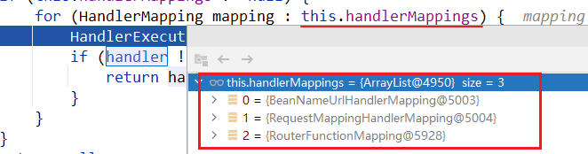
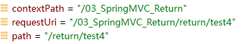
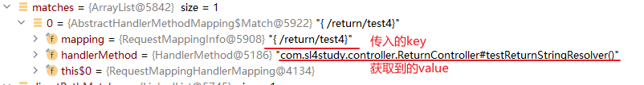

# SpringMVC 源码

## 源码解析：DispatcherServlet解密

根据SpringMVC的架构图可知，整个请求过程是经过 DispatcherServlet 分发请求来达到对不同的请求调用不同的Handler来实现的。因此可以从DispatcherServlet入手。

进入DispatcherServlet，发现处理请求分发的实际方法为 `doDispatch` 。翻译描述：处理实际分发到每个Handler的业务。

```java
protected void doDispatch(HttpServletRequest request, HttpServletResponse response) throws Exception {
    HttpServletRequest processedRequest = request;
    HandlerExecutionChain mappedHandler = null;
    boolean multipartRequestParsed = false;

    WebAsyncManager asyncManager = WebAsyncUtils.getAsyncManager(request);

    try {
        ModelAndView mv = null;
        Exception dispatchException = null;

        try {
            processedRequest = checkMultipart(request);
            multipartRequestParsed = (processedRequest != request);

            // Determine handler for the current request.
            // 选取当前请求的 handler
            mappedHandler = getHandler(processedRequest);
            if (mappedHandler == null) {
                noHandlerFound(processedRequest, response);
                return;
            }

            // Determine handler adapter for the current request.
            // 选取当前请求的适配器
            HandlerAdapter ha = getHandlerAdapter(mappedHandler.getHandler());

            // Process last-modified header, if supported by the handler.
            String method = request.getMethod();
            boolean isGet = "GET".equals(method);
            if (isGet || "HEAD".equals(method)) {
                long lastModified = ha.getLastModified(request, mappedHandler.getHandler());
                if (new ServletWebRequest(request, response).checkNotModified(lastModified) && isGet) {
                    return;
                }
            }

            if (!mappedHandler.applyPreHandle(processedRequest, response)) {
                return;
            }

            // Actually invoke the handler.
            // 执行反射方法，获取视图
            mv = ha.handle(processedRequest, response, mappedHandler.getHandler());

            if (asyncManager.isConcurrentHandlingStarted()) {
                return;
            }

            applyDefaultViewName(processedRequest, mv);
            mappedHandler.applyPostHandle(processedRequest, response, mv);
        }
        catch (Exception ex) {
            dispatchException = ex;
        }
        catch (Throwable err) {
            // As of 4.3, we're processing Errors thrown from handler methods as well,
            // making them available for @ExceptionHandler methods and other scenarios.
            dispatchException = new NestedServletException("Handler dispatch failed", err);
        }
        processDispatchResult(processedRequest, response, mappedHandler, mv, dispatchException);
    }
    catch (Exception ex) {
        triggerAfterCompletion(processedRequest, response, mappedHandler, ex);
    }
    catch (Throwable err) {
        triggerAfterCompletion(processedRequest, response, mappedHandler,
                               new NestedServletException("Handler processing failed", err));
    }
    finally {
        if (asyncManager.isConcurrentHandlingStarted()) {
            // Instead of postHandle and afterCompletion
            if (mappedHandler != null) {
                mappedHandler.applyAfterConcurrentHandlingStarted(processedRequest, response);
            }
        }
        else {
            // Clean up any resources used by a multipart request.
            if (multipartRequestParsed) {
                cleanupMultipart(processedRequest);
            }
        }
    }
}
```

DispatcherServlet大致可以分为3个部分：

1.  获取调用处理器的信息
2.  获取当前请求的适配器
3.  处理器执行，返回ModelAndView视图

### 1、获取要调用的处理器的信息

根据**结果导论**可以得知，`getHandler(processedRequest);`  方法用于确定处理当前请求的Handler。

```java
protected HandlerExecutionChain getHandler(HttpServletRequest request) throws Exception {
    if (this.handlerMappings != null) {
        for (HandlerMapping mapping : this.handlerMappings) {
            // 获取当前请求的执行链，下面进入该方法
            HandlerExecutionChain handler = mapping.getHandler(request);
            if (handler != null) {
                return handler;
            }
        }
    }
    return null;
}
```



内置了3个处理器映射，当前请求为Http请求，因此调用 RequestMappingHandlerMapping 

深入底层，查看底层如何获取具体调用哪个Handler的相关信息：

路径为：`mapping.getHandler(request);` --> `getHandlerInternal(request);` --> `super.getHandlerInternal(request);` 秘密就在 `super.getHandlerInternal(request);` 中：

```java
@Override
protected HandlerMethod getHandlerInternal(HttpServletRequest request) throws Exception {
    // 获取请求路径相关信息
    String lookupPath = getUrlPathHelper().getLookupPathForRequest(request);
    request.setAttribute(LOOKUP_PATH, lookupPath);
    this.mappingRegistry.acquireReadLock();
    try {
        // 查找处理器方法
        HandlerMethod handlerMethod = lookupHandlerMethod(lookupPath, request);
        // 从IOC容器中创建这个处理器对应的Bean，并包装成HandlerMethod返回
        return (handlerMethod != null ? handlerMethod.createWithResolvedBean() : null);
    }
    finally {
        this.mappingRegistry.releaseReadLock();
    }
}
```

-   获取请求路径相关信息的底层实现：

    ```java
    public String getPathWithinApplication(HttpServletRequest request) {
       String contextPath = getContextPath(request);
       String requestUri = getRequestUri(request);
       String path = getRemainingPath(requestUri, contextPath, true);
       if (path != null) {
          // Normal case: URI contains context path.
          return (StringUtils.hasText(path) ? path : "/");
       }
       else {
          return requestUri;
       }
    }
    ```

    此处通过请求获取了 contextPath与requestUri通过裁剪uri，最后得到需要返回的 path：



-   查找处理器方法的底层实现

    ```java
    @Nullable
    protected HandlerMethod lookupHandlerMethod(String lookupPath, HttpServletRequest request) throws Exception {
        List<Match> matches = new ArrayList<>();
    	// 1.获取直接匹配的列表
        List<T> directPathMatches = this.mappingRegistry.getMappingsByUrl(lookupPath);
        if (directPathMatches != null) {
            // 2.将直接匹配的路径添加到匹配列表中（探索这一步）
            addMatchingMappings(directPathMatches, matches, request);
        }
        if (matches.isEmpty()) {
            // No choice but to go through all mappings...
            addMatchingMappings(this.mappingRegistry.getMappings().keySet(), matches, request);
        }
    
        // 若有多个映射路径，则对其进行排序
        if (!matches.isEmpty()) {
            Match bestMatch = matches.get(0);
            if (matches.size() > 1) {
                Comparator<Match> comparator = new MatchComparator(getMappingComparator(request));
                matches.sort(comparator);
                bestMatch = matches.get(0);
                if (logger.isTraceEnabled()) {
                    logger.trace(matches.size() + " matching mappings: " + matches);
                }
                if (CorsUtils.isPreFlightRequest(request)) {
                    return PREFLIGHT_AMBIGUOUS_MATCH;
                }
                Match secondBestMatch = matches.get(1);
                if (comparator.compare(bestMatch, secondBestMatch) == 0) {
                    Method m1 = bestMatch.handlerMethod.getMethod();
                    Method m2 = secondBestMatch.handlerMethod.getMethod();
                    String uri = request.getRequestURI();
                    throw new IllegalStateException(
                        "Ambiguous handler methods mapped for '" + uri + "': {" + m1 + ", " + m2 + "}");
                }
            }
            // 排序完了之后，设置最佳匹配
            request.setAttribute(BEST_MATCHING_HANDLER_ATTRIBUTE, bestMatch.handlerMethod);
            handleMatch(bestMatch.mapping, lookupPath, request);
            // 至此，获得了有关匹配的handler的信息，并返回之。
            return bestMatch.handlerMethod;
        }
        else {
            return handleNoMatch(this.mappingRegistry.getMappings().keySet(), lookupPath, request);
        }
    }
    ```

    -   将直接匹配的路径添加到匹配列表中：addMatchingMappings(directPathMatches, matches, request);

        ```java
        // 对所有传入的请求路径，去匹配已注册（加入到ioc容器中的Controller）的Controller
        private void addMatchingMappings(Collection<T> mappings, List<Match> matches, HttpServletRequest request) {
            for (T mapping : mappings) {
                T match = getMatchingMapping(mapping, request);
                if (match != null) {
                    // 对于匹配的键值对，将其加入到matchs列表中（获取到了需要调用方法的全类名）
                    matches.add(new Match(match, this.mappingRegistry.getMappings().get(mapping)));
                }
            }
        }
        ```

        

-   IOC容器中创建这个处理器对应的Bean，并包装成HandlerMethod返回的底层实现：

    ```java
    /**
     * If the provided instance contains a bean name rather than an object instance,
     * the bean name is resolved before a {@link HandlerMethod} is created and returned.
     */
    public HandlerMethod createWithResolvedBean() {
        Object handler = this.bean;
        if (this.bean instanceof String) {
            Assert.state(this.beanFactory != null, "Cannot resolve bean name without BeanFactory");
            String beanName = (String) this.bean;
            // 从IOC中查找这个beanName的实例
            handler = this.beanFactory.getBean(beanName);
        }
        // 包装成HandlerMethod对象并返回
        return new HandlerMethod(this, handler);
    }
    ```


## Map、Model与ModelAndMap继承关系


## 静态资源与动态资源的放行

支持静态资源：`<mvc:default-servlet-handler/>`

支持动态资源：`<mvc:annotation-driven/>`

