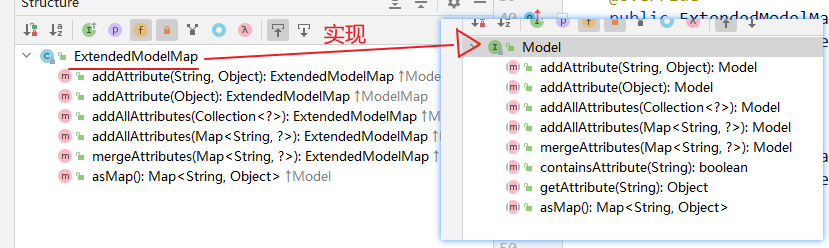
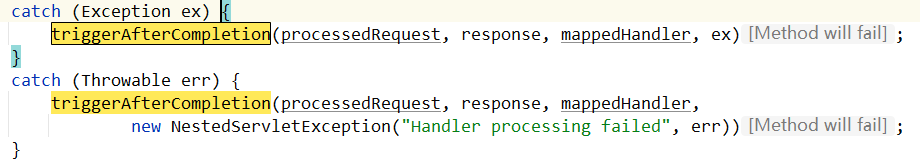
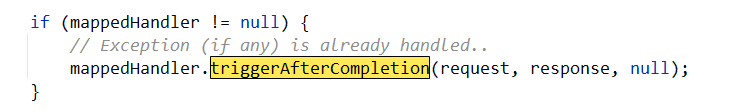

# SpringMVC 源码

## 源码解析：DispatcherServlet解密

根据SpringMVC的架构图可知，整个请求过程是经过 DispatcherServlet 分发请求来达到对不同的请求调用不同的Handler来实现的。因此可以从DispatcherServlet入手。

进入DispatcherServlet，发现处理请求分发的实际方法为 `doDispatch` 。翻译描述：处理实际分发到每个Handler的业务。

```java
protected void doDispatch(HttpServletRequest request, HttpServletResponse response) throws Exception {
    HttpServletRequest processedRequest = request;
    HandlerExecutionChain mappedHandler = null;
    boolean multipartRequestParsed = false;

    WebAsyncManager asyncManager = WebAsyncUtils.getAsyncManager(request);

    try {
        ModelAndView mv = null;
        Exception dispatchException = null;

        try {
            processedRequest = checkMultipart(request);
            multipartRequestParsed = (processedRequest != request);

            // Determine handler for the current request.
            // 选取当前请求的 handler
            mappedHandler = getHandler(processedRequest);
            if (mappedHandler == null) {
                noHandlerFound(processedRequest, response);
                return;
            }

            // Determine handler adapter for the current request.
            // 选取当前请求的适配器
            HandlerAdapter ha = getHandlerAdapter(mappedHandler.getHandler());

            // Process last-modified header, if supported by the handler.
            String method = request.getMethod();
            boolean isGet = "GET".equals(method);
            if (isGet || "HEAD".equals(method)) {
                long lastModified = ha.getLastModified(request, mappedHandler.getHandler());
                if (new ServletWebRequest(request, response).checkNotModified(lastModified) && isGet) {
                    return;
                }
            }

            if (!mappedHandler.applyPreHandle(processedRequest, response)) {
                return;
            }

            // Actually invoke the handler.
            // 执行反射方法，获取视图
            mv = ha.handle(processedRequest, response, mappedHandler.getHandler());

            if (asyncManager.isConcurrentHandlingStarted()) {
                return;
            }

            applyDefaultViewName(processedRequest, mv);
            mappedHandler.applyPostHandle(processedRequest, response, mv);
        }
        catch (Exception ex) {
            dispatchException = ex;
        }
        catch (Throwable err) {
            // As of 4.3, we're processing Errors thrown from handler methods as well,
            // making them available for @ExceptionHandler methods and other scenarios.
            dispatchException = new NestedServletException("Handler dispatch failed", err);
        }
        processDispatchResult(processedRequest, response, mappedHandler, mv, dispatchException);
    }
    catch (Exception ex) {
        triggerAfterCompletion(processedRequest, response, mappedHandler, ex);
    }
    catch (Throwable err) {
        triggerAfterCompletion(processedRequest, response, mappedHandler,
                               new NestedServletException("Handler processing failed", err));
    }
    finally {
        if (asyncManager.isConcurrentHandlingStarted()) {
            // Instead of postHandle and afterCompletion
            if (mappedHandler != null) {
                mappedHandler.applyAfterConcurrentHandlingStarted(processedRequest, response);
            }
        }
        else {
            // Clean up any resources used by a multipart request.
            if (multipartRequestParsed) {
                cleanupMultipart(processedRequest);
            }
        }
    }
}
```

DispatcherServlet大致可以分为3个部分：

1.  获取调用处理器的信息
2.  获取当前请求的适配器
3.  处理器执行，返回ModelAndView视图

### 1、获取要调用的处理器的信息

根据**结果导论**可以得知，`getHandler(processedRequest);`  方法用于确定处理当前请求的Handler。

```java
protected HandlerExecutionChain getHandler(HttpServletRequest request) throws Exception {
    if (this.handlerMappings != null) {
        for (HandlerMapping mapping : this.handlerMappings) {
            // 获取当前请求的执行链，下面进入该方法
            HandlerExecutionChain handler = mapping.getHandler(request);
            if (handler != null) {
                return handler;
            }
        }
    }
    return null;
}
```


内置了3个处理器映射，当前请求为Http请求，因此调用 RequestMappingHandlerMapping 

深入底层，查看底层如何获取具体调用哪个Handler的相关信息：

路径为：`mapping.getHandler(request);` --> `getHandlerInternal(request);` --> `super.getHandlerInternal(request);` 秘密就在 `super.getHandlerInternal(request);` 中：

```java
@Override
protected HandlerMethod getHandlerInternal(HttpServletRequest request) throws Exception {
    // 获取请求路径相关信息
    String lookupPath = getUrlPathHelper().getLookupPathForRequest(request);
    request.setAttribute(LOOKUP_PATH, lookupPath);
    this.mappingRegistry.acquireReadLock();
    try {
        // 查找处理器方法
        HandlerMethod handlerMethod = lookupHandlerMethod(lookupPath, request);
        // 从IOC容器中创建这个处理器对应的Bean，并包装成HandlerMethod返回
        return (handlerMethod != null ? handlerMethod.createWithResolvedBean() : null);
    }
    finally {
        this.mappingRegistry.releaseReadLock();
    }
}
```

-   获取请求路径相关信息的底层实现：

    ```java
    public String getPathWithinApplication(HttpServletRequest request) {
       String contextPath = getContextPath(request);
       String requestUri = getRequestUri(request);
       String path = getRemainingPath(requestUri, contextPath, true);
       if (path != null) {
          // Normal case: URI contains context path.
          return (StringUtils.hasText(path) ? path : "/");
       }
       else {
          return requestUri;
       }
    }
    ```

    此处通过请求获取了 contextPath与requestUri通过裁剪uri，最后得到需要返回的 path：


-   查找处理器方法的底层实现

    ```java
    @Nullable
    protected HandlerMethod lookupHandlerMethod(String lookupPath, HttpServletRequest request) throws Exception {
        List<Match> matches = new ArrayList<>();
    	// 1.获取直接匹配的列表
        List<T> directPathMatches = this.mappingRegistry.getMappingsByUrl(lookupPath);
        if (directPathMatches != null) {
            // 2.将直接匹配的路径添加到匹配列表中（探索这一步）
            addMatchingMappings(directPathMatches, matches, request);
        }
        if (matches.isEmpty()) {
            // No choice but to go through all mappings...
            addMatchingMappings(this.mappingRegistry.getMappings().keySet(), matches, request);
        }
    
        // 若有多个映射路径，则对其进行排序
        if (!matches.isEmpty()) {
            Match bestMatch = matches.get(0);
            if (matches.size() > 1) {
                Comparator<Match> comparator = new MatchComparator(getMappingComparator(request));
                matches.sort(comparator);
                bestMatch = matches.get(0);
                if (logger.isTraceEnabled()) {
                    logger.trace(matches.size() + " matching mappings: " + matches);
                }
                if (CorsUtils.isPreFlightRequest(request)) {
                    return PREFLIGHT_AMBIGUOUS_MATCH;
                }
                Match secondBestMatch = matches.get(1);
                if (comparator.compare(bestMatch, secondBestMatch) == 0) {
                    Method m1 = bestMatch.handlerMethod.getMethod();
                    Method m2 = secondBestMatch.handlerMethod.getMethod();
                    String uri = request.getRequestURI();
                    throw new IllegalStateException(
                        "Ambiguous handler methods mapped for '" + uri + "': {" + m1 + ", " + m2 + "}");
                }
            }
            // 排序完了之后，设置最佳匹配
            request.setAttribute(BEST_MATCHING_HANDLER_ATTRIBUTE, bestMatch.handlerMethod);
            handleMatch(bestMatch.mapping, lookupPath, request);
            // 至此，获得了有关匹配的handler的信息，并返回之。
            return bestMatch.handlerMethod;
        }
        else {
            return handleNoMatch(this.mappingRegistry.getMappings().keySet(), lookupPath, request);
        }
    }
    ```

    -   将直接匹配的路径添加到匹配列表中：addMatchingMappings(directPathMatches, matches, request);

        ```java
        // 对所有传入的请求路径，去匹配已注册（加入到ioc容器中的Controller）的Controller
        private void addMatchingMappings(Collection<T> mappings, List<Match> matches, HttpServletRequest request) {
            for (T mapping : mappings) {
                T match = getMatchingMapping(mapping, request);
                if (match != null) {
                    // 对于匹配的键值对，将其加入到matchs列表中（获取到了需要调用方法的全类名）
                    matches.add(new Match(match, this.mappingRegistry.getMappings().get(mapping)));
                }
            }
        }
        ```

        

-   IOC容器中创建这个处理器对应的Bean，并包装成HandlerMethod返回的底层实现：

    ```java
    /**
     * If the provided instance contains a bean name rather than an object instance,
     * the bean name is resolved before a {@link HandlerMethod} is created and returned.
     */
    public HandlerMethod createWithResolvedBean() {
        Object handler = this.bean;
        if (this.bean instanceof String) {
            Assert.state(this.beanFactory != null, "Cannot resolve bean name without BeanFactory");
            String beanName = (String) this.bean;
            // 从IOC中查找这个beanName的实例
            handler = this.beanFactory.getBean(beanName);
        }
        // 包装成HandlerMethod对象并返回
        return new HandlerMethod(this, handler);
    }
    ```


## Map、Model与ModelMap的关系

为什么Map，Model，ModelMap存储的是相同的数据？

Map、Model、ModelMap的继承关系：

```java
// ModelMap
public class ModelMap extends LinkedHashMap<String, Object> {
    // code..
}

// Model
public class ExtendedModelMap extends ModelMap implements Model {
    // code..
}

// 常用的是这个 
public class BindingAwareModelMap extends ExtendedModelMap {
    // code..
}
```

可以看见，ModelMap继承了LinkedHashMap，本质上是一个Map，而 ExtendedModelMap 继承了ModelMap，实现了Model接口。

`ModelMap` 中添加属性的方法如下，本质上是通过调用父类（map）的put方法存储，ModelMap只是对Map的一个扩展，实际上是一个Map。

```java
public ModelMap addAttribute(String attributeName, @Nullable Object attributeValue) {
    Assert.notNull(attributeName, "Model attribute name must not be null");
    put(attributeName, attributeValue);
    return this;
}
```

`ExtendedModelMap` 中实现了Model接口的方法，实际上只是对父类（ModelMap）的方法调用，此处为添加方法：

```java
@Override
public ExtendedModelMap addAttribute(String attributeName, @Nullable Object attributeValue) {
    super.addAttribute(attributeName, attributeValue);
    return this;
}
```




## 渲染视图：View 与Model 源码分析

SpringMVC是如何渲染视图的？

SpringMVC渲染视图可以分为两个步骤：

1.  解析路径：根据添加到IOC容器中的ViewResolver来解析视图
2.  渲染视图：添加域数据，将数据从Model转移到指定域中（默认为Request域）

页面渲染依然从 `doDispatch` 方法入手，在主题运行逻辑后的 `processDispatchResult` 方法中进行。进入 `processDispatchResult#render(mv, request, response)` 方法，渲染视图的两个主体方法如下：

-   `view = resolveViewName(viewName, mv.getModelInternal(), locale, request);`
-   `view.render(mv.getModelInternal(), request, response);`

```java
/**
 * Render the given ModelAndView.
 * <p>This is the last stage in handling a request. It may involve resolving the view by name.
 * @param mv the ModelAndView to render
 * @param request current HTTP servlet request
 * @param response current HTTP servlet response
 * @throws ServletException if view is missing or cannot be resolved
 * @throws Exception if there's a problem rendering the view
 */
protected void render(ModelAndView mv, HttpServletRequest request, HttpServletResponse response) throws Exception {
    // Determine locale for request and apply it to the response.
    Locale locale =
        (this.localeResolver != null ? this.localeResolver.resolveLocale(request) : request.getLocale());
    response.setLocale(locale);

    View view;
    String viewName = mv.getViewName();
    if (viewName != null) {
        // 解析试图：获取完整跳转路径
        view = resolveViewName(viewName, mv.getModelInternal(), locale, request);
        if (view == null) {
            throw new ServletException("Could not resolve view with name '" + mv.getViewName() +
                                       "' in servlet with name '" + getServletName() + "'");
        }
    }
    else {
        view = mv.getView();
        if (view == null) {
            throw new ServletException("ModelAndView [" + mv + "] neither contains a view name nor a " +
                                       "View object in servlet with name '" + getServletName() + "'");
        }
    }

    if (logger.isTraceEnabled()) {
        logger.trace("Rendering view [" + view + "] ");
    }
    try {
        if (mv.getStatus() != null) {
            response.setStatus(mv.getStatus().value());
        }
        // 渲染视图，添加域数据及跳转逻辑
        view.render(mv.getModelInternal(), request, response);
    }
    catch (Exception ex) {
        if (logger.isDebugEnabled()) {
            logger.debug("Error rendering view [" + view + "]", ex);
        }
        throw ex;
    }
}
```

### 解析路径

`resolveViewName`方法内部，挨个对当前ioc容器中的viewResolvers实现类进行遍历，用来解析路径。这里是通过xml注入的 `InternalResourceViewResolver` 解析器。

```java
@Nullable
protected View resolveViewName(String viewName, @Nullable Map<String, Object> model,
                               Locale locale, HttpServletRequest request) throws Exception {

    // 判断是否有解析器
    if (this.viewResolvers != null) {
        // 有则挨个遍历解析
        for (ViewResolver viewResolver : this.viewResolvers) {
            // 解析视图(下面进入)
            View view = viewResolver.resolveViewName(viewName, locale);
            // 第一个可解析的就返回
            if (view != null) {
                return view;
            }
        }
    }
    return null;
}
```

进入具体的解析方法： `viewResolver.resolveViewName(viewName, locale);` ，先判断是否有缓存，如果有缓存则直接拿（第一次没有缓存）

```java
public View resolveViewName(String viewName, Locale locale) throws Exception {
    // 判断是否有缓存，有就直接拿
    if (!isCache()) {
        return createView(viewName, locale);
    }
    else {
        // 根据 视图名+国际化 来命名cacheKey
        Object cacheKey = getCacheKey(viewName, locale);
        View view = this.viewAccessCache.get(cacheKey);
        // 线程安全的懒汉式单例模式
        if (view == null) {
            synchronized (this.viewCreationCache) {
                // 建立缓存的Key
                view = this.viewCreationCache.get(cacheKey);
                if (view == null) {
                    // 实际创建视图的方法（下面进入）
                    view = createView(viewName, locale);
                    if (view == null && this.cacheUnresolved) {
                        view = UNRESOLVED_VIEW;
                    }
                    if (view != null && this.cacheFilter.filter(view, viewName, locale)) {
                        this.viewAccessCache.put(cacheKey, view);
                        this.viewCreationCache.put(cacheKey, view);
                    }
                }
            }
        }
        else {
            if (logger.isTraceEnabled()) {
                logger.trace(formatKey(cacheKey) + "served from cache");
            }
        }
        return (view != UNRESOLVED_VIEW ? view : null);
    }
}
```

具体进行view创建的方法 `view = createView(viewName, locale);` ，先判断是否有前缀 `redirect:` 或 `forward:`，如果有则创建重定向或请求转发视图，如果没有，则直接拼接字符串。

```java
/**
 * Overridden to implement check for "redirect:" prefix.
 * <p>Not possible in {@code loadView}, since overridden
 * {@code loadView} versions in subclasses might rely on the
 * superclass always creating instances of the required view class.
 * @see #loadView
 * @see #requiredViewClass
 */
@Override
protected View createView(String viewName, Locale locale) throws Exception {
    // If this resolver is not supposed to handle the given view,
    // return null to pass on to the next resolver in the chain.
    if (!canHandle(viewName, locale)) {
        return null;
    }

    // 查看是否以 redirect: 为前缀
    if (viewName.startsWith(REDIRECT_URL_PREFIX)) {
        String redirectUrl = viewName.substring(REDIRECT_URL_PREFIX.length());
        RedirectView view = new RedirectView(redirectUrl,
                                             isRedirectContextRelative(), isRedirectHttp10Compatible());
        String[] hosts = getRedirectHosts();
        if (hosts != null) {
            view.setHosts(hosts);
        }
        return applyLifecycleMethods(REDIRECT_URL_PREFIX, view);
    }

    // 查看是否以 forward: 为前缀
    if (viewName.startsWith(FORWARD_URL_PREFIX)) {
        String forwardUrl = viewName.substring(FORWARD_URL_PREFIX.length());
        InternalResourceView view = new InternalResourceView(forwardUrl);
        return applyLifecycleMethods(FORWARD_URL_PREFIX, view);
    }

    // 都没有，则直接创建视图（具体进入）
    return super.createView(viewName, locale);
}
```

创建视图的具体方法为 `UrlBasedViewResolver#AbstractUrlBasedView`，下面为部分截取：

```java
protected AbstractUrlBasedView buildView(String viewName) throws Exception {
    Class<?> viewClass = getViewClass();
    Assert.state(viewClass != null, "No view class");

    // 通过反射 创建视图实体类
    AbstractUrlBasedView view = (AbstractUrlBasedView) BeanUtils.instantiateClass(viewClass);
    // 拼接前缀及后缀
    view.setUrl(getPrefix() + viewName + getSuffix());
    view.setAttributesMap(getAttributesMap());
    
    //...
}
```

### 渲染视图

通过 `view.render(mv.getModelInternal(), request, response);` 方法进入，实现渲染视图

```java
/**
 * Prepares the view given the specified model, merging it with static
 * attributes and a RequestContext attribute, if necessary.
 * Delegates to renderMergedOutputModel for the actual rendering.
 * @see #renderMergedOutputModel
 */
@Override
public void render(@Nullable Map<String, ?> model, HttpServletRequest request,
                   HttpServletResponse response) throws Exception {

    if (logger.isDebugEnabled()) {
        logger.debug("View " + formatViewName() +
                     ", model " + (model != null ? model : Collections.emptyMap()) +
                     (this.staticAttributes.isEmpty() ? "" : ", static attributes " + this.staticAttributes));
    }

    // 创建需要合并的视图
    Map<String, Object> mergedModel = createMergedOutputModel(model, request, response);
    // 设置响应头等信息
    prepareResponse(request, response);
    // 具体渲染的步骤（下面进入）
    renderMergedOutputModel(mergedModel, getRequestToExpose(request), response);
}
```

进入 `renderMergedOutputModel(mergedModel, getRequestToExpose(request), response);` ，在此方法中实现了如下两个功能

1.  

```java
/**
 * Render the internal resource given the specified model.
 * This includes setting the model as request attributes.
 */
@Override
protected void renderMergedOutputModel(
    Map<String, Object> model, HttpServletRequest request, HttpServletResponse response) throws Exception {

    // 将Model中的数据添加到Request域中：挨个将 model中value不为空的 request.setAttribute(name, value);，为空的 request.removeAttribute(name);
    exposeModelAsRequestAttributes(model, request);

    // Expose helpers as request attributes, if any.
    exposeHelpers(request);

    // 获取转发路径.
    String dispatcherPath = prepareForRendering(request, response);

    // 获取目标资源的前端控制器，这里内部直接调用返回了 request.getRequestDispatcher(path);
    RequestDispatcher rd = getRequestDispatcher(request, dispatcherPath);
    if (rd == null) {
        throw new ServletException("Could not get RequestDispatcher for [" + getUrl() +
                                   "]: Check that the corresponding file exists within your web application archive!");
    }

    // 如果已包含或响应已提交，则执行"include"，否则执行 forward。（不知道什么意思）
    if (useInclude(request, response)) {
        response.setContentType(getContentType());
        if (logger.isDebugEnabled()) {
            logger.debug("Including [" + getUrl() + "]");
        }
        rd.include(request, response);
    }

    else {
        if (logger.isDebugEnabled()) {
            logger.debug("Forwarding to [" + getUrl() + "]");
        }
        // 直接调用前端控制器的 forward，实现请求转发
        rd.forward(request, response);
    }
}
```


## Interceptor 执行顺序源码说明

`Interceptor` 拦截器是如何拦截目标请求的？

拦截器的拦截方法在在 DispatcherServlet#doDispatch 方法中被调用。

```java
protected void doDispatch(HttpServletRequest request, HttpServletResponse response) throws Exception {
    HttpServletRequest processedRequest = request;
    HandlerExecutionChain mappedHandler = null;
    boolean multipartRequestParsed = false;

    WebAsyncManager asyncManager = WebAsyncUtils.getAsyncManager(request);

    try {
        ModelAndView mv = null;
        Exception dispatchException = null;

        try {
            processedRequest = checkMultipart(request);
            multipartRequestParsed = (processedRequest != request);

            // 根据路径匹配拦截器，并将拦截器封装到 mappedHandler 中
            mappedHandler = getHandler(processedRequest);
            if (mappedHandler == null) {
                noHandlerFound(processedRequest, response);
                return;
            }

            HandlerAdapter ha = getHandlerAdapter(mappedHandler.getHandler());

            String method = request.getMethod();
            boolean isGet = "GET".equals(method);
            if (isGet || "HEAD".equals(method)) {
                long lastModified = ha.getLastModified(request, mappedHandler.getHandler());
                if (new ServletWebRequest(request, response).checkNotModified(lastModified) && isGet) {
                    return;
                }
            }

            // 调用匹配的handler调用前拦截器的方法（preHanlder()），如果preHanlder()中有返回false的，则直接返回，下面代码都不执行。
            if (!mappedHandler.applyPreHandle(processedRequest, response)) {
                return;
            }

            // Actually invoke the handler.
            mv = ha.handle(processedRequest, response, mappedHandler.getHandler());

            if (asyncManager.isConcurrentHandlingStarted()) {
                return;
            }

            applyDefaultViewName(processedRequest, mv);

            // 调用匹配的handler调用后拦截器的方法（postHanlder()）
            mappedHandler.applyPostHandle(processedRequest, response, mv);
        }
        catch (Exception ex) {
            dispatchException = ex;
        }
        catch (Throwable err) {
            dispatchException = new NestedServletException("Handler dispatch failed", err);
        }

        // 渲染视图（render）及调用匹配的handler调用前拦截器的方法（afterCompletion()）
        processDispatchResult(processedRequest, response, mappedHandler, mv, dispatchException);
    }

    catch (Exception ex) {
        // 出现异常也要调用afterCompletion() 方法
        triggerAfterCompletion(processedRequest, response, mappedHandler, ex);
    }
    catch (Throwable err) {
        // 出现异常也要调用afterCompletion() 方法
        triggerAfterCompletion(processedRequest, response, mappedHandler,
                               new NestedServletException("Handler processing failed", err));
    }
    finally {
        if (asyncManager.isConcurrentHandlingStarted()) {
            if (mappedHandler != null) {
                mappedHandler.applyAfterConcurrentHandlingStarted(processedRequest, response);
            }
        }
        else {
            if (multipartRequestParsed) {
                cleanupMultipart(processedRequest);
            }
        }
    }
}
```

**前置拦截方法**：`mappedHandler.applyPreHandle(processedRequest, response)`

```java
/**
 * Apply preHandle methods of registered interceptors.
 * @return {@code true} if the execution chain should proceed with the
 * next interceptor or the handler itself. Else, DispatcherServlet assumes
 * that this interceptor has already dealt with the response itself.
 */
boolean applyPreHandle(HttpServletRequest request, HttpServletResponse response) throws Exception {
	// 获取匹配的拦截器，准备挨个遍历
    HandlerInterceptor[] interceptors = getInterceptors();
    if (!ObjectUtils.isEmpty(interceptors)) {
        for (int i = 0; i < interceptors.length; i++) {
            HandlerInterceptor interceptor = interceptors[i];
            // 执行拦截器中的 preHandle 方法，如果 preHandle 返回true，则继续循环，否则直接调用 triggerAfterCompletion 方法，直接返回。
            if (!interceptor.preHandle(request, response, this.handler)) {
                triggerAfterCompletion(request, response, null);
                return false;
            }
            this.interceptorIndex = i;
        }
    }
    return true;
}
```

`interceptorIndex` 属性：用于记录当前使用到的拦截器，在 `triggerAfterCompletion` 方法中逆序遍历，从而达到逆序调用 `afterCompeletion()` 的效果。

**后置拦截方法**：`mappedHandler.applyPostHandle(processedRequest, response, mv);`

```java
/**
 * Apply postHandle methods of registered interceptors.
 */
void applyPostHandle(HttpServletRequest request, HttpServletResponse response, @Nullable ModelAndView mv) throws Exception {
	// 获取匹配的拦截器，准备挨个遍历
    HandlerInterceptor[] interceptors = getInterceptors();
    if (!ObjectUtils.isEmpty(interceptors)) {
        // 倒序遍历
        for (int i = interceptors.length - 1; i >= 0; i--) {
            HandlerInterceptor interceptor = interceptors[i];
            // 挨个执行 handler 后置拦截器
            interceptor.postHandle(request, response, this.handler, mv);
        }
    }
}
```

**结束方法**：`triggerAfterCompletion`

```java
private void triggerAfterCompletion(HttpServletRequest request, HttpServletResponse response,
                                    @Nullable HandlerExecutionChain mappedHandler, Exception ex) throws Exception {

    // 进行非空判断
    if (mappedHandler != null) {
        
        // 实际调用的是mappedHandler中的triggerAfterCompletion方法
        mappedHandler.triggerAfterCompletion(request, response, ex);
    }
    throw ex;
}

void triggerAfterCompletion(HttpServletRequest request, HttpServletResponse response, @Nullable Exception ex)
    throws Exception {

    HandlerInterceptor[] interceptors = getInterceptors();
    if (!ObjectUtils.isEmpty(interceptors)) {
        // 从前置拦截器增加的 interceptorIndex 开始，倒序遍历
        for (int i = this.interceptorIndex; i >= 0; i--) {
            HandlerInterceptor interceptor = interceptors[i];
            try {
                // 挨个执行 afterCompletion 方法。
                interceptor.afterCompletion(request, response, this.handler, ex);
            }
            catch (Throwable ex2) {
                logger.error("HandlerInterceptor.afterCompletion threw exception", ex2);
            }
        }
    }
}
```

>   结束方法的调用位置：
>
>   1.  doDispatch方法中出现异常时
>
>       
>
>   2.  processDispatchResult方法中mappedHandler不为空时（一般都不为空）
>
>       
>
>   3.  

## Restful源码分析

`HiddenHttpMethodFilter` 是如何实现Restful风格的请求的？


## 静态资源与动态资源的放行

支持静态资源：`<mvc:default-servlet-handler/>`

支持动态资源：`<mvc:annotation-driven/>`

为什么不进行配置的时候拦截了静态资源？

为什么只配置了支持静态资源却不能支持注解资源了？