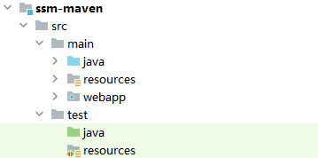

# Spring + SpringMVC + MyBatis 整合

## 说明：

目录结构要求：



包名为：`com.sl4study` 所有业务逻辑应该在此包下进行编写

映射文件夹名称为：Mapper


## Maven 项目配置

Pom依赖：

```xml
<?xml version="1.0" encoding="UTF-8"?>
<project xmlns="http://maven.apache.org/POM/4.0.0"
         xmlns:xsi="http://www.w3.org/2001/XMLSchema-instance"
         xsi:schemaLocation="http://maven.apache.org/POM/4.0.0 http://maven.apache.org/xsd/maven-4.0.0.xsd">
    <modelVersion>4.0.0</modelVersion>

    <groupId>com.atguigu</groupId>
    <artifactId>ssm-maven</artifactId>
    <version>1.0-SNAPSHOT</version>
    <packaging>war</packaging>


    <dependencies>

        <!-- springmvc  -->
        <dependency>
            <groupId>org.springframework</groupId>
            <artifactId>spring-webmvc</artifactId>
            <version>5.2.6.RELEASE</version>
        </dependency>
        <!-- spring-context-support -->
        <dependency>
            <groupId>org.springframework</groupId>
            <artifactId>spring-context-support</artifactId>
            <version>5.2.6.RELEASE</version>
        </dependency>
        <dependency>
            <groupId>org.springframework</groupId>
            <artifactId>spring-test</artifactId>
            <version>5.2.6.RELEASE</version>
        </dependency>
        <dependency>
            <groupId>org.springframework</groupId>
            <artifactId>spring-aspects</artifactId>
            <version>5.2.6.RELEASE</version>
        </dependency>

        <!-- Servlet支持 -->
        <dependency>
            <groupId>javax.servlet</groupId>
            <artifactId>servlet-api</artifactId>
            <version>2.5</version>
            <scope>provided</scope>
        </dependency>
        <!-- jsp解析 -->
        <dependency>
            <groupId>javax.servlet.jsp</groupId>
            <artifactId>jsp-api</artifactId>
            <version>2.1</version>
            <scope>provided</scope>
        </dependency>

        <!-- jstl解析依赖 -->
        <dependency>
            <groupId>jstl</groupId>
            <artifactId>jstl</artifactId>
            <version>1.2</version>
        </dependency>
        <dependency>
            <groupId>taglibs</groupId>
            <artifactId>standard</artifactId>
            <version>1.1.2</version>
        </dependency>

        <!-- json 解析：Jackson依赖 -->
        <dependency>
            <groupId>com.fasterxml.jackson.core</groupId>
            <artifactId>jackson-core</artifactId>
            <version>2.9.5</version>
        </dependency>
        <dependency>
            <groupId>com.fasterxml.jackson.core</groupId>
            <artifactId>jackson-databind</artifactId>
            <version>2.9.5</version>
        </dependency>
        <dependency>
            <groupId>com.fasterxml.jackson.core</groupId>
            <artifactId>jackson-annotations</artifactId>
            <version>2.9.5</version>
        </dependency>

        <!-- 文件上换 -->
        <dependency>
            <groupId>commons-fileupload</groupId>
            <artifactId>commons-fileupload</artifactId>
            <version>1.3.1</version>
        </dependency>

        <!-- aspectjweaver -->
        <dependency>
            <groupId>org.aspectj</groupId>
            <artifactId>aspectjweaver</artifactId>
            <version>1.9.2</version>
        </dependency>

        <!-- junit -->
        <dependency>
            <groupId>junit</groupId>
            <artifactId>junit</artifactId>
            <version>4.12</version>
            <scope>provided</scope>
        </dependency>

        <!-- mysql-connector-java -->
        <dependency>
            <groupId>mysql</groupId>
            <artifactId>mysql-connector-java</artifactId>
            <version>5.1.47</version>
        </dependency>
        <!-- druid连接池 -->
        <dependency>
            <groupId>com.alibaba</groupId>
            <artifactId>druid</artifactId>
            <version>1.2.3</version>
        </dependency>
        <!-- Spring整合jdbc -->
        <dependency>
            <groupId>org.springframework</groupId>
            <artifactId>spring-jdbc</artifactId>
            <version>5.2.6.RELEASE</version>
        </dependency>

        <!--mybatis -->
        <dependency>
            <groupId>org.mybatis</groupId>
            <artifactId>mybatis</artifactId>
            <version>3.5.3</version>
        </dependency>
        <!-- mybatis-spring -->
        <dependency>
            <groupId>org.mybatis</groupId>
            <artifactId>mybatis-spring</artifactId>
            <version>2.0.3</version>
        </dependency>

        <!-- 日志记录 -->
        <dependency>
            <groupId>log4j</groupId>
            <artifactId>log4j</artifactId>
            <version>1.2.17</version>
        </dependency>
    </dependencies>

</project>
```

### 可以使用Maven的tomcat插件来代替本地tomcat插件（可选）

```xml
<build>
    <plugins>
        <plugin>
            <groupId>org.apache.tomcat.maven</groupId>
            <artifactId>tomcat7-maven-plugin</artifactId>
            <version>2.2</version>
            <configuration>
                <!-- path标签设置项目名-->
                <path>/ssm</path>
                <!-- port标签设置端口号-->
                <port>8888</port>
                <!-- 该参数设置GET请求乱码问题 -->
                <uriEncoding>UTF-8</uriEncoding>
            </configuration>
        </plugin>
    </plugins>
</build>
```


## 基本配置

### Spring配置

文件名为：spring-config.xml

```xml
<?xml version="1.0" encoding="UTF-8"?>
<beans xmlns="http://www.springframework.org/schema/beans"
       xmlns:xsi="http://www.w3.org/2001/XMLSchema-instance"
       xmlns:context="http://www.springframework.org/schema/context"
       xmlns:tx="http://www.springframework.org/schema/tx"
       xmlns:aop="http://www.springframework.org/schema/aop"
       xmlns:p="http://www.springframework.org/schema/p"
       xmlns:mvc="http://www.springframework.org/schema/mvc"
       xmlns:mybatis="http://mybatis.org/schema/mybatis-spring"
       xsi:schemaLocation="
        http://www.springframework.org/schema/aop		http://www.springframework.org/schema/aop/spring-aop-4.0.xsd
        http://www.springframework.org/schema/mvc		http://www.springframework.org/schema/mvc/spring-mvc-4.0.xsd
        http://www.springframework.org/schema/beans		http://www.springframework.org/schema/beans/spring-beans.xsd
        http://www.springframework.org/schema/tx		http://www.springframework.org/schema/tx/spring-tx-4.0.xsd
        http://www.springframework.org/schema/context 	http://www.springframework.org/schema/context/spring-context-4.0.xsd
        http://mybatis.org/schema/mybatis-spring        http://mybatis.org/schema/mybatis-spring.xsd">

    <!-- 配置占位符 -->
    <context:property-placeholder location="classpath:dbConfig.properties"></context:property-placeholder>
    <!-- 配置包扫描，排除Controller层 -->
    <context:component-scan base-package="com.sl4study">
        <context:exclude-filter type="annotation" expression="org.springframework.stereotype.Controller"/>
    </context:component-scan>

    <!-- 配置数据源 -->
    <bean class="com.alibaba.druid.pool.DruidDataSource" id="dataSource">
        <property name="username" value="${db_username}"/>
        <property name="password" value="${db_password}"/>
        <property name="url" value="${db_url}"/>
        <property name="driverClassName" value="${db_driverClassName}"/>
        <property name="maxActive" value="${db_maxActive}"/>
        <property name="initialSize" value="${db_initialSize}"/>
        <property name="maxWait" value="${db_maxWait}"/>
    </bean>

    <!-- 配置SqlSessionFactory的生成器：SqlSessionFactoryBean，用于管理数据源、mybatis配置文件及Mapper映射文件 -->
    <bean class="org.mybatis.spring.SqlSessionFactoryBean" id="sqlSessionFactoryBean">
        <!-- 配置数据源 -->
        <property name="dataSource" ref="dataSource"/>
        <!-- mybatis 主配置文件（如果不用可省略） -->
        <!-- <property name="configLocation" value="classpath:主配置文件路径"/> -->
        <!-- mybatis 的 mapper -->
        <property name="mapperLocations" value="classpath:Mapper/*.xml"/>
    </bean>

    <!-- Mapper接口扫描，将指定包下的接口加入到IOC容器中（底层由MapperScannerConfigurer实现） -->
    <mybatis:scan base-package="com.sl4study.mapper"/>

    <!-- 配置数据源事务管理器（切面类） -->
    <bean id="tm" class="org.springframework.jdbc.datasource.DataSourceTransactionManager">
        <property name="dataSource" ref="dataSource"/>
    </bean>

    <!-- 配置事务建议 -->
    <tx:advice id="txAdvice" transaction-manager="tm">
        <tx:attributes>
            <tx:method name="add*" propagation="REQUIRED"/>
            <tx:method name="remove*" propagation="REQUIRED"/>
            <tx:method name="modify*" propagation="REQUIRED"/>
            <tx:method name="query*" read-only="true"/>
        </tx:attributes>
    </tx:advice>

    <!-- 配置切面管理 AOP -->
    <aop:config proxy-target-class="true">
        <!-- 配置切入点表达式 -->
        <aop:pointcut id="txPointcut" expression="execution(* *..*Service*.*(..))"/>
        <!-- 此处引用刚刚的事务建议 -->
        <aop:advisor advice-ref="txAdvice" pointcut-ref="txPointcut"/>
    </aop:config>

</beans>
```

### SpringMVC配置

文件名为：springmvc-config.xml

```xml
<?xml version="1.0" encoding="UTF-8"?>
<beans xmlns="http://www.springframework.org/schema/beans"
       xmlns:xsi="http://www.w3.org/2001/XMLSchema-instance"
       xmlns:context="http://www.springframework.org/schema/context"
       xmlns:p="http://www.springframework.org/schema/p"
       xmlns:mvc="http://www.springframework.org/schema/mvc"
       xsi:schemaLocation="
        http://www.springframework.org/schema/mvc       http://www.springframework.org/schema/mvc/spring-mvc-4.0.xsd
        http://www.springframework.org/schema/beans     http://www.springframework.org/schema/beans/spring-beans.xsd
        http://www.springframework.org/schema/context   http://www.springframework.org/schema/context/spring-context-4.0.xsd">

    <!-- 配置包扫描，只扫描Controller层 -->
    <context:component-scan base-package="com.sl4study" use-default-filters="false">
        <context:include-filter type="annotation" expression="org.springframework.stereotype.Controller"/>
    </context:component-scan>

    <!-- 放行静态资源 -->
    <mvc:default-servlet-handler/>
    <!-- 支持动态注解 -->
    <mvc:annotation-driven/>

    <bean class="org.springframework.web.servlet.view.InternalResourceViewResolver">
        <!-- 指定视图解析器（需要在IOC中） -->
        <property name="viewClass" value="org.springframework.web.servlet.view.JstlView"/>
        <!-- 配置前缀后缀 -->
        <property name="prefix" value="/pages/"/>
        <property name="suffix" value=".jsp"/>
    </bean>

</beans>
```

### web配置

文件名：web.xml

```xml
<?xml version="1.0" encoding="UTF-8"?>
<web-app xmlns="http://xmlns.jcp.org/xml/ns/javaee"
         xmlns:xsi="http://www.w3.org/2001/XMLSchema-instance"
         xsi:schemaLocation="http://xmlns.jcp.org/xml/ns/javaee http://xmlns.jcp.org/xml/ns/javaee/web-app_4_0.xsd"
         version="4.0">
    
    <!-- 配置启动spring时加载spring配置文件 -->
    <context-param>
        <param-name>contextConfigLocation</param-name>
        <param-value>classpath:spring-config.xml</param-value>
    </context-param>
    <!-- 启动spring -->
    <listener>
        <listener-class>org.springframework.web.context.ContextLoaderListener</listener-class>
    </listener>

    <!-- 配置前端控制器 -->
    <servlet>
        <servlet-name>DispatcherServlet</servlet-name>
        <servlet-class>org.springframework.web.servlet.DispatcherServlet</servlet-class>
        <init-param>
            <!-- 指定springmvc的配置文件位置 -->
            <param-name>contextConfigLocation</param-name>
            <param-value>classpath:springmvc-config.xml</param-value>
        </init-param>
        <!-- 设置声明周期为 启动时启动 -->
        <load-on-startup>1</load-on-startup>
    </servlet>
    <servlet-mapping>
        <servlet-name>DispatcherServlet</servlet-name>
        <url-pattern>/</url-pattern>
    </servlet-mapping>

    <!-- Spring提供的字符编码过滤器 -->
    <filter>
        <filter-name>CharacterEncodingFilter</filter-name>
        <filter-class>org.springframework.web.filter.CharacterEncodingFilter</filter-class>
        <init-param>
            <param-name>encoding</param-name>
            <param-value>utf-8</param-value>
        </init-param>
        <init-param>
            <param-name>forceRequestEncoding</param-name>
            <param-value>true</param-value>
        </init-param>
        <init-param>
            <param-name>forceResponseEncoding</param-name>
            <param-value>true</param-value>
        </init-param>
    </filter>
    <filter-mapping>
        <filter-name>CharacterEncodingFilter</filter-name>
        <servlet-name>DispatcherServlet</servlet-name>
    </filter-mapping>

    <!-- 支持Restful风格请求方式 -->
    <filter>
        <filter-name>HiddenHttpMethodFilter</filter-name>
        <filter-class>org.springframework.web.filter.HiddenHttpMethodFilter</filter-class>
    </filter>
    <filter-mapping>
        <filter-name>CharacterEncodingFilter</filter-name>
        <servlet-name>DispatcherServlet</servlet-name>
    </filter-mapping>
</web-app>
```

### 数据库配置

文件名：dbConfig.properties

```properties
# 账号
db_username=root
# 密码
db_password=root
# 数据库Url，开启了批量操作，指定字符集，编码以及时区
db_url=jdbc:mysql://localhost:3306/ssm?rewriteBatchedStatements=true&amp;useUnicode=true&amp;characterEncoding=utf8&amp;serverTimezone=Asia/Shanghai
# 驱动类，mysql8之前
db_driverClassName=com.mysql.jdbc.Driver
# 驱动类，mysql8之后
#db.driverClass=com.mysql.cj.jdbc.Driver

# 初始连接数
db_initialSize=5
# 最大连接数
db_maxActive=10
# 最大等待时间(毫秒)
db_maxWait=3000
```


## 额外组件

### Spring

### SpringMVC

#### 上传文件解析器

```xml
<!-- 配置上传解析器，id必须为multipartResolver（Spring底层指定） -->
<bean id="multipartResolver" class="org.springframework.web.multipart.commons.CommonsMultipartResolver">
    <!-- 最大上传限制 -->
    <property name="maxUploadSize" value="#{1024 * 1024 * 20}"/>
    <!-- 指定默认编码集 -->
    <property name="defaultEncoding" value="UTF-8"/>
    <property name="resolveLazily" value="true"/>
</bean>
```
### MyBatis

#### 全局配置文件

一般来说使用Spring管理数据源就用不到全局配置文件了，如果需要全局控制MyBatis的行为，还是需要MyBatis全局配置文件的。一般更改其中的settings元素的属性即可

```xml
<?xml version="1.0" encoding="UTF-8" ?>
<!DOCTYPE configuration
        PUBLIC "-//mybatis.org//DTD Config 3.0//EN"
        "http://mybatis.org/dtd/mybatis-3-config.dtd">
<configuration>

    <!-- 修改全局的设置 -->
    <settings>

    </settings>
    
    <!-- 一些通用的插件 -->
    <plugins>
    
    </plugins>

</configuration>
```

>   注意：启动MyBatis全局配置文件需要配置Spring配置文件中，SqlSessionFactoryBean的configLocation属性，指定MyBatis全局配置文件的地址。