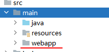
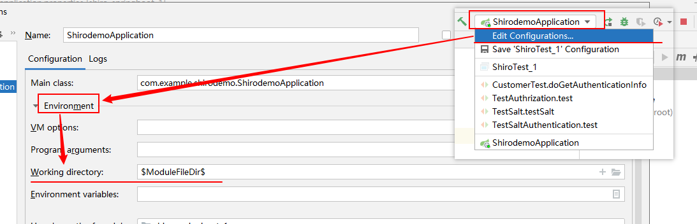
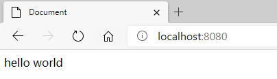

### SpringBoot 整合 JSP 进行开发有以下几个步骤

1.  在使用IDEA创建SpringBoot项目下的main目录下  新建 `webapp` 目录（一字不差）

    

2.  引入jsp解析相关依赖（包含jstl）

    ```xml
    <!-- 引入jsp解析以来 -->
    <dependency>
        <groupId>org.apache.tomcat.embed</groupId>
        <artifactId>tomcat-embed-jasper</artifactId>
    </dependency>
    
    <!-- 引入jstl -->
    <dependency>
        <groupId>jstl</groupId>
        <artifactId>jstl</artifactId>
        <version>1.2</version>
    </dependency>
    ```

3.  修改SpringBoot 配置文件：指定前缀与后缀

    ```properties
    spring.mvc.view.prefix=/
    spring.mvc.view.suffix=.jsp
    ```

4.  修改SpringBoot的启动参数，如下图所示

    

    注意：Working directory 只需要模糊匹配 `$Module*Dir$` 即可


测试：在webapp目录下创建index.jsp 文件进行测试

测试结果：整合成功




## 后续处理

#### 解决中文乱码问题

在head之前加上以下内容

```jsp
<%@page contentType="text/html; utf-8" pageEncoding="utf-8" isELIgnored="false" %>
```

