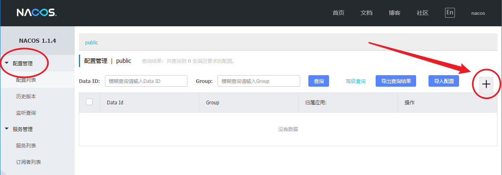
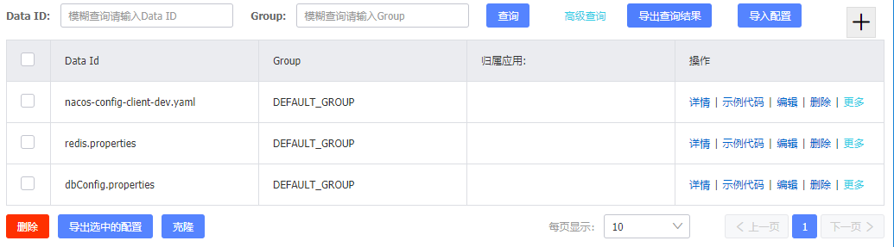
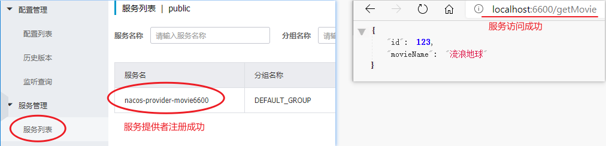
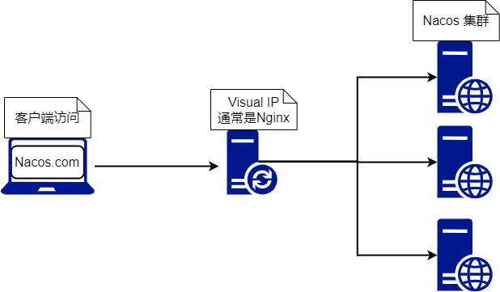

# SpringCloud Alibaba Nacos

## Nacos 简介

Nacos是Alibaba推出的注册中心

注册中心对比

| 注册中心           | Spring Cloud Nacos                                           | Spring Cloud Eureka                                          |
| :----------------- | :----------------------------------------------------------- | :----------------------------------------------------------- |
| CAP模型            | 支持AP和CP模型                                               | AP模型                                                       |
| 客户端更新服务信息 | 使用注册+DNS-f+健康检查模式。 DNS-F客户端使用监听模式push/pull拉取更新信息 | 客户端定时轮询服务端获取其他服务ip信息并对比，相比之下服务端压力较大、延迟较大 |
| 伸缩性             | 使用Raft选举算法性能、可用性、容错性均比较好，新加入节点无需与所有节点互相广播同步信息 | 由于使用广播同步信息，集群超过1000台机器后对eureka集群压力很大 |
| 健康检查模式/方式  | 支持服务端/客户端/关闭检查模式，检查方式有tcp、http、sql。支持自己构建健康检查器 | 客户端向服务端发送http心跳                                   |
| 负载均衡           | 支持                                                         | 支持                                                         |
| 手动上下线服务方式 | 通过控制台页面和API                                          | 通过调用API                                                  |
| 跨中心同步         | 支持                                                         | 不支持                                                       |
| k8s集成            | 支持                                                         | 不支持                                                       |
| 分组               | Nacos可用根据业务和环境进行分组管理                          | 不支持                                                       |
| 权重               | Nacos默认提供权重设置功能，调整承载流量压力                  | 不支持                                                       |
| 厂商               | 阿里巴巴                                                     | Netflix                                                      |


## Nacos 配置中心

Nacos 提供用于存储配置和其他元数据的 key/value 存储，为分布式系统中的外部化配置提供服务器端和客户端支持。

Spring Cloud Alibaba Nacos Config 是 Config Server 和 Client 的替代方案，客户端和服务器上的概念与 Spring Environment 和 PropertySource 有着一致的抽象，在特殊的 bootstrap 阶段，配置被加载到 Spring 环境中。

### Quick Start

#### 添加Nacos配置

1、打开nacos网页，找到如下位置，点击 `+` 号即可添加Nacos配置



2、进入修改页面，页面如下


必填项说明：

-   Data ID：标识每一个配置的唯一ID。默认情况下不会自动刷新（同步）。如果需要 Data ID 自动与Springboot 微服务同步，则需要对Data ID进行如下命名：

    `<app-name>[-profile].<file-extension>`

    -   `app-name`：应用名称，可在SpringBoot配置文件中 `spring.application.name` 进行设置
    -   `profile`：开发环境，可在SpringBoot配置文件中 `spring.profile.active` 进行设置
    -   `file-extension`：扩展名，可在SpringBoot配置文件中 `spring.cloud.nacos.config.file-extension` 进行设置（如果yml类型的配置文件，则扩展名必须为 `yaml` ！！）

    如果开发环境不指定，则需省略 `[-profile]` 部分。

    >   注意：有关于配置拉取，设置的相关的配置需要配置在 `bootstrap.properties` 中（yml也可以）！！

-   Group：配置文件的分组，同一个组不可有重复的配置文件；不同组之间相互隔离。一般用于区分业务功能。

-   配置格式：配置的格式，后缀

-   配置内容：具体的配置信息

3、设置完成之后，直接点击右下角的**发布**即可

发布后的界面如下，可以看到新增了一个配置信息，对应行右侧可以对该配置进行修改等处理。


#### 微服务拉取Nacos上的配置

1、导入 `Nacos Config` 与 `SpringWeb` 依赖，其中Nacos Config用于拉取配置项，SpringWeb用于测试配置是否成功。

```xml
<!-- Nacos -->
<dependency>
    <groupId>com.alibaba.cloud</groupId>
    <artifactId>spring-cloud-starter-alibaba-nacos-config</artifactId>
</dependency>

<!-- SpringMvc -->
<dependency>
    <groupId>org.springframework.boot</groupId>
    <artifactId>spring-boot-starter-web</artifactId>
</dependency>
```

2、创建 `bootstrap.properties`，并配置如下内容

```properties
# 用于指定nacos配置中心地址
spring.cloud.nacos.config.server-addr=127.0.0.1:8848
# 用于指定 要拉取的配置文件的类型（只能是yaml！！yml不行，会报错！）
spring.cloud.nacos.config.file-extension=yaml
# 微服务名称，也可以写在application.properties中，无妨
spring.application.name=nacos-config-client
# 指定开发环境。
spring.profiles.active=dev
```

配置项需要与Nacos配置中心的 `Data ID` 一一对应。


>   为什么是`bootstrap.properties`？
>
>   -   bootstrap 是应用程序的父上下文，也就是说 bootstrap 加载优先于 applicaton。
>
>   -   bootstrap 主要用于从额外的资源来加载配置信息，还可以在本地外部配置文件中解密属性。
>
>   -   bootstrap 里面的属性会优先加载，它们默认也不能被本地相同配置覆盖。
>   -   boostrap 由父 ApplicationContext 加载，比 applicaton 优先加载
>   -   boostrap 里面的属性不能被覆盖

#### 测试用的Controller

```java
@RestController
@RefreshScope	// 用于实时同步Nacos配置中心的内容。
public class TestController {

    @Value("${db_username}")
    String dbPort;

    @RequestMapping("/test")
    public String test() {
        System.out.println(dbPort);
        return dbPort;
    }

}
```

Nacos Confg 支持标准 Spring Cloud `@RefreshScope` 特性，即应用订阅某个 Nacos 配置后，当配置内容变化时，Refresh Scope Beans 中的绑定配置的属性将有条件的更新。所谓的条件是指 Bean 必须：

-   必须条件：Bean 的声明类必须标注 `@RefreshScope`
-   二选一条件：
    -   属性（非 static 字段）标注 `@Value`
    -   `@ConfigurationProperties`Bean

### 扩展配置文件（扩展Data ID）

Nacos Config 从 0.2.1 版本后，可支持自定义 Data Id 的配置，加载多配置文件。如果由多个配置文件需要加载，如下图：



则可以通过在 `bootstrap.properties ` 中配置如下项进行启动前加载：

```properties
spring.application.name=nacos-config-client
spring.cloud.nacos.config.server-addr=127.0.0.1:8848

# 加载额外配置文件配置：
# 1、配置文件名称
spring.cloud.nacos.config.extension-configs[0].data-id=redis.properties
# 2、配置文件所在组，缺省值为 DEFAULT_GROUP
spring.cloud.nacos.config.extension-configs[0].group=DEFAULT_GROUP
# 3、是否同步，缺省值为false
spring.cloud.nacos.config.extension-configs[0].refresh=true
```

>   注：多个 Data Id 同时配置时，他的优先级关系是 `spring.cloud.nacos.config.extension-configs[n].data-id`其中 n 的值越大，优先级越高。
>
>   `spring.cloud.nacos.config.extension-configs[n].data-id`的值必须带文件扩展名，文件扩展名既可支持 properties，又可以支持 yaml/yml。 此时 `spring.cloud.nacos.config.file-extension`的配置对自定义扩展配置的 Data Id 文件扩展名没有影响。

### Nacos Config 名称空间

Nacos 中 Namespace（名称空间）的概念：用于进行租户粒度的配置隔离。不同的命名空间下，可以存在相同的 Group 或 Data ID 的配置。Namespace 的常用场景之一是不同环境的配置的区分隔离，例如开发测试环境和生产环境的资源（如配置、服务）隔离等。

在Nacos中查看名称空间：选择左侧导航栏的**名称空间**即可


切换配置不同的名称空间：可在**配置列表**中的**选项卡**进行切换


bootstrap.properties 配置文件没有指定的情况下（默认情况下）选中的是 `public` 名称空间。

**修改选择的名称空间**

```properties
spring.cloud.nacos.config.namespace=<名称空间的ID>
```

名称空间的ID可以在Nacos 配置中心的名称空间中查看：


### Nacos Config 组配置

Nacos会给每一个配置文件指定一个组，一般来说分组是给不同的服务器之间相同的配置文件作区分。


默认使用的是 DEFAULT_GROUP 。如果需要指定自定义 Group，可以通过以下配置来实现：

```properties
spring.cloud.nacos.config.group=<存在的分组名>
```

### 其他高级配置

| 配置项                           | Key                                            | 默认值          | 说明                                                         |
| :------------------------------- | :--------------------------------------------- | :-------------- | :----------------------------------------------------------- |
| 服务端地址                       | `spring.cloud.nacos.config.server-addr`        |                 | Nacos Server 启动监听的ip地址和端口                          |
| 配置对应的 DataId                | `spring.cloud.nacos.config.name`               |                 | 先取 prefix，再取 name，最后取 spring.application.name       |
| 配置对应的 DataId                | `spring.cloud.nacos.config.prefix`             |                 | 先取 prefix，再取 name，最后取 spring.application.name       |
| 配置内容编码                     | `spring.cloud.nacos.config.encode`             |                 | 读取的配置内容对应的编码                                     |
| GROUP                            | `spring.cloud.nacos.config.group`              | `DEFAULT_GROUP` | 配置对应的组                                                 |
| 文件扩展名                       | `spring.cloud.nacos.config.fileExtension`      | `properties`    | 配置项对应的文件扩展名，目前支持 properties 和 yaml(yml)     |
| 获取配置超时时间                 | `spring.cloud.nacos.config.timeout`            | `3000`          | 客户端获取配置的超时时间(毫秒)                               |
| 接入点                           | `spring.cloud.nacos.config.endpoint`           |                 | 地域的某个服务的入口域名，通过此域名可以动态地拿到服务端地址 |
| 命名空间                         | `spring.cloud.nacos.config.namespace`          |                 | 常用场景之一是不同环境的配置的区分隔离，例如开发测试环境和生产环境的资源（如配置、服务）隔离等 |
| AccessKey                        | `spring.cloud.nacos.config.accessKey`          |                 | 当要上阿里云时，阿里云上面的一个云账号名                     |
| SecretKey                        | `spring.cloud.nacos.config.secretKey`          |                 | 当要上阿里云时，阿里云上面的一个云账号密码                   |
| Nacos Server 对应的 context path | `spring.cloud.nacos.config.contextPath`        |                 | Nacos Server 对外暴露的 context path                         |
| 集群                             | `spring.cloud.nacos.config.clusterName`        |                 | 配置成Nacos集群名称                                          |
| 共享配置                         | `spring.cloud.nacos.config.sharedDataids`      |                 | 共享配置的 DataId, "," 分割                                  |
| 共享配置动态刷新                 | `spring.cloud.nacos.config.refreshableDataids` |                 | 共享配置中需要动态刷新的 DataId, "," 分割                    |
| 自定义 Data Id 配置              | `spring.cloud.nacos.config.extConfig`          |                 | 属性是个集合，内部由 `Config`POJO 组成。`Config`有 3 个属性，分别是 `dataId`, `group`以及 `refresh` |


## Nacos 注册中心

Nacos Discovery 类似于Eureka Discovery，不过Nacos的功能更为强大。

Nacos Discovery 可以将微服务自动注册到 Nacos 服务端并且能够动态感知和刷新某个服务实例的服务列表。除此之外，Nacos Discovery 也将服务实例自身的一些元数据信息例如 host，port，健康检查URL，主页等内容注册到 Nacos。

### 远程调用测试

从应用架构上，Spring Cloud 服务调用通常需要两个应用，一个为服务提供者（Provider），一个为服务消费者（Consumer）。需要将两者都注册到Nacos上，并根据相应的注册信息进行服务调用。

#### 环境准备

引入 Nacos Discovery 依赖

```xml
<!-- Nacos Discovery -->
<dependency>
    <groupId>com.alibaba.cloud</groupId>
    <artifactId>spring-cloud-starter-alibaba-nacos-discovery</artifactId>
</dependency>
<!-- 为了测试方便，额外引入SpringMVC依赖 -->
<dependency>
    <groupId>org.springframework.boot</groupId>
    <artifactId>spring-boot-starter-web</artifactId>
</dependency>
```

#### 服务提供者（provider）

1、编写配置文件，需要制定Nacos注册中心地址

```properties
server.port=6600
spring.application.name=nacos-provider-movie6600

# Nacos 服务中心的注册地址
spring.cloud.nacos.discovery.server-addr=127.0.0.1:8848
# Nacos 客户端认证信息（默认用户名和密码均为 nacos)
spring.cloud.nacos.discovery.user-name=nacos
spring.cloud.nacos.discovery.password=naocs
```

2、激活服务发现功能：在配置类上标注 `@EnableDiscoveryClient`

默认不会自动激活 Nacos Discovery 服务注册与发现，需要在引导类（main 方法所在类）标注 Spring Cloud 服务注册与发现标准注解`@EnableDiscoveryClient`

```java
@SpringBootApplication
@EnableDiscoveryClient
public class NacosProviderMovie6600Application {
    public static void main(String[] args) {
        SpringApplication.run(NacosProviderMovie6600Application.class, args);
    }
}
```

3、编写Rest接口与业务逻辑，模拟从数据库提供数据

```java
@RestController
@RequestMapping("/provider")
public class ProviderController {

    @Autowired
    MovieService movieService;

    @RequestMapping("/getMovie")
    public Movie getMovie() {
        return movieService.getMovieFromDB();
    }

}
```

4、启动服务，查看Nacos即访问测试：



#### 服务消费者（Consumer）

1、编写服务消费方的配置文件

```properties
server.port=6700
spring.application.name=nacos-consumer-movie6700

spring.cloud.nacos.discovery.server-addr=localhost:8848
# Nacos 客户端认证信息（默认用户名和密码均为 nacos)
spring.cloud.nacos.discovery.user-name=nacos
spring.cloud.nacos.discovery.password=naocs
```

2、激活服务发现功能：在配置类上标注 `@EnableDiscoveryClient`

```java
@SpringBootApplication
@EnableDiscoveryClient
public class NacosConsumerMovie6700Application {
    public static void main(String[] args) {
        SpringApplication.run(NacosProviderMovie6600Application.class, args);
    }
}
```

3、编写远程调用功能，这里使用 `Feign` 来测试实现

1.  引入OpenFeign的starter

    ```xml
    <dependency>
        <groupId>org.springframework.cloud</groupId>
        <artifactId>spring-cloud-starter-openfeign</artifactId>
        <version>2.2.2.RELEASE</version>
    </dependency>
    ```

2.  激活OpenFeign配置，在配置类上标注 `@EnableFeignClients` 注解

    ```java
    @SpringBootApplication
    @EnableFeignClients
    @EnableDiscoveryClient
    public class NacosConsumerMovie6700Application {
        public static void main(String[] args) {
            SpringApplication.run(NacosConsumerMovie6700Application.class, args);
        }
    }
    ```

3.  编写微服务接口

    ```java
    @FeignClient(value = "nacos-provider-movie6600")
    public interface MovieService {
    
        @RequestMapping("/provider/getMovie")
        public Movie getMovie();
    
    }
    ```

4、编写测试Controller接口，直接注入微服务接口调用接口的方法即可：

```java
@RestController
@RequestMapping("/consumer")
public class ConsumerController {

    @Autowired
    MovieService movieService;

    @RequestMapping("/getMovie")
    public Movie getMovie(){
        return movieService.getMovie();
    }
}
```

#### 测试远程调用

开启服务提供者 与 服务消费者：


测试访问http://localhost:6700/consumer/getMovie：


### Nacos Discovery 更多配置项信息

|                     |                                                  |                              |                                                              |
| ------------------- | ------------------------------------------------ | ---------------------------- | ------------------------------------------------------------ |
| 配置项              | Key                                              | 默认值                       | 说明                                                         |
| 服务端地址          | `spring.cloud.nacos.discovery.server-addr`       |                              | Nacos Server 启动监听的ip地址和端口                          |
| 服务名              | `spring.cloud.nacos.discovery.service`           | `${spring.application.name}` | 注册的服务名                                                 |
| 权重                | `spring.cloud.nacos.discovery.weight`            | `1`                          | 取值范围 1 到 100，数值越大，权重越大                        |
| 网卡名              | `spring.cloud.nacos.discovery.network-interface` |                              | 当IP未配置时，注册的IP为此网卡所对应的IP地址，如果此项也未配置，则默认取第一块网卡的地址 |
| 注册的IP地址        | `spring.cloud.nacos.discovery.ip`                |                              | 优先级最高                                                   |
| 注册的端口          | `spring.cloud.nacos.discovery.port`              | `-1`                         | 默认情况下不用配置，会自动探测                               |
| 命名空间            | `spring.cloud.nacos.discovery.namespace`         |                              | 常用场景之一是不同环境的注册的区分隔离，例如开发测试环境和生产环境的资源（如配置、服务）隔离等 |
| AccessKey           | `spring.cloud.nacos.discovery.access-key`        |                              | 当要上阿里云时，阿里云上面的一个云账号名                     |
| SecretKey           | `spring.cloud.nacos.discovery.secret-key`        |                              | 当要上阿里云时，阿里云上面的一个云账号密码                   |
| Metadata            | `spring.cloud.nacos.discovery.metadata`          |                              | 使用Map格式配置，用户可以根据自己的需要自定义一些和服务相关的元数据信息 |
| 日志文件名          | `spring.cloud.nacos.discovery.log-name`          |                              |                                                              |
| 集群                | `spring.cloud.nacos.discovery.cluster-name`      | `DEFAULT`                    | Nacos集群名称                                                |
| 接入点              | `spring.cloud.nacos.discovery.endpoint`          |                              | 地域的某个服务的入口域名，通过此域名可以动态地拿到服务端地址 |
| 是否集成Ribbon      | `ribbon.nacos.enabled`                           | `true`                       | 一般都设置成true即可                                         |
| 是否开启Nacos Watch | `spring.cloud.nacos.discovery.watch.enabled`     |                              |                                                              |


## Nacos 整合 Dubblo（todo）

Spring Cloud Alibaba 引入了 Dubbo Spring Cloud，扩展了分布式服务调用能力，不仅能使 Apache Dubbo 和 OpenFeign 共存，还允许 Spring Cloud 标准调用底层通过 Dubbo 支持的通讯协议传输。无论开发人员是 Dubbo 用户还是 Spring Cloud 用户，都能轻松地驾驭，并以接近“零”成本的代价使应用向上迁移。Dubbo Spring Cloud 致力于简化 Cloud Native 开发成本，提高研发效能以及提升应用性能等目的。

**Spring Cloud 与 Dubbo Spring Cloud 横向对比**

由于 Dubbo Spring Cloud 构建在原生的 Spring Cloud 之上，其服务治理方面的能力可认为是 Spring Cloud Plus，不仅完全覆盖 Spring Cloud 原生特性，而且提供更为稳定和成熟的实现，特性比对如下表所示：

| 功能组件                                             | Spring Cloud                 | Dubbo Spring Cloud                                           |
| :--------------------------------------------------- | :--------------------------- | :----------------------------------------------------------- |
| 分布式配置（Distributed configuration）              | Git、Zookeeper、Consul、JDBC | Spring Cloud 分布式配置 + Dubbo 配置中心                     |
| 服务注册与发现（Service registration and discovery） | Eureka、Zookeeper、Consul    | Spring Cloud 原生注册中心?+ Dubbo 原生注册中心               |
| 负载均衡（Load balancing）                           | Ribbon（随机、轮询等算法）   | Dubbo 内建实现（随机、轮询等算法 + 权重等特性）              |
| 服务熔断（Circuit Breakers）                         | Spring Cloud Hystrix         | Spring Cloud Hystrix + Alibaba Sentinel[17](https://mercyblitz.github.io/2019/04/26/Dubbo-Spring-Cloud-重塑微服务治理/#fn:17) 等 |
| 服务调用（Service-to-service calls）                 | Open Feign、`RestTemplate`   | Spring Cloud 服务调用 + Dubbo`@Reference`                    |
| 链路跟踪（Tracing）                                  | Spring Cloud Sleuth?+ Zipkin | Zipkin、opentracing 等                                       |

### Dubbo Spring Cloud 特性

Dubbo Spring Cloud 基于 Spring Cloud Commons 抽象实现 Dubbo 服务注册与发现，无需添加任何外部化配置，就能轻松地桥接到所有原生 Spring Cloud 注册中心，包括Nacos、Eureka、Zookeeper与Consul

>   注：Dubbo Spring Cloud 将在下个版本支持 Spring Cloud 注册中心与 Dubbo 注册中心并存，提供双注册机制，实现无缝迁移。

#### 1、Dubbo 作为 Spring Cloud 服务调用

Dubbo 服务将作为 Spring Cloud 服务调用的同等公民出现，应用可通过 Apache Dubbo 注解`@Service`和`@Reference`暴露和引用 Dubbo 服务，实现服务间多种协议的通讯。同时，也可以利用 Dubbo 泛化接口轻松实现服务网关。

#### 2、Dubbo 服务自省

Dubbo Spring Cloud 引入了全新的服务治理特性 - 服务自省（Service Introspection），其设计目的在于最大化减轻注册中心负载，去 Dubbo 注册元信息中心化。假设一个 Spring Cloud 应用引入 Dubbo Spring Boot Starter，并暴露 N 个 Dubbo 服务，以?Dubbo Nacos 注册中心?为例，当前应用将注册 N+1 个 Nacos 应用，除 Spring Cloud 应用本身之前，其余 N 个应用均来自于 Dubbo 服务，当 N 越大时，注册中心负载越重。因此，Dubbo Spring Cloud 应用对注册中心的负载相当于传统 Dubbo 的 N 分之一，在不增加基础设施投入的前提下，理论上，使其集群规模扩大 N 倍。当然，未来的 Dubbo 也将提供服务自省的能力。

#### 3、Dubbo 迁移 Spring Cloud 服务调用

尽管 Dubbo Spring Cloud 完全地保留了原生 Spring Cloud 服务调用特性，不过 Dubbo 服务治理的能力是 Spring Cloud Open Feign 所不及的，如高性能、高可用以及负载均衡稳定性等方面。因此，建议开发人员将 Spring Cloud Open Feign 或者`@LoadBalanced` RestTemplate迁移为 Dubbo 服务。考虑到迁移过程并非一蹴而就，因此，Dubbo Spring Cloud 提供了方案，即`@DubboTransported`注解。该注解能够帮助服务消费端的 Spring Cloud Open Feign 接口以及`@LoadBalanced``RestTemplate`Bean 底层走 Dubbo 调用（可切换 Dubbo 支持的协议），而服务提供方则只需在原有`@RestController`类上追加 Dubbo`@Servce`注解（需要抽取接口）即可，换言之，在不调整 Feign 接口以及`RestTemplate`URL 的前提下，实现无缝迁移。如果迁移时间充分的话，建议使用 Dubbo 服务重构系统中的原生 Spring Cloud 服务的定义。


## Nacos 持久化

默认 Nacos 使用嵌入式数据库实现数据的存储。所以，如果启动多个默认配置下的 Nacos节点，**数据存储是存在一致性问题的**。为了解决这个问题，Nacos 可以采用集中式存储的方式来支持集群化部署，目前只支持 **MySQL** 的存储。

>   当前版本为1.1.4，最新版本请参考Nacos官方文档 [Nacos支持三种部署模式](https://nacos.io/zh-cn/docs/deployment.html)，可能由变动

Nacos持久化只需要三步：

1、创建数据库，名为 `nacos_config`

2、在nacos-server-1.1.4\nacos\conf 目录下找到 sql 脚本 `nacos-mysql.sql`，执行脚本文件

3、打开同目录下的application.properties 文件，添加如下内容（根据自己的连接信息修改）：

```properties
spring.datasource.platform=mysql
# 数据库数量
db.num=1
db.url.0=jdbc:mysql://localhost:3306/nacos_config?characterEncoding=utf8&connectTimeout=1000&socketTimeout=3000&autoReconnect=true
db.user=root
db.password=root
```


## Nacos 集群

>   Nacos 官方推荐：`http://nacos.com/:port/openAP` 域名 + VIP模式，可读性好，而且换ip方便。

Nacos集群架构图



集群搭建前提：

1.  Linux平台已安装Nacos Server
2.  数据持久化更换为高可用的MySQL集群。

### 搭建集群步骤

这里使用三个不同端口号的Nacos作为服务，使用Nginx作为虚拟ip，将收到的请求转发到三个Nacos集群上。

#### 1、 配置集群配置文件

在nacos的解压目录nacos/的conf目录下，有配置文件cluster.conf，请每行配置成ip:port。（请配置3个或3个以上节点）

```bash
192.168.72.132:3333
192.168.72.132:4444
192.168.72.132:5555
```

>   如果是多Linux机器，使用不同的ip与port启动，第一步配置完之后开放防火墙端口号即可。如果是一台虚拟机，需要指定端口号启动，则需要继续往下看。

#### 2、修改启动项，指定不同端口启动

修改启动文件 `startup.sh`，达到传递不同的端口号启动不同的nacos 实例。例如：命令`./startup.sh -p 3333` 表示启动端口号为 3333 的 nacos 服务器实例。

用vim打开 `nacos/bin/startup.sh` 文件，修改如下几处：

1.  增加命令项

    

2.  增加具体应用到端口的语句

    

3.  修改JVM虚拟机内存（虚拟机内存不大，不设置的话nacos有可能将内存全部用完！）

    

### 3、开放防火墙端口并测试每个集群是否可访问

```bash
firewall-cmd --add-port=3333/tcp --permanent
firewall-cmd --add-port=4444/tcp --permanent
firewall-cmd --add-port=5555/tcp --permanent
firewall-cmd --reload
firewall-cmd --list-all
```

访问任意一端口，成功！


#### 4、使用Nginx作为虚拟IP 反向代理Nacos集群

Nginx 配置文件

```nginx
upstream nacos-cluster{
    server 192.168.72.132:3333;
    server 192.168.72.132:4444;
    server 192.168.72.132:5555;
}

server {
    listen    1111;
    location /nacos {
        proxy_pass http://nacos-cluster;
    }
}
```
#### 5、开放1111端口并访问虚拟机，测试访问

访问：http://192.168.72.132:1111/nacos 测试访情况


成功！

### 集群测试

#### 1、修改配置文件，将服务注册到Nginx反向代理的虚拟IP上

```properties
# 将服务注册到虚拟IP上
spring.cloud.nacos.discovery.server-addr=192.168.72.132:1111
```


注册成功！

#### 2、测试服务调用情况

访问消费者端口：


服务调用成功！