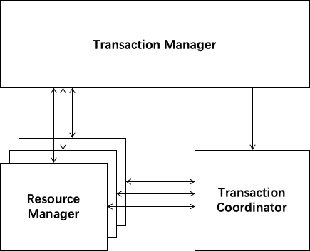

# SpringCloud Alibaba Seata

Seata 中文网站：http://seata.io/zh-cn/index.html

Seata 官方文档：http://seata.io/zh-cn/docs/overview/what-is-seata.html

源码托管github地址：https://github.com/seata/seata


## 分布式事务简介

传统的一个工程内为了保证数据的一致性，使用本地事务。本地事务只能解决同一工程中的事务问题，而微服务的场景更加复杂，关系到多个工程模块。分布式事务就是一次大的操作由不同的小操作组成，这些小的操作分布在不同的服务器上，且属于不同的应用，分布式事务需要保证这些小操作要么全部成功，要么全部失败。

**分布式事务使用场景**

-   不同微服务，不同数据库
-   相同微服务，不同数据库
-   不同微服务，相同数据库

简而言之就是无法由一个IOC容器控制的情况下需要使用分布式事务。

**触发分布式事务回滚的条件**：本地程序异常、远程调用程序异常、网络异常、服务器宕机、数据丢失、消息乱序等。

### CAP理论

传统数据库的ACID模型无法满足分布式事务，因此提出新的CAP理论来适应分布式场景。

分布式存储系统的CAP原理（分布式系统的三个指标）：

1. **C**onsistency（一致性）：在分布式系统中的所有数据备份，在**同一时刻是否同样的值**。

    对于数据分布在不同节点上的数据来说，如果在某个节点更新了数据，那么在其他节点如果都能读取到这个最新的数据，那么就称为强一致，如果有某个节点没有读取到，那就是分布式不一致。

    >   所有服务数据保持一致

2. **A**vailability（可用性）：在集群中一部分节点故障后，集群整体是否还能响应客户端的读写请求。（要求数据需要备份）

    >   服务可用

3. **P**artition tolerance（分区容忍性）：大多数分布式系统都分布在多个子网络。每个子网络就叫做一个区（partition）。

    >   区间通信可能失败

CAP理论就是说在分布式存储系统中，最多只能实现上面的两点。而由于当前的网络硬件肯定会出现延迟丢包等问题，所以**分区容忍性是我们无法避免的**。所以我们只能在一致性和可用性之间进行权衡，没有系统能同时保证这三点，AP与CP一般只能二选一。

### 解决方案之 BaSE

BASE是对CAP中一致性和可用性权衡的结果，其来源于对大规模互联网系统分布式实践的结论，是基于CAP定理逐步演化而来的，其核心思想是即使无法做到强一致性（Strong consistency），但每个应用都可以根据自身的业务特点，采用适当的方式来使系统达到最终一致性（Eventual consistency）。BaSE的三要素：

1. **B**asically **A**vailable（**基本可用**）

    基本可用是指分布式系统在出现故障的时候，允许损失部分可用性，即保证核心可用。 
    电商大促时，为了应对访问量激增，部分用户可能会被引导到降级页面，服务层也可能只提供降级服务。这就是损失部分可用性的体现。

2. **S**oft state（**软状态**）

    软状态是指允许系统存在中间状态，而该中间状态不会影响系统整体可用性。分布式存储中一般一份数据至少会有三个副本，**允许不同节点间副本同步的延时**就是软状态的体现。mysql replication的异步复制也是一种体现。

3. **E**ventually consistent（**最终一致性**）

    最终一致性是指系统中的所有数据副本经过一定时间后，最终能够达到一致的状态。弱一致性和强一致性相反，最终一致性是弱一致性的一种特殊情况。

BASE模型是传统ACID模型的反面，不同于ACID，BASE强调牺牲高一致性，从而获得可用性，数据**允许在一段时间内的不一致，只要保证最终一致就可以了**。时间长短根据具体业务而定，可以是1秒，也可以是一天。

### 分布式事务解决方案

分布式事务是企业集成中的一个**技术难点**，也是每一个分布式系统架构中都会涉及到的一个东西，特别是在微服务架构中，**几乎可以说是无法避免**。主流的解决方案如下：

1. 2PC：基于XA协议的两阶段提交
2. TCC：TCC补偿式事务
3. MQ：消息事务+最终一致性

#### 两阶段提交（2PC）

2PC即两阶段提交协议，是将整个事务流程分为两个阶段，准备阶段（Prepare phase）、提交阶段（commit phase），2是指两个阶段，P是指准备阶段，C是指提交阶段。


第一阶段：事务协调器要求每个涉及到事务的数据库预提交(precommit)此操作，并反映是否可以提交。第二阶段：事务协调器要求每个数据库提交数据。其中，如果有任何一个数据库否决此次提交，那么所有数据库都会被要求回滚它们在此事务中的那部分信息。

目前主流数据库均支持2PC【2 Phase Commit】。MySQL从5.5版本开始支持，SQL Server 2005 开始支持，Oracle 7 开始支持。

XA 是一个两阶段提交协议，又叫做 XA Transactions。

优点：总的来说，XA协议比较简单，而且一旦商业数据库实现了XA协议，使用分布式事务的成本也比较低。

缺点：性能不理想，特别是在交易下单链路，往往并发量很高，XA无法满足高并发场景。

1. 两阶段提交涉及多次节点间的网络通信，通信时间太长！
2. 事务时间相对于变长了，锁定的资源的时间也变长了，造成资源等待时间也增加好多。
3. XA目前在商业数据库支持的比较理想，在mysql数据库中支持的不太理想，mysql的XA实现，没有记录prepare阶段日志，主备切换会导致主库与备库数据不一致。许多nosql也没有支持XA，这让XA的应用场景变得非常狭隘。

对应的开源框架：atomikos

#### TCC补偿式事务

TCC补偿式事务是一种编程式分布式事务解决方案。TCC 其实就是采用的补偿机制，其核心思想是：针对每个操作，都要注册一个与其对应的确认和补偿（撤销）操作。TCC模式要求从服务提供三个接口：Try、Confirm、Cancel。

- Try：主要是对业务系统做检测及资源预留
- Confirm：真正执行业务，不作任何业务检查；只使用Try阶段预留的业务资源；Confirm操作满足幂等性。
- Cancel：释放Try阶段预留的业务资源；Cancel操作满足幂等性。

整个TCC业务分成两个阶段完成：


第一阶段：主业务服务分别调用所有从业务的try操作，并在活动管理器中登记所有从业务服务。当所有从业务服务的try操作都调用成功或者某个从业务服务的try操作失败，进入第二阶段。

第二阶段：活动管理器根据第一阶段的执行结果来执行confirm或cancel操作。如果第一阶段所有try操作都成功，则活动管理器调用所有从业务活动的confirm操作。否则调用所有从业务服务的cancel操作。

举个例子，假如 Bob 要向 Smith 转账100元，思路大概是：

我们有一个本地方法，里面依次调用

1. 首先在 Try 阶段，要先检查Bob的钱是否充足，并把这100元锁住，Smith账户也冻结起来。

2. 在 Confirm 阶段，执行远程调用的转账的操作，转账成功进行解冻。

3. 如果第2步执行成功，那么转账成功，如果第二步执行失败，则调用远程冻结接口对应的解冻方法 (Cancel)。

缺点：

- Canfirm和Cancel的**幂等性**很难保证。
- 这种方式缺点比较多，通常在**复杂场景下是不推荐使用**的，除非是非常简单的场景，非常容易提供回滚Cancel，而且依赖的服务也非常少的情况。
- 这种实现方式会造成**代码量庞大，耦合性高**。而且非常有局限性，因为有很多的业务是无法很简单的实现回滚的，如果串行的服务很多，回滚的成本实在太高。

不少大公司里，其实都是自己研发 TCC 分布式事务框架的，专门在公司内部使用。国内开源出去的：ByteTCC，TCC-transaction，Himly。

#### 消息事务+最终一致性

基于消息中间件的两阶段提交往往用在高并发场景下，将一个分布式事务拆成一个消息事务（A系统的本地操作+发消息）+B系统的本地操作，其中B系统的操作由消息驱动，只要消息事务成功，那么A操作一定成功，消息也一定发出来了，这时候B会收到消息去执行本地操作，如果本地操作失败，消息会重投，直到B操作成功，这样就变相地实现了A与B的分布式事务。


虽然上面的方案能够完成A和B的操作，但是A和B并不是严格一致的，而是最终一致的，我们在这里牺牲了一致性，换来了性能的大幅度提升。当然，这种玩法也是有风险的，如果B一直执行不成功，那么一致性会被破坏，具体要不要玩，还是得看业务能够承担多少风险。

适用于高并发最终一致，低并发基本一致：二阶段提交，高并发强一致：没有解决方案


## Seata 分布式事务框架

### 简介

Seata有3个基本组件：

- Transaction Coordinator(TC)：事务协调器，维护全局事务的运行状态，负责协调并驱动全局事务的提交或回滚。
- Transaction Manager(TM)：事务管理器，控制**全局事务**的边界，负责开启一个全局事务，并最终发起全局提交或全局回滚的决议。
- Resource Manager(RM)：资源管理器，控制**分支事务**，负责分支注册、状态汇报，并接收事务协调器的指令，驱动分支（本地）事务的提交和回滚。



Seata管理分布式事务的典型生命周期：

- TM 向 TC 申请开启一个全局事务，全局事务创建成功并生成一个全局唯一的 XID。
- XID 在微服务调用链路的上下文中传播。
- RM 向 TC 注册分支事务，将其纳入 XID 对应全局事务的管辖。
- TM 向 TC 发起针对 XID 的全局提交或回滚决议。
- TC 调度 XID 下管辖的全部分支事务完成提交或回滚请求。


springCloud整合seata案例：https://github.com/seata/seata-samples/tree/master/springcloud-jpa-seata

案例结构如下：


### Seata 整合 SpringBoot

springCloud整合seata官方文档：https://github.com/seata/seata-samples/blob/master/doc/quick-integration-with-spring-cloud.md

以seata1.2.0为准

1、下载Seata 1.2.0并启动：

win下载地址：https://github.com/seata/seata/releases/download/v1.2.0/seata-server-1.2.0.zip

Linux下载地址：https://github.com/seata/seata/releases/download/v1.2.0/seata-server-1.2.0.tar.gz

2、在对应数据库创建 undo_log 表

```mysql
# undo_log 表 ( 适用于0.3.0+版本)
CREATE TABLE `undo_log` (
  `id` bigint(20) NOT NULL AUTO_INCREMENT,
  `branch_id` bigint(20) NOT NULL,
  `xid` varchar(100) NOT NULL,
  `context` varchar(128) NOT NULL,
  `rollback_info` longblob NOT NULL,
  `log_status` int(11) NOT NULL,
  `log_created` datetime NOT NULL,
  `log_modified` datetime NOT NULL,
  PRIMARY KEY (`id`),
  UNIQUE KEY `ux_undo_log` (`xid`,`branch_id`)
) ENGINE=InnoDB AUTO_INCREMENT=1 DEFAULT CHARSET=utf8;

```

>   Seata根据数据库中 undo_log 表保存临时的事务数据，在主事务结束后，则会删除undo_log 表中的记录。

3、在项目中引入 Seata依赖及整合SpringBoot依赖

```xml
<dependency>
    <groupId>com.alibaba.cloud</groupId>
    <artifactId>spring-cloud-alibaba-seata</artifactId>
</dependency>
<dependency>
    <groupId>io.seata</groupId>
    <artifactId>seata-all</artifactId>
    <version>1.2.0</version>
</dependency>
```

4、配置SpringBoot配置文件

```properties
# 需要与vgroupMapping.<事物分组>保持一致
spring.cloud.alibaba.seata.tx-service-group=my_test_tx_group
```

5、微服务根目录下创建 file.conf 配置文件

```conf
transport {
  # tcp udt unix-domain-socket
  type = "TCP"
  #NIO NATIVE
  server = "NIO"
  #enable heartbeat
  heartbeat = true
  # the client batch send request enable
  enableClientBatchSendRequest = true
  #thread factory for netty
  threadFactory {
    bossThreadPrefix = "NettyBoss"
    workerThreadPrefix = "NettyServerNIOWorker"
    serverExecutorThread-prefix = "NettyServerBizHandler"
    shareBossWorker = false
    clientSelectorThreadPrefix = "NettyClientSelector"
    clientSelectorThreadSize = 1
    clientWorkerThreadPrefix = "NettyClientWorkerThread"
    # netty boss thread size,will not be used for UDT
    bossThreadSize = 1
    #auto default pin or 8
    workerThreadSize = "default"
  }
  shutdown {
    # when destroy server, wait seconds
    wait = 3
  }
  serialization = "seata"
  compressor = "none"
}
service {
  #transaction service group mapping
  # vgroupMapping.<事务分组> 事务分组需要与SpringBoot配置文件中的一致
  vgroupMapping.my_test_tx_group = "default"
  #only support when registry.type=file, please don't set multiple addresses、
  # 此处的 <配置项>.grouplist u需要与前面事务分组的值相等
  default.grouplist = "127.0.0.1:8091"
  #degrade, current not support
  enableDegrade = false
  #disable seata
  disableGlobalTransaction = false
}

client {
  rm {
    asyncCommitBufferLimit = 10000
    lock {
      retryInterval = 10
      retryTimes = 30
      retryPolicyBranchRollbackOnConflict = true
    }
    reportRetryCount = 5
    tableMetaCheckEnable = false
    reportSuccessEnable = false
  }
  tm {
    commitRetryCount = 5
    rollbackRetryCount = 5
  }
  undo {
    dataValidation = true
    logSerialization = "jackson"
    logTable = "undo_log"
  }
  log {
    exceptionRate = 100
  }
}
```

6、微服务根目录下创建 registry.conf 配置文件

```conf
registry {
  # file 、nacos 、eureka、redis、zk、consul、etcd3、sofa
  type = "file"

  nacos {
    application = "seata-server"
    serverAddr = "localhost"
    namespace = ""
    username = ""
    password = ""
  }
  eureka {
    serviceUrl = "http://localhost:8761/eureka"
    weight = "1"
  }
  redis {
    serverAddr = "localhost:6379"
    db = "0"
    password = ""
    timeout = "0"
  }
  zk {
    serverAddr = "127.0.0.1:2181"
    sessionTimeout = 6000
    connectTimeout = 2000
    username = ""
    password = ""
  }
  consul {
    serverAddr = "127.0.0.1:8500"
  }
  etcd3 {
    serverAddr = "http://localhost:2379"
  }
  sofa {
    serverAddr = "127.0.0.1:9603"
    region = "DEFAULT_ZONE"
    datacenter = "DefaultDataCenter"
    group = "SEATA_GROUP"
    addressWaitTime = "3000"
  }
  file {
    name = "file.conf"
  }
}

config {
  # file、nacos 、apollo、zk、consul、etcd3、springCloudConfig
  type = "file"

  nacos {
    serverAddr = "localhost"
    namespace = ""
    group = "SEATA_GROUP"
    username = ""
    password = ""
  }
  consul {
    serverAddr = "127.0.0.1:8500"
  }
  apollo {
    appId = "seata-server"
    apolloMeta = "http://192.168.1.204:8801"
    namespace = "application"
  }
  zk {
    serverAddr = "127.0.0.1:2181"
    sessionTimeout = 6000
    connectTimeout = 2000
    username = ""
    password = ""
  }
  etcd3 {
    serverAddr = "http://localhost:2379"
  }
  file {
    name = "file.conf"
  }
}
```

7、修改数据源配置

使用Druid数据库连接池

```java
@Configuration
public class DataSourceConfig {

    @Bean
    @ConfigurationProperties(prefix = "spring.datasource")
    public DruidDataSource druidDataSource() {
        return new DruidDataSource();
    }

    /**
	 * 需要将 DataSourceProxy 设置为主数据源，否则事务无法回滚
	 * @param druidDataSource The DruidDataSource
	 * @return The default datasource
	 */
    @Primary
    @Bean("dataSource")
    public DataSource dataSource(DruidDataSource druidDataSource) {
        return new DataSourceProxy(druidDataSource);
    }
}
```

使用Hikari数据库连接池

```java
@Configuration
public class DatasourceConfig {

    @Primary
    @Bean
    public DataSourceProxy dataSourceProxy(
            @Value("spring.datasource.url") String url,
            @Value("spring.datasource.driver-class-name") String driverClassName,
            @Value("spring.datasource.username") String username,
            @Value("spring.datasource.password") String password) {
        HikariDataSource hikariDataSource = new HikariDataSource();
        hikariDataSource.setJdbcUrl(url);
        hikariDataSource.setDriverClassName(driverClassName);
        hikariDataSource.setUsername(username);
        hikariDataSource.setPassword(password);
        return new DataSourceProxy(hikariDataSource);
    }

}
```

8、使用声明式注解控制全局事务

主业务方法（TM、[RM]）添加全局事务： `GlobalTransaction` 

分支业务方法（RM）添加本地事务注解： `@Transaction`

#### 通过事务分组如何找到后端集群？

1.  首先程序中配置了事务分组（GlobalTransactionScanner 构造方法的txServiceGroup参数）
2.  程序会通过用户配置的配置中心去寻找service.vgroupMapping .[*事务分组配置项*]，取得配置项的值就是TC集群的名称
3.  拿到集群名称程序通过一定的前后缀+集群名称去构造服务名，各配置中心的服务名实现不同
4.  拿到服务名去相应的注册中心去拉取相应服务名的服务列表，获得后端真实的TC服务列表

#### 为什么要用事务分组，用服务名不行吗？

这里多了一层获取事务分组到映射集群的配置。这样设计后，事务分组可以作为资源的逻辑隔离单位，出现某集群故障时可以快速failover，只切换对应分组，可以把故障缩减到服务级别，但前提也是你有足够server集群。

#### 常见错误

1、 Failed to fetch schema of <表名>

对应表缺少主键，这是由于Seata保存临时事务数据时是根据数据库表的主键来存储数据库信息，来进行获取锁与释放锁操作。所以需要对所有Seata涉及的所有数据库表添加主键。