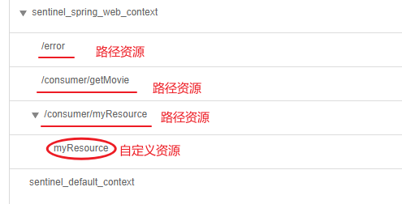
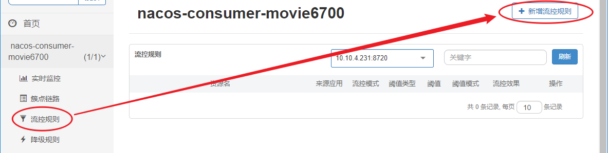
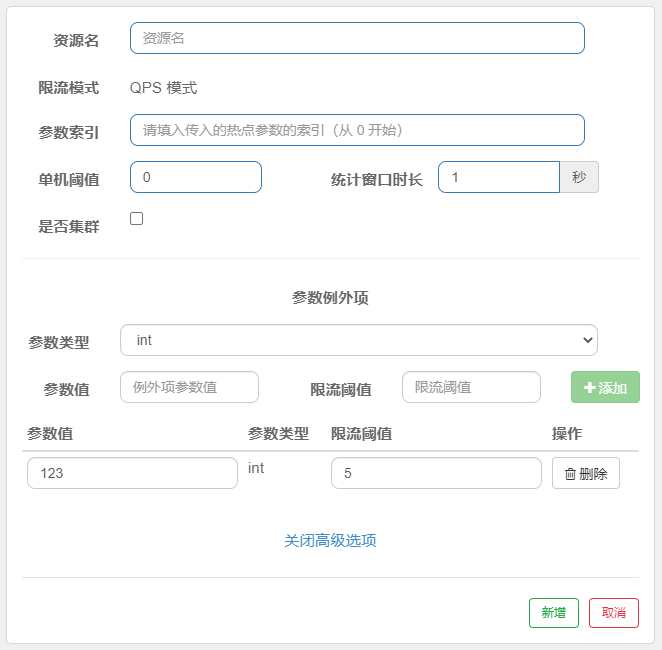

# SpringCloud Alibaba Sentinel

Sentinel 下载地址：https://github.com/alibaba/Sentinel/releases

Sentinel 官网：https://github.com/alibaba/Sentinel

## 简介

Sentinel 以流量为切入点，从流量控制、熔断降级、系统负载保护等多个维度保护服务的稳定性。

Sentinel 的主要特性：


Sentinel 分为两个部分:

-   核心库（Java 客户端）不依赖任何框架/库，能够运行于所有 Java 运行时环境，同时对 Dubbo / Spring Cloud 等框架也有较好的支持。
-   **控制台（Dashboard）基于 Spring Boot 开发，打包后可以直接运行，不需要额外的 Tomcat 等应用容器。（主要介绍）**


## DashBoard 快速上手

### 搭建Sentinel 控制台监控

将指定模块加入到Sentinel的监控，步骤如下：

1、下载 sentinel dashboard 1.8

2、在命令行窗口启动Sentinel

```bash
java -jar sentinel-dashboard-1.8.0.jar
```

3、添加监控sentinel控制台依赖

```xml
<dependency>
    <groupId>com.alibaba.cloud</groupId>
    <artifactId>spring-cloud-starter-alibaba-sentinel</artifactId>
</dependency>
```

4、在Springboot配置文件中添加Sentinel的通信端口及Sentinel地址

```yml
server:
  port: 6700
spring:
  application:
    name: nacos-consumer-movie6700
  cloud:
    nacos:
      discovery:
        server-addr: 127.0.0.1:8848
    # 配置sentinel👇
    sentinel:
      transport:
        # sentinel 控制台和当前应用进行数据传递的端口号
        port: 8719
        # 当前应用连接的sentinel控制台地址
        dashboard: localhost:8080
      eager: true # 关闭懒加载
      filter:
        url-patterns: /**
```

5、测试sentinel控制台连通状态

访问接口，测试即可。


### 导航项解释

-   实时监控：实时展示当前模块的流量情况。

-   簇点链路（单机调用链路）：页面实时的去拉取指定客户端资源的运行情况。它一共提供两种展示模式：一种用树状结构展示资源的调用链路，另外一种则不区分调用链路展示资源的运行情况。在簇点链路中可以设置流量控制、服务降级、热点key及白名单。

    **注意：** 簇点监控是内存态的信息，它仅展示启动后调用过的资源。

-   XXX规则：可以对资源添加个各种规则，如控制qps，服务降级等。

-   集群流控：监测集群状态及对集群添加流控规则

-   机器列表：展示当前监视的机器的信息。

### Sentinel中的资源

广义上讲，资源可以是任何东西，服务，接口，代码等。在Sentinel中主要有两种资源的形式：

-   uri资源：访问该模块即自动生成的资源。
-   自己定义的资源：需要使用 `@SentinelResource` 注解标注的资源。

uri资源通常不纳入Sentinel硬性资源，而自己定义的资源是纳入硬性资源的。



**自定义资源：**

```java
@RequestMapping("/myResource")
@SentinelResource(value = "myResource")
public String testMyResources() {
   return "my resource test succeed!";
}
```

>自定义资源要访问到才有意义，因此要标注在接口上

### 自定义服务降级方案

需要在资源上标注 `@SentinelResource` 注解，指定资源名及服务降级的方案

```java
@RequestMapping("/myResource")
@SentinelResource(value = "myResource",fallback = "testMyResourcesFallbackMethod")
public String testMyResources() {
    return "my resource test succeed!";
}

// 服务降级规则
public String testMyResourcesFallbackMethod() {
    System.out.println("服务降级！！");
    return "my resource test fail! Please retry later!!";
}
```

**@SentinelResource 注解属性说明**

| 属性名                                | 说明                                                         |
| ------------------------------------- | ------------------------------------------------------------ |
| value                                 | 资源名称，必需项（不能为空）                                 |
| **fallback` / `fallbackClass**        | fallback 函数名称，可选项，用于在抛出异常的时候提供 fallback 处理逻辑。<br />1.反回值类型必须与原函数返回值类型一致；<br />2. 方法参数列表需要和原函数一致，或者可以额外多一个 `Throwable` 类型的参数用于接收对应的异常。<br />3. fallback 函数默认需要和原方法在同一个类中。若希望使用其他类的函数，则可以指定 `fallbackClass` 为对应的类的 `Class` 对象，注意对应的函数必需为 **static** 函数，否则无法解析。 |
| **defaultFallback `/` fallbackClass** | 默认的 fallback 函数名称，可选项，通常用于通用的 fallback 逻辑（即可以用于很多服务或方法）。默认 fallback 函数可以针对所有类型的异常（除了 `exceptionsToIgnore` 里面排除掉的异常类型）进行处理。若同时配置了 fallback 和 defaultFallback，则只有 fallback 会生效。defaultFallback 函数签名要求： <br />1. 返回值类型必须与原函数返回值类型一致；  <br />2. 方法参数列表需要为空，或者可以额外多一个 `Throwable` 类型的参数用于接收对应的异常。  <br />3. defaultFallback 函数默认需要和原方法在同一个类中。若希望使用其他类的函数，则可以指定 `fallbackClass` 为对应的类的 `Class` 对象，注意对应的函数必需为 **static** 函数，否则无法解析。 |
| **blockHandler`/`blockHandlerClass**  | `blockHandler` 对应处理 `BlockException` 的函数名称，可选项。blockHandler 函数访问范围需要是 `public` 1. 返回类型需要与原方法相匹配 2. 参数类型需要和原方法相匹配并且最后加一个额外的参数，类型为 `BlockException`。 3. blockHandler 函数默认需要和原方法在同一个类中。若希望使用其他类的函数，则可以指定 `blockHandlerClass` 为对应的类的 `Class` 对象，注意对应的函数必需为 **static** 函数，否则无法解析。 |
| exceptionsToIgnore                    | 用于指定哪些异常被排除掉，不会计入异常统计中，也不会进入 fallback 逻辑中，而是会原样抛出。 |
| entryType                             | entry 类型，可选项（默认为 `EntryType.OUT`）                 |

其中，`fallback`/`defaultFallback`/`blockHandler` 都可以指定服务降级的备选方案。


## DashBoard 流控规则

**流量控制**（flow control），其原理是监控应用流量的 QPS 或并发线程数等指标，当达到指定的阈值时对流量进行控制，以避免被瞬时的流量高峰冲垮，从而保障应用的高可用性。

同一个资源可以创建多条限流规则。`FlowSlot` 会对该资源的所有限流规则依次遍历，直到有规则触发限流或者所有规则遍历完毕。

流控规则的设定在流控规则选项卡中指定。



新增流控规则界面：


一条限流规则主要由下面几个因素组成，可以组合这些元素来实现不同的限流效果：

-   `resource`：资源名，即限流规则的作用对象
-   `count`: 限流阈值
-   `grade`: 限流阈值类型（QPS 或并发线程数）
-   `limitApp`: 流控针对的调用来源，若为 `default` 则不区分调用来源
-   `strategy`: 调用关系限流策略
-   `controlBehavior`: 流量控制效果（直接拒绝、Warm Up、匀速排队）

### 阈值类型说明

#### 阈值类型：QPS

当 QPS 超过某个阈值的时候，则采取措施进行流量控制。流量控制的效果包括以下几种：**直接拒绝**、**Warm Up**、**匀速排队**。


**1、直接拒绝**

**直接拒绝**（`RuleConstant.CONTROL_BEHAVIOR_DEFAULT`）方式是默认的流量控制方式，当QPS超过任意规则的阈值后，新的请求就会被立即拒绝，拒绝方式为抛出`FlowException`。这种方式适用于对系统处理能力确切已知的情况下，比如通过压测确定了系统的准确水位时。

**2、Warm Up**

Warm Up（`RuleConstant.CONTROL_BEHAVIOR_WARM_UP`）方式，即预热/冷启动方式。当系统长期处于低水位的情况下，当流量突然增加时，直接把系统拉升到高水位可能瞬间把系统压垮。通过"冷启动"，让通过的流量缓慢增加，在一定时间内逐渐增加到阈值上限，给冷系统一个预热的时间，避免冷系统被压垮。

通常冷启动的过程系统允许通过的 QPS 曲线如下图所示：


QPS 从 `threshold / 3` 开始，经预热时长逐渐升至设定的 QPS 阈值。

>   在Sentinel1.8中可以设置预热时长：

**3、排队等待（匀速排队）**

匀速排队（`RuleConstant.CONTROL_BEHAVIOR_RATE_LIMITER`）方式会严格控制请求通过的间隔时间，也即是让请求以均匀的速度通过，对应的是漏桶算法。它的中心思想是：

以固定的间隔时间让请求通过。当请求到来的时候，如果当前请求距离上个通过的请求通过的时间间隔不小于预设值，则让当前请求通过；否则，计算当前请求的预期通过时间，如果该请求的预期通过时间小于规则预设的 timeout 时间，则该请求会等待直到预设时间到来通过（排队等待处理）；若预期的通过时间超出最大排队时长，则直接拒接这个请求。


这种方式主要用于处理间隔性突发的流量（削峰填谷），例如消息队列。想象一下这样的场景，在某一秒有大量的请求到来，而接下来的几秒则处于空闲状态，我们希望系统能够在接下来的空闲期间逐渐处理这些请求，而不是在第一秒直接拒绝多余的请求。

>   在Sentinel1.8中可以设置超时时长：

#### 阈值类型：线程数

Sentinel 并发控制不负责创建和管理线程池，而是简单统计当前请求上下文的线程数目（正在执行的调用数目），如果超出阈值，新的请求会被立即拒绝，效果类似于信号量隔离。**并发数控制通常在调用端进行配置。**

只需要设置最大线程数即可。


### 流控模式

流控模式分为直接、关联、链路。

-   直接：根据调用方限流

-   关联：具有关系的资源流量控制

    

    对自己调用，却限定别人的流量。如：对B调用，却限定了A的流量

    

-   链路：根据调用链路入口限流

    

    从当前节点到指定的入口资源的链路上的所有节点都限流，如G指定B为入口资源，则B、C、E、G都会被限流

    

## Dashboard 降级规则

现代微服务架构都是分布式的，由非常多的服务组成。不同服务之间相互调用，组成复杂的调用链路。因此需要对不稳定的**弱依赖服务调用**进行熔断降级，暂时切断不稳定调用，避免局部不稳定因素导致整体的雪崩。熔断降级作为保护自身的手段，通常在客户端（调用端）进行配置。


新增降级规则界面：


### Sentinel 提供以下几种熔断策略

-   慢调用比例 (`SLOW_REQUEST_RATIO`)：选择以慢调用比例作为阈值，需要设置允许的慢调用 RT（即最大的响应时间），请求的响应时间大于该值则统计为慢调用。当单位统计时长（`statIntervalMs`）内请求数目大于设置的最小请求数目，并且慢调用的比例大于阈值，则接下来的熔断时长内请求会自动被熔断。经过熔断时长后熔断器会进入探测恢复状态（HALF-OPEN 状态），若接下来的一个请求响应时间小于设置的慢调用 RT 则结束熔断，若大于设置的慢调用 RT 则会再次被熔断。
-   异常比例 (`ERROR_RATIO`)：当单位统计时长（`statIntervalMs`）内请求数目大于设置的最小请求数目，并且异常的比例大于阈值，则接下来的熔断时长内请求会自动被熔断。经过熔断时长后熔断器会进入探测恢复状态（HALF-OPEN 状态），若接下来的一个请求成功完成（没有错误）则结束熔断，否则会再次被熔断。异常比率的阈值范围是 `[0.0, 1.0]`，代表 0% - 100%。
-   异常数 (`ERROR_COUNT`)：当单位统计时长内的异常数目超过阈值之后会自动进行熔断。经过熔断时长后熔断器会进入探测恢复状态（HALF-OPEN 状态），若接下来的一个请求成功完成（没有错误）则结束熔断，否则会再次被熔断。

>   注意异常降级**仅针对业务异常**，对 Sentinel 限流降级本身的异常（`BlockException`）不生效。 

### 熔断降级规则参数说明

| 属性               | 说明                                                         | 默认值     |
| ------------------ | ------------------------------------------------------------ | ---------- |
| resource           | 资源名，即规则的作用对象                                     |            |
| grade              | 熔断策略，支持慢调用比例/异常比例/异常数策略                 | 慢调用比例 |
| count              | 慢调用比例模式下为慢调用临界 RT（超出该值计为慢调用）；异常比例/异常数模式下为对应的阈值 |            |
| timeWindow         | 熔断时长，单位为 s                                           |            |
| minRequestAmount   | 熔断触发的最小请求数，请求数小于该值时即使异常比率超出阈值也不会熔断（1.7.0 引入） | 5          |
| statIntervalMs     | 统计时长（单位为 ms），如 60*1000 代表分钟级（1.8.0 引入）   | 1000 ms    |
| slowRatioThreshold | 慢调用比例阈值，仅慢调用比例模式有效（1.8.0 引入）           |            |


## 热点规则

热点key即经常访问的数据参数。很多时候我们希望统计某个热点数据中访问频次最高的 Top K 数据，并对其访问进行限制。比如：

-   商品 ID 为参数，统计一段时间内最常购买的商品 ID 并进行限制
-   用户 ID 为参数，针对一段时间内频繁访问的用户 ID 进行限制


热点参数限流会统计传入参数中的热点参数，并根据配置的限流阈值与模式，对包含热点参数的资源调用进行限流。热点参数限流可以看做是一种特殊的流量控制，仅对包含热点参数的资源调用生效。

热点规则设置如下：


新增热点规则界面：



新面孔参数项解释：

-   参数索引：热点资源的参数，如 `?id=10&name=xinxin` ，则参数id的索引为0，name的索引为xinxin
-   统计窗口时长：qps取值为窗口期中的平均值。
-   参数类型：对指定参数类型进行限流
-   参数值：对指定参数值进行限流

注意：参数例外项是对参数类型与参数值都符合先流规则的资源进行额外的限流设置。

>   热点参数限流仅限于注解 `@SentinelResource(value=XXX)` 标注的资源。


## 系统规则

对全局进行限流。


新增系统规则界面如下：


-   **Load 自适应**（仅对 Linux/Unix-like 机器生效）：系统的 load1 作为启发指标，进行自适应系统保护。当系统 load1 超过设定的启发值，且系统当前的并发线程数超过估算的系统容量时才会触发系统保护（BBR 阶段）。系统容量由系统的 `maxQps * minRt` 估算得出。设定参考值一般是 `CPU cores * 2.5`。
-   **CPU usage**（1.5.0+ 版本）：当系统 CPU 使用率超过阈值即触发系统保护（取值范围 0.0-1.0），比较灵敏。
-   **平均 RT**：当单台机器上所有入口流量的平均 RT 达到阈值即触发系统保护，单位是毫秒。
-   **并发线程数**：当单台机器上所有入口流量的并发线程数达到阈值即触发系统保护。
-   **入口 QPS**：当单台机器上所有入口流量的 QPS 达到阈值即触发系统保护。


## 授权规则

可以对资源设置黑名单与白名单


新增授权规则如下：


-   黑名单：不可访问
-   白名单：不限流