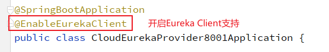
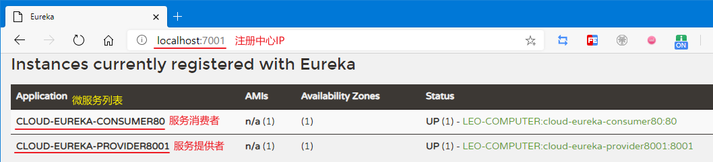

# 服务注册 Eureka

Hystrix的github地址：https://github.com/Netflix/eureka

## Eureka 简介

Eureka 作为 SpringCloud 体系中最核心、默认的注册中心组件.整体上可以分为两个主体：Eureka Server 和 Eureka Client,架构图如下所示。


**注册中心**：

保存某个服务所在地址等信息，方便调用者实时获取其他服务信息。当Eureka Server,Eureka服务端启动后，Eureka客户端便可以注册服务了，Eureka的客户端连接到Eureka Server并维持心跳连接(默认周期30秒)，这样系统的维护人员可以通过Eureka Server来监控系统中各个微服务是否正常运行。如果当Eureka Server长时间接收不到客户端的心跳请求时，便会从服务注册表中把这个服务节点移出（默认90秒）。

**服务提供者**：

当服务器启动的时候，会把当前自己服务器的信息，比如服务通讯地址等以别名方式注册到注册中心上。

**服务消费者**：

以该别名的方式去注册中心上获取到实际的服务通讯地址，然后再实现本地RPC远程调用。


## Eureka 常用配置说明

Springboot 配置说明：

-   `spring.application.name`：微服务名称，注册到Eureka上的application名称。
-   `eureka.instance.hostname`：当前微服务注册到Eureka上实例的名称
-   `eureka.instance.instance-id`：修改Eureka上 Status的名称
-   `eureka.instance.prefer-ip-address`：将IP注册到eureka中
-   `eureka.client.fetch-registry`：是否抓取注册中心的消息
-   `eureka.client.register-with-eureka`：是否注册到Eureka上
-   `eureka.client.service-url.defaultZone`：注册的地址，需要以 `/eureka/` 结尾

>   前提：SpringBoot的版本需要与SpringCloud的版本相适应


##  Eureka 单机体系搭建

需要搭建的模块有：注册中心（Eureka服务器），服务提供者（Eureka客户端），服务调用者（Eureka客户端）。

### 搭建注册中心

注册中心作为住的信息提供方，是Eureka Server端。

搭建步骤如下：

1.  新建模块，编写pom文件：引入Eureka服务器的依赖

    说明：由于注册中心是Eureka的服务器，因此需要引入Eureka服务器的依赖

    ```xml
    <!-- Eureka Server -->
    <dependency>
        <groupId>org.springframework.cloud</groupId>
        <artifactId>spring-cloud-starter-netflix-eureka-server</artifactId>
    </dependency>
    ```

2.  编写SpringBoot配置文件

    说明：由于是单机注册中心，因此无需获取其他Eureka Server的信息，也不用将自己注册到注册中心，`register-with-eureka` 与 `fetch-registry` 均为False即可。

    ```yaml
    spring:
      application:
        name: cloud-eureka-server7001
    
    server:
      port: 7001
    
    eureka:
      instance:
        hostname: localhost
      client:
        fetch-registry: false       # 不抓取其他注册信息
        register-with-eureka: false # 不注册到eureka上
        service-url:
          defaultZone: http://${eureka.instance.hostname}:${server.port}/eureka/	# eureka服务器的注册地址
    ```

3.  开启 注册中心的功能，即开启Springboot 对 Eureka Server 的支持

    在配置类上标注  `@EnableEurekaServer`

    

### 编写服务提供者

编写服务提供方的业务逻辑，并将服务提供者（Eureka Client）注册到服务中心（Eureka Server），提供处理业务相关的逻辑接口。

编写步骤如下：

1.  新建模块，编写pom文件，引入 Springboot Web依赖与Eureka Client 依赖

    说明：由于需要对外提供服务（其他微服务模块），因此需要对外开放接口，这个工作由SpringBoot的Web模块来实现。同时需要导入Eureka Client依赖以标识该模块为Eureka Client。

    ```xml
    <!-- Springboot Web -->
    <dependency>
        <groupId>org.springframework.boot</groupId>
        <artifactId>spring-boot-starter-web</artifactId>
    </dependency>
    <!-- Eureka Client -->
    <dependency>
        <groupId>org.springframework.cloud</groupId>
        <artifactId>spring-cloud-starter-netflix-eureka-client</artifactId>
    </dependency>
    ```

2.  编写SpringBoot配置文件

    说明：由于需要提供服务，因此需要注册到注册中心。由于需要返回数据给其他微服务模块，因此需要及拉取其他微服务的消息。因此`register-with-eureka` 与 `fetch-registry` 皆为true。

    ```yml
    server:
      port: 8001
    
    spring:
      application:
        name: cloud-eureka-provider8001
    
    eureka:
      client:
        register-with-eureka: true	# 将自己注册到注册中心
        fetch-registry: true	# 拉取其他微服务的注册信息
        service-url:
          defaultZone: http://localhost:7001/eureka/	# 指定注册中心的地址
    ```

3.  开启Springboot 对 Eureka Client 的支持

    在配置类上标注  `@EnableEurekaClient`

    

4.  编写服务提供者的业务逻辑（根据具体业务逻辑编写即可，一般为Service层，Dao层的调用）

### 编写服务消费者

服务消费者也是Eureka Client，其编写与服务提供者基本一致，区别在于SpringBoot的配置文件。需要与服务提供方区分开来，因此服务名称及端口号与服务提供者不一致。

1.  新建模块，编写pom文件，引入 Springboot Web依赖与Eureka Client 依赖

    说明：由于需要对外提供服务（用户），因此需要对外开放接口，这个工作由SpringBoot的Web模块来实现。同时需要导入Eureka Client依赖以标识该模块为Eureka Client。

    ```xml
    <!-- Springboot Web -->
    <dependency>
        <groupId>org.springframework.boot</groupId>
        <artifactId>spring-boot-starter-web</artifactId>
    </dependency>
    <!-- Eureka Client -->
    <dependency>
        <groupId>org.springframework.cloud</groupId>
        <artifactId>spring-cloud-starter-netflix-eureka-client</artifactId>
    </dependency>
    ```

2.  编写SpringBoot配置文件

    说明：由于需要把自己的地址端口等注册信息传递给服务提供者，因此需要注册到注册中心。由于需要从服务提供者那边接收信息，因此需要及拉取其他微服务的消息。因此`register-with-eureka` 与 `fetch-registry` 皆为true。

    ```yml
    server:
      port: 80    #服务消费者的端口号
    
    spring:
      application:
        name: cloud-eureka-consumer80    # 服务消费者的微服务名称
    
    eureka:
      client:
        register-with-eureka: true
        fetch-registry: true
        service-url:
          defaultZone: http://localhost:7001/eureka/
    ```

3.  开启Springboot 对 Eureka Client 的支持

    在配置类上标注  `@EnableEurekaClient`

    

4.  编写服务消费者的业务逻辑（根据具体业务逻辑编写即可，一般为Controller层面向公共接口调用）

### 测试

1.  依次启动：注册中心、服务提供者、服务消费者。

2.  进入注册中心查看 http://localhost:7001/ ，出现如下信息则表示单机Eureka体系搭建成功：

    


## Eureka Server集群搭建

集群体系即Eureka 的注册中心是一个集群，可以互相调用、互相守望。

### **Eureka** 集群原理

**Eureka Server 服务器端**

-   服务注册: 将服务信息注册进注册中心
-   服务发现: 从注册中心上获取服务信息

-   实质: 用Key-Value的方式存取服务器的名称与调用地址
    -   key: 服务器名称
    -   value: 对应的调用地址

**Eureka Client 客户端**

-   客户端微服务启动后会把自身信息注册进eureka,比如服务器地址以别名的方式注册进eureka(key-value)
-   需要调用端口时,使用服务器别名去注册中心获取时机的RPC远程调用地址
-   获取调用地址之后,底层实际上使用HttpClient技术实现远程调用
-   获取服务器地址和会存在本地JVM内存中,默认每隔30s从注册中心获取一次服务器调用地址

>   微服务RPC（Remote Producer Controller）远程服务调用的核心是高可用

**示意图**


### Eureka Server 集群搭建

1.  准备多个Eureka Server，这里可以使用IDEA副本模拟多个Eureka。

    

2.  配置多个Eureka Server。

    主要是修改多个Eureka的端口号、向注册中心注册自己及拉去注册中心的信息这三项。

    ```yaml
    spring:
      application:
        name: cloud-eureka-server #统一服务名称
    
    server:
      port: [ 7001 | 7002 ] #修改成不同端口号，模拟多个Eureka Server
    
    eureka:
      instance:
        hostname: localhost
      client:
        fetch-registry: true       # 将自己注册到注册中心
        register-with-eureka: true # 拉取其他微服务的注册的信息
        service-url:
          # 需要填写所有Eureka Server的地址信息。
          defaultZone: http://localhost:7001/eureka/,http://localhost:7002/eureka/ 
    ```
```
    
说明：
    
要搭建Eureka Server集群，那么多个Eureka Server必须互相知道彼此的信息。因此每个Eureka Server都需要将自己注册到注册中心，同时拉取其他微服务的信息，从中识别出其他的Eureka Server。
    
    >   在SpringBoot中可以通过修改启动项来修改参数。

### Eureka Client注册到集群

在Eureka Client 注册到集群的时候，只需要将 `service-url.defaultZone` 指定为集群所有的Eureka Server 即可。

​```yaml
service-url:
  defaultZone: http://localhost:7001/eureka/,http://localhost:7002/eureka/
```

### 集群测试

依次启动：Eureka Server、Eureka Client

启动列表为：


注册中心的信息为：


测试成功！


## Eureka 服务发现

服务发现是指可以从Eureka Server获取其他微服务的相关信息。相关类 `org.springframework.cloud.client.discovery.DiscoveryClient` 

使用步骤：

1.  激活服务发现，注解开启

    在配置类上标注 `@EnableDiscoveryClient`

    ```java
    @SpringBootApplication
    @EnableEurekaClient
    @MapperScan(value = "com.atguigu.cloud.dao")
    @EnableDiscoveryClient
    public class CloudEurekaProvider8001Application {
        public static void main(String[] args) {
            SpringApplication.run(CloudEurekaProvider8001Application.class, args);
        }
    }
    ```

2.  自动装配 DiscoveryClient ，根据 DiscoveryClient 实例来获取微服务的信息。

    ```java
    @RestController
    public class DiscoveryController {
    
        @Autowired
        DiscoveryClient discoveryClient;
    
        @RequestMapping("/getInfo")
        public DiscoveryClient getInfo() {
            // 获取所有服务信息
            System.out.println("discoveryClient.getServices() = " + discoveryClient.getServices());
            // 获取服务描述信息
            System.out.println("discoveryClient.description() = " + discoveryClient.description());
    
            return discoveryClient;
        }
    
    }
    ```

控制台打印结果：

```bash
discoveryClient.getServices() = [cloud-eureka-server]
discoveryClient.description() = Composite Discovery Client
```

网页输出结果：

```json
{
    "discoveryClients": [
        {
            "services": [
                "cloud-eureka-server"
            ],
            "order": 0
        },
        {
            "services": [],
            "order": 0
        }
    ],
    "services": [
        "cloud-eureka-server"
    ],
    "order": 0
}
```


## Eureka 心跳机制

默认情况下，如果Eureka Server在一定时间内未收到某个微服务实例的心跳，Eureka Server将会注销该服务。自我保护机制使防止该服务被删除。

心跳机制的意义：如果微服务本身状态使正常的，但由于网络故障等原因未收到微服务实例的心跳，直接删除该微服务是非常危险的。因此需要自我保护机制防止微服务被删除。自我保护机制的开启条件：短时间内未接受到大量微服务的心跳。

心跳机制可以在Eureka 的客户端和服务端设置：

**服务端**

设置Eureka Server集群之间的心跳机制，参数如下：

```properties
#关闭自我保护机制
eureka.server.enable-self-preservation=false 

#设置eureka和服务通信时间为2s(默认为90s),服务一旦不可用及时剔除
eureka.server.eviction-interval-timer-in-ms: 2000 
```
**客户端**

设置Eureka 客户端与服务端之间的心跳机制，参数如下：

```properties
#eureka客户端向服务器端发送心跳的时间间隔，单位为秒(默认为30s)
eureka.instance.lease-renewal-interval-in-seconds:1

#Eureka服务端在收到最后一次心跳后等待时间上限,单位为秒(默认是90秒),超时将删除服务。
eureka.instance.lease-expiration-duration-in-seconds: 2
```


## Eureka 细节查看

在没有引入监视器的情况下，点击Eureka注册中心的实例是无法查看细节的


结果：


需要引入 `actuator` 依赖并配置，方可查看每个实例的细节信息。步骤如下：

1.  `actuator` 依赖

    ```xml
    <dependency>
        <groupId>org.springframework.boot</groupId>
        <artifactId>spring-boot-starter-actuator</artifactId>
    </dependency>
    ```

2.  SpringBoot配置文件：

    ```yaml
    # 显示ip(可以点进去)
    eureka.instance.prefer-ip-address=true
    ```

    