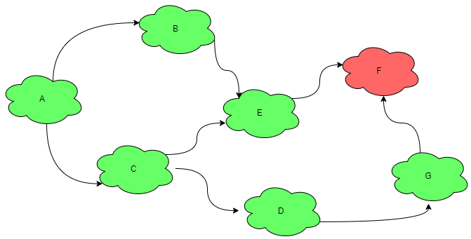
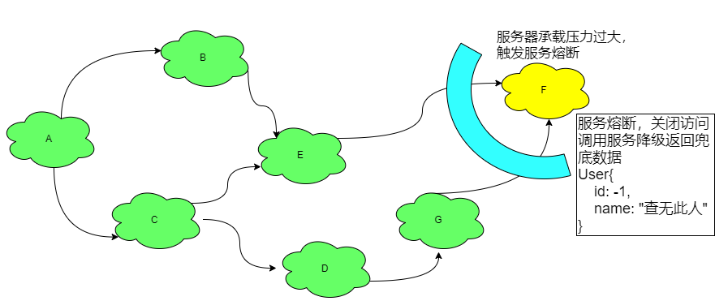
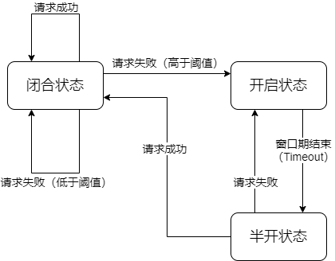

# 熔断器 Hystrix

Hystrix的github地址：https://github.com/Netflix/Hystrix

Hystrix 是一个用于处理分布式系统的延迟和容错的开源库，在分布式系统里，许多依赖不可避免的会调用失败，比如超时、异常等，Hystrix 能够保证在一个依赖出问题的情况下，不会导致整体服务失败，避免级联故障，以提高分布式系统的弹性。

“断路器”本身是一种开关装置，当某个服务单元发生故障之后，通过断路器的故障监控（**类似熔断保险丝**），**向调用方返回一个符合预期的、可处理的备选响应（Fallback）**，而不是长时间的等待或者抛出调用方无法处理的异常，这样就保证了服务调用方的线程不会被长时间、不必要地占用，从而避免了故障在分布式系统中的蔓延，乃至雪崩。

**服务雪崩**

服务之间复杂调用，一个服务不可用，导致整个系统受影响不可用（原因：服务器的大量连接被出现异常的请求占用着，导致其他正常的请求得不到连接，所以导致整个系统不可用）



如上图所示，如果F奔溃了，则会导致该服务器组集体崩溃。

**服务降级 Fallback**

服务器忙，请稍候再试，不让客户端等待并立刻返回一个友好提示。以下为触发服务降级的情况：

-   程序运行异常
-   超时自动降级
-   服务熔断触发服务降级
-   线程池/信号量打满也会导致服务降级
-   人工降级

**服务熔断 Breaker**

当服务器承载状态到达某个阈值之后，停止访问，**调用服务降级**返回友好提示。然后当服务器压力小（或请求数下降）之后，逐渐恢复。服务熔断器类似于家用保险丝（空气开关）。



**服务限流 Flowlimit**

限制某个服务每秒的调用本服务的频率，例如秒杀高并发等操作，严禁一窝蜂的过来拥挤。常用的解决方法是将请求加入队列，一个一个慢慢处理。


## Hystrix 服务降级

**环境准备：**

1.  引入 Hystrix 依赖

    ```xml
    <!-- hystrix -->
    <dependency>
        <groupId>org.springframework.cloud</groupId>
        <artifactId>spring-cloud-starter-netflix-hystrix</artifactId>
    </dependency>
    ```

2.  开启断路器功能

    在配置类上标注 `@EnableCircuitBreaker`

    ```java
    @SpringBootApplication
    @EnableFeignClients
    @EnableEurekaClient
    @EnableCircuitBreaker  // 开启断路器功能
    public class CloudHystrixFeignCustomer80Application {
       
       public static void main(String[] args) {
          SpringApplication.run(CloudHystrixFeignCustomer80Application.class, args);
       }
       
    }
    ```

**Hystrix具体使用**：

方法级的服务降级的注解可以标注在任意方法上，需要指定服务降级的方法及服务降级触发的阈值。作用是：**当指定数值达到服务降级的阈值或该方法抛出异常时**，触发服务降级。使用 `@HystrixCommand` 注解来声明服务降级：

```java
@HystrixCommand(fallbackMethod = "getRemoteResultFallBack",commandProperties ={
    @HystrixProperty(name = "execution.isolation.thread.timeoutInMilliseconds", value = "3000")
})
```

-   fallbackMethod：指定服务降级的备选方法，需要写在同一个类中。
-   commandProperties：指定服务降级的阈值，可以是一组阈值条件。每个条件用 `@HystrixProperty` 注解来声明。

实例如下：

```java
// 指定备选方案及超时时间为 3s
@HystrixCommand(fallbackMethod = "getRemoteResultFallBack",commandProperties ={
    @HystrixProperty(name = "execution.isolation.thread.timeoutInMilliseconds", value = "3000")
})
public Movie getRemoteResult() {
    try {
        // 模拟处理需要用时5s，达到服务降级的阈值
        Thread.sleep(5000);
    } catch (InterruptedException e) {
        e.printStackTrace();
    }
    // 模拟远程调用
    return restTemplate.getForObject("http://" + SERVICE_NAME + "/getMovie", Movie.class);
}

// 备选方案
public Movie getRemoteResultFallBack() {
    System.out.println("方法执行失败！调用备选方案返回空数据");
    return new Movie(null, "查询失败！");
}
```

>   备选方案的**参数与返回值**必须与主方法的一致！


## OpenFeign 服务降级

OpenFeign提供了由Hystrix实现的服务降级功能。

**环境准备：**

1.  准备好Eureka的服务提供者，服务消费者即Eureka注册中心

2.  引入Hystrix依赖与Feign依赖

    ```xml
    <!-- hystrix -->
    <dependency>
        <groupId>org.springframework.cloud</groupId>
        <artifactId>spring-cloud-starter-netflix-hystrix</artifactId>
    </dependency>
    <!-- OpenFeign -->
    <dependency>
        <groupId>org.springframework.cloud</groupId>
        <artifactId>spring-cloud-starter-openfeign</artifactId>
    </dependency>
    ```

3.  编写Springboot配置，开启Feign对 Hystrix的支持

    ```properties
    feign.hystrix.enabled=true
    ```

4.  激活Feign与断路器

    在启动类上额外标注 `@EnableFeignClients`、`@EnableCircuitBreaker` 注解

    ```java
    @SpringBootApplication
    @EnableEurekaClient
    @EnableCircuitBreaker
    @EnableFeignClients
    public class CloudHystrixRibbonProvider8001Application {
        public static void main(String[] args) {
            SpringApplication.run(CloudHystrixRibbonProvider8001Application.class, args);
        }
    }
    ```

**编写服务降级功能代码：**

1.  编写 Feign微服务接口。

2.  编写 Feign微服务接口的实现类，并将实现类加入到IOC容器中。实现类的每个实现方法就作为微服务接口方法的备选方法。

    ```java
    @Service
    public class FeignServiceFallbackImpl implements FeignService {
        @Override
        public Movie getMovie() {
            System.out.println("进入备选方案，返回空数据");
            return new Movie(null, "远程调用错误！");
        }
    }
    ```

3.  在微服务接口的 `@FeignClient` 注解上加上 `fallback` 属性，并指定备选类为微服务接口的实现类。最终呈现的代码如下：

    ```java
    @FeignClient(name = "cloud-eureka-provider8001",fallback = FeignServiceFallbackImpl.class)
    public interface FeignService {
    
        @RequestMapping("/getMovie")
        public Movie getMovie();
        
    }
    ```


## Hystrix 服务熔断

服务熔断指当某个方法的失败状态达到一定阈值时，该方法无法被访问，直接调用服务降级的备选方案。

### Hystrix 断路器

Hystrix断路器类似于保险丝，空气开关。正常情况下为闭合状态(close)，熔断情况下为开启状态(open)。

Hystrix 断路器的三个参数：

-   快照时间窗（窗口期）：断路器需要统计请求和错误数据，统计的最后一次错误请求的时间范围即为快照时间窗。

    默认为10s

-   请求总数阈值：在窗口期内，必须达到请求总数阈值才可能会触发熔断。

    默认为20个请求，这意味着在10秒内，如果hystrix命令调用不足20个，即使所有请求超时或失败，断路器都不会打开

-   错误百分比阈值：当请求总数在窗口期内超过了阈值，当“请求失败的个数/请求总数 超过错误百分比阈值”时，熔断器打开，状态为开启状态。

    默认为50%，例如10秒内进来了30个请求，其中一半的请求失败，则触发熔断

### 断路器状态转变



-   闭合状态：服务可用（相当于闭合回路，可通电）
-   开启状态：服务不可用（相当于开路，不通电）
-   半开状态：服务可用，尝试接受一次请求，如果请求成功，则转为闭合状态（服务可用）；否则转为开启状态（服务不可用）

### Hystrix 熔断器的使用

环境准备：

1.  引入Hystrix依赖

    ```xml
    <!-- hystrix -->
    <dependency>
        <groupId>org.springframework.cloud</groupId>
        <artifactId>spring-cloud-starter-netflix-hystrix</artifactId>
    </dependency>
    ```

2.  激活断路器功能：在配置类上标注 `@EnableCircuitBreaker` 注解。

熔断器的使用类似于服务降级，熔断器使用 `@HystrixCommand` 注解标注，使用 `fallbackMethod` 属性指定服务降级的方法，使用 `commandProperties` 属性来标注服务熔断的阈值。

熔断器相关的 `commandProperties` 的 `@HystrixProperty` 注解说明如下：

| name                                     | 说明                 |
| ---------------------------------------- | -------------------- |
| circuitBreaker.enabled                   | 是否开启断路器       |
| circuitBreaker.sleepWindowInMilliseconds | 窗口期时间(毫秒)     |
| circuitBreaker.requestVolumeThreshold    | 窗口期内请求总数阈值 |
| circuitBreaker.errorThresholdPercentage  | 错误百分比阈值       |

注解模板：

```java
@HystrixCommand(fallbackMethod = "fallbackMethod", commandProperties = {
    @HystrixProperty(name = "circuitBreaker.enabled", value = "true"),  					// 是否开启断路器
    @HystrixProperty(name = "circuitBreaker.sleepWindowInMilliseconds", value = "10000"),   // 窗口期时长
    @HystrixProperty(name = "circuitBreaker.requestVolumeThreshold", value = "20"),         // 请求阈值总数
    @HystrixProperty(name = "circuitBreaker.errorThresholdPercentage", value = "50")        // 错误百分比 
})
```

示例：

```java
@Service
public class MovieService {

    @Autowired
    MovieDao movieDao;

    @HystrixCommand(fallbackMethod = "fallbackMethod", commandProperties = {
        @HystrixProperty(name = "circuitBreaker.enabled", value = "true"),  					// 是否开启断路器
        @HystrixProperty(name = "circuitBreaker.sleepWindowInMilliseconds", value = "10000"),   // 窗口期时长
        @HystrixProperty(name = "circuitBreaker.requestVolumeThreshold", value = "10"),         // 请求阈值总数
        @HystrixProperty(name = "circuitBreaker.errorThresholdPercentage", value = "50")        // 错误百分比
    })
    public Movie getFirstMovie(Integer i) {
        System.out.println("进入查询方法");
        if (i == 0) {
            throw new RuntimeException("模拟错误！");
        }
        return movieDao.getFirstMovie();
    }

    public Movie fallbackMethod(Integer i) {
        System.out.println("服务熔断！返回服务降级结果！");
        return new Movie(null, "服务熔断！！");
    }

}
```

示例说明：当失败请求的数值达到熔断阈值时，请求不进入 `getFirstMovie` 方法，直接调用备份方法 `fallbackMethod` 返回结果。


## Hystrix 可视化

