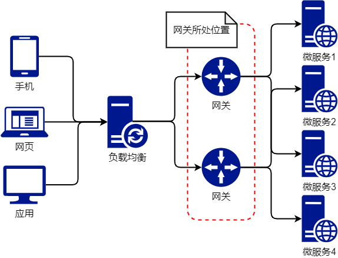
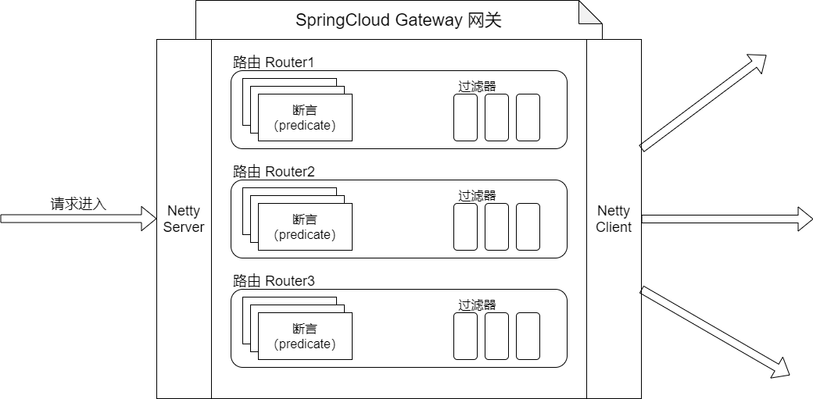
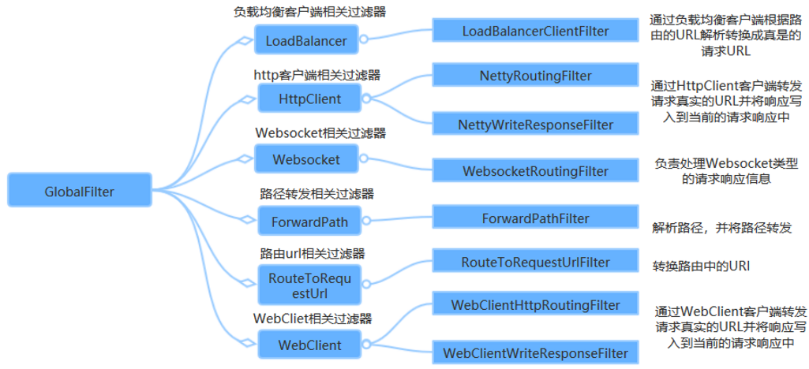

# Gateway

## 网关简介

Spring Gateway网关可以解决如下几个问题：

-   客户端会多次请求不同微服务，增加客户端的复杂性
-   存在跨域请求，在一定场景下处理相对复杂
-   认证复杂，每一个服务都需要独立认证
-   随着项目的迭代,当需要重新划分微服务时，项目变得难以重构
-   某些微服务可能使用了其他协议，直接访问有一定困难

网关包含了对请求的**路由**和**过滤**两个最主要的功能：

-   路由：负责将外部请求转发到具体的微服务实例上，是实现外部访问统一入口的基础
-   过滤：负责对请求的处理过程进行干预，是实现请求校验、服务聚合等功能的基础，之后的访问微服务都是通过网关跳转后获得。

### Spring Gateway 所处位置

微服务架构中Gateway所处的位置如下图所示：



### 网关的内部流程

网关内部主要由三部分组成：

-   断言(Predicate)：只有断言成功后才会匹配到微服务进行路由，路由到代理的微服务。
-   路由(Route)：分发请求
-   过滤(Filter)：对请求或者响应报文进行处理

网关的作用代理整个系统的所有的微服务（以后访问系统得通过访问网关再路由到微服务处理请求，统一访问程序的入口）。Gateway的内部构造如下图所示：



路由定义信息（路由的内部构造）：

```java
@Validated
public class RouteDefinition {

    // 路由的id
    private String id;

    // 路由的断言
    @NotEmpty
    @Valid
    private List<PredicateDefinition> predicates = new ArrayList<>();

    // 路由的过滤器
    @Valid
    private List<FilterDefinition> filters = new ArrayList<>();

    // 路由的目标uri
    @NotNull
    private URI uri;

    // 路由的元数据
    private Map<String, Object> metadata = new HashMap<>();

    // 路由的优先级
    private int order = 0;
    
    // ...
}
```


## Gateway QuickStart

一般地，网关是独立于微服务存在的，因此需要新建一个SpringBoot应用，只担任网关的作用。配置网关步骤如下：

1、引入网关与服务发现的依赖

```xml
<!-- Gateway -->
<dependency>
    <groupId>org.springframework.cloud</groupId>
    <artifactId>spring-cloud-starter-gateway</artifactId>
</dependency>

<!-- Eureka Client -->
<dependency>
    <groupId>org.springframework.cloud</groupId>
    <artifactId>spring-cloud-starter-netflix-eureka-client</artifactId>
</dependency>
```

2、激活服务发现功能，配置类上标注`@EnableEurekaClient`

```java
@SpringBootApplication
@EnableEurekaClient
public class CloudGatewayGateway9527Application {

    public static void main(String[] args) {
        SpringApplication.run(CloudGatewayGateway9527Application.class, args);
    }

}
```

3、在Springboot配置文件中配置网关项

```yaml
eureka:
  client:
    fetch-registry: true
    register-with-eureka: true
    service-url:
      defaultZone: http://localhost:7001/eureka/
server:
  port: 9527

spring:
  application:
    name: cloud-gateway-gateway9527
  # 下面为网关的配置
  cloud:
    gateway:
      # routes是一个列表，表示可以有多个路由 List<RouteDefinition> routes
      routes:
        # -表示给list创建一个元素(RouteDefinition类型的一个实例)
        # id表示当前route路由配置的唯一id,建议和要路由的微服务名一样
        - id: cloud-consumer-feign-consumer80
          # 断言：匹配路径
          predicates:
            - Path=/**
          # 转发的站点路径。如果当前路由断言成功，请求转发到该站点进行处理
          uri: http://localhost:80
          # 过滤器
          filters:
            - AddRequestParameter=requestid,10001 # 在匹配请求的请求参数中添加一对请求参数
```

解释：

此时访问网关url，若匹配 `predicates`，请求会被**转发**到 `url` 写好的uri。如上述例子，若客户端访问：

```bash
# localhost:9527是网关地址
http://localhost:9527/openfeign/rpc 
```

该地址与 `predicates:` 中的 Path 属性匹配，则该请求会被Gateway网关转发到 `http://localhost:80` 站点的相同uri下：

```bash
http://localhost:80/openfeign/rpc 
```

并且通过过滤器添加请求参数：

```java
// Handler
@RequestMapping("/openfeign/rpc")
public Movie rpc(Integer id,Integer requestid) {
    System.out.println("Gateway添加的请求参数："+requestid);
    return openFeignService.getMovie(requestid);
}

// 控制台输出：
Gateway添加的请求参数：10001
```

### uri 路由转发方式

route中 `uri` 参数路由匹配的方式主要有两种，一是通过路径转发，二是通过服务名转发（配置类不常用）。

#### 通过路径转发

通过路径转发是将断言成功的请求转发到指定站点下，支持负载均衡。格式为：

```bash
http://<站点ip>:<站点port>
```

上面这个案例就是通过路径匹配。

```yaml
spring:
  application:
    name: cloud-gateway-gateway9527
  # 下面为网关的配置
  cloud:
    gateway:
      routes:
        - id: cloud-consumer-feign-consumer80
          # 断言：匹配路径
          predicates:
            - Path=/**
          # 转发的站点路径。如果当前路由断言成功，请求转发到该站点进行处理
          uri: http://localhost:80
```

#### 通过服务名匹配

通过路径转发是将断言成功的请求转发到指定服务名的站点下，支持负载均衡。格式为：

```bash
lb://<服务名称>
```

配置示例如下：

```yaml
spring:
  application:
    name: cloud-gateway-gateway9527
  # 下面为网关的配置
  cloud:
    gateway:
      routes:
        - id: cloud-consumer-feign-consumer80
          # 断言：匹配路径
          predicates:
            - Path=/openfeign**/**
          # 转发的站点路径。如果当前路由断言成功，请求转发到该站点进行处理
          uri: lb://cloud-consumer-feign-consumer80
```

>   注意：uri匹配路径后跟资源路径无效，Gateway处理时会直接省略后面的资源路径，如：
>   `http://localhost/openfeign/rpc/asd/v/cx` 只会被解析为`http://localhost`


## Gateway 断言扩充

Spring Cloud Gateway 通过 Predicate 来匹配来自用户的请求,如果匹配成功，才会将请求路由给指定的微服务。

断言的配置格式如下：

```yaml
spring:
  cloud:
    gateway:
      routes:
      - id: after_route
        uri: https://example.org
        # 👇此处是断言
        predicates:
        - After=2017-01-20T17:42:47.789-07:00[America/Denver]
```

可选配置项：

| 配置项名称 | 配置项作用                                                   | 示例                                                         |
| ---------- | ------------------------------------------------------------ | ------------------------------------------------------------ |
| After      | 判断时间在After配置的时间之后规则才生效                      | predicates:<br />  - After=2017-01-20T17:42:47.789-07:00[America/Denver] |
| Before     | 判断在Before之前路由配置才生效                               | predicates:<br />  - Before=2017-01-20T17:42:47.789-07:00[America/Denver] |
| Between    | 在时间之内规则生效                                           | predicates:<br />  - Between=2017-01-20T17:42:47.789-07:00[America/Denver], 2017-01-21T17:42:47.789-07:00[America/Denver] |
| Cookie     | 带cookie，名字和正则表达式。cookie中需要带有key并且符合value的正则表达式。不带cookie会404 | predicates:<br />  - Cookie=key, value                       |
| Header     | 请求头文件中带key的名称时 X-Request-Id 值是正则表达式\d+（数字） | predicates:<br />  - Header=X-Request-Id, \d+                |
| Host       | 主机是yumbo.top或者huashengshu.top的子域名的规则生效，如果不带这个信息，则会返回404；头文件中设置 Host | predicates:<br />  - Host=`**.yumbo.top.**.huashengshu.top`  |
| Method     | 请求方法要是配置中设置的GET或者POST路由才会生效              | predicates:<br />  - Method=GET,POST                         |
| Path       | 请求路径要符合Path设置的规则路由才生效                       | predicates:<br />  - Path=/red/{segment},/blue/{segment}     |
| Query      | 请求参数要包含green参数路由才生效                            | predicates:<br />  - Query=green                             |
| RemoteAddr | 如果请求的远程地址是192.168.1.10，则此路由匹配。             | predicates:<br />  - RemoteAddr=192.168.1.1/24               |
| Weight     | 这条路径将把80%的流量转发到weighthigh.org，并将20%的流量转发到weighlow.org；权重路由，按照权重分流量 | predicates:<br />  - Weight=group1, 2                        |


## Gateway 过滤器

路由过滤器可用于修改进入的HTTP请求与返回的HTTP响应，路由过滤器只能指定路由进行使用。SpringCloud GateWay内置了多种路由过滤器，他们都由GatewayFilter的工厂类生产。

过滤器配置示例：

```yaml
spring:
  application:
    name: cloud-gateway-gateway9527
  # 下面为网关的配置
  cloud:
    gateway:
      routes:
        - id: cloud-consumer-feign-consumer80
          predicates:
            - Path=/**
          uri: http://localhost:80
          # 👇此处是过滤器
          filters:
            - AddRequestParameter=requestid,10001 # 在匹配请求的请求参数中添加一对请求参数
```

过滤器分为两种：

-   GatewayFilter（单一）：需要通过`spring.cloud.routes.filters` 配置在具体路由下，只作用在当前路由上或通过 `spring.cloud.default-filters` 配置在全局，作用在所有路由上。
-   GlobalFilter（全局）：全局过滤器，不需要在配置文件中配置，作用在所有的路由上，最终通过 `GatewayFilterAdapter` 包装成 `GatewayFilterChain` 可识别的过滤器，它为请求业务以及路由的URI转换为真实业务服务的请求地址的核心过滤器，不需要配置，系统初始化时加载，并作用在每个路由上。

### 单一过滤器

单一过滤器的使用方式即在Springboot配置文件中指定即可，如上述代码所示。

自定义单一过滤器，需要继承 `AbstractGatewayFilterFactory` 抽象类，并添加到IOC容器中：

```java
// 实现 AbstractGatewayFilterFactory 抽象类，并添加到IOC容器中
@Component
public class MySingleFilter extends AbstractGatewayFilterFactory {

    @Override
    public GatewayFilter apply(Object config) {
        return new GatewayFilter() {
            // 自定义过滤规则
            @Override
            public Mono<Void> filter(ServerWebExchange exchange, GatewayFilterChain chain) {
                System.out.println("进入自定义的Gateway Filter，当前时间为：" + new SimpleDateFormat("HH:mm:ss").format(new Date()));
                // 可以通过 exchange 对象获取请求的所有信息，用于定制过滤规则
                String username = exchange.getRequest().getQueryParams().getFirst("username");
                Assert.notNull(username, "用户名不能为空！");
                // 返回exchange 即放行请求，返回null则过滤不通过
                return chain.filter(exchange);
            }
        };
    }

}
```

### 全局过滤器

Spring Cloud Gateway框架内置的GlobalFilter如下：



自定义全局过滤器：实现 `GlobalFilter` 与 `Ordered` 接口，并添加到ioc容器中：

```java
// 实现 Ordered, GlobalFilter 接口，并添加到IOC容器中
@Component
public class MyFilter implements Ordered, GlobalFilter {

    // 自定义过滤规则
    @Override
    public Mono<Void> filter(ServerWebExchange exchange, GatewayFilterChain chain) {
        System.out.println("进入自定义的Gateway Filter，当前时间为：" + new SimpleDateFormat("HH:mm:ss").format(new Date()));
        // 可以通过 exchange 对象获取请求的所有信息，用于定制过滤规则
        String username = exchange.getRequest().getQueryParams().getFirst("username");
        Assert.notNull(username, "用户名不能为空！");
        // 返回exchange 即放行请求，返回null则过滤不通过
        return chain.filter(exchange);
    }

    // 仅作顺序，不做修改
    @Override
    public int getOrder() {
        return 0;
    }

}
```

示例2：

```java
@Component
public class AuthGlobalFilter implements GlobalFilter, Ordered {

    @Autowired
    Gson gson;

    @Override
    public Mono<Void> filter(ServerWebExchange exchange, GatewayFilterChain chain) {
        // 此处的request与response 是 webflux中的，而非servlet中的
        ServerHttpResponse response = exchange.getResponse();
        ServerHttpRequest request = exchange.getRequest();
        String path = request.getURI().getPath();

        // 创建路径匹配器
        AntPathMatcher pathMatcher = new AntPathMatcher();

        // 如果路径不匹配，则直接放行
        if (!pathMatcher.match("/**/auth/**", path)) {
            return chain.filter(exchange);
        }

        // 如果token正确，则直接放行
        String token = request.getHeaders().getFirst("token");
        if (JwtHelper.checkToken(token)) {
            return chain.filter(exchange);
        }

        // 下面的逻辑为路径匹配，且token不正确

        // 设置回应的json为error
        String jsonResult = gson.toJson(R.setResult(ResultCodeEnum.LOGIN_AUTH));
        // 设置响应头
        response.getHeaders().set("Content-Type", "Application/json; charset=utf-8");

        // 写入json数据，固定写法
        DataBuffer buffer = response.bufferFactory().wrap(jsonResult.getBytes(StandardCharsets.UTF_8));
        return response.writeWith(Mono.just(buffer));
    }

    @Override
    public int getOrder() {
        return 0;
    }

}
```


## Gateway 其他用法

### 配置跨域

只需要再Gateway的IOC容器中注入 `CorsWebFilter` 对象，并配置即可。该对象是一个全局过滤器。

```java
@Configuration
public class CorsConfig {

    @Bean
    public CorsWebFilter corsWebFilter(){
        // 这是一个配置跨域信息的配置对象
        CorsConfiguration corsConfiguration = new CorsConfiguration();
        corsConfiguration.setAllowCredentials(true);    // 允许携带cookie
        corsConfiguration.addAllowedOrigin("*");    // 允许的请求源
        corsConfiguration.addAllowedHeader("*");    // 允许的请求头
        corsConfiguration.addAllowedMethod("*");    // 允许的http方法

        // 这是一个使用url访问的cors配置集合，需要添加各种cors的配置
        UrlBasedCorsConfigurationSource configurationSource = new UrlBasedCorsConfigurationSource();
        configurationSource.registerCorsConfiguration("/**", corsConfiguration);
        // 将cors的配置提交给 新建的CorsWebFilter对象
        return new CorsWebFilter(configurationSource);
    }

}
```

>   注意：此处配置好跨域后，不可重复配置（比如，需要删除Controller上的@CrossOrigin）