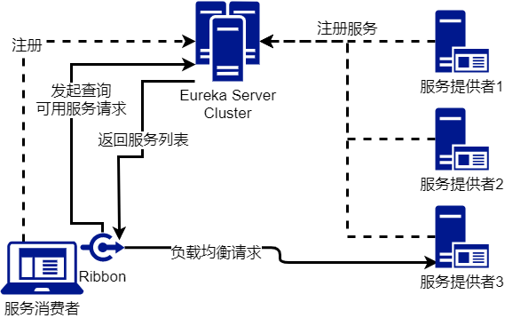
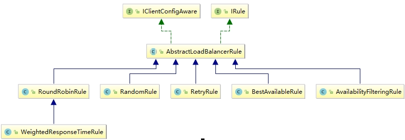

# 远程调用 Ribbon 与 Feign

Ribbon的Github官网：https://github.com/Netflix/ribbon

OpenFeign的Github官网：https://github.com/OpenFeign/feign

远程调用是指可以通过网络的方式调用其他微服务的模块。

## Ribbon 

Spring Cloud Ribbon 是基于 Netflix Ribbon 实现的一套客户端负载均衡的工具。简单的说，Ribbon 是 Netflix 发布的开源项目，主要功能是提供客户端的软件负载均衡算法和服务调用。

Ribbon 客户端组件提供一系列完善的配置项，如：连接超时，重试等。

### 负载均衡LB(Load Balance)

负载均衡就是将用户的请求平摊到各个服务器上，从而实现高可用HA（High Availability）。



>   注意：Ribbon提供的负载均衡为本地负载均衡，即控制负载均衡在服务调用方（消费者）

#### 负载均衡对比

**Ribbon VS Nginx**

-   Nginx：服务器负载均衡，客户端所有请求都会交给nginx，然后由nginx实现转发，及负载均衡是由服务器端实现的
-   Ribbon：本地负载均衡，在调用微服务接口时，会在注册中心上获取注册信息服务器列表之后，缓存到jvm本地，从而在本地实现RPC远程调用技术

**集中式LB VS 进程内LB**

-   集中式LB：及在服务的消费方和提供方之间使用独立的LB设施（可以是硬件，如F5，也可以是软件,如nginx），由该设施负责把请求通过某种策略转发至服务的提供方。
-   进程内LB：将LB逻辑继承到消费方，消费方从服务注册中心获取可调用的地址，然后自己从这些地址中选择出一个合适的服务器；Ribbon就是属于进程内LB，它只是一个类库，集成与消费方进程，消费方通过它来获取到服务提供方的地址。

### Ribbon 远程调用

Ribbon使用 `RestTemplate` 类实现远程调用。ribbon依赖如下：

```xml
<dependency>
    <groupId>org.springframework.cloud</groupId>
    <artifactId>spring-cloud-starter-netflix-ribbon</artifactId>
</dependency>
```

>   Eureka Client 自带Ribbon依赖

#### Ribbon 远程调用

在Eureka Server，Eureka 服务提供者、服务消费者配置完毕的基础上，使用Ribbon实现远程调用步骤：

1.  在消费者端，将 `RestTemplate` 加入IOC容器，同时指定负载均衡

    通过配置类的 `@Bean` 将 `RestTemplate` 加入IOC容器，同时标注 `@LoadBalanced` 来实现负载均衡

    ```java
    @Configuration
    public class RibbonConfig {
        @LoadBalanced
        @Bean
        public RestTemplate getRestTemplate() {
            return new RestTemplate();
        }
    }
    ```

2.  注入并使用 `RestTemplate` 实现远程调用

    ```java
    @Service
    public class RibbonService {
    
        @Autowired
        RestTemplate restTemplate;
    
        // 需要调用的服务名，对应Eureka Server中Applications的名称
        String SERVICE_NAME = "CLOUD-EUREKA-PROVIDER8001";
    
        public Movie getRemoteResult() {
            Movie result = restTemplate.getForObject("http://" + SERVICE_NAME + "/getMovie", Movie.class);
            return result;
        }
    
        public ResponseEntity getRemoteInfo() {
            ResponseEntity<Movie> entity = restTemplate.getForEntity("http://" + SERVICE_NAME + "/getMovie", Movie.class);
            return entity;
        }
    
    }
    ```

    方法说明：

    -   `RestTemplate#getForEntity`：返回调用的结果，浏览器的各种信息：

        ```bash
        <200,Movie{id=1, movieName='流浪地球'},[Content-Type:"application/json", Transfer-Encoding:"chunked", Date:"Sat, 05 Dec 2020 11:51:35 GMT", Keep-Alive:"timeout=60", Connection:"keep-alive"]>
        ```

    -   `RestTemplate#getForObject`：仅发挥调用的结果：

        ```bash
        Movie{id=1, movieName='流浪地球'}
        ```

>   Ribbon在实现远程调用的同时实现了负载均衡。可以启动端口不同，服务名相同的服务，并输出各自的端口号验证。

### Ribbon 负载均衡原理

默认的负载均衡算法为轮询，即依次循环调用每一个微服务。其实现类为 `RoundRobinRule` 。

接口 `IRule` 提供Ribbon的抽象方法,下图是具体的实现类类图



| 负载均衡算法的实现类                    | 描述                                                         |
| --------------------------------------- | ------------------------------------------------------------ |
| com.netflix.loadbalancer.RoundRobinRule | 轮询选择服务器                                               |
| com.netflix.loadbalancer.RandomRule     | 随机选择服务器                                               |
| com.netflix.loadbalancer.RetryRule      | 先轮询策略获取服务,如果失败则在指定时间内重试获取可用服务    |
| WeightedResponseTimeRule                | 对轮询的扩展,响应速度越快的实例选择权重越大                  |
| BestAvailableRule                       | 优先过滤多次访问故障处于断路跳闸状态的服务,然后选择一个并发量最小的服务器 |
| ZoneAvoiddanceRule                      | 默认规则,复合判断server所在区域的性能和server的可用性,以此选择服务器 |


## Fegin 

Feign 是一个声明式的 web 服务客户端，让编写 web 服务客户端变得非常容易，只需创建一个接口并在接口上添加注解即可。Feign 采用
RESTful 接口的方式实现远程调用，取代了 Ribbon 中通过 RestTemplate 的方式进行远程通信。

SpringCloud 对 Feign 进 行 了 封 装 , 使 其 支 持 SpringMVC 标 准 注 解 和 HttpMessageConverters。Feign 可与 Eureka 和 Ribbon 组合使用以支持负载均衡。

Openfeign 是在 Feign 的基础上支持了 SpringMVC 注解(例如@RequestMapping 等)，通过动态代理的方式实现负载均衡调用其他服务

>   简单说OpenFeign就是对Feign的封装，而Feign是对Ribbon+Template的封装。因此OpenFeign也是基于调用方的负载均衡。

### Feign的基本使用

Feign一般用法是通过 `微服务调用接口 + @FeignClient` 的方式调用远程接口。

在准备好Eureka Server、Eureka Client消费者、服务提供者的环境下，具体使用如下：

1.  引入OpenFeign依赖

    ```xml
    <dependency>
        <groupId>org.springframework.cloud</groupId>
        <artifactId>spring-cloud-starter-openfeign</artifactId>
    </dependency>
    ```

2.  激活 OpenFeign：在配置类上标注 `@EnableFeignClients`

    ```java
    @SpringBootApplication
    @EnableFeignClients
    public class CloudConsumerFeignConsumer80Application {
    	public static void main(String[] args) {
    		SpringApplication.run(CloudConsumerFeignConsumer80Application.class, args);
    	}
    }
    ```

3.  创建远程服务调用的接口，创建接口的抽象方法，用于调用远程服务。

    在该接口上标注 `@FeignClient(“<ServiceName>”)`，其中 `<ServiceName>` 为Eureka Service中的服务名（Applications中的服务名称）

    在该方法上标注提供方Controller中对应的映射信息（如RequestMapping，路径，参数要一致）。

    ```java
    @FeignClient("CLOUD-EUREKA-PROVIDER8001")
    public interface OpenFeignService {
    
        @RequestMapping("/getMovie")
        public Movie getMovie();
        
    }
    ```

    一般的，接口方法可以直接从提供方Controller中复制粘贴，然后删除方法体即可。实际上方法名，参数可以不一致。但是返回值和方法映射信息需要一致。

    >   标注了@FeignClient可以不标注 @Service注解，也可以加入到IOC容器中。

4.  其他需要使用的地方直接注入（`@Autowired`）远程调用接口，使用即可

    ```java
    @RestController
    public class OpenFeignController {
    
        // 直接注入使用
        @Autowired
        OpenFeignService openFeignService;
    
        @RequestMapping("/openfeign/rpc")
        public Movie rpc() {
            return openFeignService.getMovie();
        }
    
    }
    ```

### Feign 超时设置

默认 Feign 客户端只等待一秒钟，要是服务端处理需要超过 1 秒钟，则直接抛出异常：`SocketTimeoutException: connect timed out`

Feign可以在在配置文件中修改超时时长：

```properties
# 设置连接超时时长（ms）
ribbon.ConnectTimeout: 5000
# 设置收到回应超时时长（ms）
ribbon.ReadTimeout:5000
```

（配置文件可能没有提示）

>   由ribbon作为前缀的原因：Feign底层实质上是对Ribbon的封装

### OpenFeign 远程调用日志

两步：

1.  向IOC容器中加入 Feign的日志级别枚举类 `Logger.Level`

    ```java
    @Configuration
    public class OpenFeignConfig {
        @Bean
        public Logger.Level getLogger() {
            return Logger.Level.FULL;
        }
    }
    ```

2.  在配置文件中对远程接口进行Debug级别的监控即可。

    ```yaml
    logging:
      level:
        com.atguigu.cloud.service.OpenFeignService: debug
    ```

