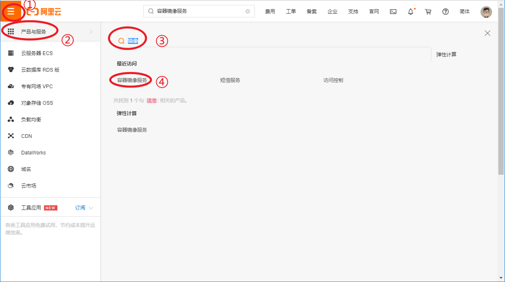
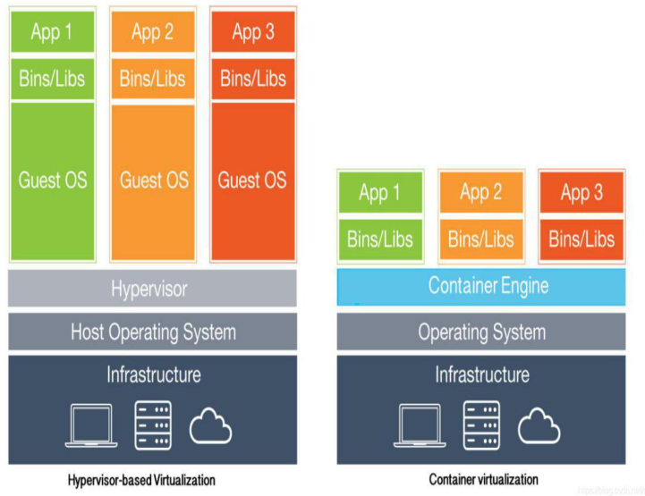

# Docker

镜像注册服务器 https://hub.docker.com

## Docker 简介

Docker 是基于 Go 语言实现的开源容器引擎，供开发人员和系统管理员 使用容器构建，运行和共享应用程序的平台。使用容器来部署应用程序称为容器化。容器并不是新事物,但用于轻松部署应用程序的容器却是新事物。简而言之，Docker就是为了解决开发、运维、测试人员环境不一致、简化环境搭建、迁移、部署而提出的容器化技术。


容器化技术的特点:

-   标准化标准化：每个容器都是标准化、可移植的，因为他们直接运行在宿主机的内核上
-   隔离隔离：容器互相隔离，互不干扰，独立运行
-   高性能高性能：容器性能开销极低，可以实现分钟级甚至秒级的部署和启动
-   版本版本：CE（Community Edition：社区版）和 EE（Enterprise Edition：企业版）

### 镜像简介

Docker 镜像（Image）就是一个只读的模板。镜像可以用来创建 Docker 容器，一个镜像可以创建很多容器。Docker 镜像可以看作是一个特殊的文件系统，除了提供容器运行时所需的程序、库、资源、配置等文件外，还包含了一些为运行时准备的一些配置参数（如匿名卷、环境变量、用户等）。镜像不包含任何动态数据，其内容在构建之后也不会被改变。

Docker 利用容器（Container）独立运行的一个或一组应用。容器是用镜像创建的运行实例。它可以被启动、开始、停止、删除。**每个容器都是相互隔离的、保证安全的平台。**


### 仓库与注册中心

仓库（Repository）是集中存放镜像文件的场所。仓库(Repository)和仓库注册中心（Registry）是有区别的。仓库注册中心服务器上往往存放着多个仓库，每个仓库中又包含了多个镜像，每个镜像有不同的标签（tag）。标签就是对应软件的各个版本。

仓库注册中心分为公开仓库（Public）注册中心和私有仓库（Private）注册中心 两 种 形 式 。 最 大 的 公 开 仓 库 注 册 中 心 是Docker Hub(https://hub.docker.com/)，存放了数量庞大的镜像供用户下载。国内的公开仓库注册中心包括阿里云 、网易云等


## Docker 部署

Docker 镜像下载流程


CentOS7 安装安装 dockerdocker

官网：http://www.docker.com

安装手册：https://docs.docker.com/install/linux/docker-ce/centos

### 安装 Docker

1、安装 yum-utils。

```bash
yum install -y yum-utils device-mapper-persistent-data lvm2
```

yum-utils提供了yum-config-manager相关功能，device-mapper-persistent-data 和 lvm2 是设备映射器驱动程序所需要的。

2、设置 docker 下载镜像

docker 官方下载地址:

```bash
yum-config-manager --add-repo https://download.docker.com/linux/centos/docker-ce.repo
```

**推荐使用阿里云下载地址**

```bash
yum-config-manager --add-repo http://mirrors.aliyun.com/docker-ce/linux/centos/docker-ce.repo
```

3、更新yum软件包索引

```bash
yum makecache fast
```

在更新或配置 yum 源之后,通常都会使用 yum makecache 生成缓存，这个命令是将软件包信息提前在本地缓存一份,用来提高搜索安装软件的速度

4、安装 DOCKER CE

```bash
yum install -y docker-ce docker-ce-cli containerd.io
```

### 启动 Docker

使用 systemctl命令

```bash
systemctl start docker		# 启动 docker 服务:
systemctl stop docker		# 停止 docker 服务:
systemctl status docker		# 查看服务状态
systemctl restart docker	# 重启 docker 服务
systemctl enable docker		# 开机启动
```

### 测试 Docker

```bash
docker version	#查看Docker版本信息
```

### 卸载Docker

依次执行如下命令即可。

```bash
systemctl stop docker
yum remove -y docker-ce
rm -rf /var/lib/docker
```

### 开通阿里云镜像服务

从 docker 的官方镜像仓库服务器上下载 docker 的镜像速度很慢，可以配置国内的容器镜像服务，提升 docker 镜像的下载速度。

进入阿里云个人控制台，搜索 “**容器镜像服务**”。



进入之后选择镜像加速器，选择镜像加速，复制到linux命令行执行即可。


### Docker 运行流程


## Docker 命令

### 常用命令

```bash
docker version	#版本信息
docker info		#详细信息
docker --help	#帮助文档，列出所有docker 命令
```

### 镜像命令

简单的理解，Docker 镜像就是一个 Linux 的文件系统（Root FileSystem），这个文件系统里面包含可以运行在 Linux 内核的程序以及相应的数据。

通过镜像启动一个容器，一个镜像就是一个可执行的包，其中包括运行应用程序所需要的所有内容：包含代码，运行时间，库，环境变量和配置文件等。Docker 把 App 文件打包成为一个镜像，并且采用类似多次快照的存储技术，可以实现：

-   多个 App 可以共用相同的底层镜像（初始的操作系统镜像）；
-   App 运行时的 IO 操作和镜像文件隔离；
-   通过挂载包含不同配置/数据文件的目录或者卷（Volume），单个 App 镜像可以用来运行无数个不同业务的容器。

#### 1、列出本机镜像

```bash
# 命令
docker images [-q] [--no-trunc]

# 表头说明：
REPOSITORY	镜像的名称
TAG			镜像的版本号
IMAGE ID	镜像ID
CREATED		镜像创建时间
SIZE		镜像大小

# 可选参数
-q：只显示镜像id
--no-trunc：显示完整的镜像ID
```

#### 2、查找镜像

```bash
# 命令
docker search [-s] <镜像名称>

# 表头说明
NAME			镜像的名称
DESCRIPTION		镜像描述
STARS			点赞数量
OFFICIAL		是否是官方镜像
AUTOMATED		是否自动化构建,只要代码版本管理网站的项目有更新,就触发自动创建image

# 可选参数
-s <收藏数> 或 --filter=stars=<收藏数>：列出艘苍术不小于指定值的镜像
```

#### 3、下载镜像

```bash
# 命令
docker pull <镜像名称>[:指定版本]
```

下载版本说明：未指定版本的情况下，下载最新的稳定版。如果指定版本了，则下载指定版本的最新版本，如：若当前最新版为1.9.2，则指定版本的效果如下

-   `:latest`：下载1.9.2
-   `:1`：下载1.9.2
-   `:1.9`：下载1.9.2
-   `:1.9.0`：下载1.9.1

#### 4、删除镜像

```bash
# 基本命令
docker rmi [-f] <镜像名称[:指定版本] | 镜像id>

# 参数说明
-f：强制删除，会同时删除创建好的镜像实例

# 批量删除
docker rmi <镜像1> <镜像2>	# 删除多个镜像
docker rmi -f ${docker images -q}	# 删除所有镜像（查出所有镜像的id后，批量删除）
```

#### 5、查看镜像详情

```bash
# 命令
docker inspect <镜像名称 | 镜像Id>
```

### 容器命令

镜像（Image）和容器（Container）的关系，就像是面向对象程序设计中的类和实例一样，镜像是静态的定义，容器是镜像运行时的实体。容器可以被创建、启动、停止、删除、暂停等。

#### 1、查看容器

```bash
# 命令
docker ps [-a] 列出正在运行的容器

# 表头说明
CONTAINER ID	容器id
IMAGE			创建容器的镜像
COMMAND			容器启动调用的命令
CREATED			容器创建时间
STATUS			容器的状态（Created创建/Up启动/Exited退出）
PORTS			容器占用的端口
NAMES			容器名

# 参数说明
-a：列出当前所有已经创建的容器
-l：显示最近创建的一个容器
-n：显示最近n个创建的容器。 docker ps -n 3
-q：只显示容器编号
```

#### 2、创建容器

```bash
# 命令
docker create <镜像名称 | 镜像id> # 根据镜像名称或id创建容器
docker create --name <自定义的名称> 镜像名称 # 根据自定义名称创建容器
```

#### 3、容器操作

```bash
# 基础操作
docker start <容器名称>		#启动容器
docker restart <容器名称>	#重启容器
docker stop <容器名称>		#停止容器
docker kill <容器名称>		#强制停止容器

# 创建并启动容器
docker run <镜像名称>	# 根据镜像名称创建容器并启动
docker run --name <自定义的名称> <镜像名称>	# 给容器起别名,并启动
# 注意: 本地镜像存在时相当于docker create + docker start; 本地镜像不存在时相当于: docker pull + docker create + docker start
```

#### 4、删除容器

```bash
# 基本命令
docker rm [-f] <容器名称>

# 参数说明
-f：强制删除

# 批量删除
docker rm -f$(docker ps -qa)		#删除所有容器，包括正在运行的容器
docker ps -a -q | xargs docker rm	#删除所有容器，不包括正在运行的容器
```

#### 5、其他操作

```bash
exit	# 停止并退出容器
ctrl + P + Q# 不停止退出容器
```

### 容器交互

默认情况下，如果容器启动后无事可做，docker会立刻停止刚刚启动的容器。

#### 1、交互式启动

启动后，当前命令行会自动切换到容器内部

```bash
# 命令
docker run -it --name <自定义的名称> <镜像名称>

# 参数说明
-i：保持容器一直运行，但命令行会挂起，通常与 -t 同时使用；
-t：为容器分配一个伪输入终端，通常与 -i 同时使用
```

**退出容器**

```bash
ctrl + p + q	#不停止退出容器
exit	#容器停止退出，此时执行 docker ps -a，发现 centos 已停止
```

**重新进入容器**

```bash
docker attach <容器ID | 容器名称>
docker exec -it <容器ID|容器名称> /bin/bash	# 在容器中打开新的终端，并且可以启动新的进程
```

**在容器外执行执行容器容器命令**

在容器外部执行命令，使命令在容器内部运行，并返回结果

```bash
docker exec -it <容器名称> cat /etc/redhat-release
```

#### 2、启动守护式容器

默认情况下，诸如 tomcat 的启动会占用当前命令行窗口，并进入挂起状态。如果想要进程以后台方式运行，则需要可以守护式启动容器。

```bash
docker run -d --name <容器名称> <镜像名称>	# 在后台启动，不占用命令行资源
# 参数说明
-d：守护式启动
```

#### 3、端口映射

将docker容器的端口映射到宿主机的端口上。

默认情况下，我们无法通过 docker 所在的宿主机访问 tomcat 容器的 8080 端口，需要将 8080 端口映射到宿主机的某一个端口上。


```bash
# 命令，可以在创建的时候指定端口映射，这里直接用run方法也一样。
docker run -d -p <XXXX:YYYY> --name <自定义的容器名称> <镜像名称>

# 参数说明
-p：指定端口映射
XXXX:YYYY：将容器的YYYY端口映射到宿主机的XXXX端口：<宿主机端口号>:<docker容器端口号>
```


## 数据卷


## Docker 原理

### UnionFS（联合文件系统）

UnionFS（联合文件系统）∶Union文件系统（UnionFS）是一种分层、轻量级并且高性能的文件系统，它支持对文件系统的修改作为一次提交来一层层的叠加，同时可以将不同目录挂载到同一个虚拟文件系统下（unite several directories into asinglevirtual filesystem）。Union文件系统是Docker镜像的基础。镜像可以通过分层来进行继承，基于基础镜像（没有父镜像），可以制作各种具体的应用镜像。

特性∶一次同时加载多个文件系统，但从外面看起来，只能看到一个文件系统，联合加载会把各层文件系统叠加起来，这样最终的文件系统会包含所有底层的文件和目录。

### Docker镜像加载原理

docker的镜像实际上由一层一层的文件系统组成（即UnionFS）

-   bootfs（boot ilesystem）：

    主要包含bootloader和kerne，bootloader主要是引导加载kernel，Linux刚启动时会加载bootfs文件系统，在Docker镜像的最底层是bootfs。这一层与我们典型的Linux/Unix系统是一样的，包含boot加载器和内核。当boot加载完成之后整个内核就都在内存中了，此时内存的使用权已由botfs转交给内核，此时系统也会卸载bootfs。**在 docker 中，最低层是 bootfs，并使用宿主机的 bootfs**

-   rootfs（root file system）：

    bootfs 的上层是 rootfs，被称为 base images，初始化时是将 rootfs 以 readonly 方式加载。因此每一个容器都有一个文件系统，我们可以通过 /bin/bash 进入。包含的就是典型Linux系统中的/de，/proc，/bin，/etc等标准目录和文件。roots就是各种不同的操作系统发行版，比如Ubuntu，Centos等等。

    rootfs 的上层还可以叠加其他的镜像文件，例如 JDK，JDK 上面再叠加Tomcat。

    1．上层的镜像依赖下层的镜像，因此docker中把下层的image称作父镜像，没有父镜像的 image 称作 base image

    2．因此 Tomcat 镜像的体积特别大，因为他至少包含了 rootfs、JDK 和Tomcat 这些基础镜像层

-   一组 readonly 和一个 writeable 的结构构成一个 container


### 分层原理

所有的Docker镜像都起始于一个基础镜像层，当进行修改或增加新的内容时，就会在当前镜像层之上，创建新的镜像层。如下载 tomcat 的过程：可以看出下载 tomcat:8.0 镜像的过程下载了很多 image，这些 image 是 tomcat 镜像所依赖的父 image


### 对比：Docker 容器化技术 与 虚拟化技术



-   容器：创建在操作系统上，程序级，将容器安装在操作系统之上，共享相同的操作系统，直接利用操作系统的内核。

-   虚拟机：创建在操作系统上，操作系统级，拥有唯一的操作系统和负载，依赖于 hypervisor。

 对比项：

| 特性       | 容器                 | 虚拟机             |
| ---------- | -------------------- | ------------------ |
| 启动速度   | 秒级                 | 分钟级             |
| 硬盘使用   | mb级                 | gb级               |
| 性能       | 接近原生             | 弱于原生           |
| 系统支持量 | 单机可容纳上千个容器 | 一般最多只有十几个 |
| 隔离性     | 安全隔离             | 完全隔离           |


## 制作Docker镜像

