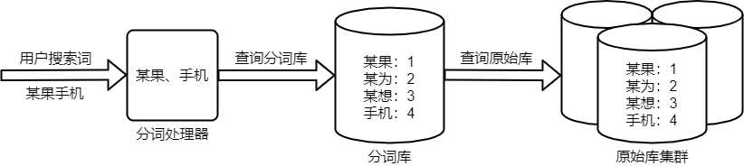
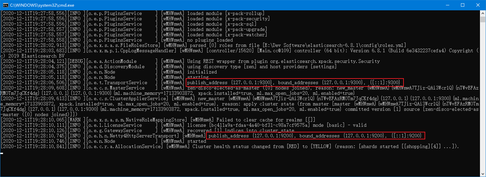
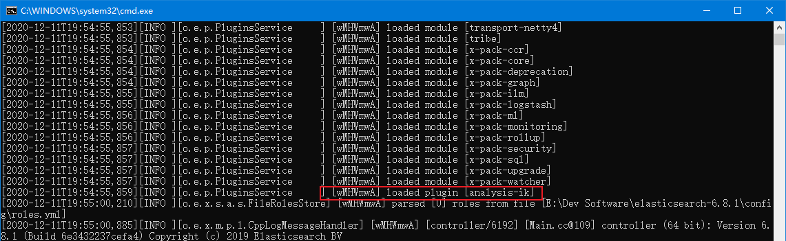
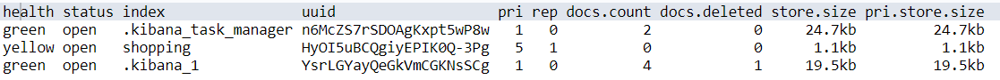

# ElasticSearch

Elaticsearch 简称为 es。

ElasticSearch 官方地址：https://www.elastic.co/cn/

## ES 简介

es是一个开源的高扩展的分布式全文检索引擎。它可以近乎实时的存储、检索数据；本身扩展性很好，可以扩展到上百台服务器，处理PB级别的数据。

ES可以使用Java开发，并使用Lucene作为其核心来实现所有索引和搜索的功能，但是它的目的是通过简单的RESTful API来隐藏Lucene的复杂性，从而让全文搜索变得简单。

ElasticSearch是一个接近实时（Near Real Time，简称NRT）的搜索平台。这意味着，从索引一个文档直到这个文档能够被搜索到有一个轻微的延迟（通常是1秒以内）。

### ElasticSearch 搜索原理

ElasticSearch索引技术是倒排索引的方式。倒排索引的保存数据的方式时：单词 → 记录。每次搜索需要经过如下步骤：



例如搜索 “某果手机”，倒排索引的呈现方式：

| 分词库 | 文档ID | 文档                                            |
| ------ | ------ | ----------------------------------------------- |
| 小米   | 1,3    | Document->[{1,小米手机,1999},{3,小米电视,2999}] |
| 华为   | 2      | Document->[{2,华为手机,4999}]                   |
| 手机   | 1,2    | Document->[{1,小米手机,1999},{2,华为手机,4999}] |
| 电视   | 3      | Document->[{3,小米电视,2999}]                   |
| …      |        |                                                 |

用户搜索时，会把搜索的关键词也进行分词，会把“华为手机”分词分成：华为和手机两个词。这样的话，先用【华为】进行匹配，得到id为2的文档ID，再用【手机】进行匹配，得到id为1,2的文档ID。那么全文索引通常，还会根据匹配程度进行打分，显然2号记录能匹配的次数更多。所以显示的时候以评分进行排序的话，2号记录会排到最前面。

### Lucene与ElasticSearch

-   lucene负责倒排索引，分词处理。

-   Lucene是一个提供全文搜索功能类库的核心工具包，而真正使用它还需要一个完善的服务框架搭建起来进行应用。

-   目前市面上流行的搜索引擎软件，主流的就两款：**Elasticsearch**和**Solr**,这两款都是基于**Lucene**搭建的，可以独立部署启动的搜索引擎服务软件。由于内核相同，所以两者除了服务器安装、部署、管理、集群以外，对于数据的操作 修改、添加、保存、查询等等都十分类似。


## ES 安装部署

先决条件：安装并配置好 JDK8 环境变量

注意：安装路径不能有中文或空格！！！

### ElasticSearch 部署

#### 下载ElasticSearch

ElasticSearch 下载地址：https://www.elastic.co/cn/downloads/past-releases#elasticsearch

Windows 版本直接下载解压即可。

#### 启动 ElasticSearch

双击 `elasticsearch-6.8.1\bin\elasticsearch.bat` 即可启动。



-   9300是ES的通讯端口，用来进行数据传输。
-   9200是Http协议端口，可由浏览器访问。

访问 `http://localhost:9200/` 即可访问ES

```json
{
    "name": "wMHWmwA",
    "cluster_name": "elasticsearch",
    "cluster_uuid": "qNFm-euORLqNxQT34mBB2g",
    "version": {
        "number": "6.8.1",
        "build_flavor": "default",
        "build_type": "zip",
        "build_hash": "1fad4e1",
        "build_date": "2019-06-18T13:16:52.517138Z",
        "build_snapshot": false,
        "lucene_version": "7.7.0",
        "minimum_wire_compatibility_version": "5.6.0",
        "minimum_index_compatibility_version": "5.0.0"
    },
    "tagline": "You Know, for Search"
}
```

>   注意：如果内存小可以通过修改 `elasticsearch-6.8.1\config\jvm.options` 文件22、23行，将堆内存改小一点

### Kibana 部署

Kibana 官方网站：https://www.elastic.co/cn/products/kibana 

Kibana 下载地址：https://www.elastic.co/cn/downloads/past-releases#kibana

Kibana是ElasticSearch的数据可视化和实时分析的工具，利用ElasticSearch的聚合功能，生成各种图表，如柱形图，线状图，饼图等。Kibana相当于ES的客户端（控制台）

#### 下载 Kibana

Windows 版本直接下载解压、版本与ES对应即可。

#### 修改 Kibana 配置

Kibana配置文件位于 `kibana-6.8.1-windows-x86_64\config` 

1、修改通信端口号，使其连接上ES

```yaml
elasticsearch.url: ["http://localhost:9200"]
```

2、修改国际化配置，使其支持中文

```yaml
i18n.locale: "zh-CN"
```

3、修改启动延迟

```yaml
elasticsearch.requestTimeout: 300000
```

#### 启动 Kibana

启动 `kibana-6.8.1-windows-x86_64\bin\kibana.bat` 。

Kibana默认端口号为 5601，访问该端口即可。

### IK分词器

ElasticSearch 默认中文分词只能把中文拆分成单个字符，因此需要引用第三方分词器。

IKAnalyzer是一个开源的，基于Java语言开发的轻量级的中文分词工具包。它是以开源项目Lucene为应用主体的，结合词典分词和文法分析算法的中文分词组件。新版本的IKAnalyzer3.0则发展为面向Java的公用分词组件，独立于Lucene项目，同时提供了对Lucene的默认优化实现。

#### 下载

GitHub仓库地址：https://github.com/medcl/elasticsearch-analysis-ik

#### 安装

直接解压到 `elasticsearch-6.8.1\plugins` 目录下，重命名为 `ik` ，然后重启ES。出现如下字样则表示使用继承 ik 成功：



#### ik的相关说明

K分词器有两种分词模式：ik_max_word和ik_smart模式。

-   ik_max_word：会将文本做最细粒度的拆分

-   ik_smart：会做最粗粒度的拆分，智能拆分


## ES 相关术语

Elasticsearch是面向文档型数据库，一条数据是一个文档，用JSON作为文档序列化的格式，如下：

```json
{
    "name" :     "John",
    "sex" :      "Male",
    "age" :      25,
    "birthDate": "1990/05/01",
    "about" :    "I love to go rock climbing",
    "interests": [ "sports", "music" ]
}
```

ES文档类比MYSQL：

| 类比项            |                  |            |                |              |
| ----------------- | ---------------- | ---------- | -------------- | ------------ |
| Elasticsearch     | 索引(Index)      | 类型(Type) | 文档(Docments) | 字段(Fields) |
| 关系数据库(MySQL) | 数据库(DataBase) | 表(Table)  | 行(Rows)       | 列(Columns)  |

### ES 核心概念

#### 1、索引 Index

一个索引就是一个拥有几分相似特征的文档的集合。一个索引由一个名字来标识（必须全部是小写字母），并且当我们要对这个索引中的文档进行索引、搜索、更新和删除的时候，都要使用到这个名字。在一个集群中，可以定义任意多的索引。

能搜索的数据必须索引，这样的好处是可以提高查询速度，比如：**新华字典**前面的目录就是索引的意思，目录可以提高查询速度。

>   Elasticsearch索引的精髓：一切设计都是为了提高搜索的性能。

#### 2、类型 type

在一个索引中，只能定义一种类型。一个类型是你的索引的一个逻辑上的分类/分区，其语义完全由你来定。通常，会为具有一组共同字段的文档定义一个类型。

>   在ES7版本之后，类型已经被废弃。

#### 3、字段 Field

相当于是数据表的字段，对文档数据根据不同属性进行的分类标识。

#### 4、映射 mapping

mapping是处理数据的方式和规则方面做一些限制，如：某个字段的数据类型、默认值、分析器、是否被索引等等。

这些都是映射里面可以设置的，其它就是处理ES里面数据的一些使用规则设置也叫做映射，按照最优规则处理数据对性能提高很大，因此才需要建立映射，并且需要思考如何建立映射才能对性能更好。

#### 5、文档 document

一个文档是一个可被索引的基础信息单元。

文档以JSON（Javascript Object Notation）格式来表示，而JSON是一个到处存在的互联网数据交互格式。

在一个index/type里面，你可以存储任意多的文档。注意，尽管一个文档，物理上存在于一个索引之中，文档必须被索引/赋予一个索引的type。


## ES 客户端操作（基本语法）

官方文档地址： https://www.elastic.co/guide/en/elasticsearch/reference/current/index.html 

实际开发中，有多种方式操作Elasticsearch：

-   客户端工具：发送http请求(RESTful风格)操作：

    使用**Postman**发送请求直接操作

    使用**ElasticSearch-head-master**图形化界面插件操作

    使用Elastic**官方**数据可视化的平台**Kibana**进行操作【推荐】

-   **Java**代码操作：

    Elasticsearch提供的Java API 客户端进行操作

    Spring Data ElasticSearch 持久层框架进行操作

在kibana中，可以不用写地址和端口，/shopping是简化写法，真实请求地址是：`http://127.0.0.1:9200/shopping`

### 索引库操作

索引库操作相当于对数据库中的库进行操作。

#### 1、创建索引库（index）

```bash
PUT /<索引库名称>
```

**举例**：**PUT /shopping**

响应结果：

```json
#! Deprecation: the default number of shards will change from [5] to [1] in 7.0.0; if you wish to continue using the default of [5] shards, you must manage this on the create index request or with an index template
{
    "acknowledged" : true,
    "shards_acknowledged" : true,
    "index" : "shopping"
}
```

说明：

-   "acknowledged" : true, 代表操作成功 

-   "shards_acknowledged" : true, 代表分片操作成功 

-   "index" : "shopping" 表示创建的索引库名称

#### 2、查看索引状态

```bash
GET /_cat/indices?v	# 固定写法
```

响应如下：



参数说明：

| 表头参数       | 说明                                                         |
| -------------- | ------------------------------------------------------------ |
| health         | 当前服务器健康状态：  green(集群完整) yellow(单点正常、集群不完整) red(单点不正常) |
| status         | 索引打开、关闭状态                                           |
| index          | 索引名                                                       |
| uuid           | 索引统一编号                                                 |
| pri            | 主分片数量                                                   |
| rep            | 副分片数量                                                   |
| docs.count     | 可用文档数量                                                 |
| docs.deleted   | 文档删除状态(逻辑删除，段合并时被清理)                       |
| store.size     | 主分片和副分片整体占空间大小                                 |
| pri.store.size | 主分片占空间大小                                             |

#### 3、查看单个索引

```bash
GET /<索引库名称>
```

响应 + 内容解释：

```json
{
    "shopping【索引库名】" : {
        "aliases【别名】" : { },
        "mappings【映射】" : { },
        "settings【索引库设置】" : {
            "index【索引】" : {
                "creation_date【创建时间】" : "1586587411462",
                "number_of_shards【索引库分片数】" : "5",
                "number_of_replicas【索引库副本数】" : "1",
                "uuid【唯一标识】" : "VCl1hHsJQDe2p2dn46o0NA",
                "version【版本】" : {
                    "created" : "6080199"
                },
                "provided_name【索引库名称】" : "shopping"
            }
        }
    }
}

```

#### 4、删除索引

```bash
DELETE /<索引库名称>
```

响应结果：表示响应成功

```bash
{ "acknowledged" : true }
```

### 映射操作

映射操作相当于数据库中对表进行操作。

#### 1、创建映射类型

发送请求格式：

```json
PUT /索引库名/_mapping/类型名称 或 索引库名/类型名称/_mapping
{
    "properties": {
        "字段名称":{
            "type【类型】": "类型",
            "index【是否索引】": true,
            "store【是否存储】": false,
            "analyzer【分词器】": "具体分词器"
        }
        ...
    }
}
```

类型说明：

**类型名称**：就是前面将的type的概念，类似于数据库中的表 

**type**：类型，Elasticsearch中支持的数据类型非常丰富，如下几个常用的：

-   String类型，又分两种：
    -   text：可分词
    -   keyword：不可分词，数据会作为完整字段进行匹配
-   Numerical：数值类型，分两类
    -   基本数据类型：long、interger、short、byte、double、float、half_float
    -   浮点数的高精度类型：scaled_float
-   Date：日期类型
-   Array：数组类型
-   Object：对象

**index**：是否索引，**默认为****true**，也就是说你不进行任何配置，所有字段都会被索引。

-   true：字段会被索引，则可以用来进行搜索
-   false：字段不会被索引，不能用来搜索

**store**：是否将数据进行独立存储，默认为false

-   原始的文本会存储在**_source**里面，默认情况下其他提取出来的字段都不是独立存储的，是从_source里面提取出来的。当然你也可以独立的存储某个字段，只要设置"store": true即可，获取独立存储的字段要比从_source中解析快得多，但是也会占用更多的空间，所以要根据实际业务需求来设置。

**analyzer**：分词器，这里的**ik_max_word**即使用**ik****分词器**

举例说明：

```json
PUT /shopping/product/_mapping
{
    "properties": {
        "title": {
            "type": "text",
            "analyzer": "ik_max_word"
        },
        "subtitle": {
            "type": "text",
            "analyzer": "ik_max_word"
        },
        "images": {
            "type": "keyword",
            "index": false
        },
        "price": {
            "type": "float",
            "index": true
        }
    }
}
```

响应结果：

```json
#! Deprecation: [types removal] Specifying types in put mapping requests is deprecated. To be compatible with 7.0, the mapping definition should not be nested under the type name, and the parameter include_type_name must be provided and set to false.
{
    "acknowledged" : true
}
#弃用：[类型删除]不建议在放置映射请求中指定类型。 为了与7.0兼容，映射定义不应嵌套在类型名称下，并且必须提供参数include_type_name并将其设置为false。
```

#### 2、查看类型映射

```bash
GET /<索引库名称>/[类型名称]_mapping	# 可以省略类型名称
```

举例：

```bash
GET /shopping/product/_mapping
```

响应：

```json
{
    "shopping" : {
        "mappings" : {
            "product" : {
                "properties" : {
                    "images" : {
                        "type" : "keyword",
                        "index" : false
                    },
                    "price" : {
                        "type" : "float"
                    },
                    "subtitle" : {
                        "type" : "text",
                        "analyzer" : "ik_max_word"
                    },
                    "title" : {
                        "type" : "text",
                        "analyzer" : "ik_max_word"
                    }
                }
            }
        }
    }
}

```

#### 3、创建索引库同时进行映射配置（常用）

```bash
PUT /shopping2
{
  "settings": {},
  "mappings": {
    "product":{
      "properties": {
        "title":{
          "type": "text",
          "analyzer": "ik_max_word"
        },
        "subtitle":{
          "type": "text",
          "analyzer": "ik_max_word"
        },
        "images":{
          "type": "keyword",
          "index": false
        },
        "price":{
          "type": "float",
          "index": true
        }
      }
    }
  }
}
```

### 文档 CRUD 操作

文档的CRUD操作相当于MySQL的CRUD

#### 1、新建文档

语法：

```bash
POST /<索引库名>[/映射名称][/指定id]
{
	"<字段名称>":"<字段内容>",
	"<字段名称>":"<字段内容>",
	...
}
```

举例：

```bash
POST /shopping/product
{
    "title":"小米手机",
    "images":"http://www.gulixueyuan.com/xm.jpg",
    "price":3999.00
}
```

响应结果及解释：

```json
{
    "_index【索引库】" : "shopping",
    "_type【类型】" : "product",
    "_id【主键id】" : "indGaHEB1ahbZ0SRrXt3",
    "_version【版本】" : 1,
    "result【操作结果】" : "created",
    "_shards【分片】" : {
        "total【总数】" : 2,
        "successful【成功】" : 1,
        "failed【失败】" : 0
    },
    "_seq_no" : 0,
    "_primary_term" : 1
}
```

可以看到结果显示为：`created`，是创建成功了。

响应结果中的`_id`字段，是这条文档数据的`唯一标识`，之后的增删改查都依赖这个id作为唯一标示。可以看到id的值为：indGaHEB1ahbZ0SRrXt3。当新增时没有指定id，id为ES随机生成的id。

#### 2、查询文档

语法：

```bash
GET /<索引库名>[/映射名称][/指定id]
```

举例：

```bash
GET /shopping/product/indGaHEB1ahbZ0SRrXt3
```

响应结果及解释：

```json
{
    "_index【索引库】" : "shopping",
    "_type【类型】" : "product",
    "_id【主键id】" : "indGaHEB1ahbZ0SRrXt3",
    "_version【版本】" : 1,
    "_seq_no" : 0,
    "_primary_term" : 1,
    "found【查询结果】" : true,
    "_source【源文档信息】" : {
        "title" : "小米手机",
        "images" : "http://www.gulixueyuan.com/xm.jpg",
        "price" : 3999.0
    }
}
```

#### 3、修改文档

##### 覆盖修改文档

语法：

```bash
POST /<索引库名>[/映射名称]</指定id>
{
	"<字段名称>":"<字段内容>",
	"<字段名称>":"<字段内容>",
	...
}
```

举例：

```bash
POST /shopping/product/1
{
    "title":"华为手机",
    "images":"http://www.gulixueyuan.com/hw.jpg",
    "price":4999.00
}
```

响应结果：

```json
{
    "_index" : "shopping",
    "_type" : "product",
    "_id" : "1",
    "_version" : 2,
    "result" : "updated",
    "_shards" : {
        "total" : 2,
        "successful" : 1,
        "failed" : 0
    },
    "_seq_no" : 2,
    "_primary_term" : 1
}
```

#####  修改部分文档

通过doc关键字来指定要修改的内容，语法：

```bash
POST /<索引库名>[/映射名称]/<指定id>
{
	"doc":{
    	"<字段名称>":"<字段内容>",
        "<字段名称>":"<字段内容>",
        ...
	}
}
```

#### 4、删除文档

删除一个文档不会立即从磁盘上移除，它只是被标记成已删除（逻辑删除）。Elasticsearch会在段合并时（磁盘碎片整理）进行删除内容的清理。

##### 根据id删除

语法：

```bash
DELETE /<索引库名>[/映射名称]/<文档id>
```

响应结果：

```json
{
    "_index" : "shopping",
    "_type" : "product",
    "_id" : "1",
    "_version" : 3,
    "result" : "deleted",	// 让一个一数据不存在，则为 not_found
    "_shards" : {
        "total" : 2,
        "successful" : 1,
        "failed" : 0
    },
    "_seq_no" : 3,
    "_primary_term" : 1
}
```

##### 条件删除

删除符合查询条件的文档，语法：

```bash
POST /<索引库名>[/映射名称]/_delete_by_query
{
  "query":{
    "匹配方式":{
      "<字段名称>":"字段值"
    }
  }
}
```

举例：

```bash
POST /shopping/_delete_by_query
{
  "query":{
    "match":{
      "title":"手机"
    }
  }
}
```

响应结果及解释：

```json
{
    "took【耗时】" : 33,
    "timed_out【是否超时】" : false,
    "total【总数】" : 2,
    "deleted【删除总数】" : 2,
    "batches" : 1,
    "version_conflicts" : 0,
    "noops" : 0,
    "retries" : {
        "bulk" : 0,
        "search" : 0
    },
    "throttled_millis" : 0,
    "requests_per_second" : -1.0,
    "throttled_until_millis" : 0,
    "failures" : [ ]
}
```


## DSL 语句

DSL 查询分为 叶子查询自居与符合查询子句。

-   叶子查询子句：叶子查询自居寻找一个特定的值再某一特定领域，如 `match`、`term` 或 `range` 查询。这些查询可以自己使用
-   复合查询子句：复合查询子句可以包装其他叶子查询或复合查询，可以通过不同逻辑组合多个查询（如`bool` 查询）或更改器行为（如`constant_score`查询）

### Query 查询

叶子查询基本语法：

```bash
GET /<索引库>/_search
{
    "query":{
        "查询类型":{
            "查询条件":"查询条件值"
        }
    }
}
```

-   "query"：这里的query代表一个查询对象，里面可以有不同的查询属性

-   "查询类型"：例如：match_all(代表查询所有)， match，term ， range 等等

-   "查询条件"：查询条件会根据类型的不同，写法也有差异

#### 1、查询所有（match_all）

语法：

```bash
GET /<索引库>/_search
{
  "query": {
    "match_all": {}
  }
}
```

响应结果及解释：

```json
{
    "took【查询花费时间，单位毫秒】" : 1,
    "timed_out【是否超时】" : false,
    "_shards【分片信息】" : {
        "total【总数】" : 5,
        "successful【成功】" : 5,
        "skipped【忽略】" : 0,
        "failed【失败】" : 0
    },
    "hits【搜索命中结果】" : {
        "total【命中总数】" : 3,
        "max_score【所有查询结果中，文档的最高得分】" : 1.0,
        "hits【命中结果集合】" : [
            {
                "_index" : "shopping",
                "_type" : "product",
                "_id" : "2",
                "_score" : 1.0,
                "_source" : {
                    "title" : "华为手机",
                    "images" : "http://www.gulixueyuan.com/hw.jpg",
                    "price" : 4999.0
                }
            },
        ]
    }
}

```

#### 2、匹配查询（match）

匹配查询会将查询的值先做分词操作，然后根据分词来查询文档。


简洁语法：

```bash
GET /<索引库>/_search
{
  "query": {
    "match": {
      "<查询的字段>": "<查询的值>"
    }
  }
}
```

扩展语法：operator 指定分词的关系连接符，默认为or

```bash
GET /<索引库>/_search
{
  "query": {
    "match": {
      "<查询的字段>": {
        "query": "<查询的值>",
        "operator": "and"	# 关系连接符，and为同时满足
      }
    }
  }
}
```

#### 3、多字段匹配查询（multi_match）

多字段分词查询可以查询不同的字段，符合条件的查询到。与match类似，依旧先做分词操作

语法：

```bash
GET /<索引库>/_search
{
  "query": {
    "multi_match": {
        "query": "<查询的值>",
        "fields": ["<字段1>","<字段2>",...]
    }
  }
}
```

#### 4、词条查询（term）

词条查询不进行分词操作，直接查询分词库中对应的词条，然后根据词条到文档库中查询出文档。


```bash
GET /<索引库>/_search
{
  "query": {
    "term": {
      "<查询的字段>": {
        "value": "<查询的词条>"
      }
    }
  }
}
```

#### 5、多词条查询（terms）

terms 查询和 term 查询一样，但它允许你指定多值进行匹配。如果这个字段包含了指定值中的任何一个值，那么这个文档满足条件，类似于mysql的in

```bash
GET /<索引库>/_search
{
  "query": {
    "terms": {
      "<查询的字段>": ["<词条1>","<词条2>",...]
    }
  }
}
```

#### 6、布尔查询（bool）

`bool`把各种其它查询通过`must`（必须 ）、`must_not`（必须不）、`should`（应该）的方式进行组合。布尔查询内可以进行基本查询（match、term、terms等）

```bash
GET /<索引库>/_search
{
  "query": {
    "bool": {	# 进行布尔组合
      "must": [	# 必须匹配
        {
          "<基本查询>": {
            "<查询字段>": "<查询的值>"
          }
        }
      ],
      "must_not": [	# 必须不匹配
        {
          "<基本查询>": {
            "<查询字段>": "<查询的值>"
          }
        }
      ],
      "should": [	# 存在即可
        {
          "<基本查询>": {
            "<查询字段>": "<查询的值>"
          }
        }
      ]
    }
  }
}
```

#### 7、范围查询（range）

`range` 查询找出那些落在指定区间内的数字或者时间。`range`查询允许以下字符：

| **操作符**                  | **说明**   |
| --------------------------- | ---------- |
| gt == (greater than)        | 大于>      |
| gte == (greater than equal) | 大于等于>= |
| lt == (less than)           | 小于<      |
| lte == (less than equal)    | 小于等于<= |

```bash
GET /<索引库>/_search
{
  "query": {
    "range": {	# 范围查询
      "<查询的字段>": {
        "gte": <起始值>,	# 大于等于	
        "lte": <终止值>	# 小于等于
      }
    }
  }
}

```

#### 8、模糊查询（fuzzy）

返回包含与搜索字词**相似**的字词的文档。编辑距离是将一个术语转换为另一个术语所需的一个字符更改的次数。这些更改可以包括：

-   更改字符（box → fox）

-   删除字符（black → lack）

-   插入字符（sic → sick）

-   转置两个相邻字符（act → cat）

为了找到相似的术语，fuzzy查询会在指定的编辑距离内创建一组搜索词的所有可能的变体或扩展。然后查询返回每个扩展的完全匹配。

通过fuzziness修改编辑距离。一般使用默认值AUTO，根据术语的长度生成编辑距离。

**0..2**：必须完全匹配

**3..5**：允许差一个编辑距离

**>5**：允许差两个编辑距离

语法：

```bash
GET /shopping/_search
{
  "query": {
    "fuzzy": {	# 开启模糊查询
      "title": {
        "value": "ccple",	# 文档匹配的为 apple，错了两个字
        "fuzziness": 2	# 允许两字之差
      }
    }
  }
}
```

### _source 结果集过滤

默认情况下，ElasticSearch在搜索的结果中，会把文档中保存在 `_source` 的所有字段都返回。如果我们只想获取其中的部分字段，我们可以添加 `_source` 的过滤

语法：

```bash
GET /<索引库>/_search
{
	"_source": ["<字段1>","<字段2>",...]
    "query":{
        "查询类型":{
            "查询条件":"查询条件值"
        }
    }
}
```

过滤指定字段：`includes` 和 `excludes` 

-   includes：来指定想要显示的字段（默认）
-   excludes：来指定不想要显示的字段

```bash
GET /<索引库>/_search
{
	"_source": {
    	"includes": ["<字段1>","<字段2>",...],
    	"excludes": ["<字段1>","<字段2>",...]
  	},  
    "query":{
        "查询类型":{
            "查询条件":"查询条件值"
        }
    }
}
```

>   结果集过滤与匹配的区别：结果集过滤不影响得分（score），匹配影响得分。

### sort 结果集排序

`sort` 可以让我们按照不同的字段进行排序，并且通过order指定排序的方式。desc降序，asc升序。

```bash
GET /<索引库>/_search
{
    "query":{
        "查询类型":{
            "查询条件":"查询条件值"
        }
    }，
    "sort": [	# 结果集排序
        {
          "<字段1>": {
            "order": "<desc|asc>"	# 指定排序方式
          }
        },
        {
          "<字段2>": {
            "order": "<desc|asc>"
          }
        },
        ...
	]
}
```

### highlight 高亮查询

在进行关键字搜索时，搜索出的内容中的关键字会显示不同的颜色，称之为**高亮。**

-   **pre_tags**：前置标签
-   **post_tags**：后置标签
-   **fields**：需要高亮的字段
-   **title**：这里声明title字段需要高亮，后面可以为这个字段设置特有配置，也可以空

```bash
GET /<索引库>/_search
{
    "query":{
        "查询类型":{
            "查询条件":"查询条件值"
        }
    }，
    "highlight": {	# 开启字段高亮
    	"pre_tags": "<font color='red'>",	#前置标签
        "post_tags": "</font>",		#后置标签
        "fields": {
        	"<需要添加的字段>": {}	#此处花括号留空
        }
	}
}
```

>   原理：在返回结果时，在查询匹配的文字前后加上前置标签与后置标签，如：查询 `手机` ，则会变成如下形式：
>
>   小米手机 -> 小米<font color='red'>手机</font>

### from - size 分页查询

-   from：当前页的起始索引，默认从0开始。 from = (pageNum - 1) * size

-   size：每页显示多少条 

```bash
GET /<索引库>/_search
{
    "query":{
        "查询类型":{
            "查询条件":"查询条件值"
        }
    }，
	"from": <起始页码>,
	"size": <每页显示条数>
}
```

起始页码为：`from = (pageNum - 1) * size`

### aggs 结果集聚合

Elasticsearch中的聚合，包含多种类型，最常用的两种，一个叫`桶`，一个叫`度量`：

-   桶

    桶的作用，是按照某种方式对数据进行分组，每一组数据在ES中称为一个`桶`，例如我们根据国籍对人划分，可以得到`中国桶`、`英国桶`，`日本桶`……或者我们按照年龄段对人进行划分：0~10,10~20,20~30,30~40等。

-   度量

    bucket aggregations 只负责对数据进行分组，并不进行计算，因此往往bucket中往往会嵌套另一种聚合：metrics aggregations即度量。

    分组完成以后，我们一般会对组中的数据进行聚合运算，例如求平均值、最大、最小、求和等，这些在ES中称为`度量`

    比较常用的一些度量聚合方式：

    -   Avg Aggregation：求平均值
    -   Max Aggregation：求最大值
    -   Min Aggregation：求最小值
    -   Percentiles Aggregation：求百分比
    -   Stats Aggregation：同时返回avg、max、min、sum、count等
    -   Sum Aggregation：求和
    -   Top hits Aggregation：求前几
    -   Value Count Aggregation：求总数
    -   ……

#### 1、聚合为桶

聚合桶语法：

```bash
GET /atguigu/_search
{
    "aggs" : {	# 表示聚合
        "<桶的名称>" : {	# 桶的名称 自己取
            "<聚合方式>" : { 
              "field" : "<聚合的字段>"
            }
        }
    }
}
```

举例：根据手机的品牌`attr.brand.keyword`来划分`桶`

```json
GET /atguigu/_search
{
    "size" : 0,
    "aggs" : { 
        "brands" : { 
            "terms" : { 
              "field" : "attr.brand.keyword"
            }
        }
    }
}
```

- size： 查询条数，这里设置为0，因为我们不关心搜索到的数据，只关心聚合结果，提高效率
- aggs：声明这是一个聚合查询，是aggregations的缩写
    - brands：给这次聚合起一个名字，任意。
        - terms：划分桶的方式，这里是根据词条划分
            - field：划分桶的字段

结果：

```json
{
  "took" : 124,
  "timed_out" : false,
  "_shards" : {
    "total" : 2,
    "successful" : 2,
    "skipped" : 0,
    "failed" : 0
  },
  "hits" : {
    "total" : 10,
    "max_score" : 0.0,
    "hits" : [ ]
  },
  "aggregations" : {
    "brands" : {
      "doc_count_error_upper_bound" : 0,
      "sum_other_doc_count" : 0,
      "buckets" : [
        {
          "key" : "华为",
          "doc_count" : 4
        },
        {
          "key" : "小米",
          "doc_count" : 4
        },
        {
          "key" : "oppo",
          "doc_count" : 1
        },
        {
          "key" : "vivo",
          "doc_count" : 1
        }
      ]
    }
  }
}
```

- hits：查询结果为空，因为我们设置了size为0
- aggregations：聚合的结果
- brands：我们定义的聚合名称
- buckets：查找到的桶，每个不同的品牌字段值都会形成一个桶
    - key：这个桶对应的品牌字段的值
    - doc_count：这个桶中的文档数量

#### 2、桶内度量

需要告诉Elasticsearch`使用哪个字段`，`使用何种度量方式`进行运算，这些信息要嵌套在`桶`内，`度量`的运算会基于`桶`内的文档进行

为刚刚的聚合结果添加 求价格平均值的度量：

```bash
GET /atguigu/_search
{
    "size" : 0,
    "aggs" : { 
        "brands" : { 
            "terms" : { 
              "field" : "attr.brand.keyword"
            },
            "aggs":{	# 开启聚合（度量也是聚合）
                "avg_price": {	# 聚合名称
                   "avg": {		# 度量类型，这里为平均值
                      "field": "price"	# 进行度量运算的字段，这里为价格
                   }
                }
            }
        }
    }
}
```

结果：

```json
{
  "took" : 41,
  "timed_out" : false,
  "_shards" : {
    "total" : 2,
    "successful" : 2,
    "skipped" : 0,
    "failed" : 0
  },
  "hits" : {
    "total" : 10,
    "max_score" : 0.0,
    "hits" : [ ]
  },
  "aggregations" : {
    "brands" : {
      "doc_count_error_upper_bound" : 0,
      "sum_other_doc_count" : 0,
      "buckets" : [
        {
          "key" : "华为",
          "doc_count" : 4,
          "avg_price" : {
            "value" : 3999.0
          }
        },
        {
          "key" : "小米",
          "doc_count" : 4,
          "avg_price" : {
            "value" : 3499.0
          }
        },
        {
          "key" : "oppo",
          "doc_count" : 1,
          "avg_price" : {
            "value" : 2799.0
          }
        },
        {
          "key" : "vivo",
          "doc_count" : 1,
          "avg_price" : {
            "value" : 2699.0
          }
        }
      ]
    }
  }
}

```

可以看到每个桶中都有自己的`avg_price`字段，这是度量聚合的结果

#### 3、桶内嵌套桶

桶不仅可以嵌套运算， 还可以再嵌套其它桶。也就是说在每个分组中，再分更多组。

比如：我们想统计每个品牌都生产了那些产品，按照`attr.category.keyword`字段再进行分桶

```bash
GET /atguigu/_search
{
    "size" : 0,
    "aggs" : { 
        "brands" : { 
            "terms" : { 
              "field" : "attr.brand.keyword"
            },
            "aggs":{
                "avg_price": { 
                   "avg": {
                      "field": "price" 
                   }
                },
                "categorys": {	# 桶内嵌套桶
                  "terms": {
                    "field": "attr.category.keyword"
                  }
                }
            }
        }
    }
}
```

部分结果：

```json
{
  "took" : 19,
  "timed_out" : false,
  "_shards" : {
    "total" : 2,
    "successful" : 2,
    "skipped" : 0,
    "failed" : 0
  },
  "hits" : {
    "total" : 10,
    "max_score" : 0.0,
    "hits" : [ ]
  },
  "aggregations" : {
    "brands" : {
      "doc_count_error_upper_bound" : 0,
      "sum_other_doc_count" : 0,
      "buckets" : [
        {
          "key" : "华为",
          "doc_count" : 4,
          "categorys" : {
            "doc_count_error_upper_bound" : 0,
            "sum_other_doc_count" : 0,
            "buckets" : [	# 桶内嵌套的桶
              {
                "key" : "手机",
                "doc_count" : 3
              },
              {
                "key" : "笔记本",
                "doc_count" : 1
              }
            ]
          },
          "avg_price" : {
            "value" : 3999.0
          }
        },
        {
          "key" : "小米",
          "doc_count" : 4,
          "categorys" : {
            "doc_count_error_upper_bound" : 0,
            "sum_other_doc_count" : 0,
            "buckets" : [
              {
                "key" : "手机",
                "doc_count" : 2
              },
              {
                "key" : "电视",
                "doc_count" : 1
              },
              {
                "key" : "笔记本",
                "doc_count" : 1
              }
            ]
          },
          "avg_price" : {
            "value" : 3499.0
          }
        },
        {
          "key" : "oppo",
          "doc_count" : 1,
          "categorys" : {
            "doc_count_error_upper_bound" : 0,
            "sum_other_doc_count" : 0,
            "buckets" : [
              {
                "key" : "手机",
                "doc_count" : 1
              }
            ]
          },
          "avg_price" : {
            "value" : 2799.0
          }
        },
        {
          "key" : "vivo",
          "doc_count" : 1,
          "categorys" : {
            "doc_count_error_upper_bound" : 0,
            "sum_other_doc_count" : 0,
            "buckets" : [
              {
                "key" : "手机",
                "doc_count" : 1
              }
            ]
          },
          "avg_price" : {
            "value" : 2699.0
          }
        }
      ]
    }
  }
}
```

