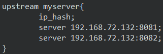

# Nginx

## Nginx 简介


## Nginx 部署

### 环境准备

1、安装C++语言环境

```bash
yum install gcc-c++
```

编译依赖 gcc 环境，如果没有 gcc 环境，需要安装 gcc

2、安装PCRE

```bash
yum install -y pcre pcre-devel
```

PCRE(Perl Compatible Regular Expressions)是一个 Perl 库，包括 perl 兼容的正则表达式库。nginx 的 http 模块使用 pcre 来解析正则表达式，所以需要在 linux 上安装 pcre 库。pcre-devel 是使用 pcre 开发的一个二次开发库。nginx 也需要此库。

3、安装zlib

```bash
yum install -y zlib zlib-devel
```

zlib 库提供了很多种压缩和解压缩的方式，nginx 使用 zlib 对 http 包的内容进行 gzip，所以需要在 linux上安装 zlib 库。

4、安装openssl

```bash
yum install -y openssl openssl-devel
```

OpenSSL 是一个强大的安全套接字层密码库，囊括主要的密码算法、常用的密钥和证书封装管理功能及 SSL
协议，并提供丰富的应用程序供测试或其它目的使用。nginx 不仅支持 http 协议，还支持 https（即在 ssl 协议上传输 http），所以需要在 linux 安装 openssl库。

### 安装 Nginx

1、解压并进入Nginx目录

```bash
tar -zxvf nginx-1.12.2.tar.gz -C /opt/software
cd /opt/software/nginx-1.12.2
```

2、创建nginx临时文件目录

```bash
mkdir -p /var/temp/nginx
```

3、生成 makefile 文件，可用 `./configure --help` 查询详细参数

```bash
./configure \
--prefix=/usr/local/nginx \
--pid-path=/var/run/nginx/nginx.pid \
--lock-path=/var/lock/nginx.lock \
--error-log-path=/var/log/nginx/error.log \
--http-log-path=/var/log/nginx/access.log \
--with-http_gzip_static_module \
--http-client-body-temp-path=/var/temp/nginx/client \
--http-proxy-temp-path=/var/temp/nginx/proxy \
--http-fastcgi-temp-path=/var/temp/nginx/fastcgi \
--http-uwsgi-temp-path=/var/temp/nginx/uwsgi \
--http-scgi-temp-path=/var/temp/nginx/scgi
```

4、编译并安装

```bash
make & make install
```

5、服饰 nginx 命令为全局命令

```bash
cp /usr/local/nginx/sbin/nginx /usr/local/bin/
```

将 nginx 命令复制为全局命令之后，就可以在任意地方使用了。

6、启动 nginx 并测试

```bash
cd /usr/local/nginx/sbin/
./nginx
```

执行./nginx 启动 nginxnginx，这里可以-c-c 指定加载的 nginxnginx 配置文件，如下：

```bash
./nginx -c-c /usr/local/nginx/conf/nginx.conf
```

如果不指定-c-c，nginxnginx 在启动时默认加载 conf/nginx.conf 文件，此文件的地址也可以在编译安装 nginnginx 时指定./configure 的参数（--conf-path= 指向配置文件（nginx.confnginx.conf））


### 开放 Nginx 远程连接

开放80端口

```bash
# 开放端口号
firewall-cmd --add-port=80/tcp --permanent

# 重载防火墙
firewall-cmd --reload

# 查看防火墙状态
firewall-cmd --list-all
```

nginx 默认端口号为80，因此只需要开放80端口即可。

### 访问测试

在Windows上通过访问虚拟机的 ip:port 来测试nginx是否开启成功

测试成功界面：

### Bug解决

解决每次开机都缺少pid文件的小bug

1、打开nginx的配置文件，去掉 pid一行的注释。

```bash
# 打开Nginx配置文件
vim /usr/local/nginx/conf/nginx.conf
```

去掉pid目录的注释：

2、创建对应目录

```bash
mkdir /usr/local/nginx/logs
```

### 设置 Nginx 开机自启

使用服务的形式开机自启：

1、进入 `/lib/systemd/system` 写入 XXX.service，形势如下：

```sh
[Unit]						#服务的说明
Description=nginx service	#描述
After=network.target		#在某项服务启动之后启动，这里为 网络服务

[Service]			#设置服务的参数
Type=forking		#设置后台运行
ExecStart=/usr/local/nginx/sbin/nginx				#设置启动命令
ExecReload=/usr/local/nginx/sbin/nginx -s reload	#设置重载命令
ExecStop=/usr/local/nginx/sbin/nginx -s quit		#设置结束命令
PrivateTmp=true		#是否分配独立的临时空间

[Install]	#用户运行级别相关 
WantedBy=multi-user.target
```

2、设置开机自启，在命令行中输入：

```bash
systemctl enable nginx.service
```

其他相关命令：

```sh
systemctl start nginx.service		启动nginx服务
systemctl stop nginx.service		停止服务
systemctl restart nginx.service		重新启动服务
systemctl list-units --type=service	查看所有已启动的服务
systemctl status nginx.service		查看服务当前状态
systemctl enable nginx.service		设置开机自启动
systemctl disable nginx.service		停止开机自启动
```


## Nginx 常用命令

常用命令如下：

### 1、启动Nginx

去往Nginx目录下，输入：

```bash
./nginx
```

### 2、停止Nginx

去往Nginx目录下，输入：

```bash
# 快速停止
./nginx -s stop

# 完整停止（推荐）
./nginx -s quit
```

-   快速停止：相当于查询出端口号之后，使用kill杀死。

-   完整停止：处理完nginx服务之后关闭

### 3、重启Nginx

```bash
./nginx -s reload
```

当 nginx 的配置文件 nginx.conf 修改后，要想让配置生效需要重启 nginx，使用-s reload 不用先停止nginx 再启动 nginx 即可将配置信息在 nginx 中生效。


## Nginx 配置文件

nginx 安装目录下，其默认的配置文件都放在这个目录的 conf 目录下，而主配置文件 nginx.conf 也在其中，后续对 nginx 的使用基本上都是对此配置文件进行相应的修改。


### 配置文件的组成

Nginx的配置文件可以分为三个区域：全局块，events块，http块。

去除注释版：


#### 全局块

从配置文件开始到 events 块之间的内容，主要会设置一些影响 nginx 服务器整体运行的配置指令，主要包括配置运行 Nginx 服务器的用户（组）、允许生成的 worker process 数，进程 PID 存放路径、日志存放路径和类型以及配置文件的引入等。

这是 Nginx 服务器并发处理服务的关键配置，worker_processes 值越大，可以支持的并发处理量也越多，但是会受到硬件、软件等设备的制约

### events块

events 块涉及的指令主要影响 Nginx 服务器与用户的网络连接，常用的设置包括是否开启对多 work process 下的网络连接进行序列化，是否允许同时接收多个网络连接，选取哪种事件驱动模型来处理连接请求，每个 word process 可以同时支持的最大连接数等。

这部分的配置对 Nginx 的性能影响较大，在实际中应该灵活配置。work process 支持的最大连接数为 1024

### http块

http块可以分为 http全局块与server块

-   http 全局块

    http 全局块配置的指令包括文件引入、MIME-TYPE 定义、日志自定义、连接超时时间、单链接请求数上限等。

-   server 块

    这块和虚拟主机有密切关系，虚拟主机从用户角度看，和一台独立的硬件主机是完全一样的，该技术的产生是为了节省互联网服务器硬件成本。 每个 http 块可以包括多个 server 块，而每个 server 块就相当于一个虚拟主机。 而每个 server 块也分为全局 server 块，以及可以同时包含多个 locaton 块。 

    1.  全局 server 块 

        最常见的配置是本虚拟机主机的监听配置和本虚拟主机的名称或 IP 配置。 

    2.  location 块 

        一个 server 块可以配置多个 location 块。 这块的主要作用是基于 Nginx 服务器接收到的请求字符串（例如 server_name/uri-string），对虚拟主机名称（也可以是 IP 别名）之外的字符串（例如 前面的 /uri-string）进行匹配，对特定的请求进行处理。地址定向、数据缓存和应答控制等功能，还有许多第三方模块的配置也在这里进行。

## Location 指令说明

### location 解析

location指令的解析，相当于访问url的拼串：


例如，访问网址：`http://www.leo.com/edu/a.html`

Nginx 的处理为：选中匹配的location，①+②+uri = `http://` + `192.168.72.132:8080` + `/edu/a.html` 

最终访问的网址：`http://192.168.72.132:8080/edu/a.html`

>   注意：location中 `http://` 后的名称必须与upstream中的名称一致！

### location 语法

该指令用于匹配 URL。语法如下：

```bash
location [=|~|~*|^~|@] <pattern>
```

-   `=`：`location = <pattern>`，用于不含正则表达式的 uri 前，要求请求字符串与 uri 严格匹配，如果匹配成功，就停止继续向下搜索并立即处理该请求。

    格式：

    ```sh
    server {
        server_name localhost;
        
        location = /abc {
        	……
        }
    }
    ```

    匹配：http://192.168.200.168/abc

    不匹配：http://192.168.200.168/abcef

-   `location <pattern>`，没有修饰符，必须以指定模式开头的路径，**区分大小写**

    ```sh
    server {
        server_name localhost;
        location /a/b {	
        	……
        }
    }
    ```

    匹配：

    http://192.168.200.168/a/b
    http://192.168.200.168/a/b/asd
    http://192.168.200.168/a/b/c/sd?id=1

-   `~`：`location ~ <pattern>`，用于表示 uri 包含正则表达式，并且**区分大小写**

    ```sh
    server {
        server_name localhost;
        location ~ ^/abc$ {
        	……
        }
    }
    ```


## Nginx 反向代理

反向代理（Reverse Proxy）方式是指以代理服务器来接受 internet 上的连接请求，然后将请求转发给内部网络上的服务器，并将从服务器上得到的结果返回给 internet 上请求连接的客户端，此时代理服务器对外就表现为一个反向代理服务器。此时反向代理服务器和目标服务器对外就是一个服务器，暴露的是代理服务器地址，隐藏了真实服务器 IP 地址。


反向代理是为服务端服务的，反向代理可以帮助服务器接收来自客户端的请求，帮助服务器做请求转发，负载均衡等。

反向代理对服务端是透明的，对我们是非透明的，即我们并不知道自己访问的是代理服务器，而服务器知道反向代理在为他服务。

### 反向代理案例

假设 `www.leo.com` 是我们要访问的服务器（实际上在windows的host文件中修改，映射到虚拟机IP），则通过如下配置可以起到反向代理的作用

```sh
server {
	listen 80;	#nginx 监听的端口号，匹配则往下走
	server_name  www.leo.com; #nginx监听的url，匹配则往下走

	#nginx监听的路径，匹配则往下走
	location /edu {
		proxy_pass http://192.168.72.132:8080;  #如果该location匹配，则将请求转发到 proxy_pass 指定的url上
	}
	
	#...
}
```


## Nginx 负载均衡

负载均衡，简而言之就是将原先请求集中到单个服务器上的情况改为将请求分发到多个服务器上，将负载分发到不同的服务器。

Nginx拥有负载均衡的能力


### Nginx 负载均衡测试

环境准备：准备2个tomcat服务器，端口分别为 8081 与 8082。

Nginx配置：

```bash
http {

	# 配置负载均衡分发的服务器
	upstream myserver{
		server 192.168.72.132:8081;
		server 192.168.72.132:8082;
	}
	
	# 配置
    server {
        listen       80;
        server_name  localhost;
		
		# 配置拼串引用自定义的 upstream
	    location /edu {
            proxy_pass  http://myserver;
        }
    }
}
```

说明：

使用upstream来指定负载均衡分发的服务器，upstream块 http块的子块。

在 location中引用自定义的upstream时，是使用拼串处理，得到最终的url，使用的是请求转发。

### 负载均衡策略

可以在 upstream 中设置一下集中负载均衡的策略。

-   轮询（默认）：默认情况下就是使用轮询策略，每个请求按时间顺序逐一分配到不同的后端服务器，如果后端服务器 down 掉，能自动剔除。

-   权重（weight）：在每个 server后添加 weight权重，weight 和访问比率成正比。

     

-   地址哈希（ip_hash）：每个请求按访问 ip 的 hash 结果分配，这样每个访客固定访问一个后端服务器，可以解决 session 的问题。可以对每一个 upstream 指定一个 ip_hash。

     

-   fair（第三方，默认不支持）：按后端服务器的响应时间来分配请求，响应时间短的优先分配。

-   down（标识宕机）：可以添加在server行的后面，标识当前 server 不参与负载均衡
-   backup（备用）：可以添加在server行的后面，标识当前server为备用机，当其他非 backup与down的机子繁忙的时候才会转发到这个server上。（负载最轻）


## Nginx 动静分离

由于 nginx 擅长处理静态资源，而 tomcat 擅长处理动态资源，所以为了加快网站的解析速度，可以把动态页面和静态页面由不同的服务器来解析，加快解析速度。降低原来单个服务器的压力。


Nginx 动静分离简单来说就是把动态跟静态请求分开，不能理解成只是单纯的把动态页面和静态页面物理分离。严格意义上说应该是动态请求跟静态请求分开，可以理解成使用 Nginx 处理静态页面，Tomcat 处理动态页面。动静分离从目前实现角度来讲大致分为两种， 一种是纯粹把静态文件独立成单独的域名，放在独立的服务器上，也是目前主流推崇的方案； 另外一种方法就是动态跟静态文件混合在一起发布，通过 nginx 来分开。 通过 location 指定不同的后缀名实现不同的请求转发。

### 动静分离配置

1、保存图片文件到本机的 `/usr/share/nginx/html` 目录中。

 

2、nginx配置文件中只需要修改 location的匹配模式，将静态资源映射到本机某个目录上，而动态资源则不变即可。

```bash
location ~ \.(gif|jpg|jpeg|png|bmp|swf)$ {
	root /usr/share/nginx/html;
}
location ~ \.(jsp|do|action|html)$ {
	proxy_pass http://myserver;
}
```

说明：

-   以 `.gif|jpg|jpeg|png|bmp|swf` 结尾的访问资源保存在Nginx服务器上
-   以 `.jsp|do|action|html` 结尾的访问资源依然通过反向代理转发到其他服务器上

3、网页调用静态资源

```html
<h1> edu/a.html 8081 </h1>

```


## Nginx 集群

Nginx 集群可分为主从模式与双主模式

环境准备：

1、克隆一台虚拟机

2、修改克隆机的网络配置

1.  修改网络配置

    ```sh
    vim /etc/sysconfig/network-scripts/ifcfg-ens33
    ```

    去掉 UUID，并且修改 ip:介于 3-254 之间，并且不能和其它虚拟机 ip 冲突

2.  修改主机名

    ```bash
    vim /etc/hostname
    ```

3.  编辑主机名和ip映射

    ```bash
    vim /etc/hosts
    ```

3、在两台虚拟机上安装 keepalive

```bash
yum install keepalived –y
```

安装完成后，在 /etc 下有keepalived目录，里面有 keepalived.conf 配置文件。

### 主从模式


### 双主模式


## Nginx 优化配置

