# RabbitMQ

## RabbitMQ 简介

### MQ简介

MQ 全称为 Message Queue，是在消息的传输过程中保存消息的容器。多用于分布式系统之间进行通信。

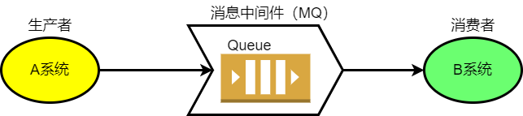

MQ 有三大特点：

1.  本身是一个服务，生产者和消费者都需要连接该服务
2.  底层采用队列(Queue)的数据结构实现先进先出
3.  结构是一个 Pub、Sub 模型(发布、订阅模型)

MQ的优势：

-   任务异步处理：将不需要同步处理的并且耗时长的操作由消息队列通知消息接收方进行异步处理。提高了应用程序的响应时间。
-   应用程序解耦合：MQ 相当于一个中介，生产方通过 MQ 与消费方交互，它将应用程序进行解耦合。
-   削峰填谷：使用了 MQ 之后，在高并发情况下，限制消费消息的速度为 1000，但是这样一来，高峰期产生的数据势必会被积压在 MQ 中，高峰就被“削”掉了。但是因为消息积压，在高峰期过后的一段时间内，消费消息的速度还是会维持在 1000QPS，直到消费完积压的消息,这就叫做“填谷”。

### AMQP 和 JMS

-   AMQP：AMQP 是一种协议，更准确的说是一种 binary wire-level protocol（链接协议）。AMQP 是一种跨语言、跨平台的协议，工作在应用层。RabbitMQ 是 AMQP 协议的实现。

-   JMS：JMS 即 Java 消息服务（JavaMessage Service）应用程序接口，是一个 Java 平台中关于面向消息中间件（MOM）的 API，用于在两个应用程序之间，或分布式系统中发送消息，进行异步通信。JMS 是一种与厂商无关的 API,用来访问消息收发服务（消息中间件）,类似于 java 中的 Jdbc，是一套接口。

AMQP 与 JMSJMS 区别

- JMS 是定义了统一的接口，来对消息操作进行统一；AMQP 是通过规定协议来统一数据交
互的格式
- JMS 限定了必须使用 Java 语言；AMQP 只是协议，不规定实现方式，因此是跨语言的。
- JMS 规定了两种消息模式；而 AMQP 的消息模式更加丰富

### RabbitMQ

RibbitMQ 简介：

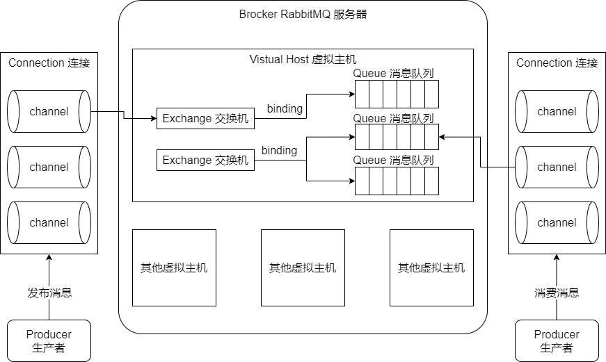

概念介绍：

-   Broker：接收和分发消息的应用，RabbitMQ Server 就是 Message Broker
    Virtual host：出于多租户和安全因素设计的，把 AMQP 的基本组件划分到一个虚拟的分组中，类似于网络中的 namespace 概念。当多个不同的用户使用同一个 RabbitMQ server 提供的服务时，可以划分出多个 vhost，每个用户在自己的 vhost 创建 exchange／queue 等
-   Connection：publisher／consumer 和 broker 之间的 TCP 连接
-   Channel：如果每一次访问 RabbitMQ 都建立一个 Connection，在消息量大的时候建立 TCP Connection 的开销将是巨大的，效率也较低。Channel 是在 connection 内部建立的逻辑连接，如果应用程序支持多线程，通常每个 thread 创建单独的 channel 进行通讯，AMQP method 包含了 channel id 帮助客户端和 message broker 识别channel，所以 channel 之间是完全隔离的。Channel 作为轻量级的 Connection 极大减少了操作系统建立 TCP connection 的开销
-   Exchange:message 到达 broker 的第一站，根据分发规则，匹配查询表中的routing key，分发消息到 queue 中去。常用的类型有：direct (point-to-point), topic (publish-subscribe) and fanout (multicast)
-   Queue：消息最终被送到这里等待 consumer 取走。
-   Binding：exchange 和 queue 之间的虚拟连接，binding 中可以包含 routingkey。Binding 信息被保存到 exchange 中的查询表中，用于 message 的分发依据

RabbitMQ 提供了 6 种模式：简单模式，work 模式，Publish/Subscribe 发布与订阅模式，Routing 路由模式，Topics 主题模式，RPC 远程调用模式（远程调用，不太算 MQ；暂不作介绍）；

官网对应模式介绍：https://www.rabbitmq.com/getstarted.html

RabbitMQ 端口：

-   5672：rabbitMq 的编程语言客户端连接端口
-   15672：rabbitMq 管理界面端口
-   25672：rabbitMq 集群的端口


## RabbitMQ 安装部署

在虚拟机上部署RabbitMQ

### 使用rpm包安装RabbitMQ

1、将三个rpm安装包放入Linux系统

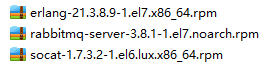

2、先后执行安装命令：

```bash
# 安装erlang语言
rpm -ivh erlang-21.3.8.9-1.el7.x86_64.rpm
# 安装socat工具
rpm -ivh socat-1.7.3.2-1.el6.lux.x86_64.rpm
# 安装RabbitMQ
rpm -ivhrabbitmq-server-3.8.1-1.el7.noarch.rpm
```

解释：RabbitMQ依赖socat工具集，socat需要erlang语言环境。

>   如果rabbitmq安装报错，则使用yum安装 socat：
>
>   `yum install -y socat`

安装成功后rabbitmq命令存放在：`/usr/lib/rabbitmq/lib/rabbitmq_server-3.8.1/sbin/`

3、启用RabbitMQ 控制台管理插件

```bash
rabbitmq-plugins enable rabbitmq_management
```

4、启动RabbitMQ

```bash
# 启动RabbitMQ
systemctl start rabbitmq-server.service
# 其他命令
systemctl status rabbitmq-server.service
systemctl restart rabbitmq-server.service
systemctl stop rabbitmq-server.service
```

5、开放端口号

```bash
# 开放Rabbit控制台
firewall-cmd --add-port=15672/tcp --permanent
# 开放Rabbit消息端口
firewall-cmd --add-port=5672/tcp --permanent
# 重载防火墙
firewall-cmd --reload
```

6、开放外部guest登录权限：

```bash
# loopback_users 中的 <<"guest">>,只保留 guest
vim /usr/lib/rabbitmq/lib/rabbitmq_server-3.8.1/ebin/rabbit.app
```

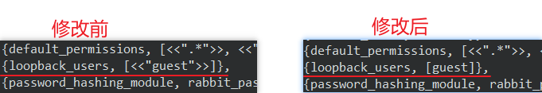

然后重启RabbitMQ服务

```bash
systemctl restart rabbitmq-server
```

### 使用Docker安装RabbitMQ

前提：已安装好Docker环境

1、下载RabbitMQ镜像

```bash
docker pull rabbitmq:management
```

2、创建实例并启动，端口映射

```bash
docker run -d -p 5672:5672 -p 15672:15672 -p 25672:25672 --name rabbitmq rabbitmq:management
```

### RabbitMQ 测试

**访问测试**：访问虚拟机的15672端口


使用guest账号密码登录：


## RabbitMQ 控制台简介

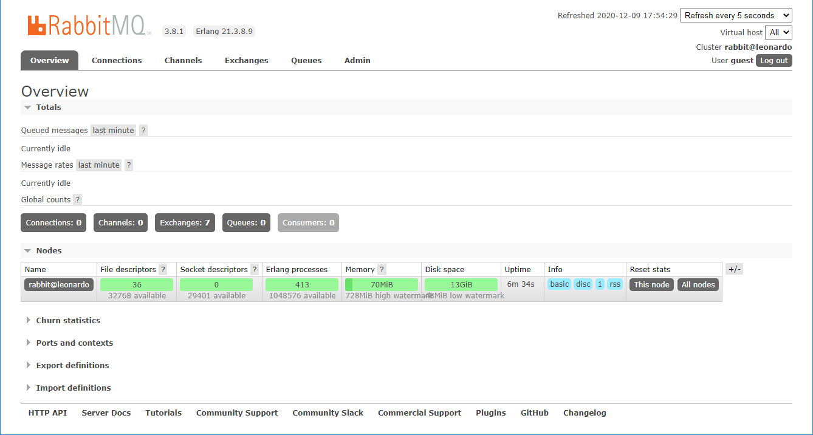

### 控制台选项卡

-   overview：概览
-   connections：无论生产者还是消费者，都需要与 RabbitMQ 建立连接后才可以完成消息的生产和消费，在这里可以查看连接情况
-   channels：通道，建立连接后，会形成通道，消息的投递获取依赖通道。
-   Exchanges：交换机，用来实现消息的路由
-   Queues：队列，即消息队列，消息存放在队列中，等待消费，消费后被移除队列。
-   （管理员）Admin：只有管理员才能看到的选项卡，用于管理RabbitMQ。

### Admin选项卡管理界面

#### 1、用户管理 Users

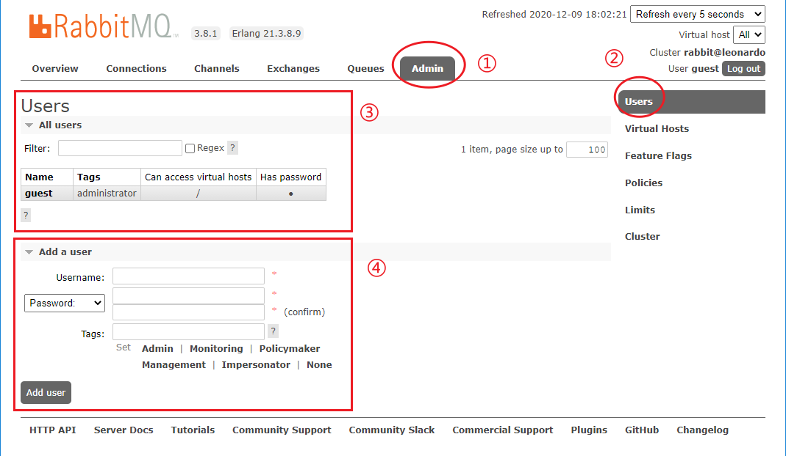

选中①-②即可对用户进行管理。③为用户列表，④为新增用户界面。

用户类型（Tags）介绍：

-   超级管理员(administrator)：可登陆管理控制台，可查看所有的信息，并且可以对用户，策略(policy)进行操作。
-   监控者(monitoring)：可登陆管理控制台，同时可以查看 rabbitmq 节点的相关信息(进程数，内存使用情况，磁盘使用情况等),但不能管理用户
-   策略制定者(policymaker)：可登陆管理控制台, 同时可以对 policy 进行管理。但无法查看节点的相关信息(上图红框标识的部分)。
-   普通管理者(management)：仅可登陆管理控制台，无法看到节点信息，也无法对策略进行管理。
-   其他：无法登陆管理控制台，通常就是普通的生产者和消费者。

#### 2、虚拟主机管理 Virtual Hosts 

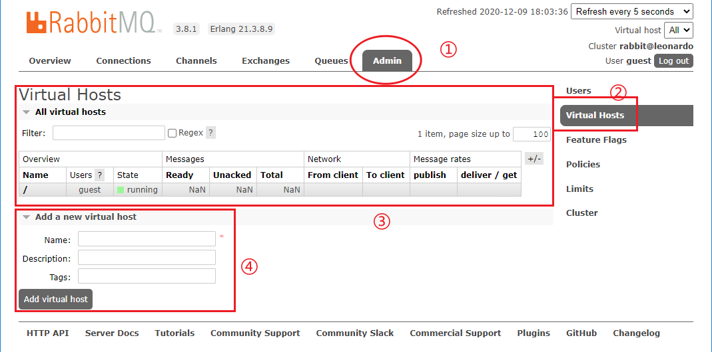

选中①-②即可对虚拟主机进行管理。③为虚拟主机列表，④为新增虚拟主机界面。注意：新增虚拟主机需要以 `/` 开头


## Exchange 交换机

### Exchange 类型

**Exchange**分发消息时根据类型的不同分发策略有区别，目前共四种类型：**direct****、******fanout******、******topic******、**headers** 。headers 匹配 AMQP 消息的 header 而不是路由键， headers 交换器和 direct 交换器完全一致，但性能差很多，目前几乎用不到了，所以直接看另外三种类型：

-   Fanout(广播式): 给每个消息队列都发一个

    每个发到 fanout 类型交换器的消息都会分到所有绑定的队列上去。fanout 交换器不处理路由键，只是简单的将队列绑定到交换器上，每个发送到交换器的消息都会被转发到与该交换器绑定的所有队列上。很像子网广播，每台子网内的主机都获得了一份复制的消息。fanout 类型转发消息是最快的。

    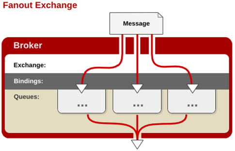

-   Direct(直达式): 直接根据key匹配

    消息中的路由键（routing key）如果和 Binding 中的 binding key 一致， 交换器就将消息发到对应的队列中。路由键与队列名完全匹配，如果一个队列绑定到交换机要求路由键为“dog”，则只转发 routing key 标记为“dog”的消息，不会转发“dog.puppy”，也不会转发“dog.guard”等等。它是完全匹配、单播的模式。

    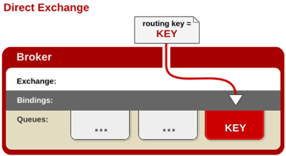

-   Topic(主题式): 可进行模糊匹配

    topic 交换器通过模式匹配分配消息的路由键属性，将路由键和某个模式进行匹配，此时队列需要绑定到一个模式上。它将路由键和绑定键的字符串切分成单词，这些**单词之间用点隔开**。它同样也会识别两个通配符：符号`#`和符号`*`。`#`匹配0个或多个单词，`*`匹配一个单词。

    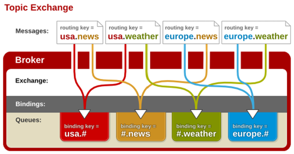


## RabbitMQ 五种队列消息模式

### 环境准备

1、完成RabbitMQ Server的部署

2、引入RabbitMQ的Maven依赖

```xml
<dependency>    
    <groupId>com.rabbitmq</groupId>    
    <artifactId>amqp-client</artifactId>    
    <version>5.6.0</version>
</dependency>
```

### 简单队列模式

![(P) -> [|||] -> (C)](_images/python-one.png)

-   P：生产者，也就是要发送消息的程序

-   C：消费者：消息的接收者，会一直等待消息到来

-   queue：消息队列，图中红色部分。类似一个邮箱，可以缓存消息；生产者向其中投递消息，消费者从其中取出消息

流程：生产者可以随时生产消息，并将消息推送到queue中。消费者阻塞监听queue，如果有符合条件的消息就消费之。

#### 搭建简单消息传递模块

##### 1、编写消息生产者 Producer

编写推送消息代码：具体可以分为如下几步：

```java
@Test
public void testSendMessage() throws IOException, TimeoutException {

    // 1.创建连接工厂
    ConnectionFactory connectionFactory = new ConnectionFactory();
    
    // 2.设置连接信息
    connectionFactory.setUsername("zhangsan");  // 用户名
    connectionFactory.setPassword("123456");    // 密码
    connectionFactory.setHost("192.168.72.132");    //设置RabbitMQ Server的ip
    connectionFactory.setPort(5672);    // 设置 RabbitMQ Server 的端口号
    connectionFactory.setVirtualHost("/v1");    // 设置虚拟主机的名称
    
    // 3.通过工厂获取连接
    Connection connection = connectionFactory.newConnection();
    
    // 4.通过连接创建通道
    Channel channel = connection.createChannel();
    
    /* 5.通过通道声明队列
	* 参数1：队列名称
	* 参数2：是否定义持久化队列
	* 参数3：是否独占本次连接
	* 参数4：是否在不使用的时候自动删除队列
	* 参数5：队列其它参数
	* */
    String queueName = "simple_queue";
    channel.queueDeclare(queueName, true, false, false, null);
    
    // 6.通过通道发布消息
    String message = "Hello RabbitMQ~~";
    channel.basicPublish("", queueName, null, message.getBytes());
    
    // 7.关闭连接
    channel.close();
    connection.close();

}
```

##### 3、编写消费者 Consumer

编写消费者步骤如下：

```java
// 内部类的形式继承 DefaultConsumer，并重写其中的 handleDelivery 方法
static class MyConsumer extends DefaultConsumer {
    public MyConsumer(Channel channel) {
        super(channel);
    }
    @Override
    public void handleDelivery(String consumerTag,  // 消费者标签，在channel.basicConsume指定
                               Envelope envelope,   // rabbitMQ中处理相关信息，比如用了哪个通道、哪个虚拟主机等
                               AMQP.BasicProperties properties, // 属性信息
                               byte[] body) throws IOException {    // Provider发布的消息
        System.out.println("消费者的Tag：" + consumerTag);
        System.out.println("消息的Tag：" + envelope.getDeliveryTag());
        System.out.println("交换机的ID： = " + envelope.getExchange());
        System.out.println("路由的ID： = " + envelope.getRoutingKey());
        System.out.println("收到的消息为：" + new String(body, "utf-8"));
    }
}

public static void main(String[] args) throws Exception {
    // 1.创建连接工厂
    ConnectionFactory connectionFactory = new ConnectionFactory();
    
    // 2.设置连接信息
    connectionFactory.setUsername("zhangsan");  // 用户名
    connectionFactory.setPassword("123456");    // 密码
    connectionFactory.setHost("192.168.72.132");// 设置RabbitMQ Server的ip
    connectionFactory.setPort(5672);    	// 设置 RabbitMQ Server 的端口号
    connectionFactory.setVirtualHost("/v1");// 设置虚拟主机的名称
    
    // 3.通过工厂获取连接
    Connection connection = connectionFactory.newConnection();
    
    // 4.通过连接创建通道
    Channel channel = connection.createChannel();
    
    // 5.创建消费者并设置消息处理
    Consumer consumer = new MyConsumer(channel);
    
    /** 6.监听RabbitMQ的消息
	* 参数一：设置监听的队列
	* 参数二：设置是否自动回送确认消息
	* 参数三：设置收到消息后回调的消费者 
	* */
    channel.basicConsume("simple_queue", true, consumer);

    // 消费者不需要关闭连接，保持阻塞监听队列消息即可
}
```

说明：

`DefaultConsumer` 的 `handleDelivery` 方法是真正接收到RabbitMQ队列数据的方法，因此需要重写。

>   注意：消费者不能使用单元测试，否则无法处于阻塞监听状态！

### work queue模式


-   p：消息提供者

-   C：多个消费者

一个生产者对应多个消费者，每条消息只能被一个消费者获取。（多个消费端共同消费同一个队列中的消息）。

#### 搭建work queue模式模块

##### 1、编写消息提供者

```java
@Test
public void testSendMessage() throws IOException, TimeoutException {

    // 1.创建连接工厂
    ConnectionFactory connectionFactory = new ConnectionFactory();

    // 2.设置连接信息
    connectionFactory.setUsername("zhangsan");  // 用户名
    connectionFactory.setPassword("123456");    // 密码
    connectionFactory.setHost("192.168.72.132");    //设置RabbitMQ Server的ip
    connectionFactory.setPort(5672);    // 设置 RabbitMQ Server 的端口号
    connectionFactory.setVirtualHost("/v1");    // 设置虚拟主机的名称

    // 3.通过工厂获取连接
    Connection connection = connectionFactory.newConnection();

    // 4.通过连接创建通道
    Channel channel = connection.createChannel();

    /* 5.通过通道声明队列
	* 参数1：队列名称
	* 参数2：是否定义持久化队列
	* 参数3：是否独占本次连接
	* 参数4：是否在不使用的时候自动删除队列
	* 参数5：队列其它参数
	* */
    String queueName = "simple_queue";
    channel.queueDeclare(queueName, true, false, false, null);

    // 6.通过通道发布消息
    String message = "Hello RabbitMQ~~";
    channel.basicPublish("", queueName, null, message.getBytes());

    // 7.关闭连接
    channel.close();
    connection.close();

}
```

##### 2、创建多个消费者

work模式的消费者有两种工作状态：1、平均分配；2、能者多劳

-   平均分配：每个work分配到的消息数量一致

    开启平均分配：设置自动消息确认即可。

    ```java
    public class WorkMessageConsumer {
       
       private static class MyConsumer extends DefaultConsumer {
          
          public MyConsumer(Channel channel) {
             super(channel);
          }
          
          @Override
          public void handleDelivery(String consumerTag, Envelope envelope, AMQP.BasicProperties properties, byte[] body) throws IOException {  
             System.out.println("消费者的Tag：" + consumerTag);
             System.out.println("消息的Tag：" + envelope.getDeliveryTag());
             System.out.println("交换机的ID： = " + envelope.getExchange());
             System.out.println("路由的ID： = " + envelope.getRoutingKey());
             System.out.println("收到的消息为：" + new String(body, "utf-8"));
          }
          
       }
       
       public static void main(String[] args) throws Exception {
           
          ConnectionFactory connectionFactory = new ConnectionFactory();
           
          connectionFactory.setUsername("zhangsan");  
          connectionFactory.setPassword("123456");    
          connectionFactory.setHost("192.168.72.132");
          connectionFactory.setPort(5672);
          connectionFactory.setVirtualHost("/v1");    
           
          Connection connection = connectionFactory.newConnection();
           
          Channel channel = connection.createChannel();
           
          MyConsumer myConsumer = new MyConsumer(channel);
          // 监听消息队列：开启自动回复ack即可（第二个参数为true）
          channel.basicConsume("simple_queue", true, myConsumer);
       }
       
    }
    ```

-   能者多劳：按照每个work自己的能力来获取消息

    关闭自动回复ack，手动回复ack，且在**较慢的work**设置通道每次获取消息的数量为有限个数（1）

    ```java
    public class WorkMessageConsumer {
    
        private static class MyConsumer extends DefaultConsumer {
    
            Channel channel;
    
            public MyConsumer(Channel channel) {
                super(channel);
                this.channel = channel;
            }
    
            @Override
            public void handleDelivery(String consumerTag, Envelope envelope, AMQP.BasicProperties properties, byte[] body) throws IOException {
                System.out.println("消费者的Tag：" + consumerTag);
                System.out.println("消息的Tag：" + envelope.getDeliveryTag());
                System.out.println("交换机的ID： = " + envelope.getExchange());
                System.out.println("路由的ID： = " + envelope.getRoutingKey());
                System.out.println("收到的消息为：" + new String(body, "utf-8"));
                
                /*睡1毫秒，模拟该worker慢一些*/
    			try {
    				Thread.sleep(1);
    			} catch (InterruptedException e) {
    				e.printStackTrace();
    			}
                
                // 在此处回复ack（第二个参数为false）
                channel.basicAck(envelope.getDeliveryTag(), false);
            }
    
        }
    
        public static void main(String[] args) throws Exception {
    
            ConnectionFactory connectionFactory = new ConnectionFactory();
    
            connectionFactory.setUsername("zhangsan");
            connectionFactory.setPassword("123456");
            connectionFactory.setHost("192.168.72.132");
            connectionFactory.setPort(5672);
            connectionFactory.setVirtualHost("/v1");
    
            Connection connection = connectionFactory.newConnection();
    
            Channel channel = connection.createChannel();
    
            MyConsumer myConsumer = new MyConsumer(channel);
    
            // 监听消息队列，关闭自动回复ack（第二个参数为false）
            channel.basicConsume("simple_queue", false, myConsumer);
        }
    
    }
    ```

### 发布/订阅模式

订阅模式示例图：一次同时向多个消费者发送消息

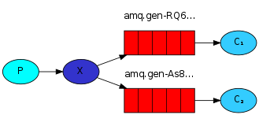

- P：生产者，也就是要发送消息的程序，但是不再发送到队列中，而是发给 X（交换机）
- C：消费者，消息的接受者，会一直等待消息到来。
- Queue：消息队列，接收消息、缓存消息。
- X：交换机（Exchange）：用于处理信息源的转发，这里采用 `fanout` 模式，广播到每一个**绑定的**queue上。

#### 搭建发布订阅模式模块

##### 1、编写消息提供者

```java
public static void main(String[] args) throws IOException, TimeoutException {
    ConnectionFactory connectionFactory = new ConnectionFactory();

    connectionFactory.setUsername("zhangsan");
    connectionFactory.setPassword("123456");
    connectionFactory.setHost("192.168.72.132");
    connectionFactory.setPort(5672);
    connectionFactory.setVirtualHost("/v1");

    Connection connection = connectionFactory.newConnection();
    Channel channel = connection.createChannel();

    // 声明fanout形式的交换机
    channel.exchangeDeclare("pub_sub_exchange", "fanout");

    String message = "你好~广播形式的交换机！我是消息发布者！！";

    // 让消息队列绑定到交换机里
    channel.queueBind("pub_sub_queue1", "pub_sub_exchange", "");
    channel.queueBind("pub_sub_queue2", "pub_sub_exchange", "");

    // 发布消息,消息发送到交换机里
    channel.basicPublish("pub_sub_exchange", "", null, message.getBytes());


    channel.close();
    connection.close();
}
```

##### 2、编写消息消费者（多个）

由于多个消费者接收消息形式相同，因此只写一个，改变其声明的queue即可

```java
public static void main(String[] args) throws IOException, TimeoutException {
    ConnectionFactory connectionFactory = new ConnectionFactory();

    connectionFactory.setUsername("zhangsan");
    connectionFactory.setPassword("123456");
    connectionFactory.setHost("192.168.72.132");
    connectionFactory.setPort(5672);
    connectionFactory.setVirtualHost("/v1");

    Connection connection = connectionFactory.newConnection();
    Channel channel = connection.createChannel();

    // 声明此通道监听的queue
    channel.queueDeclare("pub_sub_queue1", true, false, false, null);

    DefaultConsumer consumer = new DefaultConsumer(channel) {
        @Override
        public void handleDelivery(String consumerTag, Envelope envelope, AMQP.BasicProperties properties, byte[] body) throws IOException {
            System.out.println("Consumer_ID: " + consumerTag);
            System.out.println("Exchange_ID: " + envelope.getExchange());
            System.out.println("Delivery_ID:" + envelope.getDeliveryTag());
            System.out.println("Route_KEY: " + envelope.getRoutingKey());
            System.out.println("String Message: " + new String(body, "UTF-8"));
        }
    };
    
    // 开始监听
    System.out.println("Consumer Start Listening...");
    channel.basicConsume("pub_sub_queue1", true, consumer);
}
```

>   注意，消息提供者模块绑定队列需要先有队列，因此先启动消费者模块，在启动生产者模块

### Direct 路由模式

路由模式：有选择性的接收消息，通过声明路由器时 `routingKey` 指定。

路由模式特点：
- 队列与交换机的绑定，不能是任意绑定了，而是要指定一个`RoutingKey`（路由 key）
- 消息的发送方在 向 Exchange 发送消息时，也必须指定消息的 `RoutingKey`。
- Exchange 不再把消息交给每一个绑定的队列，而是根据消息的`Routing Key`进行判断，只有队列的`Routingkey`与消息的 `Routing key`完全一致，才会接收到消息


- P：生产者，向 Exchange 发送消息，发送消息时，会指定一个 routing key。
- X：Exchange（交换机），接收生产者的消息，然后把消息递交给 与 routing key完全匹配的队列
- C1：消费者，其所在队列指定了需要 routing key 为 error 的消息
- C2：消费者，其所在队列指定了需要 routing key 为 info、error、warning 的消息

#### 路由模式搭建模块

##### 1、路由模式生产者

```java
public static void main(String[] args) throws IOException, TimeoutException {
    ConnectionFactory connectionFactory = new ConnectionFactory();

    connectionFactory.setUsername("zhangsan");
    connectionFactory.setPassword("123456");
    connectionFactory.setHost("192.168.72.132");
    connectionFactory.setPort(5672);
    connectionFactory.setVirtualHost("/v1");

    Connection connection = connectionFactory.newConnection();
    Channel channel = connection.createChannel();

    // 声明交换机，类型为 direct
    channel.exchangeDeclare("direct_exchange", "direct");

    // 发送的消息
    String message = "你好，我是Route模式的消息，Exchange类型为direct";

    // 绑定两个queue到指定交换机的 routingKey上
    channel.queueBind("queue1", "direct_exchange", "action1");
    channel.queueBind("queue2", "direct_exchange", "action2");

    // 发布消息到 routingKey指定的queue中
    // 修改 routingKey 就可以修改路由到的key
    channel.basicPublish("direct_exchange", "action2", null, message.getBytes());

    channel.close();
    connection.close();
}
```

##### 2、消费者，二合一，在一个方法中监听

```java
public static void main(String[] args) throws IOException, TimeoutException {
    ConnectionFactory connectionFactory = new ConnectionFactory();

    connectionFactory.setUsername("zhangsan");
    connectionFactory.setPassword("123456");
    connectionFactory.setHost("192.168.72.132");
    connectionFactory.setPort(5672);
    connectionFactory.setVirtualHost("/v1");

    Connection connection = connectionFactory.newConnection();
    Channel channel = connection.createChannel();

    // 创建消费者
    DefaultConsumer consumer = new DefaultConsumer(channel) {
        @Override
        public void handleDelivery(String consumerTag, Envelope envelope, AMQP.BasicProperties properties, byte[] body) throws IOException {
            System.out.println("Consumer_ID: " + consumerTag);
            System.out.println("Exchange_ID: " + envelope.getExchange());
            System.out.println("Delivery_ID:" + envelope.getDeliveryTag());
            System.out.println("Route_KEY: " + envelope.getRoutingKey());
            System.out.println("String Message: " + new String(body, "UTF-8"));
        }
    };

    // 声明queue
    channel.queueDeclare("queue1", true, false, false, null);
    channel.queueDeclare("queue2", true, false, false, null);

    // 监听消息队列1，当routingKey = action1 时接收消息
    System.out.println("Start listen queue1...");
    channel.basicConsume("queue1", true, consumer);
    // 监听消息队列2，当routingKey = action2 时接受消息
    System.out.println("Start listen queue2...");
    channel.basicConsume("queue2", true, consumer);
}
```

### Topic 通配符匹配模式

主题模式：`Topic`类型`Exchange`可以让队列在绑定`Routing key` 的时候使用通配符！


通配符规则：

`#`：匹配一个或多个词

`*`：匹配不多不少恰好 1 个词

举例：

`item.#`：能够匹配`item.insert.abc` 或者 `item.insert`

`item.*`：只能匹配`item.insert

#### 搭建Topic模式模块

##### 1、主题模式生产者

```java
public static void main(String[] args) throws IOException, TimeoutException {
    ConnectionFactory connectionFactory = new ConnectionFactory();

    connectionFactory.setUsername("zhangsan");
    connectionFactory.setPassword("123456");
    connectionFactory.setHost("192.168.72.132");
    connectionFactory.setPort(5672);
    connectionFactory.setVirtualHost("/v1");

    Connection connection = connectionFactory.newConnection();
    Channel channel = connection.createChannel();

    // 声明类型为topic的交换机
    channel.exchangeDeclare("topic_exchange", "topic");

    // 绑定消息队列到 topic交换机上
    channel.queueBind("topic_queue1", "topic_exchange", "item.*");
    channel.queueBind("topic_queue2", "topic_exchange", "item.#");
    channel.queueBind("topic_queue3", "topic_exchange", "item.msg");

    // 发布消息，使用不同的占位符作为routingKey
    channel.basicPublish("topic_exchange", "item.t", null, "路由key为 `item.t` 的消息".getBytes());
    channel.basicPublish("topic_exchange", "item.news", null, "路由key为 `item.news` 的消息".getBytes());
    channel.basicPublish("topic_exchange", "item.msg", null, "路由key为 `item.msg` 的消息".getBytes());

    channel.close();
    connection.close();
}
```

##### 2、主题模式消费者

```java
public static void main(String[] args) throws IOException, TimeoutException {
    ConnectionFactory connectionFactory = new ConnectionFactory();

    connectionFactory.setUsername("zhangsan");
    connectionFactory.setPassword("123456");
    connectionFactory.setHost("192.168.72.132");
    connectionFactory.setPort(5672);
    connectionFactory.setVirtualHost("/v1");

    Connection connection = connectionFactory.newConnection();
    Channel channel = connection.createChannel();

    // 声明几个消息队列
    channel.queueDeclare("topic_queue1", true, false, false, null);
    channel.queueDeclare("topic_queue2", true, false, false, null);
    channel.queueDeclare("topic_queue3", true, false, false, null);

    DefaultConsumer consumer = new DefaultConsumer(channel) {
        @Override
        public void handleDelivery(String consumerTag, Envelope envelope, AMQP.BasicProperties properties, byte[] body) throws IOException {
            System.out.println("Consumer_ID: " + consumerTag);
            System.out.println("Exchange_ID: " + envelope.getExchange());
            System.out.println("Delivery_ID:" + envelope.getDeliveryTag());
            System.out.println("Route_KEY: " + envelope.getRoutingKey());
            System.out.println("String Message: " + new String(body, "UTF-8"));
        }
    };

    // 监听消息队列的消息
    System.out.println("Start to listening...");
    channel.basicConsume("topic_queue1", true, consumer);
    channel.basicConsume("topic_queue1", true, consumer);
    channel.basicConsume("topic_queue1", true, consumer);
}
```

### 小结：

1、简单模式 HelloWorld：一个生产者、一个消费者，不需要设置交换机（使用默认的交换机）

2、工作队列模式 WorkWork QueueQueue：一个生产者、多个消费者（竞争关系），不需要设置交换机（使用默认的交换机）

3、发布订阅模式 Publish/subscribe：需要设置类型为 fanout 的交换机，并且交换机和队列进行绑定，当发送消息到交换机后，交换机会将消息发送到绑定的队列

4、路由模式 Routing：需要设置类型为 direct 的交换机，交换机和队列进行绑定，并且指定 routing key，当发送消息到交换机后，交换机会根据 routing key 将消息发送到对应的队列

5、通配符模式 TopicTopic：需要设置类型为 topic 的交换机，交换机和队列进行绑定，并且指定通配符方式的routing key，当发送消息到交换机后，交换机会根据 routing key 将消息发送到对应的队列

>   注意：交换机，队列的声明及关系绑定（及代码中的 `xxxDeclare` 与 `queueBind` 方法）都可以由第三方或rabbitMQ控制台来实现。


## RabbitMQ 消息确认机制

消息一旦被消费者接收，队列中的消息就会被删除。因此RabbitMQ需要知道消息是否被处理。RabbitMQ 有消息确认（ACK）机制。当消费者获取消息后，会向 RabbitMQ 发送回执 ACK，告知消息已经被接收。消息确认机制分为以下两种：

-   自动确认
-   手动确认

### 自动确认

消息一旦被接收，消费者自动发送 ACK。

自动确认代码：

```java
// 第二个参数为true，则开启自动确认。
channel.basicConsume("simple_queue", true, consumer);
```

缺陷：当遇到错误，异常或消费者服务在自动回传之后宕机了，但却没有执行正常的业务逻辑，则会造成消息并未被真正消费掉。

### 手动确认

消息接收后，不会发送 ACK，需要手动调用

手动确认代码：

```java
// 第二个参数为false，则关闭自动确认。
channel.basicConsume("simple_queue", false, consumer);

// 在处理消息的最后，手动确认，如：在重写 handleDelivery 方法结束之前发送 ack
@Override
public void handleDelivery(String consumerTag, Envelope envelope, AMQP.BasicProperties properties, byte[] body) throws IOException {    
    // 业务逻辑处理，指定对应传递者
    channel.basicAck(envelope.getDeliveryTag(), false);
}
```


## SpringBoot 整合 RabbitMQ

在 spring boot 项目中只需要引入对应的amqp 启动器依赖即可，方便的使用RabbitTemplate 发送消息，使用注解接收消息。

### 快速上手

基本使用步骤如下：

#### 1、编写消息提供者

1、引入amqp 依赖

```xml
<dependency>
    <groupId>org.springframework.boot</groupId>
    <artifactId>spring-boot-starter-amqp</artifactId>
</dependency>
```

2、编写 SpringBoot配置文件，指定RabbitMQ的url，port及用户名密码等信息

```properties
server.port=12010
spring.rabbitmq.host=192.168.72.132
spring.rabbitmq.password=leonardo
spring.rabbitmq.port=5672
spring.rabbitmq.username=leonardo
spring.rabbitmq.virtual-host=/leo
```

3、使用配置类来声明 **交换机、消息队列及绑定关系**。这一步可以由第三方来实现

```java
@Configuration
public class RabbitmqConfig {

    // 声明交换机
    @Bean
    public Exchange buildExchange() {
        return ExchangeBuilder.topicExchange("SPRING_RABBIT_EXCHANGE").durable(true).build();
    }

    // 声明队列
    @Bean
    public Queue getQueue() {
        return QueueBuilder.durable("SPRING_QUEUE").build();
    }

    // 绑定交换机与队列
    @Bean
    public Binding bindExchangeAndQueue(Exchange exchange, Queue queue) {
        return BindingBuilder
            .bind(queue)	// 绑定队列
            .to(exchange)	// 到交换机上
            .with("a.#")	// with用于指定路由key，可以传入一个或多个（枚举）
            .noargs();	//	没有参数
    }

}
```

4、编写消息提供者

```java
@SpringBootTest
class RabbitmqProviderApplicationTests {

    @Autowired
    RabbitTemplate rabbitTemplate;

    @Test
    void contextLoads() {
        System.out.println("rabbitTemplate = " + rabbitTemplate);
        rabbitTemplate.convertAndSend("SPRING_RABBIT_EXCHANGE", "c.b", "hello spring rabbitmq");
    }
}
```

#### 2、编写消息消费者

1、引入amqp 依赖

```xml
<dependency>
    <groupId>org.springframework.boot</groupId>
    <artifactId>spring-boot-starter-amqp</artifactId>
</dependency>
```

2、消费者配置

```properties
server.port=12010
spring.rabbitmq.host=192.168.72.132
spring.rabbitmq.port=5672
spring.rabbitmq.virtual-host=/leo
spring.rabbitmq.username=leonardo
spring.rabbitmq.password=leonardo
# simple-listener容器使用一个额外线程处理消息  direct-listener（监听器）容器直接使用consumer线程
spring.rabbitmq.listener.type=simple
# 能者多劳
spring.rabbitmq.listener.simple.prefetch=1
# 初始化多个消费者线程，避免消息堆积
spring.rabbitmq.listener.simple.concurrency=3
```

3、编写队列监听器，用于监听消息

```java
@Component
public class RabbitmqListener {

    @RabbitListener(queues = "SPRING_QUEUE")
    public void listenMethod(String msg, Channel channel, Message message) {
        System.out.println("收到消息：" + msg);
    }

}
```

### 交换机、队列与绑定关系的创建

有多种方式可以创建交换机、消息队列及绑定关系

1.  在配置类中创建(SpringBoot)

2.  在监听者创建(SpringBoot)

3.  第三方创建

#### 1、在配置类中创建交换机、队列及绑定关系

```java
package com.example.rabbitmq.provider.config;

import org.springframework.amqp.core.*;
import org.springframework.context.annotation.Bean;
import org.springframework.context.annotation.Configuration;

@Configuration
public class RabbitmqConfig {

    // 创建交换机
    @Bean
    public Exchange buildExchange() {
        return ExchangeBuilder.topicExchange("SPRING_RABBIT_EXCHANGE").durable(true).build();
    }

    // 创建队列
    @Bean
    public Queue getQueue() {
        return QueueBuilder.durable("SPRING_QUEUE").build();
    }

    // 创建绑定队列到交换机上及RoutingKey
    @Bean
    public Binding bindExchangeAndQueue(Exchange exchange, Queue queue) {
        return BindingBuilder
            .bind(queue)	// 绑定队列
            .to(exchange)	// 到交换机上
            .with("a.#")	// with用于指定路由key，可以传入一个或多个（枚举）
            .noargs();		// no args 没有参数
    }

}
```

#### 2、在监听者创建交换机、队列及绑定关系

```java
// 在监听方法上声明交换机，队列及绑定关系与routingKey
@RabbitListener(bindings = @QueueBinding(
        value = @Queue(value = "SPRING_QUEUE2", durable = "true"),
        exchange = @Exchange(value = "SPRING_RABBIT_EXCHANGE2", type = ExchangeTypes.TOPIC, ignoreDeclarationExceptions = "true"),
        key = "c.#"
))
public void listenMethod2(String msg, Channel channel, Message message) {
    System.out.println("收到消息：" + msg);
}
```

### 设置消息到达回调

1、在**消息提供方**的Springboot配置文件配置开启回调。

```properties
# SIMPLE-同步确认（阻塞） CORRELATED-异步确认
spring.rabbitmq.publisher-confirm-type=simple   
# 确认消息是否到达队列
spring.rabbitmq.publisher-returns=true
```

2、在消息提供方的配置类中，对RabbitTemplate进行设置：

```java
@Autowired
RabbitTemplate rabbitTemplate;

@PostConstruct
public void init() {
    
    // 设置数据到达交换机的回调函数
    rabbitTemplate.setConfirmCallback((correlationData, ack, cause) -> {
        if (ack) {
            log.info("数据已到达交换机");
        } else {
            log.warn("数据未到达交换机");
        }
    });

    // 设置数据未到达队列的回调函数
    rabbitTemplate.setReturnCallback((message, replyCode, replyText, exchange, routingKey) -> {
        log.warn("数据未到达队列！消息id：{}, 交换机：{}, 路由键：{}, 消息内容：{}"
                 , message.getMessageProperties().getMessageId(), exchange, routingKey, new String(message.getBody()));
    });
}
```
>   消息交换机回调：无论消息是否到达都会回调，ack为回调状态
>
>   消息队列回调：当消息无法到达消息队列时才回调

### 设置手动确认消息

在**消费者端**，手动确认消息可以控制更加细粒化地控制消息返回的时机，用于事务的控制，步骤如下：

1、Springboot配置：关闭自动确认

```properties
# manual-手动  auto-自动（无异常直接确认，有异常无限重试） none-不重试
spring.rabbitmq.listener.simple.acknowledge-mode=manual
```

2、在监听方法中，根据不同业务逻辑做不同的操作

```java
@RabbitListener(queues = "SPRING_QUEUE")
public void listenMethod(String msg, Channel channel, Message message) throws IOException {
    try {
        System.out.println("收到消息：" + msg);
        int i = 1 / 0;
        // 手动确认消息
        channel.basicAck(message.getMessageProperties().getDeliveryTag(), false);
    } catch (Exception e) {
        e.printStackTrace();
        // 此方法可以判断消息是否重入队
        if (!message.getMessageProperties().getRedelivered()) {
            // 未重入队，则为第一次的消息，则重入
            channel.basicReject(message.getMessageProperties().getDeliveryTag(), true);
        } else {
            // 已重入队，则为第二次的消息，则丢弃
            channel.basicNack(message.getMessageProperties().getDeliveryTag(), false, false);
        }
    }
}
```

>   basicReject 与 basicNack：
>
>   -   basicReject 一次只能拒绝一条消息。
>   -   basicNack 一次可以拒绝多条消息，可以nack该消费者先前接收未ack的所有消息。nack后的消息也会被自己消费到。

### 绑定死信队列

**死信队列：**如果队列里的消息出现以下情况：

1. 消息被否定确认，使用 `channel.basicNack` 或 `channel.basicReject` ，并且此时`requeue` 属性被设置为`false`。
2. 消息在队列的存活时间超过设置的TTL时间。
3. 消息队列的消息数量已经超过最大队列长度。

那么该消息将成为“死信”。

“死信”消息会被RabbitMQ进行特殊处理，如果配置了死信队列信息，那么该消息将会被丢进死信队列中，如果没有配置，则该消息将会被丢弃。

>   官方并没有死信队列名词，通常意义上将死信（dead-letter）存放的队列称为死信队列。

#### 消息的延时处理

死信队列一般与延时队列配合使用时可以作延时处理，原理是当延时队列的消息过期后，过期消息被放入死信队列，此时有Listener监听死信队列，从死信队列获取消息并处理。

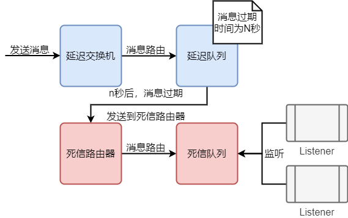

**延迟-死信队列应用场景**：

-   订单在十分钟之内未支付则自动取消。
-   新创建的店铺，如果在十天内都没有上传过商品，则自动发送消息提醒。
-   账单在一周内未支付，则自动结算。
-   用户注册成功后，如果三天内没有登陆则进行短信提醒。
-   用户发起退款，如果三天内没有得到处理则通知相关运营人员。
-   预定会议后，需要在预定的时间点前十分钟通知各个与会人员参加会议。

**使用步骤**：

1. 声明延时交换机

2. 声明延时队列

    ```
    x-message-ttl：指定TTL时间
    x-dead-letter-exchange：死信转发所需的死信交换机（DLX）
    x-dead-letter-routing-key：转发死信时的routingKey（DLK）
    ```

3. 延时队列绑定到延时交换机

4. 声明死信交换机（DLX）

5. 声明死信队列（DLQ）

6. 死信队列绑定到死信交换机，rontingKey要和第2步的DLK一致。

**消息提供方**：

```java
@Configuration
public class DeadLetterConfig {

    // 声明延迟交换机（需要延迟处理的消息都发到这）
    @Bean
    public TopicExchange delayExchange() {
        return ExchangeBuilder.topicExchange("DELAY_EXCHANGE").durable(true).build();
    }

    // 声明延迟队列，需要指定消息过期后存放的死信交换机及交换机的路由key
    @Bean
    public Queue delayQueue() {
        return QueueBuilder.durable("DELAY_QUEUE")
                       .withArgument("x-message-ttl", 60000)   //延迟时间，单位毫秒
                       .withArgument("x-dead-letter-exchange", "SPRING_DEAD_EXCHANGE")   //指定死信交换机
                       .withArgument("x-dead-letter-routing-key", "dead.*")  //指定死信交换机路由键
                       .build();
    }

    // 绑定延迟队列到延迟交换机上
    @Bean
    public Binding delayBinding(Exchange delayExchange, Queue delayQueue) {
        return BindingBuilder.bind(delayQueue).to(delayExchange).with("delay.*").noargs();
    }

    // 声明死信交换机，名称由延迟队列指定
    @Bean
    public TopicExchange deadExchange() {
        return ExchangeBuilder.topicExchange("SPRING_DEAD_EXCHANGE").build();
    }

    // 声明死信队列
    @Bean
    public Queue deadQueue() {
        return QueueBuilder.durable("SPRING_DEAD_QUEUE").build();
    }

    // 绑定死信队列到死信交换机上，routingKey由延迟队列指定
    @Bean
    public Binding deadBinding(Exchange deadExchange, Queue deadQueue) {
        return BindingBuilder.bind(deadQueue).to(deadExchange).with("dead.*").noargs();
    }

}
```

**消息消费方**：监听死信队列即可。

```java
@RabbitListener(queues = "SPRING_DEAD_QUEUE")
public void listenDeadQueueMethod(String message){
    System.out.println(message);
    // 业务逻辑
}
```


# RabbitMQ 面试题

## 1、如何避免消息堆积

1.  搭建消费者集群（配置能者多劳：channel.basicQos(1)）
    	spring.rabbitmq.listener.simple.prefetch=1
2.  开启多线程消费
    	spring.rabbitmq.listener.simple.concurrency=4


## 2、如何避免消息丢失

在每个环节进行确认，确认完毕后再进行下一步。

1.  生产者确认：确保消息发送给mq

    ```properties
    spring.rabbitmq.publisher-confirm-type=correlated/simple/none
    spring.rabbitmq.publisher-returns=true
    ```

    ```java
    // 配置类中
    rabbitTemplate.setConfirmCallback();
    rabbitTemplate.setReturnCallback();
    ```

2.  消息持久化：确保mq服务器即使宕机也不会丢失消息。交换机持久化（默认） 队列持久化（默认） 消息持久化（默认）

3.  消费者确认：确保消息正确无误的消费

    -   原生API：
        		自动确认：只要消费者获取到消息即确认
        		手动确认：

    -   springboot：

        -   none-不确认模式，只要消费者获取到消息，消息即确认掉，相当于原生API中的自动确认

        -   auto-自动确认默认，如果消费者在处理消息的过程中没有异常即确认，如果出现异常会无限重试

        -   manual-手动确认模式，相当于原生API中的手动确认：

            ```java
            channel.basicAck() ;
            channel.basicNack(); 
            channel.basicReject();
            ```

            

## 3、如何确保消息顺序性？

一个消费者，或者设置为排他队列（exclusive），为了保证性能，可以使用多线程消费（公平锁或者jvm的queue）

>   当一个消费者消费后就无法使用其他消费者消费 


## 4、怎么避免消息的重复消费？（幂等性问题）

1.  rabbitmq的队列可以同时有多个消费者（工作模型），但是每个消息只能被一个消费者消费。这个维度没有重复消费问题

2.  如果在消费消息的过程中出现异常重试，可能会导致重复消费。

    如果使用的是关系型数据库，可以结合事务防止重复消费

    如果是非关系型数据库，只能手动回滚