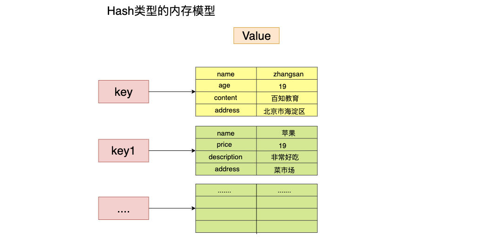
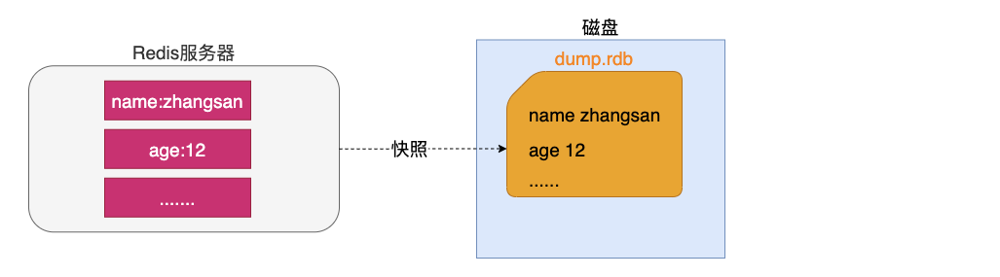
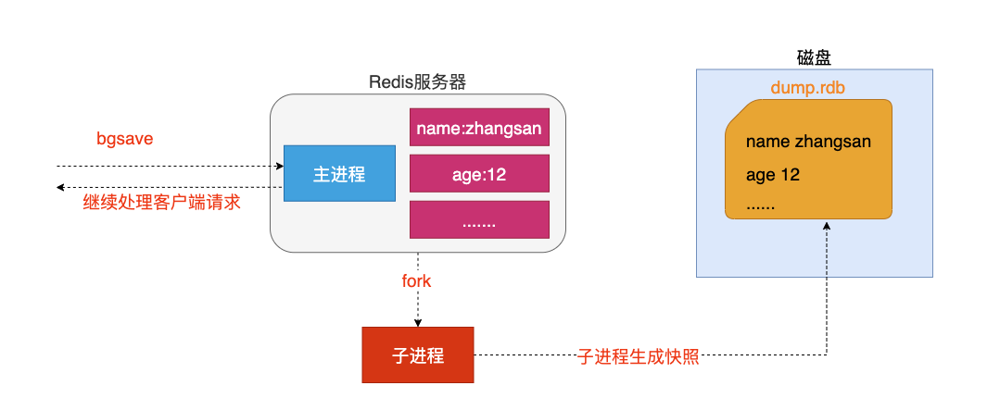
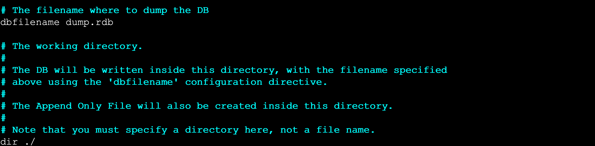
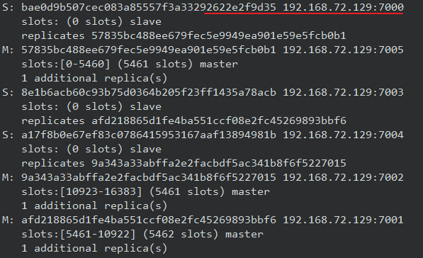

# Redis

## NoSql简介

**NoSQL**(` Not Only SQL` )，意即**不仅仅是SQL**, 泛指非关系型的数据库。Nosql这个技术门类,早期就有人提出,发展至2009年趋势越发高涨。

随着互联网网站的兴起，传统的关系数据库在应付动态网站，特别是超大规模和高并发的纯动态网站已经显得力不从心，暴露了很多难以克服的问题。如`商城网站中对商品数据频繁查询`、`对热搜商品的排行统计`、`订单超时问题`、以及微信朋友圈（音频，视频）存储等相关使用传统的关系型数据库实现就显得非常复杂，虽然能实现相应功能但是在性能上却不是那么乐观。nosql这个技术门类的出现，更好的解决了这些问题，它告诉了世界不仅仅是sql。

### NoSql的分类

Nosql分为四类，分别为

-   键值存储数据库

    这一类数据库主要会使用到一个哈希表，这个表中有一个特定的键和一个指针指向特定的数据。

    特点：

    - Key/value模型对于IT系统来说的优势在于简单、易部署。  
    - 但是如果DBA只对部分值进行查询或更新的时候，Key/value就显得效率低下了。

    相关产品：

    - Tokyo Cabinet/Tyrant,
    - Redis
    - SSDB
    - Voldemort 
    - Oracle BDB

-   列存储数据库

    这部分数据库通常是用来应对分布式存储的海量数据。

    特点：

    - 键仍然存在，但是它们的特点是指向了多个列。这些列是由列家族来安排的。

    相关产品：

    - Cassandra、HBase、Riak.

-   文档型数据库

    文档型数据库的灵感是来自于Lotus Notes办公软件的，而且它同第一种键值存储相类似该类型的数据模型是版本化的文档，半结构化的文档以特定的格式存储，比如JSON。文档型数据库可 以看作是键值数据库的升级版，允许之间嵌套键值。而且文档型数据库比键值数据库的查询效率更高

    特点：

    - 以文档形式存储

    相关产品：

    - MongoDB、CouchDB、 MongoDb(4.x). 国内也有文档型数据库SequoiaDB，已经开源。

-   图形数据库

    图形结构的数据库同其他行列以及刚性结构的SQL数据库不同，它是使用灵活的图形模型，并且能够扩展到多个服务器上。

    相关产品：

    - Neo4J、InfoGrid、 Infinite Graph、

### NoSQL应用场景

- 数据模型比较简单

- 需要灵活性更强的IT系统

- 对数据库性能要求较高

- 不需要高度的数据一致性


## Redis简介


官方简介：Redis is an open source (BSD licensed), in-memory data structure store, used as a database, cache and message broker. It supports data structures such as strings, hashes, lists, sets, sorted sets with range queries, bitmaps, hyperloglogs, geospatial indexes with radius queries and streams. Redis has built-in replication, Lua scripting, LRU eviction, transactions and different levels of on-disk persistence, and provides high availability via Redis Sentinel and automatic partitioning with Redis Cluster. 

翻译：Redis是一个开源，在内存中存储的数据结构的东东。被用于作为数据库，缓存与数据中间件。支持string，hash，set等数据类型。支持集群部署，主从复制等巴拉巴拉。

### Redis特点

-  Redis是一个高性能key/value内存型数据库

-  Redis支持丰富的数据类型 

-  Redis支持持久化 

-  Redis单线程,单进程


## Redis的安装与启动

windows安装只需要下载安装包，然后解压即可。

linux安装步骤如下：

环境准备：

-   linux环境：CentOS 7
-   gcc 语言环境：yum install -y gcc

### 安装步骤

1.  解压 redis 的 gz 文件

    ```bash
    tar -zxvf redis-5.0.5.tar.gz -C <要解压的目录>
    ```

2.  进入解压好的文件夹，编译并安装redis文件

    ```bash
    make MALLOC=libc
    make install PREFIX=<要安装的目录>
    ```
    
3.  配置环境变量

    ```bash
    # 1. 编辑 环境变量
    vim /etc/profile
    
    # 2. 添加环境变量
    export REDIS_HOME=<redis的安装目录>
    export PATH=$PATH:$REDIS_HOME/bin
    
    # 3. 刷新profile文件
    source /etc/profile
    ```

4.  可以设置后台启动，更改其配置文件 `redis.conf`

    ```bash
    daemonize yes
    ```

    然后启动 `redis-server` 时以指定配置文件启动

    ```bash
    # 假设 redis.conf 在安装目录下
    /usr/local/redis/bin/redis-server /redis/local/redis/bin/redis.conf
    ```

### 使用 Redis

安装好redis后，发现redis的安装目录下多了一个src目录，该目录就是redis编译安装完成之后的目录，有关redis服务启动，客户端启动的文件都在此目录下。

#### 启动redis的服务端

进入src目录下，输入如下命令即可启动redis服务端

```markdown
./redis-server [配置文件目录]
```

-   配置文件目录可以指定（支持相对路径），默认使用redis-server中的shell脚本的配置


#### 启动redis客户端

进入src目录下，输入如下命令即可启动redis客户端

```
./redis-cli [-h hostname] [-p port]
```

-   -h：指定主机名，缺省值为本机ip
-   -p：指定端口号，缺省值为6379


**客户端显示中文**

```
./redis-cli  -p 7000 --raw
```

### 设置对外开放

开放连接：找到redis.conf 文件，更改如下配置；

```bash
# 绑定指定ip设为空
bind 0.0.0.0

# 关闭保护模式
protected-mode no
```

开放端口：防火墙开放redis的端口

```bash
firewall-cmd --zone=public --add-port=<redis端口号>/tcp --permanent
```

>   注意：需要重载防火墙配置 `firewall-cmd --reload`

### 设置开机启动

可以设置redis为开机启动，在 `/etc/rc.d/rc.local` 开机启动命令集中写入如下内容：

```bash
#让java环境变量在此执行文件执行之前生效。
source /etc/profile 

# 启动redis，指定配置文件，假设 redis.conf 在安装目录下
/usr/local/redis/bin/redis-server /usr/local/redis/redis.conf
```

然后给予该文件执行权限

```bash
chmod +x /etc/rc.d/rc.local
```


## Redis 数据库指令

### Redis数据库说明

redis默认配置有16个库，从编号为从0到15。客户端可以在连接时与进入Redis后使用 `select n` 来指定数据库。数据库之间数据相互隔离。

库的数量可以在redis.conf 配置文件中进行修改。

### 数据库的指令

- 清空当前的库：`FLUSHDB`
- 清空全部的库：`FLUSHALL`
- 查看库的键值对数量：`DBSIZE`
- 切换库：`SELECT <db:number>`

### 操作key相关指令

key指的是在Redis中的键，由于Redis使用键值对存储数据，因此可以根据唯一的key找到对应的数据。


**DEL**

- 语法 :  `DEL <key> [key ...] `
- 作用 :  删除给定的一个或多个key 。不存在的key 会被忽略。
- 可用版本： >= 1.0.0
- 返回值： 被删除key 的数量。 

**EXISTS**

- 语法:  `EXISTS <key>`
- 作用:  检查给定key 是否存在。
- 可用版本： >= 1.0.0
- 返回值： 若key 存在，返回1 ，否则返回0。

**EXPIRE**

- 语法:  `EXPIRE <key> <seconds>`
- 作用:  为给定key 设置生存时间，当key 过期时(生存时间为0 )，它会被自动删除。
- 可用版本： >= 1.0.0
- 时间复杂度： O(1)
- 返回值：设置成功返回1 。

**PEXPIRE**

- 语法 :  `PEXPIRE <key> <milliseconds>`
- 作用 :  这个命令和EXPIRE 命令的作用类似，但是它以毫秒为单位设置key 的生存时间，而不像EXPIRE 命令那样，以秒为单位。
- 可用版本： >= 2.6.0
- 时间复杂度： O(1)
- 返回值：设置成功，返回1  key 不存在或设置失败，返回0

**PEXPIREAT**

- 语法 :  `PEXPIREAT <key> <milliseconds-timestamp>`
- 作用 :  这个命令和EXPIREAT 命令类似，但它以毫秒为单位设置key 的过期unix 时间戳，而不是像EXPIREAT那样，以秒为单位。
- 可用版本： >= 2.6.0
- 返回值：如果生存时间设置成功，返回1 。当key 不存在或没办法设置生存时间时，返回0 。(查看EXPIRE 命令获取更多信息)

**PERSIST**

-   语法：`PERSIST <key>`
-   作用：清除存活时间（使之变为永久）

**TTL**

- 语法 :   `TTL <key>`
- 作用 :   以秒为单位，返回给定key 的剩余生存时间(TTL, time to live)。
- 可用版本： >= 1.0.0
- 返回值：
    当key 不存在时，返回-2 。
    当key 存在但没有设置剩余生存时间时，返回-1 。
    否则，以秒为单位，返回key 的剩余生存时间。
- Note : 在Redis 2.8 以前，当key 不存在，或者key 没有设置剩余生存时间时，命令都返回-1 。

**PTTL**

- 语法 :  `PTTL <key>`
- 作用 :  这个命令类似于TTL 命令，但它以毫秒为单位返回key 的剩余生存时间，而不是像TTL 命令那样，以秒为单位。
- 可用版本： >= 2.6.0
- 返回值： 当key 不存在时，返回-2 。当key 存在但没有设置剩余生存时间时，返回-1 。
- 否则，以毫秒为单位，返回key 的剩余生存时间。
- 注意 : 在Redis 2.8 以前，当key 不存在，或者key 没有设置剩余生存时间时，命令都返回-1 。

**KEYS**

- 语法 :  `KEYS <pattern>`
- 作用 :  查找所有符合给定模式pattern 的key 。
- 语法 :

	KEYS * 匹配数据库中所有key 。
	KEYS h?llo 匹配hello ，hallo 和hxllo 等。
	KEYS h*llo 匹配hllo 和heeeeello 等。
	KEYS h[ae]llo 匹配hello 和hallo ，但不匹配hillo 。特殊符号用 "\" 隔开
- 可用版本： >= 1.0.0
- 返回值： 符合给定模式的key 列表。

**MOVE**

- 语法 :  `MOVE <key> <db>`
- 作用 :  将当前数据库的key 移动到给定的数据库db 当中。
- 可用版本： >= 1.0.0
- 返回值： 移动成功返回1 ，失败则返回0 。

**RANDOMKEY**

- 语法 :  `RANDOMKEY`
- 作用 :  从当前数据库中随机返回(不删除) 一个key 。
- 可用版本： >= 1.0.0
- 返回值：当数据库不为空时，返回一个key 。当数据库为空时，返回nil 。

**RENAME**

- 语法 :  `RENAME <key> <newkey>`
- 作用 :  将key 改名为newkey 。当key 和newkey 相同，或者key 不存在时，返回一个错误。当newkey 已经存在时，RENAME 命令将覆盖旧值。
- 可用版本： >= 1.0.0
- 返回值： 改名成功时提示OK ，失败时候返回一个错误。

**TYPE**

- 语法 :  `TYPE <key>`
- 作用 :  返回key 所储存的值的类型。
- 可用版本： >= 1.0.0
- 返回值：

	none (key 不存在)
	string (字符串)
	list (列表)
	set (集合)
	zset (有序集)
	hash (哈希表)


## Redis 数据类型

Redis的数据类型可以分为5种，分别为 String，List，Set，ZSet与Hash。

### String类型

#### 内存存储模型


#### 常用操作命令

| 命令                                 | 简略说明                                                |
| ------------------------------------ | ------------------------------------------------------- |
| **set** key value                    | 设置一个key/value                                       |
| **get** key                          | 根据key获得对应的value                                  |
| **mset** key value [key value ...]   | 一次设置多个key value                                   |
| **mget** key value [key value ...]   | 一次获得多个key的value                                  |
| **getset** key value                 | 获得原始key的值，同时设置新值                           |
| **strlen** value                     | 获得对应key存储value的长度                              |
| **append** key value                 | 为对应key的value追加内容                                |
| **getrange** key start end           | 截取value的内容 [begin, end] （索引0开始）              |
| **setex** key seconds value          | 设置一个key存活的有效期（秒）                           |
| **psetex** key seconds value         | 设置一个key存活的有效期（毫秒）                         |
| **setnx** key value                  | 不存在则添加，存在则不做任何操作                        |
| **msetnx** key value [key value ...] | 可以同时设置多个key，只有有一个存在都不保存（原子操作） |
| **decr** key                         | 进行数值类型的-1操作                                    |
| **decrby** key decrement             | 根据提供的数据进行减法操作                              |
| **Incr** key                         | 进行数值类型的+1操作                                    |
| **incrby** key increment             | 根据提供的数据进行加法操作                              |
| **incrbyfloat** key increment        | 根据提供的数据加入浮点数                                |

###  List类型

list 列表 相当于java中list 集合。

特点：元素有序且可以重复。

#### 内存存储模型


#### 常用操作指令

| 命令                                          | 简略说明                                       |
| --------------------------------------------- | ---------------------------------------------- |
| **lpush** key element [element ...]           | 将某个值加入到一个key列表头部                  |
| **lpushx** key element [element ...]          | 同lpush,但是必须要保证这个key存在              |
| **rpush** key element [element ...]           | 将某个值加入到一个key列表末尾                  |
| **rpushx** key element [element ...]          | 同rpush,但是必须要保证这个key存在              |
| **lpop** key                                  | 返回和移除列表左边的第一个元素                 |
| **rpop** key                                  | 返回和移除列表右边的第一个元素                 |
| **lrange** key start stop                     | 获取某一个下标区间内的元素[start, stop]        |
| **llen** key                                  | 获取列表元素个数                               |
| **lset** key index element                    | 设置某一个指定索引的值(索引必须存在)           |
| **lindex** key index                          | 获取某一个指定索引位置的元素                   |
| **lrem** key count element                    | 删除count个的element（从左到右）               |
| **ltrim** key start stop                      | 保留列表中特定区间内的元素                     |
| **linsert** key BEFORE \| AFTER pivot element | 在某一个元素之前\|之后插入新元素（pivot 支点） |

### Set类型

特点: Set类型 Set集合 元素无序  不可以重复

#### 内存存储模型


#### 常用命令

| 命令                                | 说明                                                  |
| ----------------------------------- | ----------------------------------------------------- |
| **sadd** key member [member ...]    | 为集合添加元素                                        |
| **smembers** key                    | 显示集合中所有元素 无序                               |
| **scard** key                       | 返回集合中元素的个数                                  |
| **spop** key [count]                | 随机返回count个元素 并将元素在集合中删除（默认为1个） |
| **srandmember** key [count]         | 随机返回count个元素，默认1个                          |
| **smove** source destination member | 从一个集合中向另一个集合移动元素  必须是同一种类型    |
| **srem** key member [member ...]    | 从集合中删除指定的元素                                |
| **sismember** key member            | 判断一个集合中是否含有这个元素                        |
| **sdiff** key [key ...]             | 去掉第一个集合中其它集合含有的相同元素                |
| **sinter** key [key ...]            | 求交集                                                |
| **sunion** key [key ...]            | 求和集                                                |

###  ZSet类型

特点: 可排序的set集合  排序  不可重复 

官方描述：ZSET，明间描述：是可排序SET、sortSet   

#### 内存模型


#### 常用命令

| 命令                                                         | 说明                                                         |
| ------------------------------------------------------------ | ------------------------------------------------------------ |
| **zadd** key score member [score member ...]                 | 添加一个有序集合元素，指定score，若已存在，则更新该元素的分数。 |
| **zcard** key                                                | 返回集合的元素个数                                           |
| **zrange** key start stop [withscores] <br>**zrevrange** key start stop [withscores] | 返回一个范围内的元素（升序/降序），【是否带分数】            |
| **zrangebyscore** key min max [WITHSCORES] [LIMIT offset count] | 按照分数查找一个范围内的元素。【是否带分数】【限定偏移量与查询的条数】 |
| **zrank** key member                                         | 返回排名/索引（从0开始）                                     |
| **zrevrank** key member                                      | 倒序排名/索引（从0开始）                                     |
| **zscore** key member                                        | 显示某一个元素的分数                                         |
| **zrem** key member [member ...]                             | 移除元素                                                     |
| **zincrby** key increment member                             | 给某个特定元素加分                                           |

###  hash类型

特点: value 是一个map结构 存在key value  key 无序的  

类比于Java中的 `Map<String,Map<String,Object>>`

#### 内存模型



#### 常用命令

| 命令                                        | 说明                                                |
| ------------------------------------------- | --------------------------------------------------- |
| **hset** key field value [field value ...]  | 给指定key设置一个field/value对，返回新增field的个数 |
| **hget** key field                          | 获得一个key中 field对应的value                      |
| **hgetall** key                             | 获得所有的field/value对                             |
| **hdel** key field [field ...]              | 删除某一个field/value对                             |
| **hexists** key field                       | 判断一个field是否存在                               |
| **hkeys **key                               | 获得所有的field                                     |
| **hvals** key                               | 获得所有的value                                     |
| **hmset** key field value [field value ...] | 设置多个field/value，返回ok                         |
| **hmget** key field [field ...]             | 获得多个field的value                                |
| **hsetnx** key field value                  | 设置一个不存在的field的值（存在则不做操作）         |
| **hincrby** key field increment             | 为value进行加法运算，必须指定增量                   |
| **hincrbyfloat** key field increment        | 为value加入浮点值，必须指定增量                     |


## Redis 配置文件

### 引入其他配置

| 配置名称                     | 配置说明                                           |
| ---------------------------- | -------------------------------------------------- |
| include  /path/to/local.conf | 指定包含其它的配置文件，通常包含公共的配置文件即可 |

### 网络相关

| 配置相关           | 配置说明                                                     |
| ------------------ | ------------------------------------------------------------ |
| port 6379          | 指定Redis监听端口，默认端口为6379                            |
| bind 127.0.0.1     | 设置可以连接该redis服务器的客户端ip地址，多个ip之间用空格隔开，默认127.0.0.1只能接受本机客户端的访问请求，设置为0.0.0.0  则为所有网络都可以连接 |
| protected-mode yes | 保护模式默认是开启的，如果要关闭，设置为no就可以了,设置为no之后外部网络可以访问本机的redis服务器 |
| timeout 300        | 设置超时，客户端闲置等待最大时长，达到最大值后关闭连接，默认是0，表示永不超时,如需关闭该功能，设置为0 |
| tcp-keepalive      | 心跳检查机制，如果值非0，单位是秒，表示将周期性的使用SO_KEEPALIVE检测客户端是否还处于健康状态，避免服务器一直阻塞，官方给出的建议值是300s |
| tcp-backlog        | 设置tcp的backlog，backlog其实是一个连接队列，backlog队列总和=未完成三次握手队列  + 已经完成三次握手队列。在高并发环境下你需要一个高backlog值来避免慢客户端连接问题 |

### 通用设置

| 配置相关                  | 配置说明                                                     |
| ------------------------- | ------------------------------------------------------------ |
| daemonize no              | 设置Redis服务端是否以守护进程的方式（后台运行）启动，yes表示以守护进程启动，no表示从控制台启动 |
| pidfile  /var/run/redis.p | 当Redis以守护进程方式运行时，Redis默认会把pid写入/var/run/redis.pid文件 |
| loglevel notice           | 指定日志记录级别，Redis总共支持四个级别：debug、verbose、notice、warning     日志级别开发期设置为verbose即可，生产环境中配置为notice,简化日志输出量，降低写日志IO的频度 |
| logfile  ""               | 当redis以守护进程方式运行时，Redis会把pid写入/dev/null，以控制台启动的时候，会将日志写到控制台上 |
| databases 16              | 设置数据库的数量，可以使用SELECT  <dbid>命令切换库，dbid取值为:0至databases-1 |
| dir <目录位置>            | 设定 快照文件 RDB 的保存位置。                               |

### 安全设置（验证）

| 配置相关              | 配置说明                                                     |
| --------------------- | ------------------------------------------------------------ |
| requirepass  foobared | 设置密码，如果配置了连接密码，客户端在连接Redis时需要通过AUTH  <password>命令提供密码，默认关闭 |

### 客户端设置

| 配置相关         | 配置说明                     |
| ---------------- | ---------------------------- |
| maxclients 10000 | 设置同一时间最大客户端连接数 |

### 内存管理

| 配置相关                     | 配置说明                                                     |
| ---------------------------- | ------------------------------------------------------------ |
| maxmemory  <bytes>           | 指定Redis最大内存限制,Redis在启动时会把数据加载到内存中      |
| maxmemory-policy  <strategy> | 内存驱逐策略                                                 |
| maxmemory-samples            | 设置样本数量，LRU算法和最小TTL算法都并非是精确的算法，而是估算值 |

内存驱逐策略说明：

| 取值            | 说明                                                         |
| --------------- | ------------------------------------------------------------ |
| volatile-lru    | 使用LRU算法，从设置了ttl的key中,选择最近最久未使用的数据予以淘汰 |
| allkeys-lru     | 使用LRU算法，从所有key中[不限于是否设置了ttl过期时间]选择删除 |
| volatile-lfu    | 使用LFU算法，从设置了ttl的key中，将最小频率访问的数据最先被淘汰 |
| allkeys-lfu     | 使用LFU算法，从所有key中[不限于是否设置了ttl过期时间]选择删除 |
| volatile-random | 从设置了ttl的key中,随机删除                                  |
| allkeys-random  | 从所有key中,随机删除                                         |
| volatile-ttl    | 从设置了过期时间的key中选择最先过期的删除                    |
| noeviction      | Redis的默认策略是 noeviction,不处理，当有写操作时，直接返回错误 |


## Redis 事务

Redis的事务类似于批处理命令，串联多个指令，依次执行。在执行的时候，其他指令无法执行。与传统数据库的事务有所不同。主要逻辑由`MULTI/EXEC/DISCARD` 控制。

-   `multi` 开启事务
-   `exec` 执行事务
-   `discard` 手动取消事务（组队阶段）

### 事务生命周期

Redis的事务可以分为两个阶段

1.  组队阶段：依次输入待执行的指令
2.  执行阶段：依次执行已输入的指令（已组队的）


在组队阶段出错时，事务会进行回滚（事务回滚/取消）


在执行阶段出错时，会跳过出错的命令，执行正确的命令（事务不生效）


### Redis 锁机制

Redis的事务采用的是加版本号的乐观锁机制，即当一个事务被修改过程中，修改之前先保存当前版本号v1，要修改的时候（执行update的时候）再查看一次版本号：如果版本号一致则修改，同时更新版本号；若版本号不一致则说明其他事务已经执行，则本事务不执行。

在Redis中，使用 `WATCH <key>` 监视某个key，实现乐观锁（在事务开启之前）。


### Redis 事务特性

-   单独的隔离操作

    事务中的所有命令都会序列化、按顺序地执行。

    事务在执行的过程中，不会被其他客户端发送来的命令请求所打断。

-   没有隔离级别的概念

    队列中的命令没有提交之前都不会实际被执行，因为事务提交前任何指令都不会被实际执行

-   不保证原子性[不要么同时成功，要么同时失败]

    事务中如果有一条命令执行失败，其后的命令仍然会被执行，没有回滚


## Redis 持久化机制

持久化：Client redis（内存） ==> 硬盘

Redis 提供了两种持久化的方法：

-   RDB 快照（Snapshot），保存此刻数据。
-   AOF（Append Only File），只追加日志文件，将redis所有写命令记录到日志文件中。

### 快照（Snapshot）

快照可以将某一时刻的所有数据都写入硬盘中,当然这也是**redis的默认开启持久化方式**,保存的文件是以.rdb形式结尾的文件因此这种方式也称之为RDB方式。

式结尾的文件因此这种方式也称之为RDB方式。



#### 服务器生成快照的方式

- 客户端方式：BGSAVE 和 SAVE指令
- 服务器配置自动触发
- 服务器接受 shutdown 指令（可以由客户端发出）

##### 1、客户端 BGSAVE 指令（推荐）

客户端可以使用 `BGSAVE` 命令来创建一个快照，当接收到客户端的BGSAVE命令时，redis会调用fork来创建一个子进程，然后子进程负责将快照写入磁盘中，而父进程则继续处理命令请求。

>   名词解释：fork当一个进程创建子进程的时候，底层的操作系统会创建该进程的一个副本，在类unix系统中创建子进程的操作会进行优化：在刚开始的时候，父子进程共享相同内存，直到父进程或子进程对内存进行了写之后，对被写入的内存的共享才会结束服务。



##### 2、客户端 SAVE 指令

客户端还可以使用SAVE命令来调用主线程创建一个快照，接收到SAVE命令的redis服务器在快照创建完毕之前将不再响应任何其他的命令

>   注意: SAVE命令并不常用,使用SAVE命令在快照创建完毕之前,redis处于阻塞状态,无法对外服务


##### 3、服务器配置自动触发

可以在服务器启动配置文件中（redis.conf）配置 `save` 选项，当满足save选项的条件时，会自动触发一次 BGSAVE 指令。可以配置多个save选项，可同时检测。

**语法格式如下：**

```shell
save <seconds> <changes>
```

说明：在 seconds 秒内 至少有 changes 次数据变化，则调用 BGSAVE

**示例：**

```shell
save 900 1
save 300 10
save 60 10000

#   after 900 sec (15 min) if at least 1 key changed
#   	900秒之中至少有一次数据更改
#   after 300 sec (5 min) if at least 10 keys changed
#		300秒中至少有10次数据更改
#   after 60 sec if at least 10000 keys changed
#		60秒中至少有10000次数据更改
```

##### 4、服务器接受 shutdown 指令

当redis通过shutdown指令接收到关闭服务器的请求时,会执行一个 `save` 命令,阻塞所有的客户端,不再执行客户端执行发送的任何命令,并且在save命令执行完毕之后关闭服务器

#### 修改快照的名称和位置

可以在redis的配置文件中修改快照的名称与保存位置

```shell
# 修改生成快照名称
dbfilename dump.rdb

# 修改生成位置
dir ./
```



>   注意：该目录是相对于redis-server 执行的脚本文件的目录

### AOF（Append Only File）只追加日志文件

AOF可以将所有客户端执行的写命令记录到日志文件中，AOF持久化会将被执行的写命令写到AOF的文件末尾，以此来记录数据发生的变化。因此只要redis从头到尾执行一次AOF文件所包含的所有写命令，就可以恢复AOF文件的记录的数据集。


#### 开启 AOF 持久化

在redis的默认配置中AOF持久化机制是没有开启的，需要在配置中开启

```shell
# 开启AOF持久化
appendonly yes 
# 指定 AOF 日志文件的名称
appendfilename "appendonly.aof" 
```


>   注意：当AOF与RDB都开启时，优先使用AOF恢复数据

#### 设置 AOF 日志追加频率

在Redis配置文件中可以设置 AOF 日志的追加频率


**always【谨慎使用】**

- 说明: 每个redis写命令都要同步写入硬盘,严重降低redis速度
- 解释：如果用户使用了always选项，那么每个redis写命令都会被写入硬盘，从而将发生系统崩溃时出现的数据丢失减到最少；遗憾的是，因为这种同步策略需要对硬盘进行大量的写入操作，所以redis处理命令的速度会受到硬盘性能的限制；
- 注意：转盘式硬盘在这种频率下200左右个命令/s，固态硬盘(SSD) 几百万个命令/s；
- 警告：使用SSD用户请谨慎使用always选项，这种模式不断写入少量数据的做法有可能会引发严重的写入放大问题，导致将固态硬盘的寿命从原来的几年降低为几个月。

**everysec【推荐】**

- 说明：每秒执行一次同步显式的将多个写命令同步到磁盘
- 解释：为了兼顾数据安全和写入性能，用户可以考虑使用everysec选项,让redis每秒一次的频率对AOF文件进行同步；redis每秒同步一次AOF文件时性能和不使用任何持久化特性时的性能相差无几，而通过每秒同步一次AOF文件，redis可以保证,即使系统崩溃,用户最多丢失一秒之内产生的数据。

**no【不推荐】**

- 说明：由操作系统决定何时同步 
- 解释：最后使用no选项,将完全有操作系统决定什么时候同步AOF日志文件，这个选项不会对redis性能带来影响但是系统崩溃时，会丢失不定数量的数据,另外如果用户硬盘处理写入操作不够快的话，当缓冲区被等待写入硬盘数据填满时，redis会处于阻塞状态，并导致redis的处理命令请求的速度变慢。

#### AOF 重写

AOF的方式也同时带来了另一个问题。持久化文件会变的越来越大。例如我们调用incr test命令100次，文件中必须保存全部的100条命令，其实有99条都是多余的。因为要恢复数据库的状态其实文件中保存一条set test 100就够了。为了压缩aof的持久化文件Redis提供了AOF重写(ReWriter)机制。利用 **AOF 重写** 可以在一定程度上减小AOF文件的体积。

AOF重写方式可以分为：

-   客户端命令重写

-   服务器配置自动重写

##### 客户端命令重写

执行 `BGREWRITEAOF` 命令，不会阻塞redis的服务

##### 服务器配置自动重写

修改Redis的配置文件

-   auto-aof-rewrite-min-size：首次重写触发的阈值

- auto-aof-rewrite-percentage：每次重写后，重写阈值的百分比

解释：如果设置auto-aof-rewrite-percentage值为100和auto-aof-rewrite-min-size 64mb，并且启用的AOF持久化时，那么当AOF文件体积大于64M，并且AOF文件的体积比上一次重写之后体积大了至少一倍(100%)时，会自动触发。

例如：设置 auto-aof-rewrite-min-size 为 64mb 则首次重写发生在AOF文件到达64mb的时候。假如重写后AOF的体积为20mb，且auto-aof-rewrite-percentage的值为200（200%），则再次触发AOF重写的阈值为 40mb（20mb * 200% = 40mb），之后的重写以此类推。

如果重写过于频繁，用户可以考虑将auto-aof-rewrite-percentage设置为更大。

##### 重写原理

注意：重写aof文件的操作，并没有读取旧的aof文件，而是**将整个内存中的数据库内容用命令的方式重写了一个新的aof文件，替换原有的文件**，这点和快照有点类似。

**重写流程**

1.  redis调用fork ，现在有父子两个进程 子进程根据内存中的数据库快照，往临时文件中写入重建数据库状态的命令
2.  父进程继续处理client请求，除了把写命令写入到原来的aof文件中。同时把收到的写命令缓存起来。这样就能保证如果子进程重写失败的话并不会出问题。
3.  当子进程把快照内容写入已命令方式写到临时文件中后，子进程发信号通知父进程。然后父进程把缓存的写命令也写入到临时文件。
4.  现在父进程可以使用临时文件替换老的aof文件，并重命名，后面收到的写命令也开始往新的aof文件中追加。


### 持久化总结

两种持久化方案既可以同时使用 (aof)，又可以单独使用,在某种情况下也可以都不使用，具体使用那种持久化方案取决于用户的数据和应用决定。

无论使用AOF还是快照机制持久化，将数据持久化到硬盘都是有必要的。除了持久化外，用户还应该对持久化的文件进行备份(最好备份在多个不同地方)。


## Java 整合 Redis

Java整合Redis非常简单，在整合的类中提供了与Redis命令名称一致的对象：Jedis。通过Jedis内置的方法，可以很容易地操作Redis

**Jedis 依赖**

```xml
<!--引入jedis连接依赖-->
<dependency>
    <groupId>redis.clients</groupId>
    <artifactId>jedis</artifactId>
    <version>2.9.0</version>
</dependency>
```

### Jedis链接Redis

```java
public class JedisTest {

    Jedis jedis = null;

    @Before
    public void initJedis() {
        // 通过new 创建Jedis对象可以指定链接的Redis的ip地址与端口号
        jedis = new Jedis("192.168.72.129", 6379);
    }

    @After
    public void closeResource() {
        // 在操作完成Jedis之后需要关闭连接
        jedis.close();
    }
    
    // test code...
}
```

### Jedis相关操作

#### 对key的操作

```java
private Jedis jedis;
@Before
public void before(){
    this.jedis = new Jedis("192.168.202.205", 7000);
}
@After
public void after(){
    jedis.close();
}

//测试key相关
@Test
public void testKeys(){
    //删除一个key
    jedis.del("name");
    //删除多个key
    jedis.del("name","age");

    //判断一个key是否存在exits
    Boolean name = jedis.exists("name");
    System.out.println(name);

    //设置一个key超时时间 expire pexpire
    Long age = jedis.expire("age", 100);
    System.out.println(age);

    //获取一个key超时时间 ttl
    Long age1 = jedis.ttl("newage");
    System.out.println(age1);

    //随机获取一个key
    String s = jedis.randomKey();

    //修改key名称
    jedis.rename("age","newage");

    //查看可以对应值的类型
    String name1 = jedis.type("name");
    System.out.println(name1);
    String maps = jedis.type("maps");
    System.out.println(maps);
}
```

#### String 类型操作

```java
//测试String相关
@Test
public void testString(){
    //set
    jedis.set("name","小陈");
    //get
    String s = jedis.get("name");
    System.out.println(s);
    //mset
    jedis.mset("content","好人","address","海淀区");
    //mget
    List<String> mget = jedis.mget("name", "content", "address");
    mget.forEach(v-> System.out.println("v = " + v));
    //getset
    String set = jedis.getSet("name", "小明");
    System.out.println(set);

    //............
}
```

#### List 类型操作

```java
//测试List相关
@Test
public void testList(){

    //lpush
    jedis.lpush("names1","张三","王五","赵柳","win7");

    //rpush
    jedis.rpush("names1","xiaomingming");

    //lrange

    List<String> names1 = jedis.lrange("names1", 0, -1);
    names1.forEach(name-> System.out.println("name = " + name));

    //lpop rpop
    String names11 = jedis.lpop("names1");
    System.out.println(names11);

    //llen
    jedis.linsert("lists", BinaryClient.LIST_POSITION.BEFORE,"xiaohei","xiaobai");

    //........

}
```

#### Set 类型操作

```java
//测试SET相关
@Test
public void testSet(){

    //sadd
    jedis.sadd("names","zhangsan","lisi");

    //smembers
    jedis.smembers("names");

    //sismember
    jedis.sismember("names","xiaochen");

    //...
}
```

#### ZSet 类型操作

```java
//测试ZSET相关
@Test
public void testZset(){

    //zadd
    jedis.zadd("names",10,"张三");

    //zrange
    jedis.zrange("names",0,-1);

    //zcard
    jedis.zcard("names");

    //zrangeByScore
    jedis.zrangeByScore("names","0","100",0,5);

    //..
}
```

#### Hash 类型操作

```java
//测试HASH相关
@Test
public void testHash(){
    //hset
    jedis.hset("maps","name","zhangsan");
    //hget
    jedis.hget("maps","name");
    //hgetall
    jedis.hgetAll("mps");
    //hkeys
    jedis.hkeys("maps");
    //hvals
    jedis.hvals("maps");
    //....
}
```


## SpringBoot 整合 Redis

Spring Boot Data(数据) Redis 中提供了**RedisTemplate**和**StringRedisTemplate**，其中StringRedisTemplate是RedisTemplate的子类，两个方法基本一致，不同之处主要体现在操作的数据类型不同：

-   RedisTemplate中的两个泛型都是Object，意味着存储的key和value都可以是一个对象
-   StringRedisTemplate的两个泛型都是String，意味着StringRedisTemplate的key和value都只能是字符串。

>   注意: 使用RedisTemplate默认是将对象序列化到Redis中,所以放入的对象必须实现对象序列化接口

spring-boot-starter-data-redis 底层集成 Jedis，对Redis进行操作

### 环境准备

#### Redis 整合依赖

```xml
<dependency>
    <groupId>org.springframework.boot</groupId>
    <artifactId>spring-boot-starter-data-redis</artifactId>
</dependency>
```

#### Redis整合相关配置文件

```yml
spring:
  redis:
    host: 192.168.72.129
    port: 6379
    database: 0
```

### StringRedisTemplate 与 RedisTemplate

StringRedisTemplate 与 RedisTemplate 的API大多对Redis原生命令进行了再封装，对Java更加友好。同原生命令一样，主要分为5类：

1.  对key进行操作：直接使用 `[String]RedisTemplate` 即可

    

2.  操作string类型：redisTemplate.opsForValue()

    

3.  操作hash类型：redisTemplate.opsForHash()

    

4.  操作list类型：redisTemplate.opsForList()

    

5.  操作set类型：redisTemplate.opsForSet()

    

6.  操作ZSet类型：redisTemplate.opsForZSet()

    

说明：规律为 `opsFor[XXX]` ，对于template，只需要做到望文生义，会操作即可。

#### RedisTemplate 的问题

RedisTemplate 会将 key - value 同时序列化（默认为JDK序列化方案），因此只能通过Java代码对该键值对进行操作，无法通过其他客户端（如redis-cli，Redis图形化界面等），具有一定局限性。在实际工作中，往往需要多个终端来查看或操作，因此只需要将value序列化，而不需要将key序列化。

**解决方案：**

在进行操作前，将key的序列化方案改为 StringRedisSerializer

```java
@AfterAll
public void after(){
    // 设置 key 的序列化方案
    redisTemplate.setKeySerializer(new StringRedisSerializer());
    // 设置 Hash类型中 field 的序列化方案
    redisTemplate.setHashKeySerializer(new StringRedisSerializer());
}
```


### 绑定API（boundXXXOps）

key的绑定操作：如果日后对某一个key的操作及其频繁，可以将这个key绑定到对应redistemplate中，生成绑定对象，日后基于绑定操作都是操作这个key。

>   使用绑定对象，直接用 绑定对象.XXX ，直接对该key进行操作（少写一个 key 参数）

-   boundValueOps 用来对String值绑定key
-   boundListOps 用来对List值绑定key
-   boundSetOps 用来对Set值绑定key
-   boundZsetOps 用来对Zset值绑定key
-   boundHashOps 用来对Hash值绑定key

```java
@Test
public void testBoundKey(){
    // 绑定 key ，生成绑定对象 nameValueOperations 。之后所有操作都是对该key的操作
    BoundValueOperations<String, String> nameValueOperations = stringRedisTemplate.boundValueOps("name");
    nameValueOperations.set("1");
    nameValueOperations.set("2");
    String s = nameValueOperations.get();
    System.out.println(s);
}
```


## MyBatis 整合 Redis 

MyBatis 使用 Redis 代替本地缓存，可以实现多主机共享缓存。使用Spring框架提供的 RedisTemplate 来操作Redis。

### 环境准备

1.  spring，mybatis整合完毕的环境
2.  redis服务器处于开启状态

### 简单整合的步骤

#### 1、Cache实现类与Spring注入冲突说明

模拟编写一个类，实现 `org.apache.ibatis.cache.Cache` 接口


实现Cache接口实体类的特性：

1.  一个Cache的实例对应一个名称空间（一个名称空间对应一个Dao实体类）

2.  名称空间在Cache实体类创立的时候通过构造器传入，因此必须要有一个 String id 类型的构造器。官方案例如下：

    ```java
    public MyCache(final String id) {
        if (id == null) {
            throw new IllegalArgumentException("Cache instances require an ID");
        }
        this.id = id;
        initialize();
    }
    ```

注意：由于以上特性，Cache接口的实现类不能作为Component被Spring识别（Component 必须以无参构造器创建Bean对象），因此无法通过 @Autowired 注解来注入RedisTemplate。所以需要通过其他方式来获取Spring中的RedisTemplate。

#### 2、通过 ApplicationContext 获取 RedisTemplate

编写一个类，实现 `ApplicationContextAware` 接口，来获取 RedisTemplate

```java
@Component
public class ApplicationContextFactory implements ApplicationContextAware {
    
    private static ApplicationContext ioc;
    
    @Override
    public void setApplicationContext(ApplicationContext applicationContext) throws BeansException {
        ioc = applicationContext;
    }
    
    public static Object getBean(String beanName) {
        return ioc.getBean(beanName);
    }
}
```

说明：

实现 `ApplicationContextAware` 接口需要实现 `public void setApplicationContext(ApplicationContext applicationContext)` 方法，该方法传入了当前Spring的ioc容器。因此可以从传入的applicationContext中获取任意Bean对象（包括Redis）。

#### 3、编写 `org.apache.ibatis.cache.Cache` 的实现类

```java
public class RedisCache implements Cache {

    // 由MyBatis传入，值为使用缓存Mapper的名称空间
    private String id;

    // 通过自定义的获取ApplicationContext的工厂类来获取ioc中的RedisTemplate
    RedisTemplate<Object, Object> redisTemplate = 
        (RedisTemplate<Object, Object>) ApplicationContextFactory.getBean("redisTemplate");

    public RedisCache(String id) {
        this.id = id;
        // 设置 key 与 hashKey 字符串序列化
        redisTemplate.setKeySerializer(new StringRedisSerializer());
        redisTemplate.setHashKeySerializer(new StringRedisSerializer());
        redisTemplate.afterPropertiesSet();
    }

    // MyBatis查看缓存数据的依据，返回id即可
    @Override
    public String getId() {
        return id;
    }

    // MyBatis 首次查询之后将信息存入自定义缓存，这里是Redis。调用该方法
    @Override
    public void putObject(Object key, Object value) {
        redisTemplate.opsForHash().put(id, key.toString(), value);
    }

    // MyBatis 之后的查询先从自定义缓存中查询，调用该方法
    @Override
    public Object getObject(Object key) {
        return redisTemplate.opsForHash().get(id, key.toString());
    }

    // 保留方法，暂未使用
    @Override
    public Object removeObject(Object key) {
        return null;
    }

    // 清除缓存中的数据，在增删改的时候调用该方法。
    @Override
    public void clear() {
        redisTemplate.delete(id);
    }

    // 获取缓存的size，可以根据需要返回类型
    @Override
    public int getSize() {
        Long size = redisTemplate.opsForHash().size(id);
        return size.intValue();
    }
}
```

>   `key.toString()` 说明
>
>   此处的key为 CacheKey 类型，redisTemplate 通过设置key与hashKey之后，接受的为String类型。因此需要key转化为String类型后传入。

#### 4、在Mapper设置缓存的类型为自定义缓存

```xml
<cache type="com.example.springbootmybatis.cache.RedisCache"></cache>
```

#### 测试：两次调用

```java
@Test
void redisTest() {
    
    userService.queryAllUser();
    System.out.println("==================================");
    userService.queryAllUser();
}
```

执行结果：

```bash
c.example.springbootmybatis.dao.UserDao  : Cache Hit Ratio [com.example.springbootmybatis.dao.UserDao]: 0.0
c.e.s.dao.UserDao.selectAllUser          : ==>  Preparing: select * from t_user
c.e.s.dao.UserDao.selectAllUser          : ==> Parameters: 
c.e.s.dao.UserDao.selectAllUser          : <==      Total: 5
==================================
c.example.springbootmybatis.dao.UserDao  : Cache Hit Ratio [com.example.springbootmybatis.dao.UserDao]: 0.5
```

分析：可以发现对数据库只进行了一次查询操作，而第二次查询调用缓存（命中率：1/2 = 0.5）

### 改进1：使用缓存共享

在目前的整合中，对应关系如下：

| Java中                 | Redis中的Hash类型 |
| ---------------------- | ----------------- |
| 一个 XXXDao            | key               |
| putObject 传入的 key   | field             |
| putObject 传入的 value | value             |

#### 存在的问题

由于一个Dao 对应一个 Redis 中的 key，若存在一对一，一对多查询，那么在单个pojo中势必存在如下关系：

```java
// 一对多关系：一个人由多个账号的关系
Class Human{
    private String name;
    // ...
    private List<Account> accounts;
}
```

如果使用HumanDao多表查询Humen的数据与Account的数据（使用Human对象存储信息），那么在Redis中使用Hash类型存储该数据，就会以HumanDao的全类名会作为其Key。那么当Account的信息发生了变动，Redis按照目前清除缓存的方式 （`redisTemplate.delete(id)`）无法清除Human的缓存，会出现Redis缓存数据与数据库数据不匹配的情况。

#### 解决方法：开启Mybatis的缓存共享

在一处映射文件中，使用 `<cache-ref namespace="开启缓存的映射文件"/>` 来开启共享缓存。

例如：A开启了缓存，B引用A  <==> B开启了缓存，A引用B

共享缓存作用：将本类的缓存放入cache-ref所指的缓存中。就是说，若A开启了缓存，B的cache-ref引用了A，则A与B的缓存都放入A的命名空间作为key的缓存中。


共享缓存原理：不用本类的命名空间作为id传入Cache实现类，而是将 cache-ref 所指的命名空间作为id传入本类的Cache实现类，也就是说，一个命名空间对应多个实现类。

**代码示例**

在AccountMapper中开启了 Cache

```xml
<?xml version="1.0" encoding="UTF-8" ?>
<!DOCTYPE mapper PUBLIC "-//mybatis.org//DTD Mapper 3.0//EN" "http://mybatis.org/dtd/mybatis-3-mapper.dtd" >
<mapper namespace="com.example.springbootmybatis.dao.AccountDao">
    
    <!-- 开启了缓存 -->
    <cache type="com.example.springbootmybatis.cache.RedisCache"/>
    
</mapper>
```

在UserMapper中引用AccountMapper的命名空间，实现共享缓存

```xml
<?xml version="1.0" encoding="UTF-8" ?>
<!DOCTYPE mapper
        PUBLIC "-//mybatis.org//DTD Mapper 3.0//EN"
        "http://mybatis.org/dtd/mybatis-3-mapper.dtd">
<mapper namespace="com.example.springbootmybatis.dao.UserDao">
    
    <!-- 引用命名空间 -->
    <cache-ref namespace="com.example.springbootmybatis.dao.AccountDao"/>
    
</mapper>
```

### （未完成）改进2：使用MD5加密缩短 HashKey 的长度

原始的hashKey：

```
904073892:6612308477:com.example.springbootmybatis.dao.AccountDao.selectAccountById:0:2147483647:select * from t_account where id = ?:1:SqlSessionFactoryBean
```

非常长！！

使用Spring框架自带的 MD5 加密工具类来缩短原始 HashKey 的长度，经过MD5加密处理之后，任何数据都会编程32位，16进制的字符串，可以有效缩短原始HashKey的长度。

API：`public static byte[] md5Digest(byte[] bytes)` 传入byte数组，返回加密之后的字符串。

#### 用法

1.  在做缓存时，让hashkey使用MD5加密算法，然后将加密后的key与value存入Redis

2.  在读取数据时，先给hashkey加密，然后基于加密后的key取数据。


## 主从复制

主从复制架构仅仅用来解决数据的冗余备份，从节点仅仅用来同步数据。

主：Master，用来读与修改数据。

从：replica（5.0之前为slave），主动同步Master的数据，可以读数据，默认不能被修改（通过配置可修改）

**无法解决: 1.master节点出现故障的自动故障转移**

### 主从复制架构图


### 搭建主从复制

准备3台机器，搭建并测试主从复制

**Master**：对Master没有特殊需求，只要开放端口即可。

	port 6379
	bind 0.0.0.0
**Replica**（Redis5.0之前为slave）：需要额外配置一个参数： `replicaof` ，来指定需要同步的Master

```bash
# 启动端口号不同
port 6380

# 开放连接
bind 0.0.0.0

# 区别pid目录
pidfile /var/run/redis_6380.pid

# 区别快照名称
dbfilename dump6380.rdb

# 配置主服务器
replicaof <masterip> <masterport>
```
实验：分别对Master与Replica进行写与读操作

Master：

Replica：


## 哨兵机制

Sentinel（哨兵）是Redis 的高可用性解决方案：由一个或多个Sentinel 实例 组成的Sentinel 系统可以监视任意多个主服务器，以及这些主服务器属下的所有从服务器，并在被监视的主服务器进入下线状态时，自动将下线主服务器属下的某个从服务器升级为新的主服务器（根据某种规则推举出一个合适的从服务器）。简单的说哨兵就是带有**自动故障转移功能的主从架构**。（基于主从架构）

**无法解决: 1.单节点并发压力问题   2.单节点内存和磁盘物理上限**

### 哨兵架构原理

哨兵机制是建立在主从复制架构之上的，哨兵可以有多个。在启动哨兵服务之后，哨兵与Master、Replica通过心跳机制来建立联系，从而来监控Master与Replica的健康情况。


哨兵会在一定间隔给Master与Replica服务器发送一个数据包。如果每发一个数据包，都可以得到一个回应，那么服务就是健康的。

若没有收到回应，达到一定阈值，那么哨兵就认为Master有可能宕机了，那么哨兵会做如下操作：

1.  通知 Replica 停止复制
2.  为保证系统高可用，哨兵会在多个从服务器中选取新的Master服务器（投票机制）
3.  选取完毕之后，让其他所有从节点开始连接新Master，形成新的主从复制关系。
4.  若原Master恢复了，那么原Master会变成新Master的从节点

### 哨兵架构的搭建

1.  在Master对应redis.conf同目录下新建 `sentinel.conf` 文件，名字绝对不能错

2.  配置哨兵，在 `sentinel.conf` 文件中填入内容：

    ```bash
    sentinel monitor <被监控的主从架构的名字/哨兵的名称（自己起名字）> <ip> <port> <1>
    # 自己起的名字：可能日后有多个哨兵，名称用于区分不同哨兵与其架构
    # ip：被监控的Master的ip
    # port：被监控的Master的端口 
    # 1：代表整个哨兵系统中哨兵的数量，是多哨兵监控Master是否健康检测的阈值，如果 认为宕机的哨兵的数量 多于 该数量/2，则会发起选举新Master的投票
    ```

    >   一条该语句对应一个哨兵，可以有多个哨兵

3.  启动哨兵服务

    ```bash
redis-sentinel <sentinel.conf 文件的路径>
    ```

#### 测试

1.  先启动主从架构

2.  启动 sentinel：`src/redis-sentinel sentinel.conf`

    输出信息：

    ```bash
    2534:X 22 Oct 2020 15:52:54.888 # Sentinel ID is 83babc83a5bf4314c711702f04e69239b7c3001a
    2534:X 22 Oct 2020 15:52:54.888 # +monitor master mysentinel 192.168.72.129 6379 quorum 1
    2534:X 22 Oct 2020 15:52:54.889 * +slave slave 192.168.72.129:6380 192.168.72.129 6380 @ mysentinel 192.168.72.129 6379
    2534:X 22 Oct 2020 15:52:54.890 * +slave slave 192.168.72.129:6381 192.168.72.129 6381 @ mysentinel 192.168.72.129 6379
    ```

3.  测试 Master节点宕机（ctrl + c）

    sentinel检测到Master节点宕机，开始重新选举

    ```bash
    2534:X 22 Oct 2020 15:55:24.289 # +sdown master mysentinel 192.168.72.129 6379
    2534:X 22 Oct 2020 15:55:24.289 # +odown master mysentinel 192.168.72.129 6379 #quorum 1/1
    2534:X 22 Oct 2020 15:55:24.289 # +new-epoch 1
    2534:X 22 Oct 2020 15:55:24.289 # +try-failover master mysentinel 192.168.72.129 6379
    2534:X 22 Oct 2020 15:55:24.290 # +vote-for-leader 83babc83a5bf4314c711702f04e69239b7c3001a 1
    2534:X 22 Oct 2020 15:55:24.290 # +elected-leader master mysentinel 192.168.72.129 6379
    2534:X 22 Oct 2020 15:55:24.290 # +failover-state-select-slave master mysentinel 192.168.72.129 6379
    2534:X 22 Oct 2020 15:55:24.368 # +selected-slave slave 192.168.72.129:6381 192.168.72.129 6381 @ mysentinel 192.168.72.129 6379
    2534:X 22 Oct 2020 15:55:24.369 * +failover-state-send-slaveof-noone slave 192.168.72.129:6381 192.168.72.129 6381 @ mysentinel 192.168.72.129 6379
    2534:X 22 Oct 2020 15:55:24.432 * +failover-state-wait-promotion slave 192.168.72.129:6381 192.168.72.129 6381 @ mysentinel 192.168.72.129 6379
    2534:X 22 Oct 2020 15:55:24.599 # +promoted-slave slave 192.168.72.129:6381 192.168.72.129 6381 @ mysentinel 192.168.72.129 6379
    2534:X 22 Oct 2020 15:55:24.599 # +failover-state-reconf-slaves master mysentinel 192.168.72.129 6379
    2534:X 22 Oct 2020 15:55:24.689 * +slave-reconf-sent slave 192.168.72.129:6380 192.168.72.129 6380 @ mysentinel 192.168.72.129 6379
    2534:X 22 Oct 2020 15:55:25.607 * +slave-reconf-inprog slave 192.168.72.129:6380 192.168.72.129 6380 @ mysentinel 192.168.72.129 6379
    2534:X 22 Oct 2020 15:55:25.607 * +slave-reconf-done slave 192.168.72.129:6380 192.168.72.129 6380 @ mysentinel 192.168.72.129 6379
    2534:X 22 Oct 2020 15:55:25.691 # +failover-end master mysentinel 192.168.72.129 6379
    # 此语句表明选出了新的Master
    2534:X 22 Oct 2020 15:55:25.691 # +switch-master mysentinel 192.168.72.129 6379 192.168.72.129 6381
    2534:X 22 Oct 2020 15:55:25.691 * +slave slave 192.168.72.129:6380 192.168.72.129 6380 @ mysentinel 192.168.72.129 6381
    2534:X 22 Oct 2020 15:55:25.691 * +slave slave 192.168.72.129:6379 192.168.72.129 6379 @ mysentinel 192.168.72.129 6381
    2534:X 22 Oct 2020 15:55:55.728 # +sdown slave 192.168.72.129:6379 192.168.72.129 6379 @ mysentinel 192.168.72.129 6381
    ```

    结果：6381节点被选举为Master节点。

4.  重启原Master节点，sentinel输出如下：

    ```bash
    2534:X 22 Oct 2020 16:05:10.101 * +convert-to-slave slave 192.168.72.129:6379 192.168.72.129 6379 @ mysentinel 192.168.72.129 6381
    ```

    意为将6379（原master）转为slave了，同时redis客户端连接到原Master节点，发现不能修改数据了。

    

### SpringBoot 关联哨兵

前提：要开启哨兵机制之后才可关联

**sentinel.conf的配置**

```bash
# 开启哨兵的远程连接
bind 0.0.0.0
```

**application.properties的配置**

```properties
# master是使用哨兵监听的主从架构的名称
spring.redis.sentinel.master=mymaster
# 连接哨兵节点(ip:port)
spring.redis.sentinel.nodes=192.168.202.206:26379[,ip:port,ip:port,...]
```

### 单哨兵的缺点

单哨兵可能在网络波动或其他一些非正常因素的情况下没有接收到Master的心跳，误判Master已宕机。此时如果推选出了一个新的Master，就会发生脑裂现象（从节点不知道该连哪一个）


## Redis 集群

Redis在3.0后开始支持Cluster模式，目前redis的集群支持节点的自动发现，支持slave-master选举和容错，支持在线分片（sharding shard）等特性。


### 集群的细节

- 所有的redis节点彼此互联（PING-PONG机制），内部使用二进制协议优化传输速度和带宽。
- 节点的fail是通过集群中超过半数的节点检测失效时才生效。 
- 客户端与redis节点直连，不需要中间proxy层。客户端不需要连接集群所有节点，连接集群中任何一个可用节点即可
- redis-cluster把所有的物理节点（对外提供服务的节点）映射到[0-16383]slot上。cluster 负责维护node<=>slot<=>value

### 集群原理


**CRC16的算法特点**

1.  集群模式下对所有Key进行CRC16算法，计算的值始终在 0~16383之间
2.  客户端访问的物理节点是根据CRC16算法计算的值而定（通过重定向）。
3.  **同一个key经过CRC16计算后，结果始终一致。**
4.  对客户端不同的key进行计算时，计算的结果有可能一致

### 搭建集群

1.  环境准备：需要ruby脚本

    ```bash
    yum install ruby
    ```

2.  修改每个集群的配置文件（最小配置文件）

    ```bash
    # 修改端口
    port 7000
    
    # 开启远程连接
    bind 0.0.0.0
    
    # 后台运行模式
    daemonize yes
    
    # 指定数据文件存放位置，不同目录必须指定不同的位置，不然会丢失数据
    dir <目录路径>
    
    # 开启集群模式
    cluster-enabled yes
    
    # 输出集群节点配置文件(自动创建)
    cluster-config-file nodes-<port>.conf
    
    # 集群节点超时时间 
    cluster-node-timeout 5000
    
    # 关闭保护模式
    protected-mode no
    
    # 开启AOF持久化
    appendonly yes
    
    # 配置pid输出目录
    pidfile <target>
    
    # 如果需要密码
    requirepass <password> #设置redis访问密码
    masterauth <password> #设置集群节点间访问密码，跟上面一致
    ```

3.  将每个服务器根据集群配置的文件启动集群，可以写入一个shell脚本中，方便启动

4.  启动集群，输入以下指令：redis-cli --cluser create  host1:port1 ... hostN:portN --cluster-replicas <arg>  启动集群（arg为从节点个数）

    ```bash
    ./redis-cli --cluster create 192.168.72.129:7000 192.168.72.129:7001 192.168.72.129:7002 192.168.72.129:7003 192.168.72.129:7004 192.168.72.129:7005 --cluster-replicas 1
    ```

    说明：

    

5.  启动途中，提示是否要保存集群配置，输入yes即可（输入no则取消创建）

    

**集群创建成成功！**


### 节点宕机测试

说明：当Master节点宕机之后，Slave节点就会顶上来顶替Master节点称为新的Master节点。如果宕机的原Master节点再次加入集群，则会成为Slave节点。

使7000端口的节点宕机


7000重新启动服务后，变成了从节点。



### 集群命令

以 `redis-cli --cluster` 为前缀

```bash
create         host1:port1 ... hostN:portN   #创建集群
               --cluster-replicas <arg>      #从节点个数
check          host:port                     #检查集群
               --cluster-search-multiple-owners #检查是否有槽同时被分配给了多个节点
info           host:port                     #查看集群状态
fix            host:port                     #修复集群
               --cluster-search-multiple-owners #修复槽的重复分配问题
reshard        host:port                     #指定集群的任意一节点进行迁移slot，重新分slots
               --cluster-from <arg>          #需要从哪些源节点上迁移slot，可从多个源节点完成迁移，以逗号隔开，传递的是节点的node id，还可以直接传递--from all，这样源节点就是集群的所有节点，不传递该参数的话，则会在迁移过程中提示用户输入
              --cluster-to <arg>            #slot需要迁移的目的节点的node id，目的节点只能填写一个，不传递该参数的话，则会在迁移过程中提示用户输入
               --cluster-slots <arg>         #需要迁移的slot数量，不传递该参数的话，则会在迁移过程中提示用户输入。
               --cluster-yes                 #指定迁移时的确认输入
               --cluster-timeout <arg>       #设置migrate命令的超时时间
               --cluster-pipeline <arg>      #定义cluster getkeysinslot命令一次取出的key数量，不传的话使用默认值为10
               --cluster-replace             #是否直接replace到目标节点
rebalance      host:port                                      #指定集群的任意一节点进行平衡集群节点slot数量 
               --cluster-weight <node1=w1...nodeN=wN>         #指定集群节点的权重
               --cluster-use-empty-masters                    #设置可以让没有分配slot的主节点参与，默认不允许
               --cluster-timeout <arg>                        #设置migrate命令的超时时间
               --cluster-simulate                             #模拟rebalance操作，不会真正执行迁移操作
               --cluster-pipeline <arg>                       #定义cluster getkeysinslot命令一次取出的key数量，默认值为10
               --cluster-threshold <arg>                      #迁移的slot阈值超过threshold，执行rebalance操作
               --cluster-replace                              #是否直接replace到目标节点
add-node       new_host:new_port existing_host:existing_port  #添加节点，把新节点加入到指定的集群，默认添加主节点
               --cluster-slave                                #新节点作为从节点，默认随机一个主节点
               --cluster-master-id <arg>                      #给新节点指定主节点
del-node       host:port node_id                              #删除给定的一个节点，成功后关闭该节点服务
call           host:port command arg arg .. arg               #在集群的所有节点执行相关命令
set-timeout    host:port milliseconds                         #设置cluster-node-timeout
import         host:port                                      #将外部redis数据导入集群
               --cluster-from <arg>                           #将指定实例的数据导入到集群
               --cluster-copy                                 #migrate时指定copy
               --cluster-replace                              #migrate时指定replace
```

### 客户端连接集群

指令：`./redis-cli -h <主机地址> -p <任意集群节点> -c` 其中，`-c` 代表 cluster 的意思。

```bash
./redis-cli -p7000 -c
```

### 批量写入数据

### 集群的操作

**查看集群状态**

指令： `check [原始集群中任意节点] [无]`

举例：

```bash
./redis-cli --cluster check 192.168.202.205:7000
```

集群节点状态说明
- 主节点 

1.  主节点存在hash slots,且主节点的hash slots 没有交叉

2.  主节点不能删除

3.  一个主节点可以有多个从节点

4.  主节点宕机时多个副本之间自动选举主节点

- 从节点

1.  从节点没有hash slots

2.  从节点可以删除

3.  从节点不负责数据的写,只负责数据的同步


**添加主节点**

指令：add-node [新加入节点] [原始集群中任意节点]

举例：

```bash
./redis-cli --cluster add-node 192.168.1.158:7006 192.168.1.158:7005
```

>注意:
>
>1.  该节点必须以集群模式启动
>2.  默认情况下该节点就是以master节点形式添加

**随机添加从节点**

指令：add-node --slave [新加入节点] [集群中任意节点]

举例：

```bash
./redis-cli --cluster add-node 192.168.1.158:7006 192.168.1.158:7000 --cluster-slave 
```

>   注意：当添加副本节点时没有指定主节点，redis会随机给副本节点较少的主节点添加当前副本节点

**为确定的master节点添加主节点**

指令：add-node --slave --master-id master节点id [新加入节点] [集群任意节点]

举例：

```bash
./redis-cli --cluster add-node 127.0.0.1:7006  127.0.0.1:7000 --cluster-slave --cluster-master-id 3c3a0c74aae0b56170ccb03a76b60cfe7dc1912e
```

**删除副本节点**

指令：删除节点 del-node [集群中任意节点] [删除节点id]

举例：

```bash
./redis-cli --cluster del-node 127.0.0.1:7002 0ca3f102ecf0c888fc7a7ce43a13e9be9f6d3dd1
```

>注意：被删除的节点必须是从节点或没有被分配hash slots的节点

**集群在线分片**

指令：reshard [集群中任意节点] [无]

```bash
./redis-cli --cluster reshard 192.168.1.158:7000 
```

### Spring操作集群

在配置文件中设置：

```properties
spring.redis.cluster.nodes=<ip>:<port>,<ip>:<port>,...
```

>   设置多个是为了防止某个节点宕机，连接不上集群。用逗号分隔多个地址即可。


## Redis分布式Session管理

RSM：Redis Session Manager

前提：基于Spring框架开发的应用

整合：基于某个应用的整合

原理：给应用加上全局的Filter，使有关Session的请求被Redis接管，不适用服务器的Session

### 开发Session管理

1.  引入redis接管Session的依赖

    ```xml
    <dependency>
      <groupId>org.springframework.session</groupId>
      <artifactId>spring-session-data-redis</artifactId>
    </dependency>
    ```

2.  开发Session管理配置类

    ```java
    @Configuration
    @EnableRedisHttpSession
    public class RedisSessionManager {
       
    }
    ```

    >   不用写任何额外配置。

#### 注意

在修改从Redis中取出的Session域中的数据时，只要该对象有变化，就一定要同步到Redis中（手动set）。

原因：由Tomcat管理的Session，存的时JVM对象的地址值，因此Session对象变化时，地址值不变，内容会改变。而session存的是Session对象的序列化内容，因此无法通过Java对象修改。因此每更改一次Session对象时，就必须同步到Redis中。


## 面试相关

### 缓存穿透、击穿

名词解释：客户端（前台）查询了数据库中没有数据记录导致Redis缓存无效的情况，称为缓存穿透。

MyBatis的解决方案：将在数据库没有查到的数据也进行缓存。key为传入的查询条件，value为null。

举例说明：多次查询一个不存在的id值

```
Cache Hit Ratio [com.example.springbootmybatis.dao.AccountDao]: 0.0
==>  Preparing: select * from t_user where id = 0
==> Parameters: 
<==      Total: 0
Cache Hit Ratio [com.example.springbootmybatis.dao.AccountDao]: 0.5
```

第一次查询返回0条结果，说明没有查询到结果。第二次查询直接到缓存中查找并返回。

### 缓存雪崩

#### 名词解释：

在系统运行的某一时刻，突然系统中的缓存全部失效。恰好在这时，有大量请求进入，但是所有模块的缓存无法利用，所有的请求都查询数据库，导致数据库压力瞬间增大，引起数据库的阻塞或挂起。

#### 诱因：

1.  由于企业数据量大，很多时候无法永久存储。因此都会为每个模块设置不同的超时时长。当一个模块中的大量数据同时设置同一个超时时长时，等时间一到，那么大量的数据超时，数据就需要从数据库中读取。这种情况下就容易引起缓存雪崩。
2.  秒杀场景中，大量用户数据还没有缓存起来。

#### 解决方案1：永久存储（不推荐），占用空间大。

#### 解决方案2：针对不同的业务数据，设置不同的超时时间。

根据不同的场景，设计不同的超时时间。分批次（就像高中食堂开饭分批次下课一样）

指标：

1.  数据量
2.  调用频率
3.  用户体验（缓急程度，响应时间）
4.  等等。。