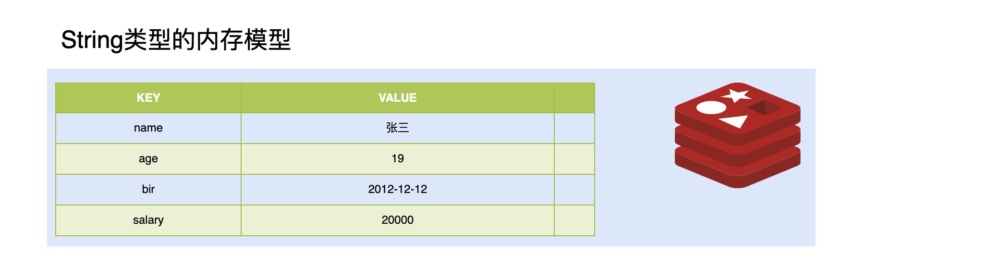

# Redis

## NoSql简介

**NoSQL**(` Not Only SQL` )，意即**不仅仅是SQL**, 泛指非关系型的数据库。Nosql这个技术门类,早期就有人提出,发展至2009年趋势越发高涨。

随着互联网网站的兴起，传统的关系数据库在应付动态网站，特别是超大规模和高并发的纯动态网站已经显得力不从心，暴露了很多难以克服的问题。如`商城网站中对商品数据频繁查询`、`对热搜商品的排行统计`、`订单超时问题`、以及微信朋友圈（音频，视频）存储等相关使用传统的关系型数据库实现就显得非常复杂，虽然能实现相应功能但是在性能上却不是那么乐观。nosql这个技术门类的出现，更好的解决了这些问题，它告诉了世界不仅仅是sql。

### NoSql的分类

Nosql分为四类，分别为

-   键值存储数据库

    这一类数据库主要会使用到一个哈希表，这个表中有一个特定的键和一个指针指向特定的数据。

    **特点**

    - Key/value模型对于IT系统来说的优势在于简单、易部署。  
    - 但是如果DBA只对部分值进行查询或更新的时候，Key/value就显得效率低下了。

    **相关产品**

    - Tokyo Cabinet/Tyrant,
    - Redis
    - SSDB
    - Voldemort 
    - Oracle BDB

-   列存储数据库

    这部分数据库通常是用来应对分布式存储的海量数据。

    **特点**

    - 键仍然存在，但是它们的特点是指向了多个列。这些列是由列家族来安排的。

    **相关产品**

    - Cassandra、HBase、Riak.

-   文档型数据库

    文档型数据库的灵感是来自于Lotus Notes办公软件的，而且它同第一种键值存储相类似该类型的数据模型是版本化的文档，半结构化的文档以特定的格式存储，比如JSON。文档型数据库可 以看作是键值数据库的升级版，允许之间嵌套键值。而且文档型数据库比键值数据库的查询效率更高

    **特点**

    - 以文档形式存储

    **相关产品**

    - MongoDB、CouchDB、 MongoDb(4.x). 国内也有文档型数据库SequoiaDB，已经开源。

-   图形数据库

    图形结构的数据库同其他行列以及刚性结构的SQL数据库不同，它是使用灵活的图形模型，并且能够扩展到多个服务器上。

    **相关产品**

    - Neo4J、InfoGrid、 Infinite Graph、

### NoSQL应用场景

- 数据模型比较简单

- 需要灵活性更强的IT系统

- 对数据库性能要求较高

- 不需要高度的数据一致性


## Redis简介


官方简介：Redis is an open source (BSD licensed), in-memory data structure store, used as a database, cache and message broker. It supports data structures such as strings, hashes, lists, sets, sorted sets with range queries, bitmaps, hyperloglogs, geospatial indexes with radius queries and streams. Redis has built-in replication, Lua scripting, LRU eviction, transactions and different levels of on-disk persistence, and provides high availability via Redis Sentinel and automatic partitioning with Redis Cluster. 

翻译：Redis是一个开源，在内存中存储的数据结构的东东。被用于作为数据库，缓存与数据中间件。支持string，hash，set等数据类型。支持集群部署，主从复制等巴拉巴拉。

### Redis特点

-  Redis是一个高性能key/value内存型数据库

-  Redis支持丰富的数据类型 

-  Redis支持持久化 

-  Redis单线程,单进程


## Redis的安装与启动

windows安装只需要下载安装包，然后解压即可。

linux安装步骤如下：

环境准备：

-   linux环境：CentOS 7
-   gcc 语言环境：yum install -y gcc

### 安装步骤

1.  解压 redis 的 gz 文件

    tar -zxvf redis-4.0.10.tar.gz

2.  进入解压好的文件夹，编译并安装redis文件

    make && make install

### 启动redis

安装好redis后，发现redis的目录下多了一个src目录，该目录就是redis编译安装完成之后的目录，有关redis服务启动，客户端启动的文件都在此目录下。

#### 启动redis的服务端

进入src目录下，输入如下命令即可启动redis服务端

```markdown
./redis-server [配置文件目录]
```

-   配置文件目录可以指定（支持相对路径），默认使用redis-server中的shell脚本的配置


#### 启动redis客户端

进入src目录下，输入如下命令即可启动redis客户端

```
./redis-cli [-h hostname] [-p port]
```

-   -h：指定主机名，缺省值为本机ip
-   -p：指定端口号，缺省值为6379


**客户端显示中文**

```
./redis-cli  -p 7000 --raw
```


## Redis 自动启动及对外开放设置


## Redis 数据库指令

**Redis数据库说明**

redis默认配置有16个库，从编号为从0到15。客户端可以在连接时与进入Redis后使用`select n` 来指定数据库。数据库之间数据相互隔离。

库的数量可以在redis.conf 配置文件中进行修改

### 数据库的指令

- 清空当前的库：FLUSHDB
- 清空全部的库：FLUSHALL

### 操作key相关指令

key指的是在Redis中的键，由于Redis使用键值对存储数据，因此可以根据唯一的key找到对应的数据。


**DEL指令**

- 语法 :  DEL key [key ...] 
- 作用 :  删除给定的一个或多个key 。不存在的key 会被忽略。
- 可用版本： >= 1.0.0
- 返回值： 被删除key 的数量。 

**EXISTS指令**

- 语法:  EXISTS key
- 作用:  检查给定key 是否存在。
- 可用版本： >= 1.0.0
- 返回值： 若key 存在，返回1 ，否则返回0。

**EXPIRE**

- 语法:  EXPIRE key seconds
- 作用:  为给定key 设置生存时间，当key 过期时(生存时间为0 )，它会被自动删除。
- 可用版本： >= 1.0.0
- 时间复杂度： O(1)
- 返回值：设置成功返回1 。

**PEXPIRE**

- 语法 :  PEXPIRE key milliseconds
- 作用 :  这个命令和EXPIRE 命令的作用类似，但是它以毫秒为单位设置key 的生存时间，而不像EXPIRE 命令那样，以秒为单位。
- 可用版本： >= 2.6.0
- 时间复杂度： O(1)
- 返回值：设置成功，返回1  key 不存在或设置失败，返回0

**PEXPIREAT**

- 语法 :  PEXPIREAT key milliseconds-timestamp
- 作用 :  这个命令和EXPIREAT 命令类似，但它以毫秒为单位设置key 的过期unix 时间戳，而不是像EXPIREAT那样，以秒为单位。
- 可用版本： >= 2.6.0
- 返回值：如果生存时间设置成功，返回1 。当key 不存在或没办法设置生存时间时，返回0 。(查看EXPIRE 命令获取更多信息)

**TTL**

- 语法 :   TTL key
- 作用 :   以秒为单位，返回给定key 的剩余生存时间(TTL, time to live)。
- 可用版本： >= 1.0.0
- 返回值：
    当key 不存在时，返回-2 。
    当key 存在但没有设置剩余生存时间时，返回-1 。
    否则，以秒为单位，返回key 的剩余生存时间。
- Note : 在Redis 2.8 以前，当key 不存在，或者key 没有设置剩余生存时间时，命令都返回-1 。

**PTTL**

- 语法 :  PTTL key
- 作用 :  这个命令类似于TTL 命令，但它以毫秒为单位返回key 的剩余生存时间，而不是像TTL 命令那样，以秒为单位。
- 可用版本： >= 2.6.0
- 返回值： 当key 不存在时，返回-2 。当key 存在但没有设置剩余生存时间时，返回-1 。
- 否则，以毫秒为单位，返回key 的剩余生存时间。
- 注意 : 在Redis 2.8 以前，当key 不存在，或者key 没有设置剩余生存时间时，命令都返回-1 。

**KEYS**

- 语法 :  KEYS pattern
- 作用 :  查找所有符合给定模式pattern 的key 。
- 语法:

	KEYS * 匹配数据库中所有key 。
	KEYS h?llo 匹配hello ，hallo 和hxllo 等。
	KEYS h*llo 匹配hllo 和heeeeello 等。
	KEYS h[ae]llo 匹配hello 和hallo ，但不匹配hillo 。特殊符号用 "\" 隔开
- 可用版本： >= 1.0.0
- 返回值： 符合给定模式的key 列表。

**MOVE**

- 语法 :  MOVE key db
- 作用 :  将当前数据库的key 移动到给定的数据库db 当中。
- 可用版本： >= 1.0.0
- 返回值： 移动成功返回1 ，失败则返回0 。

**RANDOMKEY**

- 语法 :  RANDOMKEY
- 作用 :  从当前数据库中随机返回(不删除) 一个key 。
- 可用版本： >= 1.0.0
- 返回值：当数据库不为空时，返回一个key 。当数据库为空时，返回nil 。

**RENAME**

- 语法 :  RENAME key newkey
- 作用 :  将key 改名为newkey 。当key 和newkey 相同，或者key 不存在时，返回一个错误。当newkey 已经存在时，RENAME 命令将覆盖旧值。
- 可用版本： >= 1.0.0
- 返回值： 改名成功时提示OK ，失败时候返回一个错误。

**TYPE**

- 语法 :  TYPE key
- 作用 :  返回key 所储存的值的类型。
- 可用版本： >= 1.0.0
- 返回值：

	none (key 不存在)
	string (字符串)
	list (列表)
	set (集合)
	zset (有序集)
	hash (哈希表)


## Redis 数据类型

Redis的数据类型可以分为5种，分别为 String，List，Set，ZSet与Hash。

### String类型

#### 内存存储模型



#### 常用操作命令

| 命令                                 | 简略说明                                               |
| ------------------------------------ | ------------------------------------------------------ |
| **set** key value                    | 设置一个key/value                                      |
| **get** key                          | 根据key获得对应的value                                 |
| **mset** key value [key value ...]   | 一次设置多个key value                                  |
| **mget** key value [key value ...]   | 一次获得多个key的value                                 |
| **getset** key value                 | 获得原始key的值，同时设置新值                          |
| **strlen** value                     | 获得对应key存储value的长度                             |
| **append** key value                 | 为对应key的value追加内容                               |
| **getrange** key start end           | 截取value的内容 [begin, end] （索引0开始）             |
| **setex** key seconds value          | 设置一个key存活的有效期（秒）                          |
| **psetex** key seconds value         | 设置一个key存活的有效期（毫秒）                        |
| **setnx** key value                  | 存在不做任何操作,不存在添加                            |
| **msetnx** key value [key value ...] | 可以同时设置多个key,只有有一个存在都不保存（原子操作） |
| **decr** key                         | 进行数值类型的-1操作                                   |
| **decrby** key decrement             | 根据提供的数据进行减法操作                             |
| **Incr** key                         | 进行数值类型的+1操作                                   |
| **incrby** key increment             | 根据提供的数据进行加法操作                             |
| **incrbyfloat** key increment        | 根据提供的数据加入浮点数                               |

###  List类型

list 列表 相当于java中list 集合  特点  元素有序  且 可以重复

#### 内存存储模型


#### 常用操作指令

| 命令                                          | 简略说明                                       |
| --------------------------------------------- | ---------------------------------------------- |
| **lpush** key element [element ...]           | 将某个值加入到一个key列表头部                  |
| **lpushx** key element [element ...]          | 同lpush,但是必须要保证这个key存在              |
| **rpush** key element [element ...]           | 将某个值加入到一个key列表末尾                  |
| **rpushx** key element [element ...]          | 同rpush,但是必须要保证这个key存在              |
| **lpop** key                                  | 返回和移除列表左边的第一个元素                 |
| **rpop** key                                  | 返回和移除列表右边的第一个元素                 |
| **lrange** key start stop                     | 获取某一个下标区间内的元素[start, stop]        |
| **llen** key                                  | 获取列表元素个数                               |
| **lset** key index element                    | 设置某一个指定索引的值(索引必须存在)           |
| **lindex** key index                          | 获取某一个指定索引位置的元素                   |
| **lrem** key count element                    | 删除count个的element（从左到右）               |
| **ltrim** key start stop                      | 保留列表中特定区间内的元素                     |
| **linsert** key BEFORE \| AFTER pivot element | 在某一个元素之前\|之后插入新元素（pivot 支点） |

### Set类型

特点: Set类型 Set集合 元素无序  不可以重复

#### 内存存储模型


#### 常用命令

| 命令                                | 说明                                                  |
| ----------------------------------- | ----------------------------------------------------- |
| **sadd** key member [member ...]    | 为集合添加元素                                        |
| **smembers** key                    | 显示集合中所有元素 无序                               |
| **scard** key                       | 返回集合中元素的个数                                  |
| **spop** key [count]                | 随机返回count个元素 并将元素在集合中删除（默认为1个） |
| **srandmember** key [count]         | 随机返回count个元素，默认1个                          |
| **smove** source destination member | 从一个集合中向另一个集合移动元素  必须是同一种类型    |
| **srem** key member [member ...]    | 从集合中删除指定的元素                                |
| **sismember** key member            | 判断一个集合中是否含有这个元素                        |
| **sdiff** key [key ...]             | 去掉第一个集合中其它集合含有的相同元素                |
| **sinter** key [key ...]            | 求交集                                                |
| **sunion** key [key ...]            | 求和集                                                |

###  ZSet类型

特点: 可排序的set集合  排序  不可重复 

官方描述：ZSET，明间描述：是可排序SET、sortSet   

#### 内存模型


#### 常用命令

| 命令                                                         | 说明                                                         |
| ------------------------------------------------------------ | ------------------------------------------------------------ |
| **zadd** key score member [score member ...]                 | 添加一个有序集合元素，指定score，若已存在，则更新该元素的分数。 |
| **zcard** key                                                | 返回集合的元素个数                                           |
| **zrange** key start stop [withscores] <br>**zrevrange** key start stop [withscores] | 返回一个范围内的元素（升序/降序），【是否带分数】            |
| **zrangebyscore** key min max [WITHSCORES] [LIMIT offset count] | 按照分数查找一个范围内的元素。【是否带分数】【限定偏移量与查询的条数】 |
| **zrank** key member                                         | 返回排名/索引（从0开始）                                     |
| **zrevrank** key member                                      | 倒序排名/索引（从0开始）                                     |
| **zscore** key member                                        | 显示某一个元素的分数                                         |
| **zrem** key member [member ...]                             | 移除元素                                                     |
| **zincrby** key increment member                             | 给某个特定元素加分                                           |

###  hash类型

特点: value 是一个map结构 存在key value  key 无序的  

类比于Java中的 `Map<String,Map<String,Object>>`

#### 内存模型


#### 常用命令

| 命令                                        | 说明                                                |
| ------------------------------------------- | --------------------------------------------------- |
| **hset** key field value [field value ...]  | 给指定key设置一个field/value对，返回新增field的个数 |
| **hget** key field                          | 获得一个key中 field对应的value                      |
| **hgetall** key                             | 获得所有的field/value对                             |
| **hdel** key field [field ...]              | 删除某一个field/value对                             |
| **hexists** key field                       | 判断一个field是否存在                               |
| **hkeys **key                               | 获得所有的field                                     |
| **hvals** key                               | 获得所有的value                                     |
| **hmset** key field value [field value ...] | 设置多个field/value，返回ok                         |
| **hmget** key field [field ...]             | 获得多个field的value                                |
| **hsetnx** key field value                  | 设置一个不存在的field的值（存在则不做操作）         |
| **hincrby** key field increment             | 为value进行加法运算，必须指定增量                   |
| **hincrbyfloat** key field increment        | 为value加入浮点值，必须指定增量                     |


## Redis 持久化机制

持久化：Client redis（内存） ==> 硬盘

Redis 提供了两种持久化的方法：

-   RDB 快照（Snapshot），保存此刻数据。
-   AOF（Append Only File），只追加日志文件，将redis所有写命令记录到日志文件中。

### 快照（Snapshot）

快照可以将某一时刻的所有数据都写入硬盘中,当然这也是**redis的默认开启持久化方式**,保存的文件是以.rdb形式结尾的文件因此这种方式也称之为RDB方式。

式结尾的文件因此这种方式也称之为RDB方式。


#### 服务器生成快照的方式

- 客户端方式：BGSAVE 和 SAVE指令
- 服务器配置自动触发
- 服务器接受 shutdown 指令（可以由客户端发出）

##### 1、客户端 BGSAVE 指令（推荐）

客户端可以使用 `BGSAVE` 命令来创建一个快照，当接收到客户端的BGSAVE命令时，redis会调用fork来创建一个子进程，然后子进程负责将快照写入磁盘中，而父进程则继续处理命令请求。

>   名词解释: fork当一个进程创建子进程的时候,底层的操作系统会创建该进程的一个副本,在类unix系统中创建子进程的操作会进行优化:在刚开始的时候,父子进程共享相同内存,直到父进程或子进程对内存进行了写之后,对被写入的内存的共享才会结束服务 


##### 2、客户端 SAVE 指令

客户端还可以使用SAVE命令来调用主线程创建一个快照，接收到SAVE命令的redis服务器在快照创建完毕之前将不再响应任何其他的命令

>   注意: SAVE命令并不常用,使用SAVE命令在快照创建完毕之前,redis处于阻塞状态,无法对外服务


##### 3、服务器配置自动触发

可以在服务器启动配置文件中（redis.conf）配置 `save` 选项，当满足save选项的条件时，会自动触发一次 BGSAVE 指令。可以配置多个save选项，可同时检测。

**语法格式如下：**

```shell
save <seconds> <changes>
```

说明：在 seconds 秒内 至少有 changes 次数据变化，则调用 BGSAVE

**示例：**

```shell
save 900 1
save 300 10
save 60 10000

#   after 900 sec (15 min) if at least 1 key changed
#   	900秒之中至少有一次数据更改
#   after 300 sec (5 min) if at least 10 keys changed
#		300秒中至少有10次数据更改
#   after 60 sec if at least 10000 keys changed
#		60秒中至少有10000次数据更改
```

##### 4、服务器接受 shutdown 指令

当redis通过shutdown指令接收到关闭服务器的请求时,会执行一个 `save` 命令,阻塞所有的客户端,不再执行客户端执行发送的任何命令,并且在save命令执行完毕之后关闭服务器

#### 修改快照的名称和位置

可以在redis的配置文件中修改快照的名称与保存位置

```shell
# 修改生成快照名称
dbfilename dump.rdb

# 修改生成位置
dir ./
```


>   注意：该目录是相对于redis-server 执行的脚本文件的目录

### AOF（Append Only File）只追加日志文件

AOF可以将所有客户端执行的写命令记录到日志文件中，AOF持久化会将被执行的写命令写到AOF的文件末尾，以此来记录数据发生的变化。因此只要redis从头到尾执行一次AOF文件所包含的所有写命令，就可以恢复AOF文件的记录的数据集。


#### 开启 AOF 持久化

在redis的默认配置中AOF持久化机制是没有开启的，需要在配置中开启

```shell
# 开启AOF持久化
appendonly yes 
# 指定 AOF 日志文件的名称
appendfilename "appendonly.aof" 
```


#### 设置 AOF 日志追加频率

在Redis配置文件中可以设置 AOF 日志的追加频率


**always【谨慎使用】**

- 说明: 每个redis写命令都要同步写入硬盘,严重降低redis速度
- 解释：如果用户使用了always选项，那么每个redis写命令都会被写入硬盘，从而将发生系统崩溃时出现的数据丢失减到最少；遗憾的是，因为这种同步策略需要对硬盘进行大量的写入操作，所以redis处理命令的速度会受到硬盘性能的限制；
- 注意：转盘式硬盘在这种频率下200左右个命令/s，固态硬盘(SSD) 几百万个命令/s；
- 警告：使用SSD用户请谨慎使用always选项，这种模式不断写入少量数据的做法有可能会引发严重的写入放大问题，导致将固态硬盘的寿命从原来的几年降低为几个月。

**everysec【推荐】**

- 说明：每秒执行一次同步显式的将多个写命令同步到磁盘
- 解释：为了兼顾数据安全和写入性能，用户可以考虑使用everysec选项,让redis每秒一次的频率对AOF文件进行同步；redis每秒同步一次AOF文件时性能和不使用任何持久化特性时的性能相差无几，而通过每秒同步一次AOF文件，redis可以保证,即使系统崩溃,用户最多丢失一秒之内产生的数据。

**no【不推荐】**

- 说明：由操作系统决定何时同步 
- 解释：最后使用no选项,将完全有操作系统决定什么时候同步AOF日志文件，这个选项不会对redis性能带来影响但是系统崩溃时，会丢失不定数量的数据,另外如果用户硬盘处理写入操作不够快的话，当缓冲区被等待写入硬盘数据填满时，redis会处于阻塞状态，并导致redis的处理命令请求的速度变慢。

#### AOF 重写

AOF的方式也同时带来了另一个问题。持久化文件会变的越来越大。例如我们调用incr test命令100次，文件中必须保存全部的100条命令，其实有99条都是多余的。因为要恢复数据库的状态其实文件中保存一条set test 100就够了。为了压缩aof的持久化文件Redis提供了AOF重写(ReWriter)机制。利用 **AOF 重写** 可以在一定程度上减小AOF文件的体积。

**AOF重写方式可以分为：**

-   客户端命令重写

-   服务器配置自动重写

##### 客户端命令重写

执行 `BGREWRITEAOF` 命令，不会阻塞redis的服务

##### 服务器配置自动重写

修改Redis的配置文件

-   auto-aof-rewrite-min-size：重写首次出发阈值

- auto-aof-rewrite-percentage：每次重写后，重写阈值的百分比

解释：如果设置auto-aof-rewrite-percentage值为100和auto-aof-rewrite-min-size 64mb，并且启用的AOF持久化时，那么当AOF文件体积大于64M，并且AOF文件的体积比上一次重写之后体积大了至少一倍(100%)时，会自动触发。

例如：设置 auto-aof-rewrite-min-size 为 64mb 则首次重写发生在AOF文件到达64mb的时候。假如重写后AOF的体积为20mb，且auto-aof-rewrite-percentage的值为200（200%），则再次触发AOF重写的阈值为 40mb（20mb * 200% = 40mb），之后的重写以此类推。

如果重写过于频繁，用户可以考虑将auto-aof-rewrite-percentage设置为更大。

##### 重写原理

注意：重写aof文件的操作，并没有读取旧的aof文件，而是**将整个内存中的数据库内容用命令的方式重写了一个新的aof文件，替换原有的文件**，这点和快照有点类似。

**重写流程**

1.  redis调用fork ，现在有父子两个进程 子进程根据内存中的数据库快照，往临时文件中写入重建数据库状态的命令
2.  父进程继续处理client请求，除了把写命令写入到原来的aof文件中。同时把收到的写命令缓存起来。这样就能保证如果子进程重写失败的话并不会出问题。
3.  当子进程把快照内容写入已命令方式写到临时文件中后，子进程发信号通知父进程。然后父进程把缓存的写命令也写入到临时文件。
4.  现在父进程可以使用临时文件替换老的aof文件，并重命名，后面收到的写命令也开始往新的aof文件中追加。


### 持久化总结

两种持久化方案既可以同时使用 (aof)，又可以单独使用,在某种情况下也可以都不使用，具体使用那种持久化方案取决于用户的数据和应用决定。

无论使用AOF还是快照机制持久化，将数据持久化到硬盘都是有必要的。除了持久化外，用户还应该对持久化的文件进行备份(最好备份在多个不同地方)。


## Java 整合 Redis

Java整合Redis非常简单，在整合的类中提供了与Redis命令名称一致的对象：Jedis。通过Jedis内置的方法，可以很容易地操作Redis

**Jedis 依赖**

```xml
<!--引入jedis连接依赖-->
<dependency>
    <groupId>redis.clients</groupId>
    <artifactId>jedis</artifactId>
    <version>2.9.0</version>
</dependency>
```

### Jedis链接Redis

```java
public class JedisTest {

    Jedis jedis = null;

    @Before
    public void initJedis() {
        // 通过new 创建Jedis对象可以指定链接的Redis的ip地址与端口号
        jedis = new Jedis("192.168.72.129", 6379);
    }

    @After
    public void closeResource() {
        // 在操作完成Jedis之后需要关闭连接
        jedis.close();
    }
    
    // test code...
}
```

### Jedis相关操作

#### 对key的操作

```java
private Jedis jedis;
@Before
public void before(){
    this.jedis = new Jedis("192.168.202.205", 7000);
}
@After
public void after(){
    jedis.close();
}

//测试key相关
@Test
public void testKeys(){
    //删除一个key
    jedis.del("name");
    //删除多个key
    jedis.del("name","age");

    //判断一个key是否存在exits
    Boolean name = jedis.exists("name");
    System.out.println(name);

    //设置一个key超时时间 expire pexpire
    Long age = jedis.expire("age", 100);
    System.out.println(age);

    //获取一个key超时时间 ttl
    Long age1 = jedis.ttl("newage");
    System.out.println(age1);

    //随机获取一个key
    String s = jedis.randomKey();

    //修改key名称
    jedis.rename("age","newage");

    //查看可以对应值的类型
    String name1 = jedis.type("name");
    System.out.println(name1);
    String maps = jedis.type("maps");
    System.out.println(maps);
}
```

#### String 类型操作

```java
//测试String相关
@Test
public void testString(){
    //set
    jedis.set("name","小陈");
    //get
    String s = jedis.get("name");
    System.out.println(s);
    //mset
    jedis.mset("content","好人","address","海淀区");
    //mget
    List<String> mget = jedis.mget("name", "content", "address");
    mget.forEach(v-> System.out.println("v = " + v));
    //getset
    String set = jedis.getSet("name", "小明");
    System.out.println(set);

    //............
}
```

#### List 类型操作

```java
//测试List相关
@Test
public void testList(){

    //lpush
    jedis.lpush("names1","张三","王五","赵柳","win7");

    //rpush
    jedis.rpush("names1","xiaomingming");

    //lrange

    List<String> names1 = jedis.lrange("names1", 0, -1);
    names1.forEach(name-> System.out.println("name = " + name));

    //lpop rpop
    String names11 = jedis.lpop("names1");
    System.out.println(names11);

    //llen
    jedis.linsert("lists", BinaryClient.LIST_POSITION.BEFORE,"xiaohei","xiaobai");

    //........

}
```

#### Set 类型操作

```java
//测试SET相关
@Test
public void testSet(){

    //sadd
    jedis.sadd("names","zhangsan","lisi");

    //smembers
    jedis.smembers("names");

    //sismember
    jedis.sismember("names","xiaochen");

    //...
}
```

#### ZSet 类型操作

```java
//测试ZSET相关
@Test
public void testZset(){

    //zadd
    jedis.zadd("names",10,"张三");

    //zrange
    jedis.zrange("names",0,-1);

    //zcard
    jedis.zcard("names");

    //zrangeByScore
    jedis.zrangeByScore("names","0","100",0,5);

    //..
}
```

#### Hash 类型操作

```java
//测试HASH相关
@Test
public void testHash(){
    //hset
    jedis.hset("maps","name","zhangsan");
    //hget
    jedis.hget("maps","name");
    //hgetall
    jedis.hgetAll("mps");
    //hkeys
    jedis.hkeys("maps");
    //hvals
    jedis.hvals("maps");
    //....
}
```


## SpringBoot 整合 Redis

Spring Boot Data(数据) Redis 中提供了**RedisTemplate**和**StringRedisTemplate**，其中StringRedisTemplate是RedisTemplate的子类，两个方法基本一致，不同之处主要体现在操作的数据类型不同：

-   RedisTemplate中的两个泛型都是Object，意味着存储的key和value都可以是一个对象
-   StringRedisTemplate的两个泛型都是String，意味着StringRedisTemplate的key和value都只能是字符串。

>   注意: 使用RedisTemplate默认是将对象序列化到Redis中,所以放入的对象必须实现对象序列化接口

spring-boot-starter-data-redis 底层集成 Jedis，对Redis进行操作

### 环境准备

#### Redis 整合依赖

```xml
<dependency>
    <groupId>org.springframework.boot</groupId>
    <artifactId>spring-boot-starter-data-redis</artifactId>
</dependency>
```

#### Redis整合相关配置文件

```yml
spring:
  redis:
    host: 192.168.72.129
    port: 6379
    database: 0
```

### StringRedisTemplate 与 RedisTemplate

StringRedisTemplate 与 RedisTemplate 的API大多对Redis原生命令进行了再封装，对Java更加友好。同原生命令一样，主要分为5类：

1.  对key进行操作：直接使用 `[String]RedisTemplate` 即可

    

2.  操作string类型：redisTemplate.opsForValue()

    

3.  操作hash类型：redisTemplate.opsForHash()

    

4.  操作list类型：redisTemplate.opsForList()

    

5.  操作set类型：redisTemplate.opsForSet()

    

6.  操作ZSet类型：redisTemplate.opsForZSet()

    

说明：规律为 `opsFor[XXX]` ，对于template，只需要做到望文生义，会操作即可。

#### RedisTemplate 的问题

RedisTemplate 会将 key - value 同时序列化（默认为JDK序列化方案），因此只能通过Java代码对该键值对进行操作，无法通过其他客户端（如redis-cli，Redis图形化界面等），具有一定局限性。在实际工作中，往往需要多个终端来查看或操作，因此只需要将value序列化，而不需要将key序列化。

**解决方案：**

在进行操作前，将key的序列化方案改为 StringRedisSerializer

```java
@AfterAll
public void after(){
    // 设置 key 的序列化方案
    redisTemplate.setKeySerializer(new StringRedisSerializer());
    // 设置 Hash类型中 field 的序列化方案
    redisTemplate.setHashKeySerializer(new StringRedisSerializer());
}
```


### 绑定API（boundXXXOps）

key的绑定操作：如果日后对某一个key的操作及其频繁，可以将这个key绑定到对应redistemplate中，生成绑定对象，日后基于绑定操作都是操作这个key。

>   使用绑定对象，直接用 绑定对象.XXX ，直接对该key进行操作（少写一个 key 参数）

-   boundValueOps 用来对String值绑定key
-   boundListOps 用来对List值绑定key
-   boundSetOps 用来对Set值绑定key
-   boundZsetOps 用来对Zset值绑定key
-   boundHashOps 用来对Hash值绑定key

```java
@Test
public void testBoundKey(){
    // 绑定 key ，生成绑定对象 nameValueOperations 。之后所有操作都是对该key的操作
    BoundValueOperations<String, String> nameValueOperations = stringRedisTemplate.boundValueOps("name");
    nameValueOperations.set("1");
    nameValueOperations.set("2");
    String s = nameValueOperations.get();
    System.out.println(s);
}
```


## MyBatis 整合 Redis 

MyBatis 使用 Redis 代替本地缓存，可以实现多主机共享缓存。使用Spring框架提供的 RedisTemplate 来操作Redis。

### 环境准备

1.  spring，mybatis整合完毕的环境
2.  redis服务器处于开启状态

### 简单整合的步骤

#### 1、Cache实现类与Spring注入冲突说明

模拟编写一个类，实现 `org.apache.ibatis.cache.Cache` 接口


实现Cache接口实体类的特性：

1.  一个Cache的实例对应一个名称空间（一个名称空间对应一个Dao实体类）

2.  名称空间在Cache实体类创立的时候通过构造器传入，因此必须要有一个 String id 类型的构造器。官方案例如下：

    ```java
    public MyCache(final String id) {
        if (id == null) {
            throw new IllegalArgumentException("Cache instances require an ID");
        }
        this.id = id;
        initialize();
    }
    ```

注意：由于以上特性，Cache接口的实现类不能作为Component被Spring识别（Component 必须以无参构造器创建Bean对象），因此无法通过 @Autowired 注解来注入RedisTemplate。所以需要通过其他方式来获取Spring中的RedisTemplate。

#### 2、通过 ApplicationContext 获取 RedisTemplate

编写一个类，实现 `ApplicationContextAware` 接口，来获取 RedisTemplate

```java
@Component
public class ApplicationContextFactory implements ApplicationContextAware {
    
    private static ApplicationContext ioc;
    
    @Override
    public void setApplicationContext(ApplicationContext applicationContext) throws BeansException {
        ioc = applicationContext;
    }
    
    public static Object getBean(String beanName) {
        return ioc.getBean(beanName);
    }
}
```

说明：

实现 `ApplicationContextAware` 接口需要实现 `public void setApplicationContext(ApplicationContext applicationContext)` 方法，该方法传入了当前Spring的ioc容器。因此可以从传入的applicationContext中获取任意Bean对象（包括Redis）。

#### 3、编写 `org.apache.ibatis.cache.Cache` 的实现类

```java
public class RedisCache implements Cache {

    // 由MyBatis传入，值为使用缓存Mapper的名称空间
    private String id;

    // 通过自定义的获取ApplicationContext的工厂类来获取ioc中的RedisTemplate
    RedisTemplate<Object, Object> redisTemplate = 
        (RedisTemplate<Object, Object>) ApplicationContextFactory.getBean("redisTemplate");

    public RedisCache(String id) {
        this.id = id;
        // 设置 key 与 hashKey 字符串序列化
        redisTemplate.setKeySerializer(new StringRedisSerializer());
        redisTemplate.setHashKeySerializer(new StringRedisSerializer());
        redisTemplate.afterPropertiesSet();
    }

    // MyBatis查看缓存数据的依据，返回id即可
    @Override
    public String getId() {
        return id;
    }

    // MyBatis 首次查询之后将信息存入自定义缓存，这里是Redis。调用该方法
    @Override
    public void putObject(Object key, Object value) {
        redisTemplate.opsForHash().put(id, key.toString(), value);
    }

    // MyBatis 之后的查询先从自定义缓存中查询，调用该方法
    @Override
    public Object getObject(Object key) {
        return redisTemplate.opsForHash().get(id, key.toString());
    }

    // 保留方法，暂未使用
    @Override
    public Object removeObject(Object key) {
        return null;
    }

    // 清除缓存中的数据，在增删改的时候调用该方法。
    @Override
    public void clear() {
        redisTemplate.delete(id);
    }

    // 获取缓存的size，可以根据需要返回类型
    @Override
    public int getSize() {
        Long size = redisTemplate.opsForHash().size(id);
        return size.intValue();
    }
}
```

>   `key.toString()` 说明
>
>   此处的key为 CacheKey 类型，redisTemplate 通过设置key与hashKey之后，接受的为String类型。因此需要key转化为String类型后传入。

#### 4、在Mapper设置缓存的类型为自定义缓存

```xml
<cache type="com.example.springbootmybatis.cache.RedisCache"></cache>
```

#### 测试：两次调用

```java
@Test
void redisTest() {
    
    userService.queryAllUser();
    System.out.println("==================================");
    userService.queryAllUser();
}
```

执行结果：

```bash
c.example.springbootmybatis.dao.UserDao  : Cache Hit Ratio [com.example.springbootmybatis.dao.UserDao]: 0.0
c.e.s.dao.UserDao.selectAllUser          : ==>  Preparing: select * from t_user
c.e.s.dao.UserDao.selectAllUser          : ==> Parameters: 
c.e.s.dao.UserDao.selectAllUser          : <==      Total: 5
==================================
c.example.springbootmybatis.dao.UserDao  : Cache Hit Ratio [com.example.springbootmybatis.dao.UserDao]: 0.5
```

分析：可以发现对数据库只进行了一次查询操作，而第二次查询调用缓存（命中率：1/2 = 0.5）

