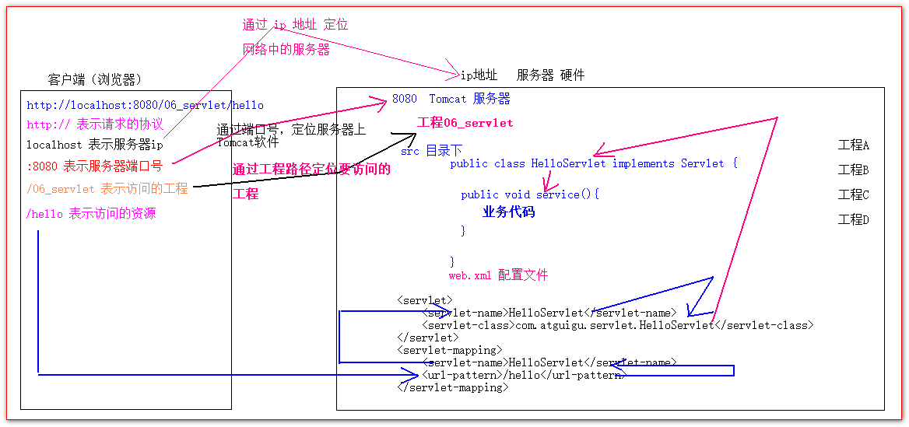
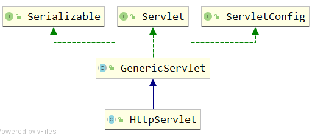
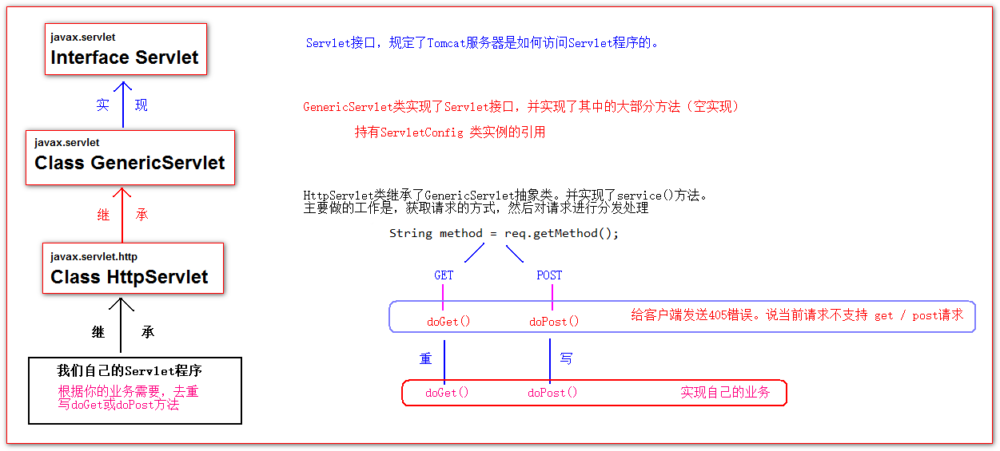
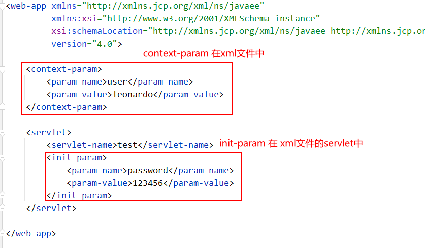

# Servlet

## Servlet简介

1.  Servlet是JavaEE的规范之一。规范就是接口

2. Servlet程序是JavaWeb的三大组件，JavaWeb三大组件分别是：Servlet程序，Filter过滤器，Listener监听器

3. Servlet程序是运行在Web服务器上的一个java小程序。

4.  Servlet程序的主要作用是：**用于接收客户端的请求。并响应数据。**

### 手动实现Servlet程序

写servlet做两件事

1.  实现servlet接口。 由sun公司定义的一个接口。(定义一个规范)

2.  把类部署到web服务器中（tomcat）。

sun公司定义一个servlet的规范。定义了servlet应该有哪些方法，以及方法需要的参数。

1.  实现servlet接口（javax.servlet.Servlet）

2.  重写service方法(service方法每次请求都会调用一次)

**示例代码**

```java
public class HelloServlet implements Servlet {

    /**
     * 每次只要Servlet程序接收到请求，都会调用srevice()处理请求。
     */
    @Override
    public void service(ServletRequest servletRequest, ServletResponse servletResponse) throws ServletException, IOException {
        System.out.println(" hello Servlet work!!! ");
    }

}

```

**web.xml 配置**

```xml
<!--servlet标签表示配置一个Servlet程序-->
<servlet>
    <!-- servlet-name标签表示起一个别名，一般是类名 -->
    <servlet-name>HelloServlet</servlet-name>
    <!-- servlet-class标签是配置全类名 -->
    <servlet-class>com.atguigu.servlet.HelloServlet</servlet-class>
</servlet>

<!-- servlet-mapping标签是给Servlet程序配置访问地址 -->
<servlet-mapping>
    <!-- servlet-name标签，作用是给哪个Servlet程序配置访问地址 -->
    <servlet-name>HelloServlet</servlet-name>
    <!--
        url-pattern标签配置访问地址 <br/>
            / 斜杠在服务器上。表示地址为http://ip:port/工程路径/  <br/>
            /hello 表示地址为：http://ip:port/工程路径/hello <br/>
     -->
    <url-pattern>/hello</url-pattern>
</servlet-mapping> 
```


## url地址到Servlet程序的访问




## Servlet的生命周期

Servlet程序的生命周期是指Servlet程序从创建到销毁过程中，执行一系列方法。

这些方法标识了Servlet程序从创建到工作，到销毁整个过程。

1.  构造器方法

2.  init(ServletConfig) 初始化方法

>   第1，2步，在第一次访问Servlet程序，的时候Tomcat服务器会帮我们创建Servlet程序，就会马上执行 1，2步。
>
>   从以上的生命周期方法调用，我们也发现一个问题。**Servlet程序默认是单例**。

3.  service() 方法：每次访问Servlet程序都会执行service() 方法

4.  destroy 销毁方法：在web工程停止的时候调用

**示例代码**

```java
public class HelloServlet implements Servlet {

    public HelloServlet() {
        System.out.println(" 1 构造器 ");
    }

    /**
     * 每次只要Servlet程序接收到请求，都会调用srevice()处理请求。
     */
    @Override
    public void service(ServletRequest servletRequest, ServletResponse servletResponse) throws ServletException, IOException {
        System.out.println(" 3 service() hello Servlet work!!! ");

    }

    @Override
    public void init(ServletConfig servletConfig) throws ServletException {
        System.out.println(" 2 init() 初始化 ");
    }

    @Override
    public void destroy() {
        System.out.println("4.destroy() 销毁");
    }
}
```


## 通过继承HttpServlet实现Servlet程序

在实际开发中，我们很少会通过实现Servlet接口去实现Servlet程序

而是通过继承HttpServlet类去实现Servlet程序

**步骤如下**：

1.  编写一个类去继承HttpServlet

2.  重写doGet 或 doPost 方法

3.  到web.xml中去配置Servlet程序的访问地址

**示例代码**

```java
public class HelloServlet2 extends HttpServlet {

    /**
     * doGet方法，每次get请求，都会自动调用
     */
    protected void doGet(HttpServletRequest req, HttpServletResponse resp) throws ServletException, IOException {
        System.out.println(" HelloServlet2 doGet() ");
    }

    /**
     * doPost() post请求进来。会自动调用doPost()方法
     */
    protected void doPost(HttpServletRequest req, HttpServletResponse resp) throws ServletException, IOException {
        System.out.println(" HelloServlet2 doPost() ");
    }

}
```

web.xml配置

```xml
<servlet>
    <servlet-name>HelloServlet2</servlet-name>
    <servlet-class>com.atguigu.servlet.HelloServlet2</servlet-class>
</servlet>
<servlet-mapping>
    <servlet-name>HelloServlet2</servlet-name>
    <url-pattern>/hello2</url-pattern>
</servlet-mapping>
```


## Servlet类的继承体系

简略图解



稍微详细的图解




## JavaEE3.0规范：注解配置Servlet程序

使用 @WebServlet来配置servlet程序，从而不需要使用web.xml来配置

-   name：当前Servlet的名称
-   urlPatterns：是个数组，用于映射请求地址

```java
@WebServlet(name = "LoginServlet", urlPatterns = "/login")
public class LoginServlet extends HttpServlet {
    
    UserService userService = new UserServiceImpl();
    
    protected void doPost(HttpServletRequest request, HttpServletResponse response) throws ServletException, IOException {
        String username = request.getParameter("username");
        String password = request.getParameter("password");
        User compareUser = new User(null, username, password, null);
        try {
            User loginUser = userService.doLogin(compareUser);
            request.setAttribute("loginUser", loginUser);
            request.getRequestDispatcher("/pages/user/login_success.html").forward(request,response);
        }catch (RuntimeException e){
            request.setAttribute("ErrorMsg",e.getMessage());
            request.getRequestDispatcher("/pages/user/login.html").forward(request,response);
        }
        
    }
}
```


## ServletConfig 类

ServletConfig类，见名知义，他的作用是Servlet程序的配置信息类。它可以获取Servlet程序的配置信息。在Tomcat服务器，每次创建Servlet程序的时候，都会创建一个与之对应的ServletConfig实例传入init方法去使用。

### ServletConfig类的三大作用

1.  获取Servlet-name标签的值
2.  获取init-param初始化参数（比较有用）
3.  获取ServletContext对象

>   注意：在servlet程序中配置的init-param初始化参数，只能给当前Servlet程序使用。

**部分 web.xml 的servlet配置代码**

```xml
<servlet>
    <servlet-name>ConfigServlet</servlet-name>
    <servlet-class>com.atguigu.servlet.ConfigServlet</servlet-class>
    <!-- init-param初始化参数 -->
    <init-param>
        <!-- 参数名 -->
        <param-name>username</param-name>
        <!-- 参数值 -->
        <param-value>root</param-value>
    </init-param>
            <!-- init-param初始化参数 -->
    <init-param>
        <!-- 参数名 -->
        <param-name>url</param-name>
        <!-- 参数值 -->
        <param-value>jdbc:mysql://localhost:3306/test</param-value>
    </init-param>

</servlet>
```

**java代码**

```java
public class ConfigServlet extends HttpServlet {

    @Override
    public void init(ServletConfig config) throws ServletException {
//        0 重写Init方法
        super.init(config);
//        1 获取Servlet-name标签的值
        System.out.println( "servlet-name => " + config.getServletName() );
//        2 获取init-param初始化参数
        System.out.println(" init-param username => " + config.getInitParameter("username"));
        System.out.println(" init-param url => " + config.getInitParameter("url"));
//        3 获取ServletContext对象
        System.out.println(config.getServletContext());
    }
}
```

>   注意，子类重写init()方法必须显式调用弗雷的init() 方法，否则重写无效


## ServletContext类

### ServletContext简介

1.  ServletContext表示一个Servlet上下文对象（ 一个ServletContext表示一个web工程 ）

    >   上下文相当于记录内存中一些数据的对象

2.  Tomcat服务器会在web工程启动的时候创建ServletContext对象，

3.  在web工程停止的时候销毁ServletContext对象。

4.  一个web工程，只会创建出一个ServletContext对象实例。

5.  ServletContext对象是一个域对象。

    >   域对象：像map一样可以存取数据的对象
    >
    >   ​								保存数据                        获取数据                  				删除数据
    >
    >   map               put(key,value)                    	get(key):Object;					remove(key);
    >
    >   域对象       setAttribute(key,value);			getAttribute(key):Object;	removeAttribute(key);
    >
    >   
    >
    >   所谓的域，是指存取的数据有有效操作范围。
    >
    >   ServletContext对象的范围操作有效范围是整个web工程。

### Init-Param 与 context-param

init-param 是初始化参数，它只可以通过ServletConfig对象获取到，而且只它能给它所在的Servlet程序获取到。

context-param 是上下文参数。它可以通过servletContext对象获取到，是整个web工程都可以使用。



### ServletContext类的四个作用

1.  获取在web.xml中配置的context-param 上下文参数

2.  获取工程路径

3.  获取工程部署后，在服务器硬盘上的绝对路径

4.  可以像map一样存取数据

**代码示例**

```java
@WebServlet(value = "/contextServlet")
public class ContextServlet extends HttpServlet {

    @Override
    protected void doGet(HttpServletRequest req, HttpServletResponse resp) throws ServletException, IOException {
        // 获取ServletContext对象
        ServletContext servletContext = getServletContext();
        //        1 获取在web.xml中配置的context-param 上下文参数
        System.out.println("context param   username => " + servletContext.getInitParameter("username"));
        System.out.println("context param   driverClassName => " + servletContext.getInitParameter("driverClassName"));

        //        2 获取工程路径
        System.out.println( "工程路径 => " + servletContext.getContextPath() );
        //        3 获取工程部署后，在服务器硬盘上的绝对路径
        /**
         * servletContext.getRealPath("/") 获取在服务器上的真实路径 <br/>
         * / 斜杠 表示请求地址为 http://ip:port/工程路径   映射到代码的 web目录 <br/>
         */
        System.out.println("整个web工程部署到 ： " + servletContext.getRealPath("/"));
        System.out.println("web/css在服务器上的位置是：" + servletContext.getRealPath("/css"));
        System.out.println("web/imgs/3.jpg 在服务器上的位置是：" + servletContext.getRealPath("/imgs/3.jpg"));

    }
}
```

**web.xml中的配置**

```xml
<!-- context-param 是上下文参数 -->
<context-param>
    <!-- 参数名 -->
    <param-name>username</param-name>
    <!-- 参数值 -->
    <param-value>wzg168</param-value>
</context-param>

    <!-- context-param 是上下文参数 -->
<context-param>
    <!-- 参数名 -->
    <param-name>driverClassName</param-name>
    <!-- 参数值 -->
    <param-value>com.msyql.jdbc.Driver</param-value>
</context-param>
```

**ServletContext可以像Map一样存取数据：**

```java
@WebServlet(value = "/context1")
public class Context1 extends HttpServlet {

    protected void doGet(HttpServletRequest request, HttpServletResponse response) throws ServletException, IOException {
        System.out.println(" Context1 中开始保存数据到ServletConetxt域中 ");

        ServletContext servletContext = getServletContext();
        System.out.println(servletContext);

        servletContext.setAttribute("key","value");

        System.out.println( "Context1 中获取 key 的值 => " + servletContext.getAttribute("key") );

    }
}

@WebServlet(value = "/context2")
public class Context2 extends HttpServlet {

    protected void doGet(HttpServletRequest request, HttpServletResponse response) throws ServletException, IOException {

        ServletContext servletContext = getServletContext();
        System.out.println( "Context2 中获取 key 的值 => " + servletContext.getAttribute("key") );
        System.out.println(servletContext);

    }
}

```