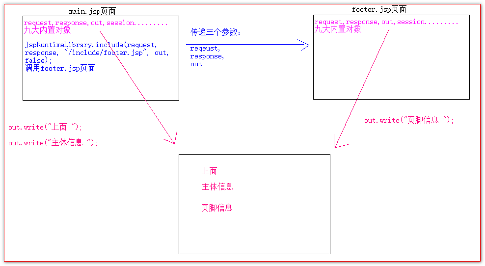

# JSP

## JSP 简介

jsp的全称是 java server page。就是Java的服务器页面。

jsp技术是sun公司为了解决Servlet程序回传html页面的数据代码过于繁琐而产生的技术。

**Servlet回传数据**

```java
@WebServlet(value = "/responseHTML")
public class ResponseHTML extends HttpServlet {

    protected void doGet(HttpServletRequest request, HttpServletResponse response) throws ServletException, IOException {
        // 解决响应中文乱码
        response.setContentType("text/html; charset=UTF-8");

        // 在这里面。回传一个html页面数据
        PrintWriter writer = response.getWriter();

        writer.write("<!DOCTYPE html>\r\n");
        writer.write("<html lang=\"zh_CN\">\r\n");
        writer.write("  <head>\r\n");
        writer.write("    <meta charset=\"UTF-8\">\r\n");
        writer.write("    <title>Title</title>\r\n");
        writer.write("  </head>\r\n");
        writer.write("  <body>\r\n ");
        writer.write("     我是hello world！\r\n");
        writer.write("  </body>\r\n");
        writer.write("</html>");
    }
}
```

**JSP在页面中输出数据**

```jsp
<%@ page contentType="text/html;charset=UTF-8" language="java" %>
<html>
<head>
    <title>Title</title>
</head>
<body>
    <%out.print("leonardo");%>
</body>
</html>
```


## JSP的本质

jsp的本质是编译好的servlet文件


继承org.apache.jasper.runtime.HttpJspBase


HttpJspBase继承HttpServlet


## jsp的三种语法

### jsp头部的page指令

```jsp
<%@ page contentType="text/html;charset=UTF-8" language="java" %>
```

|属性名称|属性说明|
|--|-|
|language属性                 | 表示jsp翻译之后的语言。暂时只能是java|
|contentType属性             | 表示jsp页面执行之后返回的数据类型。也是源码中response.setContentTyp的参数值|
|pageEncoding属性|       表示当前jsp页面文件本身的字符集|
|import属性    |     给jsp页面导包，导类|
|autoFlush属性      | 表示out缓冲区满了之后是否自动刷新。默认是true|
|buffer属性       |  表示out缓冲区的大小，默认8kb|
|errorPage属性   | 当jsp页面运行时出错，自动跳转去的错误页面路径(/表示工程路径) |
|isErrorPage属性 |  设置当前jsp页面是否为错误显示页面。如果是启动exception异常对象。如果不是。不启动exception异常对象。默认是false|
|session 属性    |   设置访问当前jsp页面，是否创建Session会话对象。默认是true表示创建。|
|extends 属性  |     设置jsp翻译java之后，默认继承哪个类|

### jsp中的常用脚本

表达式脚本的作用是：在jsp页面上输出数据

#### 表达式脚本

**语法格式**

```jsp
 <%= 表达式 %>
```

表达式脚本的特点：

1.  所有表达式脚本都会被翻译到_jspService()方法中
2.  所有表达式脚本都会被翻译成为out.print()输出到客户端
3.  由于表达式脚本翻译出来的代码都在_jspService()方法中，所以_jspService()方法源码中的对象都可以使用
4.  表达式脚本中的表达式不能以分号结尾

**代码示例**

```jsp
<%--    1.输出整型--%>
<%=12 + 12%> <br>

<%--    2.输出浮点型--%>
<%=12.12%> <br>

<%--    3.输出字符串--%>
<%=12 + "abc"%> <br>

<%--    4.输出对象--%>
<%=map%> <br>

<%=request.getParameter("username")%>
```


#### 代码脚本

代码脚本的作用是： 可以编写所有在方法内你想编写的所有功能语句。都可以写在代码脚本中。

语法格式：

```jsp
<%
	System.out.println("hello world");
%>
```

代码脚本的特点：

1.  代码脚本里可以写所有在方法体内可以写的代码。
2.  代码脚本里的代码都会被翻译到_jspService()方法中_
3.  _由于代码脚本写的代码归属_jspService()方法。所以在_jspService()方法中的对象，都可以直接使用。
4.  一个代码脚本可以写多个java语句
5.  一个java语句也可以由多个代码脚本组合完成。
6.  我们还可以在多个代码脚本中穿插表达式脚本使用。

#### 翻译后的对比


## jsp九大内置对象

所谓jsp中的九大内置对象，是指 jsp 页面被翻译之后在_jspService()方法中提供的九个现成对象。


### 四个域对象

|类型|        变量名  |            数据范围是|
|-|-|-|
|PageContext             |   pageContext              |       当前jsp页面范围内有效|
|HttpServletReqeust|          request               |           一次请求内有效|
|HttpSession          |       session              |            打开浏览器访问服务器，直到关闭浏览器|
|ServletContext   |           application             |          启动web项目，直到web项目停止|

四个域都可以像map一样存取数据，他们之间只是范围操作范围的不同。

根据数据操作的有效范围，从小到大分别是：

PageContext       ==>>  request  ==>>  session ==>>  application

### out输出和response.getWriter输出的区别

out 输出流对象和response对象都可以在jsp页面上输出数据。

区别如下图


>   out 有一个flush()方法，用于刷新缓冲区数据
>
>   

在jsp页面中统一使用out来进行。避免页面上收到的数据顺序混乱。

在jsp页面中，我们可以使用使用out来进行输出，

它有两个方法

-   write() 适合输出字符串

-   print() 输出任意数据

>   深入源码，浅出结论， 在jsp页面中统一使用out.print()输出。


## jsp的常用标签

### jsp静态包含

```jsp
<%@ include file="/include/footer.jsp"%>
```

>   file属性设置被包含的jsp页面的路径

静态包含的特点是：

1.  不会翻译被包含的jsp页面
2.  静态包含会把被包含的jsp页面的内容拷贝到包含的位置执行输出

### jsp动态包含

```jsp
<jsp:include page="/include/footer.jsp">
    <jsp:param name="username" value="wzg168"/>
    <jsp:param name="password" value="123456"/>
</jsp:include>
```

>   page属性指定被包含的jsp页面的路径

动态包含的特点是：

1.  会翻译被包含的jsp页面
2.  动态包含底层是通过调用JspRuntimeLibrary.include();去执行被包含的jsp页面
3.  可以传递参数（将数据放入请求参数中）



随着整个JavaEE技术体系的变革。jsp的功能慢慢的被弱化。最早期的时候，我们可以在jsp页面中编写任意的代码，执行任意的功能。但是现在随着架构的不断发展，jsp的作用慢慢地就只剩下的输出html页面数据。

慢慢的包含也就只使用静态包含居多

静态包含适合包含那些jsp页面中，只是输出html页面的数据jsp而动态适合包含那些jsp里有大量java代码的jsp页面。

在性能上，静态包含要比动态包含稍微快那么一点点。

### jsp标签-转发

```jsp
<jsp:forward page="/scope2.jsp"></jsp:forward>
```

>page属性指定请求的资源路径


## Servlet，jsp，域对象，请求转发的使用示例

