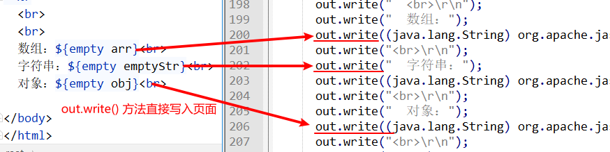

# EL&JSTL

## EL表达式

### EL表达式的简介

EL表达式它的全称是Expression Language,表达式语言。EL表达式的作用主要是为了替代jsp页面中的表达式脚本在jsp页面上输出数据。因为EL表达式在输出数据的时候，要比jsp页面中的表达式脚本要简洁很多。

```jsp
<body>
    <%
    request.setAttribute("key","data");
    %>
    jsp表达式脚本输出：<%=request.getAttribute("key")==null?"":request.getAttribute("key")%> <br>
    el表达式：${key} <br>
</body>
```

### EL表达式输出原理

EL表达式在jsp页面渲染时，直接执行EL表达式，将值的字面量 “镶嵌” 入页面。



### EL表达式的语法

${ key }

-   jsp中的表达式脚本在输出null值的时候，输出的是null字符串

-   EL表达式脚本在输出null值的时候，输出的是空串

>   key为request作用域中的数据

### 表达式搜索域数据的顺序

EL表达式在输出数据的时候，会分别从四个域中去搜索并输出。

搜索的顺序是，pageContext => request => session => application

>   也就是从四个域，从小到大去搜索并输出。

### EL表达式输出测试

需求：输出Person类中普通属性，数组属性。list集合属性和map集合属性。

**Dao类**

```java
public class Person {
    // 需求——输出Person类中普通属性，数组属性。list集合属性和map集合属性。
    private Integer id;
    private String[] cities;
    private List<String> phones;
    private Map<String,Object> map;
    // ...
}
```

**jsp代码**

```jsp
<body>
    <%
    Person person = new Person();
    person.setId(100);
    person.setCities(new String[]{"北京","上海","广州","深圳"});
    List<String> phones = new ArrayList<>();
    phones.add("1866669999");
    phones.add("13988886666");
    phones.add("18610541354");
    person.setPhones(phones);
    Map<String,Object> map = new HashMap<>();
    map.put("girl1","迪丽热巴");
    map.put("girl2","古丽娜扎");
    map.put("girl3","阿丽");
    person.setMap(map);
    request.setAttribute("p",person);
    %>
    输出整个 person 对象：${p} <br>
    输出 person.id 对象：${p.id} <br>
    输出 person.cities[0] 对象：${p.cities[0]} <br>
    输出 person.cities[1] 对象：${p.cities[1]} <br>
    输出 person.cities[2] 对象：${p.cities[2]} <br>
    输出 person.cities[3] 对象：${p.cities[3]} <br>
    输出 person.phones 对象：${p.phones} <br>
    输出 person.phones[0] 对象：${p.phones[0] } <br>
    输出 person.phones[1] 对象：${p.phones[1] } <br>
    输出 person.phones[2] 对象：${p.phones[2] } <br>
    输出 person.map 对象：${p.map} <br>
    输出 person.map.girl1 对象：${p.map.girl1} <br>
    输出 person.map.girl2 对象：${p.map.girl2} <br>
    输出 person.map.girl3 对象：${p.map.girl3} <br>
    输出 person.age 对象：${p.age} <br>

</body>
```

>   注意：EL表达式读取值的时候是调用目标类的 get 进行读取

### EL表达式的运算

#### 语法

${ 运算表达式 } 

>   注意：EL表达式需要在 ${  } 内完成运算

#### 关系运算

| **关系运算符** | **说**  **明** | **范**  **例**                  | **结果** |
| -------------- | -------------- | ------------------------------- | -------- |
| ==  或 eq      | 等于           | ${ 5 == 5   } 或 ${ 5 eq 5   }  | true     |
| !=  或 ne      | 不等于         | ${ 5 !=5   } 或 ${ 5 ne 5   }   | false    |
| <  或 lt       | 小于           | ${ 3 < 5   } 或 ${ 3 lt 5   }   | true     |
| >  或 gt       | 大于           | ${ 2 > 10   } 或 ${ 2 gt 10   } | false    |
| <=  或 le      | 小于等于       | ${  5 <= 12 } 或 ${ 5 le 12 }   | true     |
| >=  或 ge      | 大于等于       | ${  3 >= 5 } 或 ${ 3 ge 5 }     | false    |

#### 逻辑运算

| **逻辑运算符** | **说**  **明** | **范**  **例**                                           | **结果** |
| -------------- | -------------- | -------------------------------------------------------- | -------- |
| &&  或 and     | 且运算         | ${  12 == 12 && 12 < 11 } 或 ${ 12 == 12 and 12 < 11 }   | false    |
| \|\|  或 or    | 或运算         | ${  12 == 12 \|\| 12 < 11 } 或 ${ 12 == 12  or 12 < 11 } | true     |
| ! 或 not       | 取反运算       | ${  !true } 或 ${not true }                              | false    |

#### 算数运算

| **算数运算符** | **说**  **明** | **范**  **例**                       | **结果** |
| -------------- | -------------- | ------------------------------------ | -------- |
| +              | 加法           | ${ 12 + 18 }                         | 30       |
| -              | 减法           | ${ 18 - 8 }                          | 10       |
| *              | 乘法           | ${ 12 * 12 }                         | 144      |
| / 或div        | 除法           | ${ 144 / 12 } 或 ${ 144 **div** 12 } | 12       |
| % 或mod        | 取模           | ${ 144 % 10 } 或 ${ 144 **mod** 10 } | 4        |

#### empty运算

empty作用就是判断某个数据值是否为空，如果为空返回trure,反之亦然

以下几种情况下，返回true。也就是空的情况：

1.  值为null

2.  值为空串
3.  值是Object对象类型的数组，并且长度为零
4.  list集合，元素个数为零
5.  map集合，元素个数为零

#### 三元运算 | 三目运算

语法： `表达式1 ？ 表达式2 ： 表达式3`

如果表达式1的值为true，返回表达式2的值，如果表达式1的值为假，则返回表达式3的值

#### “.”点运算 和 [] 中括号运算符

-   `.` 点运算 可以输出bean对象的某个属性的值，也可以输出map集合中某个key的值。
-   `[ ]` 中括号运算符  可以输出有序集合中的元素值（通过下标），中括号还可以输出map集合中key里含有特殊字符的key对应的值。

```jsp
<body>
    <%
    Map<String,Object> map = new HashMap<>();
    map.put("a.a.a","aaaVAlue");
    map.put("b+b+b","bbbVAlue");
    map.put("c-c-c","cccVAlue");
    request.setAttribute("map",map);
    %>
    ${ map['a.a.a'] }<br>
    ${ map["b+b+b"] }<br>
    ${ map['c-c-c'] }<br>
</body>

```

### EL表达式的11个隐含对象

sun公司为了方便程序员，在jsp页面上输出数据，专门为EL表达式准备了11个隐含对象。

>   对比jsp中的九大内置对象，是sun公司为了方便大家在jsp脚本（ 声明脚本，表达式脚本，代码脚本）中编写代码所提供的九大内置对象。

#### 如下

|变量名                            |数据类型                      |             作用描述|
|-|-|-|
|pageContext               |       PageContextImpl              |              获取jsp中的九大内置对象|
|pageScope                       | Map<String,Object>                         |可以用于输出pageContext域中的数据|
|reqeustScope         |             Map<String,Object>             |            可以用于输出reqeust域中的数据|
|sessionScope      |                Map<String,Object>               |          可以用于输出session域中的数据|
|applicationScope               |   Map<String,Object>                 |        可以用于输出ServletContext域中的数据|
|param          |                  Map<String,String>                 |         可以用于输出请求参数值|
|paramValues                |      Map<String,String[]>             |           可以用于输出请求参数值(多个值的情况)|
|header                   |         Map<String,String>               |           可以用于输出请求头的值|
|headerValues           |           Map<String,String[]>            |            可以用于输出请求头的值(多个值的情况)|
|cookie                     |        Map<String,Cookie>                   |      可以用于输出当前请求cookie信息 |
|initParam            |              Map<String,String>                   |       可以用于输出context-param上下文参数|

```jsp
<body>
    <%
    pageContext.setAttribute("req",request);
    %>
    <%--
    request.getScheme() 获取请求的协议
    request.getServerName() 服务器的ip或域名
    request.getServerPort() 服务器的端口号
    request.getContextPath() 工程路径
    request.getMethod() 获取请求的方式
    request.getRemoteHost() 客户端ip
    --%>
    <%=session.getId() %> <br>
    1.协议： ${req.scheme}<br>
    2.服务器ip：${pageContext.request.serverName} <br>
    3.服务器端口： ${pageContext.request.serverPort}<br>
    4.获取工程路径：${pageContext.request.contextPath} <br>
    5.获取请求方法：${pageContext.request.method} <br>
    6.获取客户端ip地址： ${pageContext.request.remoteHost}<br>
    7.获取会话的id编号： ${pageContext.session.id}<br>

    <%-- 获取请求参数 --%>
    <%-- 测试地址http://localhost:8080/09_el_jstl/el_other.jsp?username=wzg168&password=123456&hobby=java&hobby=cpp&hobby=js --%>
    输出请求参数 username 的值：${ param.username } <br>
    输出请求参数 password 的值：${ param.password } <br>
    输出请求参数 hobby 的值：${ paramValues.hobby[0] } <br>
    输出请求参数 hobby 的值：${ paramValues.hobby[1] } <br>
    输出请求参数 hobby 的值：${ paramValues.hobby[2] } <br>

</body>
```


## JSTL标签库

JSTL标签库 全称是指 JSP Standard Tag Library  JSP标准标签库。是一个不断完善的开放源代码的JSP标签库。

>   对比EL表达式：EL表达式主要是为了替换jsp中的表达式脚本，而标签库则是为了替换代码脚本。这样使得整个jsp页面变得更佳简洁。

**JSTL由五个不同功能的标签库组成**

| 功能范围       | URI                                    | 前缀  |
| -------------- | -------------------------------------- | ----- |
| **核心标签库** | **http://java.sun.com/jsp/jstl/core**  | **c** |
| 格式化         | http://java.sun.com/jsp/jstl/fmt       | fmt   |
| 函数           | http://java.sun.com/jsp/jstl/functions | fn    |
| 数据库(不使用) | http://java.sun.com/jsp/jstl/sql       | sql   |
| XML(不使用)    | http://java.sun.com/jsp/jstl/xml       | x     |

### 使用taglib指令引入标签库

|库名|taglib指令|
|-|-|
|CORE 标签库 | <%@ taglib prefix=*"c"* uri=*"http://java.sun.com/jsp/jstl/core"* %>|
|XML 标签库|<%@ taglib prefix=*"x"* uri=*"http://java.sun.com/jsp/jstl/xml"* %>|
|FMT 标签库 |<%@ taglib prefix=*"fmt"* uri=*"http://java.sun.com/jsp/jstl/fmt"* %>|
|SQL 标签库|<%@ taglib prefix=*"sql"* uri=*"http://java.sun.com/jsp/jstl/sql"* %>|
|FUNCTIONS 标签库|<%@ taglib prefix=*"fn"* uri=*"http://java.sun.com/jsp/jstl/functions"* %>|

### JSTL标签库的使用步骤

1.  先导入jstl标签库的jar包

    taglibs-standard-impl-1.2.1.jar

    taglibs-standard-spec-1.2.1.jar

2.  使用taglib指令导入标签库

```jsp
<%@ taglib prefix="c" uri="http://java.sun.com/jsp/jstl/core" %>
```

### 核心库（Core）的使用

#### <c:set />

set标签可以往四个域中保存数据。相当于，`域对象.setAttribute(key,value);`

属性解释：

-   scope属性：设置使用哪个域
           page    pageContext域 （默认值）
           request   Request域
           session   HttpSession域
           application ServletContext域
-   var 属性：设置key
-   value 属性：设置value

**代码示例**

```jsp
<body>
    set之前输出： ${requestScope.abc} <br>
    <c:set scope="request" var="abc" value="abcValue"></c:set>
    set之后输出： ${requestScope.abc} <br>
</body>
```

### <c:if />

if标签可以做if判断，如果条件为真就执行里面的代码，否则就不执行

属性解释：

-   test属性是表达式(EL表达式)

**代码示例**

```jsp
<c:if test="${ 12 == 12 }">
    <h1>12等于12</h1>
</c:if>
```

#### \<c:choose> \<c:when> \<c:otherwise>

可以用于做多路判断。而且只会执行其中一种情况（只要有一个条件成为。后面的就不再执行）

有点类似于switch case break; default语句。

**代码示例**

```jsp
<body>
    <%
    request.setAttribute("height",158);
    %>
    
    <c:choose>
        <c:when test="${requestScope.height > 190}">巨人</c:when>
        <c:when test="${requestScope.height > 180}">高人</c:when>
        <c:otherwise>
            <c:choose>
                <c:when test="${requestScope.height > 170}">完美身高</c:when>
                <c:when test="${requestScope.height > 160}">差了点</c:when>
                <c:otherwise>差了两点</c:otherwise>
            </c:choose>
        </c:otherwise>
    </c:choose>
</body>
```

>   注意：
>
>   1.  标签里不能使用html注释
>   2.  when标签的父标签一定是choose标签

#### <c:forEach />

forEach标签用于遍历数据

属性解释：

-   begin 表示遍历的开始索引
-   end 表示遍历的结束索引
-   var 是当前遍历到的数据
-   step 表示每次遍历的步长

-   items 表示当前遍历的数据源

-   varStatus  是当前遍历到的数据的状态（可获取 遍历的次数，属性的索引，当前遍历的数据等，不常用）

**代码示例**

```jsp
<%-- 遍历1到10输出 --%>
<c:forEach begin="1" end="10" var="i" >
    ${i}
</c:forEach>

<%-- 遍历数组 --%>
<%
request.setAttribute("arr",new String[]{"18666668888","13988886666","18610541354"});
%>
<c:forEach items="${requestScope.arr}" var="i">
    ${i}
</c:forEach>

<%-- 遍历Map集合 --%>
<%
Map<String,Object> map = new HashMap<>();
map.put("k1","v1");
map.put("k2","v2");
map.put("k3","v3");

request.setAttribute("map",map);
%>
<c:forEach items="${requestScope.map}" var="entry">
    ${entry.key} == ${entry.value} <br>
</c:forEach>

<%-- 历List集合---list中存放 Student类 --%>
<table>
    <tr>
        <th>编号</th>
        <th>用户名</th>
        <th>密码</th>
        <th>年龄</th>
        <th>电话</th>
        <th>操作</th>
    </tr>
    <c:forEach begin="0" end="10" step="3" items="${requestScope.stus}" varStatus="status" var="stu">
        <tr>
            <td>${stu.id}</td>
            <td>${stu.username}</td>
            <td>${stu.password}</td>
            <td>${stu.age}</td>
            <td>${stu.phone}</td>
            <td>${ status.last}</td>
        </tr>
    </c:forEach>
</table>

```

