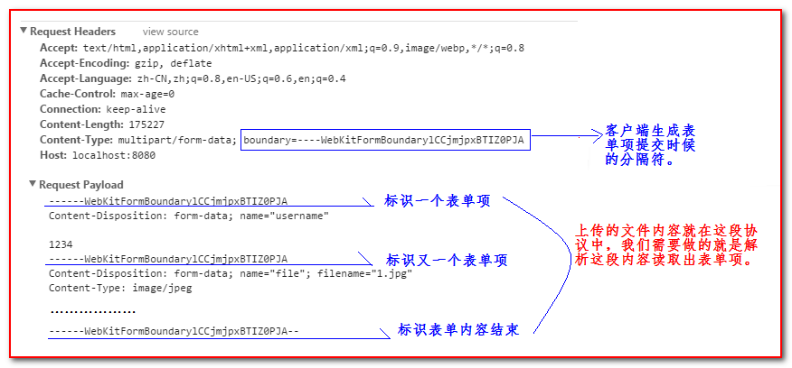

# 文件的上传与下载

#### 文件的上传和下载介绍

文件的上传和下载在web应用中是非常常用，也是非常有用的功能。

-   发送电子邮件时可以同过上传附件发送文件，OA系统中可以通过上传文件来提交公文，社交网站通过上传图片来自定义头像等等。

-   下载实际上只要资源放在用户可访问的目录中用户就可以直接通过地址下载，但是一些资源是存放到数据库中的，还有一些资源需要一定权限才能下载，这里就需要我们通过Servlet来完成下载的功能。

可以说上传和下载是每一个web应用都需要具有的一个功能，所以需要我们掌握。


## 文件上传

文件的上传主要分成两个步骤

-   在含有 `<input type="file">` 的表单页面中选择文件，然后将请求提交到Servlet

-   Servlet收到请求，解析用户上传的文件，然后将文件存储到服务器

### 文件上传的html格式要求

1.  上传表单的属性 method 必须为 post

2.  上传表单的属性 enctype 必须为 `multipart/form-data`

3.  表单项的 type 属性为file 即表示上传表单项，且该表单项name属性需要有值

    

### 文件上传HTTP 协议说明



要解析上面协议的内容。我们自己解析是很困难的。那我们怎么办呢。我们需要使用Apache组织给我们提供的一个叫做的jar包来解析。fileupload包需要依赖一个。所以我们只需要使用这两个jar包就可以解析得到我们想要的内容。具体如何使用，请看下面的java代码。

### 文件上传常用API

-   public static final boolean isMultipartContent(HttpServletRequest request)

    判断表单格式是否为 `multipart/form-data` 格式

-   public List parseRequest(HttpServletRequest req)

    解析request对象，获取请求参数，返回的是一个List，List中保存的是一个FileItem对象，一个对象代表一个请求表单项。

-   boolean FileItem.isFormField() 

    判断当前表单项是否是普通表单项。如果是普通项。返回true,如果是文件上传项。返回false

-   String FileItem.getFieldName()

    返回表单项的name属性值

-   String FileItem.getString()

    返回表单项的值。

-   String FileItem.getName();

    返回上传文件的文件名。

-   void FileItem.write( file );

    把上传的文件输入到指定的file位置

FileItemFactory 使用的是DiskFileItemFactory

解析Request对象使用ServletFileUpload类实例的.parseRequest(HttpServletRequest request)方法

### 代码示例

**JSP页面**

```jsp
<body>
  <form action="${pageContext.request.contextPath}/upload" method="post" enctype="multipart/form-data">
    用户名：<input type="text" name="username"><br>
    文件：<input type="file" name="test"><br>
    <input type="submit" value="点击提交">
  </form>
</body>
```

**接收的Servlet**

```java
protected void doPost(HttpServletRequest request, HttpServletResponse response) throws ServletException, IOException {

    // 判断请求是否为多段格式
    if (ServletFileUpload.isMultipartContent(request)) {
        DiskFileItemFactory fileItemFactory = new DiskFileItemFactory();
        // 创建文件上传对象
        FileUpload fileUpload = new FileUpload(fileItemFactory);
        List<FileItem> list = null;
        try {
            list = fileUpload.parseRequest(request);
            for (FileItem fileItem : list) {
                // 是否为表单的普通属性
                if (fileItem.isFormField()) {
                    // 获取表单中name属性的值
                    String fieldName = fileItem.getFieldName();
                    // 获取表单中value属性的值
                    String value = fileItem.getString("UTF-8");
                    System.out.println("非文件表单项：" + fieldName + " --> " + value);
                } else {
                    // 获取上传文件的名称
                    String fileName = fileItem.getName();
                    // 将文件保存到磁盘
                    fileItem.write(new File("e:/" + fileName));
                    System.out.println("已保存上传的文件：" + fileName);
                }
            }
        } catch (FileUploadException e) {
            e.printStackTrace();
        } catch (Exception e) {
            e.printStackTrace();
        }
    }
}
```