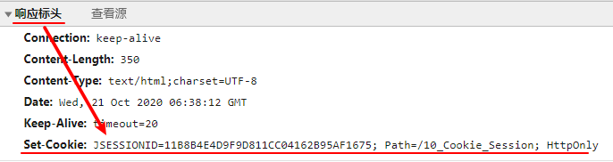

# Cookie与Session

## Cookie

Cookie直译过来是饼干，在JavaWeb中是指一种传输信息的技术。

**Cookie的特点**

-   Cookie由服务器生成，生成完毕后放在响应头中返回给客户端（浏览器）。

    

-   客户端每次访问服务器都会把可发送的Cookie全部发送给服务器。
-   Cookie的大小不能超过 4kb

### 服务器创建Cookie

在服务器上创建Cookie，这里可以在Servlet中创建Cookie

**代码示例**

```java
@WebServlet(value = "/cookieServlet")
public class CookieServlet extends BaseServlet {

    protected void createCookie(HttpServletRequest request, HttpServletResponse response) throws ServletException, IOException {
        // 先new 一个Cookie对象
        Cookie cookie = new Cookie("k1","v1");
        // 调用response.addCookie( cookie );
        response.addCookie(cookie);
        response.getWriter().write("创建好Cookie");
    }

}
```

>   注意：要Cookie生效，必须让Cookie对象添加到响应头中！

游览器查看客户端发送的Cookie


### 服务器获取客户端的Cookie

服务器可以在客户端的请求中获取Cookie类型的数组：`Cookie[] cookies = req.getCookies();`

**代码示例**

```java
public void getCookies(HttpServletRequest req, HttpServletResponse resp) {
    Cookie[] cookies = req.getCookies();
    Arrays.stream(cookies).forEach(c -> {
        System.out.println(c.getName() + " ---> " + c.getValue());
    });
}
```

执行结果：

```
username ---> leonardo
JSESSIONID ---> 043310DA0D4922336F089ADE1DBD433C
```

因此可以写一个专门用来根据Cookie名称获取Cookie的工具类

```java
public static Cookie getCookie(String cookieName, Cookie[] cookies) {
    for (Cookie cookie : cookies) {
        if (cookieName.equals(cookie.getName())) {
            return cookie;
        }
    }
    return null;
}
```

### Cookie值修改

Cookie的值的修改由两种方法

1.  直接创建同名cookie，加入响应体里覆盖之
2.  获取需要修改的cookie，然后调用cookie.setValue(str) 来修改

```java
public void modifyCookie(HttpServletRequest req, HttpServletResponse resp) {
    // 方案1
    Cookie cookie = new Cookie("targer", "value");
    resp.addCookie(cookie);
    
    // 方案2
    Cookie target = CookieUtil.getCookie("target", req.getCookies());
    target.setValue("value");
    resp.addCookie(target);
}
```

### Cookie超时控制

Cookie有超时控制，可以通过cookie中的 `setMaxAge(num)` 方法来控制Cookie的有效期时长（超过期限自动删除）

`setMaxAge(num)` 中，num的取值对应不同的超时控制：

-   num为正数：Cookie会在指定的**秒数**后才被会删除
-   num为负数：浏览器关闭的时候，就会同时删除Cookie（默认值-1）
-   num为0：浏览器收到响应后，马上删除Cookie。

**代码示例**

```java
protected void life120(HttpServletRequest req, HttpServletResponse resp) throws ServletException, IOException {
    Cookie cookie = new Cookie("k5","v5");
    cookie.setMaxAge(60*60);	// 表示一个小时后才会被删除
    resp.addCookie(cookie);
    resp.getWriter().write("创建了一个可以存活一个小时的Cookie");
}

protected void deleteNow(HttpServletRequest req, HttpServletResponse resp) throws ServletException, IOException {
    // 马上删除k2的Cookie
    Cookie cookie = CookieUtils.findCookie("k2", req.getCookies());
    if (cookie != null) {
        cookie.setMaxAge(0);//表示马上删除Cookie，
        resp.addCookie(cookie);
    }
    resp.getWriter().write("已经删除了k2的Cookie");
}

protected void defaultLife(HttpServletRequest req, HttpServletResponse resp) throws ServletException, IOException {
    Cookie cookie = new Cookie("k4","v4");
    cookie.setMaxAge(-1);
    resp.addCookie(cookie);
    resp.getWriter().write("已经创建好默认存活的Cookie");
}
```

### Cookie 有效路径 Path

每个客户端（浏览器）保存的 cookie 中，有一个path属性。该属性决定了客户端（浏览器）在访问url时，是否要将该Cookie发送给服务器（访问cookie过滤）。默认为访问每个url的工程路径（`http://ip:port/contextPath/`）。

#### 举例说明

-   假设：path=/13_cookie

    则：表示请求地址必须是http://ip:port/13_cookie/* 那么才会把cookie发送给服务器

-   假设：path=/13_cookie/abc

    则：表示请求地址必须是：http://ip:port/13_cookie/abc/*    那么才会把Cookie发送给服务器

-   假设：CookieA：path=/13_cookie；CookieB：path=/13_cookie/abc

    请求如下：

    -   http://ip:port/13_cookie/a.html

        ​	CookieA 会发

        ​	CookieB  不会发

    -   http://ip:port/14_cookie/a.html

        ​	CookieA 不会

        ​	CookieV  不会

    -   http://ip:port/13_cookie/abc/a.html

        ​	CookieA   会发

        ​	CookieB 会发

#### JavaWeb中设置 Cookie的Path

在JavaWeb中可以通过cookie对象的 `setPath(String path)` 设置。

>   注意，此处入参的path如果使用 ` /` ，则该 `/` 代表站点url（`http://ip:port/`）

**代码示例**

```java
public void testCookie(HttpServletRequest req, HttpServletResponse resp) {
    Cookie cookie = new Cookie("leonardo", "watch");
    resp.addCookie(cookie);
    
    Cookie cookie2 = new Cookie("leonardo2", "watch2");
    cookie2.setPath("/abc");
    resp.addCookie(cookie2);
    
    Cookie cookie3 = new Cookie("leonardo3", "watch3");
    cookie3.setPath(req.getContextPath() + "/abc");
    resp.addCookie(cookie3);
}
```

请求头信息：

```properties
Set-Cookie: leonardo=watch
Set-Cookie: leonardo2=watch2; Path=/abc
Set-Cookie: leonardo3=watch3; Path=/10_Cookie_Session/abc
```


## Session 会话

Session，会话，主要作用时用于维持客户端（浏览器）与服务器之间的联系，可以理解为某种数据的共享，传输。Session是一个域对象，在JavaWeb中以HttpSession接口的形式存在。

**Session 对象的特点**

-   一个客户端只会创建一个Session对象
-   每一个Session对象都有一个唯一的id标识
-   Session对象在同一次会话中只会在第一次访问时创建，其余都是直接通过key（id）获取Session对象

### Servlet 获取 Session 对象

Servlet中可以通过请求的 `getSession()` 方法获取当前的Session对象

```java
protected void createOrGet(HttpServletRequest request, HttpServletResponse response) throws ServletException, IOException {
    // 创建或获取Session对象
    HttpSession session = request.getSession();
}
```

### Session对象的API

| 方法名                                              | 方法描述                                  |
| --------------------------------------------------- | ----------------------------------------- |
| public long getCreationTime()                       | 获取创建Session对象                       |
| public String getId()                               | 获取Session对象的唯一标识                 |
| public long getLastAccessedTime()                   | 获取Session对象最后访问时间               |
| public ServletContext getServletContext()           | 获取上下文信息                            |
| public void setMaxInactiveInterval(int interval)    | 设置Session对象最大存活时间（非活动间隔） |
| public int getMaxInactiveInterval()                 | 获取Session对象最大存活时间（非活动间隔） |
| public Object getAttribute(String name)             | 获取Session域中key指定的值                |
| public Enumeration\<String> getAttributeNames()     | 获取Session域中key的集合                  |
| public void setAttribute(String name, Object value) | 在Session域中设置键值对                   |
| public void removeAttribute(String name)            | 在Session域中移除键值对                   |
| public void invalidate()                            | 销毁当前Session对象                       |
| public boolean isNew()                              | 判断当前Session对象是否为首次创建         |

#### Session超时控制说明

超时控制主要用到Session对象中的 `setMaxInactiveInterval` `getMaxInactiveInterval` `invalidate` 方法。

-   Session有超时时长，超过该时长，Session失效。

-   `public int getMaxInactiveInterval()` 可以获取Session默认的超时时长。以秒为单位。

-   Session默认超时时长为30min，Tomcat配置的位置：config\web.xml中 633 行处：

```xml
<!-- ==================== Default Session Configuration ================= -->
<!-- You can set the default session timeout (in minutes) for all newly   -->
<!-- created sessions by modifying the value below.                       -->

<session-config>
    <session-timeout>30</session-timeout>
</session-config>
```

>   注意：session超时的时长是指Session对象存在时，在没有访问的情况下，30分钟后失效，而不是从session创建开始计算时长。
>
>   （从方法名也可以看出 setMaxInactiveInterval ，’设置最大非活动间隔‘ 


### Session的实现原理

Session 会话技术是基于 Cookie 技术实现的。

**流程图**


## Cookie与Session的简单应用

### Cookie存储用户名与密码

需求：网页登陆时，若之前登陆过，则自动将之前登录的账号密码显示在输入框中，若没有登录，则正常显示（空行）

思路：判断用户登录，若登陆成功，则将用户名与密码存储在cookie中并返回客户端。在下一次载入登陆页面时使用EL表达式在输入框取出cookie的值，并显示在输入框即可。

**后台代码**

```java
public void login(HttpServletRequest req, HttpServletResponse resp) throws IOException {

    String username = req.getParameter("username");
    String password = req.getParameter("password");

    if (authentication(username, password)) {
        System.out.println("登陆成功，正在保存Cookie");

        Cookie cookie = new Cookie("username", username);
        cookie.setMaxAge(123456);
        resp.addCookie(cookie);
    } else {
        System.out.printf("登陆失败！");
    }
}

public boolean authentication(String principal, String credential) {
    return "leonardo".equals(principal) && "watch".equals(credential);
}
```

**网页代码**

```jsp
<%@ page contentType="text/html;charset=UTF-8" language="java" %>
<html>
    <head>
        <title>Title</title>
    </head>
    <body>

        <form action="${pageContext.request.contextPath}/cookietest">
            <input type="hidden" name="action" value="login">
            <input type="text" name="username" value="${cookie.username.value}"><br>
            <input type="password" name="password"><br>
            <input type="submit" value="提交"/>
        </form>
    </body>
</html>
```

### 表单重复提交之 —— 验证码

**表单重复提交的情景**

1.  服务器处理完请求后，使用请求转发来进行跳转。这个时候用户按下功能键F5，浏览器就会发起最后一次的请求，造成表单重复提交。

2.  当用户提交表单后，由于服务器迟迟（可以网络延迟，服务器卡顿等等原因）没有响应给客户端。用户以为，没有提交上。然后人情绪比较着急。就会多次点击提交。也会造成表单重复提交的现象。

3.  当用户提交完，也收到响应，但是用户按下浏览器的回退键。回到原来表单的页面，再次发起请求，也会造成表单重复提交。

表单重复提交有可能会造成数据冗余，错误，甚至导致重要数据的丢失，订单重复等，因此需要极力避免。

使用验证码可以在服务器端防止重复操作，从而阻止表单重复提交。

#### 验证码工作原理

1.  首先，经过服务器加载表单页面时，服务器会生成一个随机验证码放入Session域中，网页从Session域中获取验证码，用户根据网页显示的验证码，输入**用户的验证码**才可通过前端验证。
2.  服务器收到表单后，先从Session域中取出验证码并存储在一个临时变量中（此处称**临时验证码**），然后立刻销毁Session域中的验证码。接着取出**用户的验证码**并与**临时验证码**比较。

在表单只提交一次的情况下，临时验证码可以正常取出，如果用户输入正确，即可验证成功。

若表单重复提交，服务器在第一次接收到请求时已经把Session域中的验证码删除了，因此在后续提交的请求中，Session域中没有验证码，因此临时验证码为null，验证无法通过，也就无法执行后续操作了。


#### 简单验证码实现：按照请求路径来实现代码

1.  登入入口jsp页面

    ```jsp
    <%@ page contentType="text/html;charset=UTF-8" language="java" %>
    <html>
        <head>
            <title>Title</title>
        </head>
        <body>
            <%-- 先到生成验证码的服务器，由服务器转发/重定向到表单提交页面 --%>
            <a href="${pageContext.request.contextPath}/dispatcherServlet?action=login"> 登录页 </a>
        </body>
    </html>
    ```

2.  生成验证码的服务器

    ```java
    @WebServlet(name = "dispatcherServlet", urlPatterns = "/dispatcherServlet")
    public class DispatcherServlet extends BaseServlet {
        
        protected void login(HttpServletRequest req, HttpServletResponse resp) throws ServletException, IOException {
            // 模拟生成验证码
            String code = "vfdh";
            // 加入Session域
            req.getSession().setAttribute("confirmCode", code);
            // 转发到登陆页面（重定向也可以）
            req.getRequestDispatcher("/formPage.jsp").forward(req, resp);
        }
    }
    ```

3.  转发到表单jsp页面

    ```jsp
    <%@ page contentType="text/html;charset=UTF-8" language="java" %>
    <html>
        <head>
            <title>表单提交页面</title>
        </head>
        <body>
    
            <form action="${pageContext.request.contextPath}/loginServlet">
                <input type="hidden" name="action" value="login">
    
                账号： <input type="text" name="loginAccount"> <br>
                密码： <input type="password" name="loginPassword"> <br>
                验证码： <input type="text" name="confirmCode"> --> <span>${sessionScope.confirmCode}</span>
                <input type="submit" value="提交">
    
            </form>
        </body>
    </html>
    ```

4.  表单提交到的服务器，进行验证码验证

    ```java
    @WebServlet(name = "LoginServlet", urlPatterns = "/loginServlet")
    public class LoginServlet extends BaseServlet {
    
        protected void login(HttpServletRequest req, HttpServletResponse resp) throws ServletException, IOException, InterruptedException {
            // 先获取session域中的验证码数据
            String sessionConfirmCode = (String) req.getSession().getAttribute("confirmCode");
            // 在进行验证码验证之前删除
            req.getSession().removeAttribute("confirmCode");
    
            // 模拟网络卡顿的情况
            Thread.sleep(3000);
    
            // 获取用户数据
            String loginAccount = req.getParameter("loginAccount");
            String loginPassword = req.getParameter("loginPassword");
            // 获取用户的验证码
            String userConfirmCode = req.getParameter("confirmCode");
            try {
                // 对比 临时验证码 与 用户验证码
                if (sessionConfirmCode.equals(userConfirmCode)) {
                    System.out.println("用户验证成功！");
                    System.out.println("登陆成功，用户名为：" + loginAccount + "\t 密码为：" + loginPassword);
                }
            } catch (NullPointerException e) {
                // 发生空指针异常说明表单重复提交了
                System.err.println("请勿重复提交表单！！");
            }
        }
    }
    ```

**测试**

在输入验证码之后，狂点登录模拟表单提交


后台输出：


测试成功！

#### 谷歌kaptcha图片验证码的使用

谷歌简化了验证流程生成验证码的与将验证码设置到session域中的流程，Coder只需要编写表单提交服务器即可。

##### 具体步骤

1.  导入 kaptcha-2.3.2.jar 包

2.  将验证码映射到jar包准备的servlet上，用于生成验证码与加入Session域

    ```xml
    <servlet>
        <!-- 自动生成随机验证码，及加入session域的处理器 -->
        <servlet-name>KaptchaServlet</servlet-name>
        <servlet-class>com.google.code.kaptcha.servlet.KaptchaServlet</servlet-class>
    </servlet>
    <servlet-mapping>
        <servlet-name>KaptchaServlet</servlet-name>
        <!-- 访问该路径是生效 -->
        <url-pattern>/kaptcha.jpg</url-pattern>
    </servlet-mapping>
    ```

3.  在需要验证码的页面通过 img的src标签访问KaptchaServlet

    ```html
    
    ```

4.  在服务器代码中，获取Session中的验证码，和用户验证码比较

    ```java
    protected void login(HttpServletRequest req, HttpServletResponse resp) throws ServletException, IOException, InterruptedException {
        // 先获取session域中的验证码数据
        String sessionConfirmCode = (String) req.getSession().getAttribute(Constants.KAPTCHA_SESSION_KEY);
        // 在进行验证码验证之前删除
        req.getSession().removeAttribute(Constants.KAPTCHA_SESSION_KEY);
    
        // 模拟网络卡顿的情况
        Thread.sleep(3000);
    
        // 获取用户数据
        String loginAccount = req.getParameter("loginAccount");
        String loginPassword = req.getParameter("loginPassword");
        // 获取用户的验证码
        String userConfirmCode = req.getParameter("confirmCode");
        try {
            // 对比 临时验证码 与 用户验证码
            if (sessionConfirmCode.equals(userConfirmCode)) {
                System.out.println("用户验证成功！");
                System.out.println("登陆成功，用户名为：" + loginAccount + "\t 密码为：" + loginPassword);
            }
        } catch (NullPointerException e) {
            // 发生空指针异常说明表单重复提交了
            System.err.println("请勿重复提交表单！！");
        }
    }
    ```

    >   此处的 Constants.KAPTCHA_SESSION_KEY 是 kaptcha 下的一个常量，是Session中验证码的key。

#### 浏览器缓存说明

