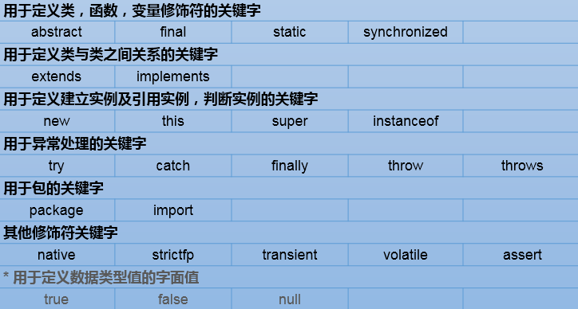

# 关键字和标识符

## java关键字的使用

什么是关键字：被java语言赋予了特殊含义的字符串（单词）。

例如：HelloWorld案例中，出现的关键字有 public  、 class  、 static  、 void  等，这些单

词已经被Java定义，具有明确的含义。

关键字的特点：全部都是 小写字母 。

Java有哪些关键字：

## 保留字：现Java版本尚未使用，但以后版本可能会作为关键字使用。

具体哪些保留字：goto 、const

注意：自己命名标识符时要避免使用这些保留字

## 标识符的使用

标识符概念：即给类、变量、方法、包等命名的字符序列，称为标识符。

简单的说，凡是程序员自己命名的部分都可以称为标识符。

#### 标识符的命名规则（必须遵守）

（1）组成：英文大小写字母，数字，下划线_，美元符号$

（2）数字不能开头

（3）严格区分大小写

（4）不能使用Java的关键字（包含保留字）和特殊值

#### 标识符的命名规范（遭受鄙视）

（1）见名知意

（2）类名、接口名等：每个单词的首字母都大写，形式：XxxYyyZzz，

​	例如：HelloWorld，String，System等

（3）变量、方法名等：从第二个单词开始首字母大写，其余字母小写，形式：xxxYyyZzz，

​	例如：age,name,bookName,main

（4）包名等：每一个单词都小写，单词之间使用点.分割，形式：xxx.yyy.zzz，

​	例如：java.lang

（5）常量名等：每一个单词都大写，单词之间使用下划线_分割，形式：XXX_YYY_ZZZ，

​	例如：MAX_VALUE,PI