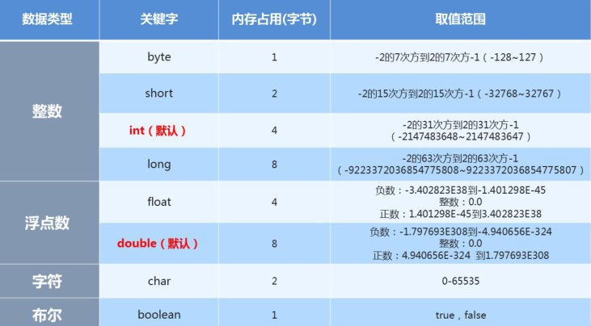

# 数据类型（data type）

## 数据类型分类

Java是一种强类型的语言，针对每一种数据都定义了数据类型，不同类型的数据二进制表示方式不同，分配的空间大小也有区别，java数据类型主要分为两大类：（定义变量需要确定数据类型，即确定数据使用的空间大小和二进制表示形式）

-   基本数据类型：包括 整数 、 浮点数 、 字符 、 布尔 。
-   引用数据类型：包括 类 、 数组 、 接口 。


## 基本数据类型



>   Java中的默认类型：整数类型是 int  、浮点类型是 double

-   常量整数值都是int类型，占用4个字节空间。程序运行期间byte、short、char、boolean实际都是占用4个字节内存空间， 但在逻辑上：  byte只有低8位有效空间。  short只有低16位有效空间。  所以，可以直接把一个byte范围内的整数常量值直接赋给byte类型变量。short同理。byte b=10; 赋值给int，只要在int范围即可。 赋值给long，在int范围内的，可以加也可以不用加L，会自动升级为long，如果数字超过int范围，必须加L。
-   小数常量值，无论多少，不加F，就是double类型。


## 基本数据类型的存储范围

#### 整型系列

1.  byte：字节类型

    占内存：1个字节 存储范围：-128~127

2.  short：短整型类型

    占内存：2个字节 存储范围：-32768~32767

3.  int：整型

    占内存：4个字节 存储范围：-2的31次方 ~ 2的31次方-1

4.  long：整型

    占内存：8个字节 存储范围：-2的63次方 ~ 2的63次方-1

>   注意：如果要表示某个超过int范围的常量整数它是long类型，那么需要在数字后面加L

#### 浮点型系列（小数）

1.  float：单精度浮点型

    占内存：4个字节 精度：科学记数法的小数点后6~7位

2.  double：双精度浮点型

    占内存：8个字节 精度：科学记数法的小数点后15~16位

#### 单字符类型：char

​	占内存：2个字节 使用单引号

#### 布尔类型  

​	boolean：只能存储true或false


## 基本数据类型转换

在Java程序中，不同的基本数据类型的值经常需要进行相互转换。Java语言所提供的七种数值类型之间可以相互转换，基本数据类型转换有两种转换方式：自动类型转换和强制类型转换。

#### 自动类型转换

将 取值范围小的类型 自动提升为 取值范围大的类型  。

基本数据类型按照取值范围从小到大的关系，如图所示：

以下情况会发生自动类型转换（隐式类型转换）：

1.   ##### 当把存储范围小的值（常量值、变量的值、表达式计算的结果值）赋值给了存储范围大的变量时，

```java
int i = 'A';//char自动升级为int
double d = 10;//int自动升级为double
byte b = 127; //右边的整数常量值必须在-128~127范围内
//byte bigB = 130;//错误，右边的整数常量值超过byte范围
long num = 1234567; //右边的整数常量值如果在int范围呢，编译和运行都可以通过，这里涉及到数据
类型转换
long bigNum = 12345678912L;//右边的整数常量值如果超过int范围，必须加L，否则编译不通过
```

2.  ##### 当存储范围小的数据类型与存储范围大的数据类型一起混合运算时，会按照其中最大的类型运算

```java
int i = 1;
byte b = 1;
double d = 1.0;
double sum = i + b + d;//混合运算，升级为double
```

3.  ##### 当byte,short,char数据类型进行算术运算时，按照int类型处理

```java
byte b1 = 1;
byte b2 = 2;
byte b3 = b1 + b2;//编译报错，b1 + b2自动升级为int
char c1 = '0';
char c2 = 'A';
System.out.println(c1 + c2);//113
```

#### 强制类型转换

将 取值范围大的类型 转换成 取值范围小的类型 时需要进行强制（显示）类型转换。

```java
int i = 1.5; // 错误
int i = (int)1.5; // 强制类型转换,正确
```

>   强制类型转换有风险，可能会损失精度或溢出

#### 特殊的数据类型转换

任意数据类型的数据与String类型进行“+”运算时，结果一定是String类型

```java
System.out.println("" + 1 + 2);     // 结果为12
```