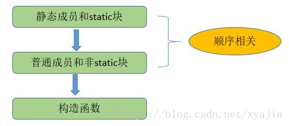
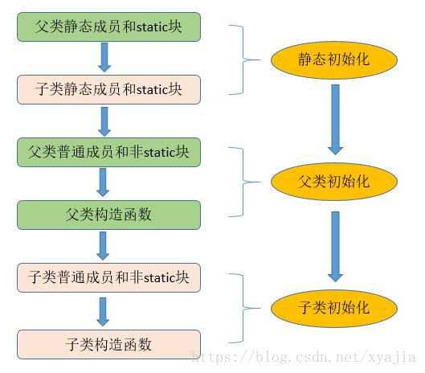

# 多态

## 多态简述

生活中：一个事物在不同的条件下呈现不同的特征状态，如水在100度下呈液态，100度以上呈气态。

#### Java中的多态

##### 书写格式

```java
父类类型 变量名 = 子类对象；
Ainmal a=new Dog();
```

>   编译期a是个动物，运行时a是个狗；new 个Dog，a就是狗，new个Cat，a就是猫

##### 代码如下:

```java
public class Test2 {
    public static void main(String[] args) {
        Animal a=new Animal();
        a.eat();
        Dog d=new Dog();
        d.eat();
        System.out.println("----------------");
        //多态写法：父类的引用指向子类的对象。
        Animal a1=new Dog();//狗也是一个动物
        a1.eat();//运行时动态的调用了Dog的eat方法
        Animal a2=new Cat();//猫也是一个动物
        a2.eat();//运行时调用Cat的eat方法
    }
}
```

#### 多态的理解

引用类型变量在编译期呈现左边父类的行为特征，运行时呈现右边创建的不同子类对象的行为特征。

**即：编译看左边，运行看右边。**

```java
public class Test {
    public static void main(String[] args) {
        // 多态形式，创建对象
        Animal a1 = new Cat();  
        // 调用的是 Cat 的 eat
        a1.eat();    
        //a1.catchMouse();//错误，遍看左边，catchMouse()是子类特有的方法，左边父类中没有，编译失败
        // 多态形式，创建对象Animal a2 = new Dog(); 
        // 调用的是 Dog 的 eat
        a2.eat();               
    }  
}
```

>   注意：属性没有多态一说，在编译器即确定下来（左边的类型）

#### 多态的前提

1.  有继承关系
2.   有方法重写

如果没有方法重写，运行时调用子类的方法，实际还是调用的从父类继承的方法，不具有多态性。

#### 多态的好处  

1.  提高程序的扩展性（参考引入案例分析）
2.  降低类与类直接耦合度（参考引入案例分析）


## 多态的应用

#### 多态应用在形参实参

父类类型作为方法形式参数，子类对象为实参。

代码如下：

```java
public class Test01 {
    public static void main(String[] args) {
        showAnimalEat(new Dog()); //形参 Animal a,实参new Dog() 
                                //实参给形参赋值   Animal a = new Dog()   多态引用
        showAnimalEat(new Cat());//形参 Animal a,实参new Cat() 
                                //实参给形参赋值   Animal a = new Cat()   多态引用
    }
    
    /*
     * 设计一个方法，可以查看所有动物的吃的行为
     * 关注的是所有动物的共同特征：eat()
     * 所以形参，设计为父类的类型
     *  此时不关注子类特有的方法
     */
    public static void showAnimalEat (Animal a){
        a.eat();
//        a.catchMouse();//错误，因为a现在编译时类型是Animal，只能看到父类中有的方法
    }
}
```

#### 多态应用在数组  

数组元素类型声明为父类类型，实际存储的是子类对象

```java
public class Test02 {
    public static void main(String[] args) {
        /*
         * 声明一个数组，可以装各种动物的对象，看它们吃东西的样子*/
        Animal[] arr = new Animal[2]; //此时不是new Animal的对象，而是new Animal[]的数组对象
                                    //在堆中开辟了长度为5的数组空间，用来装Animal或它子类对象的地址
        arr[0] = new Cat();//多态引用   左边arr[0] 是Animal类型，右边是new Cat()
                            //把Cat对象，赋值给Animal类型的变量
        arr[1] = new Dog();
        
        for (int i = 0; i < arr.length; i++) {
            arr[i].eat();
//          arr[i].catchMouse();错误，因为arr[i]现在编译时类型是Animal，只能看到父类中有的方法
        }
    }
}
```

#### 多态应用在返回值  

方法的返回值类型声明为父类的类型，实际返回值是子类对象

```java
public class Test03 {
    public static void main(String[] args) {
        Animal c = buy("猫咪");
        System.out.println(c.getClass());
        c.eat();
    }
    /*
     * 设计一个方法，可以购买各种动物的对象，此时不确定是那种具体的动物
     * 
     * 返回值类型是父类的对象
     * 
     * 多态体现在   返回值类型  Animal ，实际返回的对象是子类的new Cat()，或new Dog()
     */
    public static Animal buy(String name){
        if("猫咪".equals(name)){
            return new Cat();
        }else if("小狗".equals(name)){
            return new Dog();
        }
        return null;
    }
}
```


## 向上转型与向下转型

首先，一个对象在new的时候创建是哪个类型的对象，它从头至尾都不会变。即这个对象的运行时类型，本质的类型用于不会变。这个和基本数据类型的转换是不同的。

但是，把这个对象赋值给不同类型的变量时，这些变量的编译时类型却不同。

```java
class Animal {  
    void eat(){
        System.out.println("~~~"); 
    } 
}  
class Cat extends Animal {  
    public void eat() {  
        System.out.println("吃鱼");  
    }  
    public void catchMouse() {  
        System.out.println("抓老鼠");  
    }  
}
class Dog extends Animal {  
    public void eat() {  
        System.out.println("吃骨头");  
    }  
    public void watchHouse() {  
        System.out.println("看家");  
    }  
}
class Test{
    public static void main(String[] args){
        Cat a = new Cat();//a编译时类型是Cat
        Animal b = a;//b编译时类型是Animal
        Object c = a;//c编译时类型是Object
        
        //运行时类型
        System.out.println(a.getClass());
        System.out.println(b.getClass());
        System.out.println(c.getClass());
        //以上输出都一样，都是Cat类型
        
        //a,b,c的编译时类型不同
        //通过a能调用Cat中所有方法，包括从父类继承的，包括自己扩展的
        //通过b只能调用Animal类及它的父类有的方法，不能调用Cat扩展的方法
        //通过c只能调用Object类才有的方法
    }
}
```

为什么要类型转换呢？

因为多态，就一定会有把子类对象赋值给父类变量的时候，这个时候，在编译期间，就会出现类型转换

的现象。

但是，使用父类变量接收了子类对象之后，我们就不能调用子类拥有，而父类没有的方法了。这也是多

态给我们带来的一点"小麻烦"。所以，想要调用子类特有的方法，必须做类型转换。

-   向上转型：当左边的变量的类型（父类） > 右边对象/变量的类型（子类），我们就称为向上转型

-   -   此时，编译时按照左边变量的类型处理，就只能调用父类中有的变量和方法，不能调用子类
    -   特有的变量和方法了
    -   但是，运行时，仍然是对象本身的类型
    -   此时，一定是安全的，而且也是自动完成的

-   向下转型：当左边的变量的类型（子类）<右边对象/变量的类型（父类），我们就称为向下转型
-   此时，编译时按照左边变量的类型处理，就可以调用子类特有的变量和方法了
-   但是，运行时，仍然是对象本身的类型
-   此时，不一定是安全的，需要使用(类型)进行强制类型转换
-   不是所有通过编译的向下转型都是正确的，可能会发生ClassCastException，为了安全，可以通过isInstanceof关键字进行判断

示例代码：

```java
public class Test {
    public static void main(String[] args) {
        // 向上转型  
        Animal a = new Cat();  
        a.eat();                // 调用的是 Cat 的 eat// 向下转型  
        Cat c = (Cat)a;       
        c.catchMouse();         // 调用的是 Cat 的 catchMouse
        
        // 向下转型  
        //Dog d = (Dog)a;     //这段代码可以通过编译，但是运行时，却报出了ClassCastException 
        //这是因为，明明创建了Cat类型对象，运行时，当然不能转换成Dog对象的。这两个类型并没有任何继承关系，       //不符合类型转换的定义。
        //d.watchHouse();        // 调用的是 Dog 的 watchHouse 
        
        Animal a2 = new Animal();
       // Dog d2 = (Dog)a2;//这段代码可以通过编译，但是运行时，却报出了ClassCastException 
       // d2.watchHouse(); // 调用的是 Dog 的 watchHouse
    }  
}
```

为了避免ClassCastException的发生，Java提供了 `instanceof`  关键字，给引用变量做类型的校验，只要用instanceof判断返回true的，那么强转为该类型就一定是安全的，不会报ClassCastException异常。

-   对象/变量的编译时类型 与 instanceof后面数据类型是直系亲属关系才可以比较
-   对象/变量的运行时类型<= instanceof后面数据类型，才为true


## Java类的初始化顺序

对于静态变量、静态初始化块、变量、初始化块、构造器，它们的初始化顺序依次是

静态变量、静态初始化块 > 变量、初始化块 >构造器。

初始化顺序图示：






#### 属性赋值的顺序

1.  默认初始化
2.  显式初始化
3.  构造器初始化
4.  使用 . 或 get/set方法访问